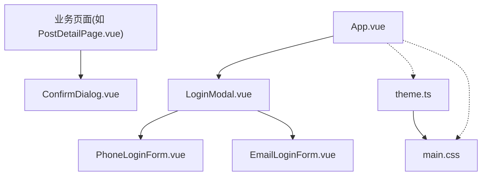
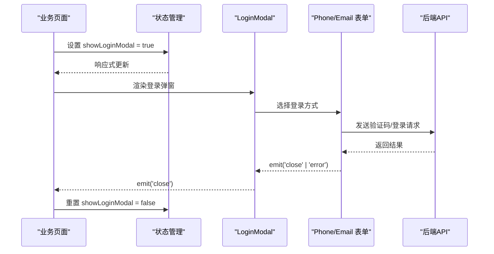
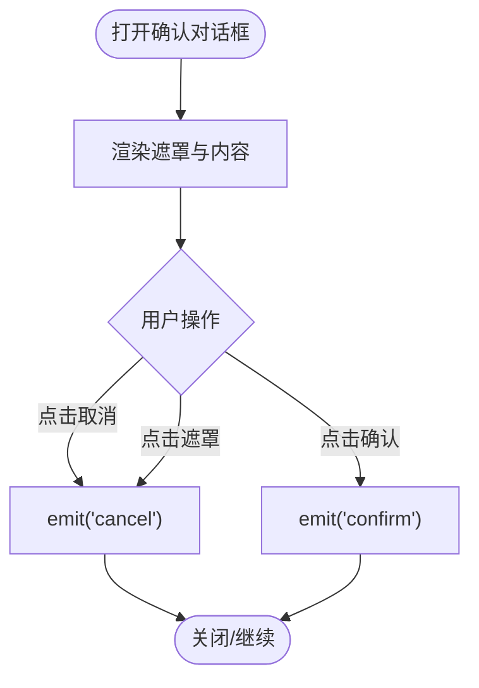
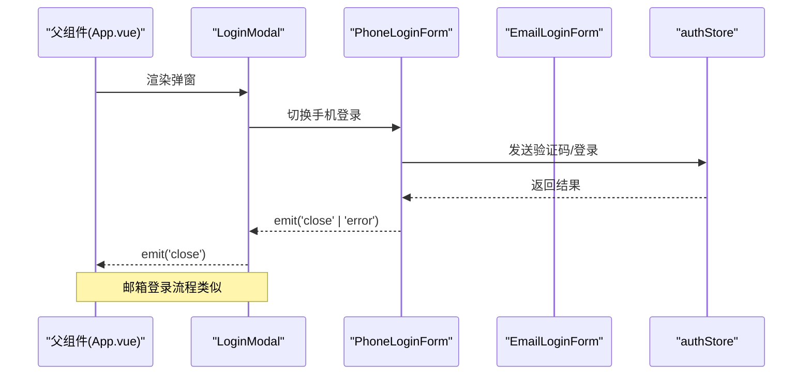
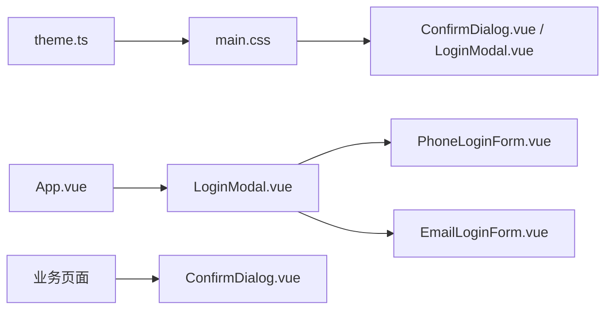

# 对话框组件

<cite>
**本文引用的文件**
- [ConfirmDialog.vue](file://web/app/src/components/common/ConfirmDialog.vue)
- [LoginModal.vue](file://web/app/src/components/common/LoginModal.vue)
- [PhoneLoginForm.vue](file://web/app/src/components/common/PhoneLoginForm.vue)
- [EmailLoginForm.vue](file://web/app/src/components/common/EmailLoginForm.vue)
- [App.vue](file://web/app/src/App.vue)
- [PostDetailPage.vue](file://web/app/src/views/PostDetailPage.vue)
- [theme.ts](file://web/app/src/stores/theme.ts)
- [main.css](file://web/app/src/styles/main.css)
</cite>

## 目录
1. [简介](#简介)
2. [项目结构](#项目结构)
3. [核心组件](#核心组件)
4. [架构总览](#架构总览)
5. [详细组件分析](#详细组件分析)
6. [依赖关系分析](#依赖关系分析)
7. [性能与可访问性](#性能与可访问性)
8. [故障排查指南](#故障排查指南)
9. [结论](#结论)
10. [附录：使用示例与样式定制](#附录使用示例与样式定制)

## 简介
本章节文档聚焦 Subskin 前端的两个通用对话框组件：
- ConfirmDialog 确认对话框：用于二次确认操作（如删除、提交等），提供标题、内容、按钮文案、加载态与自定义样式能力。
- LoginModal 登录模态框：统一入口的登录/注册弹窗，支持手机验证码/密码登录与邮箱验证码/密码登录，并内置条款同意与错误提示。

文档将详细说明 Props 接口、事件机制、主题与响应式适配方案，并提供在不同业务场景下的调用示例与最佳实践。

## 项目结构
对话框组件位于 web/app/src/components/common 目录下，由父级应用 App.vue 挂载登录模态框；确认对话框可在任意页面按需渲染。主题系统通过 stores/theme.ts 与全局样式 main.css 实现明暗模式与主色相切换。

图表来源
- [App.vue:1-17](file://web/app/src/App.vue#L1-L17)
- [LoginModal.vue:1-69](file://web/app/src/components/common/LoginModal.vue#L1-L69)
- [PhoneLoginForm.vue:1-157](file://web/app/src/components/common/PhoneLoginForm.vue#L1-L157)
- [EmailLoginForm.vue:1-143](file://web/app/src/components/common/EmailLoginForm.vue#L1-L143)
- [theme.ts:1-71](file://web/app/src/stores/theme.ts#L1-L71)
- [main.css:1-213](file://web/app/src/styles/main.css#L1-L213)

章节来源
- [App.vue:1-17](file://web/app/src/App.vue#L1-L17)
- [ConfirmDialog.vue:1-60](file://web/app/src/components/common/ConfirmDialog.vue#L1-L60)
- [LoginModal.vue:1-69](file://web/app/src/components/common/LoginModal.vue#L1-L69)
- [theme.ts:1-71](file://web/app/src/stores/theme.ts#L1-L71)
- [main.css:1-213](file://web/app/src/styles/main.css#L1-L213)

## 核心组件
- ConfirmDialog 确认对话框
  - 作用：统一的二次确认弹窗，替代分散的浏览器 confirm() 或自实现弹窗。
  - 关键特性：Teleport 到 body、遮罩点击关闭、加载禁用按钮、可配置标题/消息/按钮文案与确认按钮样式类名。
- LoginModal 登录模态框
  - 作用：统一登录入口，聚合手机号与邮箱两种登录方式。
  - 关键特性：Tab 切换登录方式、表单校验、倒计时、错误提示透传、条款链接、点击遮罩关闭。

章节来源
- [ConfirmDialog.vue:1-60](file://web/app/src/components/common/ConfirmDialog.vue#L1-L60)
- [LoginModal.vue:1-69](file://web/app/src/components/common/LoginModal.vue#L1-L69)

## 架构总览
- 登录流程：业务页面触发登录需求 → 设置 store 标志位 → App.vue 条件渲染 LoginModal → 子表单完成认证后 emit close → 关闭弹窗。
- 确认流程：业务页面展示 ConfirmDialog → 用户点击确认/取消 → 组件 emit 对应事件 → 业务侧执行副作用（如删除、提交）。

图表来源
- [App.vue:1-17](file://web/app/src/App.vue#L1-L17)
- [LoginModal.vue:1-69](file://web/app/src/components/common/LoginModal.vue#L1-L69)
- [PhoneLoginForm.vue:1-157](file://web/app/src/components/common/PhoneLoginForm.vue#L1-L157)
- [EmailLoginForm.vue:1-143](file://web/app/src/components/common/EmailLoginForm.vue#L1-L143)

## 详细组件分析

### ConfirmDialog 确认对话框
- 设计要点
  - 使用 Teleport 挂载至 body，避免层级与定位问题。
  - 遮罩层点击触发取消事件，提升易用性。
  - 支持 loading 态，禁用按钮防止重复提交。
  - 可自定义确认按钮样式类名，便于按场景强调风险操作。
- Props 接口
  - visible: boolean — 控制显示/隐藏
  - title?: string — 标题
  - message?: string — 正文内容
  - confirmText?: string — 确认按钮文案
  - cancelText?: string — 取消按钮文案
  - confirmClass?: string — 确认按钮额外样式类
  - loading?: boolean — 是否处于处理中
- 事件
  - confirm: 用户点击确认时触发
  - cancel: 用户点击取消或遮罩时触发
- 数据流与交互
  - 父组件通过 visible 控制显隐
  - 子组件通过 emit 通知父组件用户行为
  - 父组件在 confirm 回调中执行业务逻辑（如删除、提交）

图表来源
- [ConfirmDialog.vue:1-60](file://web/app/src/components/common/ConfirmDialog.vue#L1-L60)

章节来源
- [ConfirmDialog.vue:1-60](file://web/app/src/components/common/ConfirmDialog.vue#L1-L60)

### LoginModal 登录模态框
- 设计要点
  - 以 Tab 形式切换“手机”和“邮箱”登录方式。
  - 内部委托 PhoneLoginForm / EmailLoginForm 处理具体表单逻辑。
  - 统一错误提示区域，透传子表单的错误信息。
  - 支持条款链接与隐私政策跳转，点击自动关闭弹窗。
- 事件
  - close: 关闭弹窗（点击遮罩、右上角关闭按钮、表单成功登录后）
  - error(msg): 子表单错误时向上抛出错误消息
- 子组件协作
  - PhoneLoginForm：支持验证码登录、密码登录、注册；包含号码校验、验证码倒计时、历史号码建议。
  - EmailLoginForm：支持验证码登录、密码登录、注册；包含邮箱校验、验证码倒计时。
- 数据流与交互
  - 父组件监听 close 事件关闭弹窗
  - 子表单成功后 emit('close')，失败 emit('error')
  - 错误消息在弹窗顶部统一展示

图表来源
- [LoginModal.vue:1-69](file://web/app/src/components/common/LoginModal.vue#L1-L69)
- [PhoneLoginForm.vue:1-157](file://web/app/src/components/common/PhoneLoginForm.vue#L1-L157)
- [EmailLoginForm.vue:1-143](file://web/app/src/components/common/EmailLoginForm.vue#L1-L143)

章节来源
- [LoginModal.vue:1-69](file://web/app/src/components/common/LoginModal.vue#L1-L69)
- [PhoneLoginForm.vue:1-157](file://web/app/src/components/common/PhoneLoginForm.vue#L1-L157)
- [EmailLoginForm.vue:1-143](file://web/app/src/components/common/EmailLoginForm.vue#L1-L143)

## 依赖关系分析
- 组件耦合
  - LoginModal 强依赖 PhoneLoginForm 与 EmailLoginForm，负责路由与错误聚合。
  - ConfirmDialog 无外部依赖，仅通过事件与父组件通信，内聚度高。
- 状态与样式
  - 主题切换由 theme.ts 驱动，通过 CSS 变量影响全局颜色体系，对话框组件自然继承。
  - 全局样式 main.css 定义了按钮、卡片、输入框等基础样式，对话框复用这些样式保证一致性。
- 路由与导航
  - 登录弹窗中的条款链接使用 router-link，点击后关闭弹窗，避免遮挡。

图表来源
- [theme.ts:1-71](file://web/app/src/stores/theme.ts#L1-L71)
- [main.css:1-213](file://web/app/src/styles/main.css#L1-L213)
- [LoginModal.vue:1-69](file://web/app/src/components/common/LoginModal.vue#L1-L69)
- [PhoneLoginForm.vue:1-157](file://web/app/src/components/common/PhoneLoginForm.vue#L1-L157)
- [EmailLoginForm.vue:1-143](file://web/app/src/components/common/EmailLoginForm.vue#L1-L143)
- [App.vue:1-17](file://web/app/src/App.vue#L1-L17)
- [ConfirmDialog.vue:1-60](file://web/app/src/components/common/ConfirmDialog.vue#L1-L60)

章节来源
- [theme.ts:1-71](file://web/app/src/stores/theme.ts#L1-L71)
- [main.css:1-213](file://web/app/src/styles/main.css#L1-L213)
- [App.vue:1-17](file://web/app/src/App.vue#L1-L17)

## 性能与可访问性
- 性能
  - 使用 Teleport 将弹窗渲染到 body，减少 DOM 层级与重排成本。
  - 登录表单采用懒渲染（仅在弹窗可见时），降低首屏开销。
  - 按钮在 loading 态禁用，避免重复请求。
- 可访问性
  - 遮罩点击关闭符合直觉，减少键盘操作负担。
  - 输入框具备明确 label 与占位符，配合 focus ring 提升可达性。
  - 按钮最小触控高度满足移动端可点击要求。

[本节为通用指导，不直接分析具体文件]

## 故障排查指南
- 登录弹窗无法关闭
  - 检查父组件是否正确监听 close 事件并重置显示状态。
  - 参考 App.vue 中对 showLoginModal 的控制逻辑。
- 表单错误未显示
  - 确保子表单 emit('error', msg) 被 LoginModal 接收并在顶部区域渲染。
- 确认对话框无效
  - 检查 visible 绑定是否正确，以及 confirm/cancel 事件是否被父组件处理。
- 主题切换异常
  - 确认 theme.ts 已正确写入/读取 localStorage，并给 html 元素添加/移除 dark 类。
  - 检查 main.css 中 CSS 变量与 Tailwind 的映射是否生效。

章节来源
- [App.vue:1-17](file://web/app/src/App.vue#L1-L17)
- [LoginModal.vue:1-69](file://web/app/src/components/common/LoginModal.vue#L1-L69)
- [ConfirmDialog.vue:1-60](file://web/app/src/components/common/ConfirmDialog.vue#L1-L60)
- [theme.ts:1-71](file://web/app/src/stores/theme.ts#L1-L71)

## 结论
ConfirmDialog 与 LoginModal 提供了稳定、可复用的对话框能力：前者专注轻量确认，后者整合多通道登录。二者均遵循清晰的 Props/Events 契约，易于集成与扩展。结合主题系统与全局样式，可快速适配不同品牌与深色模式需求。

[本节为总结性内容，不直接分析具体文件]

## 附录：使用示例与样式定制

### 使用示例
- 在业务页面触发登录
  - 当检测到未登录时，设置 store 的标志位以显示登录弹窗。
  - 参考：在需要鉴权的操作中判断登录态，若未登录则触发登录弹窗。
- 在业务页面进行确认操作
  - 渲染 ConfirmDialog，绑定 visible 与事件处理器，在 confirm 回调中执行删除或提交等操作。
  - 参考：在删除帖子等高风险操作中，先弹出确认对话框，再调用删除接口。

章节来源
- [PostDetailPage.vue:150-349](file://web/app/src/views/PostDetailPage.vue#L150-L349)
- [App.vue:1-17](file://web/app/src/App.vue#L1-L17)

### 样式定制与主题切换
- 主题切换
  - 通过 theme.ts 切换明暗模式与主色相，对话框组件自动继承主题。
- 确认按钮样式
  - 使用 confirmClass 传入自定义类名，覆盖默认样式，突出风险提示。
- 响应式适配
  - 弹窗容器使用全宽与最大宽度限制，在小屏设备上保持良好可读性与触控体验。
  - 输入框与按钮遵循全局最小触控高度规范，提升移动端可用性。

章节来源
- [theme.ts:1-71](file://web/app/src/stores/theme.ts#L1-L71)
- [main.css:1-213](file://web/app/src/styles/main.css#L1-L213)
- [ConfirmDialog.vue:1-60](file://web/app/src/components/common/ConfirmDialog.vue#L1-L60)