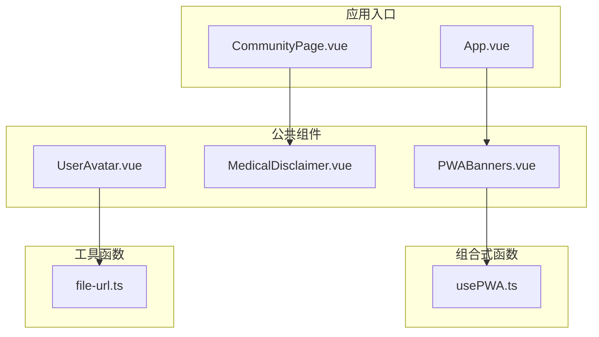
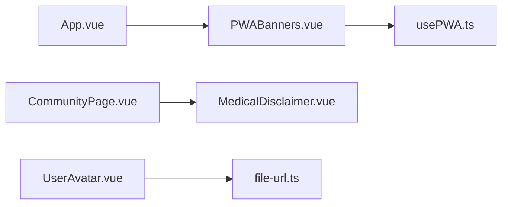
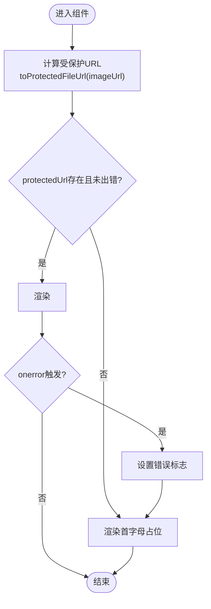
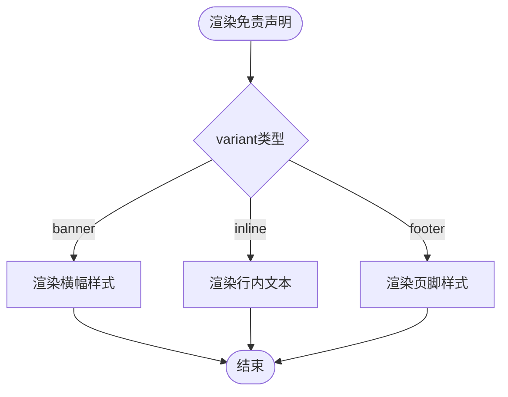
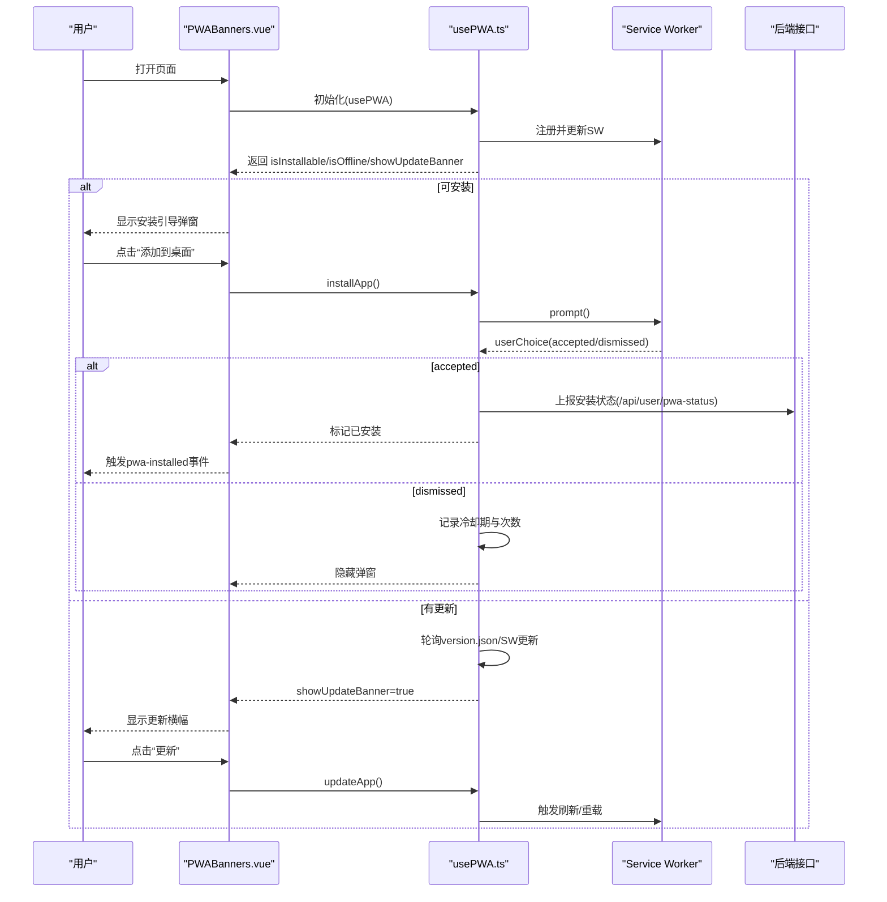
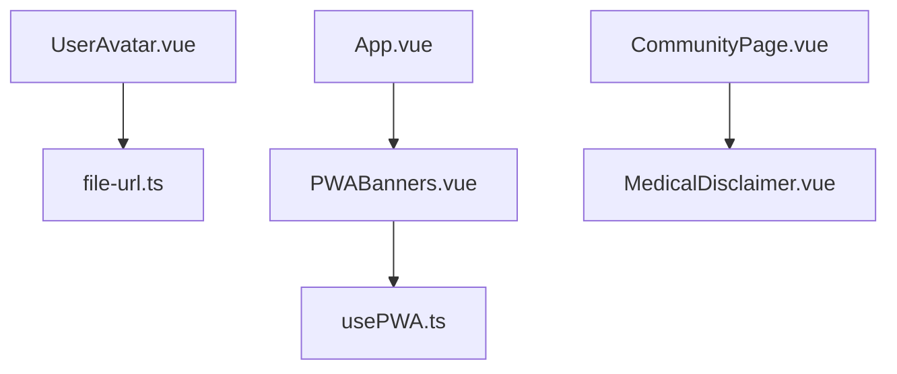

# 工具组件

<cite>
**本文引用的文件**   
- [UserAvatar.vue](file://web/app/src/components/common/UserAvatar.vue)
- [MedicalDisclaimer.vue](file://web/app/src/components/common/MedicalDisclaimer.vue)
- [PWABanners.vue](file://web/app/src/components/common/PWABanners.vue)
- [usePWA.ts](file://web/app/src/composables/usePWA.ts)
- [file-url.ts](file://web/app/src/utils/file-url.ts)
- [App.vue](file://web/app/src/App.vue)
- [CommunityPage.vue](file://web/app/src/views/CommunityPage.vue)
</cite>

## 目录
1. [简介](#简介)
2. [项目结构](#项目结构)
3. [核心组件](#核心组件)
4. [架构总览](#架构总览)
5. [详细组件分析](#详细组件分析)
6. [依赖关系分析](#依赖关系分析)
7. [性能考量](#性能考量)
8. [故障排查指南](#故障排查指南)
9. [结论](#结论)
10. [附录：配置与扩展](#附录配置与扩展)

## 简介
本章节面向Subskin前端应用中的“工具组件”，聚焦以下三个通用、可复用能力：
- UserAvatar 用户头像：统一的头像展示与上传入口，支持图片加载失败回退为初始字母、尺寸适配、主题色、可选编辑覆盖层。
- MedicalDisclaimer 医疗免责声明：在内容页强制出现的合规提示，提供多种展示变体（横幅/行内/页脚）。
- PWABanners 渐进式Web应用横幅：安装引导、离线提示、版本更新提示与静默刷新策略。

这些组件通过组合式API与工具函数实现高内聚、低耦合，便于跨页面复用与二次定制。

## 项目结构
- 组件位于 web/app/src/components/common，按功能域组织，便于全局引用。
- PWA能力由 usePWA 组合式函数集中管理，PWABanners仅负责UI呈现与交互触发。
- 头像资源访问统一经 file-url.ts 的受保护URL处理，确保短时效令牌安全。

图表来源 
- [UserAvatar.vue:1-99](file://web/app/src/components/common/UserAvatar.vue#L1-L99)
- [MedicalDisclaimer.vue:1-47](file://web/app/src/components/common/MedicalDisclaimer.vue#L1-L47)
- [PWABanners.vue:1-113](file://web/app/src/components/common/PWABanners.vue#L1-L113)
- [usePWA.ts:1-441](file://web/app/src/composables/usePWA.ts#L1-L441)
- [file-url.ts:1-155](file://web/app/src/utils/file-url.ts#L1-L155)
- [App.vue:1-117](file://web/app/src/App.vue#L1-L117)
- [CommunityPage.vue:1-200](file://web/app/src/views/CommunityPage.vue#L1-L200)

章节来源
- [UserAvatar.vue:1-99](file://web/app/src/components/common/UserAvatar.vue#L1-L99)
- [MedicalDisclaimer.vue:1-47](file://web/app/src/components/common/MedicalDisclaimer.vue#L1-L47)
- [PWABanners.vue:1-113](file://web/app/src/components/common/PWABanners.vue#L1-L113)
- [usePWA.ts:1-441](file://web/app/src/composables/usePWA.ts#L1-L441)
- [file-url.ts:1-155](file://web/app/src/utils/file-url.ts#L1-L155)
- [App.vue:1-117](file://web/app/src/App.vue#L1-L117)
- [CommunityPage.vue:1-200](file://web/app/src/views/CommunityPage.vue#L1-L200)

## 核心组件
- UserAvatar：统一头像渲染，支持图片、首字母回退、编辑覆盖层、点击事件、主题色适配。
- MedicalDisclaimer：合规声明展示，支持 banner/inline/footer 三种变体，默认文案可覆盖。
- PWABanners：安装引导弹窗、离线提示条、版本更新顶部横幅；与 usePWA 协作完成状态管理与生命周期控制。

章节来源
- [UserAvatar.vue:1-99](file://web/app/src/components/common/UserAvatar.vue#L1-L99)
- [MedicalDisclaimer.vue:1-47](file://web/app/src/components/common/MedicalDisclaimer.vue#L1-L47)
- [PWABanners.vue:1-113](file://web/app/src/components/common/PWABanners.vue#L1-L113)

## 架构总览
下图展示了三个工具组件与其依赖的组合式函数/工具函数的关系，以及它们在应用中的挂载位置。

图表来源 
- [App.vue:1-117](file://web/app/src/App.vue#L1-L117)
- [CommunityPage.vue:1-200](file://web/app/src/views/CommunityPage.vue#L1-L200)
- [UserAvatar.vue:1-99](file://web/app/src/components/common/UserAvatar.vue#L1-L99)
- [PWABanners.vue:1-113](file://web/app/src/components/common/PWABanners.vue#L1-L113)
- [usePWA.ts:1-441](file://web/app/src/composables/usePWA.ts#L1-L441)
- [file-url.ts:1-155](file://web/app/src/utils/file-url.ts#L1-L155)

## 详细组件分析

### UserAvatar 用户头像
- 功能特性
  - 图片头像优先显示，失败时回退为首字母（来自 initial 或用户名首字符），并自动大写。
  - 尺寸通过 Tailwind 类名传入（size），内部根据尺寸动态调整字体大小。
  - 可选 editable 模式，悬停显示“更换”覆盖层，支持 uploading 状态。
  - 可选 userId 包裹链接语义，click 事件向上抛出。
  - 主题色通过 primary-* CSS 变量适配明暗主题。
- 图片加载策略与安全性
  - 所有图片URL统一经 toProtectedFileUrl 处理，将 /uploads/... 转换为受保护的 /api/files/serve/... 并附加短时效 access_token。
  - data:、blob: 与绝对URL直接透传，避免误拦截。
  - 错误时切换至首字母占位，提升可用性。
- 数据流与复杂度
  - 计算属性 protectedUrl 与 showImage 决定渲染分支，时间复杂度O(1)。
  - 监听 imageUrl 变化重置错误状态，避免旧错误残留。
- 使用示例路径
  - 任意需要头像处引入并传入 imageUrl、initial、size、editable、uploading、userId 等属性。

图表来源 
- [UserAvatar.vue:1-99](file://web/app/src/components/common/UserAvatar.vue#L1-L99)
- [file-url.ts:1-155](file://web/app/src/utils/file-url.ts#L1-L155)

章节来源
- [UserAvatar.vue:1-99](file://web/app/src/components/common/UserAvatar.vue#L1-L99)
- [file-url.ts:1-155](file://web/app/src/utils/file-url.ts#L1-L155)

### MedicalDisclaimer 医疗免责声明
- 功能特性
  - 三种变体：banner（琥珀背景）、inline（居中文字）、footer（带顶边框的小字区域）。
  - 默认文案固定，可通过 message 覆盖。
  - 用于所有内容页，满足合规要求。
- 法律合规性设计
  - 明确声明“不构成医疗建议，仅供参考，具体诊疗请遵医嘱”。
  - 以最小侵入方式嵌入页面，保证可见性与一致性。
- 使用示例路径
  - 在内容页底部或关键信息区块附近引入，选择合适 variant。

图表来源 
- [MedicalDisclaimer.vue:1-47](file://web/app/src/components/common/MedicalDisclaimer.vue#L1-L47)

章节来源
- [MedicalDisclaimer.vue:1-47](file://web/app/src/components/common/MedicalDisclaimer.vue#L1-L47)
- [CommunityPage.vue:1-200](file://web/app/src/views/CommunityPage.vue#L1-L200)

### PWABanners 渐进式Web应用横幅
- 功能特性
  - 安装引导弹窗：当浏览器支持且满足条件时弹出“添加到桌面”提示。
  - 离线提示条：网络断开时固定顶部提示。
  - 版本更新横幅：检测到新版本时顶部提示，支持“更新/稍后”操作。
- 与 usePWA 的协作
  - 通过 usePWA 暴露 isInstallable、isOffline、showUpdateBanner、installApp、dismissInstall、dismissUpdate、updateApp 等方法与状态。
  - 安装流程：捕获 beforeinstallprompt → 判断是否应展示 → 调用 prompt() → 根据 userChoice 结果标记已安装或进入冷却期。
  - 更新流程：轮询 version.json 与 SW controllerchange → 设置 needRefresh → 显示横幅 → 用户点击更新或定时刷新。
- 安装引导策略
  - 高频用户判定：基于连续访问天数（REQUIRED_CONSECUTIVE_DAYS）决定是否展示。
  - 冷却期：点击“稍后”进入3天冷却，“✕”关闭进入7天冷却；累计超过阈值则永久隐藏。
  - 卸载恢复：若本地标记已安装但运行时非独立模式，清理过期标记并重试。
- 使用示例路径
  - 在 App.vue 根模板中引入，作为全局横幅容器。

图表来源 
- [PWABanners.vue:1-113](file://web/app/src/components/common/PWABanners.vue#L1-L113)
- [usePWA.ts:1-441](file://web/app/src/composables/usePWA.ts#L1-L441)
- [App.vue:1-117](file://web/app/src/App.vue#L1-L117)

章节来源
- [PWABanners.vue:1-113](file://web/app/src/components/common/PWABanners.vue#L1-L113)
- [usePWA.ts:1-441](file://web/app/src/composables/usePWA.ts#L1-L441)
- [App.vue:1-117](file://web/app/src/App.vue#L1-L117)

## 依赖关系分析
- UserAvatar 依赖 file-url.ts 的 toProtectedFileUrl，确保图片URL安全与鉴权。
- PWABanners 依赖 usePWA 的状态与方法，封装了SW生命周期、版本检测、安装流程。
- MedicalDisclaimer 无外部依赖，纯展示组件。
- App.vue 全局挂载 PWABanners，社区页等引入 MedicalDisclaimer。

图表来源 
- [UserAvatar.vue:1-99](file://web/app/src/components/common/UserAvatar.vue#L1-L99)
- [file-url.ts:1-155](file://web/app/src/utils/file-url.ts#L1-L155)
- [PWABanners.vue:1-113](file://web/app/src/components/common/PWABanners.vue#L1-L113)
- [usePWA.ts:1-441](file://web/app/src/composables/usePWA.ts#L1-L441)
- [App.vue:1-117](file://web/app/src/App.vue#L1-L117)
- [CommunityPage.vue:1-200](file://web/app/src/views/CommunityPage.vue#L1-L200)

章节来源
- [UserAvatar.vue:1-99](file://web/app/src/components/common/UserAvatar.vue#L1-L99)
- [file-url.ts:1-155](file://web/app/src/utils/file-url.ts#L1-L155)
- [PWABanners.vue:1-113](file://web/app/src/components/common/PWABanners.vue#L1-L113)
- [usePWA.ts:1-441](file://web/app/src/composables/usePWA.ts#L1-L441)
- [App.vue:1-117](file://web/app/src/App.vue#L1-L117)
- [CommunityPage.vue:1-200](file://web/app/src/views/CommunityPage.vue#L1-L200)

## 性能考量
- 头像组件
  - 计算属性与响应式更新开销极低，错误回退即时生效。
  - 图片加载失败不阻塞渲染，首字母占位保障视觉稳定。
- 免责声明
  - 纯静态渲染，无额外依赖，对性能影响可忽略。
- PWA横幅
  - 版本检测采用轮询 version.json 与 SW 事件，间隔合理，避免频繁请求。
  - 安装弹窗遵循冷却期与频次限制，减少打扰。
  - 在线/离线状态监听轻量，仅在状态变化时更新UI。

[本节为通用指导，无需特定文件引用]

## 故障排查指南
- 头像无法显示
  - 检查 imageUrl 是否为空或无效路径。
  - 确认 toProtectedFileUrl 是否正确转换 /uploads/ 前缀并附加 access_token。
  - 查看 onerror 是否被触发，必要时启用调试日志。
- 免责声明未出现
  - 确认组件已在页面模板中引入并使用正确 variant。
  - 检查 message 覆盖是否导致文案为空。
- PWA安装引导不出现
  - 确认浏览器支持 beforeinstallprompt 且满足高频用户条件。
  - 检查 localStorage 中冷却期与计数是否达到上限。
  - 若本地标记已安装但实际未安装，需清理过期标记。
- 版本更新不生效
  - 检查 version.json 是否存在且 buildTime 递增。
  - 确认 Service Worker 注册成功并能触发 controllerchange。
  - 观察 showUpdateBanner 状态与 dismissUpdate 逻辑。

章节来源
- [UserAvatar.vue:1-99](file://web/app/src/components/common/UserAvatar.vue#L1-L99)
- [file-url.ts:1-155](file://web/app/src/utils/file-url.ts#L1-L155)
- [MedicalDisclaimer.vue:1-47](file://web/app/src/components/common/MedicalDisclaimer.vue#L1-L47)
- [PWABanners.vue:1-113](file://web/app/src/components/common/PWABanners.vue#L1-L113)
- [usePWA.ts:1-441](file://web/app/src/composables/usePWA.ts#L1-L441)

## 结论
UserAvatar、MedicalDisclaimer、PWABanners 三个工具组件分别解决了头像展示与上传入口、医疗合规提示、PWA安装与更新体验等关键问题。它们通过清晰的职责边界与组合式API，实现了高内聚、易扩展的前端能力模块。结合 file-url.ts 的安全机制与 usePWA.ts 的生命周期管理，整体方案兼顾用户体验与合规要求。

[本节为总结性内容，无需特定文件引用]

## 附录：配置与扩展
- UserAvatar 配置项
  - imageUrl：完整图片URL（将被 toProtectedFileUrl 处理）
  - initial：回退首字母（默认'U'）
  - size：Tailwind尺寸类（如 'w-10 h-10'）
  - editable：是否显示编辑覆盖层
  - uploading：上传中状态
  - userId：用户ID，用于链接语义
  - 自定义扩展：可在 editable 模式下接入上传逻辑，并在 uploading 状态反馈进度。
- MedicalDisclaimer 配置项
  - variant：'banner' | 'inline' | 'footer'
  - message：自定义文案（为空时使用默认文案）
  - 自定义扩展：可根据业务需求增加多语言或更多变体。
- PWABanners 与 usePWA 配置项
  - 安装引导：isInstallable、installApp、dismissInstall、dismissInstallLong
  - 离线提示：isOffline
  - 版本更新：showUpdateBanner、updateApp、dismissUpdate
  - 状态与统计：installStatus、hasDeferredPrompt、getConsecutiveDays、isHighFrequencyUser、recordVisitDay
  - 自定义扩展：可调整冷却期、最大展示次数、高频用户判定阈值等常量。

章节来源
- [UserAvatar.vue:1-99](file://web/app/src/components/common/UserAvatar.vue#L1-L99)
- [MedicalDisclaimer.vue:1-47](file://web/app/src/components/common/MedicalDisclaimer.vue#L1-L47)
- [PWABanners.vue:1-113](file://web/app/src/components/common/PWABanners.vue#L1-L113)
- [usePWA.ts:1-441](file://web/app/src/composables/usePWA.ts#L1-L441)
- [file-url.ts:1-155](file://web/app/src/utils/file-url.ts#L1-L155)