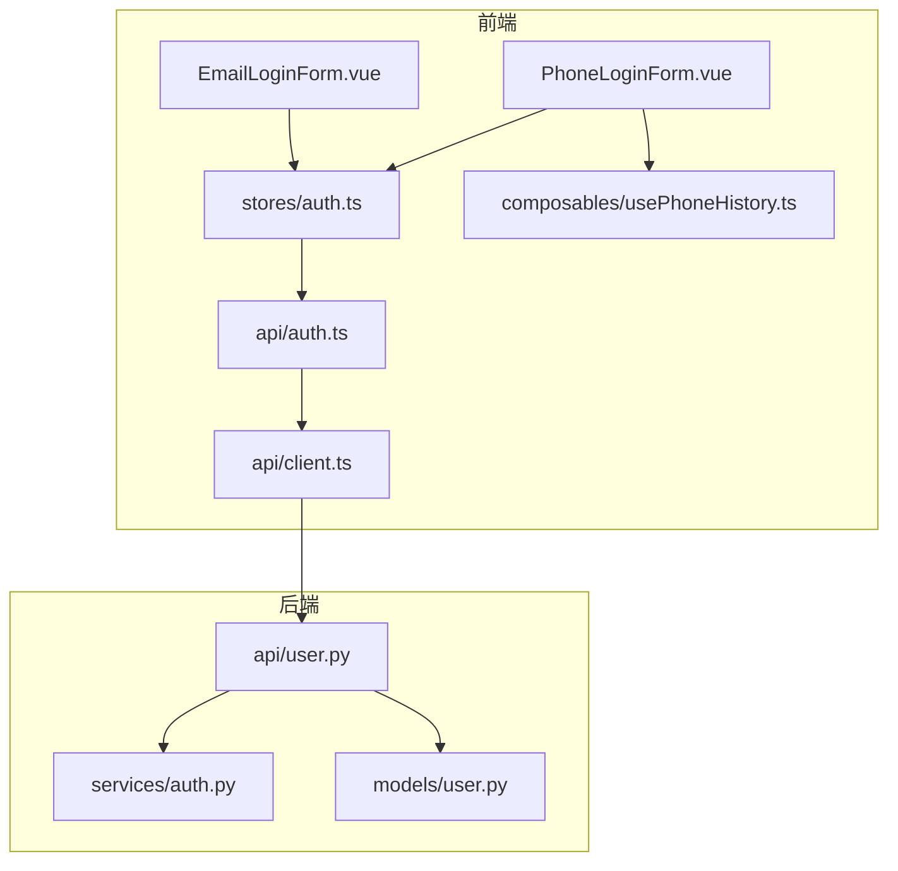
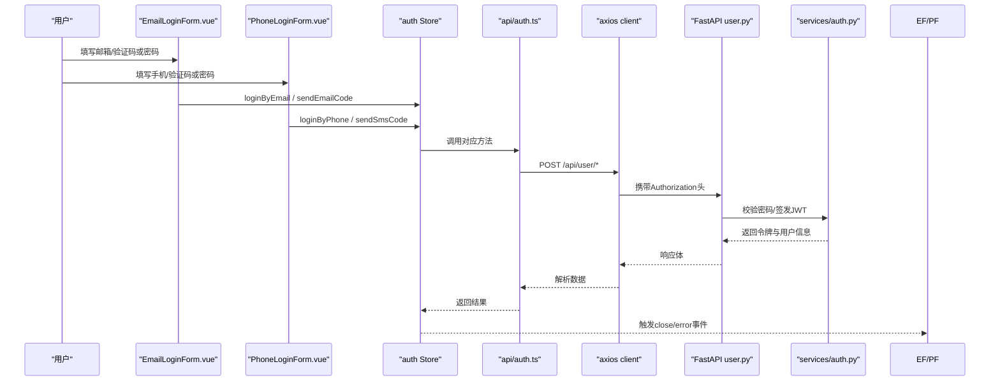
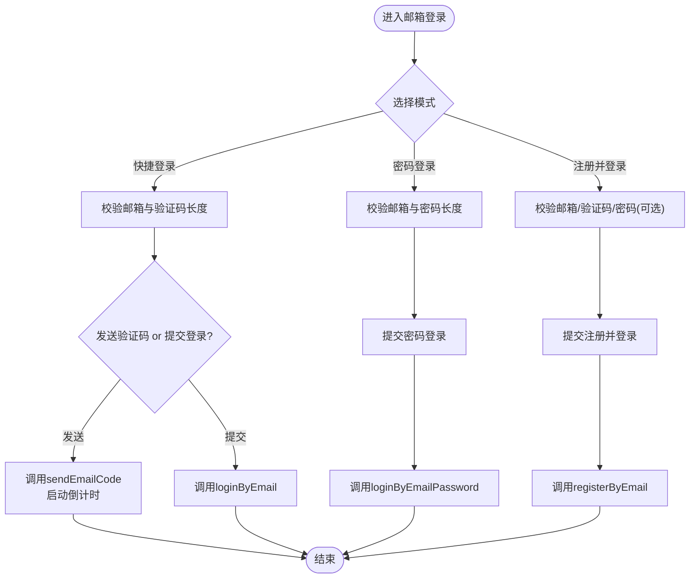
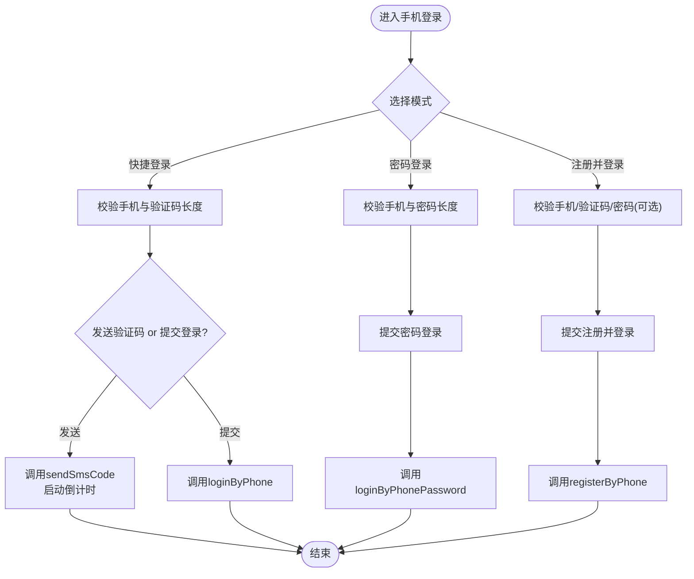
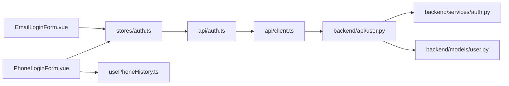

# 表单组件

<cite>
**本文引用的文件**   
- [EmailLoginForm.vue](file://web/app/src/components/common/EmailLoginForm.vue)
- [PhoneLoginForm.vue](file://web/app/src/components/common/PhoneLoginForm.vue)
- [auth.ts](file://web/app/src/stores/auth.ts)
- [auth.ts（API）](file://web/app/src/api/auth.ts)
- [client.ts](file://web/app/src/api/client.ts)
- [user.py（后端用户API）](file://web/backend/api/user.py)
- [auth.py（认证服务）](file://web/backend/services/auth.py)
- [user.py（模型定义）](file://web/backend/models/user.py)
- [usePhoneHistory.ts](file://web/app/src/composables/usePhoneHistory.ts)
</cite>

## 目录
1. [简介](#简介)
2. [项目结构](#项目结构)
3. [核心组件](#核心组件)
4. [架构总览](#架构总览)
5. [详细组件分析](#详细组件分析)
6. [依赖关系分析](#依赖关系分析)
7. [性能与可用性](#性能与可用性)
8. [故障排查指南](#故障排查指南)
9. [结论](#结论)
10. [附录：集成示例与最佳实践](#附录集成示例与最佳实践)

## 简介
本章节面向 Subskin 项目的表单组件，重点说明邮箱登录表单 EmailLoginForm 与手机号登录表单 PhoneLoginForm 的实现细节。内容覆盖：
- 输入格式校验、错误提示与实时验证
- 表单状态管理（加载、倒计时、提交态、错误处理）
- 安全特性（密码加密、防重复提交、验证码限频、输入过滤）
- 与后端 API 的交互流程与响应处理
- 使用建议与常见问题排查

## 项目结构
两个表单组件位于前端通用组件目录，通过 Pinia Store 调用 API，最终由 FastAPI 后端完成鉴权与业务逻辑。

图表来源
- [EmailLoginForm.vue:1-143](file://web/app/src/components/common/EmailLoginForm.vue#L1-L143)
- [PhoneLoginForm.vue:1-157](file://web/app/src/components/common/PhoneLoginForm.vue#L1-L157)
- [auth.ts（Store）:1-259](file://web/app/src/stores/auth.ts#L1-L259)
- [auth.ts（API）:1-195](file://web/app/src/api/auth.ts#L1-L195)
- [client.ts:1-84](file://web/app/src/api/client.ts#L1-L84)
- [user.py（后端用户API）:450-700](file://web/backend/api/user.py#L450-L700)
- [auth.py（认证服务）:1-200](file://web/backend/services/auth.py#L1-L200)
- [user.py（模型定义）:1-138](file://web/backend/models/user.py#L1-L138)
- [usePhoneHistory.ts:1-36](file://web/app/src/composables/usePhoneHistory.ts#L1-L36)

章节来源
- [EmailLoginForm.vue:1-143](file://web/app/src/components/common/EmailLoginForm.vue#L1-L143)
- [PhoneLoginForm.vue:1-157](file://web/app/src/components/common/PhoneLoginForm.vue#L1-L157)
- [auth.ts（Store）:1-259](file://web/app/src/stores/auth.ts#L1-L259)
- [auth.ts（API）:1-195](file://web/app/src/api/auth.ts#L1-L195)
- [client.ts:1-84](file://web/app/src/api/client.ts#L1-L84)
- [user.py（后端用户API）:450-700](file://web/backend/api/user.py#L450-L700)
- [auth.py（认证服务）:1-200](file://web/backend/services/auth.py#L1-L200)
- [user.py（模型定义）:1-138](file://web/backend/models/user.py#L1-L138)
- [usePhoneHistory.ts:1-36](file://web/app/src/composables/usePhoneHistory.ts#L1-L36)

## 核心组件
- EmailLoginForm：支持“快捷登录（邮箱+验证码）”、“密码登录（邮箱+密码）”、“注册并登录（邮箱+验证码+可选密码）”。包含邮箱格式校验、验证码长度校验、同意条款勾选、发送验证码倒计时、提交加载态等。
- PhoneLoginForm：支持“快捷登录（手机+验证码）”、“密码登录（手机+密码）”、“注册并登录（手机+验证码+可选密码）”。包含手机号格式校验、验证码长度校验、最近使用号码历史、发送验证码倒计时、提交加载态等。

两者均通过统一的 auth store 调用 API，统一处理登录成功后的令牌存储与用户信息获取，并在失败时向上抛出错误消息。

章节来源
- [EmailLoginForm.vue:1-143](file://web/app/src/components/common/EmailLoginForm.vue#L1-L143)
- [PhoneLoginForm.vue:1-157](file://web/app/src/components/common/PhoneLoginForm.vue#L1-L157)
- [auth.ts（Store）:1-259](file://web/app/src/stores/auth.ts#L1-L259)

## 架构总览
前端表单组件通过 Pinia Store 封装登录/注册/验证码发送等方法，Store 再调用 api/auth.ts 中的 HTTP 接口，底层 axios client 负责统一请求拦截、自动附加 Authorization、401 刷新令牌与并发去重。后端 FastAPI 路由对输入进行 Pydantic 校验，结合短信/邮件验证码服务与 JWT 认证服务完成鉴权与签发。

图表来源
- [EmailLoginForm.vue:1-143](file://web/app/src/components/common/EmailLoginForm.vue#L1-L143)
- [PhoneLoginForm.vue:1-157](file://web/app/src/components/common/PhoneLoginForm.vue#L1-L157)
- [auth.ts（Store）:1-259](file://web/app/src/stores/auth.ts#L1-L259)
- [auth.ts（API）:1-195](file://web/app/src/api/auth.ts#L1-L195)
- [client.ts:1-84](file://web/app/src/api/client.ts#L1-L84)
- [user.py（后端用户API）:450-700](file://web/backend/api/user.py#L450-L700)
- [auth.py（认证服务）:1-200](file://web/backend/services/auth.py#L1-L200)

## 详细组件分析

### EmailLoginForm（邮箱登录表单）
- 视图模式切换：快捷登录、密码登录、注册并登录三种模式，通过按钮组切换。
- 输入校验：
  - 邮箱格式正则校验
  - 验证码长度至少6位
  - 密码长度至少6位（注册时可留空）
- 交互与状态：
  - 发送验证码倒计时（默认60秒）
  - 提交时 loading 禁用按钮，防止重复提交
  - 需要勾选“已阅读并同意隐私政策与服务条款”才能提交
- 事件与回调：
  - close：登录/注册成功后关闭弹窗
  - error：向上传递错误消息（来自后端 detail 或默认文案）
- 埋点：发送验证码后记录点击行为

图表来源
- [EmailLoginForm.vue:1-143](file://web/app/src/components/common/EmailLoginForm.vue#L1-L143)
- [auth.ts（Store）:1-259](file://web/app/src/stores/auth.ts#L1-L259)
- [auth.ts（API）:1-195](file://web/app/src/api/auth.ts#L1-L195)

章节来源
- [EmailLoginForm.vue:1-143](file://web/app/src/components/common/EmailLoginForm.vue#L1-L143)
- [auth.ts（Store）:1-259](file://web/app/src/stores/auth.ts#L1-L259)
- [auth.ts（API）:1-195](file://web/app/src/api/auth.ts#L1-L195)

### PhoneLoginForm（手机号登录表单）
- 视图模式切换：快捷登录、密码登录、注册并登录三种模式。
- 输入校验：
  - 手机号格式正则校验（中国大陆手机号）
  - 验证码长度至少6位
  - 密码长度至少6位（注册时可留空）
- 交互与状态：
  - 发送验证码倒计时（默认60秒）
  - 提交时 loading 禁用按钮，防止重复提交
  - 需要勾选“已阅读并同意隐私政策与服务条款”才能提交
  - 最近使用号码历史（本地存储，最多5条），提升输入效率
- 事件与回调：
  - close：登录/注册成功后关闭弹窗
  - error：向上传递错误消息（来自后端 detail 或默认文案）
- 埋点：发送验证码后记录点击行为

图表来源
- [PhoneLoginForm.vue:1-157](file://web/app/src/components/common/PhoneLoginForm.vue#L1-L157)
- [auth.ts（Store）:1-259](file://web/app/src/stores/auth.ts#L1-L259)
- [auth.ts（API）:1-195](file://web/app/src/api/auth.ts#L1-L195)
- [usePhoneHistory.ts:1-36](file://web/app/src/composables/usePhoneHistory.ts#L1-L36)

章节来源
- [PhoneLoginForm.vue:1-157](file://web/app/src/components/common/PhoneLoginForm.vue#L1-L157)
- [auth.ts（Store）:1-259](file://web/app/src/stores/auth.ts#L1-L259)
- [auth.ts（API）:1-195](file://web/app/src/api/auth.ts#L1-L195)
- [usePhoneHistory.ts:1-36](file://web/app/src/composables/usePhoneHistory.ts#L1-L36)

### 表单验证与安全特性
- 输入格式校验
  - 邮箱：正则匹配基本邮箱格式
  - 手机号：正则匹配中国大陆手机号段
  - 验证码：长度至少6位
  - 密码：长度至少6位（注册时可为空）
- 错误提示
  - 前端即时校验失败直接提示
  - 后端异常通过 detail 字段回传，组件统一捕获并展示
- 防重复提交
  - 提交期间设置 loading 禁用按钮
  - 发送验证码倒计时期间禁用按钮
- 输入过滤
  - 前后端双重校验（前端正则 + 后端 Pydantic 模型）
  - 后端对 purpose、字段长度、手机号格式等进行严格约束
- 密码加密
  - 后端使用 bcrypt 哈希存储密码
  - 登录时仅比对哈希值，不传输明文密码到数据库
- 验证码限频
  - 后端按 IP 限制验证码发送频率，避免滥用
- 令牌与刷新
  - 登录成功后返回 access_token 与 refresh_token
  - 前端在 401 时自动刷新令牌，失败则清理本地状态并重载页面

章节来源
- [EmailLoginForm.vue:1-143](file://web/app/src/components/common/EmailLoginForm.vue#L1-L143)
- [PhoneLoginForm.vue:1-157](file://web/app/src/components/common/PhoneLoginForm.vue#L1-L157)
- [auth.ts（Store）:1-259](file://web/app/src/stores/auth.ts#L1-L259)
- [auth.ts（API）:1-195](file://web/app/src/api/auth.ts#L1-L195)
- [client.ts:1-84](file://web/app/src/api/client.ts#L1-L84)
- [user.py（后端用户API）:450-700](file://web/backend/api/user.py#L450-L700)
- [auth.py（认证服务）:1-200](file://web/backend/services/auth.py#L1-L200)
- [user.py（模型定义）:1-138](file://web/backend/models/user.py#L1-L138)

### 表单状态管理
- 加载状态：loading 控制按钮禁用与文案变化
- 倒计时：startCountdown 函数维护验证码倒计时
- 错误处理：try/catch 捕获异常，优先取后端 detail，否则显示默认文案
- 成功回调：emit('close') 通知父组件关闭弹窗；部分场景埋点上报
- 历史记忆：手机号最近使用记录存储在 localStorage，最多保留5条

章节来源
- [EmailLoginForm.vue:1-143](file://web/app/src/components/common/EmailLoginForm.vue#L1-L143)
- [PhoneLoginForm.vue:1-157](file://web/app/src/components/common/PhoneLoginForm.vue#L1-L157)
- [usePhoneHistory.ts:1-36](file://web/app/src/composables/usePhoneHistory.ts#L1-L36)

### 与后端 API 的交互与响应处理
- 发送验证码
  - 邮箱：POST /api/user/send-email-code，purpose 支持 login/register/reset/bind
  - 手机：POST /api/user/send-sms，受 IP 限频保护
- 登录
  - 邮箱验证码登录：POST /api/user/login-by-email
  - 邮箱密码登录：POST /api/user/login-by-email-password
  - 手机验证码登录：POST /api/user/login-by-phone
  - 手机密码登录：POST /api/user/login-by-phone-password
- 注册
  - 邮箱注册：POST /api/user/register-by-email（可带密码）
  - 手机注册：POST /api/user/register-by-phone（可带密码）
- 响应处理
  - 成功：保存 access_token 与 refresh_token，拉取用户信息，必要时预取文件访问令牌
  - 失败：根据 status/detail 给出友好提示；401 时尝试刷新令牌，失败则登出

章节来源
- [auth.ts（API）:1-195](file://web/app/src/api/auth.ts#L1-L195)
- [auth.ts（Store）:1-259](file://web/app/src/stores/auth.ts#L1-L259)
- [client.ts:1-84](file://web/app/src/api/client.ts#L1-L84)
- [user.py（后端用户API）:450-700](file://web/backend/api/user.py#L450-L700)

## 依赖关系分析
- 组件依赖
  - EmailLoginForm.vue、PhoneLoginForm.vue 依赖 stores/auth.ts
  - PhoneLoginForm.vue 额外依赖 composables/usePhoneHistory.ts
- Store 依赖
  - stores/auth.ts 依赖 api/auth.ts
- API 层依赖
  - api/auth.ts 依赖 api/client.ts（axios 实例）
- 后端依赖
  - api/user.py 依赖 services/auth.py（密码哈希、JWT）、models/user.py（Pydantic 模型）

图表来源
- [EmailLoginForm.vue:1-143](file://web/app/src/components/common/EmailLoginForm.vue#L1-L143)
- [PhoneLoginForm.vue:1-157](file://web/app/src/components/common/PhoneLoginForm.vue#L1-L157)
- [auth.ts（Store）:1-259](file://web/app/src/stores/auth.ts#L1-L259)
- [auth.ts（API）:1-195](file://web/app/src/api/auth.ts#L1-L195)
- [client.ts:1-84](file://web/app/src/api/client.ts#L1-L84)
- [user.py（后端用户API）:450-700](file://web/backend/api/user.py#L450-L700)
- [auth.py（认证服务）:1-200](file://web/backend/services/auth.py#L1-L200)
- [user.py（模型定义）:1-138](file://web/backend/models/user.py#L1-L138)
- [usePhoneHistory.ts:1-36](file://web/app/src/composables/usePhoneHistory.ts#L1-L36)

章节来源
- [EmailLoginForm.vue:1-143](file://web/app/src/components/common/EmailLoginForm.vue#L1-L143)
- [PhoneLoginForm.vue:1-157](file://web/app/src/components/common/PhoneLoginForm.vue#L1-L157)
- [auth.ts（Store）:1-259](file://web/app/src/stores/auth.ts#L1-L259)
- [auth.ts（API）:1-195](file://web/app/src/api/auth.ts#L1-L195)
- [client.ts:1-84](file://web/app/src/api/client.ts#L1-L84)
- [user.py（后端用户API）:450-700](file://web/backend/api/user.py#L450-L700)
- [auth.py（认证服务）:1-200](file://web/backend/services/auth.py#L1-L200)
- [user.py（模型定义）:1-138](file://web/backend/models/user.py#L1-L138)
- [usePhoneHistory.ts:1-36](file://web/app/src/composables/usePhoneHistory.ts#L1-L36)

## 性能与可用性
- 前端性能
  - 表单输入即时校验，减少无效请求
  - 发送验证码倒计时避免频繁请求
  - 401 并发刷新令牌去重，避免多次刷新
- 用户体验
  - 加载态与禁用按钮防止重复提交
  - 最近使用号码历史提升输入效率
  - 清晰错误提示与操作引导
- 后端性能
  - Pydantic 模型校验快速失败
  - 验证码限频降低滥用风险
  - JWT 短时效访问令牌与长时效刷新令牌平衡安全与体验

[本节为通用指导，无需引用具体文件]

## 故障排查指南
- 常见错误
  - 邮箱/手机号格式不正确：检查输入是否符合正则规则
  - 验证码错误或过期：确认验证码正确且在有效期内
  - 未设置密码却使用密码登录：请先通过验证码登录并设置密码
  - 账号被禁用：查看后端返回的封禁原因
- 网络问题
  - 401 未授权：检查是否持有有效 refresh_token；若刷新失败将清理本地状态并重载页面
  - 超时：axios 默认超时较长，确保后端正常响应
- 调试建议
  - 打开浏览器控制台查看请求与响应
  - 关注后端 detail 字段获取精确错误信息
  - 开发模式下短信/邮件验证码可能直接返回，便于测试

章节来源
- [client.ts:1-84](file://web/app/src/api/client.ts#L1-L84)
- [user.py（后端用户API）:450-700](file://web/backend/api/user.py#L450-L700)
- [auth.ts（Store）:1-259](file://web/app/src/stores/auth.ts#L1-L259)

## 结论
EmailLoginForm 与 PhoneLoginForm 提供了完善的邮箱/手机号登录与注册能力，具备严格的输入校验、友好的错误提示、安全的密码与验证码机制，以及与后端一致的鉴权流程。通过统一的 Store 与 API 层，实现了良好的可维护性与扩展性。建议在集成时遵循现有模式，确保一致的用户体验与安全策略。

[本节为总结，无需引用具体文件]

## 附录：集成示例与最佳实践
- 集成步骤
  - 在父组件中引入 EmailLoginForm.vue 或 PhoneLoginForm.vue
  - 监听 close 事件以关闭弹窗，监听 error 事件以展示错误提示
  - 如需手机号历史功能，确保 usePhoneHistory 可用
- 最佳实践
  - 始终要求用户勾选“已阅读并同意”后再提交
  - 利用 loading 状态防止重复提交
  - 使用后端返回的 detail 作为错误提示源
  - 保持验证码倒计时与按钮禁用一致性
  - 在开发环境利用短信/邮件验证码直出能力加速联调

章节来源
- [EmailLoginForm.vue:1-143](file://web/app/src/components/common/EmailLoginForm.vue#L1-L143)
- [PhoneLoginForm.vue:1-157](file://web/app/src/components/common/PhoneLoginForm.vue#L1-L157)
- [auth.ts（Store）:1-259](file://web/app/src/stores/auth.ts#L1-L259)
- [auth.ts（API）:1-195](file://web/app/src/api/auth.ts#L1-L195)
- [client.ts:1-84](file://web/app/src/api/client.ts#L1-L84)
- [user.py（后端用户API）:450-700](file://web/backend/api/user.py#L450-L700)
- [auth.py（认证服务）:1-200](file://web/backend/services/auth.py#L1-L200)
- [user.py（模型定义）:1-138](file://web/backend/models/user.py#L1-L138)
- [usePhoneHistory.ts:1-36](file://web/app/src/composables/usePhoneHistory.ts#L1-L36)