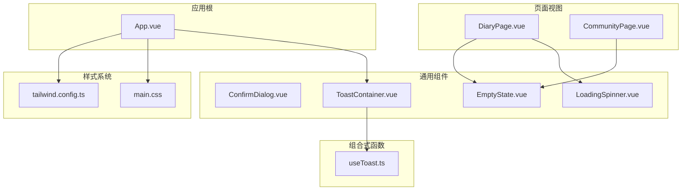
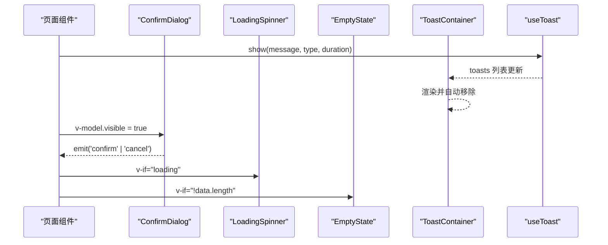
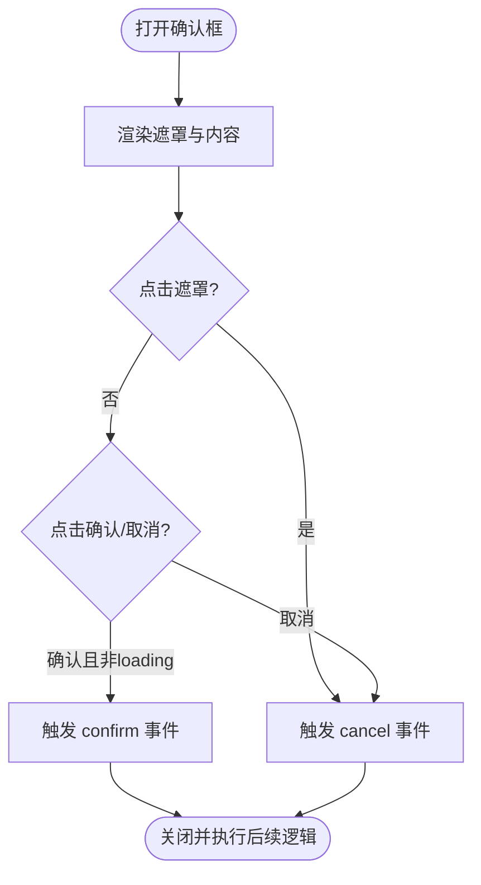
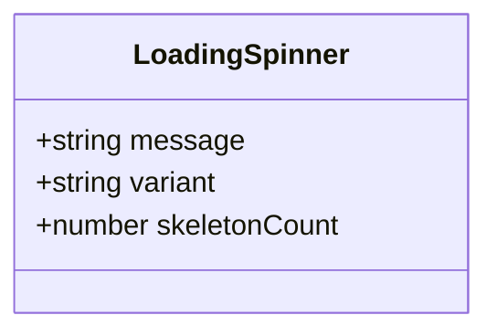
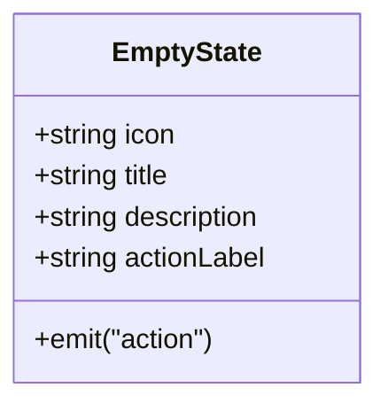
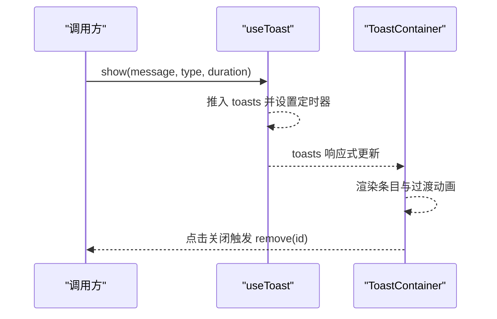
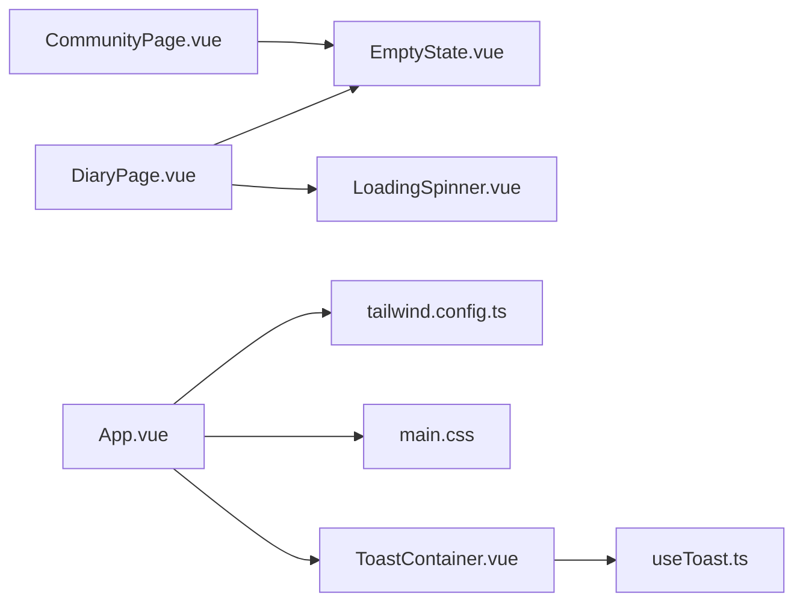

# 通用组件库

<cite>
**本文引用的文件**   
- [ConfirmDialog.vue](file://web/app/src/components/common/ConfirmDialog.vue)
- [LoadingSpinner.vue](file://web/app/src/components/common/LoadingSpinner.vue)
- [EmptyState.vue](file://web/app/src/components/common/EmptyState.vue)
- [ToastContainer.vue](file://web/app/src/components/common/ToastContainer.vue)
- [useToast.ts](file://web/app/src/composables/useToast.ts)
- [App.vue](file://web/app/src/App.vue)
- [DiaryPage.vue](file://web/app/src/views/DiaryPage.vue)
- [CommunityPage.vue](file://web/app/src/views/CommunityPage.vue)
- [main.css](file://web/app/src/styles/main.css)
- [tailwind.config.ts](file://web/app/tailwind.config.ts)
</cite>

## 目录
1. [简介](#简介)
2. [项目结构](#项目结构)
3. [核心组件](#核心组件)
4. [架构总览](#架构总览)
5. [详细组件分析](#详细组件分析)
6. [依赖关系分析](#依赖关系分析)
7. [性能考量](#性能考量)
8. [故障排查指南](#故障排查指南)
9. [结论](#结论)
10. [附录](#附录)

## 简介
本文件为 Subskin 项目的通用组件库文档，聚焦以下基础 UI 组件的设计理念、Props 接口、事件机制、样式定制与使用规范：
- ConfirmDialog 确认对话框
- LoadingSpinner 加载动画
- EmptyState 空状态
- ToastContainer 消息提示（配合 useToast composable）

同时覆盖响应式适配策略、无障碍访问支持、国际化扩展建议，并提供实际页面中的使用示例与最佳实践。

## 项目结构
通用组件位于 web/app/src/components/common 目录下，通过 App.vue 全局挂载 ToastContainer，业务页面按需引入其他组件。样式体系基于 Tailwind CSS 与自定义 CSS 变量，统一主题色与交互反馈。

图表来源
- [App.vue:1-117](file://web/app/src/App.vue#L1-L117)
- [ConfirmDialog.vue:1-60](file://web/app/src/components/common/ConfirmDialog.vue#L1-L60)
- [LoadingSpinner.vue:1-48](file://web/app/src/components/common/LoadingSpinner.vue#L1-L48)
- [EmptyState.vue:1-37](file://web/app/src/components/common/EmptyState.vue#L1-L37)
- [ToastContainer.vue:1-47](file://web/app/src/components/common/ToastContainer.vue#L1-L47)
- [useToast.ts:1-31](file://web/app/src/composables/useToast.ts#L1-L31)
- [DiaryPage.vue:280-479](file://web/app/src/views/DiaryPage.vue#L280-L479)
- [CommunityPage.vue:490-570](file://web/app/src/views/CommunityPage.vue#L490-L570)
- [main.css:1-213](file://web/app/src/styles/main.css#L1-L213)
- [tailwind.config.ts:1-63](file://web/app/tailwind.config.ts#L1-L63)

章节来源
- [App.vue:1-117](file://web/app/src/App.vue#L1-L117)
- [main.css:1-213](file://web/app/src/styles/main.css#L1-L213)
- [tailwind.config.ts:1-63](file://web/app/tailwind.config.ts#L1-L63)

## 核心组件
本节概述各组件的职责、Props 设计、事件与使用要点。

- ConfirmDialog 确认对话框
  - 职责：统一的二次确认弹窗，替代分散的浏览器 confirm() 或页面内模态实现。
  - Props：可见性控制、标题、消息、确认/取消文案、确认按钮样式类、加载态。
  - 事件：confirm、cancel。
  - 行为：点击遮罩关闭；loading 时禁用按钮；Teleport 到 body 避免层级问题。
  - 适用场景：删除、提交前确认等。

- LoadingSpinner 加载动画
  - 职责：统一的加载指示器，支持多种变体。
  - Props：message、variant（spinner/pulse/skeleton）、skeletonCount。
  - 行为：根据 variant 渲染不同骨架/旋转/脉冲效果；骨架网格自适应列数。
  - 适用场景：列表加载、周报生成、数据拉取等。

- EmptyState 空状态
  - 职责：一致的空白占位展示，提升用户体验。
  - Props：icon、title、description、actionLabel。
  - 事件：action（可选操作回调）。
  - 适用场景：无数据、无结果、未登录引导等。

- ToastContainer 消息提示
  - 职责：全局消息通知容器，集中管理 toasts。
  - 数据来源：useToast composable 暴露的 toasts 列表。
  - 行为：按类型渲染不同样式；支持手动关闭；自动消失。
  - 适用场景：成功/失败/警告/信息提示。

章节来源
- [ConfirmDialog.vue:1-60](file://web/app/src/components/common/ConfirmDialog.vue#L1-L60)
- [LoadingSpinner.vue:1-48](file://web/app/src/components/common/LoadingSpinner.vue#L1-L48)
- [EmptyState.vue:1-37](file://web/app/src/components/common/EmptyState.vue#L1-L37)
- [ToastContainer.vue:1-47](file://web/app/src/components/common/ToastContainer.vue#L1-L47)
- [useToast.ts:1-31](file://web/app/src/composables/useToast.ts#L1-L31)

## 架构总览
组件间通过 Vue 的 props/emits 与 composable 进行通信，Toast 采用全局单例状态管理，确保跨页面一致体验。

图表来源
- [ToastContainer.vue:1-47](file://web/app/src/components/common/ToastContainer.vue#L1-L47)
- [useToast.ts:1-31](file://web/app/src/composables/useToast.ts#L1-L31)
- [ConfirmDialog.vue:1-60](file://web/app/src/components/common/ConfirmDialog.vue#L1-L60)
- [LoadingSpinner.vue:1-48](file://web/app/src/components/common/LoadingSpinner.vue#L1-L48)
- [EmptyState.vue:1-37](file://web/app/src/components/common/EmptyState.vue#L1-L37)

## 详细组件分析

### ConfirmDialog 确认对话框
- 设计要点
  - 使用 Teleport 将弹窗挂载至 body，避免父级 overflow/transform 影响。
  - 提供 loading 态，防止重复提交。
  - 支持自定义确认按钮样式类，便于业务差异化。
- Props 与事件
  - visible：控制显示隐藏
  - title/message：标题与说明
  - confirmText/cancelText：按钮文案
  - confirmClass：确认按钮样式类
  - loading：加载中禁用交互
  - 事件：confirm、cancel
- 使用示例路径
  - 在需要确认的业务流程中，绑定 visible 并处理 confirm/cancel。

图表来源
- [ConfirmDialog.vue:1-60](file://web/app/src/components/common/ConfirmDialog.vue#L1-L60)

章节来源
- [ConfirmDialog.vue:1-60](file://web/app/src/components/common/ConfirmDialog.vue#L1-L60)

### LoadingSpinner 加载动画
- 设计要点
  - 三种变体：spinner（旋转）、pulse（图标脉冲）、skeleton（骨架屏）。
  - skeletonCount 控制骨架卡片数量，网格布局随屏幕宽度自适应。
- Props
  - message：提示文本
  - variant：变体选择
  - skeletonCount：骨架项数量
- 使用示例路径
  - 列表页初始加载、异步任务进行中。

图表来源
- [LoadingSpinner.vue:1-48](file://web/app/src/components/common/LoadingSpinner.vue#L1-L48)

章节来源
- [LoadingSpinner.vue:1-48](file://web/app/src/components/common/LoadingSpinner.vue#L1-L48)
- [DiaryPage.vue:280-479](file://web/app/src/views/DiaryPage.vue#L280-L479)

### EmptyState 空状态
- 设计要点
  - 统一图标、标题、描述与可选操作按钮。
  - 通过 action 事件驱动业务动作（如跳转发布页）。
- Props
  - icon/title/description/actionLabel
- 事件
  - action：用户点击操作按钮
- 使用示例路径
  - 社区动态为空、日记无记录等。

图表来源
- [EmptyState.vue:1-37](file://web/app/src/components/common/EmptyState.vue#L1-L37)

章节来源
- [EmptyState.vue:1-37](file://web/app/src/components/common/EmptyState.vue#L1-L37)
- [CommunityPage.vue:490-570](file://web/app/src/views/CommunityPage.vue#L490-L570)

### ToastContainer 消息提示
- 设计要点
  - 全局容器，使用 Teleport 挂载至 body。
  - 通过 TransitionGroup 实现入场/离场动画。
  - 按类型映射样式（success/warning/error/info）。
- 数据源
  - useToast 暴露 toasts 数组与 remove 方法。
- 使用示例路径
  - 全局安装 ToastContainer，并在任意位置调用 useToast.show/success/error/warning。

图表来源
- [ToastContainer.vue:1-47](file://web/app/src/components/common/ToastContainer.vue#L1-L47)
- [useToast.ts:1-31](file://web/app/src/composables/useToast.ts#L1-L31)

章节来源
- [ToastContainer.vue:1-47](file://web/app/src/components/common/ToastContainer.vue#L1-L47)
- [useToast.ts:1-31](file://web/app/src/composables/useToast.ts#L1-L31)
- [App.vue:1-117](file://web/app/src/App.vue#L1-L117)

## 依赖关系分析
- 组件与页面
  - DiaryPage 使用 LoadingSpinner 与 EmptyState。
  - CommunityPage 使用 EmptyState。
  - App.vue 全局挂载 ToastContainer。
- 样式与主题
  - main.css 定义主题色、按钮、卡片、输入框等基础样式。
  - tailwind.config.ts 扩展颜色与字体，确保主题一致性。

图表来源
- [App.vue:1-117](file://web/app/src/App.vue#L1-L117)
- [ToastContainer.vue:1-47](file://web/app/src/components/common/ToastContainer.vue#L1-L47)
- [useToast.ts:1-31](file://web/app/src/composables/useToast.ts#L1-L31)
- [DiaryPage.vue:280-479](file://web/app/src/views/DiaryPage.vue#L280-L479)
- [CommunityPage.vue:490-570](file://web/app/src/views/CommunityPage.vue#L490-L570)
- [main.css:1-213](file://web/app/src/styles/main.css#L1-L213)
- [tailwind.config.ts:1-63](file://web/app/tailwind.config.ts#L1-L63)

章节来源
- [App.vue:1-117](file://web/app/src/App.vue#L1-L117)
- [DiaryPage.vue:280-479](file://web/app/src/views/DiaryPage.vue#L280-L479)
- [CommunityPage.vue:490-570](file://web/app/src/views/CommunityPage.vue#L490-L570)
- [main.css:1-213](file://web/app/src/styles/main.css#L1-L213)
- [tailwind.config.ts:1-63](file://web/app/tailwind.config.ts#L1-L63)

## 性能考量
- 使用 Teleport 减少 DOM 层级嵌套带来的重排重绘。
- LoadingSpinner 的 skeleton 模式以静态占位降低首屏抖动。
- Toast 自动清理，避免内存泄漏；合理设置 duration。
- 条件渲染 v-if 而非 v-show，避免不必要的节点存在。
- 骨架网格使用 Tailwind 响应式栅格，减少 JS 计算。

[本节为通用指导，不直接分析具体文件]

## 故障排查指南
- Toast 不显示
  - 检查 App.vue 是否已挂载 ToastContainer。
  - 确认 useToast 已被正确引入并调用 show/success/error/warning。
- 确认对话框无法关闭
  - 检查 visible 绑定是否正确；确认 loading 状态下按钮被禁用。
  - 点击遮罩应触发 cancel，确认事件名与监听一致。
- 空状态不出现
  - 检查数据是否为空；EmptyState 的 actionLabel 与 @action 是否配置。
- 加载动画不切换
  - 检查 loading 状态变化时机；Skeleton 的 skeletonCount 是否合理。

章节来源
- [App.vue:1-117](file://web/app/src/App.vue#L1-L117)
- [ToastContainer.vue:1-47](file://web/app/src/components/common/ToastContainer.vue#L1-L47)
- [useToast.ts:1-31](file://web/app/src/composables/useToast.ts#L1-L31)
- [ConfirmDialog.vue:1-60](file://web/app/src/components/common/ConfirmDialog.vue#L1-L60)
- [EmptyState.vue:1-37](file://web/app/src/components/common/EmptyState.vue#L1-L37)
- [LoadingSpinner.vue:1-48](file://web/app/src/components/common/LoadingSpinner.vue#L1-L48)

## 结论
Subskin 通用组件库以简洁、可复用、可定制为核心目标，结合 Tailwind 与主题变量，提供一致的视觉与交互体验。通过明确的 Props/Events 设计与全局 Toast 管理，开发者可以快速构建稳定、易维护的前端界面。建议在新增页面时优先复用这些组件，保持风格与行为的一致性。

[本节为总结，不直接分析具体文件]

## 附录

### 响应式适配策略
- 使用 Tailwind 断点与栅格，使骨架屏在不同屏幕下自适应列数。
- 通过 CSS 变量与 dark 模式切换，保证明暗主题一致体验。
- 移动端触摸目标最小 44px，提升触控可用性。

章节来源
- [main.css:1-213](file://web/app/src/styles/main.css#L1-L213)
- [tailwind.config.ts:1-63](file://web/app/tailwind.config.ts#L1-L63)

### 无障碍访问支持
- App.vue 包含“跳转到主要内容”的 sr-only 链接，便于键盘导航。
- 按钮与交互元素具备合适的焦点与激活态样式。
- 建议为关键图标补充 aria-label，增强读屏器语义。

章节来源
- [App.vue:1-117](file://web/app/src/App.vue#L1-L117)

### 国际化支持建议
- 组件文案（如默认标题、按钮文案）建议抽离为 i18n 键值。
- 可在 useToast 中增加 locale 参数，按类型返回本地化消息。
- 页面层统一注入语言包，避免硬编码字符串。

[本节为概念性建议，不直接分析具体文件]

### 使用示例与最佳实践
- 在列表页加载时使用 LoadingSpinner，数据为空时显示 EmptyState。
- 删除或危险操作前弹出 ConfirmDialog，避免误操作。
- 所有用户操作反馈统一通过 useToast 提示，保持体验一致。
- 在 App.vue 全局挂载 ToastContainer，确保任何页面均可收到提示。

章节来源
- [DiaryPage.vue:280-479](file://web/app/src/views/DiaryPage.vue#L280-L479)
- [CommunityPage.vue:490-570](file://web/app/src/views/CommunityPage.vue#L490-L570)
- [App.vue:1-117](file://web/app/src/App.vue#L1-L117)