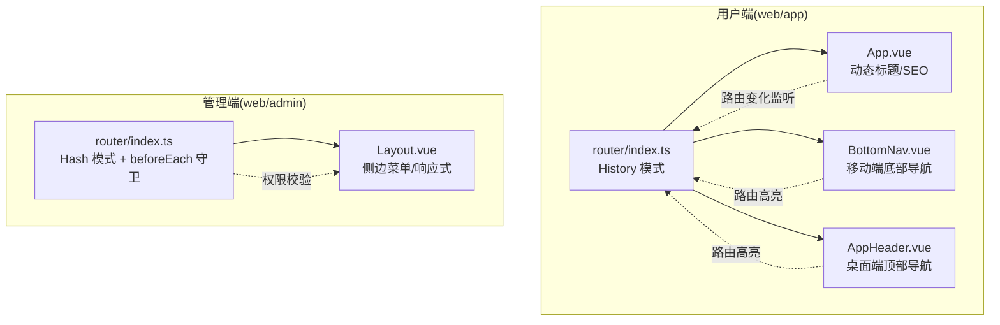
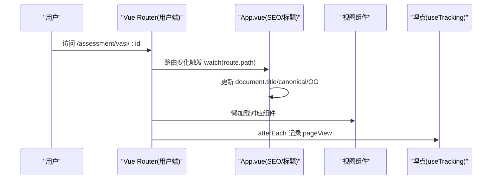
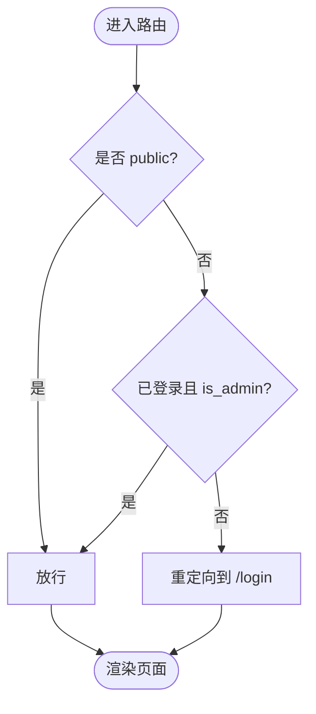
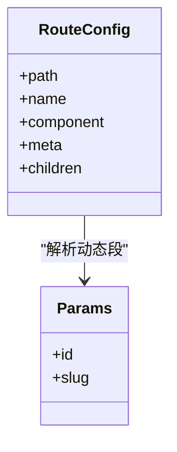
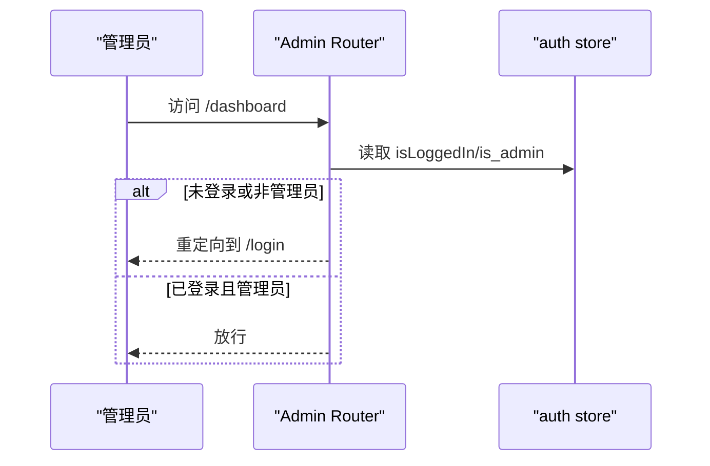
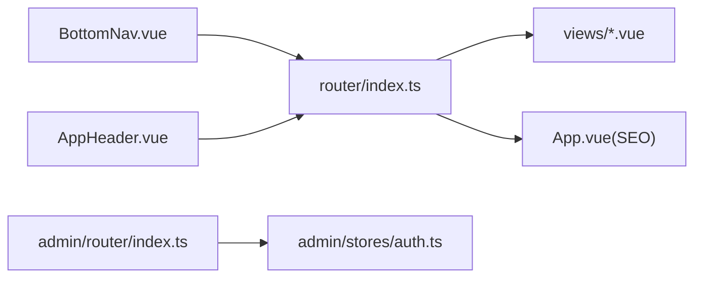

# 路由设计模式

<cite>
**本文引用的文件**
- [web/app/src/router/index.ts](file://web/app/src/router/index.ts)
- [web/admin/src/router/index.ts](file://web/admin/src/router/index.ts)
- [web/app/src/App.vue](file://web/app/src/App.vue)
- [web/app/src/stores/auth.ts](file://web/app/src/stores/auth.ts)
- [web/admin/src/stores/auth.ts](file://web/admin/src/stores/auth.ts)
- [web/app/src/components/layout/BottomNav.vue](file://web/app/src/components/layout/BottomNav.vue)
- [web/app/src/components/layout/AppHeader.vue](file://web/app/src/components/layout/AppHeader.vue)
- [web/app/src/views/VasiDetailPage.vue](file://web/app/src/views/VasiDetailPage.vue)
- [web/app/src/views/PostDetailPage.vue](file://web/app/src/views/PostDetailPage.vue)
</cite>

## 目录
1. [简介](#简介)
2. [项目结构](#项目结构)
3. [核心组件](#核心组件)
4. [架构总览](#架构总览)
5. [详细组件分析](#详细组件分析)
6. [依赖关系分析](#依赖关系分析)
7. [性能考量](#性能考量)
8. [故障排查指南](#故障排查指南)
9. [结论](#结论)
10. [附录：配置示例与最佳实践](#附录配置示例与最佳实践)

## 简介
本文件系统性梳理 Subskin 前端（用户端 web/app）与管理端（web/admin）的 Vue Router 路由设计模式，覆盖以下主题：
- Vue Router 配置、历史模式选择与滚动行为
- 路由守卫与权限控制（管理员登录态校验）
- 动态路由与嵌套路由设计、参数传递
- 路由元信息 meta 的使用（标题、SEO、全屏等）
- 路由懒加载与按需引入
- SEO 优化策略（动态 title、canonical、OG 标签）
- 路由历史管理、浏览器兼容性与移动端适配
- 架构图与配置示例

## 项目结构
Subskin 包含两个独立的前端应用：
- 用户端（web/app）：面向普通用户，采用 History 模式，提供问答、测评、日记、社区等功能。
- 管理端（web/admin）：面向管理员，采用 Hash 模式，内置基于角色的路由守卫，仅允许管理员访问。

图表来源
- [web/app/src/router/index.ts:1-155](file://web/app/src/router/index.ts#L1-L155)
- [web/admin/src/router/index.ts:1-84](file://web/admin/src/router/index.ts#L1-L84)
- [web/app/src/App.vue:50-117](file://web/app/src/App.vue#L50-L117)
- [web/app/src/components/layout/BottomNav.vue:1-184](file://web/app/src/components/layout/BottomNav.vue#L1-L184)
- [web/app/src/components/layout/AppHeader.vue:100-117](file://web/app/src/components/layout/AppHeader.vue#L100-L117)

章节来源
- [web/app/src/router/index.ts:1-155](file://web/app/src/router/index.ts#L1-L155)
- [web/admin/src/router/index.ts:1-84](file://web/admin/src/router/index.ts#L1-L84)

## 核心组件
- 用户端路由配置：集中定义所有页面路由，使用懒加载组件，设置滚动行为，并在 afterEach 中埋点统计。
- 管理端路由配置：集中定义后台模块路由，使用 beforeEach 实现管理员权限校验。
- 状态管理：用户端与管理端各自维护登录态与用户信息，供路由守卫或业务逻辑使用。
- 导航组件：移动端底部导航与桌面端顶部导航根据当前路由高亮并支持跳转。
- SEO 与标题：在 App.vue 中根据路由路径动态更新 document.title、canonical 与 OG 标签。

章节来源
- [web/app/src/router/index.ts:1-155](file://web/app/src/router/index.ts#L1-L155)
- [web/admin/src/router/index.ts:1-84](file://web/admin/src/router/index.ts#L1-L84)
- [web/app/src/stores/auth.ts:1-259](file://web/app/src/stores/auth.ts#L1-L259)
- [web/admin/src/stores/auth.ts:1-59](file://web/admin/src/stores/auth.ts#L1-L59)
- [web/app/src/components/layout/BottomNav.vue:1-184](file://web/app/src/components/layout/BottomNav.vue#L1-L184)
- [web/app/src/components/layout/AppHeader.vue:100-117](file://web/app/src/components/layout/AppHeader.vue#L100-L117)
- [web/app/src/App.vue:50-117](file://web/app/src/App.vue#L50-L117)

## 架构总览
下图展示用户端与管理端的整体路由架构及关键交互：

图表来源
- [web/app/src/router/index.ts:1-155](file://web/app/src/router/index.ts#L1-L155)
- [web/app/src/App.vue:50-117](file://web/app/src/App.vue#L50-L117)

## 详细组件分析

### 用户端路由配置（web/app/src/router/index.ts）
- 历史模式：使用 createWebHistory，适合 SPA 部署于支持 history 模式的服务器。
- 路由组织：扁平化为主，部分功能通过子路径组合（如 /assessment/*、/community/*）。
- 懒加载：所有页面组件均采用异步 import，减少首屏体积。
- 滚动行为：afterEnter 时根据 hash 平滑滚动到锚点；否则回到顶部或恢复保存位置。
- 埋点：afterEach 中动态导入 useTracking 并上报 pageView。

章节来源
- [web/app/src/router/index.ts:1-155](file://web/app/src/router/index.ts#L1-L155)

### 管理端路由与守卫（web/admin/src/router/index.ts）
- 历史模式：使用 createWebHashHistory，避免服务端 history 重定向问题。
- 嵌套路由：以 Layout 为根，内部挂载多个后台功能子路由。
- 权限控制：beforeEach 检查登录态与 is_admin 标志，未授权跳转到 /login；已登录管理员访问 /login 则重定向至首页。
- 公共路由：标记 public 的路由（如 /login）可跳过鉴权。

图表来源
- [web/admin/src/router/index.ts:1-84](file://web/admin/src/router/index.ts#L1-L84)
- [web/admin/src/stores/auth.ts:1-59](file://web/admin/src/stores/auth.ts#L1-L59)

章节来源
- [web/admin/src/router/index.ts:1-84](file://web/admin/src/router/index.ts#L1-L84)
- [web/admin/src/stores/auth.ts:1-59](file://web/admin/src/stores/auth.ts#L1-L59)

### 嵌套路由与参数传递
- 嵌套路由：用户端以功能域划分路径（如 /assessment、/community），便于模块化组织；管理端以 Layout 作为容器进行嵌套。
- 动态参数：例如 /assessment/vasi/:id、/chat/:id、/group/:id、/collection/:slug 等，通过 route.params 获取。
- 通配符：百科文章使用 /encyclopedia/:slug(.*)* 匹配多级 slug，统一交由同一组件处理。

图表来源
- [web/app/src/router/index.ts:1-155](file://web/app/src/router/index.ts#L1-L155)

章节来源
- [web/app/src/router/index.ts:1-155](file://web/app/src/router/index.ts#L1-L155)
- [web/app/src/views/VasiDetailPage.vue:1-36](file://web/app/src/views/VasiDetailPage.vue#L1-L36)
- [web/app/src/views/PostDetailPage.vue:23-71](file://web/app/src/views/PostDetailPage.vue#L23-L71)

### 路由元信息 meta 的使用
- 页面标题：部分路由通过 meta.title 标注，配合 App.vue 中的映射表生成最终标题。
- SEO 增强：App.vue 根据当前 path 动态设置 canonical 与 og:title/og:url，提升分享与搜索引擎收录质量。
- 特殊布局：管理端某些路由通过 meta.fullscreen 控制全屏编辑模式。

章节来源
- [web/app/src/router/index.ts:1-155](file://web/app/src/router/index.ts#L1-L155)
- [web/app/src/App.vue:50-117](file://web/app/src/App.vue#L50-L117)
- [web/admin/src/router/index.ts:1-84](file://web/admin/src/router/index.ts#L1-L84)

### 权限控制机制
- 管理端：beforeEach 结合 Pinia 的 auth store 判断 isLoggedIn 与 is_admin，未授权跳转登录页。
- 用户端：当前路由层未做全局鉴权，但可通过组件内调用 auth store 进行受保护操作（如发布内容、查看私密数据）。

图表来源
- [web/admin/src/router/index.ts:1-84](file://web/admin/src/router/index.ts#L1-L84)
- [web/admin/src/stores/auth.ts:1-59](file://web/admin/src/stores/auth.ts#L1-L59)

章节来源
- [web/admin/src/router/index.ts:1-84](file://web/admin/src/router/index.ts#L1-L84)
- [web/admin/src/stores/auth.ts:1-59](file://web/admin/src/stores/auth.ts#L1-L59)

### 路由懒加载
- 所有页面组件均使用异步 import() 加载，降低初始包体，提升首屏速度。
- 建议在新增页面时也遵循此模式，避免一次性加载全部视图。

章节来源
- [web/app/src/router/index.ts:1-155](file://web/app/src/router/index.ts#L1-L155)
- [web/admin/src/router/index.ts:1-84](file://web/admin/src/router/index.ts#L1-L84)

### SEO 优化策略
- 动态标题：App.vue 根据路由路径映射标题，保证每个页面有明确标题。
- Canonical：为每个路由设置 canonical 链接，避免重复内容。
- OG 标签：更新 og:title 与 og/url，提升社交分享体验。
- 建议：对重要页面补充 description、keywords 等 meta 标签。

章节来源
- [web/app/src/App.vue:50-117](file://web/app/src/App.vue#L50-L117)

### 路由历史管理与浏览器兼容性
- 用户端使用 History 模式，需确保服务器正确配置 SPA 回退规则（将未知路径指向 index.html）。
- 管理端使用 Hash 模式，天然兼容不支持 history 的环境。
- 滚动行为：利用 router 的 scrollBehavior 支持锚点平滑滚动与返回保留位置。

章节来源
- [web/app/src/router/index.ts:1-155](file://web/app/src/router/index.ts#L1-L155)
- [web/admin/src/router/index.ts:1-84](file://web/admin/src/router/index.ts#L1-L84)

### 移动端路由适配
- 底部导航：BottomNav.vue 根据当前路由高亮并隐藏/显示，适配移动端手势与视口安全区域。
- 顶部导航：AppHeader.vue 在桌面端显示主导航，并根据路由计算激活状态。
- 响应式：通过 CSS 媒体查询在不同屏幕尺寸下切换导航样式与布局。

章节来源
- [web/app/src/components/layout/BottomNav.vue:1-184](file://web/app/src/components/layout/BottomNav.vue#L1-L184)
- [web/app/src/components/layout/AppHeader.vue:100-117](file://web/app/src/components/layout/AppHeader.vue#L100-L117)

## 依赖关系分析
- 路由与视图：路由配置集中管理，视图组件按需懒加载，解耦清晰。
- 路由与状态：管理端路由守卫依赖 auth store 的用户信息；用户端可在组件内使用 auth store 控制行为。
- 路由与 SEO：App.vue 监听路由变化，驱动文档级 SEO 元信息更新。
- 导航与路由：BottomNav/AppHeader 通过 useRoute 计算当前激活项，保持导航与路由一致。

图表来源
- [web/app/src/router/index.ts:1-155](file://web/app/src/router/index.ts#L1-L155)
- [web/admin/src/router/index.ts:1-84](file://web/admin/src/router/index.ts#L1-L84)
- [web/app/src/App.vue:50-117](file://web/app/src/App.vue#L50-L117)
- [web/admin/src/stores/auth.ts:1-59](file://web/admin/src/stores/auth.ts#L1-L59)
- [web/app/src/components/layout/BottomNav.vue:1-184](file://web/app/src/components/layout/BottomNav.vue#L1-L184)
- [web/app/src/components/layout/AppHeader.vue:100-117](file://web/app/src/components/layout/AppHeader.vue#L100-L117)

章节来源
- [web/app/src/router/index.ts:1-155](file://web/app/src/router/index.ts#L1-L155)
- [web/admin/src/router/index.ts:1-84](file://web/admin/src/router/index.ts#L1-L84)
- [web/app/src/App.vue:50-117](file://web/app/src/App.vue#L50-L117)
- [web/admin/src/stores/auth.ts:1-59](file://web/admin/src/stores/auth.ts#L1-L59)
- [web/app/src/components/layout/BottomNav.vue:1-184](file://web/app/src/components/layout/BottomNav.vue#L1-L184)
- [web/app/src/components/layout/AppHeader.vue:100-117](file://web/app/src/components/layout/AppHeader.vue#L100-L117)

## 性能考量
- 懒加载：所有页面组件异步加载，显著降低首屏资源体积。
- 滚动行为：仅在需要时执行滚动计算，避免不必要的开销。
- 埋点：afterEach 中动态导入 useTracking，避免影响启动时间。
- 建议：对大型页面进一步拆分组件，按路由粒度进行代码分割。

[本节为通用性能建议，不直接分析具体文件]

## 故障排查指南
- 管理端无法进入后台：检查 beforeGuard 是否正确读取 auth store，确认 is_admin 标志；若未登录或非管理员将被重定向到 /login。
- 用户端页面标题异常：检查 App.vue 中的 pageTitles 映射是否覆盖目标路径；canonical 与 OG 标签是否正确更新。
- 移动端导航高亮错误：核对 BottomNav.vue 的 isActive 逻辑，确保与路由层级匹配（如 /assessment 及其子路径）。
- 动态参数未生效：确认路由 path 中定义了占位符（如 :id），并在组件中使用 route.params 获取。

章节来源
- [web/admin/src/router/index.ts:1-84](file://web/admin/src/router/index.ts#L1-L84)
- [web/admin/src/stores/auth.ts:1-59](file://web/admin/src/stores/auth.ts#L1-L59)
- [web/app/src/App.vue:50-117](file://web/app/src/App.vue#L50-L117)
- [web/app/src/components/layout/BottomNav.vue:1-184](file://web/app/src/components/layout/BottomNav.vue#L1-L184)
- [web/app/src/router/index.ts:1-155](file://web/app/src/router/index.ts#L1-L155)

## 结论
Subskin 的路由设计以“职责清晰、按需加载、易于扩展”为核心原则：
- 用户端采用 History 模式与扁平路由，配合 App.vue 的 SEO 能力，兼顾用户体验与搜索友好性。
- 管理端采用 Hash 模式与前置守卫，确保后台权限安全。
- 通过 meta、懒加载、滚动行为与移动端导航适配，形成完整的路由体系。
后续可按需增加更细粒度的路由守卫、动态菜单生成与更完善的 SEO 元信息。

[本节为总结，不直接分析具体文件]

## 附录：配置示例与最佳实践
- 路由懒加载示例：在路由配置中使用异步 import 加载组件，减少首屏体积。
- 动态路由示例：使用 :id 或 :slug(.*)* 捕获可变路径，并通过 route.params 读取。
- 嵌套路由示例：以 Layout 为父路由，挂载多个子路由，统一管理布局与导航。
- 路由守卫示例：在 beforeEach 中校验登录态与角色，未授权跳转登录页。
- SEO 示例：在 App.vue 中根据路由更新 document.title、canonical 与 OG 标签。
- 移动端适配：使用媒体查询与固定底部导航，提升移动体验。

章节来源
- [web/app/src/router/index.ts:1-155](file://web/app/src/router/index.ts#L1-L155)
- [web/admin/src/router/index.ts:1-84](file://web/admin/src/router/index.ts#L1-L84)
- [web/app/src/App.vue:50-117](file://web/app/src/App.vue#L50-L117)
- [web/app/src/components/layout/BottomNav.vue:1-184](file://web/app/src/components/layout/BottomNav.vue#L1-L184)