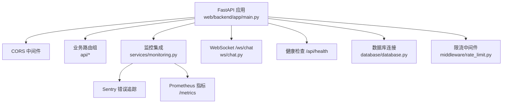
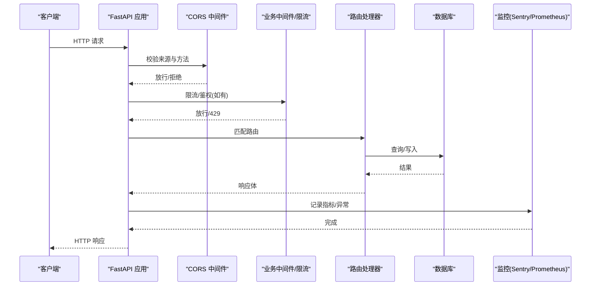
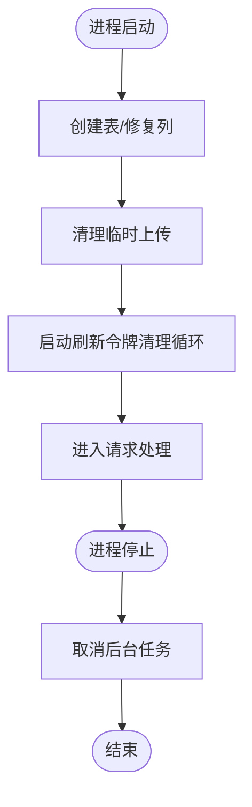
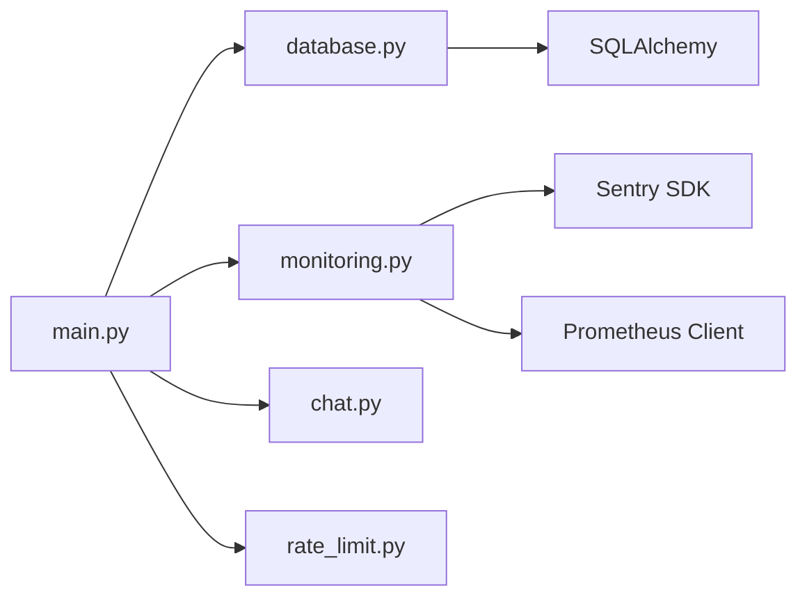

# FastAPI应用架构

<cite>
**本文引用的文件**
- [web/backend/app/main.py](file://web/backend/app/main.py)
- [web/backend/database/database.py](file://web/backend/database/database.py)
- [web/backend/services/monitoring.py](file://web/backend/services/monitoring.py)
- [web/backend/ws/chat.py](file://web/backend/ws/chat.py)
- [web/backend/app/middleware/rate_limit.py](file://web/backend/app/middleware/rate_limit.py)
- [configs/web_config.yaml](file://configs/web_config.yaml)
- [src/settings/settings.py](file://src/settings/settings.py)
</cite>

## 目录
1. [简介](#简介)
2. [项目结构](#项目结构)
3. [核心组件](#核心组件)
4. [架构总览](#架构总览)
5. [详细组件分析](#详细组件分析)
6. [依赖关系分析](#依赖关系分析)
7. [性能考量](#性能考量)
8. [故障排查指南](#故障排查指南)
9. [结论](#结论)
10. [附录](#附录)

## 简介
本文件面向Subskin项目的FastAPI后端，系统化阐述应用的启动流程、生命周期管理（lifespan）、中间件注册机制、CORS策略、路由注册模式、环境配置管理、数据库连接建立、监控服务集成（Sentry + Prometheus）、WebSocket端点注册与健康检查接口设计。文档提供架构图与请求处理流程图，帮助读者快速理解并维护该服务。

## 项目结构
- 应用入口与生命周期：位于 web/backend/app/main.py，负责创建FastAPI实例、注册CORS中间件、挂载各业务路由、初始化监控（Sentry/Prometheus）、注册WebSocket与健康检查端点。
- 数据库连接：位于 web/backend/database/database.py，基于SQLAlchemy创建引擎与会话，针对SQLite使用NullPool避免并发阻塞问题。
- 监控服务：位于 web/backend/services/monitoring.py，实现Sentry初始化、Prometheus指标收集中间件与/metrics端点、健康检查端点。
- WebSocket：位于 web/backend/ws/chat.py，实现聊天消息的实时通信与已读回执。
- 限流中间件：位于 web/backend/app/middleware/rate_limit.py，提供按IP/用户维度的令牌桶限速器。
- 配置管理：configs/web_config.yaml定义站点、认证、数据库、LLM、监控等配置；src/settings/settings.py通过Pydantic模型从环境变量/.env加载类型化设置。

图表来源
- [web/backend/app/main.py:228-349](file://web/backend/app/main.py#L228-L349)
- [web/backend/services/monitoring.py:28-203](file://web/backend/services/monitoring.py#L28-L203)
- [web/backend/database/database.py:17-35](file://web/backend/database/database.py#L17-L35)
- [web/backend/ws/chat.py:45-111](file://web/backend/ws/chat.py#L45-L111)
- [web/backend/app/middleware/rate_limit.py:10-96](file://web/backend/app/middleware/rate_limit.py#L10-L96)

章节来源
- [web/backend/app/main.py:228-349](file://web/backend/app/main.py#L228-L349)
- [web/backend/database/database.py:17-35](file://web/backend/database/database.py#L17-L35)
- [web/backend/services/monitoring.py:28-203](file://web/backend/services/monitoring.py#L28-L203)
- [web/backend/ws/chat.py:45-111](file://web/backend/ws/chat.py#L45-L111)
- [web/backend/app/middleware/rate_limit.py:10-96](file://web/backend/app/middleware/rate_limit.py#L10-L96)
- [configs/web_config.yaml:1-284](file://configs/web_config.yaml#L1-L284)
- [src/settings/settings.py:17-328](file://src/settings/settings.py#L17-L328)

## 核心组件
- 应用启动与生命周期
  - 使用asynccontextmanager定义lifespan，在启动时执行临时上传清理、定时刷新令牌清理任务；在关闭时取消后台任务。
  - 创建FastAPI实例并注入lifespan。
- CORS配置
  - 根据环境变量ALLOWED_ORIGINS或APP_ENV动态选择允许的来源列表，支持生产与开发环境的差异。
- 路由注册
  - 集中调用app.include_router将各业务模块路由挂载到统一前缀，如/api/user、/api/content、/api/community等。
- 监控集成
  - 初始化Sentry（可选），启用Prometheus中间件与/metrics端点（可选）。
- 数据库连接
  - 基于SQLAlchemy创建engine与SessionLocal，针对SQLite使用NullPool并设置超时，避免并发写锁导致的阻塞。
- WebSocket端点
  - 注册/ws/chat，基于token鉴权后维护连接管理器，支持ping/pong与已读回执。
- 健康检查
  - 提供/api/health返回服务状态，便于探针探测。

章节来源
- [web/backend/app/main.py:228-349](file://web/backend/app/main.py#L228-L349)
- [web/backend/database/database.py:17-35](file://web/backend/database/database.py#L17-L35)
- [web/backend/services/monitoring.py:28-203](file://web/backend/services/monitoring.py#L28-L203)
- [web/backend/ws/chat.py:45-111](file://web/backend/ws/chat.py#L45-L111)

## 架构总览
下图展示请求从客户端进入FastAPI应用后的处理路径，包括CORS校验、中间件链、路由分发、业务逻辑、数据库访问、监控指标采集与健康检查。

图表来源
- [web/backend/app/main.py:271-328](file://web/backend/app/main.py#L271-L328)
- [web/backend/services/monitoring.py:96-203](file://web/backend/services/monitoring.py#L96-L203)
- [web/backend/database/database.py:17-35](file://web/backend/database/database.py#L17-L35)

## 详细组件分析

### 应用启动与生命周期管理
- 启动阶段
  - 创建数据库表结构（幂等）
  - 确保必要列存在（如头像字段、医学报告解析字段等）
  - 初始化临时文件清理任务与刷新令牌清理任务（每24小时）
- 关闭阶段
  - 取消后台任务，确保资源释放
- 关键点
  - lifespan作为上下文管理器，保证异常安全与资源清理
  - 启动时进行必要的数据库结构修复，提升鲁棒性

图表来源
- [web/backend/app/main.py:74-180](file://web/backend/app/main.py#L74-L180)
- [web/backend/app/main.py:228-268](file://web/backend/app/main.py#L228-L268)

章节来源
- [web/backend/app/main.py:74-180](file://web/backend/app/main.py#L74-L180)
- [web/backend/app/main.py:228-268](file://web/backend/app/main.py#L228-L268)

### CORS配置策略
- 动态来源控制
  - 优先读取ALLOWED_ORIGINS环境变量，若为空则根据APP_ENV决定来源集合
  - 生产环境仅包含正式域名，开发环境额外包含本地开发端口
- 安全建议
  - 生产环境严格限制来源，避免跨站脚本攻击
  - 结合HTTPS与Secure Cookie策略

章节来源
- [web/backend/app/main.py:196-223](file://web/backend/app/main.py#L196-L223)
- [web/backend/app/main.py:271-278](file://web/backend/app/main.py#L271-L278)
- [configs/web_config.yaml:253-284](file://configs/web_config.yaml#L253-L284)

### 路由注册模式
- 模块化路由
  - 每个业务域（用户、内容、社区、医疗报告、IM等）独立为router，集中挂载到主应用
- 前缀与标签
  - 使用prefix划分命名空间，tags用于API文档分组
- 扩展性
  - 新增功能只需添加新router并在主应用中include_router即可

章节来源
- [web/backend/app/main.py:280-319](file://web/backend/app/main.py#L280-L319)
- [web/backend/api/__init__.py:5-32](file://web/backend/api/__init__.py#L5-L32)

### 环境配置管理
- 配置文件
  - configs/web_config.yaml提供结构化配置项，涵盖站点信息、认证、数据库、LLM、监控等
- 类型化设置
  - src/settings/settings.py通过Pydantic模型从环境变量/.env加载，并提供缺失键检测与验证
- 最佳实践
  - 敏感信息通过环境变量注入，避免硬编码
  - 不同环境使用不同.env或环境变量覆盖

章节来源
- [configs/web_config.yaml:1-284](file://configs/web_config.yaml#L1-L284)
- [src/settings/settings.py:17-328](file://src/settings/settings.py#L17-L328)

### 数据库连接建立
- SQLAlchemy引擎
  - SQLite场景使用NullPool避免并发阻塞，设置超时防止长时间等待
  - 非SQLite场景启用pool_pre_ping确保连接有效性
- 会话管理
  - 提供get_db依赖注入函数，自动管理会话生命周期

章节来源
- [web/backend/database/database.py:17-46](file://web/backend/database/database.py#L17-L46)

### 监控服务集成（Sentry + Prometheus）
- Sentry
  - 条件初始化，未配置DSN时跳过
  - 集成FastAPI、Starlette、SQLAlchemy，过滤敏感数据
- Prometheus
  - 自定义中间件收集请求计数、耗时、进行中请求数
  - 提供/metrics端点供Prometheus抓取
- 健康检查
  - 提供/api/health，检查数据库连通性与磁盘空间

章节来源
- [web/backend/services/monitoring.py:28-203](file://web/backend/services/monitoring.py#L28-L203)
- [web/backend/app/main.py:321-328](file://web/backend/app/main.py#L321-L328)

### WebSocket端点注册
- 端点
  - /ws/chat接收token参数，验证通过后建立连接
- 连接管理
  - ConnectionManager维护活跃连接，支持发送消息与广播
- 业务逻辑
  - 支持ping/pong心跳与已读回执更新

章节来源
- [web/backend/ws/chat.py:14-111](file://web/backend/ws/chat.py#L14-L111)
- [web/backend/app/main.py:340-343](file://web/backend/app/main.py#L340-L343)

### 健康检查接口设计
- 端点
  - GET /api/health返回服务状态与检查项
- 检查项
  - 数据库连通性、磁盘空间余量
- 用途
  - 负载均衡器或服务网格探针

章节来源
- [web/backend/app/main.py:345-349](file://web/backend/app/main.py#L345-L349)
- [web/backend/services/monitoring.py:208-241](file://web/backend/services/monitoring.py#L208-L241)

## 依赖关系分析
- 耦合度
  - main.py作为入口，依赖数据库、监控、WebSocket、限流等模块，但通过模块化导入降低直接耦合
- 内聚性
  - 各业务路由独立成模块，职责清晰
- 外部依赖
  - SQLAlchemy、FastAPI、Sentry SDK、Prometheus Client等

图表来源
- [web/backend/app/main.py:228-349](file://web/backend/app/main.py#L228-L349)
- [web/backend/services/monitoring.py:28-203](file://web/backend/services/monitoring.py#L28-L203)
- [web/backend/database/database.py:17-35](file://web/backend/database/database.py#L17-L35)

章节来源
- [web/backend/app/main.py:228-349](file://web/backend/app/main.py#L228-L349)
- [web/backend/services/monitoring.py:28-203](file://web/backend/services/monitoring.py#L28-L203)
- [web/backend/database/database.py:17-35](file://web/backend/database/database.py#L17-L35)

## 性能考量
- 数据库连接池
  - SQLite使用NullPool避免线程阻塞，提高并发能力
- 中间件开销
  - Prometheus中间件仅在启用时生效，避免不必要的指标收集开销
- 限流策略
  - 按IP/用户维度限制请求频率，防止滥用
- 异步任务
  - 使用asyncio.create_task运行后台清理任务，不阻塞主事件循环

[本节为通用指导，无需特定文件引用]

## 故障排查指南
- 启动失败
  - 检查数据库连接URL与权限
  - 查看Sentry DSN是否配置正确
- 请求被拒
  - 确认CORS来源配置是否包含前端域名
  - 检查限流中间件是否触发429
- 指标缺失
  - 确认PROMETHEUS_ENABLED环境变量为true
  - 访问/metrics端点验证输出
- WebSocket断开
  - 检查token验证逻辑与连接管理器状态

章节来源
- [web/backend/app/main.py:271-328](file://web/backend/app/main.py#L271-L328)
- [web/backend/app/middleware/rate_limit.py:39-96](file://web/backend/app/middleware/rate_limit.py#L39-L96)
- [web/backend/services/monitoring.py:96-203](file://web/backend/services/monitoring.py#L96-L203)
- [web/backend/ws/chat.py:45-111](file://web/backend/ws/chat.py#L45-L111)

## 结论
Subskin的FastAPI后端采用清晰的模块化架构，通过lifespan管理生命周期，集中注册路由与中间件，结合Sentry与Prometheus实现可观测性，提供WebSocket与健康的健康检查接口。配置管理通过YAML与Pydantic类型化设置，支持多环境部署。整体设计兼顾可扩展性与可维护性。

[本节为总结性内容，无需特定文件引用]

## 附录
- 关键环境变量
  - DATABASE_URL、SENTRY_DSN、PROMETHEUS_ENABLED、ALLOWED_ORIGINS、APP_ENV等
- 常用命令
  - 启动服务、运行迁移、查看日志等

[本节为补充信息，无需特定文件引用]