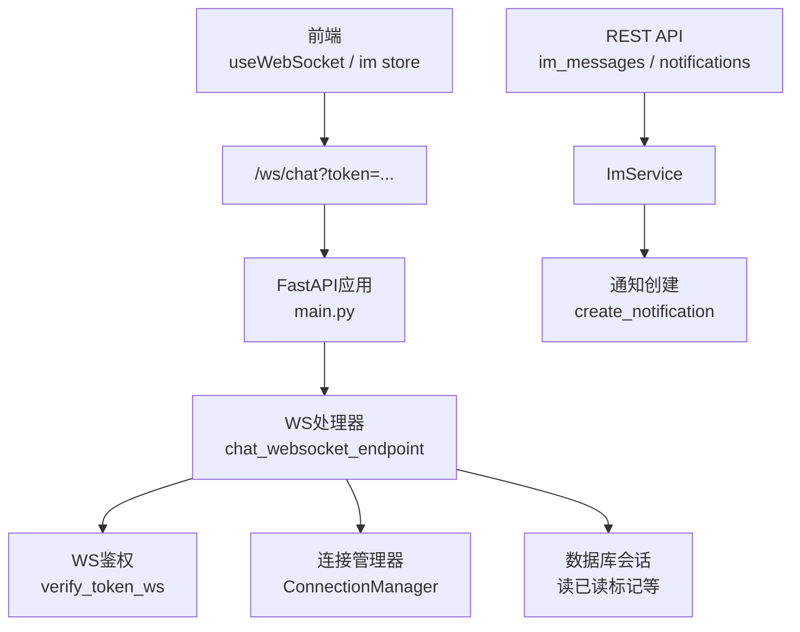
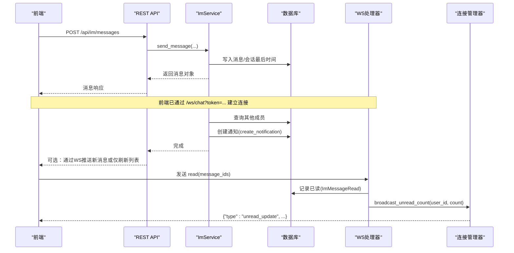
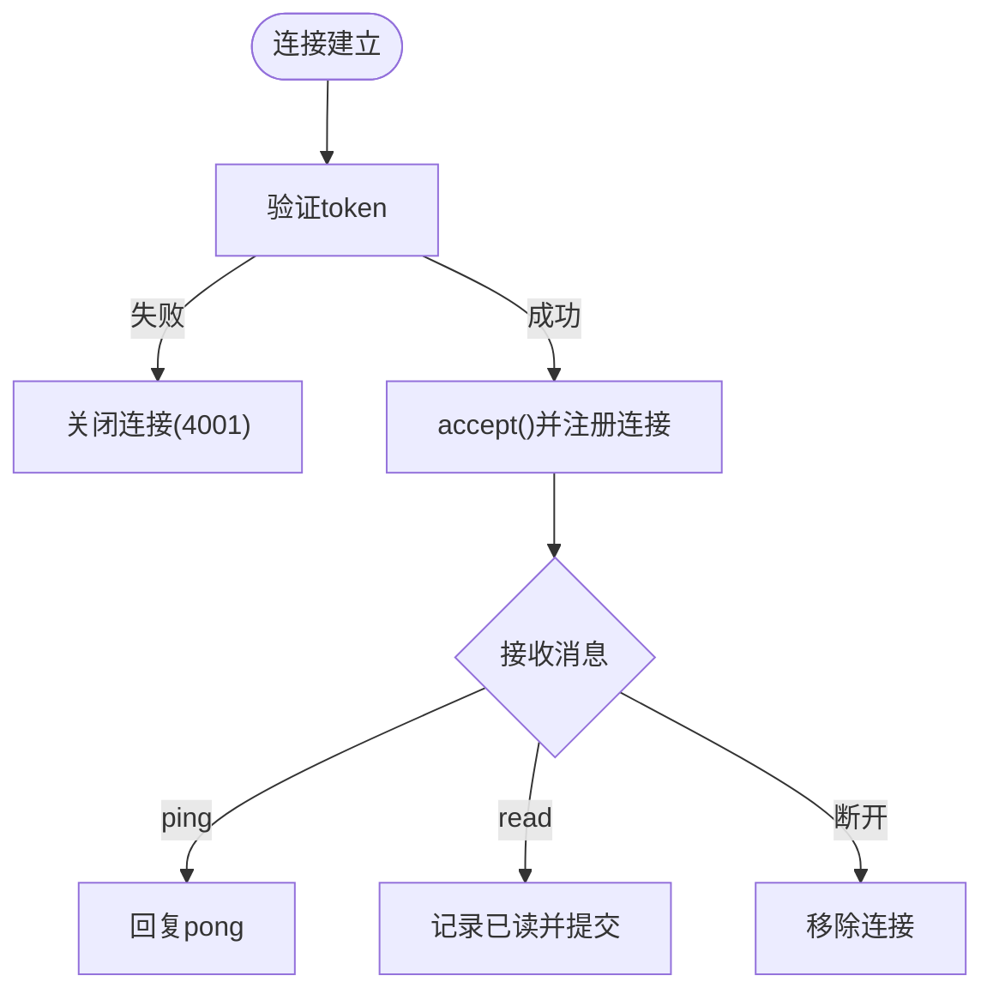
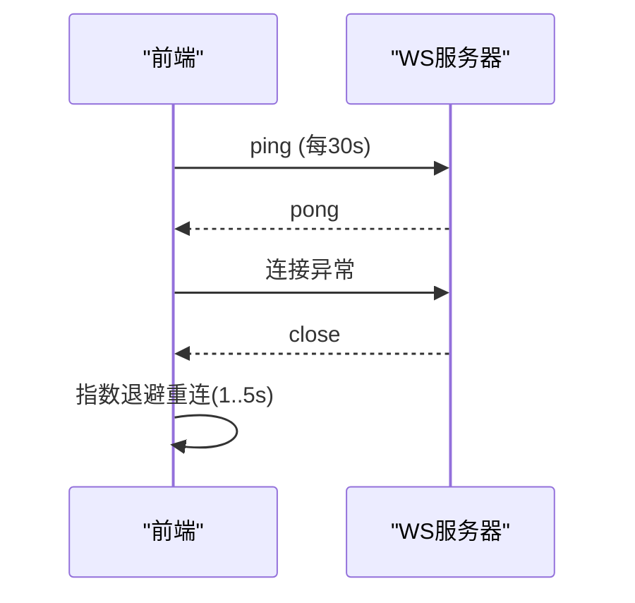
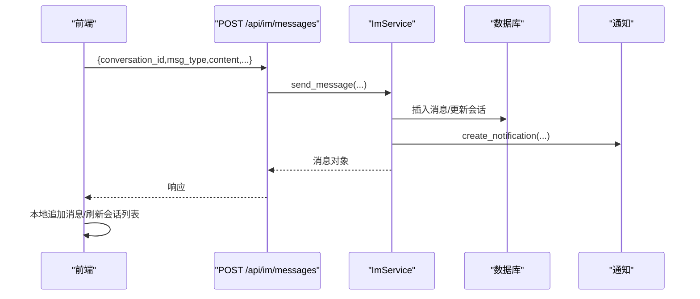
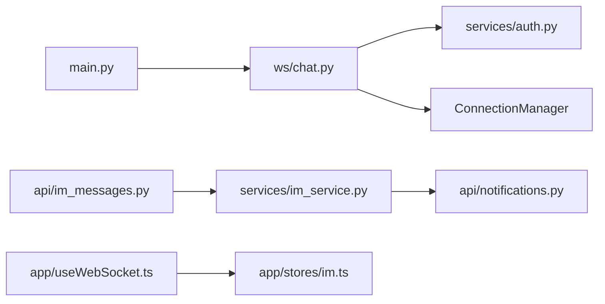

# WebSocket实时通信

<cite>
**本文引用的文件**
- [web/backend/app/main.py](file://web/backend/app/main.py)
- [web/backend/ws/chat.py](file://web/backend/ws/chat.py)
- [web/backend/services/auth.py](file://web/backend/services/auth.py)
- [web/backend/api/im_messages.py](file://web/backend/api/im_messages.py)
- [web/backend/services/im_service.py](file://web/backend/services/im_service.py)
- [web/backend/api/notifications.py](file://web/backend/api/notifications.py)
- [web/app/src/composables/useWebSocket.ts](file://web/app/src/composables/useWebSocket.ts)
- [web/app/src/stores/im.ts](file://web/app/src/stores/im.ts)
- [hermes_plan/2026-04-28_IM-social-system-plan.md](file://hermes_plan/2026-04-28_IM-social-system-plan.md)
</cite>

## 目录
1. [简介](#简介)
2. [项目结构](#项目结构)
3. [核心组件](#核心组件)
4. [架构总览](#架构总览)
5. [详细组件分析](#详细组件分析)
6. [依赖关系分析](#依赖关系分析)
7. [性能与内存优化](#性能与内存优化)
8. [故障排查指南](#故障排查指南)
9. [结论](#结论)
10. [附录：协议与消息格式规范](#附录协议与消息格式规范)

## 简介
本文件面向Subskin项目的WebSocket实时通信能力，覆盖连接建立、鉴权、心跳检测、断线重连、消息路由、会话管理、聊天室广播策略、离线消息处理、通知联动以及前端集成等。文档同时给出当前实现与规划中的扩展点，帮助读者快速理解并安全扩展系统。

## 项目结构
后端以FastAPI提供REST API与WebSocket端点；IM业务逻辑集中在服务层；前端通过Vue组合式函数封装WebSocket连接、心跳与重连，并在状态管理中订阅消息事件。

图表来源
- [web/backend/app/main.py:340-342](file://web/backend/app/main.py#L340-L342)
- [web/backend/ws/chat.py:45-51](file://web/backend/ws/chat.py#L45-L51)
- [web/backend/services/auth.py:257-282](file://web/backend/services/auth.py#L257-L282)
- [web/backend/api/im_messages.py:41-63](file://web/backend/api/im_messages.py#L41-L63)
- [web/backend/services/im_service.py:215-286](file://web/backend/services/im_service.py#L215-L286)
- [web/backend/api/notifications.py:84-109](file://web/backend/api/notifications.py#L84-L109)

章节来源
- [web/backend/app/main.py:264-342](file://web/backend/app/main.py#L264-L342)
- [web/backend/ws/chat.py:14-51](file://web/backend/ws/chat.py#L14-L51)
- [web/backend/services/auth.py:257-282](file://web/backend/services/auth.py#L257-L282)
- [web/backend/api/im_messages.py:1-78](file://web/backend/api/im_messages.py#L1-L78)
- [web/backend/services/im_service.py:215-286](file://web/backend/services/im_service.py#L215-L286)
- [web/backend/api/notifications.py:84-109](file://web/backend/api/notifications.py#L84-L109)

## 核心组件
- WebSocket端点与连接管理：负责接收连接、鉴权、维护活跃连接、发送用户级事件（如未读数更新）。
- 鉴权：基于JWT的WS鉴权，校验access token并确认用户有效。
- IM服务：会话与消息持久化、撤回、未读数计算、通知创建。
- 前端WS封装：自动选择ws/wss、携带token、定时ping、错误关闭与指数退避重连、消息分发。
- 前端IM Store：订阅message.new、message.recall、unread_update等事件，驱动UI更新。

章节来源
- [web/backend/ws/chat.py:14-51](file://web/backend/ws/chat.py#L14-L51)
- [web/backend/services/auth.py:257-282](file://web/backend/services/auth.py#L257-L282)
- [web/backend/services/im_service.py:215-286](file://web/backend/services/im_service.py#L215-L286)
- [web/app/src/composables/useWebSocket.ts:11-53](file://web/app/src/composables/useWebSocket.ts#L11-L53)
- [web/app/src/stores/im.ts:82-101](file://web/app/src/stores/im.ts#L82-L101)

## 架构总览
下图展示从前端到后端的完整交互链路，包括REST发消息、通知创建、WS推送未读数与消息事件。

图表来源
- [web/backend/api/im_messages.py:41-63](file://web/backend/api/im_messages.py#L41-L63)
- [web/backend/services/im_service.py:215-286](file://web/backend/services/im_service.py#L215-L286)
- [web/backend/api/notifications.py:84-109](file://web/backend/api/notifications.py#L84-L109)
- [web/backend/ws/chat.py:58-105](file://web/backend/ws/chat.py#L58-L105)
- [web/backend/ws/chat.py:35-39](file://web/backend/ws/chat.py#L35-L39)

## 详细组件分析

### WebSocket连接与鉴权
- 连接入口：/ws/chat?token=...，由FastAPI注册。
- 鉴权：使用verify_token_ws解析JWT，校验类型与有效性，并检查用户状态。
- 连接管理：ConnectionManager维护user_id到WebSocket实例的映射，支持单发与未读数广播。

图表来源
- [web/backend/app/main.py:340-342](file://web/backend/app/main.py#L340-L342)
- [web/backend/services/auth.py:257-282](file://web/backend/services/auth.py#L257-L282)
- [web/backend/ws/chat.py:18-39](file://web/backend/ws/chat.py#L18-L39)
- [web/backend/ws/chat.py:58-105](file://web/backend/ws/chat.py#L58-L105)

章节来源
- [web/backend/app/main.py:340-342](file://web/backend/app/main.py#L340-L342)
- [web/backend/ws/chat.py:14-51](file://web/backend/ws/chat.py#L14-L51)
- [web/backend/services/auth.py:257-282](file://web/backend/services/auth.py#L257-L282)

### 心跳检测与断线重连
- 前端每30秒发送一次ping，服务端收到后回复pong。
- 连接异常时触发onclose，按指数退避尝试重连（最多5次）。

图表来源
- [web/app/src/composables/useWebSocket.ts:22-53](file://web/app/src/composables/useWebSocket.ts#L22-L53)
- [web/backend/ws/chat.py:56-57](file://web/backend/ws/chat.py#L56-L57)

章节来源
- [web/app/src/composables/useWebSocket.ts:11-53](file://web/app/src/composables/useWebSocket.ts#L11-L53)
- [web/backend/ws/chat.py:56-57](file://web/backend/ws/chat.py#L56-L57)

### 消息路由与会话管理
- 消息发送走REST接口，服务层校验成员与禁言状态，落库并更新会话最后消息时间。
- 为其他成员创建通知，便于桌面/系统级提醒。
- 前端通过store订阅message.new等事件进行增量渲染。

图表来源
- [web/backend/api/im_messages.py:41-63](file://web/backend/api/im_messages.py#L41-L63)
- [web/backend/services/im_service.py:215-286](file://web/backend/services/im_service.py#L215-L286)
- [web/backend/api/notifications.py:84-109](file://web/backend/api/notifications.py#L84-L109)

章节来源
- [web/backend/api/im_messages.py:1-78](file://web/backend/api/im_messages.py#L1-L78)
- [web/backend/services/im_service.py:215-286](file://web/backend/services/im_service.py#L215-L286)
- [web/backend/api/notifications.py:84-109](file://web/backend/api/notifications.py#L84-L109)

### 聊天室功能与广播策略
- 当前实现：
  - 通过REST发送消息，服务层创建通知。
  - WS用于心跳、已读回执与未读数更新推送。
- 规划扩展（参考设计文档）：
  - 支持typing、message.new、message.read、message.recall等事件通过WS广播给会话成员。
  - 会话级广播可排除发送者。

章节来源
- [hermes_plan/2026-04-28_IM-social-system-plan.md:267-297](file://hermes_plan/2026-04-28_IM-social-system-plan.md#L267-L297)

### 离线消息处理
- 已读回执：客户端发送read(message_ids)，服务端校验成员身份后写入ImMessageRead。
- 未读数：根据会话last_read_at与消息时间计算，并通过WS推送unread_update。
- 通知：消息到达时为其他成员创建通知，便于离线场景下的提醒。

章节来源
- [web/backend/ws/chat.py:58-105](file://web/backend/ws/chat.py#L58-L105)
- [web/backend/services/im_service.py:90-194](file://web/backend/services/im_service.py#L90-L194)
- [web/backend/api/notifications.py:84-109](file://web/backend/api/notifications.py#L84-L109)

### 连接鉴权、心跳检测、断线重连机制
- 鉴权：WS连接参数携带token，服务端校验access token与用户状态。
- 心跳：前端定时ping，服务端回pong。
- 重连：前端在onclose中按指数退避重试，上限5次。

章节来源
- [web/backend/services/auth.py:257-282](file://web/backend/services/auth.py#L257-L282)
- [web/backend/ws/chat.py:45-51](file://web/backend/ws/chat.py#L45-L51)
- [web/app/src/composables/useWebSocket.ts:22-53](file://web/app/src/composables/useWebSocket.ts#L22-L53)

### 消息队列集成与异步任务处理
- 当前实现：消息发送与通知创建在请求上下文中同步执行。
- 建议扩展：将通知创建与后续WS广播放入后台任务/队列，降低主流程延迟，提高吞吐。

[本节为通用建议，不直接分析具体文件]

### 内存管理优化
- 连接表：ConnectionManager使用字典存储活跃连接，需关注进程重启导致连接丢失。
- 数据库会话：WS读取已读时使用SessionLocal，注意异常分支确保关闭。
- 建议：对长连接增加健康检查与超时清理，避免僵尸连接占用资源。

章节来源
- [web/backend/ws/chat.py:14-39](file://web/backend/ws/chat.py#L14-L39)
- [web/backend/ws/chat.py:58-105](file://web/backend/ws/chat.py#L58-L105)

## 依赖关系分析
- FastAPI应用注册WS端点与REST路由。
- WS处理器依赖鉴权服务与连接管理器。
- IM服务依赖数据库模型与通知模块。
- 前端组合式函数封装WS连接与事件分发，Store订阅事件驱动UI。

图表来源
- [web/backend/app/main.py:340-342](file://web/backend/app/main.py#L340-L342)
- [web/backend/ws/chat.py:45-51](file://web/backend/ws/chat.py#L45-L51)
- [web/backend/services/auth.py:257-282](file://web/backend/services/auth.py#L257-L282)
- [web/backend/api/im_messages.py:41-63](file://web/backend/api/im_messages.py#L41-L63)
- [web/backend/services/im_service.py:215-286](file://web/backend/services/im_service.py#L215-L286)
- [web/backend/api/notifications.py:84-109](file://web/backend/api/notifications.py#L84-L109)
- [web/app/src/composables/useWebSocket.ts:11-53](file://web/app/src/composables/useWebSocket.ts#L11-L53)
- [web/app/src/stores/im.ts:82-101](file://web/app/src/stores/im.ts#L82-L101)

章节来源
- [web/backend/app/main.py:264-342](file://web/backend/app/main.py#L264-L342)
- [web/backend/ws/chat.py:14-51](file://web/backend/ws/chat.py#L14-L51)
- [web/backend/api/im_messages.py:1-78](file://web/backend/api/im_messages.py#L1-L78)
- [web/backend/services/im_service.py:215-286](file://web/backend/services/im_service.py#L215-L286)
- [web/backend/api/notifications.py:84-109](file://web/backend/api/notifications.py#L84-L109)
- [web/app/src/composables/useWebSocket.ts:11-53](file://web/app/src/composables/useWebSocket.ts#L11-L53)
- [web/app/src/stores/im.ts:82-101](file://web/app/src/stores/im.ts#L82-L101)

## 性能与内存优化
- 减少阻塞：将通知创建与WS广播移至后台任务，避免影响消息发送RTT。
- 批量操作：合并多次read回执为批量写入，降低DB压力。
- 连接治理：定期扫描长时间无心跳的连接并清理。
- 缓存未读数：热点会话的未读数可短期缓存，结合失效策略减少重复计算。
- 限流保护：已有写频限制，可扩展至WS通道（例如每秒最大事件数）。

[本节为通用建议，不直接分析具体文件]

## 故障排查指南
- 连接失败：检查token是否有效、用户是否被禁用；确认CORS与代理配置允许ws/wss。
- 心跳异常：确认前端定时器未被页面休眠策略暂停；检查网络与反向代理超时设置。
- 未读数不同步：核对read回执是否正确写入，检查会话成员权限与last_read_at更新。
- 通知缺失：检查通知创建是否抛出异常或被忽略；确认目标用户存在且非自身。

章节来源
- [web/backend/services/auth.py:257-282](file://web/backend/services/auth.py#L257-L282)
- [web/backend/ws/chat.py:58-105](file://web/backend/ws/chat.py#L58-L105)
- [web/backend/api/notifications.py:84-109](file://web/backend/api/notifications.py#L84-L109)

## 结论
当前实现已具备稳定的WS连接、鉴权、心跳与重连，以及消息持久化与通知能力。未来可通过WS广播消息事件、会话级转发与队列化异步任务，进一步提升实时性与可扩展性。

[本节为总结，不直接分析具体文件]

## 附录：协议与消息格式规范
- 连接URL：/ws/chat?token=<JWT access token>
- 客户端→服务端
  - type: "ping"
  - type: "read", message_ids: [int, ...]
- 服务端→客户端
  - type: "pong"
  - type: "unread_update", data.total_unread: int
  - 规划扩展（见设计文档）：message.new、message.recall、message.read、typing、friend.request、conversation.new等

章节来源
- [web/backend/ws/chat.py:56-57](file://web/backend/ws/chat.py#L56-L57)
- [web/backend/ws/chat.py:35-39](file://web/backend/ws/chat.py#L35-L39)
- [hermes_plan/2026-04-28_IM-social-system-plan.md:267-297](file://hermes_plan/2026-04-28_IM-social-system-plan.md#L267-L297)