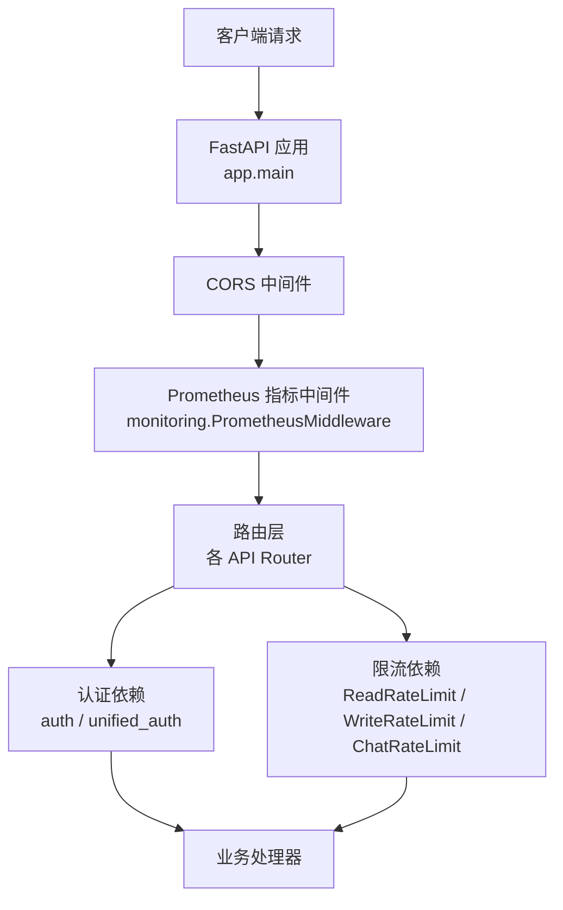
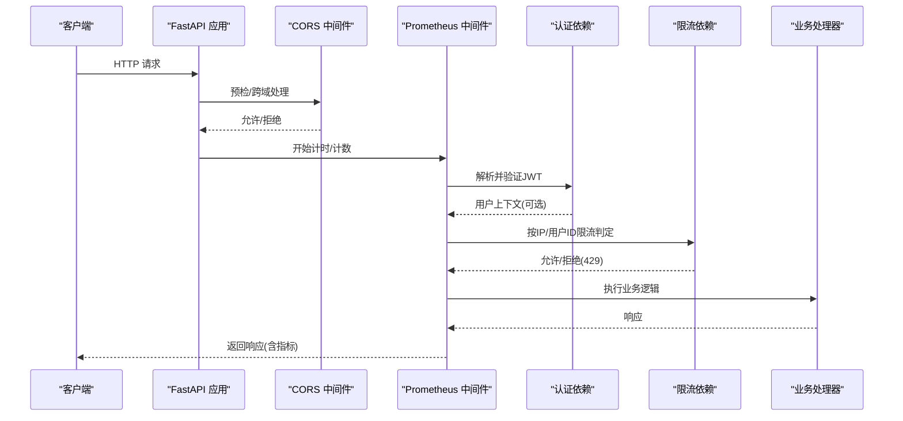
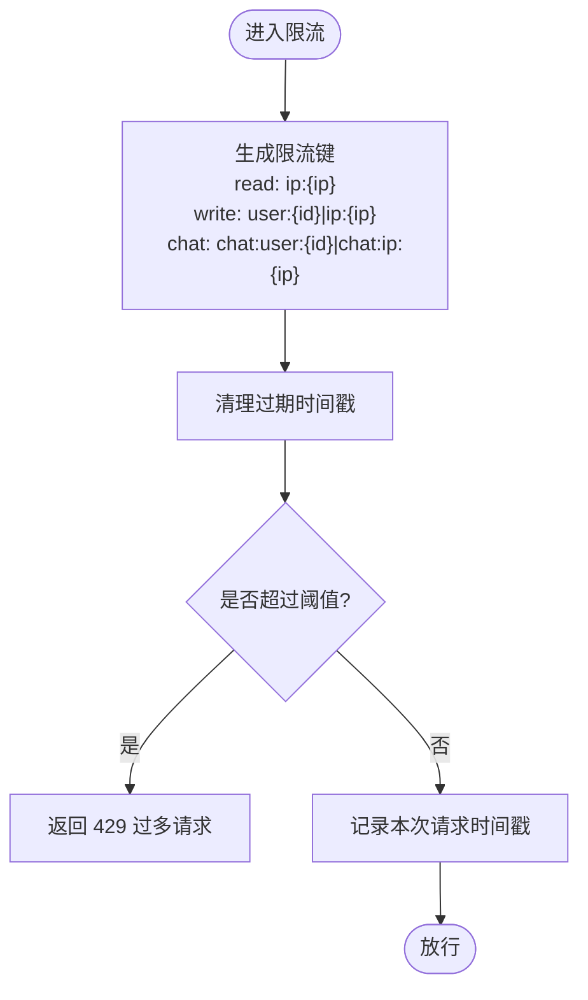
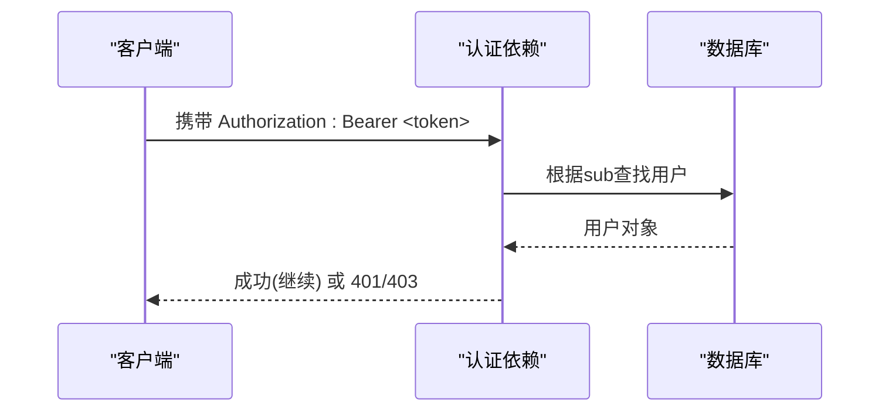
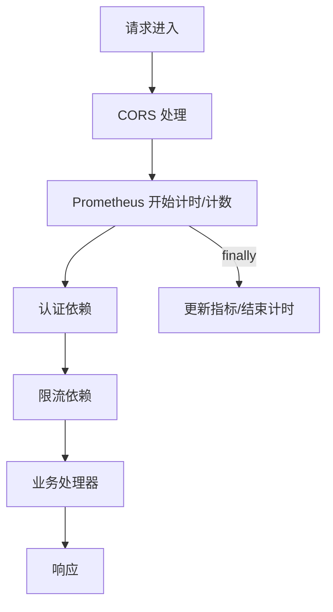
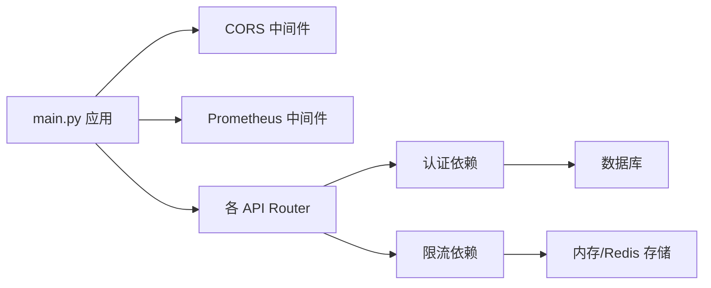

# 中间件系统

<cite>
**本文引用的文件**
- [web/backend/app/main.py](file://web/backend/app/main.py)
- [web/backend/app/middleware/rate_limit.py](file://web/backend/app/middleware/rate_limit.py)
- [web/backend/services/monitoring.py](file://web/backend/services/monitoring.py)
- [web/backend/services/auth.py](file://web/backend/services/auth.py)
- [web/backend/services/unified_auth.py](file://web/backend/services/unified_auth.py)
- [web/backend/api/community.py](file://web/backend/api/community.py)
- [web/backend/api/rag.py](file://web/backend/api/rag.py)
</cite>

## 目录
1. [简介](#简介)
2. [项目结构](#项目结构)
3. [核心组件](#核心组件)
4. [架构总览](#架构总览)
5. [详细组件分析](#详细组件分析)
6. [依赖关系分析](#依赖关系分析)
7. [性能考量](#性能考量)
8. [故障排查指南](#故障排查指南)
9. [结论](#结论)
10. [附录](#附录)

## 简介
本文件为 Subskin 后端中间件系统的系统设计文档，聚焦以下目标：
- 自定义中间件的实现原理、执行顺序与上下文传递机制
- 限流中间件（rate limiting）的实现策略、键空间设计、以及可扩展至 Redis 的集成方案
- CORS 中间件配置、日志记录与监控中间件、认证授权中间件
- 中间件链式调用、异常捕获、性能监控
- 提供中间件架构图与请求处理时序图

## 项目结构
Subskin 后端基于 FastAPI，采用“应用启动时注册全局中间件 + 路由级依赖注入”的组合方式组织中间件能力：
- 全局中间件：CORS、Prometheus 指标采集等
- 路由级依赖：按端点粒度接入认证、限流等横切逻辑
- 监控与错误追踪：Sentry 初始化、Prometheus 指标收集与健康检查

图表来源
- [web/backend/app/main.py:264-327](file://web/backend/app/main.py#L264-L327)
- [web/backend/services/monitoring.py:96-183](file://web/backend/services/monitoring.py#L96-L183)

章节来源
- [web/backend/app/main.py:264-327](file://web/backend/app/main.py#L264-L327)

## 核心组件
- CORS 中间件：通过环境变量或环境模式动态控制允许的源，支持凭证与通配方法/头。
- Prometheus 指标中间件：统计请求总量、耗时、并发数，并暴露 /metrics 端点。
- 认证授权中间件：基于 JWT 的访问令牌校验、可选用户获取、管理员权限校验；统一入口封装多种认证方式。
- 限流中间件：进程内令牌桶实现，按 IP 或用户 ID 维度进行读/写/聊天三类限流；可替换为 Redis 实现以支持多实例。
- 监控与错误追踪：Sentry 初始化与敏感信息过滤；健康检查端点。

章节来源
- [web/backend/app/main.py:210-278](file://web/backend/app/main.py#L210-L278)
- [web/backend/services/monitoring.py:28-91](file://web/backend/services/monitoring.py#L28-L91)
- [web/backend/services/monitoring.py:96-183](file://web/backend/services/monitoring.py#L96-L183)
- [web/backend/services/auth.py:179-254](file://web/backend/services/auth.py#L179-L254)
- [web/backend/services/unified_auth.py:18-68](file://web/backend/services/unified_auth.py#L18-L68)
- [web/backend/app/middleware/rate_limit.py:10-96](file://web/backend/app/middleware/rate_limit.py#L10-L96)

## 架构总览
下图展示了从请求进入 FastAPI 到最终返回响应的完整链路，包括 CORS、监控、认证与限流的协作关系。

图表来源
- [web/backend/app/main.py:264-327](file://web/backend/app/main.py#L264-L327)
- [web/backend/services/monitoring.py:141-172](file://web/backend/services/monitoring.py#L141-L172)
- [web/backend/services/auth.py:204-254](file://web/backend/services/auth.py#L204-L254)
- [web/backend/app/middleware/rate_limit.py:39-96](file://web/backend/app/middleware/rate_limit.py#L39-L96)

## 详细组件分析

### 限流中间件（Rate Limiting）
- 实现策略
  - 使用进程内令牌桶（滑动时间窗口），维护每个 key 的请求时间戳列表，定期清理过期时间戳。
  - 三类限流器：
    - 读接口：按 IP 限制（例如社区读接口 60次/分钟/IP）。
    - 写接口：优先按 user_id 限制，未登录回退到 IP（例如社区写接口 10次/分钟）。
    - 聊天接口：按 user_id 限制（防止 LLM 成本滥用），未登录共享匿名桶。
- 键空间设计
  - 读：ip:{client_ip}
  - 写：user:{user_id} 或 ip:{client_ip}
  - 聊天：chat:user:{user_id} 或 chat:ip:{client_ip}
- 上下文传递
  - 通过 request.state.user_id 读取当前用户（由认证依赖设置），用于精准限流。
- 可扩展至 Redis
  - 将 _buckets 替换为 Redis Hash/ZSet，key 前缀保持一致，保证分布式一致性。
  - 使用 Lua 脚本原子性完成“判量+扣减”，避免竞态。
  - 通过环境变量切换实现（如 RATE_LIMIT_BACKEND=memory|redis）。

图表来源
- [web/backend/app/middleware/rate_limit.py:10-96](file://web/backend/app/middleware/rate_limit.py#L10-L96)

章节来源
- [web/backend/app/middleware/rate_limit.py:10-96](file://web/backend/app/middleware/rate_limit.py#L10-L96)
- [web/backend/api/community.py:220-234](file://web/backend/api/community.py#L220-L234)
- [web/backend/api/rag.py:230-263](file://web/backend/api/rag.py#L230-L263)

### 认证与授权中间件
- 认证流程
  - 从请求头提取 Bearer Token，解码 JWT，校验类型与有效期，查询用户状态（激活/封禁）。
  - 提供 get_current_user、get_required_user、get_optional_user 等依赖，适配不同场景。
- 统一认证入口
  - unified_auth 封装 HTTPBearer，兼容多种认证来源（JWT、微信、支付宝、手机号验证码等扩展点）。
- 上下文传递
  - 在认证通过后，可将 user_id 写入 request.state，供后续限流、审计等中间件使用。

图表来源
- [web/backend/services/auth.py:179-254](file://web/backend/services/auth.py#L179-L254)
- [web/backend/services/unified_auth.py:18-68](file://web/backend/services/unified_auth.py#L18-L68)

章节来源
- [web/backend/services/auth.py:179-254](file://web/backend/services/auth.py#L179-L254)
- [web/backend/services/unified_auth.py:18-68](file://web/backend/services/unified_auth.py#L18-L68)

### CORS 中间件配置
- 动态来源控制
  - 生产环境仅允许配置的域名；开发环境额外允许本地调试端口。
  - 可通过 ALLOWED_ORIGINS 环境变量覆盖默认值。
- 安全建议
  - 生产环境严格限定 allow_origins，避免使用通配符。
  - 谨慎启用 allow_credentials，确保白名单精确。

章节来源
- [web/backend/app/main.py:196-222](file://web/backend/app/main.py#L196-L222)
- [web/backend/app/main.py:272-278](file://web/backend/app/main.py#L272-L278)

### 日志记录与监控中间件
- Sentry 错误追踪
  - 自动集成 FastAPI/Starlette/SQLAlchemy，过滤敏感字段，支持采样率与环境标识。
- Prometheus 指标
  - 统计 http_requests_total、http_request_duration_seconds、http_requests_in_progress。
  - 暴露 /metrics 端点，便于 Prometheus 抓取。
- 健康检查
  - 提供 /api/health 端点，检查数据库连接与磁盘空间。

章节来源
- [web/backend/services/monitoring.py:28-91](file://web/backend/services/monitoring.py#L28-L91)
- [web/backend/services/monitoring.py:96-183](file://web/backend/services/monitoring.py#L96-L183)
- [web/backend/app/main.py:321-327](file://web/backend/app/main.py#L321-L327)

### 中间件链式调用与异常捕获
- 执行顺序
  - 请求进入后依次经过 CORS → Prometheus → 路由依赖（认证/限流）→ 业务处理器。
- 异常捕获
  - Prometheus 中间件在 call_next 过程中捕获异常，统一记录耗时与状态码。
  - 认证与限流依赖抛出标准 HTTPException，框架统一转换为响应。
- 上下文传递
  - 认证通过后，可在 request.state 中注入 user_id，供后续依赖使用。

图表来源
- [web/backend/services/monitoring.py:141-172](file://web/backend/services/monitoring.py#L141-L172)
- [web/backend/app/middleware/rate_limit.py:39-96](file://web/backend/app/middleware/rate_limit.py#L39-L96)
- [web/backend/services/auth.py:204-254](file://web/backend/services/auth.py#L204-L254)

章节来源
- [web/backend/services/monitoring.py:141-172](file://web/backend/services/monitoring.py#L141-L172)
- [web/backend/app/middleware/rate_limit.py:39-96](file://web/backend/app/middleware/rate_limit.py#L39-L96)
- [web/backend/services/auth.py:204-254](file://web/backend/services/auth.py#L204-L254)

## 依赖关系分析
- 应用启动阶段
  - main.py 注册 CORS 与 Prometheus 中间件，并包含所有路由。
- 路由依赖
  - community.py 使用 ReadRateLimit 与 limit_write_for_user 对写操作进行限流。
  - rag.py 在聊天接口中按用户维度进行限流，防止 LLM 成本滥用。
- 认证依赖
  - auth.py 提供 JWT 校验与用户获取；unified_auth.py 提供统一入口。

图表来源
- [web/backend/app/main.py:264-327](file://web/backend/app/main.py#L264-L327)
- [web/backend/api/community.py:220-234](file://web/backend/api/community.py#L220-L234)
- [web/backend/api/rag.py:230-263](file://web/backend/api/rag.py#L230-L263)
- [web/backend/services/auth.py:179-254](file://web/backend/services/auth.py#L179-L254)

章节来源
- [web/backend/app/main.py:264-327](file://web/backend/app/main.py#L264-L327)
- [web/backend/api/community.py:220-234](file://web/backend/api/community.py#L220-L234)
- [web/backend/api/rag.py:230-263](file://web/backend/api/rag.py#L230-L263)
- [web/backend/services/auth.py:179-254](file://web/backend/services/auth.py#L179-L254)

## 性能考量
- 限流
  - 进程内实现适合单实例部署；多实例需迁移至 Redis 以保证一致性。
  - 滑动窗口清理应在高频路径外异步进行，或在 Redis 中使用有序集合 TTL。
- 监控
  - Prometheus 指标使用路由模板作为 endpoint 标签，避免高基数问题。
  - 合理设置 Histogram 分桶，平衡精度与开销。
- 认证
  - JWT 解码与数据库查询应缓存热点用户信息，减少重复 IO。
  - 对频繁调用的可选认证端点使用 get_optional_user，降低失败分支开销。

[本节为通用指导，不直接分析具体文件]

## 故障排查指南
- 常见问题
  - 429 过多请求：检查对应限流器的阈值与键空间是否正确；确认是否误用 IP 而非 user_id。
  - 401/403 认证失败：检查 JWT 是否有效、用户是否被封禁或停用。
  - CORS 预检失败：核对 ALLOWED_ORIGINS 与前端来源是否一致。
- 定位手段
  - 查看 Prometheus 指标：http_requests_total、http_request_duration_seconds。
  - 启用 Sentry 上报异常，过滤敏感信息后集中告警。
  - 健康检查端点 /api/health 检查数据库与磁盘状态。

章节来源
- [web/backend/services/monitoring.py:28-91](file://web/backend/services/monitoring.py#L28-L91)
- [web/backend/services/monitoring.py:208-240](file://web/backend/services/monitoring.py#L208-L240)
- [web/backend/app/middleware/rate_limit.py:39-96](file://web/backend/app/middleware/rate_limit.py#L39-L96)
- [web/backend/services/auth.py:198-254](file://web/backend/services/auth.py#L198-L254)

## 结论
Subskin 后端通过 FastAPI 的中间件与依赖注入机制，构建了清晰的横切能力边界：CORS 负责跨域、Prometheus 负责指标、认证负责鉴权、限流负责保护资源。当前限流采用进程内实现，易于部署与维护；在多实例环境下建议迁移至 Redis 以提升一致性与扩展性。结合 Sentry 与 Prometheus，形成了完善的错误追踪与性能观测体系。

[本节为总结，不直接分析具体文件]

## 附录
- 关键配置项
  - CORS：ALLOWED_ORIGINS、APP_ENV
  - 监控：SENTRY_DSN、SENTRY_ENVIRONMENT、SENTRY_TRACES_SAMPLE_RATE、PROMETHEUS_ENABLED
  - 认证：SECRET_KEY、ALGORITHM、ACCESS_TOKEN_EXPIRE_MINUTES、REFRESH_TOKEN_EXPIRE_DAYS、ADMIN_TOKEN_EXPIRE_DAYS、FILE_TOKEN_EXPIRE_MINUTES
- 扩展建议
  - 限流后端：增加 RATE_LIMIT_BACKEND=redis 并实现 Redis 适配器。
  - 日志：引入结构化日志（JSON）与 TraceID 透传，便于链路追踪。
  - 安全：在生产环境收紧 CORS 白名单，禁用通配符方法与头。

[本节为补充说明，不直接分析具体文件]