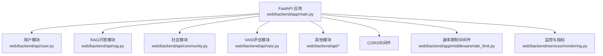
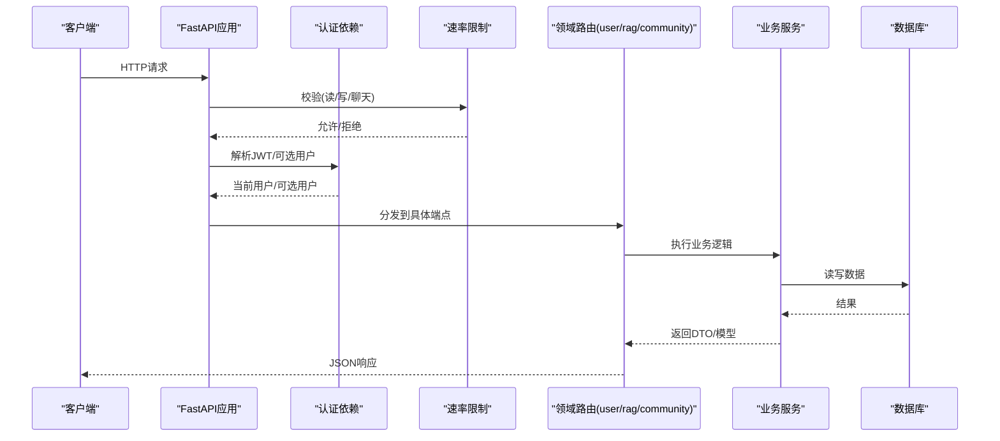
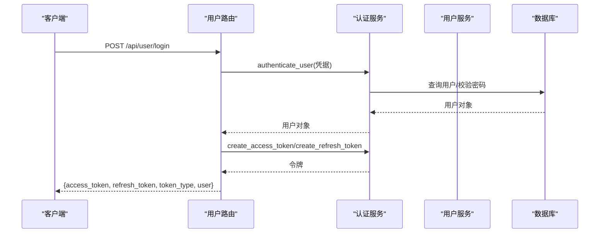
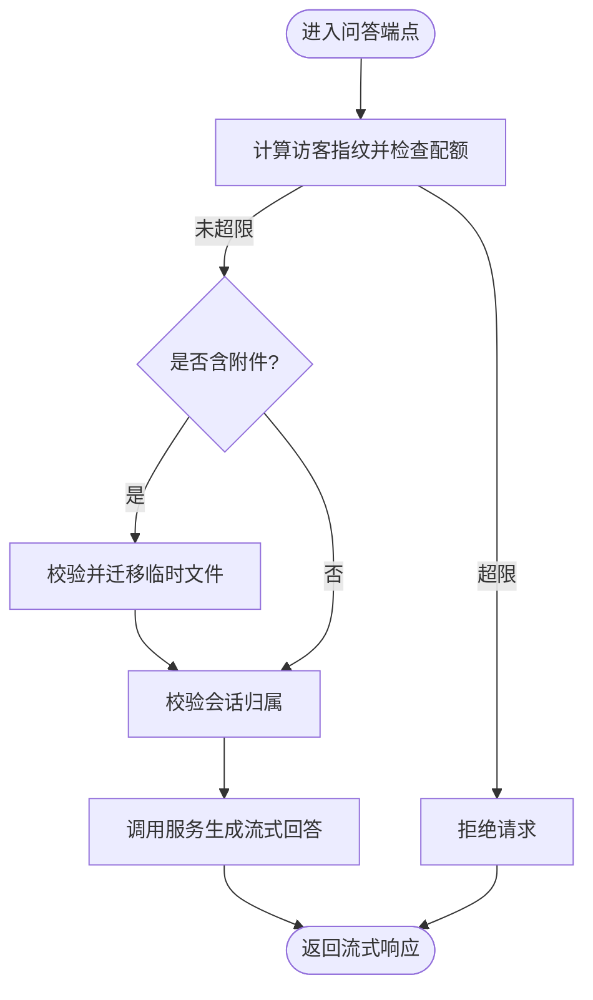
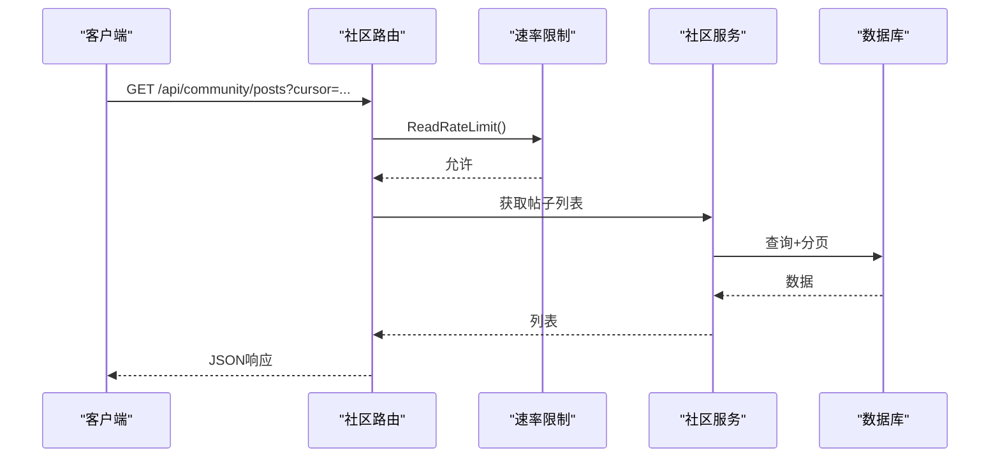
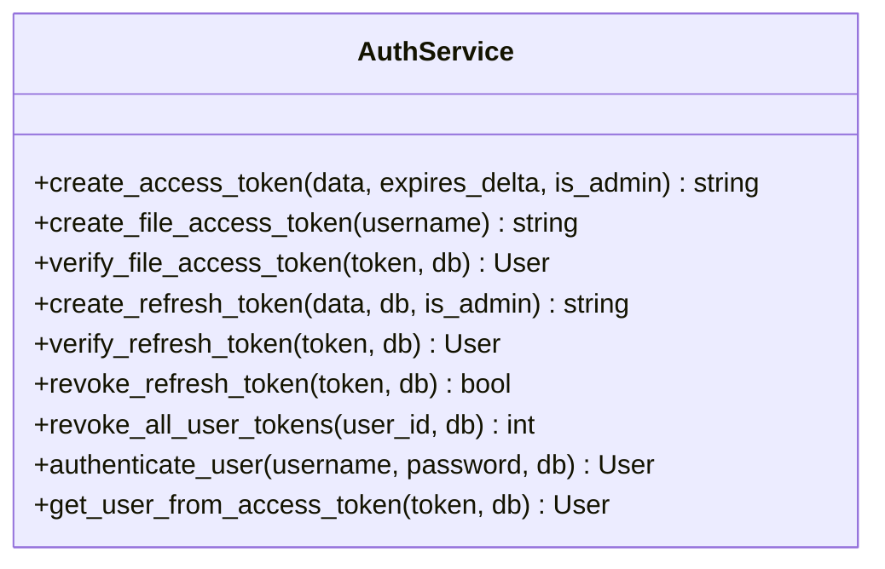
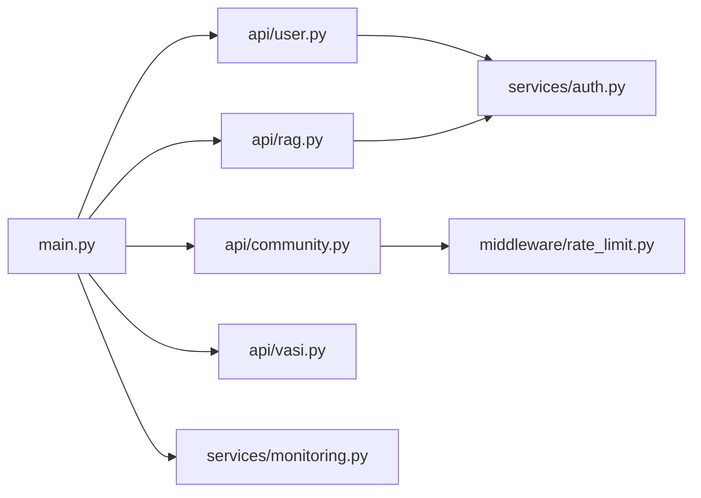

# API层设计

<cite>
**本文引用的文件**
- [web/backend/app/main.py](file://web/backend/app/main.py)
- [web/backend/api/__init__.py](file://web/backend/api/__init__.py)
- [web/backend/api/user.py](file://web/backend/api/user.py)
- [web/backend/api/rag.py](file://web/backend/api/rag.py)
- [web/backend/api/community.py](file://web/backend/api/community.py)
- [web/backend/app/middleware/rate_limit.py](file://web/backend/app/middleware/rate_limit.py)
- [web/backend/services/auth.py](file://web/backend/services/auth.py)
- [web/backend/exceptions.py](file://web/backend/exceptions.py)
- [web/backend/services/monitoring.py](file://web/backend/services/monitoring.py)
</cite>

## 目录
1. [简介](#简介)
2. [项目结构](#项目结构)
3. [核心组件](#核心组件)
4. [架构总览](#架构总览)
5. [详细组件分析](#详细组件分析)
6. [依赖关系分析](#依赖关系分析)
7. [性能与扩展性](#性能与扩展性)
8. [故障排查指南](#故障排查指南)
9. [结论](#结论)
10. [附录：API端点示例与最佳实践](#附录api端点示例与最佳实践)

## 简介
本文件面向Subskin项目的后端API层，聚焦FastAPI路由层的架构设计与实现规范。内容涵盖RESTful设计规范、请求参数验证、响应格式标准化；模块组织（user、rag、vasi、community等）的职责划分；中间件机制（CORS、速率限制）、认证授权集成（JWT、刷新令牌、文件访问令牌）、错误处理策略；以及横切关注点（版本管理、速率限制、日志与监控）。文末提供具体端点示例与最佳实践建议，帮助团队统一接口风格与质量基线。

## 项目结构
后端以FastAPI为核心应用入口，集中注册各业务模块的路由器，并通过中间件与生命周期钩子完成全局配置。API模块按领域拆分，便于独立演进与维护。

图表来源
- [web/backend/app/main.py:264-319](file://web/backend/app/main.py#L264-L319)
- [web/backend/app/middleware/rate_limit.py:10-36](file://web/backend/app/middleware/rate_limit.py#L10-L36)
- [web/backend/services/monitoring.py:96-183](file://web/backend/services/monitoring.py#L96-L183)

章节来源
- [web/backend/app/main.py:264-319](file://web/backend/app/main.py#L264-L319)
- [web/backend/api/__init__.py:5-32](file://web/backend/api/__init__.py#L5-L32)

## 核心组件
- 应用入口与路由装配：在应用启动时创建数据库表、执行必要的列修复、挂载CORS、注册所有业务路由、初始化监控与LLM配置、暴露健康检查与WebSocket端点。
- 认证与授权：基于JWT的访问令牌与刷新令牌，支持管理员长时效令牌与短时效的文件访问令牌；提供当前用户获取与可选用户获取依赖。
- 速率限制：进程内令牌桶实现，按IP或用户ID限流，覆盖读、写、聊天三类场景。
- 监控与可观测性：Sentry异常追踪与Prometheus指标收集，提供HTTP请求计数、耗时、并发数等指标。
- 领域模块：
  - user：用户注册登录、凭证绑定、密码重置、资料更新、令牌刷新等。
  - rag：AI问答、文档/图片上传解析、访客配额、会话归属校验、流式回答。
  - community：帖子、评论、标签、收藏、点赞、同城定位、内容安全校验等。
  - vasi：白癜风评估相关能力（通过路由挂载于/api/vasi）。

章节来源
- [web/backend/app/main.py:74-180](file://web/backend/app/main.py#L74-L180)
- [web/backend/app/main.py:264-349](file://web/backend/app/main.py#L264-L349)
- [web/backend/services/auth.py:20-32](file://web/backend/services/auth.py#L20-L32)
- [web/backend/app/middleware/rate_limit.py:10-36](file://web/backend/app/middleware/rate_limit.py#L10-L36)
- [web/backend/services/monitoring.py:28-63](file://web/backend/services/monitoring.py#L28-L63)

## 架构总览
整体采用“应用入口 + 领域路由 + 服务层 + 数据模型”的分层结构。FastAPI负责HTTP协议适配与依赖注入；各模块API仅做入参校验与编排，核心逻辑下沉至services；数据访问通过SQLAlchemy ORM。

图表来源
- [web/backend/app/main.py:272-319](file://web/backend/app/main.py#L272-L319)
- [web/backend/app/middleware/rate_limit.py:39-84](file://web/backend/app/middleware/rate_limit.py#L39-L84)
- [web/backend/services/auth.py:179-195](file://web/backend/services/auth.py#L179-L195)

## 详细组件分析

### 用户模块（user）
- 职责：账号体系与鉴权基础能力，包括多方式登录（用户名/手机/邮箱）、验证码登录、密码管理、凭证绑定/解绑、个人资料更新、刷新令牌、管理员操作等。
- 关键设计：
  - 登录响应统一封装，包含access_token、refresh_token、token_type与用户信息。
  - 支持将历史凭证字段同步至用户对象，保证前端展示一致性。
  - 使用Pydantic模型进行请求体校验，确保输入合法性。
  - 结合审计日志与安全策略（如内容安全校验）提升安全性。

图表来源
- [web/backend/api/user.py:89-104](file://web/backend/api/user.py#L89-L104)
- [web/backend/services/auth.py:153-176](file://web/backend/services/auth.py#L153-L176)

章节来源
- [web/backend/api/user.py:1-200](file://web/backend/api/user.py#L1-L200)
- [web/backend/services/auth.py:153-195](file://web/backend/services/auth.py#L153-L195)

### RAG问答模块（rag）
- 职责：AI问答、文档/图片上传解析、访客每日配额、会话归属校验、流式回答。
- 关键设计：
  - 访客指纹生成用于配额控制，避免Nginx反代导致的IP失真问题。
  - 临时上传文件的安全迁移与元数据校验，防止越权使用。
  - 会话所有权校验，防止跨用户读取/注入。
  - 流式响应降低首字节延迟，提升交互体验。

图表来源
- [web/backend/api/rag.py:72-83](file://web/backend/api/rag.py#L72-L83)
- [web/backend/api/rag.py:99-133](file://web/backend/api/rag.py#L99-L133)
- [web/backend/api/rag.py:136-163](file://web/backend/api/rag.py#L136-L163)
- [web/backend/api/rag.py:188-200](file://web/backend/api/rag.py#L188-L200)

章节来源
- [web/backend/api/rag.py:1-200](file://web/backend/api/rag.py#L1-L200)

### 社区模块（community）
- 职责：帖子、评论、标签、收藏、点赞、同城定位、内容安全校验等。
- 关键设计：
  - 读接口按IP限速，写接口按用户ID限速（回退到IP），保护系统资源。
  - 同城定位通过异步线程池调用外部服务，避免阻塞事件循环。
  - 内容安全校验与夸张宣称检测，保障社区内容质量。

图表来源
- [web/backend/api/community.py:175-198](file://web/backend/api/community.py#L175-L198)
- [web/backend/app/middleware/rate_limit.py:39-50](file://web/backend/app/middleware/rate_limit.py#L39-L50)

章节来源
- [web/backend/api/community.py:1-200](file://web/backend/api/community.py#L1-L200)
- [web/backend/app/middleware/rate_limit.py:39-65](file://web/backend/app/middleware/rate_limit.py#L39-L65)

### VASI评估模块（vasi）
- 职责：白癜风评估相关的API能力，路由挂载于/api/vasi，与图片打标管理共享前缀。
- 关键设计：
  - 通过主应用集中注册路由，保持命名空间清晰。
  - 与用户、社区等模块协同，形成评估闭环。

章节来源
- [web/backend/app/main.py:291-319](file://web/backend/app/main.py#L291-L319)

### 认证与授权
- JWT访问令牌：支持普通用户与管理员不同过期时间，管理员默认更长有效期。
- 刷新令牌：持久化存储，支持撤销与批量撤销。
- 文件访问令牌：短时效、作用域限定为文件读取，降低泄露风险。
- 当前用户获取：从访问令牌解析用户，校验活跃状态与封禁状态。

图表来源
- [web/backend/services/auth.py:43-74](file://web/backend/services/auth.py#L43-L74)
- [web/backend/services/auth.py:96-126](file://web/backend/services/auth.py#L96-L126)
- [web/backend/services/auth.py:153-195](file://web/backend/services/auth.py#L153-L195)

章节来源
- [web/backend/services/auth.py:20-32](file://web/backend/services/auth.py#L20-L32)
- [web/backend/services/auth.py:43-195](file://web/backend/services/auth.py#L43-L195)

### 中间件与横切关注点
- CORS：根据环境动态配置允许的源，生产与开发分离。
- 速率限制：按IP或用户ID的令牌桶实现，覆盖读、写、聊天三类场景。
- 监控：Sentry异常追踪与Prometheus指标收集，提供HTTP请求计数、耗时、并发数等指标。
- 健康检查：/api/health用于服务存活探测。

章节来源
- [web/backend/app/main.py:196-228](file://web/backend/app/main.py#L196-L228)
- [web/backend/app/main.py:272-278](file://web/backend/app/main.py#L272-L278)
- [web/backend/app/middleware/rate_limit.py:10-36](file://web/backend/app/middleware/rate_limit.py#L10-L36)
- [web/backend/services/monitoring.py:28-63](file://web/backend/services/monitoring.py#L28-L63)
- [web/backend/services/monitoring.py:96-183](file://web/backend/services/monitoring.py#L96-L183)
- [web/backend/app/main.py:345-349](file://web/backend/app/main.py#L345-L349)

## 依赖关系分析
- 应用入口依赖各API模块路由器，集中注册路径前缀与标签。
- 认证服务被多个模块复用，提供统一的鉴权能力。
- 速率限制作为依赖注入，按需应用于读/写/聊天端点。
- 监控中间件在应用启动时初始化，条件启用Prometheus指标。

图表来源
- [web/backend/app/main.py:264-319](file://web/backend/app/main.py#L264-L319)
- [web/backend/api/user.py:43-55](file://web/backend/api/user.py#L43-L55)
- [web/backend/api/rag.py:40-52](file://web/backend/api/rag.py#L40-L52)
- [web/backend/api/community.py:13-19](file://web/backend/api/community.py#L13-L19)
- [web/backend/services/monitoring.py:28-63](file://web/backend/services/monitoring.py#L28-L63)

章节来源
- [web/backend/app/main.py:264-319](file://web/backend/app/main.py#L264-L319)
- [web/backend/api/user.py:43-55](file://web/backend/api/user.py#L43-L55)
- [web/backend/api/rag.py:40-52](file://web/backend/api/rag.py#L40-L52)
- [web/backend/api/community.py:13-19](file://web/backend/api/community.py#L13-L19)

## 性能与扩展性
- 流式响应：RAG问答使用流式输出，降低首字节延迟，提升用户体验。
- 异步IO：外部服务调用（如同城定位）放入线程池，避免阻塞事件循环。
- 缓存：IP定位结果短期缓存，减少外部依赖压力。
- 指标监控：Prometheus指标便于容量规划与瓶颈定位。
- 可扩展性：模块化路由便于新增领域；速率限制可按需扩展更多维度（如租户、功能开关）。

[本节为通用指导，不直接分析具体文件]

## 故障排查指南
- 认证失败：检查JWT签名、过期时间、用户状态（活跃/封禁）。
- 速率限制触发：确认限流键（IP/用户ID）是否正确，必要时调整阈值。
- 文件访问受限：确认文件令牌作用域与有效期，或改用访问令牌。
- 监控缺失：检查Sentry DSN与Prometheus环境变量，确认中间件已启用。
- 健康检查：/api/health应返回正常状态，否则检查应用启动流程。

章节来源
- [web/backend/services/auth.py:179-195](file://web/backend/services/auth.py#L179-L195)
- [web/backend/app/middleware/rate_limit.py:39-84](file://web/backend/app/middleware/rate_limit.py#L39-L84)
- [web/backend/services/monitoring.py:28-63](file://web/backend/services/monitoring.py#L28-L63)
- [web/backend/app/main.py:345-349](file://web/backend/app/main.py#L345-L349)

## 结论
Subskin后端API层以FastAPI为核心，采用清晰的模块化路由与分层架构，结合JWT认证、速率限制与监控能力，提供了稳定、可扩展且可观测的RESTful服务。通过统一的请求校验、响应标准化与横切关注点（CORS、限流、监控），有效提升了接口质量与运维效率。建议在后续迭代中继续完善错误码体系、开放API文档与自动化测试，进一步巩固工程质量。

[本节为总结性内容，不直接分析具体文件]

## 附录：API端点示例与最佳实践

- 健康检查
  - GET /api/health
  - 用途：服务存活探测
  - 参考：[web/backend/app/main.py:345-349](file://web/backend/app/main.py#L345-L349)

- 用户登录
  - POST /api/user/login
  - 说明：支持用户名/手机/邮箱登录，返回访问令牌、刷新令牌与用户信息
  - 参考：[web/backend/api/user.py:89-104](file://web/backend/api/user.py#L89-L104)

- 社区帖子列表（读接口）
  - GET /api/community/posts
  - 说明：支持游标分页，受读接口速率限制保护
  - 参考：[web/backend/api/community.py:175-198](file://web/backend/api/community.py#L175-L198)

- RAG问答（流式）
  - POST /api/rag/question
  - 说明：支持访客配额、附件上传解析、会话归属校验与流式回答
  - 参考：[web/backend/api/rag.py:72-83](file://web/backend/api/rag.py#L72-L83), [web/backend/api/rag.py:99-133](file://web/backend/api/rag.py#L99-L133), [web/backend/api/rag.py:136-163](file://web/backend/api/rag.py#L136-L163), [web/backend/api/rag.py:188-200](file://web/backend/api/rag.py#L188-L200)

- 速率限制
  - 读接口：按IP限流（60次/分钟）
  - 写接口：按用户ID限流（10次/分钟，回退到IP）
  - 聊天接口：按用户ID限流（20次/分钟，回退到IP）
  - 参考：[web/backend/app/middleware/rate_limit.py:10-36](file://web/backend/app/middleware/rate_limit.py#L10-L36), [web/backend/app/middleware/rate_limit.py:39-84](file://web/backend/app/middleware/rate_limit.py#L39-L84)

- 监控与指标
  - Sentry：异常追踪（可选）
  - Prometheus：/metrics端点（可选）
  - 参考：[web/backend/services/monitoring.py:28-63](file://web/backend/services/monitoring.py#L28-L63), [web/backend/services/monitoring.py:96-183](file://web/backend/services/monitoring.py#L96-L183)

- 最佳实践
  - 统一响应格式：建议使用一致的JSON结构（如data、error、message字段）
  - 严格入参校验：使用Pydantic模型定义请求体与查询参数
  - 明确错误码：区分业务异常与系统异常，便于前端处理
  - 安全优先：敏感信息不落盘，令牌最小权限原则
  - 可观测性：接入Sentry与Prometheus，持续优化性能与稳定性

[本节为示例与实践建议，不直接分析具体文件]