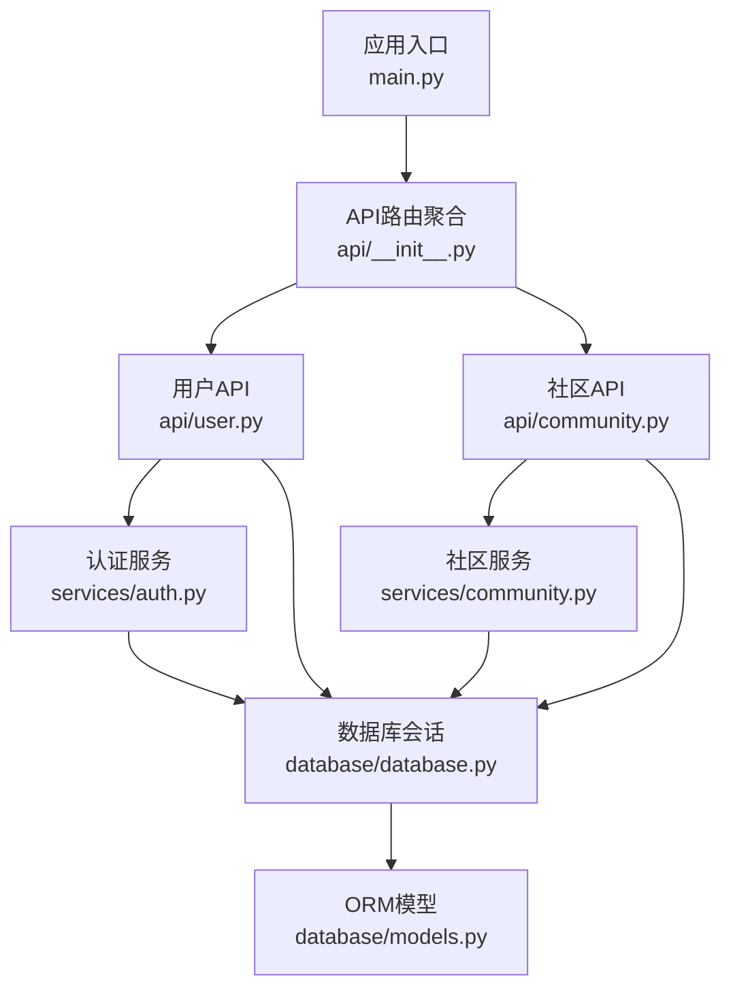
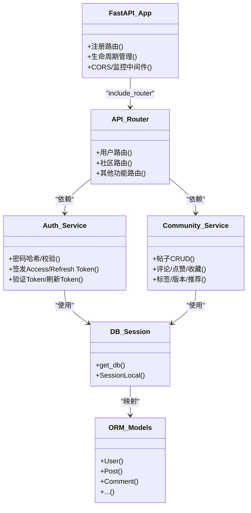
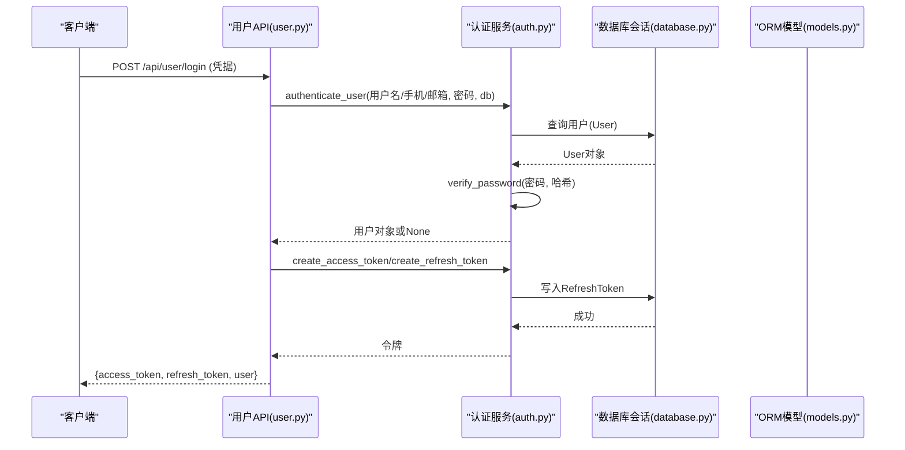
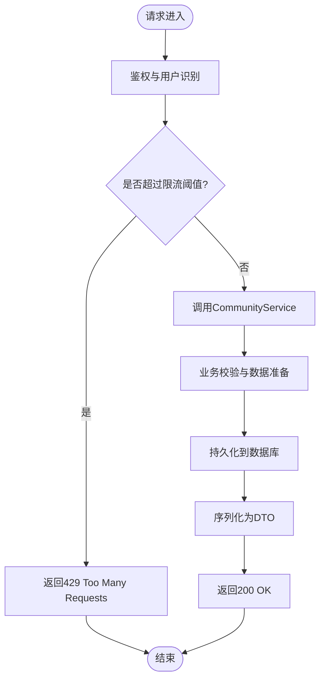
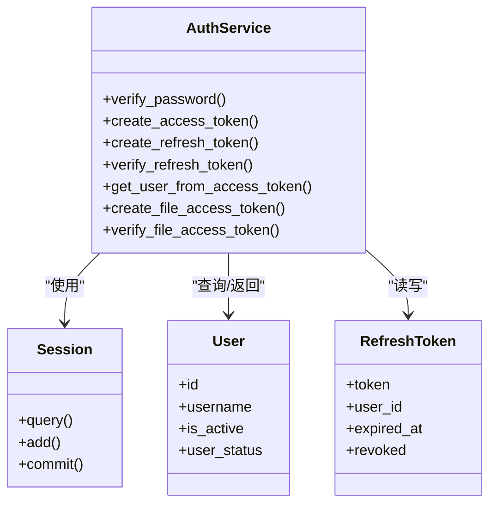
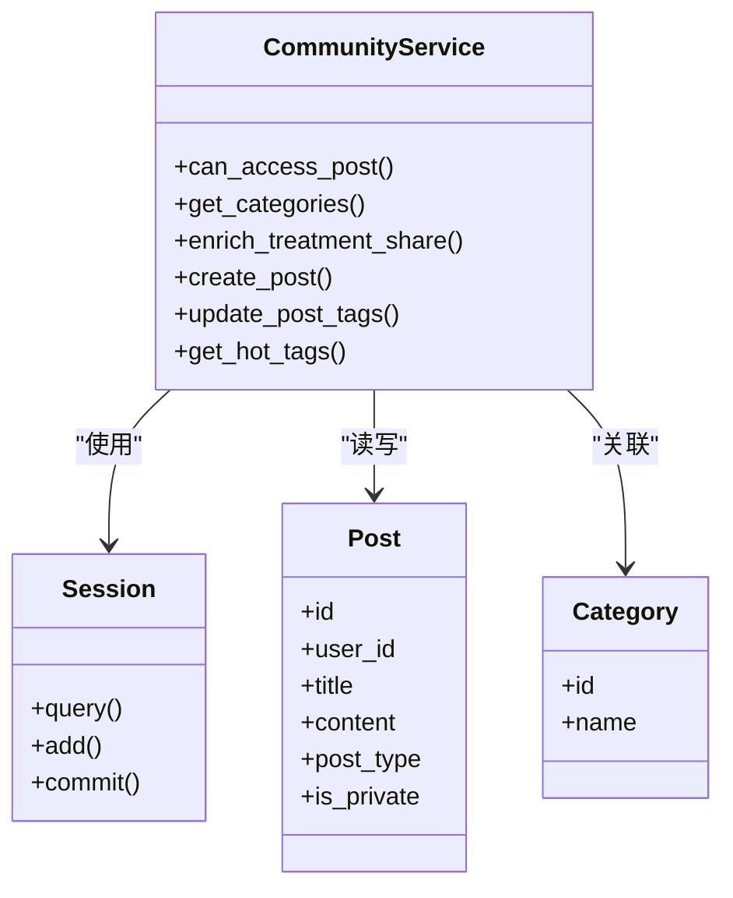
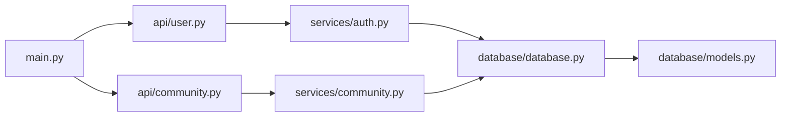
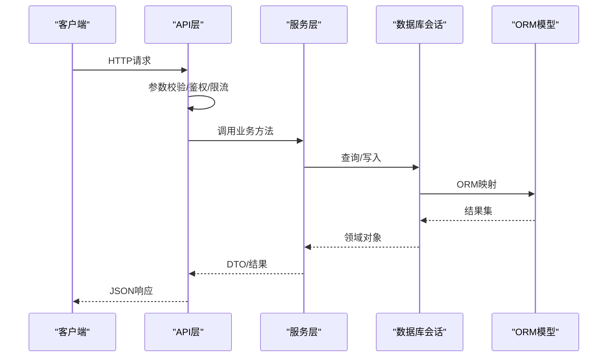

# 分层架构设计

<cite>
**本文引用的文件**   
- [web/backend/app/main.py](file://web/backend/app/main.py)
- [web/backend/api/__init__.py](file://web/backend/api/__init__.py)
- [web/backend/api/user.py](file://web/backend/api/user.py)
- [web/backend/api/community.py](file://web/backend/api/community.py)
- [web/backend/services/auth.py](file://web/backend/services/auth.py)
- [web/backend/services/community.py](file://web/backend/services/community.py)
- [web/backend/database/database.py](file://web/backend/database/database.py)
- [web/backend/database/models.py](file://web/backend/database/models.py)
- [web/backend/exceptions.py](file://web/backend/exceptions.py)
- [web/backend/app/middleware/rate_limit.py](file://web/backend/app/middleware/rate_limit.py)
</cite>

## 目录
1. [引言](#引言)
2. [项目结构](#项目结构)
3. [核心组件](#核心组件)
4. [架构总览](#架构总览)
5. [详细组件分析](#详细组件分析)
6. [依赖关系分析](#依赖关系分析)
7. [性能考量](#性能考量)
8. [故障排查指南](#故障排查指南)
9. [结论](#结论)
10. [附录](#附录)

## 引言
本文件面向Subskin项目的后端代码，系统化阐述分层架构设计：API层、服务层、数据访问层的职责边界与设计原则；解释各层之间的依赖关系、数据流转机制与异常处理策略；给出RESTful API设计规范、服务层业务逻辑封装、ORM模型抽象；说明依赖注入模式、接口定义规范与错误码统一处理。文末提供分层架构图与数据流向图，帮助读者快速理解整体设计与关键流程。

## 项目结构
后端采用FastAPI作为Web框架，按“应用入口—路由（API）—服务（业务）—数据库（ORM）”的分层组织代码：
- 应用入口：初始化FastAPI实例、注册CORS、挂载路由、启动生命周期任务（清理临时文件、刷新令牌等）、健康检查与WebSocket端点。
- API层：基于FastAPI的APIRouter划分领域路由，参数校验、鉴权、限流、审计日志、响应序列化。
- 服务层：封装领域业务逻辑，操作数据库会话，协调外部服务（如短信、邮件、LLM），返回领域对象或DTO。
- 数据访问层：SQLAlchemy引擎、会话工厂、Base与ORM模型定义，统一的数据库连接与会话获取方式。

**图表来源** 
- [web/backend/app/main.py:264-349](file://web/backend/app/main.py#L264-L349)
- [web/backend/api/__init__.py:1-62](file://web/backend/api/__init__.py#L1-L62)
- [web/backend/api/user.py:1-200](file://web/backend/api/user.py#L1-L200)
- [web/backend/api/community.py:1-200](file://web/backend/api/community.py#L1-L200)
- [web/backend/services/auth.py:1-200](file://web/backend/services/auth.py#L1-L200)
- [web/backend/services/community.py:1-200](file://web/backend/services/community.py#L1-L200)
- [web/backend/database/database.py:1-46](file://web/backend/database/database.py#L1-L46)
- [web/backend/database/models.py:1-200](file://web/backend/database/models.py#L1-L200)

**章节来源**
- [web/backend/app/main.py:264-349](file://web/backend/app/main.py#L264-L349)
- [web/backend/api/__init__.py:1-62](file://web/backend/api/__init__.py#L1-L62)

## 核心组件
- 应用入口（main.py）
  - 创建FastAPI实例，配置CORS、中间件、监控（Sentry/Prometheus）。
  - 集中注册所有API路由，按模块前缀分组，便于文档与权限管理。
  - 启动生命周期：清理临时上传、定时清理过期刷新令牌、初始化LLM配置、修复时间序列化问题。
  - 暴露健康检查与健康探针，支持WebSocket聊天端点。
- API层（user.py, community.py）
  - 使用FastAPI的APIRouter定义RESTful端点，参数由Pydantic模型校验。
  - 通过Depends注入鉴权依赖（JWT）、数据库会话、限流器、审计服务等。
  - 将领域异常转换为HTTP状态码与消息，保证对外一致性。
- 服务层（auth.py, community.py）
  - 封装认证、令牌签发与校验、刷新令牌生命周期管理。
  - 封装社区业务：帖子CRUD、评论、点赞、收藏、版本历史、标签、推荐等。
  - 通过Session操作ORM模型，避免在API层直接写SQL/ORM。
- 数据访问层（database.py, models.py）
  - 统一数据库连接与会话管理，针对SQLite优化连接池策略。
  - 定义完整ORM模型，包含用户、凭证、社区内容、百科、审计日志等。

**章节来源**
- [web/backend/app/main.py:264-349](file://web/backend/app/main.py#L264-L349)
- [web/backend/api/user.py:1-200](file://web/backend/api/user.py#L1-L200)
- [web/backend/api/community.py:1-200](file://web/backend/api/community.py#L1-L200)
- [web/backend/services/auth.py:1-200](file://web/backend/services/auth.py#L1-L200)
- [web/backend/services/community.py:1-200](file://web/backend/services/community.py#L1-L200)
- [web/backend/database/database.py:1-46](file://web/backend/database/database.py#L1-L46)
- [web/backend/database/models.py:1-200](file://web/backend/database/models.py#L1-L200)

## 架构总览
分层职责清晰，依赖方向自顶向下：
- API层仅负责请求解析、鉴权、限流、审计、响应序列化；不承载复杂业务。
- 服务层承载领域逻辑，编排多个数据源与外部服务，返回领域对象或DTO。
- 数据访问层仅提供会话与模型，不包含业务规则。

**图表来源** 
- [web/backend/app/main.py:264-349](file://web/backend/app/main.py#L264-L349)
- [web/backend/api/user.py:1-200](file://web/backend/api/user.py#L1-L200)
- [web/backend/api/community.py:1-200](file://web/backend/api/community.py#L1-L200)
- [web/backend/services/auth.py:1-200](file://web/backend/services/auth.py#L1-L200)
- [web/backend/services/community.py:1-200](file://web/backend/services/community.py#L1-L200)
- [web/backend/database/database.py:1-46](file://web/backend/database/database.py#L1-L46)
- [web/backend/database/models.py:1-200](file://web/backend/database/models.py#L1-L200)

## 详细组件分析

### API层：用户认证与令牌流程
- 端点职责
  - 登录（用户名/邮箱/手机号+密码、验证码登录）、刷新令牌、绑定第三方凭证。
  - 通过Depends注入鉴权依赖（OAuth2PasswordBearer）、数据库会话、限流器。
- 数据流转
  - 请求进入API → 参数校验 → 调用服务层鉴权 → 生成并返回令牌 → 记录审计日志。
- 异常处理
  - 服务层抛出领域异常（如凭证冲突、不存在），API层捕获并转为HTTP状态码与消息。
- 依赖注入
  - get_db()提供Session；auth依赖从请求头提取并校验JWT；限流依赖根据IP或用户ID计数。

**图表来源** 
- [web/backend/api/user.py:1-200](file://web/backend/api/user.py#L1-L200)
- [web/backend/services/auth.py:1-200](file://web/backend/services/auth.py#L1-L200)
- [web/backend/database/database.py:1-46](file://web/backend/database/database.py#L1-L46)
- [web/backend/database/models.py:1-200](file://web/backend/database/models.py#L1-L200)

**章节来源**
- [web/backend/api/user.py:1-200](file://web/backend/api/user.py#L1-L200)
- [web/backend/services/auth.py:1-200](file://web/backend/services/auth.py#L1-L200)
- [web/backend/database/database.py:1-46](file://web/backend/database/database.py#L1-L46)
- [web/backend/database/models.py:1-200](file://web/backend/database/models.py#L1-L200)
- [web/backend/exceptions.py:1-20](file://web/backend/exceptions.py#L1-L20)

### API层：社区帖子与限流
- 端点职责
  - 帖子列表、详情、创建、更新、删除；评论、点赞、收藏、版本历史、标签管理。
  - 读接口按IP限流，写接口按用户ID限流（无用户时回退到IP）。
- 数据流转
  - 请求进入API → 鉴权与限流 → 调用CommunityService执行业务 → 返回DTO。
- 异常处理
  - 业务校验失败抛出ValueError或领域异常，API层统一转为HTTP状态码。
- 依赖注入
  - Depends(get_db)、Depends(auth)、ReadRateLimit/WriteRateLimit。

**图表来源** 
- [web/backend/api/community.py:1-200](file://web/backend/api/community.py#L1-L200)
- [web/backend/services/community.py:1-200](file://web/backend/services/community.py#L1-L200)
- [web/backend/app/middleware/rate_limit.py:1-96](file://web/backend/app/middleware/rate_limit.py#L1-L96)

**章节来源**
- [web/backend/api/community.py:1-200](file://web/backend/api/community.py#L1-L200)
- [web/backend/services/community.py:1-200](file://web/backend/services/community.py#L1-L200)
- [web/backend/app/middleware/rate_limit.py:1-96](file://web/backend/app/middleware/rate_limit.py#L1-L96)

### 服务层：认证服务（auth.py）
- 职责
  - 密码哈希与校验、Access/Refresh Token签发与校验、文件专用短效Token、封禁账号处理。
- 数据流
  - 接收用户名/密码或令牌，查询User/RefreshToken，返回用户或None。
- 异常与安全
  - JWT解码失败返回None；封禁账号抛出带原因的HTTPException，前端可展示原因。

**图表来源** 
- [web/backend/services/auth.py:1-200](file://web/backend/services/auth.py#L1-L200)
- [web/backend/database/models.py:1-200](file://web/backend/database/models.py#L1-L200)

**章节来源**
- [web/backend/services/auth.py:1-200](file://web/backend/services/auth.py#L1-L200)
- [web/backend/database/models.py:1-200](file://web/backend/database/models.py#L1-L200)

### 服务层：社区服务（community.py）
- 职责
  - 帖子CRUD、评论、点赞、收藏、版本历史、标签、推荐、结构化治疗分享快照。
- 数据流
  - 接收API传入的参数，校验分类、用户权限、内容格式，持久化ORM对象，返回领域对象。
- 异常处理
  - 分类不存在、权限不足等抛出ValueError或领域异常，API层统一转换。

**图表来源** 
- [web/backend/services/community.py:1-200](file://web/backend/services/community.py#L1-L200)
- [web/backend/database/models.py:1-200](file://web/backend/database/models.py#L1-L200)

**章节来源**
- [web/backend/services/community.py:1-200](file://web/backend/services/community.py#L1-L200)
- [web/backend/database/models.py:1-200](file://web/backend/database/models.py#L1-L200)

### 数据访问层：数据库与会话（database.py）
- 职责
  - 配置SQLAlchemy引擎与会话工厂，针对SQLite使用NullPool避免并发阻塞。
  - 提供get_db()依赖，确保每个请求独立会话并在结束后关闭。
- 设计要点
  - 环境变量DATABASE_URL决定连接字符串；SQLite默认使用本地文件路径。
  - 连接超时与线程安全参数优化，避免事件循环阻塞。

**章节来源**
- [web/backend/database/database.py:1-46](file://web/backend/database/database.py#L1-L46)

### 数据访问层：ORM模型（models.py）
- 职责
  - 定义用户、凭证、社区内容、百科、审计日志等实体与关系。
  - 使用relationship建立一对多、多对多关系，设置索引与唯一约束。
- 设计要点
  - 时间字段使用UTC；敏感字段脱敏策略在服务层控制。
  - 审计日志不可篡改，支持撤销标记。

**章节来源**
- [web/backend/database/models.py:1-200](file://web/backend/database/models.py#L1-L200)

## 依赖关系分析
- 依赖方向
  - main.py聚合所有API路由；API层依赖服务层；服务层依赖数据库会话与模型。
- 耦合与内聚
  - API层低耦合（仅参数校验、鉴权、限流、序列化）；服务层高内聚（业务逻辑集中）；数据访问层稳定（会话与模型）。
- 外部依赖
  - FastAPI、SQLAlchemy、JWT、Passlib、requests（异步线程池调用）。

**图表来源** 
- [web/backend/app/main.py:264-349](file://web/backend/app/main.py#L264-L349)
- [web/backend/api/user.py:1-200](file://web/backend/api/user.py#L1-L200)
- [web/backend/api/community.py:1-200](file://web/backend/api/community.py#L1-L200)
- [web/backend/services/auth.py:1-200](file://web/backend/services/auth.py#L1-L200)
- [web/backend/services/community.py:1-200](file://web/backend/services/community.py#L1-L200)
- [web/backend/database/database.py:1-46](file://web/backend/database/database.py#L1-L46)
- [web/backend/database/models.py:1-200](file://web/backend/database/models.py#L1-L200)

**章节来源**
- [web/backend/app/main.py:264-349](file://web/backend/app/main.py#L264-L349)
- [web/backend/api/user.py:1-200](file://web/backend/api/user.py#L1-L200)
- [web/backend/api/community.py:1-200](file://web/backend/api/community.py#L1-L200)
- [web/backend/services/auth.py:1-200](file://web/backend/services/auth.py#L1-L200)
- [web/backend/services/community.py:1-200](file://web/backend/services/community.py#L1-L200)
- [web/backend/database/database.py:1-46](file://web/backend/database/database.py#L1-L46)
- [web/backend/database/models.py:1-200](file://web/backend/database/models.py#L1-L200)

## 性能考量
- SQLite连接池优化：使用NullPool避免并发突发导致的事件循环阻塞，提升稳定性。
- 限流策略：读接口按IP限流，写接口按用户ID限流（无用户回退到IP），防止滥用与成本失控。
- 异步IO：外部同步调用（如ip-api.com）放入线程池，避免阻塞事件循环。
- 令牌清理：启动与定时任务清理过期刷新令牌，降低存储压力。

[本节为通用指导，无需特定文件引用]

## 故障排查指南
- 常见异常
  - 凭证冲突/不存在：服务层抛出领域异常，API层转为4xx响应。
  - 账号封禁：认证服务抛出带原因的HTTPException，前端显示封禁原因。
  - 限流触发：返回429，提示稍后再试。
- 定位步骤
  - 查看健康检查端点确认服务状态。
  - 检查数据库连接与表结构（启动时自动修复缺失列）。
  - 查看日志中限流与异常信息，定位具体端点与参数。

**章节来源**
- [web/backend/exceptions.py:1-20](file://web/backend/exceptions.py#L1-L20)
- [web/backend/app/middleware/rate_limit.py:1-96](file://web/backend/app/middleware/rate_limit.py#L1-L96)
- [web/backend/app/main.py:264-349](file://web/backend/app/main.py#L264-L349)

## 结论
Subskin后端采用清晰的三层架构：API层专注请求治理与响应序列化，服务层封装领域逻辑与数据编排，数据访问层提供稳定的会话与模型。通过依赖注入、限流、异常统一处理与ORM抽象，系统具备良好的可维护性与扩展性。建议后续继续完善接口契约文档、统一错误码体系与监控告警，进一步提升可观测性与稳定性。

[本节为总结性内容，无需特定文件引用]

## 附录
- RESTful API设计规范
  - 资源命名使用名词复数，动词使用HTTP方法表达意图。
  - 统一响应结构：{code, message, data}，错误码按领域分类。
- 依赖注入模式
  - 使用FastAPI的Depends注入Session、鉴权、限流、审计等服务。
- 错误码统一处理
  - 服务层抛出领域异常，API层捕获并转换为标准HTTP状态码与消息。
- 数据流向图（端到端）
  

[本图为概念性流程图，无需特定文件引用]