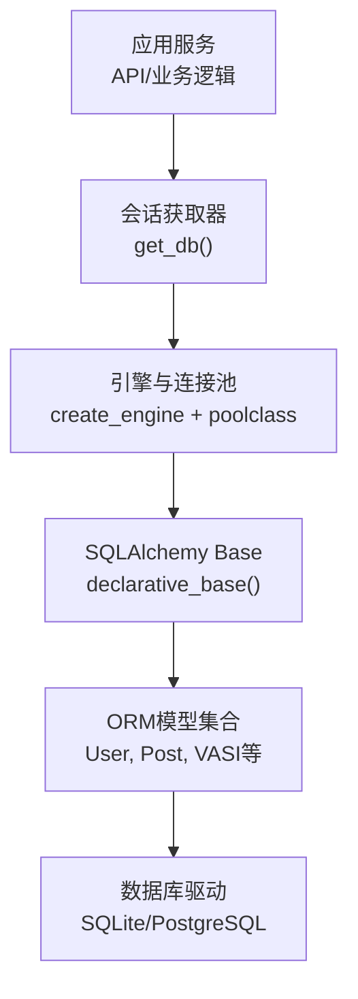
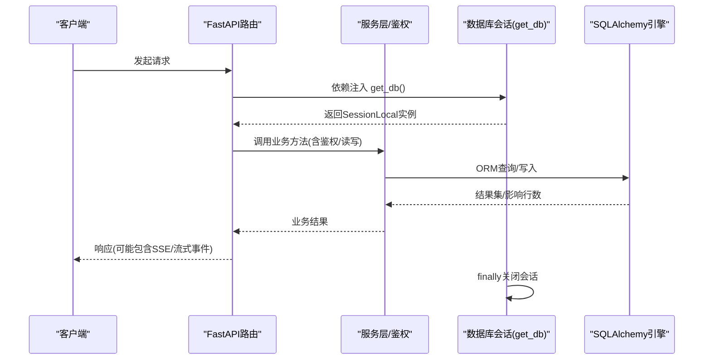
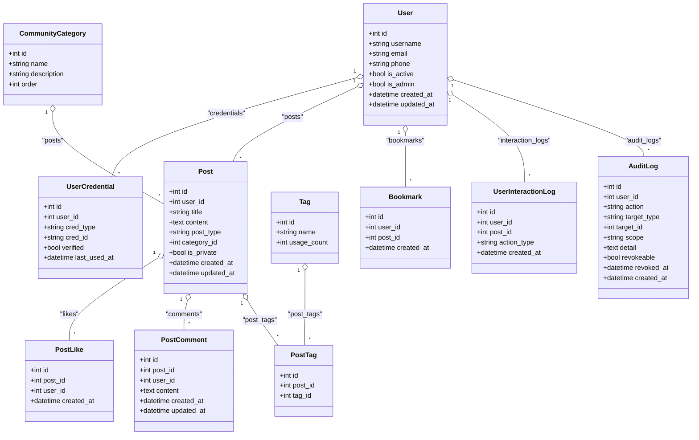
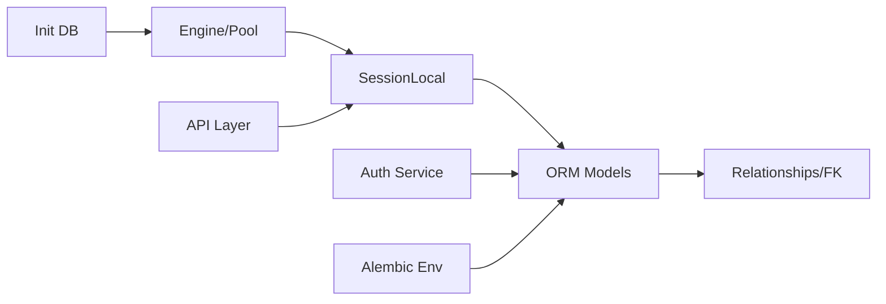

# 数据访问层设计

<cite>
**本文引用的文件**   
- [database.py](file://web/backend/database/database.py)
- [models.py](file://web/backend/database/models.py)
- [user.py](file://web/backend/models/user.py)
- [community.py](file://web/backend/models/community.py)
- [vasi.py](file://web/backend/models/vasi.py)
- [audit.py](file://web/backend/models/audit.py)
- [init_db.py](file://web/backend/database/init_db.py)
- [env.py](file://web/backend/alembic/env.py)
- [001_baseline.py](file://web/backend/alembic/versions/001_baseline.py)
- [auth.py](file://web/backend/services/auth.py)
- [rag.py](file://web/backend/api/rag.py)
- [migration_add_treatment_share.py](file://scripts/migration_add_treatment_share.py)
- [migration_add_is_deleted.py](file://scripts/migration_add_is_deleted.py)
</cite>

## 目录
1. [引言](#引言)
2. [项目结构](#项目结构)
3. [核心组件](#核心组件)
4. [架构总览](#架构总览)
5. [详细组件分析](#详细组件分析)
6. [依赖关系分析](#依赖关系分析)
7. [性能考虑](#性能考虑)
8. [故障排查指南](#故障排查指南)
9. [结论](#结论)
10. [附录](#附录)

## 引言
本文件面向Subskin项目的数据访问层，系统性阐述基于SQLAlchemy ORM的模型设计、实体关系映射、查询与索引优化策略、数据库连接与会话管理、迁移与事务处理、并发控制机制、数据验证规则、软删除实现与审计日志记录，并给出ORM使用最佳实践与性能调优建议。目标是帮助开发者快速理解并高效扩展数据层能力。

## 项目结构
数据访问层主要位于后端模块中：
- 数据库连接与会话：web/backend/database/database.py
- ORM模型定义：web/backend/database/models.py（主模型）、web/backend/models/*.py（领域模型）
- 初始化与种子数据：web/backend/database/init_db.py
- 迁移配置与基线：web/backend/alembic/env.py、web/backend/alembic/versions/001_baseline.py
- 脚本化增量迁移：scripts/*.py
- 认证与令牌持久化：web/backend/services/auth.py
- API侧会话使用示例：web/backend/api/rag.py

**图示来源** 
- [database.py:1-46](file://web/backend/database/database.py#L1-L46)
- [models.py:1-200](file://web/backend/database/models.py#L1-L200)

**章节来源**
- [database.py:1-46](file://web/backend/database/database.py#L1-L46)
- [models.py:1-200](file://web/backend/database/models.py#L1-L200)

## 核心组件
- 数据库连接与引擎：根据DATABASE_URL自动选择SQLite或通用引擎；SQLite使用NullPool避免并发锁耗尽；非SQLite启用pool_pre_ping保证连接健康。
- 会话工厂：SessionLocal(autocommit=False, autoflush=False)，通过get_db()提供请求级会话生命周期管理。
- ORM基础：Base = declarative_base()，所有模型继承自Base。
- 模型体系：用户、凭证、社区内容、百科、VASI评估、审计日志等，广泛使用relationship与索引。
- 迁移与初始化：Alembic环境配置+基线迁移；init_db用于首次建表与种子数据；脚本化迁移用于历史兼容。

**章节来源**
- [database.py:1-46](file://web/backend/database/database.py#L1-L46)
- [init_db.py:1-146](file://web/backend/database/init_db.py#L1-L146)
- [env.py:1-84](file://web/backend/alembic/env.py#L1-L84)
- [001_baseline.py:1-47](file://web/backend/alembic/versions/001_baseline.py#L1-L47)

## 架构总览
数据访问层采用“引擎-会话-模型”三层结构，配合Alembic进行版本化管理，并通过脚本化迁移补充历史兼容性。认证服务将JWT与刷新令牌持久化到数据库，API层在流式响应中保持会话直至完成。

**图示来源** 
- [database.py:38-46](file://web/backend/database/database.py#L38-L46)
- [auth.py:153-200](file://web/backend/services/auth.py#L153-L200)
- [rag.py:817-861](file://web/backend/api/rag.py#L817-L861)

## 详细组件分析

### 数据库连接与会话管理
- SQLite场景：使用NullPool按需创建连接，避免QueuePool在高并发图片加载时耗尽导致服务冻结；timeout=15缓解写锁竞争。
- 非SQLite场景：启用pool_pre_ping确保连接有效性。
- 会话生命周期：get_db()作为生成器，在请求结束时关闭会话，避免泄漏。

**章节来源**
- [database.py:19-33](file://web/backend/database/database.py#L19-L33)
- [database.py:38-46](file://web/backend/database/database.py#L38-L46)

### ORM模型体系与关系映射
- 用户与凭证：User与UserCredential一对多，credential_type/cred_id唯一约束防重复绑定。
- 社区内容：Post与Category、Images/Audios/Attachments、Tags、Versions、Likes、Comments、Bookmarks、InteractionLogs等多对一/多对多关系，广泛使用cascade="all, delete-orphan"维护一致性。
- 百科系统：EncyclopediaArticle与Revision/Comment/Vote形成修订与评论投票闭环。
- VASI评估：VASIAssessment与ImageQualityTag一对一，另含反馈信号、训练样本、模型版本等自进化相关表。
- 审计日志：AuditLog不可篡改记录授权分享等操作，支持撤销标记。

**图示来源** 
- [models.py:88-154](file://web/backend/database/models.py#L88-L154)
- [models.py:156-180](file://web/backend/database/models.py#L156-L180)
- [models.py:299-377](file://web/backend/database/models.py#L299-L377)
- [models.py:393-412](file://web/backend/database/models.py#L393-L412)
- [models.py:414-428](file://web/backend/database/models.py#L414-L428)
- [models.py:430-451](file://web/backend/database/models.py#L430-L451)
- [models.py:546-560](file://web/backend/database/models.py#L546-L560)
- [models.py:562-579](file://web/backend/database/models.py#L562-L579)
- [models.py:623-648](file://web/backend/database/models.py#L623-L648)

**章节来源**
- [models.py:88-154](file://web/backend/database/models.py#L88-L154)
- [models.py:299-377](file://web/backend/database/models.py#L299-L377)
- [models.py:393-412](file://web/backend/database/models.py#L393-L412)
- [models.py:414-428](file://web/backend/database/models.py#L414-L428)
- [models.py:430-451](file://web/backend/database/models.py#L430-L451)
- [models.py:546-560](file://web/backend/database/models.py#L546-L560)
- [models.py:562-579](file://web/backend/database/models.py#L562-L579)
- [models.py:623-648](file://web/backend/database/models.py#L623-L648)

### 复合主键与唯一性约束
- 点赞去重：post_likes通过UniqueConstraint(post_id, user_id)防止并发重复点赞。
- 收藏条目：collection_items通过UniqueConstraint(collection_id, post_id)避免重复添加。
- 书签：bookmarks通过UniqueConstraint(user_id, post_id)保证唯一收藏。
- 凭证查找：user_credentials通过Index("idx_cred_lookup", "cred_type", "cred_id")加速第三方登录绑定查询。

**章节来源**
- [models.py:393-412](file://web/backend/database/models.py#L393-L412)
- [models.py:508-526](file://web/backend/database/models.py#L508-L526)
- [models.py:546-560](file://web/backend/database/models.py#L546-L560)
- [models.py:156-180](file://web/backend/database/models.py#L156-L180)

### 索引优化方案
- 高频查询字段加索引：users.username/email/phone/wechat_id/alipay_id、posts.user_id/category_id/is_private/draft_expires_at/diary_date/diary_type/moderation_status/city、user_events.created_at/event_type/page_path/uid/client_fingerprint、user_interaction_logs.user_id/post_id/action_type/created_at等。
- 联合索引：user_events(idx_events_created_type, idx_events_created_type_path, idx_events_created_uid)、treatment_events(idx_treatment_user_date)等，提升时间范围+类型过滤效率。
- 外键关联索引：多数ForeignKey列同时声明index=True，减少JOIN开销。

**章节来源**
- [models.py:203-225](file://web/backend/database/models.py#L203-L225)
- [models.py:312-377](file://web/backend/database/models.py#L312-L377)
- [models.py:562-579](file://web/backend/database/models.py#L562-L579)
- [models.py:1202-1231](file://web/backend/database/models.py#L1202-L1231)

### 数据验证规则（Pydantic）
- 用户与认证：手机号正则、邮箱格式、密码长度、验证码长度与用途枚举等校验。
- 社区帖子：标题/内容必填、分类ID、日记日期/类型、心情标签、匿名发布、城市等字段校验。
- 医疗报告：结构化解析结果、异常项、指标解析等复杂对象校验。
- 审计日志：action/target_type/scope等枚举与长度限制。

**章节来源**
- [user.py:1-138](file://web/backend/models/user.py#L1-L138)
- [community.py:1-427](file://web/backend/models/community.py#L1-L427)
- [audit.py:1-58](file://web/backend/models/audit.py#L1-L58)

### 软删除实现
- 对话历史：conversations.is_deleted布尔字段标识软删除，便于保留历史且隐藏展示。
- 迁移脚本：migration_add_is_deleted.py为现有库安全追加is_deleted列。

**章节来源**
- [models.py:274-285](file://web/backend/database/models.py#L274-L285)
- [migration_add_is_deleted.py:1-42](file://scripts/migration_add_is_deleted.py#L1-L42)

### 审计日志记录
- 审计表：audit_logs记录who/what/when/scope/revokeable，支持撤销操作但不可删除，保障隐私授权可追溯。
- 接口模型：AuditLogCreate/AuditLogResponse/AuditLogRevokeRequest/AuditLogListResponse规范输入输出。

**章节来源**
- [models.py:623-648](file://web/backend/database/models.py#L623-L648)
- [audit.py:1-58](file://web/backend/models/audit.py#L1-L58)

### 事务处理与并发控制
- 会话事务：SessionLocal默认autocommit=False，显式db.commit()提交；finally中关闭会话。
- 并发保护：通过数据库唯一约束（如点赞、收藏、书签）防止并发重复插入；RefreshToken撤销批量更新。
- 流式响应中的事务：RAG流式处理中先commit消息再返回事件，失败时回滚用量计数。

**章节来源**
- [database.py:33-46](file://web/backend/database/database.py#L33-L46)
- [auth.py:96-151](file://web/backend/services/auth.py#L96-L151)
- [rag.py:817-861](file://web/backend/api/rag.py#L817-L861)

### 数据库迁移管理
- Alembic环境：env.py导入Base与models，target_metadata指向Base.metadata，支持离线/在线模式。
- 基线迁移：001_baseline.py作为现有库起点，新库由init_db.py创建表结构。
- 脚本化迁移：针对SQLite的ADD COLUMN脚本（如treatment_share_json、is_deleted），幂等执行。

**章节来源**
- [env.py:1-84](file://web/backend/alembic/env.py#L1-L84)
- [001_baseline.py:1-47](file://web/backend/alembic/versions/001_baseline.py#L1-L47)
- [init_db.py:1-146](file://web/backend/database/init_db.py#L1-L146)
- [migration_add_treatment_share.py:1-47](file://scripts/migration_add_treatment_share.py#L1-L47)
- [migration_add_is_deleted.py:1-42](file://scripts/migration_add_is_deleted.py#L1-L42)

### VASI评估模型与自进化
- VASIAssessment：存储评估图片、分数、部位、分型、阶段、AI置信度、用户修正轮廓、质量报告、最终分数等。
- ImageQualityTag：管理员对评估图片质量打标，用于筛选高质量训练样本。
- 自进化相关：VasiFeedbackSignal、VasiTrainingSample、VasiModelVersion支撑反馈收集、样本管理与版本追踪。
- 字段演进：ensure_vasi_columns与ensure_feedback_columns函数动态检测并新增列，兼容不同部署环境。

**章节来源**
- [vasi.py:1-328](file://web/backend/models/vasi.py#L1-L328)

## 依赖关系分析
- 连接层依赖：engine与poolclass决定连接行为；SessionLocal绑定engine。
- 模型依赖：各模型通过relationship与ForeignKey建立实体关系；Base统一注册元数据。
- 服务依赖：auth服务依赖User/RefreshToken；API层依赖get_db会话。
- 迁移依赖：env.py依赖Base与models；init_db依赖engine与Base。

**图示来源** 
- [database.py:1-46](file://web/backend/database/database.py#L1-L46)
- [models.py:1-200](file://web/backend/database/models.py#L1-L200)
- [auth.py:1-200](file://web/backend/services/auth.py#L1-L200)
- [env.py:1-84](file://web/backend/alembic/env.py#L1-L84)
- [init_db.py:1-146](file://web/backend/database/init_db.py#L1-L146)

**章节来源**
- [database.py:1-46](file://web/backend/database/database.py#L1-L46)
- [models.py:1-200](file://web/backend/database/models.py#L1-L200)
- [auth.py:1-200](file://web/backend/services/auth.py#L1-L200)
- [env.py:1-84](file://web/backend/alembic/env.py#L1-L84)
- [init_db.py:1-146](file://web/backend/database/init_db.py#L1-L146)

## 性能考虑
- 连接池策略：SQLite使用NullPool避免锁竞争；非SQLite启用pool_pre_ping。
- 索引设计：高频查询字段与联合索引覆盖常见过滤条件。
- 关系加载：合理使用relationship与back_populates，避免N+1查询；必要时使用selectinload/joinedload。
- 事务粒度：最小化事务范围，及时commit/close。
- 流式处理：在SSE/流式响应中谨慎管理会话，失败时回滚副作用。

[本节为通用指导，不直接分析具体文件]

## 故障排查指南
- 数据库锁定：SQLite写锁竞争导致“database is locked”，检查并发写入与超时设置。
- 连接耗尽：确认是否误用QueuePool于SQLite；应使用NullPool。
- 会话泄漏：确保get_db的finally分支关闭会话。
- 迁移失败：检查脚本幂等性与列存在性判断；核对目标数据库路径。
- 认证失败：检查JWT密钥、过期时间与用户状态。

**章节来源**
- [database.py:19-33](file://web/backend/database/database.py#L19-L33)
- [database.py:38-46](file://web/backend/database/database.py#L38-L46)
- [migration_add_treatment_share.py:1-47](file://scripts/migration_add_treatment_share.py#L1-L47)
- [auth.py:153-200](file://web/backend/services/auth.py#L153-L200)

## 结论
Subskin的数据访问层以SQLAlchemy为核心，结合Alembic与脚本化迁移实现稳健的Schema演进；通过合理的连接池策略、索引设计与唯一性约束，兼顾性能与并发安全；Pydantic模型强化输入校验；软删除与审计日志满足合规与可追溯需求。遵循本文的最佳实践与调优建议，可进一步提升系统的稳定性与可扩展性。

[本节为总结性内容，不直接分析具体文件]

## 附录
- 常用命令参考：
  - 初始化数据库与种子数据：python web/backend/database/init_db.py
  - Alembic迁移：alembic upgrade head / alembic stamp 001_baseline
  - 脚本化迁移：运行scripts下的对应迁移脚本
- 环境变量：
  - DATABASE_URL：数据库连接字符串
  - SECRET_KEY/ALGORITHM：JWT签名参数
  - ACCESS_TOKEN_EXPIRE_MINUTES/REFRESH_TOKEN_EXPIRE_DAYS：令牌过期时间

[本节为补充信息，不直接分析具体文件]