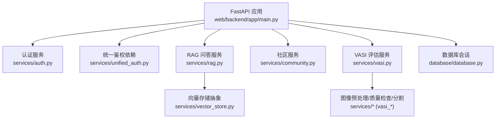
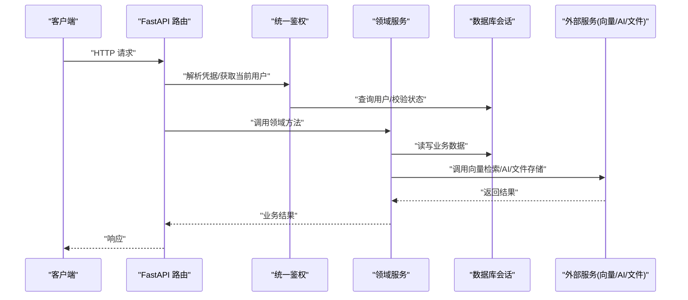
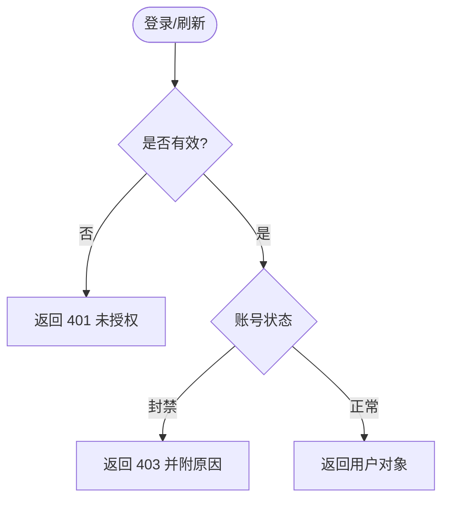
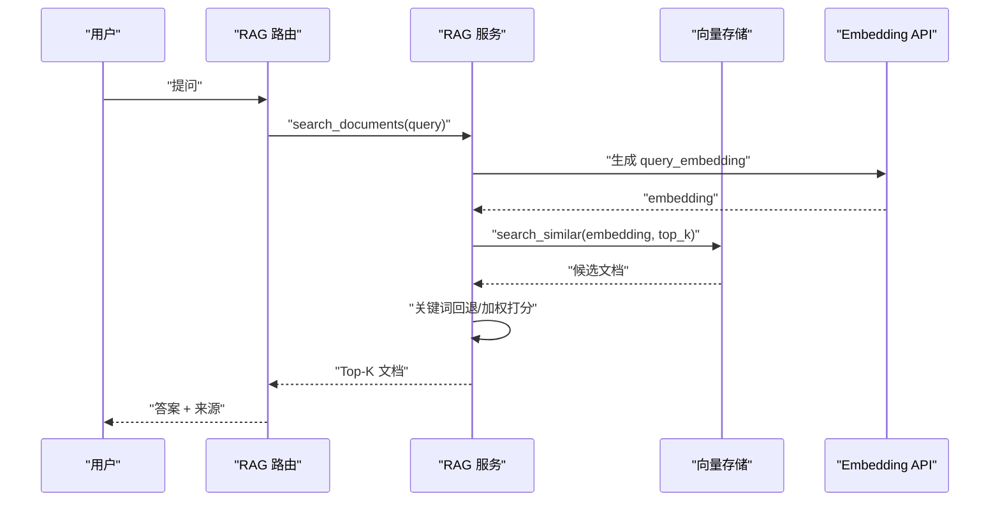
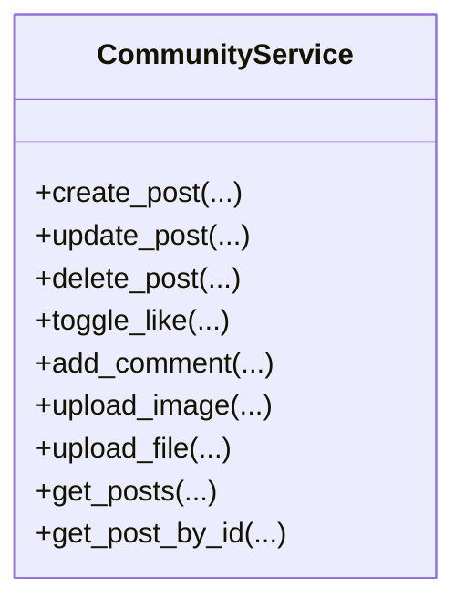
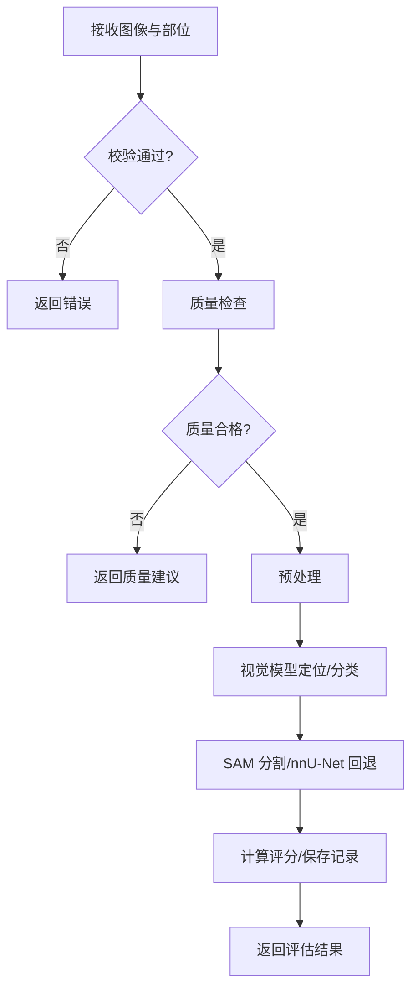
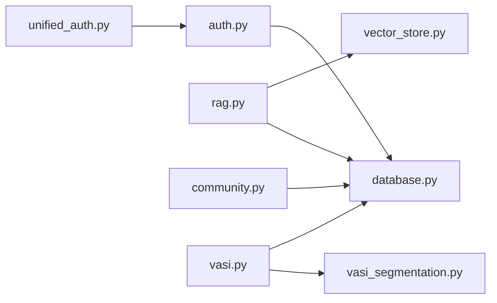

# 服务层设计

<cite>
**本文引用的文件**
- [web/backend/app/main.py](file://web/backend/app/main.py)
- [web/backend/services/auth.py](file://web/backend/services/auth.py)
- [web/backend/services/unified_auth.py](file://web/backend/services/unified_auth.py)
- [web/backend/services/rag.py](file://web/backend/services/rag.py)
- [web/backend/services/community.py](file://web/backend/services/community.py)
- [web/backend/services/vasi.py](file://web/backend/services/vasi.py)
- [web/backend/services/vector_store.py](file://web/backend/services/vector_store.py)
- [web/backend/database/database.py](file://web/backend/database/database.py)
- [web/backend/exceptions.py](file://web/backend/exceptions.py)
</cite>

## 目录
1. [简介](#简介)
2. [项目结构](#项目结构)
3. [核心组件](#核心组件)
4. [架构总览](#架构总览)
5. [详细组件分析](#详细组件分析)
6. [依赖关系分析](#依赖关系分析)
7. [性能考量](#性能考量)
8. [故障排查指南](#故障排查指南)
9. [结论](#结论)
10. [附录](#附录)

## 简介
本设计文档面向 Subskin 后端服务层，聚焦业务逻辑封装、依赖注入、事务管理、服务间通信、异常处理与缓存机制，并覆盖外部服务集成（AI API、向量检索、文件存储）的处理方式。文档同时给出接口契约规范建议与单元测试策略，帮助团队在演进中保持一致性与可维护性。

## 项目结构
- 应用入口与路由注册：FastAPI 应用在启动时创建数据库表、初始化中间件、挂载各模块路由，并在生命周期内执行定时清理任务。
- 服务层组织：按领域划分服务类与函数，如认证、RAG 问答、社区帖子、VASI 评估等；通用能力（向量存储、监控、配置）独立成模块。
- 数据访问：通过 SQLAlchemy SessionLocal 提供会话，统一由 get_db 注入到 FastAPI 依赖链。
- 外部集成：RAG 使用 LLM/Embedding 配置；VASI 调用视觉模型与分割管线；文件上传落盘并通过专用端点提供服务。

图表来源
- [web/backend/app/main.py:228-333](file://web/backend/app/main.py#L228-L333)
- [web/backend/services/auth.py:153-254](file://web/backend/services/auth.py#L153-L254)
- [web/backend/services/unified_auth.py:18-67](file://web/backend/services/unified_auth.py#L18-L67)
- [web/backend/services/rag.py:354-522](file://web/backend/services/rag.py#L354-L522)
- [web/backend/services/community.py:44-224](file://web/backend/services/community.py#L44-L224)
- [web/backend/services/vasi.py:159-243](file://web/backend/services/vasi.py#L159-L243)
- [web/backend/services/vector_store.py:245-266](file://web/backend/services/vector_store.py#L245-L266)
- [web/backend/database/database.py:17-46](file://web/backend/database/database.py#L17-L46)

章节来源
- [web/backend/app/main.py:228-333](file://web/backend/app/main.py#L228-L333)
- [web/backend/database/database.py:17-46](file://web/backend/database/database.py#L17-L46)

## 核心组件
- 认证服务（auth）
  - 职责：JWT 签发/校验、刷新令牌管理、用户状态校验、WebSocket 鉴权、过期令牌清理。
  - 依赖注入：通过 FastAPI Depends(get_db) 获取 SQLAlchemy Session；OAuth2PasswordBearer 解析请求头。
  - 事务：刷新令牌写入、撤销令牌等操作在调用方事务或内部 commit 中完成。
- 统一鉴权（unified_auth）
  - 职责：为路由提供统一的当前用户依赖，支持可选/必需/管理员三种模式。
  - 依赖：复用 auth 的 get_current_user。
- RAG 问答（rag）
  - 职责：问题分类（站点功能/危机/白癜风相关）、知识库检索（关键词+向量混合）、构建系统提示词、聚合用户上下文、生成回答。
  - 外部集成：OpenAI 兼容 Embedding API；LLM 配置来自统一配置服务。
  - 缓存：当前实现以内存计算为主，未引入持久化缓存；可通过向量存储后端切换提升检索性能。
- 社区服务（community）
  - 职责：帖子 CRUD、评论、点赞、收藏、标签、版本历史、图片/附件上传校验与落盘、权限控制。
  - 事务：每个写操作包含必要的 flush/commit；并发冲突通过唯一约束回退处理。
  - 安全：严格的大小限制、扩展名白名单、Magic Byte 校验。
- VASI 评估（vasi）
  - 职责：图像输入校验、上传、调用视觉模型与分割管线、计算评分、保存评估记录、趋势统计。
  - 外部集成：视觉模型（VLM/SAM）、nnU-Net 分割、可选预处理与质量检查。
  - 事务：评估创建、确认/放弃、删除均涉及数据库提交。
- 向量存储（vector_store）
  - 职责：为 RAG 提供统一向量存取接口，支持 SQLite/pgvector/Qdrant 多后端。
  - 选择：通过环境变量动态选择后端。

章节来源
- [web/backend/services/auth.py:1-309](file://web/backend/services/auth.py#L1-L309)
- [web/backend/services/unified_auth.py:1-68](file://web/backend/services/unified_auth.py#L1-L68)
- [web/backend/services/rag.py:354-522](file://web/backend/services/rag.py#L354-L522)
- [web/backend/services/community.py:44-800](file://web/backend/services/community.py#L44-L800)
- [web/backend/services/vasi.py:56-800](file://web/backend/services/vasi.py#L56-L800)
- [web/backend/services/vector_store.py:25-266](file://web/backend/services/vector_store.py#L25-L266)

## 架构总览
服务层采用“路由 → 依赖注入 → 服务类 → 数据访问/外部服务”的分层模式。FastAPI 负责 HTTP/WebSocket 接入与中间件；服务层封装领域逻辑；数据访问通过 SQLAlchemy Session；外部 AI/向量/文件存储通过配置与环境变量解耦。

图表来源
- [web/backend/app/main.py:228-333](file://web/backend/app/main.py#L228-L333)
- [web/backend/services/unified_auth.py:18-67](file://web/backend/services/unified_auth.py#L18-L67)
- [web/backend/services/rag.py:354-522](file://web/backend/services/rag.py#L354-L522)
- [web/backend/services/community.py:136-224](file://web/backend/services/community.py#L136-L224)
- [web/backend/services/vasi.py:159-243](file://web/backend/services/vasi.py#L159-L243)
- [web/backend/database/database.py:38-46](file://web/backend/database/database.py#L38-L46)

## 详细组件分析

### 认证服务（auth）
- 设计要点
  - JWT 访问令牌与刷新令牌分离，支持管理员长时效令牌与文件专用短时效令牌。
  - 用户状态校验：非活跃/封禁账号拒绝访问，封禁原因透传前端。
  - WebSocket 鉴权：从查询参数解析 token 并验证用户有效性。
  - 定期清理：启动与周期任务清理过期/已撤销刷新令牌，防止数据库膨胀。
- 依赖注入
  - 通过 FastAPI Depends(get_db) 注入 Session；OAuth2PasswordBearer 自动解析 Authorization 头。
- 事务管理
  - 刷新令牌创建/撤销在各自方法内 commit；批量撤销使用 update 后 commit。
- 异常处理
  - 无效/过期 token 抛出 401；封禁账号抛出 403 并携带原因。

图表来源
- [web/backend/services/auth.py:153-254](file://web/backend/services/auth.py#L153-L254)
- [web/backend/services/auth.py:285-309](file://web/backend/services/auth.py#L285-L309)

章节来源
- [web/backend/services/auth.py:1-309](file://web/backend/services/auth.py#L1-L309)

### 统一鉴权（unified_auth）
- 设计要点
  - 提供 get_current_user/get_optional_user/get_current_admin_user 等依赖，统一鉴权入口。
  - 基于 HTTPBearer 解析凭据，失败时返回 401。
- 依赖注入
  - 复用 auth.get_current_user；结合 get_db 获取会话。
- 事务管理
  - 仅读取用户信息，无写操作。
- 异常处理
  - 凭据缺失/非法返回 401；非活跃/非管理员分别返回 403。

章节来源
- [web/backend/services/unified_auth.py:1-68](file://web/backend/services/unified_auth.py#L1-L68)

### RAG 问答服务（rag）
- 设计要点
  - 问题分流：站点功能导航、危机消息放行、白癜风相关过滤。
  - 检索策略：优先向量相似度，维度不匹配时回退关键词搜索；综合权威权重与时间衰减打分。
  - 用户上下文：聚合病案档案、近 14 天日记摘要、用药提醒与治疗事件，限制长度避免上下文溢出。
  - 提示工程：知识问答与情感陪伴两套系统提示，强调隐私保护、拒绝诊断、引导社区资源。
- 外部集成
  - 通过 get_llm_config("rag") 获取 provider/base_url/api_key/embedding_model/dimensions，调用 OpenAI 兼容接口生成 embedding。
- 缓存机制
  - 当前未引入持久化缓存；可通过向量存储后端优化检索性能。
- 异常处理
  - 嵌入生成失败回退关键词搜索；维度不匹配记录警告并跳过。

图表来源
- [web/backend/services/rag.py:354-522](file://web/backend/services/rag.py#L354-L522)
- [web/backend/services/vector_store.py:71-90](file://web/backend/services/vector_store.py#L71-L90)

章节来源
- [web/backend/services/rag.py:1-800](file://web/backend/services/rag.py#L1-L800)
- [web/backend/services/vector_store.py:25-266](file://web/backend/services/vector_store.py#L25-L266)

### 社区服务（community）
- 设计要点
  - 帖子全生命周期：创建（含类型推断、预览文本、标签/图片/视频元数据）、更新（版本快照）、删除（级联清理）。
  - 权限控制：私有帖与审核拦截内容不可见；收藏前校验可见性防止泄露。
  - 互动：点赞去重与并发安全（唯一约束回退）、评论分页、收藏/书签。
  - 上传安全：大小限制、扩展名白名单、Magic Byte 校验，落盘路径隔离。
- 事务管理
  - 写操作使用 flush/commit；并发冲突捕获 IntegrityError 并回退。
- 异常处理
  - 不存在/无权操作抛出 ValueError/PermissionError；上传格式不符抛出 ValueError。

图表来源
- [web/backend/services/community.py:44-800](file://web/backend/services/community.py#L44-L800)

章节来源
- [web/backend/services/community.py:1-800](file://web/backend/services/community.py#L1-L800)

### VASI 评估服务（vasi）
- 设计要点
  - 输入校验：大小、MIME、Magic Byte、身体部位合法性。
  - 流程编排：质量检查 → 预处理 → 视觉模型（VLM）定位与分类 → SAM 分割（可引导）→ nnU-Net 回退 → 评分计算 → 记录保存。
  - 状态机：草稿（draft）→ 确认（active）/放弃（abandoned），历史与趋势仅展示已确认记录。
  - 删除策略：删除评估时保留关联标注元数据并标记用户删除，避免数据丢失。
- 外部集成
  - 视觉模型与分割管线通过异步线程调用，支持精确/快速模式与可选集成。
- 事务管理
  - 评估创建、确认/放弃、删除均包含数据库提交。
- 异常处理
  - 输入非法抛出自定义异常；质量不合格直接返回结构化反馈。

图表来源
- [web/backend/services/vasi.py:159-243](file://web/backend/services/vasi.py#L159-L243)
- [web/backend/services/vasi.py:539-800](file://web/backend/services/vasi.py#L539-L800)

章节来源
- [web/backend/services/vasi.py:1-800](file://web/backend/services/vasi.py#L1-L800)

### 概念总览
- 服务间通信：主要通过 FastAPI 路由将请求分发至对应服务；服务之间通过函数调用与共享数据模型交互，避免紧耦合。
- 缓存机制：当前以内存计算为主；向量检索可通过 pgvector/Qdrant 后端提升性能；未来可在热点查询处引入 Redis 缓存。
- 外部服务集成：AI/向量/文件存储通过配置与环境变量解耦，便于替换与灰度。

[本节为概念性说明，不直接分析具体文件]

## 依赖关系分析
- 松耦合：服务类通过构造函数或静态方法注入依赖（如 Session），避免全局状态。
- 可插拔后端：向量存储通过工厂函数根据环境变量选择实现。
- 循环依赖规避：在需要时延迟导入（如 rag 中引用 models），减少启动期耦合。

图表来源
- [web/backend/services/auth.py:153-254](file://web/backend/services/auth.py#L153-L254)
- [web/backend/services/unified_auth.py:18-67](file://web/backend/services/unified_auth.py#L18-L67)
- [web/backend/services/rag.py:354-522](file://web/backend/services/rag.py#L354-L522)
- [web/backend/services/community.py:136-224](file://web/backend/services/community.py#L136-L224)
- [web/backend/services/vasi.py:159-243](file://web/backend/services/vasi.py#L159-L243)
- [web/backend/database/database.py:38-46](file://web/backend/database/database.py#L38-L46)

章节来源
- [web/backend/services/vector_store.py:245-266](file://web/backend/services/vector_store.py#L245-L266)
- [web/backend/database/database.py:17-46](file://web/backend/database/database.py#L17-L46)

## 性能考量
- 数据库连接池：SQLite 使用 NullPool 避免并发下连接耗尽导致服务冻结；超时设置缓解写锁竞争。
- 检索优化：向量检索默认启用，维度不匹配时回退关键词；可升级至 pgvector/Qdrant 提升大规模检索性能。
- 上传安全与性能：严格大小与格式限制，Magic Byte 校验前置，避免恶意文件进入后续管线。
- 异步与线程：VASI 分割调用通过异步线程执行，降低阻塞风险。
- 日志与监控：启动时初始化 Sentry/Prometheus（条件启用），关键路径记录告警与指标。

[本节提供通用指导，不直接分析具体文件]

## 故障排查指南
- 认证失败
  - 现象：401/403 返回。
  - 排查：检查 token 类型与有效期、用户状态（活跃/封禁）、刷新令牌是否被撤销或过期。
  - 参考：认证服务中的凭据校验与封禁异常处理。
- RAG 检索为空或结果不准
  - 现象：无相似文档或相关性低。
  - 排查：确认 embedding 维度一致、向量后端可用、LLM 配置正确；必要时回退关键词搜索。
  - 参考：RAG 服务的嵌入生成与相似度计算。
- 社区上传失败
  - 现象：格式不支持或过大。
  - 排查：检查扩展名白名单、文件大小限制、Magic Byte 校验结果。
  - 参考：社区服务的上传校验逻辑。
- VASI 评估失败
  - 现象：质量不合格或模型调用异常。
  - 排查：查看质量检查报告、图像格式与大小、视觉模型可用性；确认分割管线依赖。
  - 参考：VASI 服务的输入校验与质量拒绝逻辑。
- 数据库锁定
  - 现象：SQLite 并发写锁导致超时。
  - 排查：确认连接池配置与超时设置；减少并发写或迁移至 PostgreSQL。
  - 参考：数据库会话配置。

章节来源
- [web/backend/services/auth.py:179-254](file://web/backend/services/auth.py#L179-L254)
- [web/backend/services/rag.py:354-522](file://web/backend/services/rag.py#L354-L522)
- [web/backend/services/community.py:529-583](file://web/backend/services/community.py#L529-L583)
- [web/backend/services/vasi.py:539-666](file://web/backend/services/vasi.py#L539-L666)
- [web/backend/database/database.py:17-33](file://web/backend/database/database.py#L17-L33)

## 结论
Subskin 服务层以清晰的分层与职责划分为基础，通过依赖注入与可插拔后端实现了可扩展、可维护的业务逻辑封装。认证、RAG、社区、VASI 四大服务模块覆盖了核心业务场景，并在安全、性能与异常处理方面具备完善实践。建议在后续演进中：
- 引入统一的服务接口契约（Pydantic 模型）与错误码规范。
- 对热点查询引入缓存层（Redis）并建立失效策略。
- 逐步迁移向量存储至 pgvector/Qdrant，提升检索性能。
- 完善单元测试与集成测试，覆盖边界条件与并发场景。

[本节为总结性内容，不直接分析具体文件]

## 附录
- 服务层接口定义规范建议
  - 输入输出：使用 Pydantic 模型定义请求/响应结构，确保类型安全与文档自动生成。
  - 错误码：统一错误码与消息格式，区分客户端错误与服务端错误。
  - 幂等性：对写操作设计幂等键，避免重复提交。
  - 审计：关键写操作记录审计日志（用户、时间、变更前后值）。
- 单元测试策略
  - 单元覆盖：针对服务类核心方法编写单测，模拟数据库与会话（pytest fixtures）。
  - 外部依赖：使用 mock 替代 AI/向量/文件存储调用，确保测试稳定性。
  - 并发与事务：验证并发场景下的数据一致性（如点赞去重、唯一约束回退）。
  - 断言要点：状态转换、权限控制、异常分支、边界条件。

[本节为通用指导，不直接分析具体文件]