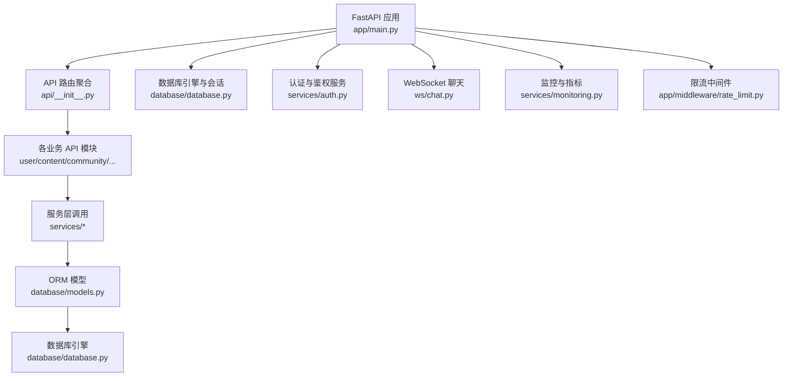
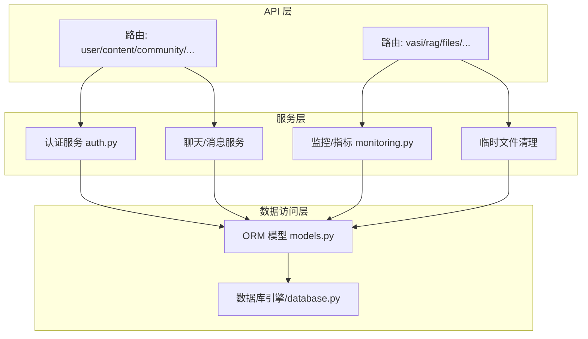
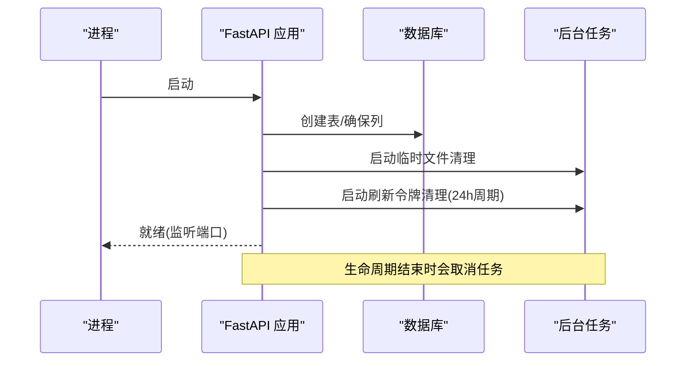
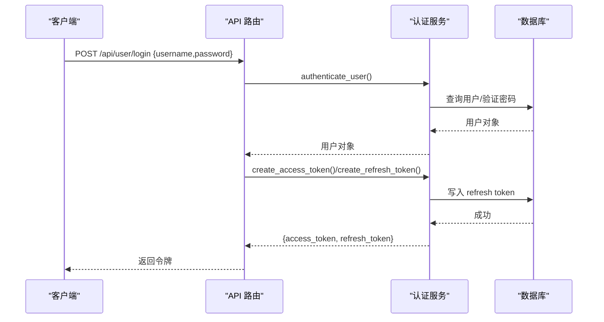
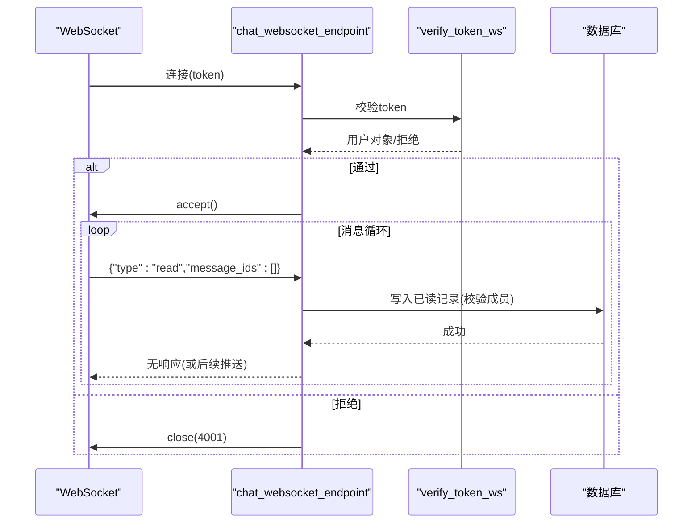
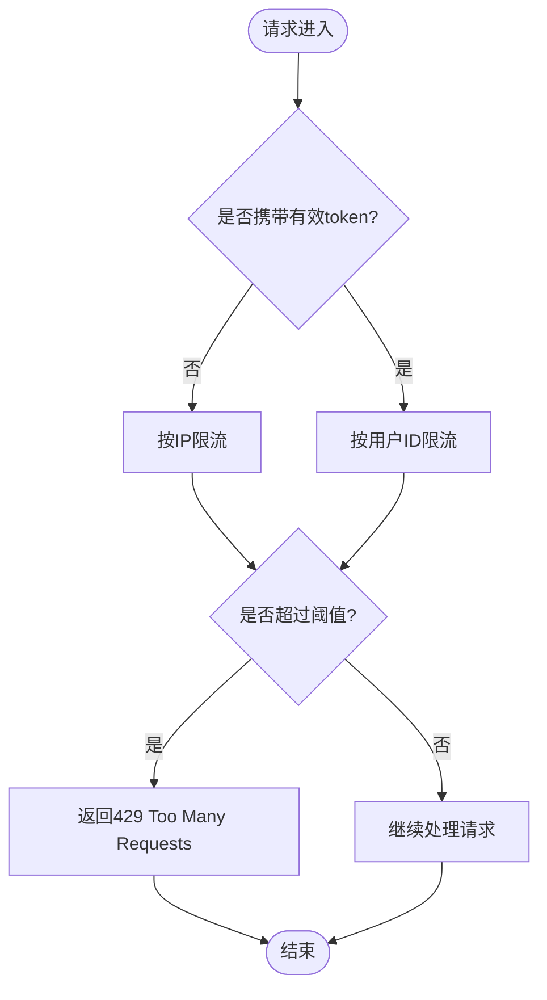
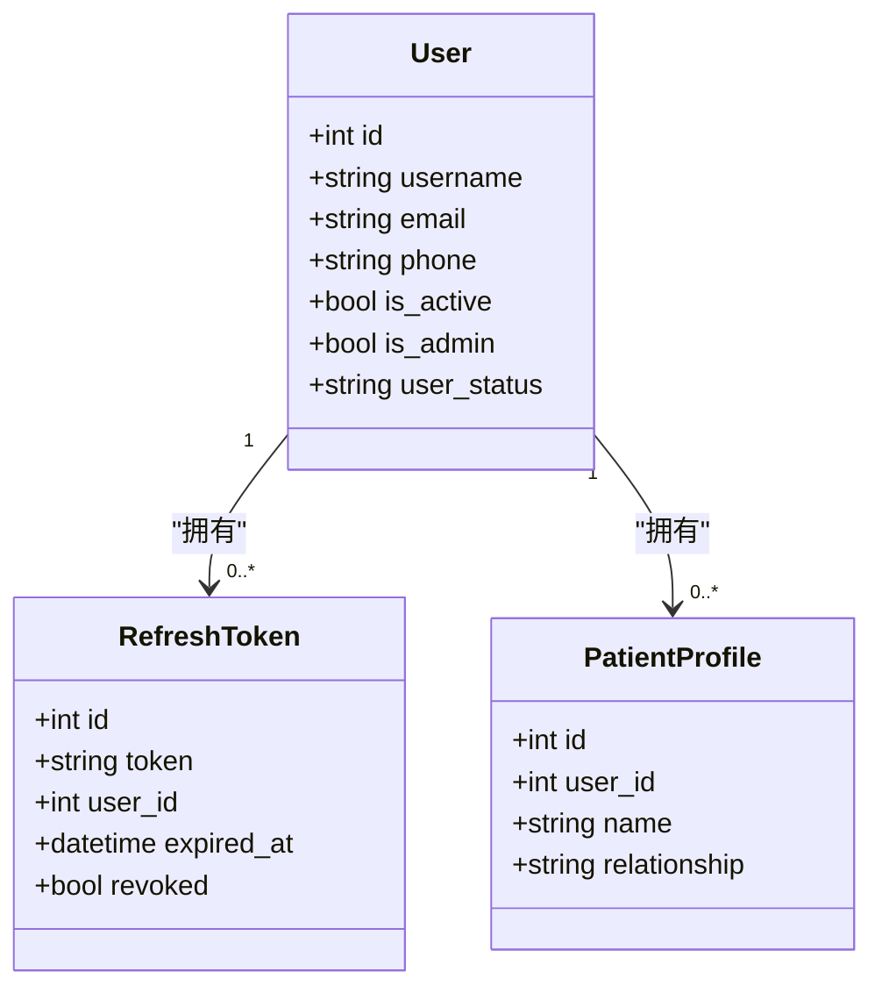
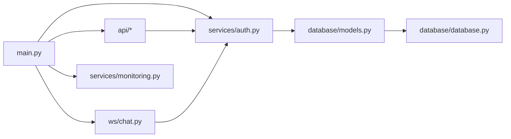

# 后端架构设计

<cite>
**本文引用的文件**
- [web/backend/app/main.py](file://web/backend/app/main.py)
- [web/backend/database/database.py](file://web/backend/database/database.py)
- [web/backend/database/models.py](file://web/backend/database/models.py)
- [web/backend/services/auth.py](file://web/backend/services/auth.py)
- [web/backend/ws/chat.py](file://web/backend/ws/chat.py)
- [web/backend/api/__init__.py](file://web/backend/api/__init__.py)
- [web/backend/app/middleware/rate_limit.py](file://web/backend/app/middleware/rate_limit.py)
- [web/backend/services/monitoring.py](file://web/backend/services/monitoring.py)
- [web/backend/exceptions.py](file://web/backend/exceptions.py)
</cite>

## 目录
1. [简介](#简介)
2. [项目结构](#项目结构)
3. [核心组件](#核心组件)
4. [架构总览](#架构总览)
5. [详细组件分析](#详细组件分析)
6. [依赖关系分析](#依赖关系分析)
7. [性能考量](#性能考量)
8. [故障排查指南](#故障排查指南)
9. [结论](#结论)
10. [附录](#附录)

## 简介
本文件为 Subskin 项目后端架构设计文档，聚焦 FastAPI 应用结构、分层架构（API层、服务层、数据访问层）、中间件机制、异常处理策略；阐述 RESTful API 设计原则、WebSocket 实时通信实现、异步任务处理；说明数据库连接管理、ORM 模型设计、事务处理机制；并给出认证授权架构、缓存策略、日志记录方案与监控指标采集。文末提供后端服务架构图与关键数据流图，便于读者快速理解系统全貌与细节。

## 项目结构
后端位于 web/backend 目录，采用“按功能域划分”的模块化组织：
- app/main.py：FastAPI 应用入口，注册路由、中间件、生命周期任务、健康检查与 WebSocket 端点
- api/*：RESTful API 路由模块，按业务域拆分（用户、内容、社区、IM、VASI、文件等）
- services/*：领域服务层，封装认证、消息、RAG、监控、临时文件清理等复杂逻辑
- database/*：数据库连接、会话工厂、SQLAlchemy ORM 模型定义与迁移脚本
- ws/chat.py：WebSocket 聊天与已读回执等实时能力
- app/middleware/*：自定义中间件（如限流）
- exceptions.py：领域异常定义，统一向上抛出并由上层转换为 HTTP 响应

图表来源
- [web/backend/app/main.py:226-349](file://web/backend/app/main.py#L226-L349)
- [web/backend/api/__init__.py:1-62](file://web/backend/api/__init__.py#L1-L62)
- [web/backend/database/database.py:1-46](file://web/backend/database/database.py#L1-L46)
- [web/backend/services/auth.py:1-309](file://web/backend/services/auth.py#L1-L309)
- [web/backend/ws/chat.py:1-111](file://web/backend/ws/chat.py#L1-L111)
- [web/backend/services/monitoring.py:1-200](file://web/backend/services/monitoring.py#L1-L200)
- [web/backend/app/middleware/rate_limit.py:1-96](file://web/backend/app/middleware/rate_limit.py#L1-L96)

章节来源
- [web/backend/app/main.py:226-349](file://web/backend/app/main.py#L226-L349)
- [web/backend/api/__init__.py:1-62](file://web/backend/api/__init__.py#L1-L62)

## 核心组件
- 应用启动与生命周期
  - 使用 lifespan 钩子在启动时执行临时上传清理、刷新令牌清理循环、LLM 配置初始化、时间序列化修复等
  - 注册 CORS、Prometheus 中间件（可选）、所有业务路由
  - 暴露 /api/health 健康检查与 /ws/chat WebSocket 端点
- 数据库连接与会话
  - 基于 SQLAlchemy 的 engine/session 工厂，SQLite 场景使用 NullPool 避免并发阻塞
  - get_db 依赖注入提供请求级会话，自动关闭
- 认证与授权
  - JWT access token + refresh token，支持管理员长时效 token
  - 文件专用短时效 token（scope=files），限制泄露影响面
  - 提供 get_current_user/get_required_user/get_optional_user 等依赖
  - WebSocket 通过查询参数 token 校验后建立连接
- 限流中间件
  - 进程内令牌桶，按 IP/用户维度对读、写、聊天接口限速
  - 可复用为通用依赖注入到具体路由
- 监控与可观测性
  - Sentry 错误追踪（可选）
  - Prometheus 指标收集（可选），暴露 /metrics
- 领域异常
  - 定义业务异常基类及细分异常，供服务层抛出，由 API 层统一转为 HTTP 响应

章节来源
- [web/backend/app/main.py:226-349](file://web/backend/app/main.py#L226-L349)
- [web/backend/database/database.py:1-46](file://web/backend/database/database.py#L1-L46)
- [web/backend/services/auth.py:1-309](file://web/backend/services/auth.py#L1-L309)
- [web/backend/app/middleware/rate_limit.py:1-96](file://web/backend/app/middleware/rate_limit.py#L1-L96)
- [web/backend/services/monitoring.py:1-200](file://web/backend/services/monitoring.py#L1-L200)
- [web/backend/exceptions.py:1-20](file://web/backend/exceptions.py#L1-L20)

## 架构总览
后端采用分层架构：
- API 层：FastAPI 路由，负责参数校验、权限校验、调用服务层、返回标准化响应
- 服务层：封装领域逻辑（认证、消息、RAG、监控、临时文件清理等），对外暴露函数式接口
- 数据访问层：SQLAlchemy ORM 模型与数据库连接，提供会话与持久化能力

图表来源
- [web/backend/app/main.py:280-319](file://web/backend/app/main.py#L280-L319)
- [web/backend/services/auth.py:1-309](file://web/backend/services/auth.py#L1-L309)
- [web/backend/services/monitoring.py:1-200](file://web/backend/services/monitoring.py#L1-L200)
- [web/backend/database/models.py:1-200](file://web/backend/database/models.py#L1-L200)
- [web/backend/database/database.py:1-46](file://web/backend/database/database.py#L1-L46)

## 详细组件分析

### 应用启动与生命周期
- 启动阶段
  - 创建数据库表（幂等）
  - 确保必要列/表存在（头像字段、体检报告解析字段、VASI 评估字段、图片打标字段、反馈字段）
  - 启动临时文件清理任务与刷新令牌清理循环（每 24 小时）
  - 初始化 LLM 配置默认值并重加密旧密钥
  - 注册 CORS、监控中间件、所有路由
- 运行期
  - 健康检查 /api/health
  - WebSocket /ws/chat 接入

图表来源
- [web/backend/app/main.py:74-180](file://web/backend/app/main.py#L74-L180)
- [web/backend/app/main.py:228-268](file://web/backend/app/main.py#L228-L268)

章节来源
- [web/backend/app/main.py:74-180](file://web/backend/app/main.py#L74-L180)
- [web/backend/app/main.py:228-268](file://web/backend/app/main.py#L228-L268)

### 认证与授权架构
- 登录与令牌
  - 支持用户名/手机号/邮箱登录，密码使用 bcrypt 哈希
  - 签发 access token（含 is_admin、exp、type）与 refresh token（持久化至数据库）
  - 文件专用短时效 token（type=file, scope=files），仅用于文件读取
- 鉴权依赖
  - get_current_user/get_required_user：从 Bearer token 解析用户，校验活跃状态与封禁状态
  - get_optional_user：允许匿名访问
  - verify_token_ws：WebSocket 通过查询参数 token 鉴权
- 刷新令牌维护
  - 启动时与定时任务清理过期/撤销的 refresh tokens，防止数据库膨胀

图表来源
- [web/backend/services/auth.py:35-110](file://web/backend/services/auth.py#L35-L110)
- [web/backend/services/auth.py:153-176](file://web/backend/services/auth.py#L153-L176)
- [web/backend/services/auth.py:285-309](file://web/backend/services/auth.py#L285-L309)

章节来源
- [web/backend/services/auth.py:1-309](file://web/backend/services/auth.py#L1-L309)

### WebSocket 实时通信
- 端点：/ws/chat?token=...
- 流程
  - 校验 token，未通过则关闭连接
  - 建立连接并记录 active 连接映射
  - 接收消息：ping/pong、read（已读回执）
  - read 事件会校验成员身份并写入 ImMessageRead
  - 断开或异常时清理连接

图表来源
- [web/backend/ws/chat.py:14-111](file://web/backend/ws/chat.py#L14-L111)
- [web/backend/services/auth.py:257-283](file://web/backend/services/auth.py#L257-L283)

章节来源
- [web/backend/ws/chat.py:1-111](file://web/backend/ws/chat.py#L1-L111)
- [web/backend/services/auth.py:257-283](file://web/backend/services/auth.py#L257-L283)

### 中间件与限流
- CORS：根据环境变量动态设置允许的源
- Prometheus 中间件：可选启用，收集请求数、耗时、并发数，暴露 /metrics
- 限流中间件：进程内令牌桶，按 IP/用户维度限制读、写、聊天接口频率，超限返回 429

图表来源
- [web/backend/app/middleware/rate_limit.py:10-96](file://web/backend/app/middleware/rate_limit.py#L10-L96)
- [web/backend/app/main.py:271-278](file://web/backend/app/main.py#L271-L278)

章节来源
- [web/backend/app/middleware/rate_limit.py:1-96](file://web/backend/app/middleware/rate_limit.py#L1-L96)
- [web/backend/app/main.py:271-278](file://web/backend/app/main.py#L271-L278)

### 数据库连接管理与事务
- 连接池
  - SQLite：使用 NullPool，避免并发写锁导致的阻塞；超时设为 15s
  - 其他数据库：启用 pool_pre_ping 保证连接健康
- 会话管理
  - get_db 依赖注入，请求开始获取会话，请求结束关闭
- 模型与关系
  - User、RefreshToken、PatientProfile、UserCredential 等核心实体
  - 通过 relationship 定义一对多/多对一关系
- 事务
  - 服务层在需要时使用 db.commit()/rollback() 控制事务边界
  - WebSocket 中写入已读回执使用独立会话并在 finally 中关闭

图表来源
- [web/backend/database/models.py:75-200](file://web/backend/database/models.py#L75-L200)
- [web/backend/database/database.py:1-46](file://web/backend/database/database.py#L1-L46)

章节来源
- [web/backend/database/database.py:1-46](file://web/backend/database/database.py#L1-L46)
- [web/backend/database/models.py:75-200](file://web/backend/database/models.py#L75-L200)

### 监控与日志
- Sentry：可选集成，过滤敏感头，捕获异常与上下文
- Prometheus：可选启用，收集 HTTP 指标，暴露 /metrics
- 日志：使用 Python logging，关键路径记录错误与统计信息

章节来源
- [web/backend/services/monitoring.py:1-200](file://web/backend/services/monitoring.py#L1-L200)

### 异常处理策略
- 领域异常：SubSkinException 及其子类（如凭证冲突、凭证不存在）
- 统一转换：服务层抛出领域异常，API 层将其转换为 HTTP 响应（400/409/404 等）
- 封禁处理：get_current_user 层对被封禁账号返回 403，附带原因

章节来源
- [web/backend/exceptions.py:1-20](file://web/backend/exceptions.py#L1-L20)
- [web/backend/services/auth.py:198-220](file://web/backend/services/auth.py#L198-L220)

## 依赖关系分析
- 入口依赖
  - main.py 引入所有 API 路由模块、数据库引擎、WebSocket 端点、监控与限流
- 服务依赖
  - 认证服务依赖数据库模型与会话
  - WebSocket 依赖认证服务进行鉴权
  - 监控中间件依赖 FastAPI/Starlette 扩展
- 数据依赖
  - 所有服务最终通过 ORM 模型访问数据库

图表来源
- [web/backend/app/main.py:26-63](file://web/backend/app/main.py#L26-L63)
- [web/backend/services/auth.py:1-309](file://web/backend/services/auth.py#L1-L309)
- [web/backend/ws/chat.py:1-111](file://web/backend/ws/chat.py#L1-L111)
- [web/backend/services/monitoring.py:1-200](file://web/backend/services/monitoring.py#L1-L200)
- [web/backend/database/models.py:1-200](file://web/backend/database/models.py#L1-L200)
- [web/backend/database/database.py:1-46](file://web/backend/database/database.py#L1-L46)

章节来源
- [web/backend/app/main.py:26-63](file://web/backend/app/main.py#L26-L63)

## 性能考量
- 数据库连接池
  - SQLite 使用 NullPool，避免并发写锁导致的全局阻塞；超时 15s 降低 locked 报错概率
- 限流保护
  - 读/写/聊天三类速率限制，防止滥用与成本失控
- 异步任务
  - 临时文件清理与刷新令牌清理以 asyncio.Task 后台运行，不阻塞主请求
- 监控
  - Prometheus 指标帮助识别慢接口与热点路径，Sentry 辅助定位异常

[本节为通用指导，无需特定文件引用]

## 故障排查指南
- 无法连接数据库
  - 检查 DATABASE_URL 与 data/subskin.db 路径权限
  - SQLite 并发写锁：关注 429/locked 错误，必要时调整并发或迁移至更合适的数据库
- 认证失败
  - 确认 SECRET_KEY、ALGORITHM 与环境变量正确
  - 检查用户状态（is_active、user_status）与封禁原因
- WebSocket 连接被拒
  - 检查 token 是否为 access 类型且有效
  - 查看 chat 端点日志中的 Unauthorized 与异常堆栈
- 限流触发
  - 观察 429 响应，调整限流策略或优化客户端重试逻辑
- 监控缺失
  - 确认 PROMETHEUS_ENABLED 与 SENTRY_DSN 环境变量配置

章节来源
- [web/backend/database/database.py:13-33](file://web/backend/database/database.py#L13-L33)
- [web/backend/services/auth.py:179-220](file://web/backend/services/auth.py#L179-L220)
- [web/backend/ws/chat.py:45-111](file://web/backend/ws/chat.py#L45-L111)
- [web/backend/app/middleware/rate_limit.py:40-96](file://web/backend/app/middleware/rate_limit.py#L40-L96)
- [web/backend/services/monitoring.py:28-63](file://web/backend/services/monitoring.py#L28-L63)

## 结论
Subskin 后端基于 FastAPI 构建，采用清晰的分层架构与模块化设计，具备完善的认证授权、限流保护、实时监控与 WebSocket 实时通信能力。数据库连接针对 SQLite 做了专项优化，结合后台任务与指标采集，满足高可用与可运维要求。建议在生产环境逐步迁移至更健壮的数据库与分布式缓存，并完善审计与告警体系。

[本节为总结性内容，无需特定文件引用]

## 附录

### RESTful API 设计原则
- 资源命名：使用名词复数表示资源集合（如 /api/user、/api/content）
- 方法语义：GET 读取、POST 创建、PUT/PATCH 更新、DELETE 删除
- 状态码：正确使用 2xx/4xx/5xx 表达结果与错误
- 版本化：通过 URL 前缀或头部进行版本控制（当前以 tag 分组）
- 安全：受保护接口需携带 Bearer token，文件接口可使用短时效 file token

[本节为通用指导，无需特定文件引用]

### 缓存策略
- 当前未显式引入外部缓存（如 Redis），可在热点查询处增加内存缓存或外部缓存层以提升性能
- 注意缓存一致性、失效策略与并发竞争问题

[本节为通用指导，无需特定文件引用]

### 日志记录方案
- 使用 Python logging 输出结构化日志
- 结合 Sentry 上报异常，Prometheus 采集指标
- 建议在关键路径添加上下文信息（用户ID、请求ID等）

[本节为通用指导，无需特定文件引用]