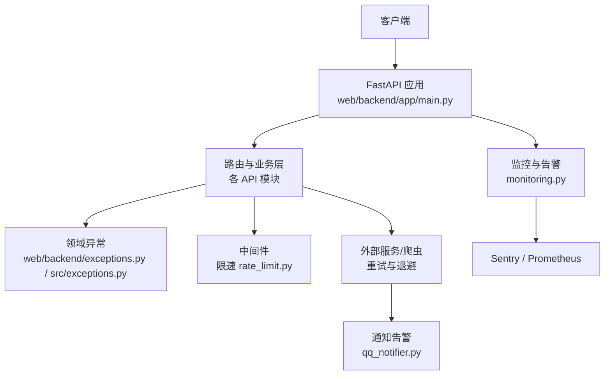
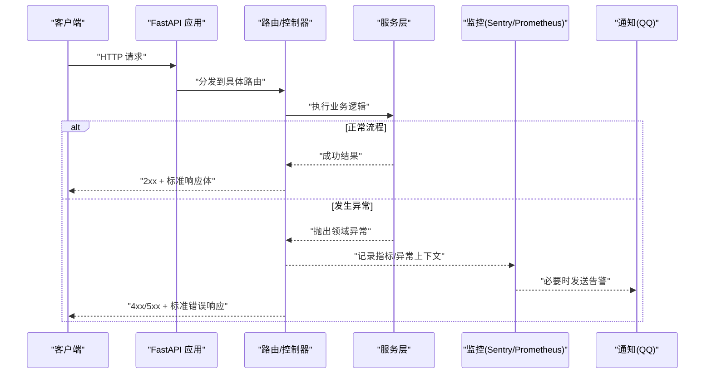
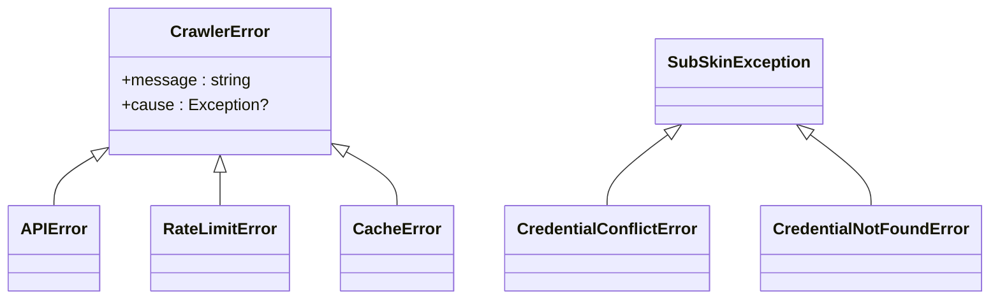
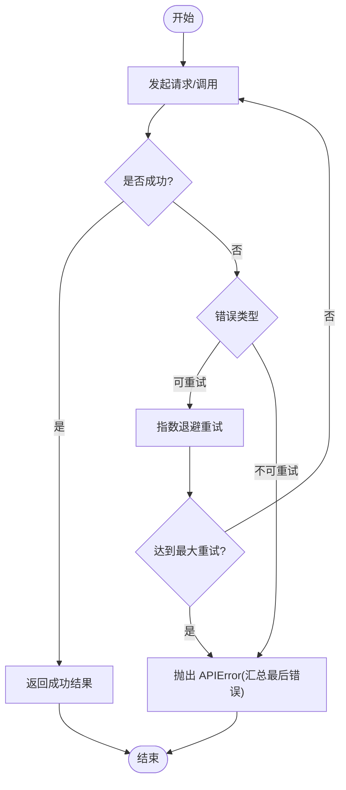
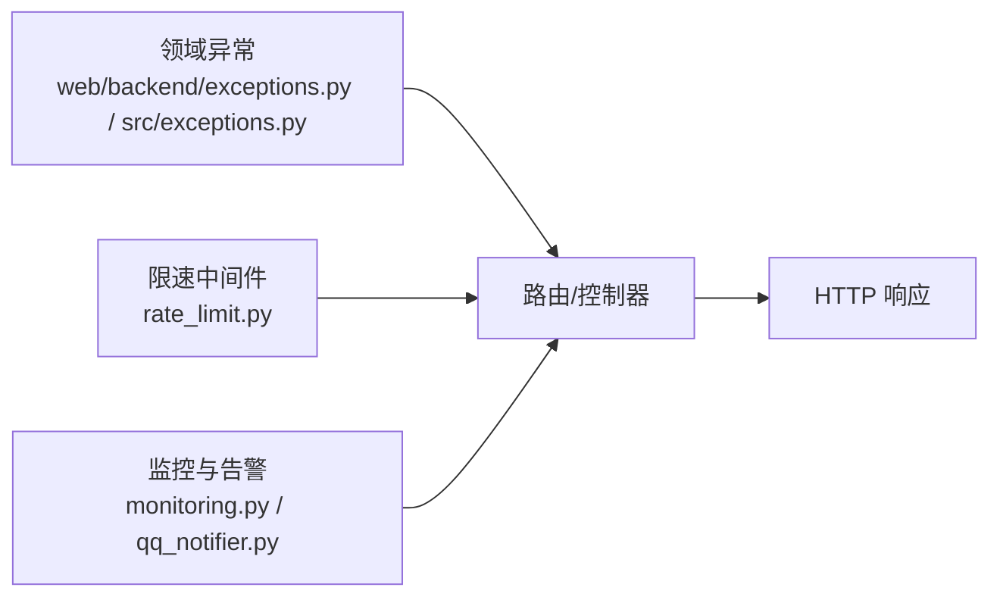

# 异常处理机制

<cite>
**本文引用的文件**
- [src/exceptions.py](file://src/exceptions.py)
- [web/backend/exceptions.py](file://web/backend/exceptions.py)
- [web/backend/app/main.py](file://web/backend/app/main.py)
- [web/backend/services/monitoring.py](file://web/backend/services/monitoring.py)
- [web/backend/app/middleware/rate_limit.py](file://web/backend/app/middleware/rate_limit.py)
- [src/crawlers/clinical_trials_crawler.py](file://src/crawlers/clinical_trials_crawler.py)
- [src/notifications/qq_notifier.py](file://src/notifications/qq_notifier.py)
- [web/backend/api/admin_general.py](file://web/backend/api/admin_general.py)
- [web/backend/api/image_label.py](file://web/backend/api/image_label.py)
- [web/backend/api/encyclopedia.py](file://web/backend/api/encyclopedia.py)
- [tests/test_exceptions.py](file://tests/test_exceptions.py)
</cite>

## 目录
1. [简介](#简介)
2. [项目结构](#项目结构)
3. [核心组件](#核心组件)
4. [架构总览](#架构总览)
5. [详细组件分析](#详细组件分析)
6. [依赖关系分析](#依赖关系分析)
7. [性能考量](#性能考量)
8. [故障排查指南](#故障排查指南)
9. [结论](#结论)
10. [附录](#附录)

## 简介
本文件为 Subskin 项目的异常处理机制提供系统化说明，覆盖自定义异常类、HTTP 状态码映射、错误响应标准化、全局异常处理与监控告警集成、重试与降级策略、调试信息控制以及用户友好错误消息。文档面向不同技术背景的读者，既提供高层概览，也给出代码级流程图与示例路径，便于快速定位与落地实践。

## 项目结构
Subskin 的异常处理涉及三层：
- 领域异常定义层：在爬虫与服务端分别定义业务异常基类与具体异常类型。
- 请求处理与中间件层：FastAPI 路由与中间件将异常转换为 HTTP 响应，并执行限速等横切逻辑。
- 监控与告警层：通过 Sentry 捕获异常、Prometheus 采集指标，并通过通知渠道上报关键错误。

图表来源
- [web/backend/app/main.py:264-327](file://web/backend/app/main.py#L264-L327)
- [web/backend/services/monitoring.py:28-90](file://web/backend/services/monitoring.py#L28-L90)
- [web/backend/app/middleware/rate_limit.py:10-96](file://web/backend/app/middleware/rate_limit.py#L10-L96)
- [src/crawlers/clinical_trials_crawler.py:163-199](file://src/crawlers/clinical_trials_crawler.py#L163-L199)
- [src/notifications/qq_notifier.py:283-318](file://src/notifications/qq_notifier.py#L283-L318)

章节来源
- [web/backend/app/main.py:264-327](file://web/backend/app/main.py#L264-L327)

## 核心组件
- 领域异常定义
  - 爬虫侧自定义异常：用于封装网络请求失败、速率限制、缓存错误等，支持携带原始异常作为 cause。
  - 服务端业务异常：统一继承自业务异常基类，便于在服务层抛出并在 API 层进行统一转换。
- 中间件与限速
  - 基于进程内令牌桶的读/写/聊天接口限速，超限返回 429 并附带友好提示。
- 监控与告警
  - Sentry 初始化与敏感信息过滤；可选 Prometheus 中间件暴露 /metrics；健康检查端点。
- 重试与退避
  - 爬虫侧对连接超时、网络错误及可重试的 API 错误实施指数退避重试，非可重试错误直接上抛。
- 错误通知
  - 格式化错误通知消息（含时间戳、错误类型、详情、可选截断堆栈），通过 QQ 通道发送告警。

章节来源
- [src/exceptions.py:13-38](file://src/exceptions.py#L13-L38)
- [web/backend/exceptions.py:4-20](file://web/backend/exceptions.py#L4-L20)
- [web/backend/app/middleware/rate_limit.py:10-96](file://web/backend/app/middleware/rate_limit.py#L10-L96)
- [web/backend/services/monitoring.py:28-90](file://web/backend/services/monitoring.py#L28-L90)
- [src/crawlers/clinical_trials_crawler.py:163-199](file://src/crawlers/clinical_trials_crawler.py#L163-L199)
- [src/notifications/qq_notifier.py:283-318](file://src/notifications/qq_notifier.py#L283-L318)

## 架构总览
下图展示一次典型请求从进入 FastAPI 到异常被捕获、记录、上报与返回的完整链路。

图表来源
- [web/backend/app/main.py:264-327](file://web/backend/app/main.py#L264-L327)
- [web/backend/services/monitoring.py:28-90](file://web/backend/services/monitoring.py#L28-L90)
- [src/notifications/qq_notifier.py:283-318](file://src/notifications/qq_notifier.py#L283-L318)

## 详细组件分析

### 自定义异常类与分类
- 爬虫异常族
  - 基类：CrawlerError，支持 message 与 cause，便于保留底层异常链。
  - 派生：APIError（网络/API 失败）、RateLimitError（触发限流）、CacheError（缓存读写失败）。
- 服务端业务异常族
  - 基类：SubSkinException，所有业务异常均继承该基类，便于统一识别与转换。
  - 派生：CredentialConflictError（凭证冲突）、CredentialNotFoundError（凭证不存在）等。

图表来源
- [src/exceptions.py:13-38](file://src/exceptions.py#L13-L38)
- [web/backend/exceptions.py:4-20](file://web/backend/exceptions.py#L4-L20)

章节来源
- [src/exceptions.py:13-38](file://src/exceptions.py#L13-L38)
- [web/backend/exceptions.py:4-20](file://web/backend/exceptions.py#L4-L20)
- [tests/test_exceptions.py:12-37](file://tests/test_exceptions.py#L12-L37)

### HTTP 状态码映射与错误响应格式
- 常见映射
  - 400：参数校验失败或业务规则不满足（如“该修订已被处理”）。
  - 403：权限不足（如“需要管理员权限”）。
  - 404：资源不存在（如“标注记录不存在”、“合成图生成失败”）。
  - 429：请求过于频繁（由限速中间件统一返回）。
  - 500：内部服务器错误（未捕获异常或系统错误）。
  - 504：网关/操作超时（如子进程调用超时）。
- 响应格式
  - 成功：包含 status 字段与业务数据（例如 {"status":"ok", ...}）。
  - 失败：使用 FastAPI 的 HTTPException，detail 字段承载用户可读的错误信息。
- 前端消费
  - 前端根据 HTTP 状态码与 detail 字段展示用户友好的提示信息。

章节来源
- [web/backend/api/encyclopedia.py:329-376](file://web/backend/api/encyclopedia.py#L329-L376)
- [web/backend/api/image_label.py:854-886](file://web/backend/api/image_label.py#L854-L886)
- [web/backend/api/admin_general.py:173-189](file://web/backend/api/admin_general.py#L173-L189)
- [web/backend/app/middleware/rate_limit.py:39-96](file://web/backend/app/middleware/rate_limit.py#L39-L96)

### 全局异常处理器与调试信息控制
- 全局处理现状
  - 当前应用未注册统一的异常处理中间件；异常主要由各路由显式 raise HTTPException 或由框架默认处理。
  - 建议在应用启动时注册全局异常处理器，将领域异常统一映射为 4xx/5xx 并输出标准化 JSON 响应。
- 调试信息控制
  - 日志应记录详细上下文（包括异常栈），但对外响应仅暴露用户可读信息。
  - 监控层（Sentry）自动收集异常与上下文，并过滤敏感头（如 Authorization、token 等）。
  - 通知告警中可对长堆栈进行截断，避免消息过长。

章节来源
- [web/backend/app/main.py:264-327](file://web/backend/app/main.py#L264-L327)
- [web/backend/services/monitoring.py:28-90](file://web/backend/services/monitoring.py#L28-L90)
- [src/notifications/qq_notifier.py:283-318](file://src/notifications/qq_notifier.py#L283-L318)

### 业务异常分类与处理建议
- 分类原则
  - 输入/参数错误：400
  - 鉴权/授权错误：401/403
  - 资源不存在：404
  - 并发/限流：429
  - 上游/系统错误：5xx
- 处理建议
  - 在服务层抛出领域异常，不在路由层做过多 try/except。
  - 统一在中间件或全局处理器中完成异常到 HTTP 响应的映射。
  - 对可恢复错误（如网络抖动、临时限流）采用重试与退避；对不可恢复错误立即返回。

章节来源
- [web/backend/app/middleware/rate_limit.py:39-96](file://web/backend/app/middleware/rate_limit.py#L39-L96)
- [src/crawlers/clinical_trials_crawler.py:163-199](file://src/crawlers/clinical_trials_crawler.py#L163-L199)

### 异常日志记录与错误追踪集成
- 日志记录
  - 在关键路径记录警告/错误日志，包含必要上下文（如尝试次数、退避时间、错误类型）。
- 错误追踪
  - 通过 Sentry 捕获异常，自动关联请求上下文，支持按环境隔离与采样率控制。
  - 手动捕获：在复杂分支或异步任务中使用 capture_exception 上报。
- 指标采集
  - Prometheus 中间件统计请求总量、耗时、进行中请求数，便于容量规划与瓶颈定位。

章节来源
- [web/backend/services/monitoring.py:28-90](file://web/backend/services/monitoring.py#L28-L90)
- [web/backend/services/monitoring.py:96-183](file://web/backend/services/monitoring.py#L96-L183)
- [src/crawlers/clinical_trials_crawler.py:163-199](file://src/crawlers/clinical_trials_crawler.py#L163-L199)

### 异常重试机制与降级策略
- 重试策略
  - 对连接错误、超时与部分 API 错误（如 429、5xx）进行指数退避重试。
  - 非可重试错误（如 4xx 且非 429）直接上抛，避免无效重试。
- 降级策略
  - 当外部依赖不可用时，返回友好错误并记录日志；必要时启用缓存或只读模式。
  - 对于耗时较长的后台任务，设置超时并返回 504，同时触发告警。

图表来源
- [src/crawlers/clinical_trials_crawler.py:163-199](file://src/crawlers/clinical_trials_crawler.py#L163-L199)

章节来源
- [src/crawlers/clinical_trials_crawler.py:163-199](file://src/crawlers/clinical_trials_crawler.py#L163-L199)

### 监控告警集成
- Sentry
  - 初始化时注入 FastAPI/Starlette/SQLAlchemy 集成，过滤敏感头，支持环境与采样率配置。
  - 提供 capture_exception 用于手动上报复杂异常场景。
- Prometheus
  - 可选中间件收集 HTTP 指标，暴露 /metrics 供抓取。
- 健康检查
  - 提供 /api/health 检查数据库与磁盘空间等关键依赖。
- 通知告警
  - 格式化错误通知（含时间、类型、详情、可选堆栈），通过 QQ 通道发送，便于值班人员及时处置。

章节来源
- [web/backend/services/monitoring.py:28-90](file://web/backend/services/monitoring.py#L28-L90)
- [web/backend/services/monitoring.py:96-183](file://web/backend/services/monitoring.py#L96-L183)
- [web/backend/app/main.py:321-327](file://web/backend/app/main.py#L321-L327)
- [src/notifications/qq_notifier.py:283-318](file://src/notifications/qq_notifier.py#L283-L318)

### 用户友好错误消息
- 原则
  - 对外仅返回用户可读的简短消息（detail），避免泄露内部实现细节。
  - 对可操作错误提供明确指引（如“请稍后再试”、“请检查权限”）。
- 示例
  - 429：请求过于频繁，请稍后再试。
  - 403：需要管理员权限。
  - 404：标注记录不存在。
  - 504：操作超时。

章节来源
- [web/backend/app/middleware/rate_limit.py:39-96](file://web/backend/app/middleware/rate_limit.py#L39-L96)
- [web/backend/api/encyclopedia.py:329-376](file://web/backend/api/encyclopedia.py#L329-L376)
- [web/backend/api/image_label.py:854-886](file://web/backend/api/image_label.py#L854-L886)
- [web/backend/api/admin_general.py:173-189](file://web/backend/api/admin_general.py#L173-L189)

## 依赖关系分析
- 耦合与内聚
  - 领域异常与业务逻辑解耦：服务层抛出领域异常，路由层负责转换与响应。
  - 监控与业务解耦：通过中间件与工具函数接入，不影响主流程。
- 外部依赖
  - Sentry、Prometheus、QQ 通知均为可选依赖，缺失时优雅降级（记录日志并跳过功能）。
- 潜在循环依赖
  - 当前未发现明显循环依赖；监控与通知模块独立于业务模块。

图表来源
- [web/backend/exceptions.py:4-20](file://web/backend/exceptions.py#L4-L20)
- [src/exceptions.py:13-38](file://src/exceptions.py#L13-L38)
- [web/backend/app/middleware/rate_limit.py:10-96](file://web/backend/app/middleware/rate_limit.py#L10-L96)
- [web/backend/services/monitoring.py:28-90](file://web/backend/services/monitoring.py#L28-L90)
- [src/notifications/qq_notifier.py:283-318](file://src/notifications/qq_notifier.py#L283-L318)

章节来源
- [web/backend/app/main.py:264-327](file://web/backend/app/main.py#L264-L327)

## 性能考量
- 重试与退避
  - 指数退避降低瞬时压力，避免雪崩；合理设置最大重试次数与退避上限。
- 中间件开销
  - Prometheus 中间件仅在启用时生效；指标维度使用路由模板而非实际路径，避免高基数。
- 日志与告警
  - 日志级别按需调整；告警消息截断堆栈，减少带宽与存储压力。

[本节为通用指导，无需特定文件引用]

## 故障排查指南
- 常见问题
  - 429 频繁出现：检查限速阈值与流量峰值，必要时扩容或优化客户端重试策略。
  - 504 超时：检查外部依赖响应时间与超时配置，考虑增加超时与重试。
  - 404/403：核对资源存在性与权限模型。
- 定位手段
  - 查看 Sentry 事件与堆栈，结合请求 ID 与上下文定位问题。
  - 通过 Prometheus 指标观察错误率与延迟分布。
  - 检查 QQ 通知中的错误摘要与堆栈片段。

章节来源
- [web/backend/services/monitoring.py:28-90](file://web/backend/services/monitoring.py#L28-L90)
- [web/backend/services/monitoring.py:96-183](file://web/backend/services/monitoring.py#L96-L183)
- [src/notifications/qq_notifier.py:283-318](file://src/notifications/qq_notifier.py#L283-L318)

## 结论
Subskin 的异常处理以领域异常为核心，结合中间件与监控告警形成闭环：服务层抛出语义化异常，路由层统一转换为 HTTP 响应；监控层捕获异常并上报，必要时触发告警；爬虫侧通过重试与退避提升鲁棒性。建议后续补充全局异常处理器，进一步统一错误响应格式与调试信息控制，以提升一致性与可维护性。

[本节为总结，无需特定文件引用]

## 附录

### 错误响应示例（路径参考）
- 成功响应
  - 路径参考：[web/backend/api/image_label.py:854-886](file://web/backend/api/image_label.py#L854-L886)
- 参数/业务错误
  - 路径参考：[web/backend/api/encyclopedia.py:329-376](file://web/backend/api/encyclopedia.py#L329-L376)
- 权限错误
  - 路径参考：[web/backend/api/encyclopedia.py:329-376](file://web/backend/api/encyclopedia.py#L329-L376)
- 资源不存在
  - 路径参考：[web/backend/api/image_label.py:854-886](file://web/backend/api/image_label.py#L854-L886)
- 限流
  - 路径参考：[web/backend/app/middleware/rate_limit.py:39-96](file://web/backend/app/middleware/rate_limit.py#L39-L96)
- 超时
  - 路径参考：[web/backend/api/admin_general.py:173-189](file://web/backend/api/admin_general.py#L173-L189)