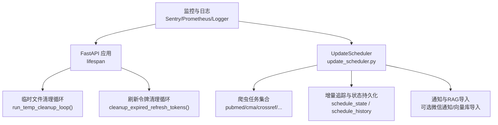
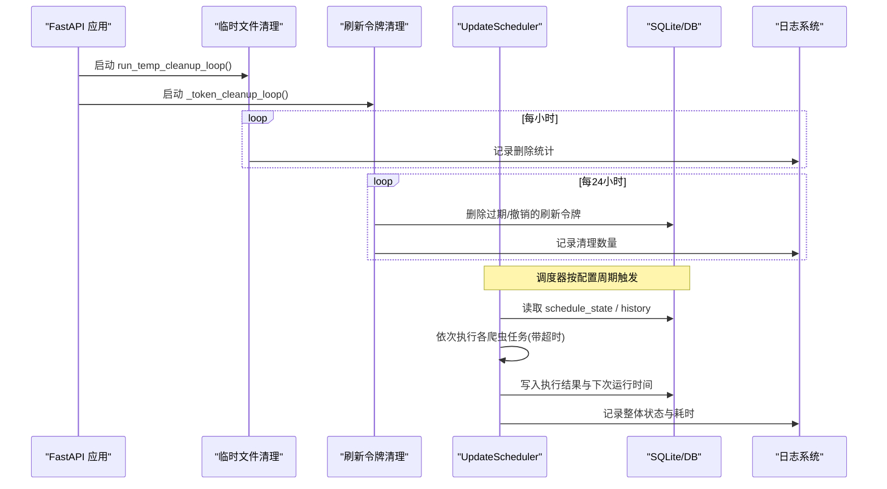
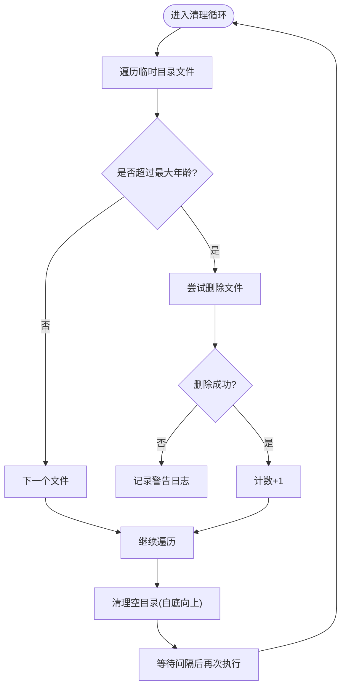
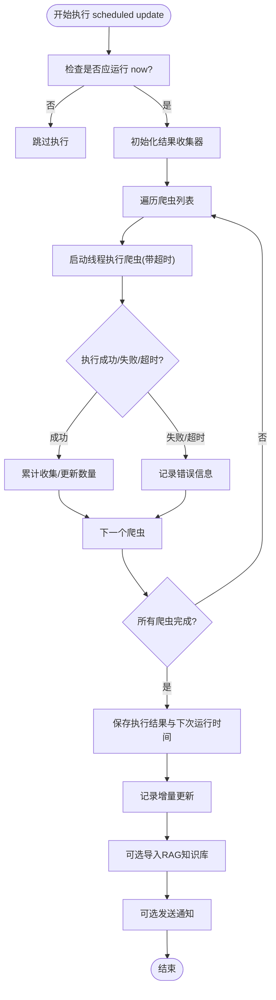
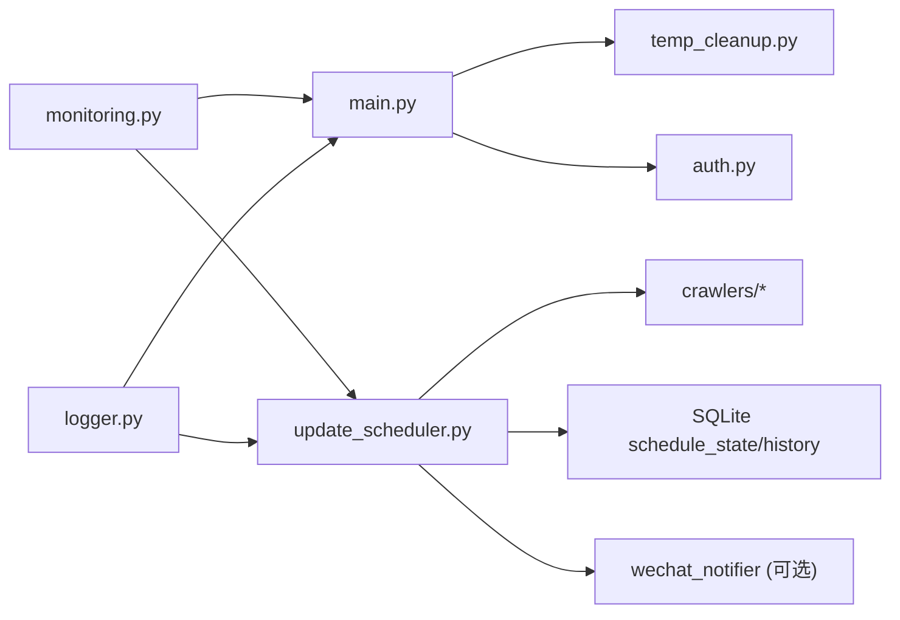

# 异步任务处理

<cite>
**本文引用的文件**
- [web/backend/app/main.py](file://web/backend/app/main.py)
- [web/backend/services/temp_cleanup.py](file://web/backend/services/temp_cleanup.py)
- [web/backend/services/auth.py](file://web/backend/services/auth.py)
- [src/scheduler/update_scheduler.py](file://src/scheduler/update_scheduler.py)
- [scheduler_config.json](file://scheduler_config.json)
- [web/backend/services/monitoring.py](file://web/backend/services/monitoring.py)
- [src/utils/logger.py](file://src/utils/logger.py)
- [tests/test_update_scheduler.py](file://tests/test_update_scheduler.py)
- [tests/backend/api/test_files.py](file://tests/backend/api/test_files.py)
</cite>

## 目录
1. [简介](#简介)
2. [项目结构](#项目结构)
3. [核心组件](#核心组件)
4. [架构总览](#架构总览)
5. [详细组件分析](#详细组件分析)
6. [依赖关系分析](#依赖关系分析)
7. [性能考量](#性能考量)
8. [故障排查指南](#故障排查指南)
9. [结论](#结论)
10. [附录](#附录)

## 简介
本文件面向 SubSkin 项目的“异步任务处理”主题，系统性说明：
- asyncio 任务调度与生命周期管理（临时文件清理、刷新令牌清理）
- 定时任务执行机制（数据同步/采集调度器）
- 任务队列设计、优先级管理与失败重试策略
- 任务监控、日志记录与资源清理
- 提供架构图与关键执行流程图

## 项目结构
SubSkin 的异步任务主要分布在后端服务启动生命周期与独立的数据更新调度器中：
- 后端服务在 FastAPI lifespan 中创建并管理后台 asyncio 任务
- 数据更新调度器负责周期性抓取多源数据、增量追踪与结果归档
- 监控与日志子系统提供错误追踪、指标采集与可旋转日志



图表来源
- [web/backend/app/main.py:228-268](file://web/backend/app/main.py#L228-L268)
- [web/backend/services/temp_cleanup.py:55-65](file://web/backend/services/temp_cleanup.py#L55-L65)
- [web/backend/services/auth.py:285-308](file://web/backend/services/auth.py#L285-L308)
- [src/scheduler/update_scheduler.py:79-124](file://src/scheduler/update_scheduler.py#L79-L124)
- [web/backend/services/monitoring.py:28-63](file://web/backend/services/monitoring.py#L28-L63)

章节来源
- [web/backend/app/main.py:228-268](file://web/backend/app/main.py#L228-L268)
- [src/scheduler/update_scheduler.py:79-124](file://src/scheduler/update_scheduler.py#L79-L124)

## 核心组件
- 临时文件清理任务：按时间阈值扫描并删除过期上传临时文件，支持可配置间隔与日志输出。
- 刷新令牌清理任务：定期清理数据库中过期或被撤销的刷新令牌，防止数据库膨胀。
- 数据同步调度器：按频率（日/周/月）触发多源爬虫任务，记录执行历史与增量信息，支持超时控制与通知。
- 监控与日志：集成 Sentry 错误追踪、Prometheus 指标采集，统一日志格式与轮转策略。

章节来源
- [web/backend/services/temp_cleanup.py:15-65](file://web/backend/services/temp_cleanup.py#L15-L65)
- [web/backend/services/auth.py:285-308](file://web/backend/services/auth.py#L285-L308)
- [src/scheduler/update_scheduler.py:79-381](file://src/scheduler/update_scheduler.py#L79-L381)
- [web/backend/services/monitoring.py:28-203](file://web/backend/services/monitoring.py#L28-L203)
- [src/utils/logger.py:19-81](file://src/utils/logger.py#L19-L81)

## 架构总览
后端服务通过 FastAPI lifespan 启动两个长期运行的 asyncio 任务：
- 临时文件清理循环：每小时执行一次，删除超过 24 小时的临时文件
- 刷新令牌清理循环：每 24 小时执行一次，清理过期或已撤销的刷新令牌

数据同步调度器以独立进程/脚本运行，依据 scheduler_config.json 中的频率与时间点触发，串行执行多个爬虫任务，每个任务有超时保护，最终汇总结果并写入执行历史。



图表来源
- [web/backend/app/main.py:228-268](file://web/backend/app/main.py#L228-L268)
- [web/backend/services/temp_cleanup.py:55-65](file://web/backend/services/temp_cleanup.py#L55-L65)
- [web/backend/services/auth.py:285-308](file://web/backend/services/auth.py#L285-L308)
- [src/scheduler/update_scheduler.py:157-217](file://src/scheduler/update_scheduler.py#L157-L217)
- [src/scheduler/update_scheduler.py:218-381](file://src/scheduler/update_scheduler.py#L218-L381)

## 详细组件分析

### 临时文件清理任务
- 功能：扫描 data/uploads/temp 目录，删除修改时间早于阈值的文件，随后清理空目录。
- 执行方式：作为 asyncio 循环任务，默认每小时执行一次；首次启动时立即执行一次。
- 容错：对无法删除的文件记录警告日志；异常不会中断循环。
- 可观测性：每次删除数量会记录到日志。



图表来源
- [web/backend/services/temp_cleanup.py:15-65](file://web/backend/services/temp_cleanup.py#L15-L65)

章节来源
- [web/backend/services/temp_cleanup.py:15-65](file://web/backend/services/temp_cleanup.py#L15-L65)
- [web/backend/app/main.py:228-268](file://web/backend/app/main.py#L228-L268)
- [tests/backend/api/test_files.py:70-96](file://tests/backend/api/test_files.py#L70-L96)

### 刷新令牌清理任务
- 功能：删除数据库中过期或已被撤销的刷新令牌，避免数据库膨胀。
- 执行方式：在 FastAPI lifespan 中启动一个无限循环，每 24 小时调用清理函数；服务启动时也立即执行一次。
- 容错：捕获异常并记录错误，不影响服务运行。
- 可观测性：清理数量会在日志中记录。

```mermaid
sequenceDiagram
participant App as "FastAPI 应用"
participant Loop as "_token_cleanup_loop()"
participant Auth as "cleanup_expired_refresh_tokens()"
participant DB as "数据库"
App->>Loop : 启动后台任务
loop 每24小时
Loop->>Auth : 调用清理函数
Auth->>DB : 查询并删除过期/撤销的刷新令牌
DB-->>Auth : 返回受影响行数
Auth->>App : 记录清理数量
end
```

图表来源
- [web/backend/app/main.py:240-248](file://web/backend/app/main.py#L240-L248)
- [web/backend/services/auth.py:285-308](file://web/backend/services/auth.py#L285-L308)

章节来源
- [web/backend/app/main.py:240-248](file://web/backend/app/main.py#L240-L248)
- [web/backend/services/auth.py:285-308](file://web/backend/services/auth.py#L285-L308)

### 数据同步调度器（定时任务执行机制）
- 配置：scheduler_config.json 定义频率（daily/weekly/monthly）、执行时间、是否启用、最大运行时长、完成/失败通知开关等。
- 调度逻辑：根据当前时间与 next_run 判断是否应执行；计算下一次运行时间；维护 schedule_state 与 schedule_history。
- 执行流程：串行执行多个爬虫任务（PubMed、CMA、CrossRef、ClinicalTrials、Foundation News、OmicsDI、Medical Content），每个任务设置超时；汇总结果、记录增量、可选导入 RAG、发送通知。
- 并发模型：使用线程包装爬虫调用，限制单个任务最长运行时间，避免阻塞主调度流程。



图表来源
- [src/scheduler/update_scheduler.py:157-217](file://src/scheduler/update_scheduler.py#L157-L217)
- [src/scheduler/update_scheduler.py:218-381](file://src/scheduler/update_scheduler.py#L218-L381)
- [scheduler_config.json:1-10](file://scheduler_config.json#L1-L10)

章节来源
- [src/scheduler/update_scheduler.py:79-381](file://src/scheduler/update_scheduler.py#L79-L381)
- [scheduler_config.json:1-10](file://scheduler_config.json#L1-L10)
- [tests/test_update_scheduler.py:121-167](file://tests/test_update_scheduler.py#L121-L167)

### 任务队列设计与优先级管理
- 当前实现采用“顺序执行 + 单任务超时”的模式，未引入外部队列（如 Celery/Redis）。
- 优先级管理体现在配置层面：可通过调整爬虫顺序与频率控制高优先级任务的执行时机；也可通过 scheduler_config.json 的 enabled 字段动态启停特定任务。
- 扩展建议：如需更复杂的优先级与重试，可在调度器中引入内存队列（如 asyncio.Queue）或外部消息队列，并结合任务元数据（priority、retry_count、backoff）进行调度。

章节来源
- [src/scheduler/update_scheduler.py:245-305](file://src/scheduler/update_scheduler.py#L245-L305)
- [scheduler_config.json:1-10](file://scheduler_config.json#L1-L10)

### 失败重试策略
- 调度器层：每个爬虫任务设置固定超时（例如 60 分钟），超时视为失败；失败会被记录并在汇总中体现。
- 具体爬虫/工具层：部分组件自带重试逻辑（例如翻译器针对 5xx、429、超时、连接错误的重试），但调度器本身不自动重试整个任务。
- 建议：为关键任务增加指数退避重试与最大重试次数，结合执行历史表记录重试次数与原因。

章节来源
- [src/scheduler/update_scheduler.py:257-305](file://src/scheduler/update_scheduler.py#L257-L305)
- [tests/test_translator.py:165-258](file://tests/test_translator.py#L165-L258)

### 任务监控、日志记录与资源清理
- 监控：
  - Sentry：可选初始化，过滤敏感头，支持异常上报与链路追踪采样。
  - Prometheus：可选中间件，暴露 /metrics 端点，采集 HTTP 请求数、耗时、进行中请求数。
- 日志：
  - 统一 logger 工具支持控制台与文件输出，支持按天轮转与保留天数。
  - 调度器使用独立日志文件（logs/scheduler.log）便于问题定位。
- 资源清理：
  - 临时文件清理任务确保磁盘空间不被过期上传占用。
  - 刷新令牌清理任务防止数据库膨胀。
  - 服务关闭时取消后台任务并等待其退出。

章节来源
- [web/backend/services/monitoring.py:28-203](file://web/backend/services/monitoring.py#L28-L203)
- [src/utils/logger.py:19-81](file://src/utils/logger.py#L19-L81)
- [web/backend/app/main.py:228-268](file://web/backend/app/main.py#L228-L268)

## 依赖关系分析
- 后端服务依赖 temp_cleanup 与 auth 清理模块，在 lifespan 中创建 asyncio 任务。
- 调度器依赖爬虫模块、增量追踪、缓存与通知模块，并通过 SQLite 持久化状态与历史。
- 监控模块可选依赖 sentry-sdk 与 prometheus-client，通过环境变量开关。



图表来源
- [web/backend/app/main.py:228-268](file://web/backend/app/main.py#L228-L268)
- [src/scheduler/update_scheduler.py:79-124](file://src/scheduler/update_scheduler.py#L79-L124)
- [web/backend/services/monitoring.py:28-203](file://web/backend/services/monitoring.py#L28-L203)
- [src/utils/logger.py:19-81](file://src/utils/logger.py#L19-L81)

章节来源
- [web/backend/app/main.py:228-268](file://web/backend/app/main.py#L228-L268)
- [src/scheduler/update_scheduler.py:79-124](file://src/scheduler/update_scheduler.py#L79-L124)
- [web/backend/services/monitoring.py:28-203](file://web/backend/services/monitoring.py#L28-L203)
- [src/utils/logger.py:19-81](file://src/utils/logger.py#L19-L81)

## 性能考量
- 调度器串行执行爬虫任务，适合 I/O 密集型且外部 API 限频的场景；若需更高吞吐，可改为并发执行（注意外部 API 速率限制与资源竞争）。
- 超时保护避免长时间阻塞；可根据任务特性调整超时阈值。
- 日志轮转与监控指标有助于发现性能瓶颈与异常峰值。
- 临时文件与刷新令牌清理降低存储与数据库压力，提升长期稳定性。

[本节为通用指导，无需特定文件引用]

## 故障排查指南
- 临时文件未清理：
  - 检查 data/uploads/temp 目录是否存在与权限；查看清理日志是否记录删除数量。
  - 参考测试用例验证清理行为是否符合预期。
- 刷新令牌未清理：
  - 检查数据库 RefreshToken 表是否有过期或已撤销记录；查看清理日志是否记录删除数量。
- 调度器未执行：
  - 检查 scheduler_config.json 的 enabled 与 frequency/hour/minute；确认 should_run_now 逻辑与 next_run 时间。
  - 查看 schedule_history 表最近执行记录与状态。
- 监控与日志：
  - 确认 Sentry DSN 与环境变量配置；检查 /metrics 端点是否可用。
  - 查看 logs/scheduler.log 与标准输出日志，定位异常堆栈。

章节来源
- [tests/backend/api/test_files.py:70-96](file://tests/backend/api/test_files.py#L70-L96)
- [web/backend/services/auth.py:285-308](file://web/backend/services/auth.py#L285-L308)
- [src/scheduler/update_scheduler.py:157-217](file://src/scheduler/update_scheduler.py#L157-L217)
- [web/backend/services/monitoring.py:28-203](file://web/backend/services/monitoring.py#L28-L203)
- [src/utils/logger.py:19-81](file://src/utils/logger.py#L19-L81)

## 结论
SubSkin 的异步任务处理以 FastAPI lifespan 管理的 asyncio 后台任务为核心，配合独立的 UpdateScheduler 实现数据同步与增量追踪。通过临时文件清理与刷新令牌清理保障资源健康，借助 Sentry 与 Prometheus 实现监控与可观测性。当前实现简洁稳定，适合中小规模任务；如需复杂优先级与重试，可扩展为基于队列的任务系统。

[本节为总结，无需特定文件引用]

## 附录
- 配置项参考：
  - scheduler_config.json：frequency、hour、minute、enabled、max_runtime_hours、notify_on_completion、notify_on_failure
- 关键路径参考：
  - 临时文件清理：web/backend/services/temp_cleanup.py
  - 刷新令牌清理：web/backend/services/auth.py
  - 调度器：src/scheduler/update_scheduler.py
  - 监控：web/backend/services/monitoring.py
  - 日志：src/utils/logger.py

章节来源
- [scheduler_config.json:1-10](file://scheduler_config.json#L1-L10)
- [web/backend/services/temp_cleanup.py:15-65](file://web/backend/services/temp_cleanup.py#L15-L65)
- [web/backend/services/auth.py:285-308](file://web/backend/services/auth.py#L285-L308)
- [src/scheduler/update_scheduler.py:79-381](file://src/scheduler/update_scheduler.py#L79-L381)
- [web/backend/services/monitoring.py:28-203](file://web/backend/services/monitoring.py#L28-L203)
- [src/utils/logger.py:19-81](file://src/utils/logger.py#L19-L81)