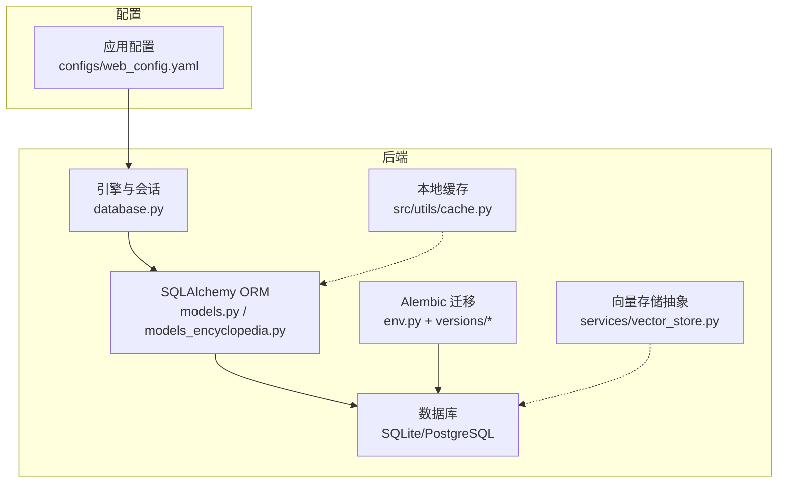
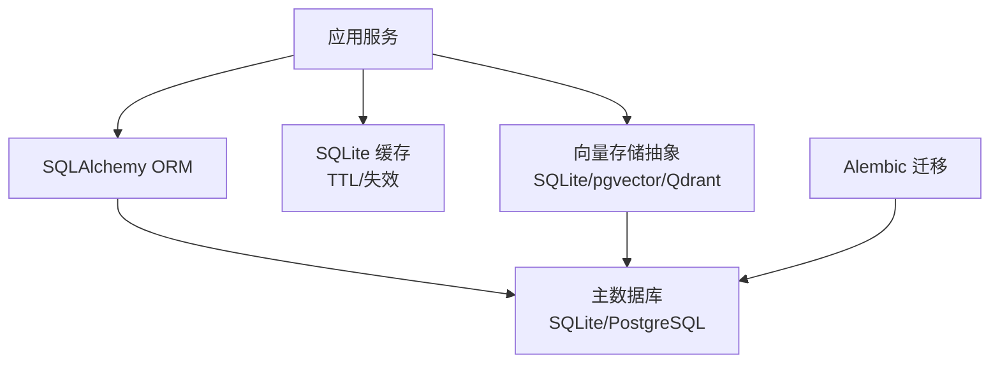
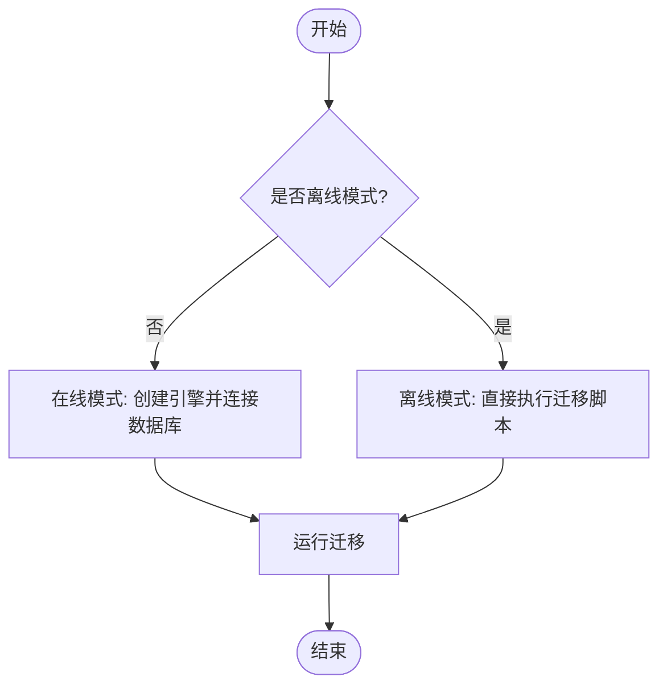
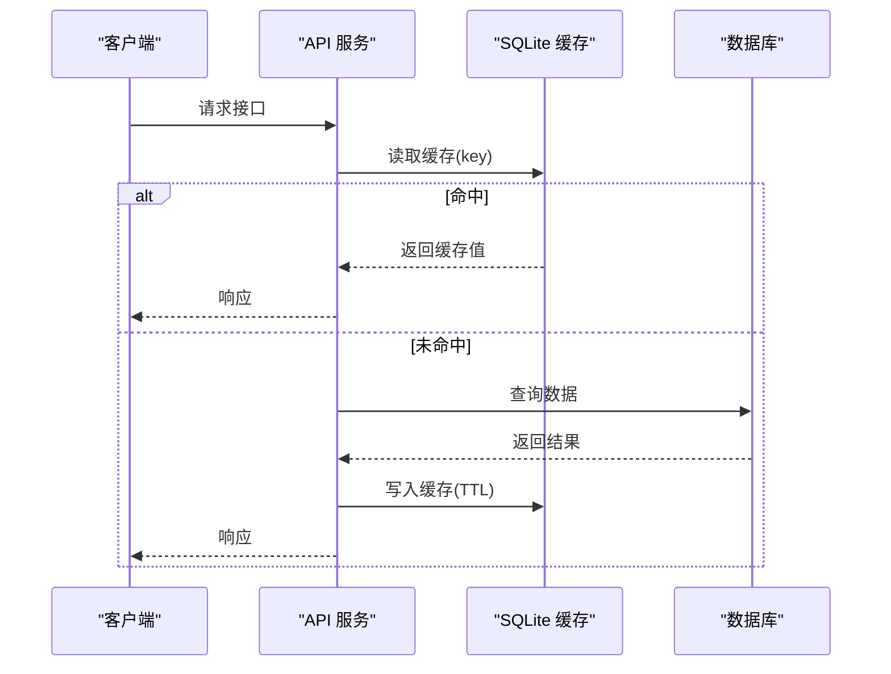
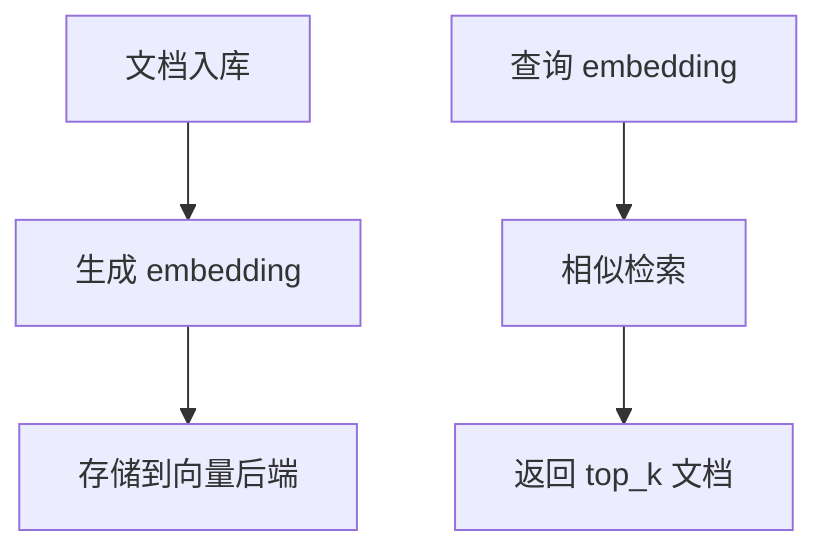
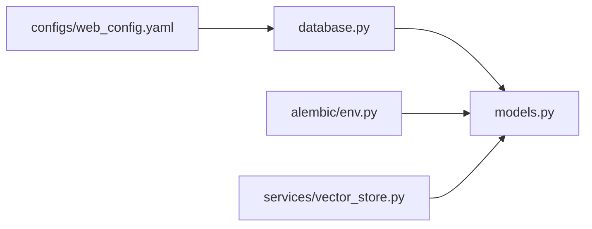
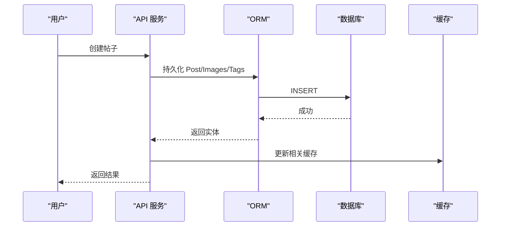
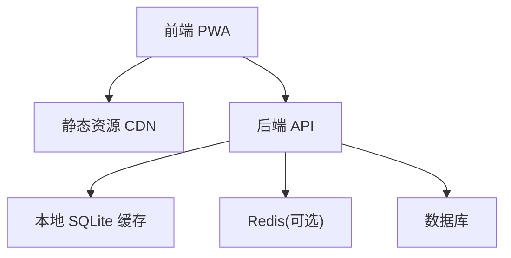

# 数据架构设计

<cite>
**本文引用的文件**   
- [web/backend/database/models.py](file://web/backend/database/models.py)
- [web/backend/database/models_encyclopedia.py](file://web/backend/database/models_encyclopedia.py)
- [web/backend/database/database.py](file://web/backend/database/database.py)
- [web/backend/alembic/env.py](file://web/backend/alembic/env.py)
- [web/backend/alembic/versions/001_baseline.py](file://web/backend/alembic/versions/001_baseline.py)
- [configs/web_config.yaml](file://configs/web_config.yaml)
- [src/utils/cache.py](file://src/utils/cache.py)
- [web/backend/services/vector_store.py](file://web/backend/services/vector_store.py)
</cite>

## 目录
1. [引言](#引言)
2. [项目结构](#项目结构)
3. [核心组件](#核心组件)
4. [架构总览](#架构总览)
5. [详细组件分析](#详细组件分析)
6. [依赖关系分析](#依赖关系分析)
7. [性能考虑](#性能考虑)
8. [故障排查指南](#故障排查指南)
9. [结论](#结论)
10. [附录](#附录)

## 引言
本文件面向 Subskin 项目的数据架构，系统性阐述数据库设计原则、实体关系建模、表结构设计、ORM 映射策略、查询与索引优化、迁移与版本控制、备份恢复机制，以及缓存架构（含 Redis 使用场景与分布式缓存策略）。文档同时提供 ER 图、数据流向图与缓存架构图，帮助读者从概念到实现全面理解系统的数据层。

## 项目结构
- 数据库 ORM 模型集中在 web/backend/database/models.py 与 models_encyclopedia.py，统一继承自 Base，定义各业务实体与关系。
- 数据库连接与引擎配置在 web/backend/database/database.py，默认 SQLite，支持环境变量切换为其他数据库。
- Alembic 迁移环境在 web/backend/alembic/env.py，基线迁移在 versions/001_baseline.py。
- 应用配置（含数据库、Redis、向量库）在 configs/web_config.yaml。
- 轻量级本地缓存工具在 src/utils/cache.py（SQLite-backed）。
- RAG 向量存储抽象在 web/backend/services/vector_store.py，支持 SQLite/pgvector/Qdrant 后端。

**图表来源** 
- [web/backend/database/models.py:1-120](file://web/backend/database/models.py#L1-L120)
- [web/backend/database/database.py:1-46](file://web/backend/database/database.py#L1-L46)
- [web/backend/alembic/env.py:1-84](file://web/backend/alembic/env.py#L1-L84)
- [configs/web_config.yaml:61-78](file://configs/web_config.yaml#L61-L78)
- [src/utils/cache.py:1-147](file://src/utils/cache.py#L1-L147)
- [web/backend/services/vector_store.py:1-265](file://web/backend/services/vector_store.py#L1-L265)

**章节来源**
- [web/backend/database/models.py:1-120](file://web/backend/database/models.py#L1-L120)
- [web/backend/database/database.py:1-46](file://web/backend/database/database.py#L1-L46)
- [web/backend/alembic/env.py:1-84](file://web/backend/alembic/env.py#L1-L84)
- [configs/web_config.yaml:61-78](file://configs/web_config.yaml#L61-L78)

## 核心组件
- 用户与认证：User、UserCredential、RefreshToken、OAuthState、SMSCode、EmailVerificationCode
- 社区内容：Post、CommunityCategory、PostImage/Audio/Attachment、Tag、PostTag、PostLike、PostComment、Collection、CollectionItem、Bookmark、PostVersion、UserInteractionLog
- 百科协作：EncyclopediaArticle、EncyclopediaRevision、EncyclopediaComment、EncyclopediaVote
- 健康与报告：MedicalReport、MedicalReportFile
- 审计与追踪：AuditLog、UserEvent、GuestUsage
- 对话与RAG：Conversation、Message、Document（embedding）

上述实体通过 SQLAlchemy 的 relationship 建立强关联，配合外键约束与唯一约束保证数据一致性。

**章节来源**
- [web/backend/database/models.py:88-154](file://web/backend/database/models.py#L88-L154)
- [web/backend/database/models.py:156-180](file://web/backend/database/models.py#L156-L180)
- [web/backend/database/models.py:312-377](file://web/backend/database/models.py#L312-L377)
- [web/backend/database/models.py:650-784](file://web/backend/database/models.py#L650-L784)
- [web/backend/database/models.py:581-621](file://web/backend/database/models.py#L581-L621)
- [web/backend/database/models.py:203-237](file://web/backend/database/models.py#L203-L237)
- [web/backend/database/models.py:274-297](file://web/backend/database/models.py#L274-L297)
- [web/backend/database/models.py:255-272](file://web/backend/database/models.py#L255-L272)

## 架构总览
下图展示数据层整体架构：应用通过 SQLAlchemy ORM 访问数据库；Alembic 负责迁移；SQLite-backed 缓存用于 API 响应缓存；向量存储抽象层支持多种后端以支撑 RAG。

**图表来源** 
- [web/backend/database/models.py:1-120](file://web/backend/database/models.py#L1-L120)
- [web/backend/database/database.py:1-46](file://web/backend/database/database.py#L1-L46)
- [src/utils/cache.py:1-147](file://src/utils/cache.py#L1-L147)
- [web/backend/services/vector_store.py:1-265](file://web/backend/services/vector_store.py#L1-L265)
- [web/backend/alembic/env.py:1-84](file://web/backend/alembic/env.py#L1-L84)

## 详细组件分析

### 实体关系建模（ER 图）

```mermaid
erDiagram
USERS ||--o{ USER_CREDENTIALS : "拥有"
USERS ||--o{ POSTS : "发布"
USERS ||--o{ COMMENTS : "评论"
USERS ||--o{ POST_COMMENTS : "评论"
USERS ||--o{ POST_LIKES : "点赞"
USERS ||--o{ BOOKMARKS : "收藏"
USERS ||--o{ COLLECTIONS : "创建收藏夹"
USERS ||--o{ USER_EVENTS : "行为事件"
USERS ||--o{ AUDIT_LOGS : "操作审计"
USERS ||--o{ MEDICAL_REPORTS : "上传报告"
USERS ||--o{ CONVERSATIONS : "对话"
PATIENT_PROFILES ||--o{ MEDICAL_REPORTS : "归属"
COMMUNITY_CATEGORIES ||--o{ POSTS : "分类"
TAGS ||--o{ POST_TAGS : "标签关联"
POSTS ||--o{ POST_IMAGES : "图片"
POSTS ||--o{ POST_AUDIOS : "音频"
POSTS ||--o{ POST_ATTACHMENTS : "附件"
POSTS ||--o{ POST_VERSIONS : "版本历史"
POSTS ||--o{ POST_COMMENTS : "评论"
POSTS ||--o{ POST_LIKES : "点赞"
POSTS ||--o{ BOOKMARKS : "书签"
POSTS ||--o{ USER_INTERACTION_LOGS : "交互日志"
COLLECTIONS ||--o{ COLLECTION_ITEMS : "条目"
ENCYCLOPEDIA_ARTICLES ||--o{ ENCYCLOPEDIA_REVISIONS : "修订"
ENCYCLOPEDIA_ARTICLES ||--o{ ENCYCLOPEDIA_COMMENTS : "评论"
ENCYCLOPEDIA_REVISIONS ||--o{ ENCYCLOPEDIA_VOTES : "投票"
DOCUMENTS ||--|| CONVERSATIONS : "RAG 上下文"
```

**图表来源** 
- [web/backend/database/models.py:88-154](file://web/backend/database/models.py#L88-L154)
- [web/backend/database/models.py:312-377](file://web/backend/database/models.py#L312-L377)
- [web/backend/database/models.py:650-784](file://web/backend/database/models.py#L650-L784)
- [web/backend/database/models.py:581-621](file://web/backend/database/models.py#L581-L621)
- [web/backend/database/models.py:203-237](file://web/backend/database/models.py#L203-L237)
- [web/backend/database/models.py:274-297](file://web/backend/database/models.py#L274-L297)
- [web/backend/database/models.py:255-272](file://web/backend/database/models.py#L255-L272)

### ORM 映射策略
- 使用 declarative_base 统一模型基类，所有实体通过 __tablename__ 映射到具体表。
- 关系通过 relationship 声明，配合 cascade 与 foreign_keys 维护父子关系与删除策略。
- 常用字段类型包括 Integer/String/Text/Boolean/DateTime/Float/JSON，时间戳采用 UTC 函数生成。
- 唯一性与约束通过 UniqueConstraint 与 Index 定义，避免并发写入冲突并提升查询性能。

**章节来源**
- [web/backend/database/models.py:1-40](file://web/backend/database/models.py#L1-L40)
- [web/backend/database/models.py:156-180](file://web/backend/database/models.py#L156-L180)
- [web/backend/database/models.py:393-412](file://web/backend/database/models.py#L393-L412)
- [web/backend/database/models.py:441-451](file://web/backend/database/models.py#L441-L451)

### 索引设计与查询优化
- 高频查询字段均建立索引，如 users.username/email/phone、posts.user_id/category_id/is_private/diary_date/diary_type/moderation_status/city、comments.page_path、user_events.created_at/event_type/page_path/uid/client_fingerprint、guest_usages.client_fingerprint/date、post_likes/post_comments/post_images/post_audios/post_attachments/post_versions/post_tags/collection_items/bookmarks/user_interaction_logs 等。
- 复合索引覆盖常见过滤条件，例如 user_events 的 idx_events_created_type、idx_events_created_type_path、idx_events_created_uid；user_interaction_logs 的 idx_interaction_user_post、idx_interaction_created。
- 唯一约束防止重复数据，如 post_likes(uq_post_like_post_user)、bookmarks(user_id, post_id)、post_tags(post_id, tag_id)、collection_items(collection_id, post_id)。

**章节来源**
- [web/backend/database/models.py:203-225](file://web/backend/database/models.py#L203-L225)
- [web/backend/database/models.py:312-377](file://web/backend/database/models.py#L312-L377)
- [web/backend/database/models.py:393-412](file://web/backend/database/models.py#L393-L412)
- [web/backend/database/models.py:441-451](file://web/backend/database/models.py#L441-L451)
- [web/backend/database/models.py:562-579](file://web/backend/database/models.py#L562-L579)

### 数据迁移管理与版本控制
- Alembic 环境 env.py 导入 Base 与 models，确保自动发现模型元数据。
- 基线迁移 001_baseline.py 作为现有 schema 的起点，后续变更基于此演进。
- 升级流程：新库通过 alembic upgrade head；已有库可 stamp 基线后继续迁移。

**图表来源** 
- [web/backend/alembic/env.py:34-84](file://web/backend/alembic/env.py#L34-L84)
- [web/backend/alembic/versions/001_baseline.py:30-46](file://web/backend/alembic/versions/001_baseline.py#L30-L46)

**章节来源**
- [web/backend/alembic/env.py:1-84](file://web/backend/alembic/env.py#L1-L84)
- [web/backend/alembic/versions/001_baseline.py:1-47](file://web/backend/alembic/versions/001_baseline.py#L1-L47)

### 备份恢复机制
- 当前默认数据库为 SQLite 文件（data/subskin.db），可通过文件系统快照或数据库导出进行备份。
- 建议定期导出 SQL 或使用数据库原生工具（如 sqlite3 .backup）生成一致快照。
- 对于未来迁移至 PostgreSQL 的场景，应结合 pg_dump/pg_restore 与增量 WAL 归档实现高可用备份。

[本节为通用指导，不直接分析具体文件]

### 缓存架构设计
- 本地缓存：src/utils/cache.py 提供线程安全的 SQLite-backed 缓存，支持 TTL、过期清理、按 key 增删改查。
- 前端缓存：Vite 构建配置中对 API 与静态资源启用 NetworkFirst/CacheFirst 策略，减少后端压力。
- Redis 使用场景：配置文件预留 redis_url 与默认 TTL，可用于会话、限流、热点数据缓存与分布式锁。

**图表来源** 
- [src/utils/cache.py:66-114](file://src/utils/cache.py#L66-L114)
- [configs/web_config.yaml:61-78](file://configs/web_config.yaml#L61-L78)

**章节来源**
- [src/utils/cache.py:1-147](file://src/utils/cache.py#L1-L147)
- [configs/web_config.yaml:61-78](file://configs/web_config.yaml#L61-L78)

### 向量存储与 RAG 数据流
- 向量存储抽象层支持 SQLite（默认）、pgvector（推荐升级）、Qdrant（可选）。
- 文档 embedding 存储在 Document.embedding（文本 JSON）或专用向量列（pgvector），搜索接口统一返回相似度结果。

**图表来源** 
- [web/backend/services/vector_store.py:1-265](file://web/backend/services/vector_store.py#L1-L265)
- [web/backend/database/models.py:255-272](file://web/backend/database/models.py#L255-L272)

**章节来源**
- [web/backend/services/vector_store.py:1-265](file://web/backend/services/vector_store.py#L1-L265)
- [web/backend/database/models.py:255-272](file://web/backend/database/models.py#L255-L272)

## 依赖关系分析
- database.py 提供引擎与会话，models.py 依赖 Base 定义表结构。
- Alembic env.py 导入 Base 与 models，确保迁移时能识别所有模型。
- vector_store.py 根据环境变量选择后端，回退到 SQLite 实现。
- 配置 web_config.yaml 集中管理数据库、Redis、向量库参数。

**图表来源** 
- [web/backend/database/database.py:1-46](file://web/backend/database/database.py#L1-L46)
- [web/backend/database/models.py:1-40](file://web/backend/database/models.py#L1-L40)
- [web/backend/alembic/env.py:1-84](file://web/backend/alembic/env.py#L1-L84)
- [web/backend/services/vector_store.py:1-265](file://web/backend/services/vector_store.py#L1-L265)
- [configs/web_config.yaml:61-78](file://configs/web_config.yaml#L61-L78)

**章节来源**
- [web/backend/database/database.py:1-46](file://web/backend/database/database.py#L1-L46)
- [web/backend/database/models.py:1-40](file://web/backend/database/models.py#L1-L40)
- [web/backend/alembic/env.py:1-84](file://web/backend/alembic/env.py#L1-L84)
- [web/backend/services/vector_store.py:1-265](file://web/backend/services/vector_store.py#L1-L265)
- [configs/web_config.yaml:61-78](file://configs/web_config.yaml#L61-L78)

## 性能考虑
- 连接池：SQLite 使用 NullPool 避免连接耗尽导致的单 worker 挂起；其他数据库启用 pool_pre_ping 保持连接健康。
- 索引优化：对高频过滤与排序字段建立单列或复合索引，减少全表扫描。
- 并发安全：唯一约束与事务隔离避免竞态条件（如点赞、关注、书签）。
- 缓存分层：本地 SQLite 缓存降低数据库压力；前端网络缓存提升首屏体验。
- 向量检索：优先使用 pgvector 或 Qdrant 以获得更好的相似度检索性能。

[本节为通用指导，不直接分析具体文件]

## 故障排查指南
- 数据库锁定：SQLite 写锁竞争导致 locked，已设置 timeout=15 缓解；必要时拆分写入路径或引入队列。
- 连接超时：非 SQLite 引擎启用 pool_pre_ping 检测死连接；检查网络与数据库负载。
- 迁移失败：确认 alembic env.py 正确导入 Base 与 models；核对版本号与依赖关系。
- 缓存异常：检查 SQLite 缓存文件权限与磁盘空间；验证 TTL 与 key 命名规范。
- 向量检索退化：若 pgvector/Qdrant 未就绪，将回退到 SQLite，注意性能差异。

**章节来源**
- [web/backend/database/database.py:19-32](file://web/backend/database/database.py#L19-L32)
- [web/backend/alembic/env.py:22-26](file://web/backend/alembic/env.py#L22-L26)
- [src/utils/cache.py:54-65](file://src/utils/cache.py#L54-L65)
- [web/backend/services/vector_store.py:130-154](file://web/backend/services/vector_store.py#L130-L154)

## 结论
Subskin 的数据架构以 SQLAlchemy ORM 为核心，结合 Alembic 迁移管理、SQLite-backed 缓存与多后端向量存储抽象，形成稳定可扩展的数据层。通过合理的索引设计与唯一约束保障数据一致性与查询效率，借助配置化与分层缓存提升系统性能。未来可平滑升级至 PostgreSQL+pgvector 与分布式缓存（Redis），以满足更大规模与更高并发需求。

[本节为总结性内容，不直接分析具体文件]

## 附录
- 数据流向图（社区帖子生命周期）

**图表来源** 
- [web/backend/database/models.py:312-377](file://web/backend/database/models.py#L312-L377)
- [src/utils/cache.py:66-114](file://src/utils/cache.py#L66-L114)

- 缓存架构图（本地与前端）

**图表来源** 
- [configs/web_config.yaml:61-78](file://configs/web_config.yaml#L61-L78)
- [src/utils/cache.py:1-147](file://src/utils/cache.py#L1-L147)