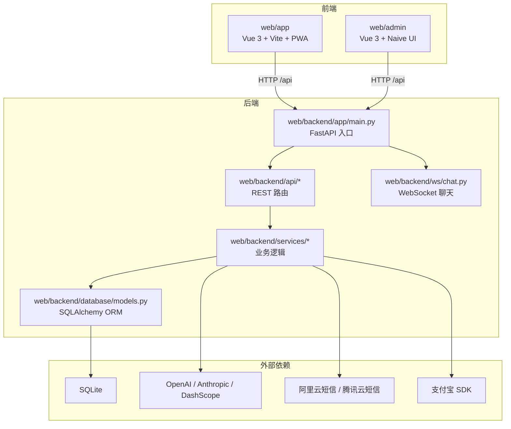
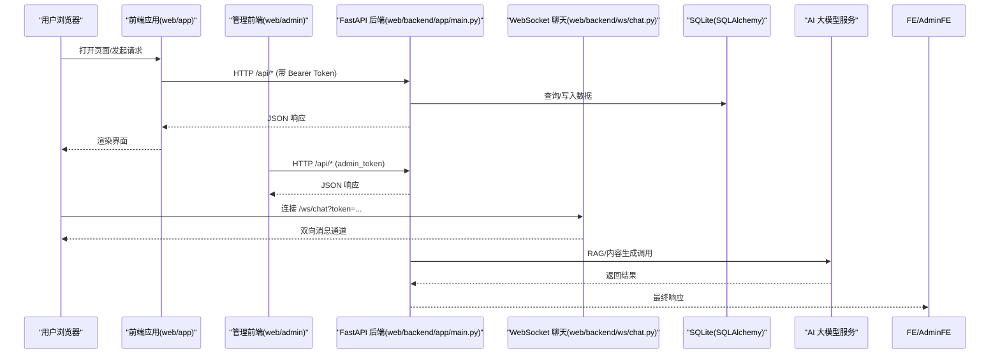
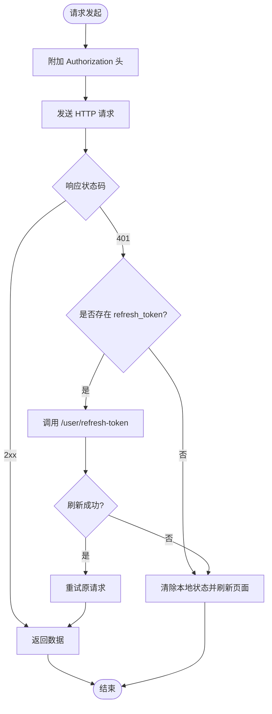
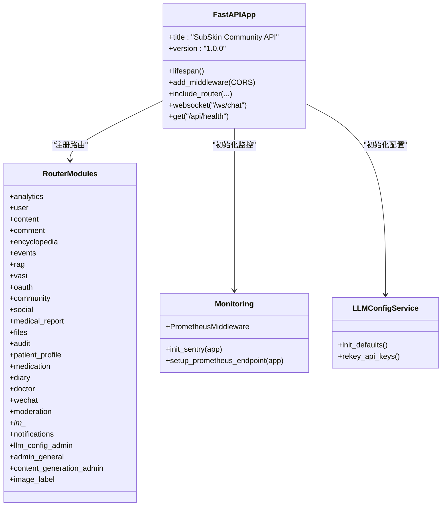
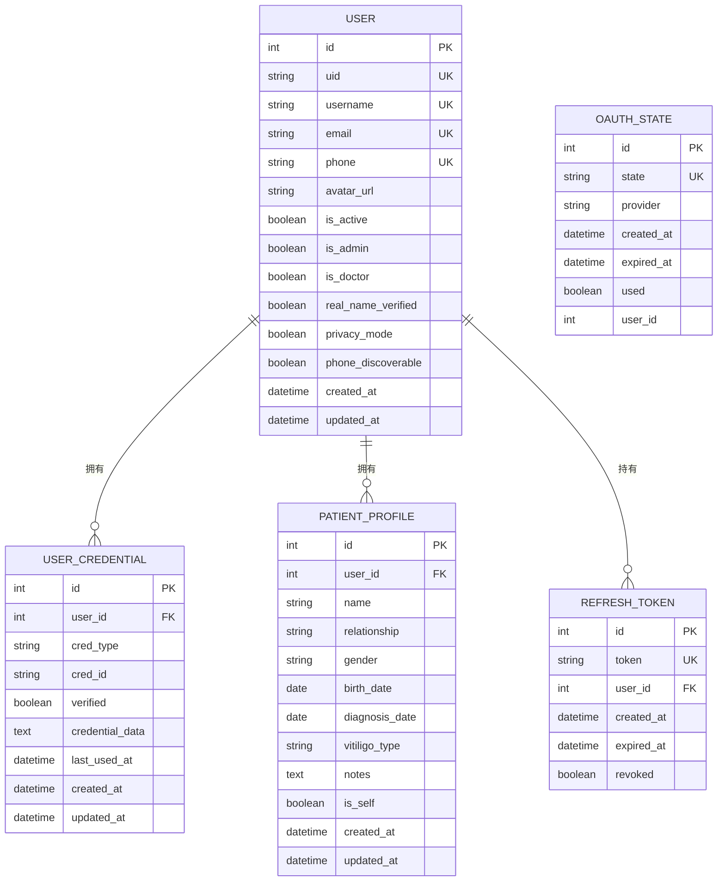
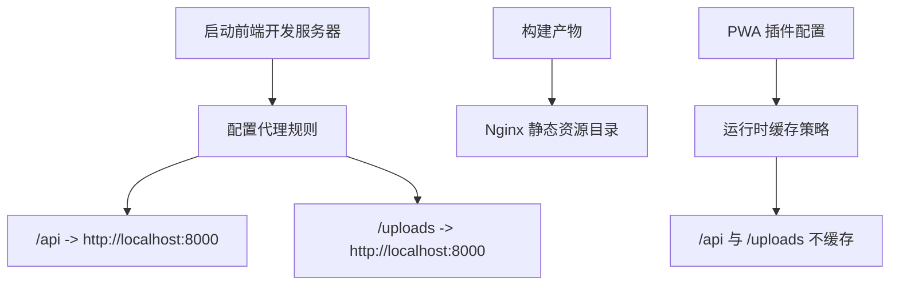
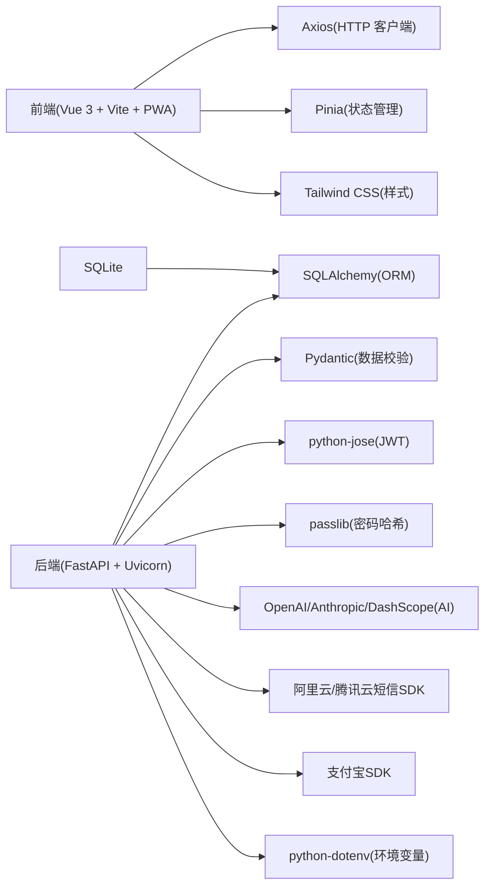
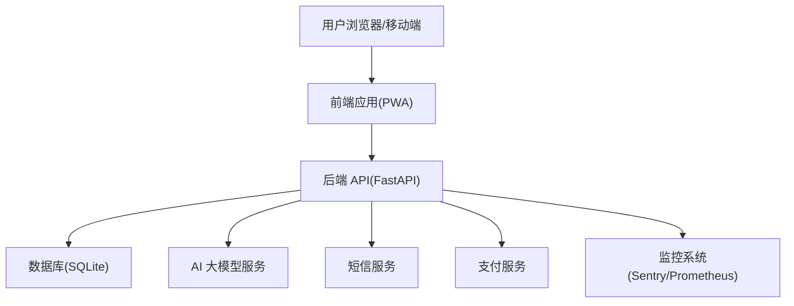

# 整体架构概览

<cite>
**本文引用的文件**   
- [README.md](file://README.md)
- [web/backend/app/main.py](file://web/backend/app/main.py)
- [web/app/vite.config.ts](file://web/app/vite.config.ts)
- [web/admin/vite.config.ts](file://web/admin/vite.config.ts)
- [web/app/src/api/client.ts](file://web/app/src/api/client.ts)
- [web/admin/src/api/request.ts](file://web/admin/src/api/request.ts)
- [web/backend/requirements.txt](file://web/backend/requirements.txt)
- [web/backend/database/models.py](file://web/backend/database/models.py)
</cite>

## 目录
1. [简介](#简介)
2. [项目结构](#项目结构)
3. [核心组件](#核心组件)
4. [架构总览](#架构总览)
5. [详细组件分析](#详细组件分析)
6. [依赖关系分析](#依赖关系分析)
7. [性能考虑](#性能考虑)
8. [故障排查指南](#故障排查指南)
9. [结论](#结论)
10. [附录](#附录)

## 简介
SubSkin 是一个面向白癜风患者与关注者的综合知识平台，采用前后端分离的架构模式：前端为 Vue 3 + TypeScript + Vite（支持 PWA），后端为 FastAPI + Uvicorn，数据库使用 SQLAlchemy + SQLite。系统提供 AI 智能问答、白斑评估（VASI）、社区互动、百科内容、医疗报告解析、数据抓取与定时调度等能力。本文从系统边界、核心组件交互、数据流向、技术选型、约束条件、扩展性与性能优化等方面给出整体架构概览，并配套系统上下文图与组件分解图，帮助读者快速把握全局。

## 项目结构
- 前端应用
  - web/app：用户端 PWA 应用，基于 Vue 3、TypeScript、Vite、Pinia、Tailwind CSS，内置 Service Worker 与版本管理。
  - web/admin：后台管理应用，基于 Vue 3 + Naive UI，独立构建与部署路径。
- 后端服务
  - web/backend：FastAPI 应用，包含路由（api）、业务服务（services）、ORM 模型（database/models）、WebSocket 聊天（ws）等。
- 数据与配置
  - configs：环境与 YAML 配置；data：上传与导出数据；requirements：Python 依赖分组。
- 工具与脚本
  - scripts：运维与数据处理脚本；tests：测试套件；docs：设计与实现文档。

**图表来源** 
- [web/backend/app/main.py:264-349](file://web/backend/app/main.py#L264-L349)
- [web/app/vite.config.ts:96-109](file://web/app/vite.config.ts#L96-L109)
- [web/admin/vite.config.ts:17-26](file://web/admin/vite.config.ts#L17-L26)
- [web/backend/database/models.py:1-200](file://web/backend/database/models.py#L1-L200)

**章节来源**
- [README.md:113-144](file://README.md#L113-L144)
- [web/backend/app/main.py:264-349](file://web/backend/app/main.py#L264-L349)
- [web/app/vite.config.ts:96-109](file://web/app/vite.config.ts#L96-L109)
- [web/admin/vite.config.ts:17-26](file://web/admin/vite.config.ts#L17-L26)

## 核心组件
- 前端 API 客户端
  - 用户端：axios 实例统一 baseURL=/api，自动注入 Authorization 头，集中处理 401 刷新令牌与并发去重。
  - 管理端：独立的 axios 实例，携带 admin_token，401 时清理本地状态。
- 后端 FastAPI 应用
  - 启动生命周期：加载 .env、创建表结构、确保字段存在、注册 CORS、挂载路由、初始化监控（Sentry/Prometheus）、初始化 LLM 配置、健康检查、WebSocket 端点。
  - 路由组织：按功能域拆分 api/*，统一前缀与标签，便于管理与文档生成。
- 数据层
  - ORM 模型：用户、凭证、患者档案、验证码、OAuth 状态、刷新令牌等，配合 Alembic 迁移。
- 外部集成
  - AI 大模型：OpenAI/Anthropic/DashScope 用于 RAG 问答与内容生成。
  - 短信与支付：阿里云/腾讯云短信 SDK，支付宝 SDK。
  - 监控：Sentry 错误追踪，Prometheus 指标采集。

**章节来源**
- [web/app/src/api/client.ts:1-84](file://web/app/src/api/client.ts#L1-L84)
- [web/admin/src/api/request.ts:1-32](file://web/admin/src/api/request.ts#L1-L32)
- [web/backend/app/main.py:264-349](file://web/backend/app/main.py#L264-L349)
- [web/backend/database/models.py:1-200](file://web/backend/database/models.py#L1-L200)
- [web/backend/requirements.txt:1-25](file://web/backend/requirements.txt#L1-L25)

## 架构总览
本系统采用典型的前后端分离架构，前端通过 HTTP 与 WebSocket 与后端通信，后端以 FastAPI 暴露 RESTful API，并通过 SQLAlchemy 访问 SQLite。PWA 特性由 Vite PWA 插件提供，Service Worker 负责资源缓存策略与安全控制（敏感接口与上传文件不缓存）。CORS 在开发/生产环境分别配置允许的源。鉴权采用 JWT Access Token + Refresh Token 机制，前端在 401 时自动刷新令牌。

**图表来源** 
- [web/app/src/api/client.ts:1-84](file://web/app/src/api/client.ts#L1-L84)
- [web/admin/src/api/request.ts:1-32](file://web/admin/src/api/request.ts#L1-L32)
- [web/backend/app/main.py:340-349](file://web/backend/app/main.py#L340-L349)
- [web/backend/database/models.py:1-200](file://web/backend/database/models.py#L1-L200)

## 详细组件分析

### 前端 API 客户端与鉴权流程
- 用户端客户端
  - 统一 baseURL=/api，超时设置为较长（适配 AI 预处理耗时）。
  - 请求拦截器自动附加 Authorization: Bearer token，并在 FormData 上传时移除 Content-Type 以避免边界问题。
  - 响应拦截器处理 401：若存在 refresh_token，则发起刷新请求并去重，成功后重试原请求；否则清除本地状态并刷新页面。
- 管理端客户端
  - 独立实例，携带 admin_token，401 时仅清理本地状态，不强制跳转，等待用户下次操作自然发现已登出。

**图表来源** 
- [web/app/src/api/client.ts:1-84](file://web/app/src/api/client.ts#L1-L84)
- [web/admin/src/api/request.ts:1-32](file://web/admin/src/api/request.ts#L1-L32)

**章节来源**
- [web/app/src/api/client.ts:1-84](file://web/app/src/api/client.ts#L1-L84)
- [web/admin/src/api/request.ts:1-32](file://web/admin/src/api/request.ts#L1-L32)

### 后端 FastAPI 应用与路由组织
- 应用生命周期
  - 启动时加载 .env、创建数据库表、确保必要列存在（如头像 URL、医学报告字段、VASI 字段、图片标注字段、反馈字段等）。
  - 注册 CORS 中间件，允许开发与生产环境的源。
  - 挂载各功能域路由（用户、内容、评论、百科、事件、RAG、VASI、OAuth、社区、社交、体检报告、文件、审计、白友档案、用药提醒、医生认证、微信、内容审核、IM、通知、LLM 配置、通用管理、内容生成管理、图片打标管理等）。
  - 初始化监控（Sentry、可选 Prometheus），初始化 LLM 配置并执行密钥重加密。
  - 暴露健康检查端点 /api/health 与 WebSocket 聊天端点 /ws/chat。
- 路由与标签
  - 每个模块路由均带有 prefix 与 tags，便于 API 文档分类与前端调用约定。

**图表来源** 
- [web/backend/app/main.py:264-349](file://web/backend/app/main.py#L264-L349)

**章节来源**
- [web/backend/app/main.py:264-349](file://web/backend/app/main.py#L264-L349)

### 数据层与模型关系
- 核心实体
  - 用户（User）：基本信息、认证标识、隐私设置、默认档案关联、状态与违规计数等。
  - 用户凭证（UserCredential）：多类型登录凭证（邮箱、手机、第三方 OAuth）。
  - 患者档案（PatientProfile）：用户下的多个档案（本人、父母、伴侣等），用于跟踪与报告。
  - 验证码与 OAuth 状态：短信/邮箱验证码、OAuth CSRF 防护状态。
  - 刷新令牌（RefreshToken）：用于无感续期。
- 关系与索引
  - 用户与档案一对多；凭证与用户一对一或多对一；时间戳与唯一性约束保障一致性与查询性能。

**图表来源** 
- [web/backend/database/models.py:1-200](file://web/backend/database/models.py#L1-L200)

**章节来源**
- [web/backend/database/models.py:1-200](file://web/backend/database/models.py#L1-L200)

### 前端构建与代理配置
- 用户端（web/app）
  - Vite 构建输出到 Nginx 指定目录，启用 PWA 插件，定义 manifest、图标、缓存策略（敏感 API 与上传文件 NetworkOnly）。
  - 开发服务器端口 5174，代理 /api 与 /uploads 到后端 localhost:8000。
- 管理端（web/admin）
  - 构建输出到 Nginx 指定目录，开发服务器端口 5174，代理 /api 到后端 localhost:8000。

**图表来源** 
- [web/app/vite.config.ts:96-109](file://web/app/vite.config.ts#L96-L109)
- [web/admin/vite.config.ts:17-26](file://web/admin/vite.config.ts#L17-L26)

**章节来源**
- [web/app/vite.config.ts:96-109](file://web/app/vite.config.ts#L96-L109)
- [web/admin/vite.config.ts:17-26](file://web/admin/vite.config.ts#L17-L26)

## 依赖关系分析
- 前端依赖
  - Vue 3、TypeScript、Vite、Pinia、Tailwind CSS、Axios、RemixIcon、PWA 插件。
- 后端依赖
  - FastAPI、Uvicorn、SQLAlchemy、Pydantic、JWT、Passlib、Alembic、OpenAI、Requests、短信与支付 SDK、dotenv。
- 运行依赖
  - SQLite（轻量级数据库）、Nginx（反向代理与静态资源托管）、Docker（容器化部署）。

**图表来源** 
- [web/backend/requirements.txt:1-25](file://web/backend/requirements.txt#L1-L25)
- [web/app/vite.config.ts:1-10](file://web/app/vite.config.ts#L1-L10)
- [web/admin/vite.config.ts:1-10](file://web/admin/vite.config.ts#L1-L10)

**章节来源**
- [web/backend/requirements.txt:1-25](file://web/backend/requirements.txt#L1-L25)
- [web/app/vite.config.ts:1-10](file://web/app/vite.config.ts#L1-L10)
- [web/admin/vite.config.ts:1-10](file://web/admin/vite.config.ts#L1-L10)

## 性能考虑
- 前端
  - PWA 缓存策略：对敏感 API 与上传文件禁用缓存，避免跨用户数据泄露；静态资源按需缓存，提升首屏与离线体验。
  - 长超时：AI 预处理可能耗时较长，前端超时设置为 120 秒，避免误判失败。
  - 并发刷新：401 刷新令牌使用单例 Promise 去重，减少重复请求。
- 后端
  - 异步生命周期：后台任务（临时文件清理、刷新令牌清理）使用 asyncio 任务，避免阻塞主循环。
  - 监控与可观测性：Sentry 错误追踪与可选 Prometheus 指标采集，便于定位瓶颈与异常。
  - 数据库：SQLite 适合小规模与单机部署；复杂查询可通过 Alembic 添加索引与优化模型关系。
- 部署
  - Nginx 反向代理与静态资源托管，结合 Docker 容器化，便于水平扩展与灰度发布。

[本节为通用指导，不直接分析具体文件]

## 故障排查指南
- 前端 401 未刷新或反复刷新
  - 检查 localStorage 中是否存在 refresh_token；确认 /user/refresh-token 接口可用；查看网络面板是否出现并发刷新。
- 文件上传 422
  - 确认 FormData 上传时未设置 Content-Type，交由浏览器自动设置 boundary。
- 后端启动报错或缺失列
  - 检查启动时的 ensure_* 函数日志，确认数据库迁移与列存在；查看 alembic 迁移历史。
- CORS 跨域失败
  - 检查 ALLOWED_ORIGINS 环境变量与 APP_ENV；开发环境需包含 localhost 端口。
- WebSocket 连接失败
  - 检查 /ws/chat 端点与 token 参数；确认防火墙与代理配置。

**章节来源**
- [web/app/src/api/client.ts:1-84](file://web/app/src/api/client.ts#L1-L84)
- [web/backend/app/main.py:264-349](file://web/backend/app/main.py#L264-L349)

## 结论
SubSkin 采用清晰的前后端分离架构，前端以 Vue 3 + PWA 提供良好用户体验，后端以 FastAPI 暴露模块化 API，数据层通过 SQLAlchemy + SQLite 管理。鉴权采用 JWT + Refresh Token，监控与可观测性完善，部署与代理配置成熟。系统在扩展性上具备微服务思想的基础（模块化路由与服务拆分），在性能上通过 PWA 缓存策略与异步任务优化。未来可在数据层引入更强大的数据库、在后端引入消息队列与缓存层，进一步提升可扩展性与吞吐能力。

[本节为总结性内容，不直接分析具体文件]

## 附录
- 系统上下文图（概念）

[此图为概念性展示，不映射具体源码文件]