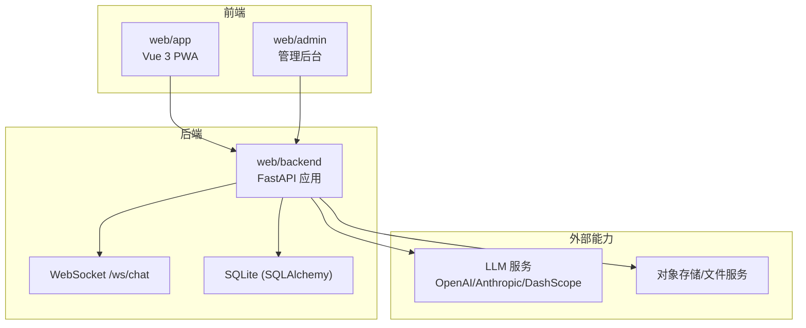
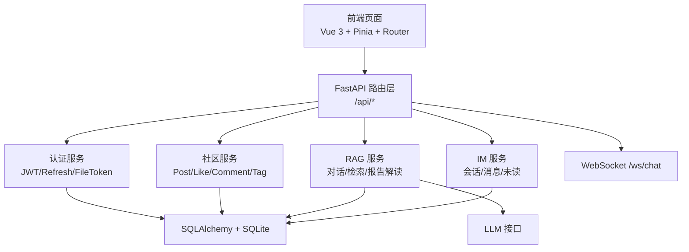
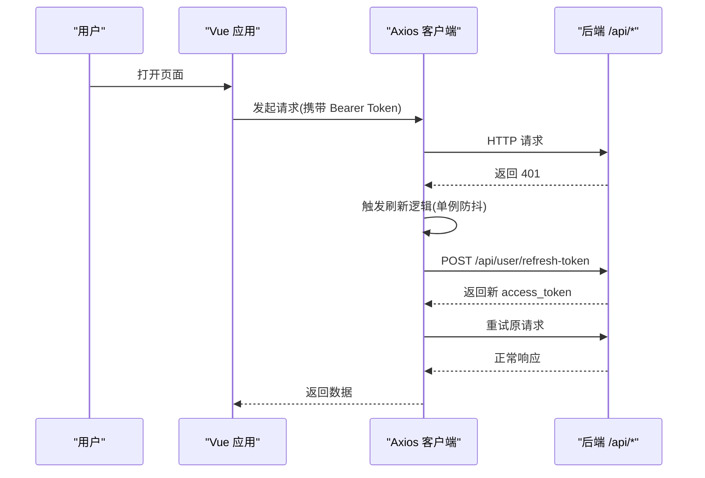
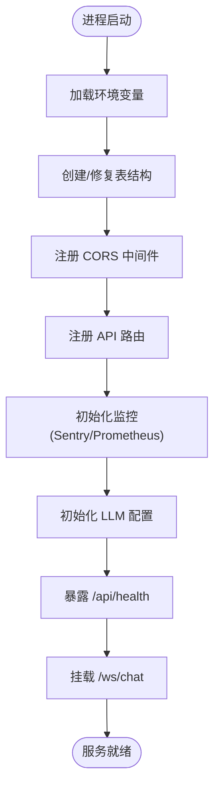
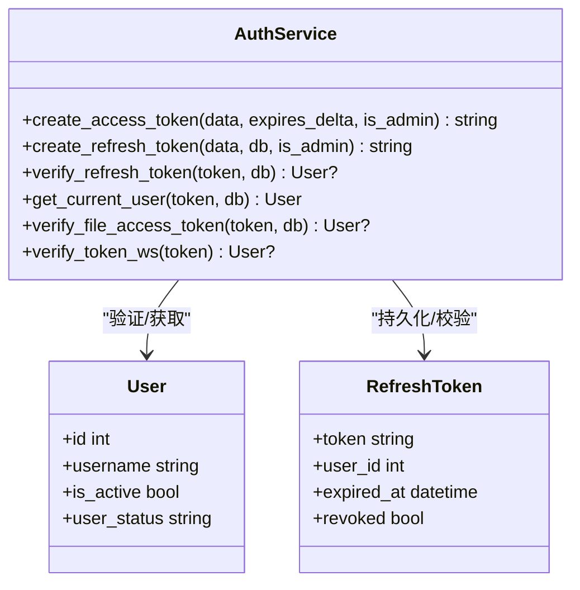
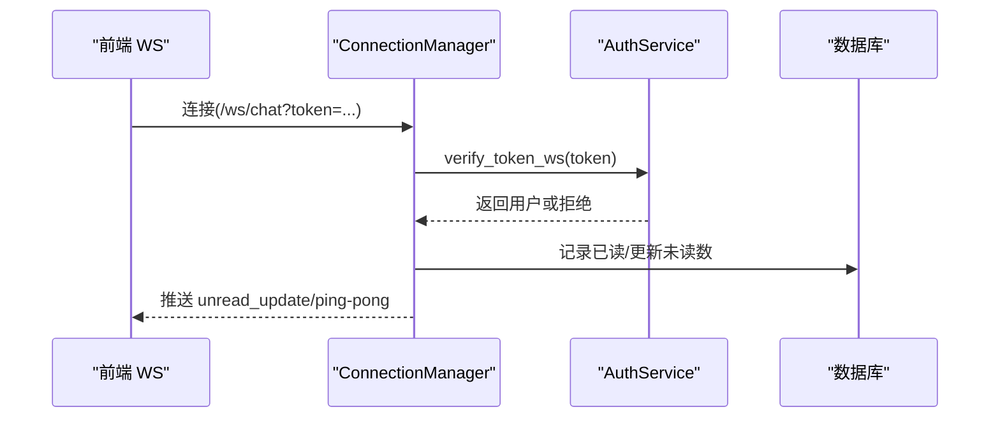
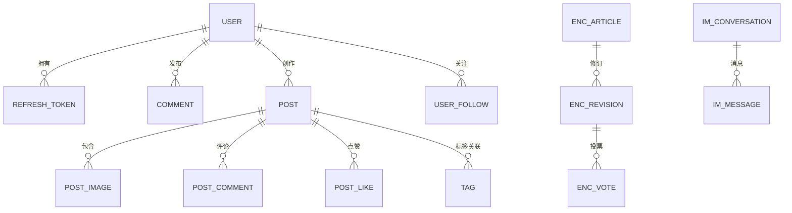
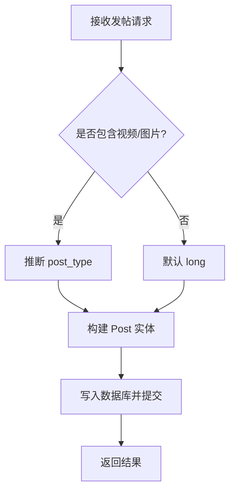
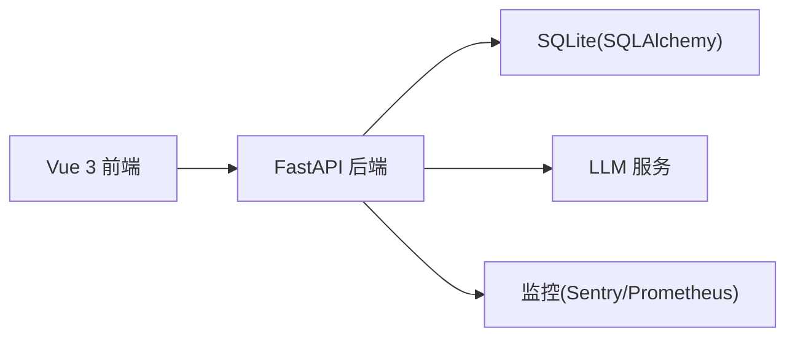

# 架构设计

<cite>
**本文引用的文件**   
- [README.md](file://README.md)
- [PROJECT_FRAMEWORK.md](file://PROJECT_FRAMEWORK.md)
- [web/backend/app/main.py](file://web/backend/app/main.py)
- [web/backend/database/database.py](file://web/backend/database/database.py)
- [web/backend/database/models.py](file://web/backend/database/models.py)
- [web/backend/services/auth.py](file://web/backend/services/auth.py)
- [web/backend/ws/chat.py](file://web/backend/ws/chat.py)
- [web/app/src/main.ts](file://web/app/src/main.ts)
- [web/admin/src/main.ts](file://web/admin/src/main.ts)
- [web/app/src/router/index.ts](file://web/app/src/router/index.ts)
- [web/app/src/stores/auth.ts](file://web/app/src/stores/auth.ts)
- [web/app/src/api/client.ts](file://web/app/src/api/client.ts)
- [web/backend/services/community.py](file://web/backend/services/community.py)
- [web/backend/services/rag.py](file://web/backend/services/rag.py)
- [web/backend/services/im_service.py](file://web/backend/services/im_service.py)
</cite>

## 目录
1. [引言](#引言)
2. [项目结构](#项目结构)
3. [核心组件](#核心组件)
4. [架构总览](#架构总览)
5. [详细组件分析](#详细组件分析)
6. [依赖关系分析](#依赖关系分析)
7. [性能考量](#性能考量)
8. [故障排查指南](#故障排查指南)
9. [结论](#结论)
10. [附录](#附录)

## 引言
本文件为 SubSkin 项目的全面架构设计文档，面向前后端分离、分层架构与微服务思想的应用实践。内容覆盖：
- 前端 Vue 3 PWA 应用结构与路由、状态管理、API 客户端
- 后端 FastAPI 服务组织、认证鉴权、WebSocket 实时通信
- 数据库 ORM 设计与数据模型
- 系统边界、组件交互、数据流向图与集成模式
- 技术选型决策、架构约束与扩展性考虑

## 项目结构
SubSkin 由两大子系统构成：
- 数据 Pipeline（src/）：自动化采集、AI 翻译、摘要生成与导出
- 社区 Web App（web/）：Vue 3 前端 + FastAPI 后端

图表来源
- [web/backend/app/main.py:264-349](file://web/backend/app/main.py#L264-L349)
- [web/backend/database/database.py:1-46](file://web/backend/database/database.py#L1-L46)

章节来源
- [README.md:113-144](file://README.md#L113-L144)
- [PROJECT_FRAMEWORK.md:12-44](file://PROJECT_FRAMEWORK.md#L12-L44)

## 核心组件
- 前端入口与路由
  - 应用初始化：[web/app/src/main.ts:1-11](file://web/app/src/main.ts#L1-L11)、[web/admin/src/main.ts:1-14](file://web/admin/src/main.ts#L1-L14)
  - 路由定义：[web/app/src/router/index.ts:1-155](file://web/app/src/router/index.ts#L1-L155)
- 后端主应用与生命周期
  - FastAPI 启动、中间件、路由注册、健康检查、WS 挂载：[web/backend/app/main.py:264-349](file://web/backend/app/main.py#L264-L349)
- 认证与鉴权
  - JWT 签发/校验、刷新令牌、文件访问令牌、WebSocket 鉴权：[web/backend/services/auth.py:1-309](file://web/backend/services/auth.py#L1-L309)
- WebSocket 实时通信
  - 连接管理、消息回执、未读数广播：[web/backend/ws/chat.py:1-111](file://web/backend/ws/chat.py#L1-L111)
- 数据库配置与模型
  - 引擎与会话、Base 定义：[web/backend/database/database.py:1-46](file://web/backend/database/database.py#L1-L46)
  - 领域模型（用户、帖子、评论、百科、IM 等）：[web/backend/database/models.py:1-800](file://web/backend/database/models.py#L1-L800)
- 业务服务层
  - 社区服务（发帖、标签、收藏、版本、互动日志）：[web/backend/services/community.py:1-200](file://web/backend/services/community.py#L1-L200)
  - RAG 问答服务（对话、检索、报告解读）：[web/backend/services/rag.py:1-200](file://web/backend/services/rag.py#L1-L200)
  - IM 即时通讯服务（会话、消息、未读计数）：[web/backend/services/im_service.py:1-200](file://web/backend/services/im_service.py#L1-L200)
- 前端状态与 API 客户端
  - 认证状态与 Token 刷新：[web/app/src/stores/auth.ts:1-259](file://web/app/src/stores/auth.ts#L1-L259)
  - Axios 拦截器与自动重试：[web/app/src/api/client.ts:1-84](file://web/app/src/api/client.ts#L1-L84)

章节来源
- [web/app/src/main.ts:1-11](file://web/app/src/main.ts#L1-L11)
- [web/admin/src/main.ts:1-14](file://web/admin/src/main.ts#L1-L14)
- [web/app/src/router/index.ts:1-155](file://web/app/src/router/index.ts#L1-L155)
- [web/backend/app/main.py:264-349](file://web/backend/app/main.py#L264-L349)
- [web/backend/services/auth.py:1-309](file://web/backend/services/auth.py#L1-L309)
- [web/backend/ws/chat.py:1-111](file://web/backend/ws/chat.py#L1-L111)
- [web/backend/database/database.py:1-46](file://web/backend/database/database.py#L1-L46)
- [web/backend/database/models.py:1-800](file://web/backend/database/models.py#L1-L800)
- [web/backend/services/community.py:1-200](file://web/backend/services/community.py#L1-L200)
- [web/backend/services/rag.py:1-200](file://web/backend/services/rag.py#L1-L200)
- [web/backend/services/im_service.py:1-200](file://web/backend/services/im_service.py#L1-L200)
- [web/app/src/stores/auth.ts:1-259](file://web/app/src/stores/auth.ts#L1-L259)
- [web/app/src/api/client.ts:1-84](file://web/app/src/api/client.ts#L1-L84)

## 架构总览
采用“展示层—应用层—数据层—AI 层”的分层架构，前后端通过 REST/WS 解耦，服务按职责划分（认证、社区、RAG、VASI、IM、医疗报告等），体现微服务思想中的“单一职责与可替换”。

图表来源
- [web/backend/app/main.py:264-349](file://web/backend/app/main.py#L264-L349)
- [web/backend/services/auth.py:1-309](file://web/backend/services/auth.py#L1-L309)
- [web/backend/services/community.py:1-200](file://web/backend/services/community.py#L1-L200)
- [web/backend/services/rag.py:1-200](file://web/backend/services/rag.py#L1-L200)
- [web/backend/services/im_service.py:1-200](file://web/backend/services/im_service.py#L1-L200)
- [web/backend/database/database.py:1-46](file://web/backend/database/database.py#L1-L46)

## 详细组件分析

### 前端应用结构（Vue 3 PWA）
- 入口与插件
  - 创建应用、注入 Pinia、Router、样式与图标库
- 路由与页面
  - 以模块化的路由表组织各功能页（助手、评估、社区、百科、IM、个人中心等）
- 状态管理与认证
  - 本地持久化 token/user，登录/注册/绑定/密码重置流程
  - 自动刷新短效文件令牌，避免长时会话泄露风险
- API 客户端
  - 统一 baseURL、超时设置、请求头注入 Authorization
  - 响应拦截器处理 401 并去重刷新 token，失败则清理本地状态并重载

图表来源
- [web/app/src/api/client.ts:1-84](file://web/app/src/api/client.ts#L1-L84)
- [web/app/src/stores/auth.ts:1-259](file://web/app/src/stores/auth.ts#L1-L259)

章节来源
- [web/app/src/main.ts:1-11](file://web/app/src/main.ts#L1-L11)
- [web/app/src/router/index.ts:1-155](file://web/app/src/router/index.ts#L1-L155)
- [web/app/src/stores/auth.ts:1-259](file://web/app/src/stores/auth.ts#L1-L259)
- [web/app/src/api/client.ts:1-84](file://web/app/src/api/client.ts#L1-L84)

### 后端服务组织（FastAPI）
- 应用启动与生命周期
  - 加载 .env、创建表、确保字段存在、注册 CORS、挂载路由、初始化监控与 LLM 配置
- 路由与标签
  - 按领域分组路由前缀与标签，便于 OpenAPI 文档与前端调用
- 健康检查与 WS
  - /api/health 健康探针；/ws/chat 建立实时通道

图表来源
- [web/backend/app/main.py:1-349](file://web/backend/app/main.py#L1-L349)

章节来源
- [web/backend/app/main.py:1-349](file://web/backend/app/main.py#L1-L349)

### 认证与鉴权（JWT + Refresh + File Token）
- 访问令牌：短时效，包含用户标识与角色信息
- 刷新令牌：服务端持久化，支持撤销与过期清理
- 文件访问令牌：仅用于文件读取，作用域受限且短效
- WebSocket 鉴权：从查询参数解析 token 并校验用户状态

图表来源
- [web/backend/services/auth.py:1-309](file://web/backend/services/auth.py#L1-L309)
- [web/backend/database/models.py:75-154](file://web/backend/database/models.py#L75-L154)

章节来源
- [web/backend/services/auth.py:1-309](file://web/backend/services/auth.py#L1-L309)
- [web/backend/database/models.py:75-154](file://web/backend/database/models.py#L75-L154)

### WebSocket 实时通信机制
- 连接管理：维护活跃连接映射，支持断线清理
- 消息处理：心跳 ping/pong、已读回执、未读数广播
- 权限控制：基于 token 校验用户身份与状态

图表来源
- [web/backend/ws/chat.py:1-111](file://web/backend/ws/chat.py#L1-L111)
- [web/backend/services/auth.py:257-283](file://web/backend/services/auth.py#L257-L283)

章节来源
- [web/backend/ws/chat.py:1-111](file://web/backend/ws/chat.py#L1-L111)
- [web/backend/services/auth.py:257-283](file://web/backend/services/auth.py#L257-L283)

### 数据库 ORM 设计
- 引擎与会话：SQLite 使用 NullPool 避免并发锁争用导致的线程阻塞
- 模型设计：用户、凭证、患者档案、事件追踪、社区内容、百科、审计日志、IM 等
- 索引与约束：高频查询字段建索引，唯一约束防止重复操作（如点赞、书签）

图表来源
- [web/backend/database/models.py:88-800](file://web/backend/database/models.py#L88-L800)

章节来源
- [web/backend/database/database.py:1-46](file://web/backend/database/database.py#L1-L46)
- [web/backend/database/models.py:1-800](file://web/backend/database/models.py#L1-L800)

### 社区服务（发帖、互动、版本、收藏）
- 发帖：支持图文/视频/长文/治疗分享，自动提取预览文本与类型推断
- 权限：私有帖与审核状态控制可见性
- 结构化数据：标签、音频、附件、版本历史、收藏与书签、互动日志

图表来源
- [web/backend/services/community.py:136-200](file://web/backend/services/community.py#L136-L200)

章节来源
- [web/backend/services/community.py:1-200](file://web/backend/services/community.py#L1-L200)

### RAG 问答服务（对话、检索、报告解读）
- 多轮对话：会话与消息持久化
- 知识库检索：结合文档与向量存储（预留扩展点）
- 体检报告解读：关键词分类、指标抽取、通俗解读与免责声明

章节来源
- [web/backend/services/rag.py:1-200](file://web/backend/services/rag.py#L1-L200)

### IM 即时通讯服务（会话、消息、未读）
- 会话管理：私聊会话创建与成员管理，拉黑保护
- 消息序列化：发送者、时间戳、撤回标记
- 未读计数：基于 last_read_at 计算，支持广播

章节来源
- [web/backend/services/im_service.py:1-200](file://web/backend/services/im_service.py#L1-L200)

## 依赖关系分析
- 前端依赖
  - Vue 3、Pinia、Router、Tailwind、RemixIcon、Three.js（3D）
- 后端依赖
  - FastAPI、Uvicorn、SQLAlchemy、Pydantic、JWT、Passlib、OpenAI/第三方 LLM
- 部署与环境
  - Docker、Nginx、SQLite（开发/单机）、可选 Prometheus/Sentry

图表来源
- [PROJECT_FRAMEWORK.md:101-112](file://PROJECT_FRAMEWORK.md#L101-L112)
- [web/backend/app/main.py:321-333](file://web/backend/app/main.py#L321-L333)

章节来源
- [PROJECT_FRAMEWORK.md:101-112](file://PROJECT_FRAMEWORK.md#L101-L112)

## 性能考量
- 数据库连接池
  - SQLite 使用 NullPool，避免 QueuePool 在高并发下耗尽导致的全局冻结
  - 写锁等待 timeout 提升至 15s，降低 database is locked 概率
- 前端请求优化
  - Axios 超时 120s，适配 AI 预处理耗时
  - 401 刷新 token 使用单例 Promise 去重，减少并发刷新风暴
- 文件访问令牌
  - 短效、作用域受限，降低泄露影响面
- 缓存与离线
  - PWA 与服务 Worker 提供离线能力与运行时缓存

章节来源
- [web/backend/database/database.py:1-46](file://web/backend/database/database.py#L1-L46)
- [web/app/src/api/client.ts:1-84](file://web/app/src/api/client.ts#L1-L84)
- [web/app/src/stores/auth.ts:1-259](file://web/app/src/stores/auth.ts#L1-L259)

## 故障排查指南
- 认证相关
  - 401 未授权：检查 token 是否存在、是否过期、是否被撤销；确认 refresh token 有效
  - 账号封禁：后端会返回特定 403 提示，前端需引导重新登录
- WebSocket
  - 连接失败：检查 token 合法性与用户状态；查看服务端日志中 WS 错误
  - 未读数不更新：确认 read 事件是否正确上报，数据库 ImMessageRead 写入是否成功
- 数据库
  - database is locked：检查并发写场景与超时配置；必要时限流或拆分写任务
- 监控与日志
  - 启用 Sentry 与 Prometheus，定位异常与性能瓶颈

章节来源
- [web/backend/services/auth.py:198-252](file://web/backend/services/auth.py#L198-L252)
- [web/backend/ws/chat.py:102-111](file://web/backend/ws/chat.py#L102-L111)
- [web/backend/database/database.py:19-32](file://web/backend/database/database.py#L19-L32)
- [web/backend/app/main.py:321-333](file://web/backend/app/main.py#L321-L333)

## 结论
SubSkin 采用清晰的前后端分离与分层架构，服务按职责解耦，具备可扩展性与可维护性。通过 JWT/Refresh/FileToken 的精细化鉴权、SQLite 的高可用连接策略、PWA 与 WebSocket 的实时体验，满足医疗知识平台对安全、稳定与用户体验的要求。未来可在向量检索、推荐算法、IM 群聊与多租户等方面持续演进。

## 附录
- 技术选型决策参考
  - 前端：Vue 3 + Vite + Tailwind + Three.js
  - 后端：FastAPI + Uvicorn + SQLAlchemy + SQLite
  - 认证：JWT + Refresh Token + OAuth（微信/支付宝）
  - 部署：Docker + Nginx
- 数据隐私分级
  - L4 极高：密码、JWT Token
  - L3 高：手机号、邮箱、病情图片
  - L2 中：昵称、头像、帖子内容
  - L1 低：百科内容、统计数据

章节来源
- [PROJECT_FRAMEWORK.md:92-112](file://PROJECT_FRAMEWORK.md#L92-L112)