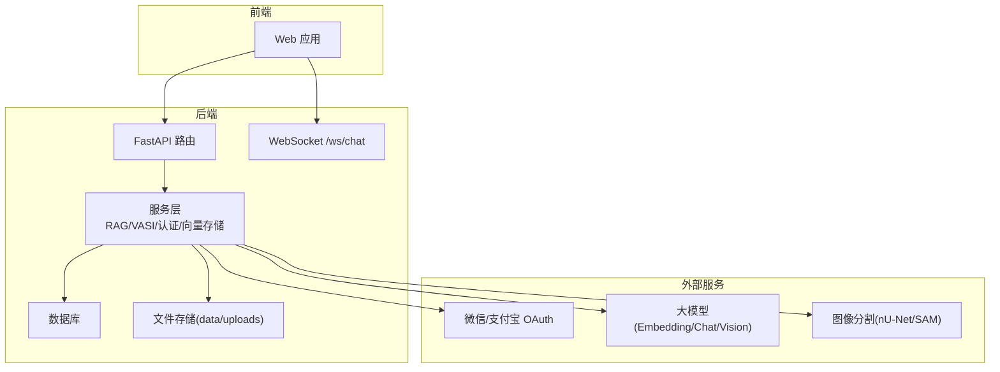
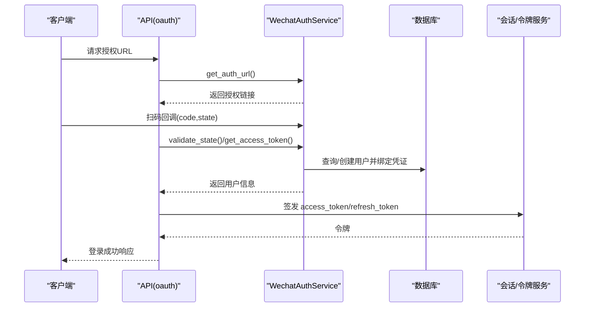
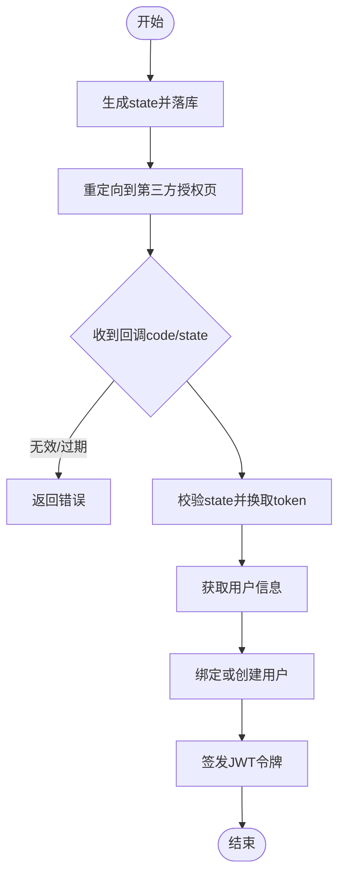
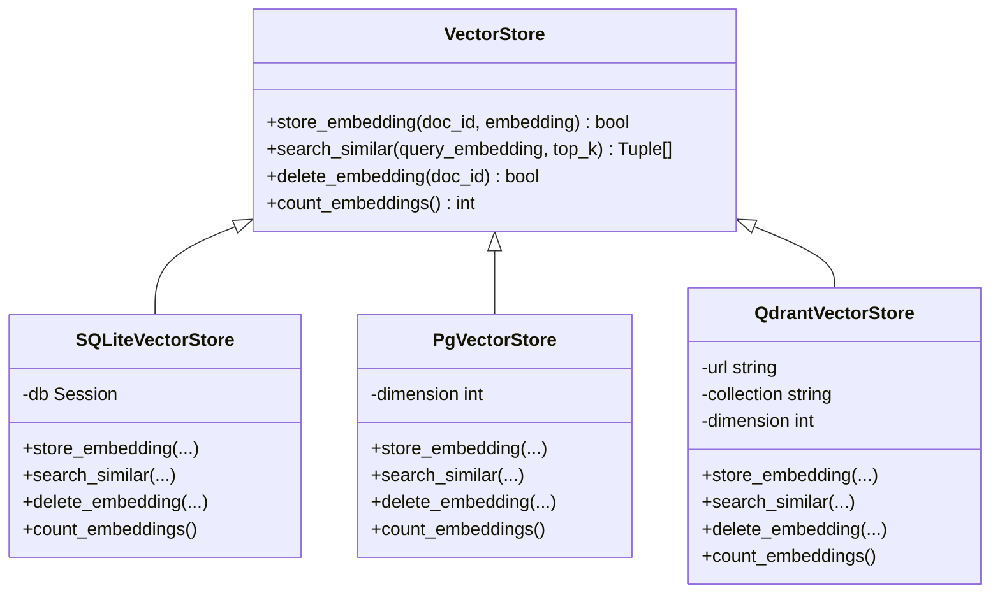
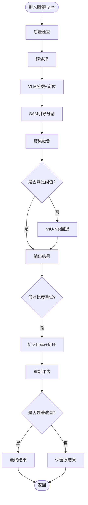
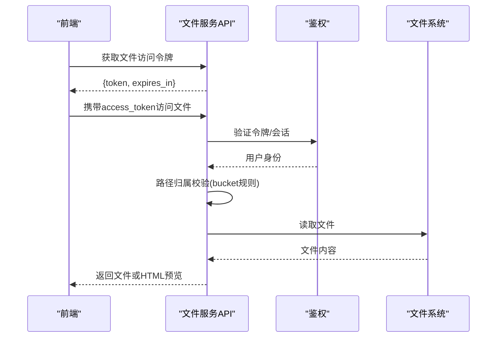
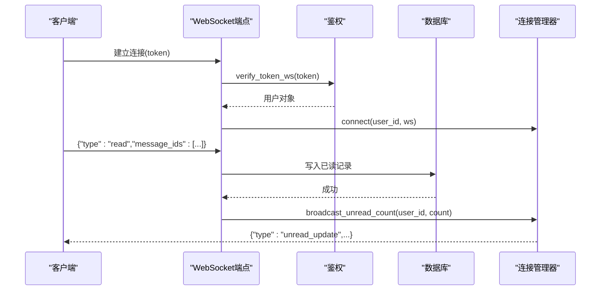
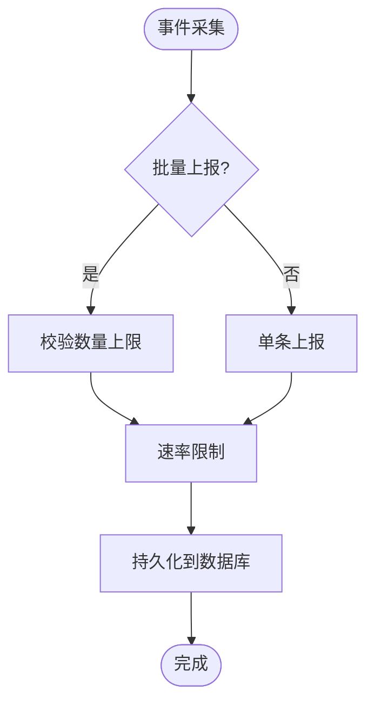
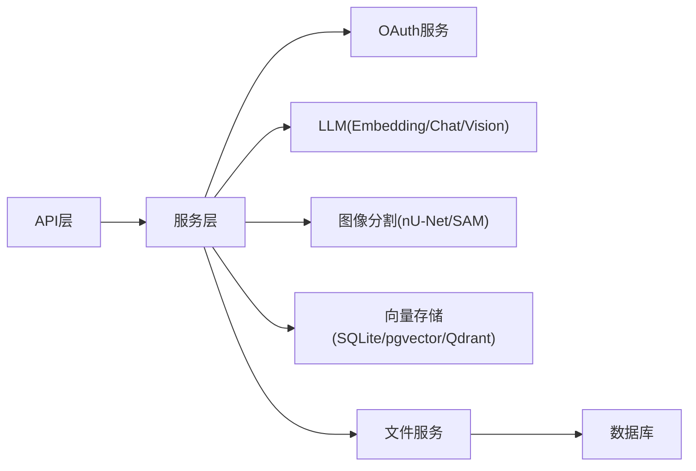

# 集成模式设计

<cite>
**本文引用的文件**
- [web/backend/api/oauth.py](file://web/backend/api/oauth.py)
- [web/backend/services/wechat_auth.py](file://web/backend/services/wechat_auth.py)
- [web/backend/services/alipay_auth.py](file://web/backend/services/alipay_auth.py)
- [web/backend/ws/chat.py](file://web/backend/ws/chat.py)
- [web/backend/services/rag.py](file://web/backend/services/rag.py)
- [web/backend/services/vector_store.py](file://web/backend/services/vector_store.py)
- [web/backend/api/files.py](file://web/backend/api/files.py)
- [web/backend/services/vasi.py](file://web/backend/services/vasi.py)
- [web/backend/services/vasi_segmentation.py](file://web/backend/services/vasi_segmentation.py)
- [web/backend/app/main.py](file://web/backend/app/main.py)
- [src/utils/rate_limiter.py](file://src/utils/rate_limiter.py)
- [src/crawlers/pubmed_fulltext.py](file://src/crawlers/pubmed_fulltext.py)
- [web/backend/api/events.py](file://web/backend/api/events.py)
- [web/backend/exceptions.py](file://web/backend/exceptions.py)
</cite>

## 目录
1. [引言](#引言)
2. [项目结构](#项目结构)
3. [核心组件](#核心组件)
4. [架构总览](#架构总览)
5. [详细组件分析](#详细组件分析)
6. [依赖关系分析](#依赖关系分析)
7. [性能与可靠性](#性能与可靠性)
8. [故障排查指南](#故障排查指南)
9. [结论](#结论)
10. [附录](#附录)

## 引言
本设计文档面向 Subskin 项目的“外部服务集成”主题，聚焦以下目标：
- 第三方认证（OAuth）集成策略与流程
- AI 服务集成（RAG、图像分割 VASI）的调用模式与降级策略
- 文件存储服务的鉴权与访问控制
- WebSocket 实时通信协议与事件驱动架构
- 异步任务处理、错误处理、重试与熔断降级方案
- 提供集成架构图与关键时序图，便于理解端到端数据流

## 项目结构
后端采用 FastAPI 模块化组织：
- API 层：REST 接口（如 OAuth、文件、事件、聊天等）
- 服务层：业务逻辑与外部服务封装（RAG、VASI、向量存储、认证等）
- WebSocket：实时消息通道
- 工具与中间件：限流、日志、异常、配置等

图表来源
- [web/backend/app/main.py:264-278](file://web/backend/app/main.py#L264-L278)
- [web/backend/api/oauth.py:1-36](file://web/backend/api/oauth.py#L1-L36)
- [web/backend/ws/chat.py:14-51](file://web/backend/ws/chat.py#L14-L51)
- [web/backend/services/rag.py:354-384](file://web/backend/services/rag.py#L354-L384)
- [web/backend/services/vasi.py:602-609](file://web/backend/services/vasi.py#L602-L609)
- [web/backend/services/vasi_segmentation.py:600-630](file://web/backend/services/vasi_segmentation.py#L600-L630)

章节来源
- [web/backend/app/main.py:264-278](file://web/backend/app/main.py#L264-L278)

## 核心组件
- OAuth 认证：统一入口与状态管理，对接微信/支付宝开放平台
- RAG 智能问答：混合检索（向量+关键词），支持多后端向量存储
- VASI 评估：质量检查→预处理→VLM定位→SAM引导→nnU-Net回退→Mock兜底
- 文件服务：短令牌鉴权、路径归属校验、安全预览
- WebSocket：连接管理、读回执、未读数广播
- 事件追踪：批量上报、速率限制、隐私脱敏
- 限流与重试：令牌桶限流、指数退避重试

章节来源
- [web/backend/api/oauth.py:1-36](file://web/backend/api/oauth.py#L1-L36)
- [web/backend/services/wechat_auth.py:25-156](file://web/backend/services/wechat_auth.py#L25-L156)
- [web/backend/services/alipay_auth.py:1-39](file://web/backend/services/alipay_auth.py#L1-L39)
- [web/backend/services/rag.py:354-384](file://web/backend/services/rag.py#L354-L384)
- [web/backend/services/vector_store.py:25-110](file://web/backend/services/vector_store.py#L25-L110)
- [web/backend/services/vasi.py:602-609](file://web/backend/services/vasi.py#L602-L609)
- [web/backend/services/vasi_segmentation.py:600-630](file://web/backend/services/vasi_segmentation.py#L600-L630)
- [web/backend/ws/chat.py:14-51](file://web/backend/ws/chat.py#L14-L51)
- [web/backend/api/events.py:40-112](file://web/backend/api/events.py#L40-L112)
- [src/utils/rate_limiter.py:10-81](file://src/utils/rate_limiter.py#L10-L81)
- [src/crawlers/pubmed_fulltext.py:154-182](file://src/crawlers/pubmed_fulltext.py#L154-L182)

## 架构总览
Subskin 的后端通过 FastAPI 暴露 REST 与 WebSocket 接口，服务层封装对第三方服务（OAuth、LLM、图像分割）的调用。RAG 使用向量存储抽象层，可切换 SQLite/pgvector/Qdrant。文件服务基于本地存储并实现细粒度权限控制。整体遵循“接口薄、服务厚、外部依赖隔离”的原则。

图表来源
- [web/backend/api/oauth.py:25-36](file://web/backend/api/oauth.py#L25-L36)
- [web/backend/services/wechat_auth.py:36-151](file://web/backend/services/wechat_auth.py#L36-L151)

章节来源
- [web/backend/api/oauth.py:1-36](file://web/backend/api/oauth.py#L1-L36)
- [web/backend/services/wechat_auth.py:25-156](file://web/backend/services/wechat_auth.py#L25-L156)

## 详细组件分析

### OAuth 认证集成（微信/支付宝）
- 统一入口：API 路由负责生成授权 URL、处理回调、签发令牌
- 微信：生成 state、校验 state、换取 access_token、获取用户信息、自动注册/绑定
- 支付宝：类似流程，读取环境变量配置，构造授权与回调参数
- 安全要点：state 过期时间、CSRF 防护、最小权限绑定

图表来源
- [web/backend/services/wechat_auth.py:54-151](file://web/backend/services/wechat_auth.py#L54-L151)
- [web/backend/services/alipay_auth.py:34-39](file://web/backend/services/alipay_auth.py#L34-L39)
- [web/backend/api/oauth.py:25-36](file://web/backend/api/oauth.py#L25-L36)

章节来源
- [web/backend/api/oauth.py:1-36](file://web/backend/api/oauth.py#L1-L36)
- [web/backend/services/wechat_auth.py:25-156](file://web/backend/services/wechat_auth.py#L25-L156)
- [web/backend/services/alipay_auth.py:1-39](file://web/backend/services/alipay_auth.py#L1-L39)

### RAG 智能问答与向量存储
- 检索策略：优先向量检索，失败或无配置时回退关键词检索；合并去重并按综合得分排序
- Embedding：通过 LLM 配置获取 provider/model/dimensions，调用 OpenAI 兼容接口
- 向量存储：SQLite（默认）、pgvector（预留）、Qdrant（可选），统一抽象接口
- 提示词：内置知识问答与陪伴两种模式，含危机识别与导航指引

图表来源
- [web/backend/services/vector_store.py:25-110](file://web/backend/services/vector_store.py#L25-L110)
- [web/backend/services/vector_store.py:112-155](file://web/backend/services/vector_store.py#L112-L155)
- [web/backend/services/vector_store.py:157-243](file://web/backend/services/vector_store.py#L157-L243)

章节来源
- [web/backend/services/rag.py:354-384](file://web/backend/services/rag.py#L354-L384)
- [web/backend/services/rag.py:456-522](file://web/backend/services/rag.py#L456-L522)
- [web/backend/services/vector_store.py:25-266](file://web/backend/services/vector_store.py#L25-L266)

### VASI 图像分割与评估
- 调用流程：质量检查→预处理→VLM分类与定位→SAM引导→结果融合→nnU-Net回退→Mock兜底
- 低对比度重试：当对比度低且置信度高时，扩大边界框并加入负边界环进行二次推理，仅当显著改善才采纳
- 对外接口：以 bytes 图片输入，返回评分、面积、轮廓、置信度等结构化结果

图表来源
- [web/backend/services/vasi.py:602-609](file://web/backend/services/vasi.py#L602-L609)
- [web/backend/services/vasi_segmentation.py:600-630](file://web/backend/services/vasi_segmentation.py#L600-L630)
- [web/backend/services/vasi_segmentation.py:977-1064](file://web/backend/services/vasi_segmentation.py#L977-L1064)

章节来源
- [web/backend/services/vasi.py:602-609](file://web/backend/services/vasi.py#L602-L609)
- [web/backend/services/vasi_segmentation.py:600-630](file://web/backend/services/vasi_segmentation.py#L600-L630)
- [web/backend/services/vasi_segmentation.py:977-1064](file://web/backend/services/vasi_segmentation.py#L977-L1064)

### 文件存储服务集成
- 短令牌鉴权：为文件访问签发短期 token，避免长令牌泄露风险
- 路径归属校验：按 bucket（avatar/community/reports/files/im/temp/vasi）实施不同权限策略
- 安全预览：PDF 转页面图片并提供 HTML 查看器，防止 XSS 与路径穿越

图表来源
- [web/backend/api/files.py:37-48](file://web/backend/api/files.py#L37-L48)
- [web/backend/api/files.py:72-94](file://web/backend/api/files.py#L72-L94)
- [web/backend/api/files.py:138-227](file://web/backend/api/files.py#L138-L227)
- [web/backend/api/files.py:293-331](file://web/backend/api/files.py#L293-L331)
- [web/backend/api/files.py:373-476](file://web/backend/api/files.py#L373-L476)

章节来源
- [web/backend/api/files.py:1-503](file://web/backend/api/files.py#L1-L503)

### WebSocket 实时通信协议
- 连接管理：维护活跃连接映射，支持 ping/pong 保活
- 消息处理：接收 read 类型消息，写入已读记录，广播未读数更新
- 鉴权：通过 token 验证用户身份，非法连接直接关闭

图表来源
- [web/backend/ws/chat.py:14-51](file://web/backend/ws/chat.py#L14-L51)
- [web/backend/ws/chat.py:45-111](file://web/backend/ws/chat.py#L45-L111)

章节来源
- [web/backend/ws/chat.py:1-111](file://web/backend/ws/chat.py#L1-L111)

### 事件驱动与异步任务
- 事件上报：支持单条与批量上报，限制单次最大条目数，IP 脱敏，UA 截断
- 速率限制：通过中间件对写接口限速，防止 SQLite 被写爆
- 后台任务：启动时创建清理任务（临时文件、刷新令牌过期清理）

图表来源
- [web/backend/api/events.py:40-112](file://web/backend/api/events.py#L40-L112)
- [web/backend/app/main.py:240-248](file://web/backend/app/main.py#L240-L248)

章节来源
- [web/backend/api/events.py:1-112](file://web/backend/api/events.py#L1-L112)
- [web/backend/app/main.py:240-278](file://web/backend/app/main.py#L240-L278)

## 依赖关系分析
- 外部依赖解耦：服务层封装第三方调用（OAuth、LLM、分割），API 层只关注入参出参与错误转换
- 向量存储可插拔：通过环境变量选择后端，降低耦合
- 文件访问与业务解耦：统一鉴权与路径校验，避免重复逻辑

图表来源
- [web/backend/services/vector_store.py:245-266](file://web/backend/services/vector_store.py#L245-L266)
- [web/backend/services/rag.py:354-384](file://web/backend/services/rag.py#L354-L384)
- [web/backend/services/vasi_segmentation.py:600-630](file://web/backend/services/vasi_segmentation.py#L600-L630)
- [web/backend/api/files.py:72-94](file://web/backend/api/files.py#L72-L94)

章节来源
- [web/backend/services/vector_store.py:245-266](file://web/backend/services/vector_store.py#L245-L266)
- [web/backend/services/rag.py:354-384](file://web/backend/services/rag.py#L354-L384)
- [web/backend/services/vasi_segmentation.py:600-630](file://web/backend/services/vasi_segmentation.py#L600-L630)
- [web/backend/api/files.py:72-94](file://web/backend/api/files.py#L72-L94)

## 性能与可靠性
- 限流
  - 令牌桶限流：线程安全，按秒级速率填充令牌，适用于爬虫与外部 API 调用
  - 接口级限速：事件上报接口通过中间件限制写入频率，保护共享 SQLite
- 重试与退避
  - 指数退避：在爬虫中实现 _with_retries，捕获瞬态错误并重试
  - 图像分割低对比度重试：条件触发，仅在显著改善时采纳
- 熔断与降级
  - RAG 向量检索失败回退关键词检索，保证可用性
  - VASI 评估链路包含 nnU-Net 回退与 Mock 兜底，确保基本能力可用
- 资源清理
  - 定时清理临时上传与过期刷新令牌，避免磁盘与内存泄漏

章节来源
- [src/utils/rate_limiter.py:10-81](file://src/utils/rate_limiter.py#L10-L81)
- [src/crawlers/pubmed_fulltext.py:154-182](file://src/crawlers/pubmed_fulltext.py#L154-L182)
- [web/backend/services/rag.py:456-522](file://web/backend/services/rag.py#L456-L522)
- [web/backend/services/vasi_segmentation.py:977-1064](file://web/backend/services/vasi_segmentation.py#L977-L1064)
- [web/backend/app/main.py:240-248](file://web/backend/app/main.py#L240-L248)

## 故障排查指南
- OAuth 登录失败
  - 检查 state 是否过期或未使用
  - 确认 app_id/secret/redirect_uri 配置正确
  - 回调后获取 access_token 与用户信息的错误码
- RAG 检索无结果
  - 检查是否启用向量检索与 LLM 配置
  - 若 embedding 维度不匹配，将回退关键词检索
  - 查看日志中的 dimension mismatch 警告
- 文件访问 401/403
  - 确认是否携带有效文件访问令牌或会话
  - 检查 bucket 归属策略（community/reports/files/im/temp/vasi）
- WebSocket 断开或无法推送
  - 检查 token 鉴权是否通过
  - 确认连接是否在 active 映射中
  - 观察 read 回执写入是否成功
- 事件上报阻塞
  - 检查批量大小是否超过上限
  - 确认速率限制中间件是否生效
  - 监控 SQLite 写入延迟与锁竞争

章节来源
- [web/backend/services/wechat_auth.py:80-151](file://web/backend/services/wechat_auth.py#L80-L151)
- [web/backend/services/rag.py:456-522](file://web/backend/services/rag.py#L456-L522)
- [web/backend/api/files.py:72-94](file://web/backend/api/files.py#L72-L94)
- [web/backend/ws/chat.py:45-111](file://web/backend/ws/chat.py#L45-L111)
- [web/backend/api/events.py:40-112](file://web/backend/api/events.py#L40-L112)
- [web/backend/exceptions.py:1-20](file://web/backend/exceptions.py#L1-L20)

## 结论
Subskin 的集成模式以“服务层封装外部依赖、接口层保持简洁”为核心原则，结合限流、重试、降级与严格鉴权，构建了稳健的第三方服务集成体系。RAG 与 VASI 的混合检索与多级回退确保了高可用性与鲁棒性；文件服务与 WebSocket 提供了安全的静态资源访问与实时交互能力。未来可进一步引入 pgvector/Qdrant 提升检索性能，并在更多外部调用中引入熔断与舱壁隔离。

## 附录
- 环境变量参考
  - VECTOR_STORE_BACKEND：sqlite|pgvector|qdrant
  - VECTOR_STORE_DIMENSION：向量维度
  - QDRANT_URL/QDRANT_COLLECTION：Qdrant 地址与集合名
  - WECHAT_APP_ID/WECHAT_APP_SECRET/WECHAT_REDIRECT_URI：微信 OAuth 配置
  - ALIPAY_*：支付宝 OAuth 相关配置
  - RAG_USE_VECTOR：是否启用向量检索
- 关键路径
  - OAuth 授权：/api/oauth/*
  - 文件访问：/api/files/serve/*
  - 事件上报：/api/events/track, /api/events/track/batch
  - WebSocket：/ws/chat?token=...