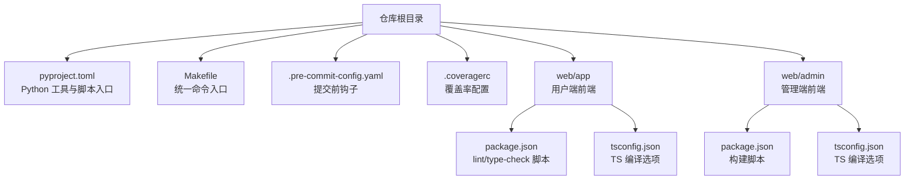
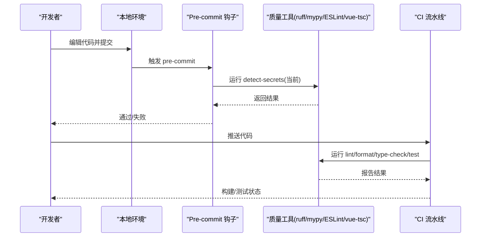
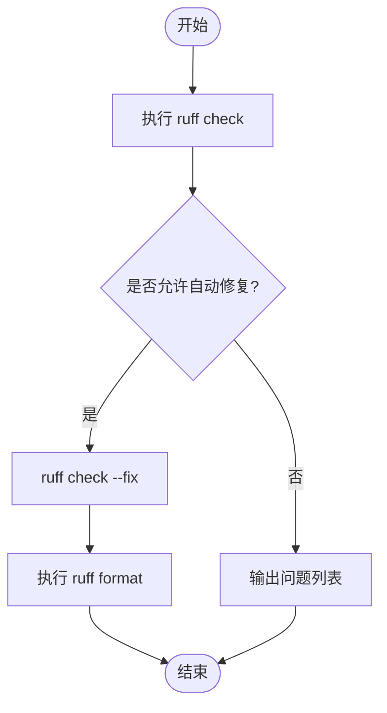
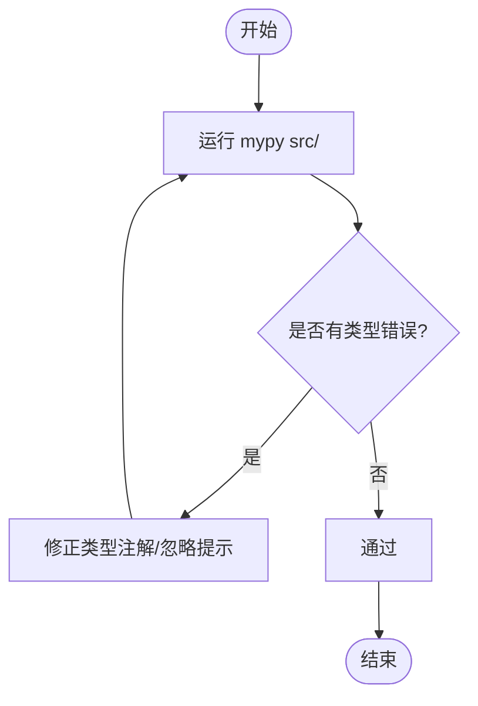
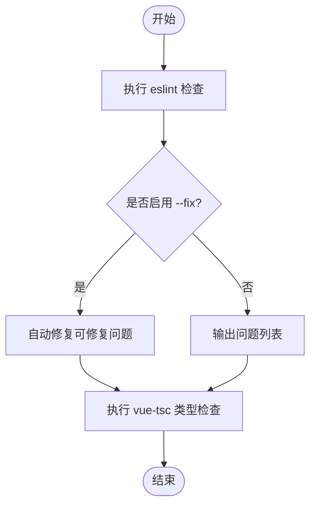
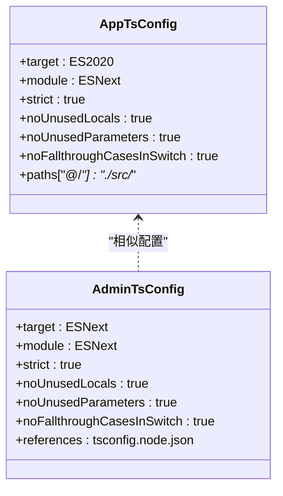
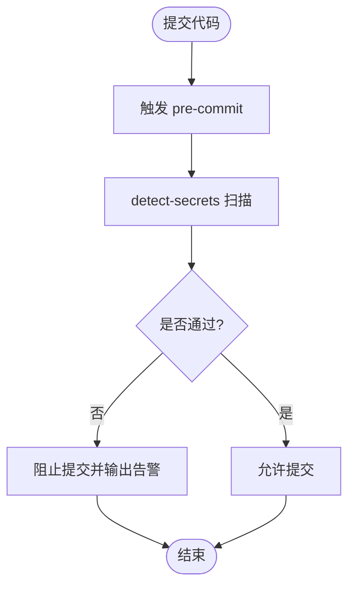
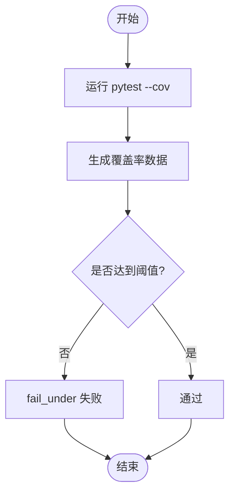
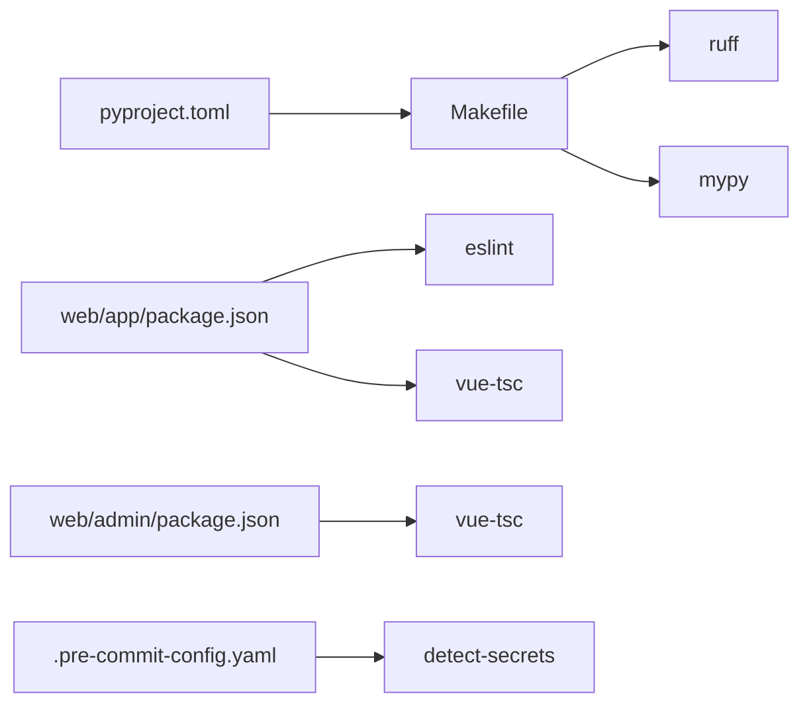

# 代码质量工具

<cite>
**本文引用的文件**   
- [pyproject.toml](file://pyproject.toml)
- [.pre-commit-config.yaml](file://.pre-commit-config.yaml)
- [.coveragerc](file://.coveragerc)
- [Makefile](file://Makefile)
- [web/app/package.json](file://web/app/package.json)
- [web/admin/package.json](file://web/admin/package.json)
- [web/app/tsconfig.json](file://web/app/tsconfig.json)
- [web/admin/tsconfig.json](file://web/admin/tsconfig.json)
</cite>

## 目录
1. [简介](#简介)
2. [项目结构](#项目结构)
3. [核心组件](#核心组件)
4. [架构总览](#架构总览)
5. [详细组件分析](#详细组件分析)
6. [依赖关系分析](#依赖关系分析)
7. [性能考虑](#性能考虑)
8. [故障排查指南](#故障排查指南)
9. [结论](#结论)
10. [附录](#附录)

## 简介
本文件面向 Subskin 项目的代码质量工具链，聚焦以下目标：
- Python 侧：ruff 代码风格检查与自动修复、mypy 静态类型检查配置与使用。
- TypeScript/Vue 前端侧：ESLint 规则与自定义配置、TypeScript 类型检查设置。
- 提交前质量门禁：pre-commit 钩子配置与最佳实践。
- 覆盖率统计：.coveragerc 配置与优化建议。
- 提供具体命令示例与常见问题解决方案，帮助团队在本地与 CI 中保持一致的代码质量标准。

## 项目结构
Subskin 采用多语言工程组织：
- Python 后端与脚本位于 src/、scripts/、tests/ 等目录，通过 pyproject.toml 与 Makefile 统一入口。
- 前端应用位于 web/app（用户端）与 web/admin（管理端），各自维护 package.json 与 tsconfig.json。
- 根目录包含 .pre-commit-config.yaml 与 .coveragerc 等全局质量配置。

**图示来源** 
- [pyproject.toml:1-58](file://pyproject.toml#L1-L58)
- [Makefile:1-136](file://Makefile#L1-L136)
- [.pre-commit-config.yaml:1-15](file://.pre-commit-config.yaml#L1-L15)
- [.coveragerc:1-10](file://.coveragerc#L1-L10)
- [web/app/package.json:1-55](file://web/app/package.json#L1-L55)
- [web/admin/package.json:1-30](file://web/admin/package.json#L1-L30)
- [web/app/tsconfig.json:1-23](file://web/app/tsconfig.json#L1-L23)
- [web/admin/tsconfig.json:1-25](file://web/admin/tsconfig.json#L1-L25)

**章节来源**
- [pyproject.toml:1-58](file://pyproject.toml#L1-L58)
- [Makefile:1-136](file://Makefile#L1-L136)
- [.pre-commit-config.yaml:1-15](file://.pre-commit-config.yaml#L1-L15)
- [.coveragerc:1-10](file://.coveragerc#L1-L10)
- [web/app/package.json:1-55](file://web/app/package.json#L1-L55)
- [web/admin/package.json:1-30](file://web/admin/package.json#L1-L30)
- [web/app/tsconfig.json:1-23](file://web/app/tsconfig.json#L1-L23)
- [web/admin/tsconfig.json:1-25](file://web/admin/tsconfig.json#L1-L25)

## 核心组件
本节概述各质量工具的定位与职责：
- ruff：统一的 Python 代码检查与格式化（替代 flake8/isort/black）。
- mypy：Python 静态类型检查。
- ESLint + vue-tsc：前端代码规范与类型检查（当前仓库未内置 eslint 配置文件，需补充）。
- pre-commit：提交前自动化检查（当前仅启用 secrets 检测，可扩展）。
- coverage：覆盖率统计与阈值控制。

**章节来源**
- [pyproject.toml:48-58](file://pyproject.toml#L48-L58)
- [Makefile:61-77](file://Makefile#L61-L77)
- [.pre-commit-config.yaml:1-15](file://.pre-commit-config.yaml#L1-L15)
- [.coveragerc:1-10](file://.coveragerc#L1-L10)
- [web/app/package.json:11-12](file://web/app/package.json#L11-L12)

## 架构总览
下图展示从开发者到代码质量门禁的整体流程：本地开发时通过 Makefile 或包管理器脚本触发 ruff/mypy/ESLint/vue-tsc；提交前由 pre-commit 拦截并执行安全扫描；CI 可复用相同命令保证一致性。

**图示来源** 
- [Makefile:56-77](file://Makefile#L56-L77)
- [.pre-commit-config.yaml:1-15](file://.pre-commit-config.yaml#L1-L15)
- [web/app/package.json:11-12](file://web/app/package.json#L11-L12)

## 详细组件分析

### Ruff 代码风格检查与自动修复（Python）
- 作用：统一 Python 代码风格、快速检查常见错误、支持自动修复与格式化。
- 集成点：
  - pyproject.toml 定义脚本入口与覆盖范围。
  - Makefile 提供 lint/format/type-check 等便捷命令。
- 建议配置要点（结合仓库现状）：
  - 行长度与目标版本已在 pyproject.toml 的 black/isort 部分体现，ruff 可通过 profile=black 对齐。
  - 建议在 pyproject.toml 新增 [tool.ruff] 与 [tool.ruff.lint]，启用常用规则集（如 E/F/W/I/B 等），并开启自动修复。
  - 将 web/backend 与 web/vitepress 等第三方生成目录加入 exclude，避免误报。
- 常用命令：
  - 检查：make lint 或 ruff check src/ tests/
  - 格式化：make format 或 ruff format src/ tests/
  - 自动修复：ruff check --fix src/ tests/

**图示来源** 
- [pyproject.toml:48-58](file://pyproject.toml#L48-L58)
- [Makefile:61-72](file://Makefile#L61-L72)

**章节来源**
- [pyproject.toml:48-58](file://pyproject.toml#L48-L58)
- [Makefile:61-72](file://Makefile#L61-L72)

### MyPy 静态类型检查（Python）
- 作用：对 Python 代码进行静态类型检查，提前发现类型不匹配等问题。
- 集成点：
  - Makefile 提供 type-check 目标，直接调用 mypy src/。
  - 建议在 pyproject.toml 增加 [tool.mypy] 配置，统一忽略目录、严格模式、插件等。
- 建议配置要点：
  - 启用 strict 或按需放宽策略（no_implicit_optional、disallow_untyped_defs 等）。
  - 排除第三方生成目录与测试无关模块。
  - 针对第三方库添加 .pyi 或忽略特定模块。
- 常用命令：
  - 类型检查：make type-check 或 mypy src/

**图示来源** 
- [Makefile:74-77](file://Makefile#L74-L77)

**章节来源**
- [Makefile:74-77](file://Makefile#L74-L77)

### ESLint 前端代码质量检查（TypeScript/Vue）
- 现状：
  - web/app/package.json 定义了 lint 脚本，指向 eslint 并支持自动修复；但仓库未找到 eslint 配置文件（如 .eslintrc.js/.eslintrc.cjs/eslint.config.js）。
  - web/admin/package.json 未定义 lint 脚本。
- 建议配置要点：
  - 新增共享的 eslint 配置（推荐 flat config 或 .eslintrc.*），启用 Vue 与 TypeScript 插件。
  - 为 web/admin 补充 lint 脚本，确保两端一致。
  - 结合 prettier 与 stylelint（可选）统一样式与格式。
- 常用命令：
  - 前端检查与修复：npm run lint（在 web/app 目录）
  - 类型检查：npm run type-check（vue-tsc）

**图示来源** 
- [web/app/package.json:11-12](file://web/app/package.json#L11-L12)

**章节来源**
- [web/app/package.json:11-12](file://web/app/package.json#L11-L12)

### TypeScript 类型检查设置（Vue）
- 配置位置：
  - web/app/tsconfig.json：严格模式、路径别名、include 范围等。
  - web/admin/tsconfig.json：严格模式、引用 node 配置等。
- 关键项说明：
  - strict、noUnusedLocals、noUnusedParameters、noFallthroughCasesInSwitch 提升类型安全性。
  - moduleResolution=bundler 适配 Vite 生态。
  - include 限定 TS/TSX/Vue 文件范围，避免误检。
- 常用命令：
  - 类型检查：npm run type-check（web/app）；web/admin 构建前会执行 vue-tsc --noEmit。

**图示来源** 
- [web/app/tsconfig.json:1-23](file://web/app/tsconfig.json#L1-L23)
- [web/admin/tsconfig.json:1-25](file://web/admin/tsconfig.json#L1-L25)

**章节来源**
- [web/app/tsconfig.json:1-23](file://web/app/tsconfig.json#L1-L23)
- [web/admin/tsconfig.json:1-25](file://web/admin/tsconfig.json#L1-L25)

### Pre-commit 钩子配置（提交前质量门禁）
- 现状：
  - .pre-commit-config.yaml 已启用 detect-secrets，用于检测代码中的敏感信息。
  - 尚未集成 ruff/mypy/ESLint 等检查。
- 建议扩展：
  - 在 pre-commit 中添加 ruff check/format、mypy、eslint/vue-tsc 等任务。
  - 针对不同目录设置 exclude，减少不必要的扫描。
  - 使用 baseline 文件管理已知告警（如 secrets baseline）。
- 常用命令：
  - 安装并初始化：pre-commit install
  - 手动触发：pre-commit run --all-files

**图示来源** 
- [.pre-commit-config.yaml:1-15](file://.pre-commit-config.yaml#L1-L15)

**章节来源**
- [.pre-commit-config.yaml:1-15](file://.pre-commit-config.yaml#L1-L15)

### 覆盖率统计（.coveragerc）
- 现状：
  - .coveragerc 设置了 omit 排除项与 fail_under 阈值（80%）。
  - pytest.ini 指定测试路径为 tests。
- 建议优化：
  - 根据实际模块调整 omit，避免排除过多导致覆盖率虚高。
  - 结合 pytest-cov 输出 HTML 与 XML，便于 CI 归档与趋势分析。
  - 对第三方生成目录与测试辅助代码进行合理排除。
- 常用命令：
  - 运行测试并统计覆盖率：make test（已包含 --cov）
  - 查看覆盖率报告：coverage report / coverage html

**图示来源** 
- [.coveragerc:1-10](file://.coveragerc#L1-L10)
- [Makefile:56-60](file://Makefile#L56-L60)

**章节来源**
- [.coveragerc:1-10](file://.coveragerc#L1-L10)
- [Makefile:56-60](file://Makefile#L56-L60)

## 依赖关系分析
- Python 侧：
  - pyproject.toml 定义脚本入口（test/format/lint），Makefile 封装统一命令。
  - ruff/mypy 通过 Makefile 与 pyproject 脚本协同工作。
- 前端侧：
  - web/app 与 web/admin 分别通过 package.json 管理脚本与依赖。
  - TypeScript 编译与类型检查由 tsconfig.json 驱动。
- 提交前：
  - pre-commit 作为统一门禁，可扩展集成所有质量工具。

**图示来源** 
- [pyproject.toml:48-58](file://pyproject.toml#L48-L58)
- [Makefile:56-77](file://Makefile#L56-L77)
- [web/app/package.json:11-12](file://web/app/package.json#L11-L12)
- [web/admin/package.json:7-9](file://web/admin/package.json#L7-L9)
- [.pre-commit-config.yaml:1-15](file://.pre-commit-config.yaml#L1-L15)

**章节来源**
- [pyproject.toml:48-58](file://pyproject.toml#L48-L58)
- [Makefile:56-77](file://Makefile#L56-L77)
- [web/app/package.json:11-12](file://web/app/package.json#L11-L12)
- [web/admin/package.json:7-9](file://web/admin/package.json#L7-L9)
- [.pre-commit-config.yaml:1-15](file://.pre-commit-config.yaml#L1-L15)

## 性能考虑
- ruff：相比传统 flake8/isort/black 组合，ruff 更快，建议优先使用 ruff check/format。
- mypy：首次运行较慢，后续缓存命中较快；可在 CI 中启用缓存目录（.mypy_cache）。
- ESLint：大型项目建议拆分配置、使用 cache（默认启用）、并行处理。
- Coverage：仅对必要模块采集，避免过大影响测试速度。

[本节为通用指导，无需列出具体文件来源]

## 故障排查指南
- ruff 检查失败：
  - 使用 ruff check --diff 查看差异；必要时先执行 ruff check --fix 自动修复。
  - 若规则过严，可在 [tool.ruff.lint] 中禁用特定规则或调整优先级。
- mypy 类型错误：
  - 逐步缩小范围定位问题；对第三方库可使用 ignore_missing_imports 或添加 .pyi。
  - 临时忽略某行：# type: ignore[error-code]
- ESLint 未找到配置：
  - 需在 web/app 与 web/admin 分别创建 eslint 配置文件；确保脚本路径正确。
- pre-commit 未生效：
  - 确认已执行 pre-commit install；检查 .pre-commit-config.yaml 语法与 exclude 正则。
- 覆盖率阈值失败：
  - 调整 .coveragerc 的 omit 列表；检查测试覆盖范围是否充分。

**章节来源**
- [pyproject.toml:48-58](file://pyproject.toml#L48-L58)
- [Makefile:61-77](file://Makefile#L61-L77)
- [.pre-commit-config.yaml:1-15](file://.pre-commit-config.yaml#L1-L15)
- [.coveragerc:1-10](file://.coveragerc#L1-L10)

## 结论
通过在本仓库中统一使用 ruff、mypy、ESLint/vue-tsc、pre-commit 与 coverage，可以在本地与 CI 中建立一致的代码质量门禁。建议尽快补齐 ESLint 配置与 pre-commit 的质量检查任务，完善覆盖率阈值与报告机制，持续提升代码健壮性与可维护性。

[本节为总结性内容，无需列出具体文件来源]

## 附录
- 常用命令速查：
  - Python：
    - 检查与格式化：make lint、make format
    - 类型检查：make type-check
    - 测试与覆盖率：make test
  - 前端：
    - 检查与修复：cd web/app && npm run lint
    - 类型检查：cd web/app && npm run type-check；web/admin 构建前会自动执行 vue-tsc
  - 提交前：
    - 安装钩子：pre-commit install
    - 全量检查：pre-commit run --all-files
- 建议下一步：
  - 在 pyproject.toml 中新增 [tool.ruff] 与 [tool.ruff.lint] 配置，启用统一规则集。
  - 在 web/app 与 web/admin 中新增 eslint 配置文件，统一规则与插件。
  - 扩展 .pre-commit-config.yaml，集成 ruff/mypy/eslint/vue-tsc。
  - 优化 .coveragerc 的 omit 列表，结合 CI 生成 HTML/XML 报告。

[本节为补充信息，无需列出具体文件来源]