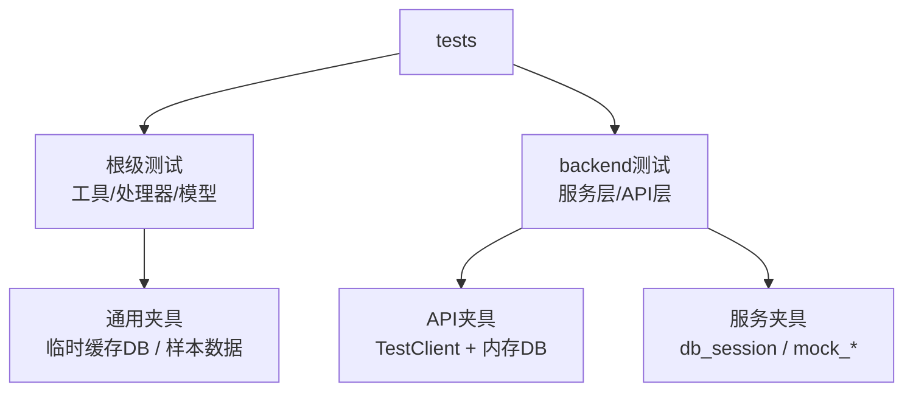
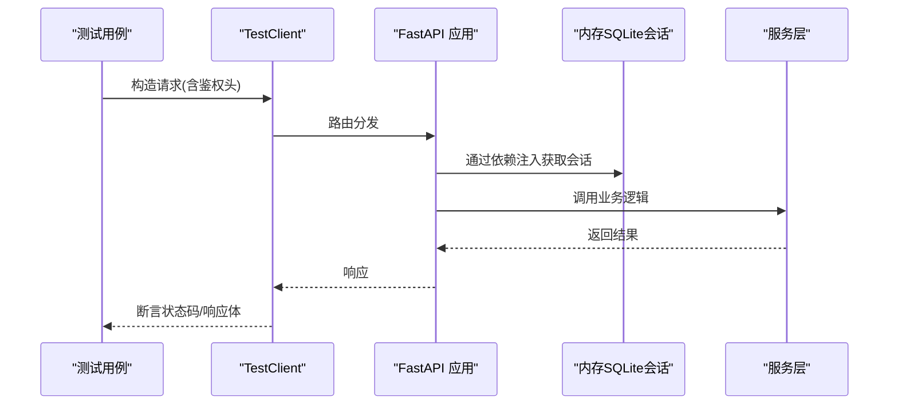
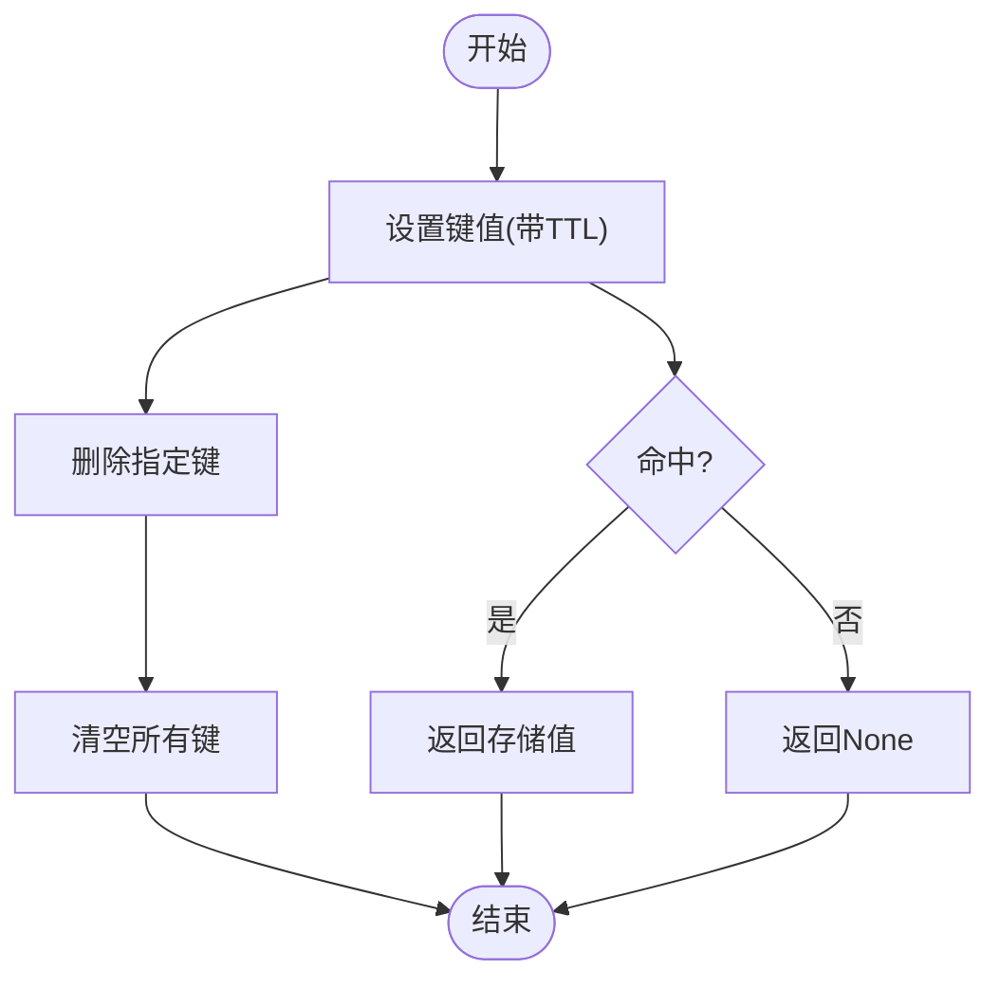
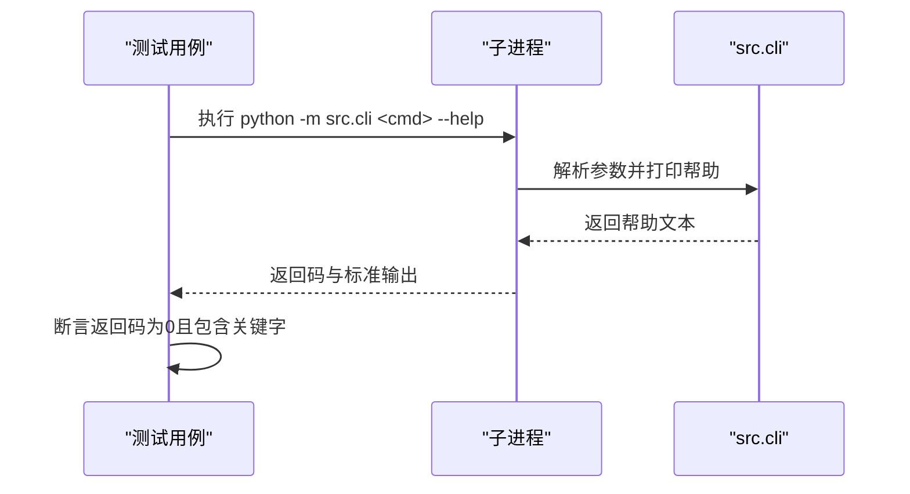
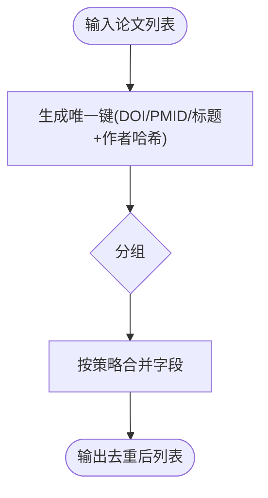
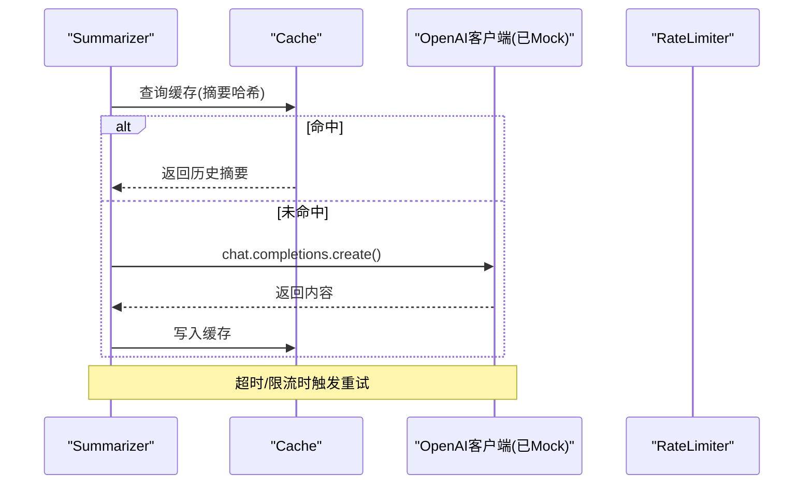
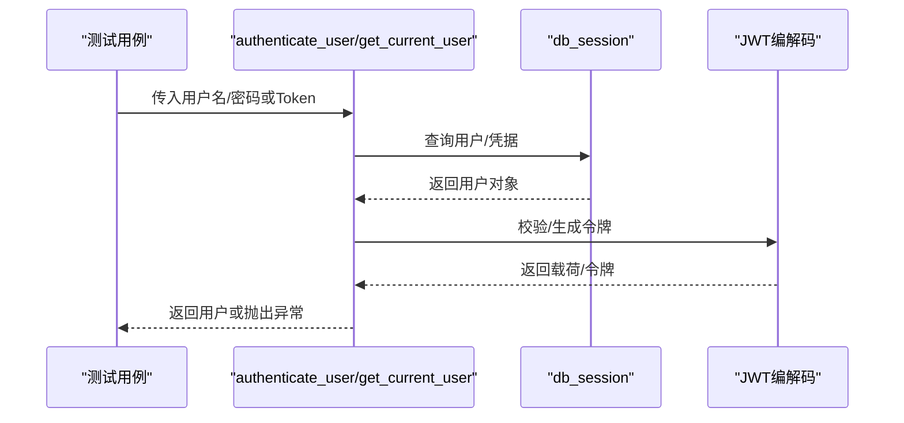
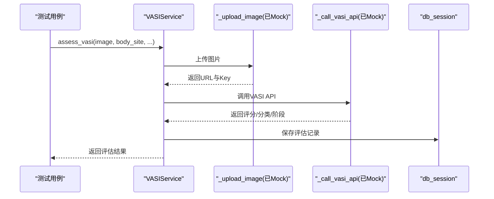
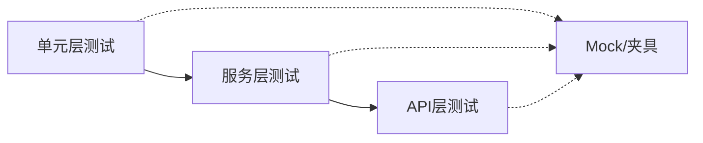
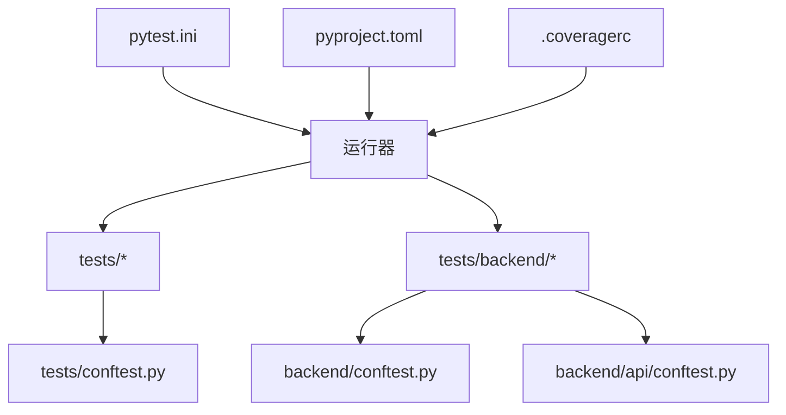

# 单元测试

<cite>
**本文引用的文件**
- [pytest.ini](file://pytest.ini)
- [.coveragerc](file://.coveragerc)
- [pyproject.toml](file://pyproject.toml)
- [tests/conftest.py](file://tests/conftest.py)
- [tests/backend/conftest.py](file://tests/backend/conftest.py)
- [tests/backend/api/conftest.py](file://tests/backend/api/conftest.py)
- [tests/test_cache.py](file://tests/test_cache.py)
- [tests/test_cli.py](file://tests/test_cli.py)
- [tests/test_deduplicator.py](file://tests/test_deduplicator.py)
- [tests/test_summarizer.py](file://tests/test_summarizer.py)
- [tests/backend/services/test_auth.py](file://tests/backend/services/test_auth.py)
- [tests/backend/services/test_vasi.py](file://tests/backend/services/test_vasi.py)
</cite>

## 目录
1. [简介](#简介)
2. [项目结构](#项目结构)
3. [核心组件](#核心组件)
4. [架构总览](#架构总览)
5. [详细组件分析](#详细组件分析)
6. [依赖关系分析](#依赖关系分析)
7. [性能考虑](#性能考虑)
8. [故障排查指南](#故障排查指南)
9. [结论](#结论)
10. [附录](#附录)

## 简介
本文件面向 Subskin 项目的单元测试实践，围绕 pytest 测试框架展开，覆盖测试组织、用例编写规范、Mock 对象创建、数据库测试环境配置、异步测试支持（pytest-asyncio）、测试数据管理、参数化测试与夹具使用。文档同时提供覆盖率统计配置与最佳实践建议，并结合仓库中现有测试样例进行说明，帮助读者快速掌握后端服务层、工具函数与数据处理模块的单元测试方法。

## 项目结构
Subskin 的测试集中在 tests 目录，按“功能域”划分：
- 根级 tests：针对 src 下的工具、处理器、模型等单元模块进行测试，如缓存、去重、总结器、爬虫、导出器等。
- tests/backend：针对 web.backend 的服务层与 API 层进行测试，包含数据库会话、认证、评论、社区、RAG、VASI 等。
- 共享夹具：通过 conftest.py 在 tests/ 与 tests/backend/ 分别提供通用夹具与环境初始化。

**图示来源**
- [tests/conftest.py:20-115](file://tests/conftest.py#L20-L115)
- [tests/backend/api/conftest.py:28-64](file://tests/backend/api/conftest.py#L28-L64)
- [tests/backend/conftest.py:38-57](file://tests/backend/conftest.py#L38-L57)

**章节来源**
- [pytest.ini:1-8](file://pytest.ini#L1-L8)
- [pyproject.toml:37-51](file://pyproject.toml#L37-L51)

## 核心组件
- 测试运行与收集
  - pytest 入口与选项：测试路径、覆盖率输出、异步模式自动启用。
  - 覆盖率阈值：命令行与 .coveragerc 双重约束。
- 数据库测试环境
  - 内存 SQLite + StaticPool，确保并发安全与隔离性。
  - 通过依赖注入替换 get_db，使 FastAPI 应用使用测试数据库。
- Mock 与外部依赖
  - 使用 unittest.mock.patch 与 MagicMock/AsyncMock 模拟 HTTP、LLM、短信发送等外部调用。
- 异步测试
  - 通过 pytest.mark.asyncio 与 asyncio_mode=auto 支持 async def 测试。
- 参数化测试
  - 使用 @pytest.mark.parametrize 对多组输入/异常类型进行批量验证。
- 夹具与数据准备
  - 用户、管理员、评论、文档、验证码等常用测试数据；临时缓存数据库；示例论文/试验数据。

**章节来源**
- [pytest.ini:1-8](file://pytest.ini#L1-L8)
- [.coveragerc:1-10](file://.coveragerc#L1-L10)
- [tests/backend/api/conftest.py:28-64](file://tests/backend/api/conftest.py#L28-L64)
- [tests/backend/conftest.py:38-57](file://tests/backend/conftest.py#L38-L57)
- [tests/backend/conftest.py:215-251](file://tests/backend/conftest.py#L215-L251)
- [tests/conftest.py:20-115](file://tests/conftest.py#L20-L115)

## 架构总览
下图展示后端 API 测试的整体流程：TestClient 发起请求 → 依赖注入替换数据库会话 → 服务层处理 → 返回响应。该流程由 API 层的 conftest 统一装配。

**图示来源**
- [tests/backend/api/conftest.py:51-64](file://tests/backend/api/conftest.py#L51-L64)
- [tests/backend/api/conftest.py:185-203](file://tests/backend/api/conftest.py#L185-L203)

## 详细组件分析

### 缓存模块单元测试（src.utils.cache）
- 目标：验证缓存命中/未命中、TTL 过期、删除与清空、线程安全。
- 关键点：
  - 使用真实 Cache 实例，无需 Mock。
  - 通过 time.sleep 验证 TTL 行为。
  - 使用 ThreadPoolExecutor 并发写入/读取，验证线程安全。

**图示来源**
- [tests/test_cache.py:12-67](file://tests/test_cache.py#L12-L67)

**章节来源**
- [tests/test_cache.py:12-67](file://tests/test_cache.py#L12-L67)

### CLI 接口测试（src.cli）
- 目标：验证各命令的帮助信息、可导入性与缺失环境变量时的失败路径。
- 关键点：
  - 使用 subprocess 调用 Python 模块执行命令。
  - 使用 @pytest.mark.parametrize 批量校验多个命令。
  - 仅断言非零退出码，避免日志格式差异导致不稳定。

**图示来源**
- [tests/test_cli.py:10-150](file://tests/test_cli.py#L10-L150)

**章节来源**
- [tests/test_cli.py:10-150](file://tests/test_cli.py#L10-L150)

### 数据去重模块（src.processors.deduplicator）
- 目标：验证基于 DOI/PMID/标题+作者哈希的去重策略与字段合并规则。
- 关键点：
  - 使用工厂函数 create_paper 构造测试数据。
  - 覆盖空列表、单条记录、重复记录、无标识符回退等场景。
  - 验证合并策略：标题/摘要取更长、作者集合合并、期刊优先等。

**图示来源**
- [tests/test_deduplicator.py:14-200](file://tests/test_deduplicator.py#L14-L200)

**章节来源**
- [tests/test_deduplicator.py:14-200](file://tests/test_deduplicator.py#L14-L200)

### 医学论文总结器（src.processors.summarizer）
- 目标：验证 LLM 调用、缓存命中、重试与错误处理。
- 关键点：
  - 使用 patch("...OpenAI") 与 MagicMock 构造客户端与响应。
  - 验证不同摘要独立缓存、超时/限流重试、耗尽重试后抛出自定义异常。
  - 结合 RateLimiter 与 Cache 进行端到端行为验证。

**图示来源**
- [tests/test_summarizer.py:156-334](file://tests/test_summarizer.py#L156-L334)

**章节来源**
- [tests/test_summarizer.py:156-334](file://tests/test_summarizer.py#L156-L334)

### 认证服务测试（web.backend.services.auth）
- 目标：验证密码哈希/校验、JWT 令牌生成与解码、异步用户认证与权限控制。
- 关键点：
  - 使用 @pytest.mark.asyncio 标记异步测试。
  - 通过 db_session 与 test_user 夹具准备数据。
  - 断言无效/过期令牌抛出 HTTPException 并携带正确状态码与消息。

**图示来源**
- [tests/backend/services/test_auth.py:25-238](file://tests/backend/services/test_auth.py#L25-L238)
- [tests/backend/conftest.py:38-94](file://tests/backend/conftest.py#L38-L94)

**章节来源**
- [tests/backend/services/test_auth.py:25-238](file://tests/backend/services/test_auth.py#L25-L238)
- [tests/backend/conftest.py:38-94](file://tests/backend/conftest.py#L38-L94)

### VASI 评估服务测试（web.backend.services.vasi）
- 目标：验证输入校验、图片上传与 API 调用流程、数据库记录创建。
- 关键点：
  - 使用 AsyncMock 模拟 _upload_image 与 _call_vasi_api。
  - 构造符合魔法字节的 JPEG 字节以通过服务端校验。
  - 断言评估记录字段与调用顺序。

**图示来源**
- [tests/backend/services/test_vasi.py:27-194](file://tests/backend/services/test_vasi.py#L27-L194)

**章节来源**
- [tests/backend/services/test_vasi.py:27-194](file://tests/backend/services/test_vasi.py#L27-L194)

### 概念总览
- 测试分层：单元（工具/处理器/模型）与服务/API 层分离，便于聚焦与复用。
- 数据隔离：每个测试使用独立的内存数据库会话，避免相互污染。
- 外部依赖：通过 Mock 屏蔽网络与第三方服务，保证测试稳定与快速。
- 异步支持：统一启用异步模式，简化 async 测试编写。

[此图为概念图，不直接映射具体源码]

## 依赖关系分析
- 测试配置依赖
  - pytest.ini：定义测试路径、覆盖率输出、异步模式。
  - pyproject.toml：集成 pytest 配置与脚本命令。
  - .coveragerc：覆盖率忽略项与最低覆盖率阈值。
- 夹具依赖
  - tests/conftest.py：临时缓存数据库、示例数据、HTTP 响应 Mock。
  - tests/backend/conftest.py：内存数据库、用户/管理员、评论、文档、验证码、外部服务 Mock。
  - tests/backend/api/conftest.py：TestClient、依赖注入 get_db、鉴权头。

**图示来源**
- [pytest.ini:1-8](file://pytest.ini#L1-L8)
- [pyproject.toml:37-51](file://pyproject.toml#L37-L51)
- [.coveragerc:1-10](file://.coveragerc#L1-L10)
- [tests/backend/conftest.py:38-57](file://tests/backend/conftest.py#L38-L57)
- [tests/backend/api/conftest.py:28-64](file://tests/backend/api/conftest.py#L28-L64)
- [tests/conftest.py:20-115](file://tests/conftest.py#L20-L115)

**章节来源**
- [pytest.ini:1-8](file://pytest.ini#L1-L8)
- [pyproject.toml:37-51](file://pyproject.toml#L37-L51)
- [.coveragerc:1-10](file://.coveragerc#L1-L10)

## 性能考虑
- 使用内存 SQLite 与 StaticPool，减少 I/O 开销并支持并发测试。
- 通过 Mock 屏蔽网络与外部服务，提升测试速度与稳定性。
- 合理设置覆盖率阈值，避免过度追求覆盖率影响开发效率。
- 对耗时操作（如 sleep、重试）进行最小化，必要时使用 Mock 缩短等待时间。

[本节为通用指导，不直接分析具体文件]

## 故障排查指南
- 异步测试未被识别
  - 现象：提示“async def functions are not natively supported”。
  - 解决：确认 pytest.ini 中 asyncio_mode = auto。
- 环境变量缺失导致导入失败
  - 现象：import 时报 KeyError（如 SECRET_KEY）。
  - 解决：在 conftest 顶部 setdefault 或通过 monkeypatch 设置必要环境变量。
- 数据库连接问题
  - 现象：多线程下 SQLite 报错。
  - 解决：使用 connect_args={"check_same_thread": False} 与 StaticPool。
- 覆盖率未达标
  - 现象：覆盖率低于阈值导致 CI 失败。
  - 解决：检查 .coveragerc 的 fail_under 与 omit 配置，补充关键路径测试。

**章节来源**
- [pytest.ini:1-8](file://pytest.ini#L1-L8)
- [tests/backend/conftest.py:5-15](file://tests/backend/conftest.py#L5-L15)
- [tests/backend/api/conftest.py:28-35](file://tests/backend/api/conftest.py#L28-L35)
- [.coveragerc:1-10](file://.coveragerc#L1-L10)

## 结论
Subskin 的测试体系以 pytest 为核心，结合内存数据库、Mock 与异步支持，形成了稳定、快速、可维护的单元测试方案。通过统一的夹具与配置，测试覆盖了工具函数、数据处理、服务层与 API 层的关键路径。建议持续完善覆盖率、保持测试数据与环境的隔离，并在引入新依赖时同步补充相应 Mock 与用例。

[本节为总结，不直接分析具体文件]

## 附录
- 运行测试
  - 使用项目脚本：python -m pytest（或自定义脚本命令）。
  - 覆盖率：默认输出终端与 XML，可通过 .coveragerc 调整阈值与忽略项。
- 最佳实践
  - 将测试与实现同构组织，便于定位与维护。
  - 对外部依赖一律 Mock，避免网络抖动影响测试结果。
  - 使用夹具集中管理测试数据，减少重复代码。
  - 对边界条件与异常路径进行充分覆盖。
  - 对异步代码使用 @pytest.mark.asyncio，并确保全局异步模式开启。

[本节为通用指导，不直接分析具体文件]