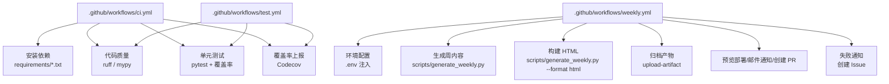
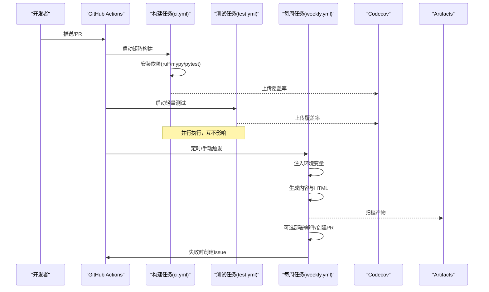
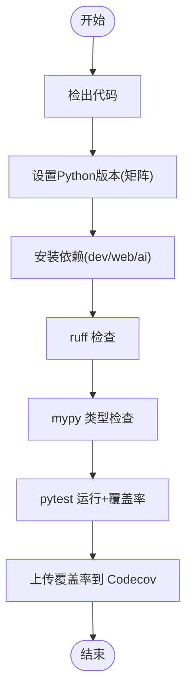
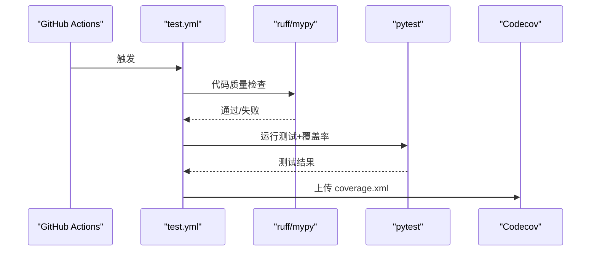
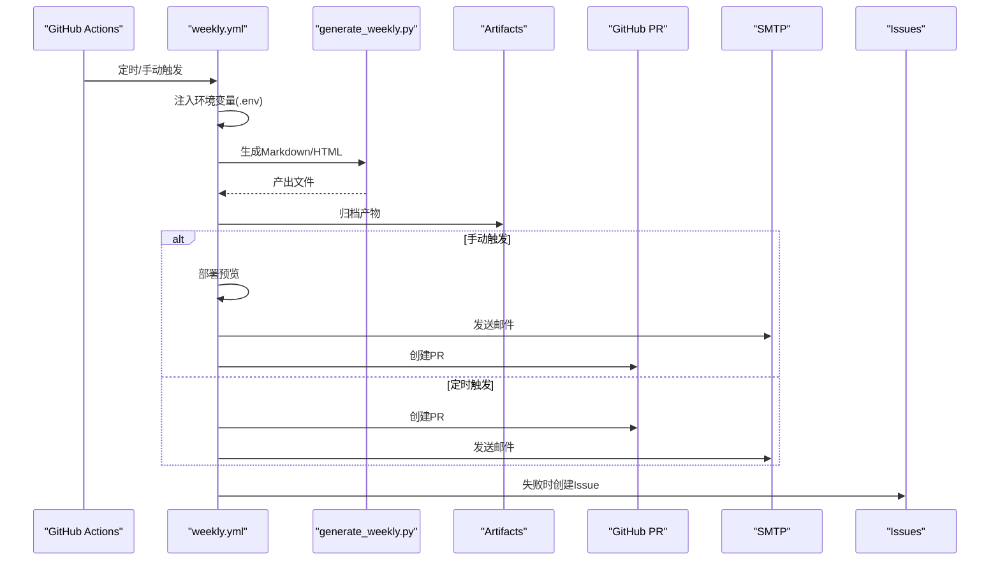
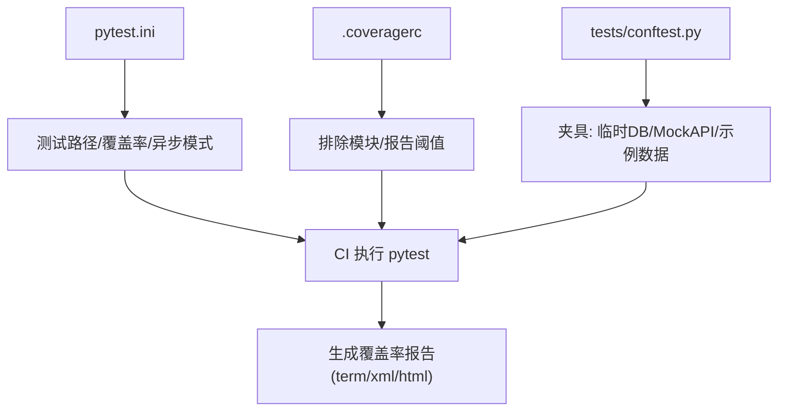
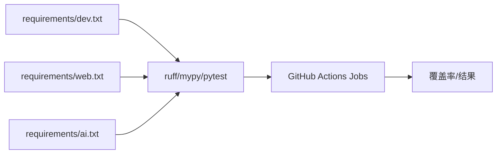

# 持续集成

<cite>
**本文引用的文件**
- [ci.yml](file://.github/workflows/ci.yml)
- [test.yml](file://.github/workflows/test.yml)
- [weekly.yml](file://.github/workflows/weekly.yml)
- [pytest.ini](file://pytest.ini)
- [.coveragerc](file://.coveragerc)
- [pyproject.toml](file://pyproject.toml)
- [Makefile](file://Makefile)
- [dev.txt](file://requirements/dev.txt)
- [web.txt](file://requirements/web.txt)
- [ai.txt](file://requirements/ai.txt)
- [conftest.py](file://tests/conftest.py)
</cite>

## 目录
1. [简介](#简介)
2. [项目结构](#项目结构)
3. [核心组件](#核心组件)
4. [架构总览](#架构总览)
5. [详细组件分析](#详细组件分析)
6. [依赖关系分析](#依赖关系分析)
7. [性能与缓存优化](#性能与缓存优化)
8. [故障排查指南](#故障排查指南)
9. [结论](#结论)
10. [附录](#附录)

## 简介
本文件为 Subskin 项目的持续集成（CI）配置文档，聚焦 GitHub Actions 工作流的设计与实现。内容涵盖：
- 自动化测试执行、代码质量检查（Lint/类型检查）、覆盖率收集与上报
- 多阶段任务编排与矩阵构建策略
- 定时任务（每周内容生成与校验）及失败通知
- 缓存优化策略与常见问题排查
- 具体工作流 YAML 的说明与参考路径

## 项目结构
仓库中 CI 相关的关键位置与职责如下：
- .github/workflows：GitHub Actions 工作流定义
  - ci.yml：主构建与质量门禁（Python 多版本矩阵、ruff/mypy、pytest、覆盖率上报）
  - test.yml：精简测试流程（lint + type check + pytest + 覆盖率）
  - weekly.yml：每周定时任务（内容生成、HTML 构建、产物归档、预览部署、邮件通知、PR 创建、失败告警）
- 测试与覆盖率配置
  - pytest.ini：测试路径、覆盖率参数、最低覆盖率阈值、异步模式
  - .coveragerc：覆盖率排除与报告阈值
  - tests/conftest.py：共享夹具（临时数据库、Mock API、示例数据）
- 依赖与工具链
  - requirements/*.txt：开发、Web、AI 依赖
  - Makefile：本地命令封装（测试、格式化、类型检查等）
  - pyproject.toml：项目元信息、构建系统、部分工具配置

**图示来源**
- [ci.yml:1-77](file://.github/workflows/ci.yml#L1-L77)
- [test.yml:1-42](file://.github/workflows/test.yml#L1-L42)
- [weekly.yml:1-196](file://.github/workflows/weekly.yml#L1-L196)

**章节来源**
- [ci.yml:1-77](file://.github/workflows/ci.yml#L1-L77)
- [test.yml:1-42](file://.github/workflows/test.yml#L1-L42)
- [weekly.yml:1-196](file://.github/workflows/weekly.yml#L1-L196)
- [pytest.ini:1-8](file://pytest.ini#L1-L8)
- [.coveragerc:1-10](file://.coveragerc#L1-L10)
- [pyproject.toml:1-58](file://pyproject.toml#L1-L58)
- [Makefile:1-136](file://Makefile#L1-L136)

## 核心组件
- 构建与质量门禁（ci.yml）
  - 触发条件：push/PR 到 main
  - 矩阵构建：Python 3.10/3.11/3.12
  - 步骤：安装依赖（dev/web/ai）、ruff 检查、mypy 类型检查、pytest 运行并生成覆盖率、上传至 Codecov
  - 附加：web/backend 独立 lint/type-check 任务
- 轻量测试（test.yml）
  - 触发条件：push/PR
  - 步骤：安装 dev 依赖、ruff、mypy、pytest（带覆盖率）、上传 coverage.xml
- 每周内容生成（weekly.yml）
  - 触发条件：每周五 UTC 10:00 或手动触发
  - 步骤：设置 Python 环境并启用 pip 缓存、注入环境变量（API Key、站点 URL、可选测试模式）、生成内容与 HTML、归档产物、可选预览部署、发送邮件、自动创建 PR、失败时创建 Issue
  - 验证任务：下载产物、安装依赖、校验链接/图片/HTML、生成预览、上传校验报告

**章节来源**
- [ci.yml:1-77](file://.github/workflows/ci.yml#L1-L77)
- [test.yml:1-42](file://.github/workflows/test.yml#L1-L42)
- [weekly.yml:1-196](file://.github/workflows/weekly.yml#L1-L196)

## 架构总览
下图展示了 CI 流水线在仓库中的关键交互与数据流向：

**图示来源**
- [ci.yml:1-77](file://.github/workflows/ci.yml#L1-L77)
- [test.yml:1-42](file://.github/workflows/test.yml#L1-L42)
- [weekly.yml:1-196](file://.github/workflows/weekly.yml#L1-L196)

## 详细组件分析

### 构建与质量门禁（ci.yml）
- 设计要点
  - 多 Python 版本矩阵确保兼容性
  - 统一安装 dev/web/ai 依赖，覆盖后端与 AI 能力
  - 先进行静态检查（ruff），再进行类型检查（mypy），最后运行测试
  - 使用 pytest-cov 生成终端与 HTML 覆盖率，并上传至 Codecov
  - web/backend 单独任务，避免影响主构建速度
- 关键步骤映射
  - 安装依赖：requirements/dev.txt、requirements/web.txt、requirements/ai.txt
  - 代码质量：ruff check src/ tests/；mypy src/
  - 测试与覆盖率：pytest tests/ --cov=src --cov-report=term/html
  - 覆盖率上报：codecov-action v3

**图示来源**
- [ci.yml:1-77](file://.github/workflows/ci.yml#L1-L77)

**章节来源**
- [ci.yml:1-77](file://.github/workflows/ci.yml#L1-L77)
- [dev.txt:1-46](file://requirements/dev.txt#L1-L46)
- [web.txt:1-40](file://requirements/web.txt#L1-L40)
- [ai.txt:1-37](file://requirements/ai.txt#L1-L37)

### 轻量测试（test.yml）
- 设计要点
  - 快速反馈：仅安装 dev 依赖，减少构建时间
  - 统一输出：生成 coverage.xml 供 Codecov 聚合
  - 始终上报：即使失败也尝试上传覆盖率
- 关键步骤映射
  - 安装依赖：requirements/dev.txt
  - 代码质量：ruff check src tests；mypy src
  - 测试与覆盖率：pytest --cov=src
  - 覆盖率上报：codecov-action v4 上传 coverage.xml

**图示来源**
- [test.yml:1-42](file://.github/workflows/test.yml#L1-L42)

**章节来源**
- [test.yml:1-42](file://.github/workflows/test.yml#L1-L42)

### 每周内容生成（weekly.yml）
- 设计要点
  - 定时触发：每周五 UTC 10:00（北京时间 18:00）
  - 可手动触发：支持传入日期与测试模式
  - 环境隔离：通过 secrets 注入 API Key，按需开启 TEST_MODE
  - 产物管理：生成 Markdown/HTML 并归档，保留 7 天
  - 自动化协作：自动生成 PR 合并到 main，失败时创建 Issue 通知
- 关键步骤映射
  - 环境准备：setup-python + pip 缓存
  - 配置注入：写入 .env（NCBI/OpenAI/Anthropic/SS 等密钥、SITE_URL、TEST_MODE、WEEKLY_DATE）
  - 内容生成：scripts/generate_weekly.py（Markdown 与 HTML）
  - 产物归档：upload-artifact
  - 可选部署：workflow_dispatch 时部署预览
  - 通知与协作：发送邮件、创建 PR、失败创建 Issue
  - 验证任务：download-artifact -> validate_weekly.py -> 生成报告

**图示来源**
- [weekly.yml:1-196](file://.github/workflows/weekly.yml#L1-L196)

**章节来源**
- [weekly.yml:1-196](file://.github/workflows/weekly.yml#L1-L196)

### 测试基础设施与覆盖率
- pytest.ini
  - 测试路径：tests
  - 覆盖率：--cov=src，输出 term-missing 与 xml
  - 最低覆盖率：67%（可通过 CI 强制）
  - 异步模式：auto（兼容 @pytest.mark.asyncio）
- .coveragerc
  - 排除模块：部分模型与数据源管理器
  - 报告阈值：80%（与 pytest.ini 的 67% 不同，注意以实际运行参数为准）
- tests/conftest.py
  - 提供临时 SQLite 缓存数据库夹具
  - Mock API 响应夹具，便于无网络测试
  - 示例 Paper/ClinicalTrial 数据，简化用例构造

**图示来源**
- [pytest.ini:1-8](file://pytest.ini#L1-L8)
- [.coveragerc:1-10](file://.coveragerc#L1-L10)
- [conftest.py:1-115](file://tests/conftest.py#L1-L115)

**章节来源**
- [pytest.ini:1-8](file://pytest.ini#L1-L8)
- [.coveragerc:1-10](file://.coveragerc#L1-L10)
- [conftest.py:1-115](file://tests/conftest.py#L1-L115)

## 依赖关系分析
- 构建依赖
  - 主构建：requirements/dev.txt、requirements/web.txt、requirements/ai.txt
  - Web 后端独立任务：web/backend/requirements.txt（由 ci.yml 指定）
- 工具链
  - ruff：代码风格与规则检查
  - mypy：静态类型检查
  - pytest + pytest-cov：测试与覆盖率
  - codecov-action：覆盖率上报
- 本地命令
  - Makefile 提供 test/lint/format/type-check 等便捷入口，便于本地复现 CI 行为

**图示来源**
- [ci.yml:1-77](file://.github/workflows/ci.yml#L1-L77)
- [dev.txt:1-46](file://requirements/dev.txt#L1-L46)
- [web.txt:1-40](file://requirements/web.txt#L1-L40)
- [ai.txt:1-37](file://requirements/ai.txt#L1-L37)

**章节来源**
- [ci.yml:1-77](file://.github/workflows/ci.yml#L1-L77)
- [dev.txt:1-46](file://requirements/dev.txt#L1-L46)
- [web.txt:1-40](file://requirements/web.txt#L1-L40)
- [ai.txt:1-37](file://requirements/ai.txt#L1-L37)
- [Makefile:1-136](file://Makefile#L1-L136)

## 性能与缓存优化
- 依赖缓存
  - weekly.yml 显式启用 pip 缓存，加速依赖安装
  - 建议在 ci.yml 与 test.yml 中也启用 actions/setup-python 的 cache 功能（如 pip 缓存），以减少重复安装时间
- 并行化
  - ci.yml 使用 matrix 并行执行多个 Python 版本
  - 将 web/backend 的 lint/type-check 拆分为独立 job，避免阻塞主构建
- 产物与日志
  - weekly.yml 使用 upload-artifact 归档产物，便于后续验证与回滚
  - 合理设置 retention-days，控制存储成本
- 覆盖率采集
  - 同时生成 term、xml、html 三种格式，满足不同场景需求
  - 通过 pytest.ini 与 .coveragerc 控制覆盖率范围与阈值

[本节为通用指导，不直接分析具体文件]

## 故障排查指南
- 常见失败原因与定位
  - 依赖安装失败：检查 requirements/*.txt 是否包含必要包；确认网络可达；查看 actions/setup-python 与 pip 日志
  - ruff/mypy 报错：根据错误提示修复代码风格或类型注解；必要时调整忽略列表
  - pytest 失败：优先运行单个测试定位问题；检查 conftest.py 夹具是否正确；确认异步测试已启用 auto 模式
  - 覆盖率未上报：确认上传步骤成功；检查 Codecov token 与仓库权限；确认生成的覆盖率文件路径正确
  - 每周任务失败：检查 secrets 是否配置完整（NCBI/OpenAI/Anthropic/SS/SMTP）；确认脚本路径与参数；查看邮件发送与 PR 创建日志
- 建议的调试步骤
  - 在本地复现：使用 Makefile 的 test/lint/type-check 命令
  - 逐步缩小范围：注释掉部分步骤，定位失败点
  - 增加日志：在关键步骤前后打印环境变量与状态
  - 使用 workflow_dispatch 手动触发 weekly.yml，便于快速验证

**章节来源**
- [ci.yml:1-77](file://.github/workflows/ci.yml#L1-L77)
- [test.yml:1-42](file://.github/workflows/test.yml#L1-L42)
- [weekly.yml:1-196](file://.github/workflows/weekly.yml#L1-L196)
- [pytest.ini:1-8](file://pytest.ini#L1-L8)
- [conftest.py:1-115](file://tests/conftest.py#L1-L115)

## 结论
Subskin 的 CI 体系通过三个工作流实现了完整的自动化闭环：
- ci.yml：保障代码质量与兼容性（多 Python 版本矩阵）
- test.yml：提供快速反馈与覆盖率上报
- weekly.yml：自动化内容生产与发布协作（定时/手动触发、产物归档、PR 创建、失败告警）

配合 pytest 与覆盖率配置，以及合理的缓存与并行策略，整体流水线具备高可靠性与可扩展性。建议后续持续完善缓存策略、细化覆盖率阈值与报告展示，并补充更多安全扫描任务（如依赖漏洞检测）。

[本节为总结性内容，不直接分析具体文件]

## 附录
- 工作流参考路径
  - 构建与质量门禁：[ci.yml](file://.github/workflows/ci.yml)
  - 轻量测试：[test.yml](file://.github/workflows/test.yml)
  - 每周内容生成：[weekly.yml](file://.github/workflows/weekly.yml)
- 测试与覆盖率配置
  - 测试配置：[pytest.ini](file://pytest.ini)
  - 覆盖率配置：[.coveragerc](file://.coveragerc)
  - 共享夹具：[conftest.py](file://tests/conftest.py)
- 依赖与本地命令
  - 开发依赖：[dev.txt](file://requirements/dev.txt)
  - Web 依赖：[web.txt](file://requirements/web.txt)
  - AI 依赖：[ai.txt](file://requirements/ai.txt)
  - 本地命令：[Makefile](file://Makefile)
- 项目元信息
  - 项目配置：[pyproject.toml](file://pyproject.toml)

[本节为索引与导航，不直接分析具体文件]