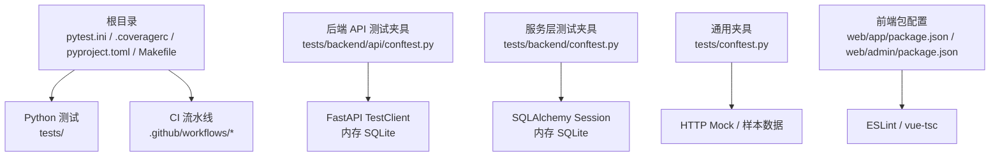
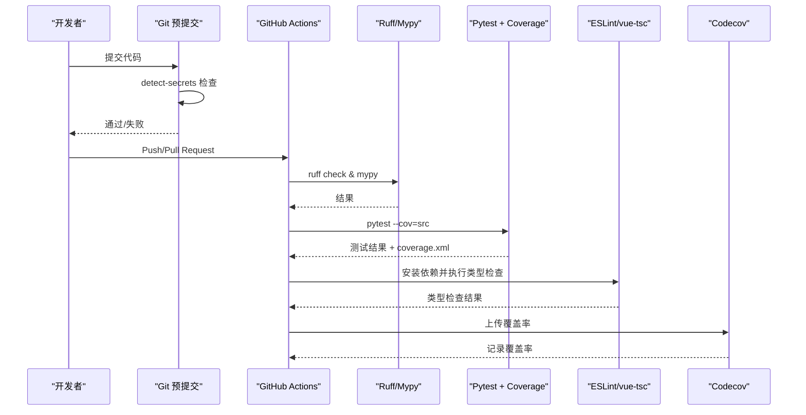
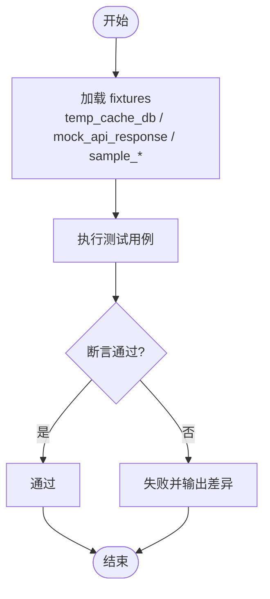
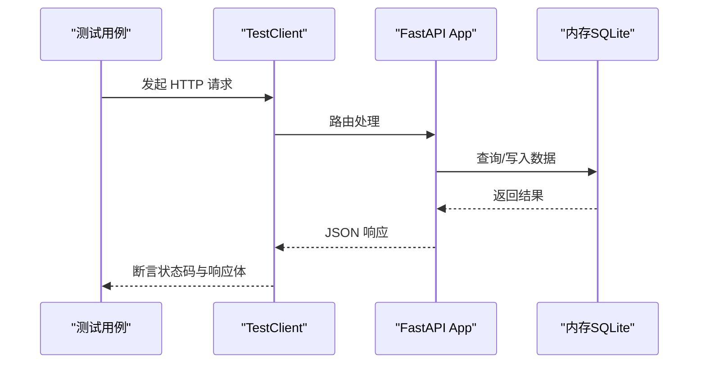
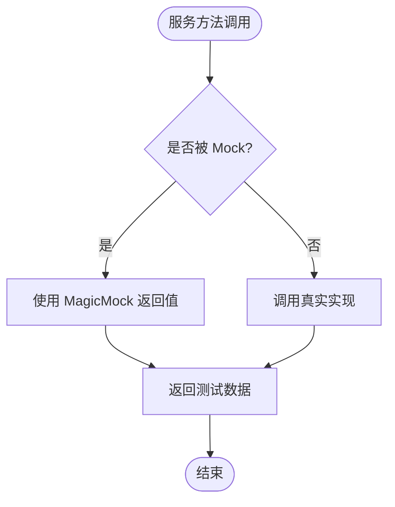
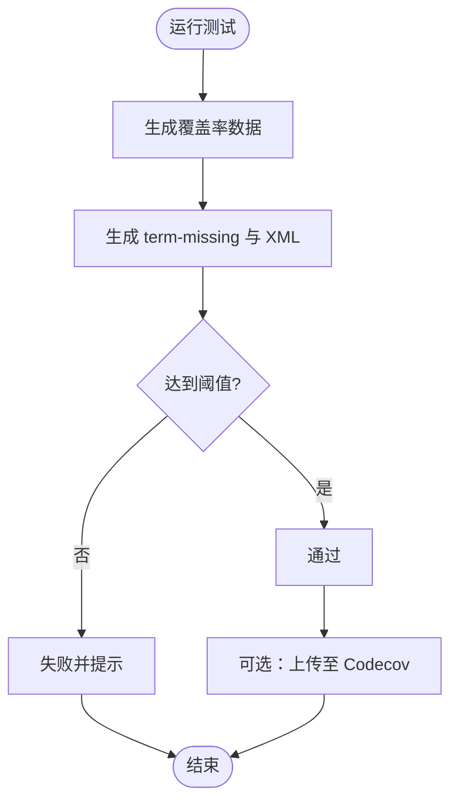
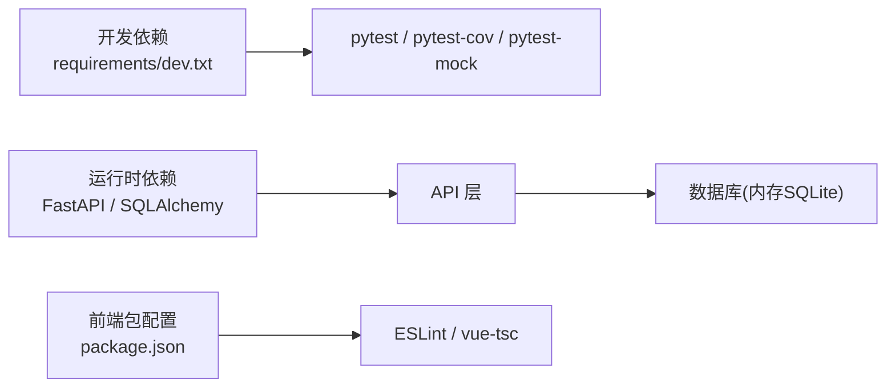

# 测试与质量

<cite>
**本文引用的文件**
- [pytest.ini](file://pytest.ini)
- [.coveragerc](file://.coveragerc)
- [pyproject.toml](file://pyproject.toml)
- [Makefile](file://Makefile)
- [.pre-commit-config.yaml](file://.pre-commit-config.yaml)
- [tests/conftest.py](file://tests/conftest.py)
- [tests/backend/conftest.py](file://tests/backend/conftest.py)
- [tests/backend/api/conftest.py](file://tests/backend/api/conftest.py)
- [.github/workflows/test.yml](file://.github/workflows/test.yml)
- [.github/workflows/ci.yml](file://.github/workflows/ci.yml)
- [web/app/package.json](file://web/app/package.json)
- [web/admin/package.json](file://web/admin/package.json)
</cite>

## 目录
1. [简介](#简介)
2. [项目结构](#项目结构)
3. [核心组件](#核心组件)
4. [架构总览](#架构总览)
5. [详细组件分析](#详细组件分析)
6. [依赖分析](#依赖分析)
7. [性能考虑](#性能考虑)
8. [故障排查指南](#故障排查指南)
9. [结论](#结论)
10. [附录](#附录)

## 简介
本文件为 Subskin 项目的测试与质量保证指南，覆盖单元测试、集成测试、端到端（E2E）测试策略；说明 pytest 框架使用、Mock 对象创建、数据库测试环境与覆盖率统计；并给出代码质量检查工具配置（ruff、mypy、ESLint、vue-tsc）、测试用例编写规范、持续集成配置与质量门禁设置。目标是帮助开发者在本地与 CI 中稳定、高效地保障代码质量与功能正确性。

## 项目结构
Subskin 的测试与质量相关基础设施主要分布在以下位置：
- Python 测试与覆盖率：根目录 tests/、pytest.ini、.coveragerc、pyproject.toml、Makefile
- 后端 API 测试夹具：tests/backend/api/conftest.py、tests/backend/conftest.py、tests/conftest.py
- 持续集成：.github/workflows/test.yml、.github/workflows/ci.yml
- 前端类型检查与构建：web/app/package.json、web/admin/package.json（用于 ESLint、vue-tsc 等）

图表来源
- [pytest.ini:1-8](file://pytest.ini#L1-L8)
- [.coveragerc:1-10](file://.coveragerc#L1-L10)
- [pyproject.toml:37-52](file://pyproject.toml#L37-L52)
- [Makefile:56-77](file://Makefile#L56-L77)
- [tests/backend/api/conftest.py:28-64](file://tests/backend/api/conftest.py#L28-L64)
- [tests/backend/conftest.py:38-57](file://tests/backend/conftest.py#L38-L57)
- [tests/conftest.py:20-54](file://tests/conftest.py#L20-L54)
- [web/app/package.json](file://web/app/package.json)
- [web/admin/package.json](file://web/admin/package.json)

章节来源
- [pytest.ini:1-8](file://pytest.ini#L1-L8)
- [.coveragerc:1-10](file://.coveragerc#L1-L10)
- [pyproject.toml:37-52](file://pyproject.toml#L37-L52)
- [Makefile:56-77](file://Makefile#L56-L77)

## 核心组件
- 测试运行器与覆盖率
  - pytest 作为统一测试入口，启用异步模式、收集 tests 目录、输出缺失行与 XML 报告，并设置最低覆盖率阈值。
  - coverage 通过 .coveragerc 排除特定模块，并在报告阶段设置 fail_under 阈值。
- 数据库测试环境
  - 使用 SQLAlchemy 内存 SQLite + StaticPool，确保并发安全与快速隔离。
  - API 测试通过 FastAPI TestClient 注入自定义 get_db 依赖，实现请求级数据库会话。
- Mock 与外部依赖
  - 提供 HTTP 响应模拟、OpenAI 客户端模拟、短信发送模拟等，避免真实网络调用。
- 质量检查与格式化
  - ruff 进行 lint 与格式检查；mypy 进行静态类型检查；pre-commit 钩子包含敏感信息检测。
- 前端类型检查
  - 通过 web/app 与 web/admin 的 package.json 管理 ESLint、vue-tsc 等工具链（具体脚本以各自 package.json 为准）。

章节来源
- [pytest.ini:1-8](file://pytest.ini#L1-L8)
- [.coveragerc:1-10](file://.coveragerc#L1-L10)
- [tests/backend/api/conftest.py:28-64](file://tests/backend/api/conftest.py#L28-L64)
- [tests/backend/conftest.py:38-57](file://tests/backend/conftest.py#L38-L57)
- [tests/conftest.py:20-54](file://tests/conftest.py#L20-L54)
- [.pre-commit-config.yaml:1-15](file://.pre-commit-config.yaml#L1-L15)

## 架构总览
下图展示了从提交到质量门禁的完整流程：lint、类型检查、测试与覆盖率上报，以及前端类型检查在 CI 中的集成点。

图表来源
- [.github/workflows/test.yml:22-41](file://.github/workflows/test.yml#L22-L41)
- [.github/workflows/ci.yml:24-51](file://.github/workflows/ci.yml#L24-L51)
- [.pre-commit-config.yaml:1-15](file://.pre-commit-config.yaml#L1-L15)

## 详细组件分析

### 单元测试（Python）
- 目标
  - 验证业务逻辑、数据处理、工具函数等单元行为。
- 实践要点
  - 使用 pytest 收集 tests 目录下的测试用例。
  - 通过 fixtures 提供可复用的测试数据与环境。
  - 对第三方依赖使用 unittest.mock.patch 或 pytest-mock 进行替换。
- 示例夹具
  - 临时缓存数据库、HTTP 响应模拟、样本论文/试验数据等。

图表来源
- [tests/conftest.py:20-54](file://tests/conftest.py#L20-L54)
- [tests/conftest.py:57-115](file://tests/conftest.py#L57-L115)

章节来源
- [tests/conftest.py:20-115](file://tests/conftest.py#L20-L115)

### 集成测试（后端 API）
- 目标
  - 验证 FastAPI 路由、鉴权、数据库交互与服务层协作。
- 实践要点
  - 使用 FastAPI TestClient 发起请求。
  - 通过依赖注入覆盖 get_db，指向内存 SQLite 会话。
  - 提供用户、管理员、评论、文档等夹具，构造典型场景。
- 关键流程
  - 每个测试函数获得独立 db_session，测试结束后清理表结构。

图表来源
- [tests/backend/api/conftest.py:28-64](file://tests/backend/api/conftest.py#L28-L64)
- [tests/backend/api/conftest.py:67-203](file://tests/backend/api/conftest.py#L67-L203)

章节来源
- [tests/backend/api/conftest.py:28-203](file://tests/backend/api/conftest.py#L28-L203)

### 服务层测试（含 Mock）
- 目标
  - 验证服务层逻辑，如认证、短信、RAG 等，屏蔽外部系统。
- 实践要点
  - 使用 patch 替换 OpenAI 客户端、短信发送函数等。
  - 通过环境变量默认值保证导入时不报错。
- 示例
  - mock_openai_client：模拟 embeddings 与 chat completions。
  - mock_sms_send：模拟短信发送成功。

图表来源
- [tests/backend/conftest.py:215-242](file://tests/backend/conftest.py#L215-L242)
- [tests/backend/conftest.py:5-15](file://tests/backend/conftest.py#L5-L15)

章节来源
- [tests/backend/conftest.py:5-15](file://tests/backend/conftest.py#L5-L15)
- [tests/backend/conftest.py:215-242](file://tests/backend/conftest.py#L215-L242)

### 端到端测试（E2E）
- 现状与建议
  - 当前仓库未包含显式的浏览器级 E2E 测试套件。建议基于 Playwright 或 Cypress 针对关键用户路径（登录、社区发帖、VASI 测评、图片标注）编写 E2E 用例。
  - 可在 CI 中新增 job 启动前端与后端服务，执行 E2E 用例并生成截图/视频报告。
- 与现有集成测试的关系
  - 集成测试已覆盖 API 层与数据库交互；E2E 将补充 UI 交互与跨页面流程。

[本节为概念性内容，不直接分析具体文件]

### 覆盖率统计
- 配置
  - pytest 默认输出缺失行与 XML 报告，并设置最低覆盖率阈值。
  - .coveragerc 排除部分模型与管理器模块，报告阶段设置 fail_under。
- 执行
  - 本地可通过 Makefile 或 pytest 命令运行；CI 中上传至 Codecov。

图表来源
- [pytest.ini:1-8](file://pytest.ini#L1-L8)
- [.coveragerc:1-10](file://.coveragerc#L1-L10)
- [.github/workflows/test.yml:33-41](file://.github/workflows/test.yml#L33-L41)

章节来源
- [pytest.ini:1-8](file://pytest.ini#L1-L8)
- [.coveragerc:1-10](file://.coveragerc#L1-L10)
- [.github/workflows/test.yml:33-41](file://.github/workflows/test.yml#L33-L41)

### 代码质量检查工具
- Python
  - ruff：lint 与格式检查，已在 Makefile 与 CI 中启用。
  - mypy：静态类型检查，已在 Makefile 与 CI 中启用。
  - pre-commit：敏感信息检测（detect-secrets），在提交前拦截潜在密钥泄露。
- 前端
  - ESLint：JavaScript/TypeScript 代码风格与错误检查（由各自 package.json 管理）。
  - vue-tsc：Vue 单文件组件类型检查（由各自 package.json 管理）。

章节来源
- [Makefile:61-77](file://Makefile#L61-L77)
- [.github/workflows/ci.yml:31-37](file://.github/workflows/ci.yml#L31-L37)
- [.pre-commit-config.yaml:1-15](file://.pre-commit-config.yaml#L1-L15)
- [web/app/package.json](file://web/app/package.json)
- [web/admin/package.json](file://web/admin/package.json)

## 依赖分析
- 测试依赖
  - pytest、pytest-cov、pytest-mock 等开发依赖在 requirements/dev.txt 中声明。
- 运行时依赖
  - FastAPI、SQLAlchemy、Pydantic 等在后端依赖中声明，测试通过内存 SQLite 与 TestClient 解耦。
- 前端依赖
  - 通过 web/app 与 web/admin 的 package.json 管理构建与类型检查工具。

图表来源
- [requirements/dev.txt:1-46](file://requirements/dev.txt#L1-L46)
- [tests/backend/api/conftest.py:28-64](file://tests/backend/api/conftest.py#L28-L64)
- [web/app/package.json](file://web/app/package.json)
- [web/admin/package.json](file://web/admin/package.json)

章节来源
- [requirements/dev.txt:1-46](file://requirements/dev.txt#L1-L46)
- [tests/backend/api/conftest.py:28-64](file://tests/backend/api/conftest.py#L28-L64)
- [web/app/package.json](file://web/app/package.json)
- [web/admin/package.json](file://web/admin/package.json)

## 性能考虑
- 数据库测试
  - 使用内存 SQLite + StaticPool，避免磁盘 IO 与连接开销，提升测试速度。
- 覆盖率采集
  - 仅对 src 目录采集，减少无关文件影响；必要时通过 .coveragerc 排除大文件或只读模块。
- 并行执行
  - 可结合 pytest-xdist 并行运行测试，缩短反馈时间（需确保测试间无共享状态）。
- 前端类型检查
  - 增量编译与缓存可减少构建时间；建议在 CI 中缓存 node_modules 与 TypeScript 构建产物。

[本节提供一般性指导，不直接分析具体文件]

## 故障排查指南
- 导入时报错缺少环境变量
  - 后端服务在导入时读取 SECRET_KEY、ALGORITHM、SMS_PROVIDER 等，测试夹具已在 conftest 中设置默认值，避免 KeyError。
- 数据库连接问题
  - 确认使用内存 SQLite 且线程参数正确；API 测试通过依赖注入覆盖 get_db。
- 覆盖率未达标
  - 检查 pytest.ini 与 .coveragerc 的阈值配置；必要时调整 exclude 列表或补充用例。
- CI 失败
  - 查看 GitHub Actions 日志，定位 ruff/mypy/pytest 的具体失败步骤；确保依赖安装与命令一致。

章节来源
- [tests/backend/conftest.py:5-15](file://tests/backend/conftest.py#L5-L15)
- [tests/backend/api/conftest.py:28-64](file://tests/backend/api/conftest.py#L28-L64)
- [pytest.ini:1-8](file://pytest.ini#L1-L8)
- [.coveragerc:1-10](file://.coveragerc#L1-L10)
- [.github/workflows/test.yml:22-41](file://.github/workflows/test.yml#L22-L41)
- [.github/workflows/ci.yml:24-51](file://.github/workflows/ci.yml#L24-L51)

## 结论
Subskin 已建立较为完善的 Python 测试与质量保障体系：pytest 驱动单元测试与集成测试，内存 SQLite 与 TestClient 提供稳定的后端测试环境；ruff 与 mypy 保障代码风格与类型安全；CI 流水线集成 lint、类型检查、测试与覆盖率上报。建议后续补充前端 E2E 测试与更细粒度的质量门禁（如覆盖率阈值、变更影响范围扫描），进一步提升交付质量与稳定性。

[本节为总结性内容，不直接分析具体文件]

## 附录
- 常用命令
  - 运行测试：make test 或 pytest
  - 代码检查：make lint（ruff）
  - 类型检查：make type-check（mypy）
  - 格式化：make format（ruff format）
- 覆盖率
  - 本地：pytest --cov=src --cov-report=term-missing
  - CI：自动生成 coverage.xml 并上传至 Codecov
- 前端质量
  - 在 web/app 与 web/admin 目录下执行各自的 lint 与类型检查脚本（以 package.json 为准）

章节来源
- [Makefile:56-77](file://Makefile#L56-L77)
- [.github/workflows/test.yml:33-41](file://.github/workflows/test.yml#L33-L41)
- [web/app/package.json](file://web/app/package.json)
- [web/admin/package.json](file://web/admin/package.json)