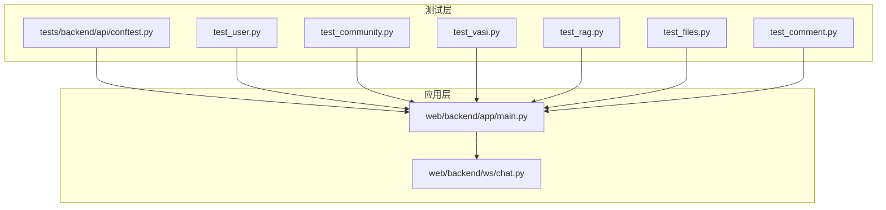
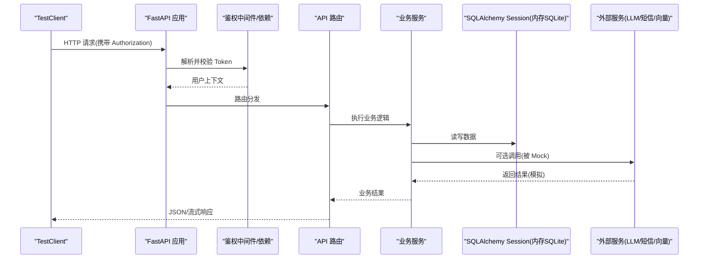
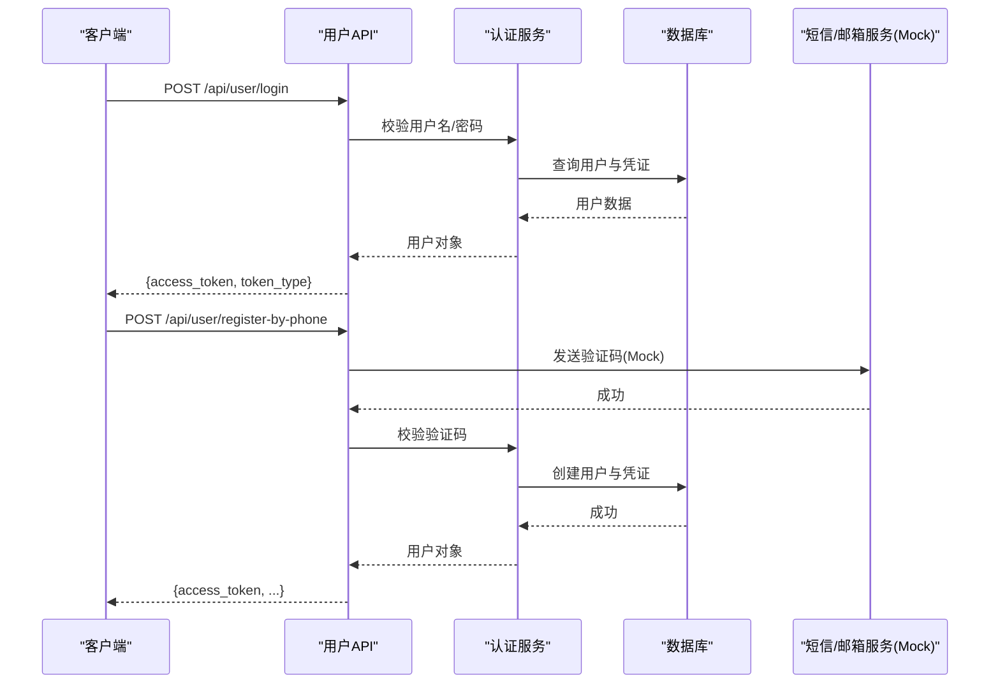
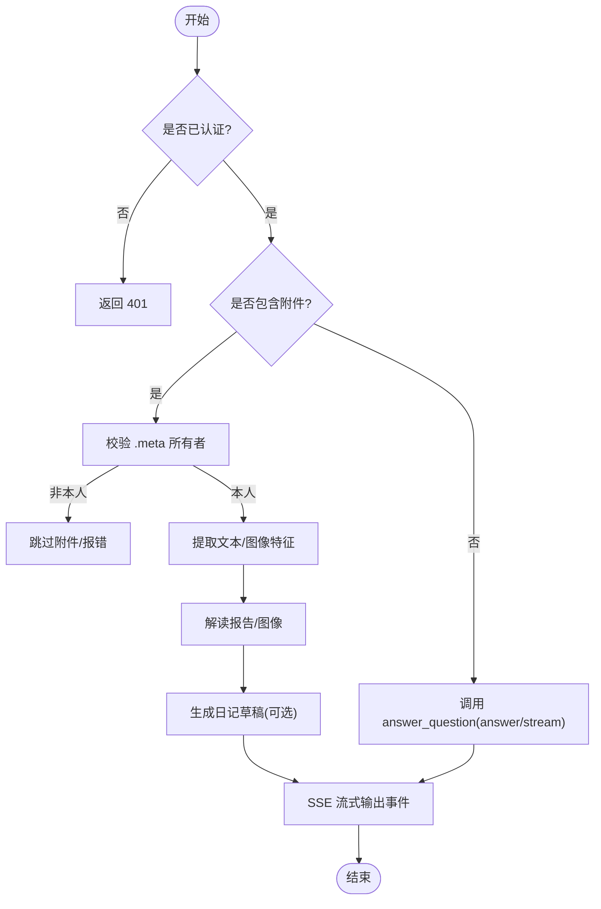
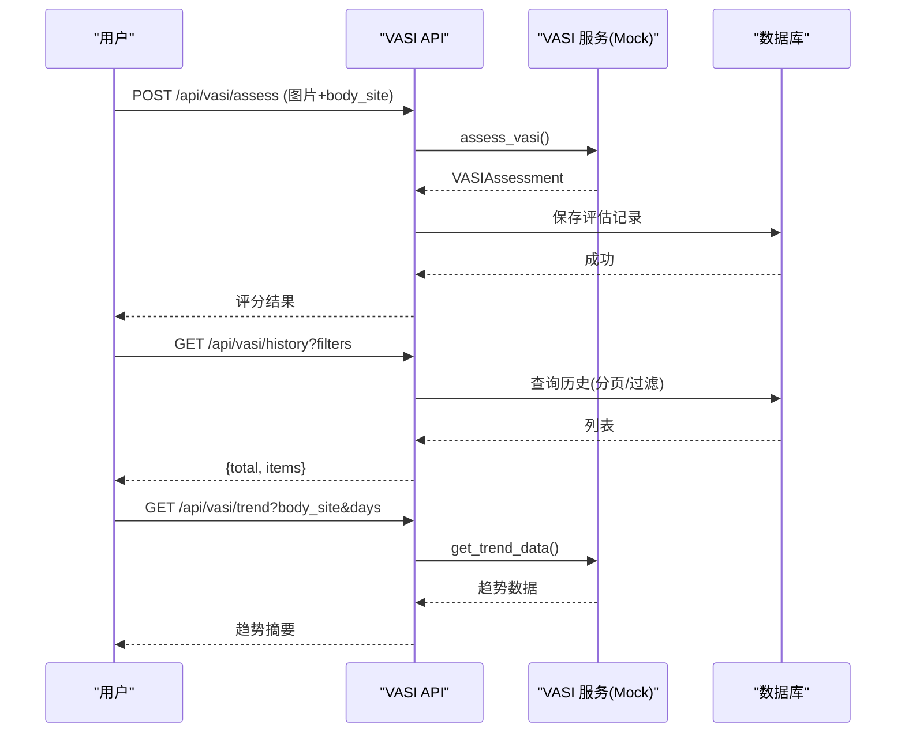
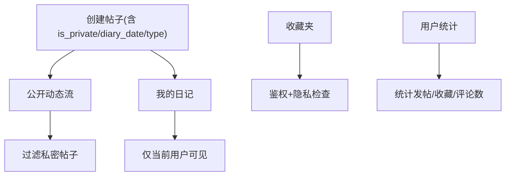
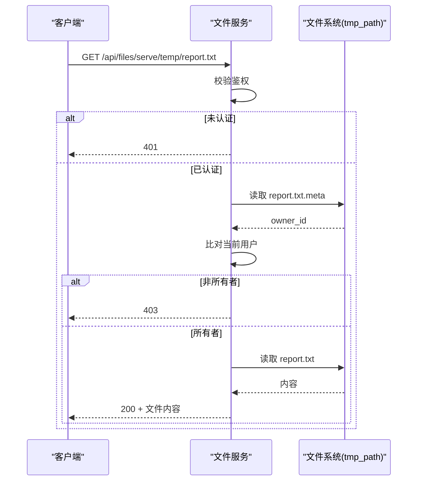
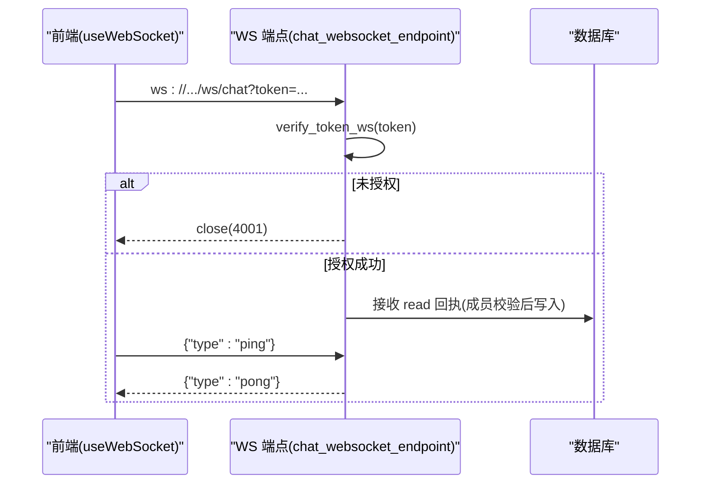
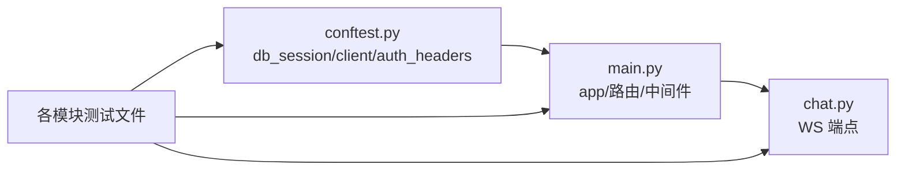

# 集成测试

<cite>
**本文引用的文件**
- [tests/backend/api/conftest.py](file://tests/backend/api/conftest.py)
- [tests/backend/conftest.py](file://tests/backend/conftest.py)
- [web/backend/app/main.py](file://web/backend/app/main.py)
- [web/backend/ws/chat.py](file://web/backend/ws/chat.py)
- [tests/backend/api/test_user.py](file://tests/backend/api/test_user.py)
- [tests/backend/api/test_community.py](file://tests/backend/api/test_community.py)
- [tests/backend/api/test_vasi.py](file://tests/backend/api/test_vasi.py)
- [tests/backend/api/test_rag.py](file://tests/backend/api/test_rag.py)
- [tests/backend/api/test_files.py](file://tests/backend/api/test_files.py)
- [tests/backend/api/test_comment.py](file://tests/backend/api/test_comment.py)
- [web/app/src/composables/useWebSocket.ts](file://web/app/src/composables/useWebSocket.ts)
</cite>

## 目录
1. [简介](#简介)
2. [项目结构](#项目结构)
3. [核心组件](#核心组件)
4. [架构总览](#架构总览)
5. [详细组件分析](#详细组件分析)
6. [依赖关系分析](#依赖关系分析)
7. [性能考虑](#性能考虑)
8. [故障排查指南](#故障排查指南)
9. [结论](#结论)
10. [附录](#附录)

## 简介
本文件面向 Subskin 项目的后端集成测试，聚焦以下目标：
- API 接口测试：覆盖用户认证、社区内容、VASI 评估、AI 问答（RAG）、文件上传下载等。
- 数据库集成测试：基于内存 SQLite + SQLAlchemy 的会话隔离与数据准备策略。
- 外部服务模拟：通过 mock/patch 屏蔽 LLM、短信、向量检索等外部依赖。
- FastAPI TestClient 使用：统一客户端、依赖注入替换、请求构造与响应断言。
- WebSocket 连接测试：结合前端 composable 与服务端 WS 处理逻辑进行端到端验证思路。
- 认证授权流程：JWT 令牌生成与校验、角色权限、临时文件归属校验。
- 完整用例示例：涵盖注册登录、AI 问答、VASI 评估、社区功能等核心业务流程。

## 项目结构
测试组织采用分层 fixtures 与按模块划分的测试文件：
- 共享 fixtures：提供数据库会话、测试用户、鉴权头、环境变量等。
- API 测试：按业务域划分（user、community、vasi、rag、files、comment）。
- 应用入口：FastAPI 应用装配、CORS、路由挂载、WS 端点注册。
- WebSocket：服务端连接管理、消息处理、读回执写入。

图表来源
- [tests/backend/api/conftest.py:1-65](file://tests/backend/api/conftest.py#L1-L65)
- [web/backend/app/main.py:22-63](file://web/backend/app/main.py#L22-L63)
- [web/backend/ws/chat.py:14-51](file://web/backend/ws/chat.py#L14-L51)

章节来源
- [tests/backend/api/conftest.py:1-65](file://tests/backend/api/conftest.py#L1-L65)
- [web/backend/app/main.py:22-63](file://web/backend/app/main.py#L22-L63)

## 核心组件
- 测试客户端与数据库会话
  - 使用 FastAPI TestClient 包裹应用，并通过 dependency_overrides 将 get_db 替换为内存 SQLite 会话，确保每个测试函数拥有独立、可回滚的数据环境。
  - 通过 StaticPool 避免多线程下 SQLite 的连接问题。
- 鉴权与测试用户
  - 提供 test_user/admin_user 与 auth_headers/admin_headers fixture，便于构造带 JWT 的请求。
- 外部服务模拟
  - 对 RAG、VASI、短信发送等外部依赖使用 unittest.mock.patch 或 AsyncMock 进行隔离，保证测试稳定与快速。
- 文件与临时存储
  - 通过 monkeypatch 切换工作目录到 tmp_path，配合 .meta 侧车文件实现临时文件的所有权校验与清理测试。

章节来源
- [tests/backend/api/conftest.py:28-65](file://tests/backend/api/conftest.py#L28-L65)
- [tests/backend/api/conftest.py:67-203](file://tests/backend/api/conftest.py#L67-L203)
- [tests/backend/conftest.py:38-57](file://tests/backend/conftest.py#L38-L57)
- [tests/backend/conftest.py:60-131](file://tests/backend/conftest.py#L60-L131)
- [tests/backend/conftest.py:215-242](file://tests/backend/conftest.py#L215-L242)

## 架构总览
下图展示从测试客户端发起请求到后端路由、服务层、数据库以及外部服务的调用链，并体现鉴权与资源隔离。

图表来源
- [tests/backend/api/conftest.py:51-65](file://tests/backend/api/conftest.py#L51-L65)
- [web/backend/app/main.py:22-63](file://web/backend/app/main.py#L22-L63)
- [tests/backend/conftest.py:38-57](file://tests/backend/conftest.py#L38-L57)

## 详细组件分析

### 认证与用户注册登录流程测试
- 覆盖场景
  - 用户名密码登录成功/失败、缺失字段校验。
  - 获取当前用户信息（鉴权通过/未通过/无效令牌）。
  - 邮箱/手机号注册与验证码流程（mock 验证码服务）。
  - 绑定/解绑凭证、设置密码、重置密码等安全操作。
- 关键要点
  - 使用 auth_headers 注入 Bearer Token。
  - 通过 patch 验证码相关函数，避免真实短信/邮件发送。
  - 断言数据库状态变化（如 UserCredential 记录）。

图表来源
- [tests/backend/api/test_user.py:37-170](file://tests/backend/api/test_user.py#L37-L170)
- [tests/backend/api/test_user.py:172-344](file://tests/backend/api/test_user.py#L172-L344)
- [tests/backend/api/test_user.py:346-584](file://tests/backend/api/test_user.py#L346-L584)

章节来源
- [tests/backend/api/test_user.py:37-170](file://tests/backend/api/test_user.py#L37-L170)
- [tests/backend/api/test_user.py:172-344](file://tests/backend/api/test_user.py#L172-L344)
- [tests/backend/api/test_user.py:346-584](file://tests/backend/api/test_user.py#L346-L584)

### AI 问答（RAG）集成测试
- 覆盖场景
  - 私有与公开问答接口鉴权控制。
  - 参数校验（question 必填等）。
  - 临时文件上传与所有权校验（.meta 侧车文件）。
  - 流式回答（SSE）事件断言：思考阶段、文档解读卡片、日记草稿卡片、完成事件。
  - 图片附件 VASI 风险等级卡片。
- 关键要点
  - 使用 patch 答案生成、文档检索、报告解读、日记草稿生成等外部能力。
  - 通过 tmp_path 模拟文件系统，验证上传路径、大小、MIME 类型与元数据。
  - SSE 事件解析工具函数用于拆分 data: 行并断言事件序列。

图表来源
- [tests/backend/api/test_rag.py:28-210](file://tests/backend/api/test_rag.py#L28-L210)
- [tests/backend/api/test_rag.py:212-310](file://tests/backend/api/test_rag.py#L212-L310)
- [tests/backend/api/test_rag.py:312-474](file://tests/backend/api/test_rag.py#L312-L474)
- [web/backend/api/rag.py:684-714](file://web/backend/api/rag.py#L684-L714)

章节来源
- [tests/backend/api/test_rag.py:28-210](file://tests/backend/api/test_rag.py#L28-L210)
- [tests/backend/api/test_rag.py:212-310](file://tests/backend/api/test_rag.py#L212-L310)
- [tests/backend/api/test_rag.py:312-474](file://tests/backend/api/test_rag.py#L312-L474)
- [web/backend/api/rag.py:684-714](file://web/backend/api/rag.py#L684-L714)

### VASI 评估集成测试
- 覆盖场景
  - 上传图片进行 VASI 评分（鉴权、图片格式、身体部位校验）。
  - 历史查询（分页、过滤、limit 上限）。
  - 单条评估详情（不存在时 404）。
  - 趋势数据（按部位、天数范围限制）。
- 关键要点
  - 通过 patch VASIService，返回预定义评估对象，避免真实模型推理。
  - 使用 multipart/form-data 构造图片上传请求。
  - 断言参数边界（days 最大 365、最小 1；limit 最大 50）。

图表来源
- [tests/backend/api/test_vasi.py:13-139](file://tests/backend/api/test_vasi.py#L13-L139)
- [tests/backend/api/test_vasi.py:141-226](file://tests/backend/api/test_vasi.py#L141-L226)
- [tests/backend/api/test_vasi.py:228-416](file://tests/backend/api/test_vasi.py#L228-L416)

章节来源
- [tests/backend/api/test_vasi.py:13-139](file://tests/backend/api/test_vasi.py#L13-L139)
- [tests/backend/api/test_vasi.py:141-226](file://tests/backend/api/test_vasi.py#L141-L226)
- [tests/backend/api/test_vasi.py:228-416](file://tests/backend/api/test_vasi.py#L228-L416)

### 社区功能集成测试
- 覆盖场景
  - 私密/公开帖子发布与可见性控制。
  - 我的日记仅返回当前用户的私密条目。
  - 收藏夹访问鉴权与隐私控制。
  - 用户统计（发帖、收藏、评论计数）。
  - 日记日历接口（按月聚合、空月处理、鉴权）。
- 关键要点
  - 通过自定义 helper 生成分类与用户，构造不同隐私状态的帖子。
  - 使用 create_access_token 构造不同用户的鉴权头，验证跨用户隔离。

图表来源
- [tests/backend/api/test_community.py:58-164](file://tests/backend/api/test_community.py#L58-L164)
- [tests/backend/api/test_community.py:166-234](file://tests/backend/api/test_community.py#L166-L234)
- [tests/backend/api/test_community.py:236-358](file://tests/backend/api/test_community.py#L236-L358)

章节来源
- [tests/backend/api/test_community.py:58-164](file://tests/backend/api/test_community.py#L58-L164)
- [tests/backend/api/test_community.py:166-234](file://tests/backend/api/test_community.py#L166-L234)
- [tests/backend/api/test_community.py:236-358](file://tests/backend/api/test_community.py#L236-L358)

### 文件上传下载与临时文件清理测试
- 覆盖场景
  - 文件服务需要鉴权，未认证返回 401。
  - 已认证用户可读取其拥有的临时文件（通过 .meta 校验）。
  - 非所有者访问被拒绝（403）。
  - 清理接口仅删除过期文件，保留新近文件。
  - CORS 配置断言（生产/预发/本地开发源）。
- 关键要点
  - 使用 monkeypatch 切换工作目录到 tmp_path，确保路径可控。
  - 通过 .meta 文件记录文件所有者，严格校验访问者身份。

图表来源
- [tests/backend/api/test_files.py:21-68](file://tests/backend/api/test_files.py#L21-L68)
- [tests/backend/api/test_files.py:70-97](file://tests/backend/api/test_files.py#L70-L97)
- [tests/backend/api/test_files.py:99-116](file://tests/backend/api/test_files.py#L99-L116)

章节来源
- [tests/backend/api/test_files.py:21-68](file://tests/backend/api/test_files.py#L21-L68)
- [tests/backend/api/test_files.py:70-97](file://tests/backend/api/test_files.py#L70-L97)
- [tests/backend/api/test_files.py:99-116](file://tests/backend/api/test_files.py#L99-L116)

### 评论功能集成测试
- 覆盖场景
  - 按页面获取评论（仅已审核）。
  - 新增评论需鉴权，未审核默认 pending。
  - 缺失字段校验（content/page_path）。
- 关键要点
  - 直接走真实服务层与数据库查询，验证 approved 过滤逻辑。

章节来源
- [tests/backend/api/test_comment.py:10-79](file://tests/backend/api/test_comment.py#L10-L79)
- [tests/backend/api/test_comment.py:81-145](file://tests/backend/api/test_comment.py#L81-L145)

### WebSocket 连接测试（前后端协作）
- 前端行为
  - useWebSocket 在存在 token 时建立 ws/wss 连接，周期性发送 ping。
- 服务端行为
  - chat_websocket_endpoint 校验 token，接受连接，维护活跃连接表。
  - 支持 ping/pong 心跳，read 回执写入数据库（成员校验）。
- 测试建议
  - 使用 pytest-asyncio + httpx.AsyncClient 或 websockets 库建立真实 WS 连接。
  - 复用 conftest 中的鉴权头生成逻辑，构造合法 token 作为查询参数。
  - 断言连接建立、心跳响应、读回执落库。

图表来源
- [web/app/src/composables/useWebSocket.ts:11-42](file://web/app/src/composables/useWebSocket.ts#L11-L42)
- [web/backend/ws/chat.py:45-111](file://web/backend/ws/chat.py#L45-L111)

章节来源
- [web/app/src/composables/useWebSocket.ts:11-42](file://web/app/src/composables/useWebSocket.ts#L11-L42)
- [web/backend/ws/chat.py:45-111](file://web/backend/ws/chat.py#L45-L111)

## 依赖关系分析
- 测试夹具与应用入口
  - tests/backend/api/conftest.py 通过 app.dependency_overrides[get_db] 注入内存数据库会话，使所有路由在测试中均指向同一引擎。
  - web/backend/app/main.py 加载 .env、注册路由、初始化数据库表、启动临时文件清理任务。
- 外部依赖隔离
  - RAG、VASI、短信等服务通过 patch/AsyncMock 隔离，避免网络与第三方服务波动影响测试稳定性。
- 数据一致性
  - 每个测试函数结束后关闭 session 并 drop_all，确保测试间完全隔离。

图表来源
- [tests/backend/api/conftest.py:28-65](file://tests/backend/api/conftest.py#L28-L65)
- [web/backend/app/main.py:22-63](file://web/backend/app/main.py#L22-L63)
- [web/backend/ws/chat.py:45-51](file://web/backend/ws/chat.py#L45-L51)

章节来源
- [tests/backend/api/conftest.py:28-65](file://tests/backend/api/conftest.py#L28-L65)
- [web/backend/app/main.py:22-63](file://web/backend/app/main.py#L22-L63)

## 性能考虑
- 使用内存 SQLite 与 StaticPool，避免磁盘 IO 与连接竞争，提升测试执行速度。
- 通过 patch 外部服务，消除网络延迟与限流影响。
- 合理设置 limit/max_days 等参数边界，防止大数据量查询拖慢测试。
- 流式 SSE 测试仅断言事件结构与关键字段，避免全量响应比较。

## 故障排查指南
- 导入时报 SECRET_KEY 缺失
  - 已在 conftest 顶部 setdefault 环境变量，若仍报错，检查是否在导入前被覆盖。
- 数据库表未创建
  - 确认 db_session fixture 已调用 Base.metadata.create_all 且 bind 正确。
- 鉴权失败
  - 检查 auth_headers 是否正确生成，Token 是否包含必要 claims（sub、type）。
- 临时文件无法读取
  - 确认 .meta 文件存在且 owner_id 与当前用户一致；检查工作目录是否通过 monkeypatch 切换到 tmp_path。
- WebSocket 连接失败
  - 确认 token 有效；服务端 verify_token_ws 返回用户对象；前端协议选择 ws/wss 正确。

章节来源
- [tests/backend/api/conftest.py:1-12](file://tests/backend/api/conftest.py#L1-L12)
- [tests/backend/api/conftest.py:28-65](file://tests/backend/api/conftest.py#L28-L65)
- [tests/backend/api/test_files.py:21-68](file://tests/backend/api/test_files.py#L21-L68)
- [web/backend/ws/chat.py:45-51](file://web/backend/ws/chat.py#L45-L51)

## 结论
Subskin 的集成测试体系以 FastAPI TestClient 为核心，结合内存数据库与全面的 mock 策略，覆盖了认证、社区、VASI、RAG、文件与 WS 等关键链路。通过清晰的 fixtures 与严格的断言，既保证了测试的稳定性与可重复性，也提供了对复杂业务流程（如临时文件归属、SSE 事件流）的可靠验证手段。建议在持续集成中保持该模式，并逐步扩展更多端到端场景。

## 附录
- 运行建议
  - 使用 pytest 运行 tests/backend 目录下的测试，确保环境变量已设置。
  - 如需单独运行某模块，可使用 -k 筛选器。
- 扩展方向
  - 增加并发测试与压力测试，关注 WS 连接管理与临时文件清理的健壮性。
  - 引入更丰富的外部服务契约测试（如 LLM 返回结构变更时的兼容性）。