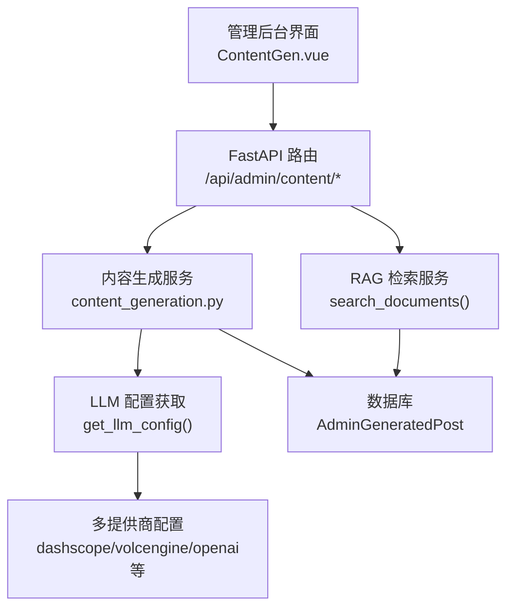
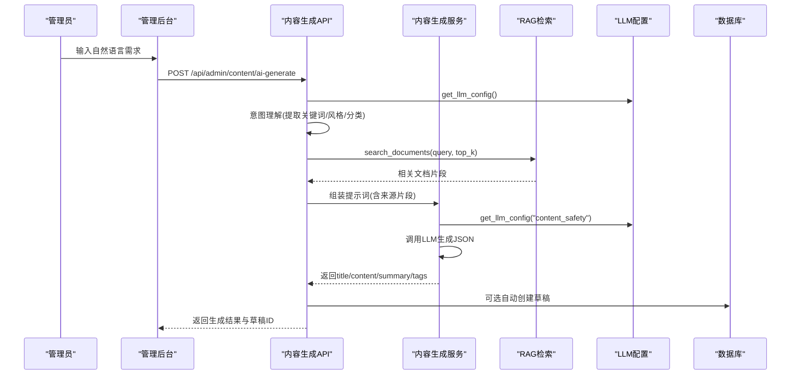
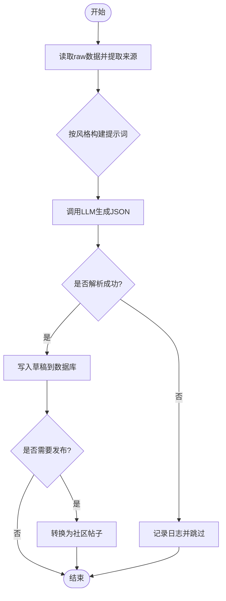
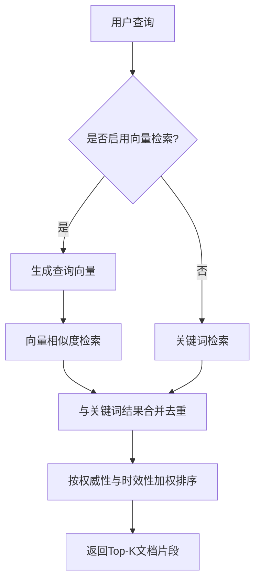
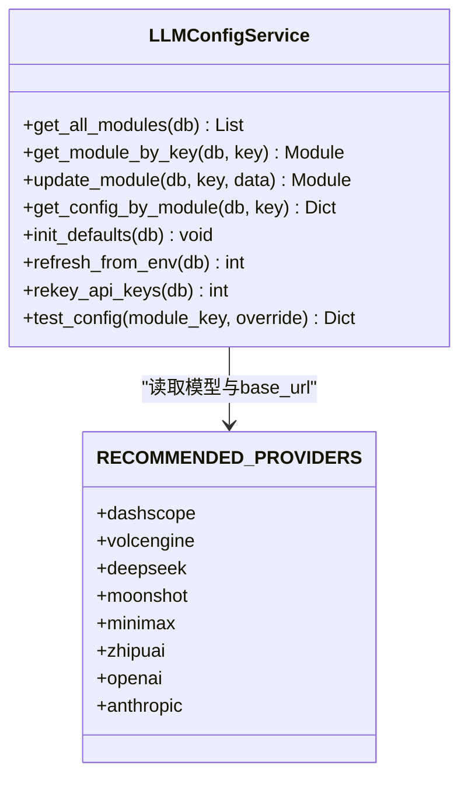
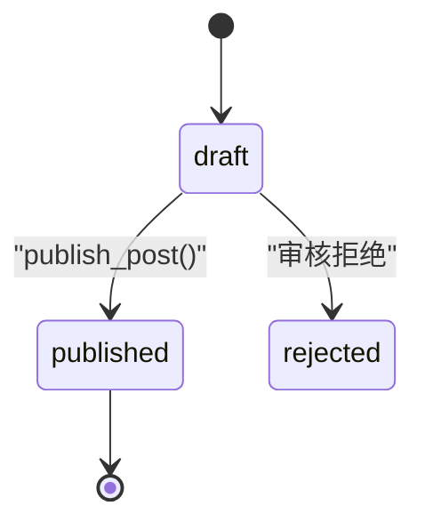
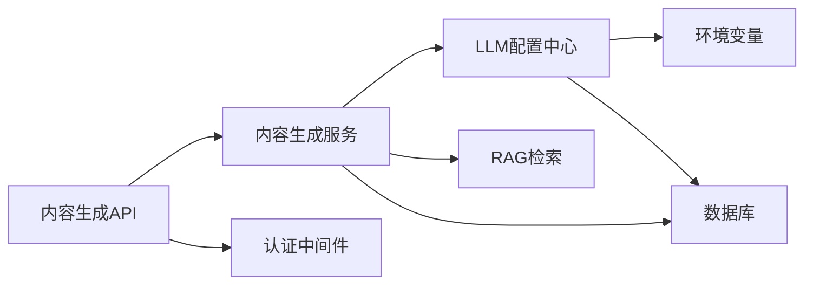

# AI内容生成

<cite>
**本文引用的文件**
- [web/backend/api/content_generation_admin.py](file://web/backend/api/content_generation_admin.py)
- [web/backend/services/content_generation.py](file://web/backend/services/content_generation.py)
- [web/backend/utils/llm_config.py](file://web/backend/utils/llm_config.py)
- [web/backend/services/llm_config_service.py](file://web/backend/services/llm_config_service.py)
- [web/backend/services/rag.py](file://web/backend/services/rag.py)
- [web/backend/database/models.py](file://web/backend/database/models.py)
- [configs/web_config.yaml](file://configs/web_config.yaml)
- [web/admin/src/views/ContentGen.vue](file://web/admin/src/views/ContentGen.vue)
- [docs/MEDICAL_ENCYCLOPEDIA_DESIGN.md](file://docs/MEDICAL_ENCYCLOPEDIA_DESIGN.md)
</cite>

## 目录
1. [简介](#简介)
2. [项目结构](#项目结构)
3. [核心组件](#核心组件)
4. [架构总览](#架构总览)
5. [详细组件分析](#详细组件分析)
6. [依赖关系分析](#依赖关系分析)
7. [性能与可靠性](#性能与可靠性)
8. [故障排查指南](#故障排查指南)
9. [结论](#结论)
10. [附录：API与配置清单](#附录api与配置清单)

## 简介
本技术文档围绕 Subskin 百科知识库的“AI内容生成功能”展开，系统说明基于大语言模型的内容自动生成、质量评估与优化机制。重点覆盖提示词工程、上下文管理、输出格式化策略；多模型支持与负载均衡/故障转移；内容生成 API 接口、参数与结果处理流程；如何集成不同 LLM 提供商、配置 API 密钥与管理调用配额；以及内容质量控制、事实核查与医学准确性验证方法。

## 项目结构
该功能由“管理员内容生成 API + 内容生成服务 + RAG 检索 + LLM 配置中心 + 数据库草稿/发布”构成，前端通过管理后台触发生成并查看草稿。

图表来源
- [web/admin/src/views/ContentGen.vue:1-31](file://web/admin/src/views/ContentGen.vue#L1-L31)
- [web/backend/api/content_generation_admin.py:1-549](file://web/backend/api/content_generation_admin.py#L1-L549)
- [web/backend/services/content_generation.py:1-425](file://web/backend/services/content_generation.py#L1-L425)
- [web/backend/services/rag.py:456-522](file://web/backend/services/rag.py#L456-L522)
- [web/backend/utils/llm_config.py:1-153](file://web/backend/utils/llm_config.py#L1-L153)
- [web/backend/database/models.py:1086-1110](file://web/backend/database/models.py#L1086-L1110)

章节来源
- [web/backend/api/content_generation_admin.py:1-549](file://web/backend/api/content_generation_admin.py#L1-L549)
- [web/backend/services/content_generation.py:1-425](file://web/backend/services/content_generation.py#L1-L425)
- [web/backend/utils/llm_config.py:1-153](file://web/backend/utils/llm_config.py#L1-L153)
- [web/backend/services/rag.py:456-522](file://web/backend/services/rag.py#L456-L522)
- [web/backend/database/models.py:1086-1110](file://web/backend/database/models.py#L1086-L1110)
- [web/admin/src/views/ContentGen.vue:1-31](file://web/admin/src/views/ContentGen.vue#L1-L31)

## 核心组件
- 管理员内容生成 API：提供批量生成、草稿管理、AI对话式生成、发布等接口。
- 内容生成服务：读取采集数据（PubMed/CrossRef/基金会新闻），构建提示词，调用 LLM 生成结构化 JSON，落库为草稿。
- RAG 检索服务：向量+关键词混合检索知识库，提升生成内容的依据性与准确性。
- LLM 配置中心：按模块（如 rag、content_safety、encyclopedia）动态选择提供商与模型，支持预设模板、备份恢复、测试连通性。
- 数据库模型：存储草稿、来源引用、标签、分类、发布时间等元数据。

章节来源
- [web/backend/api/content_generation_admin.py:1-549](file://web/backend/api/content_generation_admin.py#L1-L549)
- [web/backend/services/content_generation.py:1-425](file://web/backend/services/content_generation.py#L1-L425)
- [web/backend/services/rag.py:525-636](file://web/backend/services/rag.py#L525-L636)
- [web/backend/utils/llm_config.py:1-153](file://web/backend/utils/llm_config.py#L1-L153)
- [web/backend/services/llm_config_service.py:215-270](file://web/backend/services/llm_config_service.py#L215-L270)
- [web/backend/database/models.py:1086-1110](file://web/backend/database/models.py#L1086-L1110)

## 架构总览
整体流程分为“意图理解 → 知识检索 → 提示词组装 → LLM 生成 → 结构化解析 → 草稿入库 → 可选自动创建草稿”。

图表来源
- [web/backend/api/content_generation_admin.py:343-548](file://web/backend/api/content_generation_admin.py#L343-L548)
- [web/backend/services/content_generation.py:145-269](file://web/backend/services/content_generation.py#L145-L269)
- [web/backend/services/rag.py:456-522](file://web/backend/services/rag.py#L456-L522)
- [web/backend/utils/llm_config.py:111-135](file://web/backend/utils/llm_config.py#L111-L135)

## 详细组件分析

### 管理员内容生成 API
- 主要端点
  - GET /api/admin/content/drafts：分页查询草稿列表，支持状态/分类过滤与排序。
  - GET /api/admin/content/drafts/{id}：获取草稿详情（含来源引用）。
  - PUT /api/admin/content/drafts/{id}：编辑草稿字段（标题、正文、标签、图片、城市、心情、状态等）。
  - DELETE /api/admin/content/drafts/{id}：删除草稿。
  - POST /api/admin/content/generate：批量生成 N 篇草稿（默认10篇）。
  - POST /api/admin/content/drafts/{id}/publish：将草稿发布为社区帖子。
  - POST /api/admin/content/drafts/batch-publish：批量发布。
  - DELETE /api/admin/content/drafts/batch：批量删除。
  - POST /api/admin/content/ai-generate：对话式生成，支持自动创建草稿。
- 权限控制：所有接口均要求管理员权限。
- 错误处理：未找到、权限不足、已发布不可修改、生成失败等统一抛出 HTTPException。

章节来源
- [web/backend/api/content_generation_admin.py:128-318](file://web/backend/api/content_generation_admin.py#L128-L318)
- [web/backend/api/content_generation_admin.py:343-548](file://web/backend/api/content_generation_admin.py#L343-L548)

### 内容生成服务
- 数据源读取：从 data/raw 下最新 JSON 文件读取采集数据（PubMed/CrossRef/基金会新闻等），提取来源信息（标题、摘要、链接、日期）。
- 提示词工程：按风格（科普/心理辅导/新闻/日记）构建差异化提示词，强制要求不虚构、严格基于资料、返回 JSON 格式。
- LLM 调用：使用 OpenAI 兼容客户端，按模块配置选择模型与 base_url，设置 temperature、max_tokens、timeout。
- 输出解析：正则提取 JSON 对象，校验 title/content/summary/tags，缺失则降级或跳过。
- 草稿入库：构造 AdminGeneratedPost 记录，包含分类、标签、图片占位、心情、城市、来源引用、置信度、计划发布时间等。
- 发布流程：将草稿转为社区帖子，更新草稿状态与发布元数据。

图表来源
- [web/backend/services/content_generation.py:92-143](file://web/backend/services/content_generation.py#L92-L143)
- [web/backend/services/content_generation.py:145-269](file://web/backend/services/content_generation.py#L145-L269)
- [web/backend/services/content_generation.py:272-379](file://web/backend/services/content_generation.py#L272-L379)
- [web/backend/services/content_generation.py:381-425](file://web/backend/services/content_generation.py#L381-L425)

章节来源
- [web/backend/services/content_generation.py:1-425](file://web/backend/services/content_generation.py#L1-L425)

### RAG 检索与知识增强
- 混合检索：优先向量相似度（可配置开关），无向量或维度不匹配时回退关键词搜索，最终合并去重并按综合得分排序。
- 权威性与时效性加权：根据文档 authority_weight 与 pub_date 计算最终得分，保证高质量与较新内容优先。
- 智能问答系统提示词：内置严格的“数据来源优先级规则”（S/A/B/C/D级），确保回答严谨、客观，避免编造信息。
- 安全与合规：内置敏感词过滤、危机消息识别，保障内容安全。

图表来源
- [web/backend/services/rag.py:456-522](file://web/backend/services/rag.py#L456-L522)
- [web/backend/services/rag.py:525-636](file://web/backend/services/rag.py#L525-L636)

章节来源
- [web/backend/services/rag.py:456-522](file://web/backend/services/rag.py#L456-L522)
- [web/backend/services/rag.py:525-636](file://web/backend/services/rag.py#L525-L636)

### LLM 配置与多模型支持
- 环境变量驱动：支持 dashscope、volcengine、deepseek、moonshot、minimax、zhipuai、openai、anthropic 等多提供商。
- 模块级配置：按模块（rag、vasi、medical_report、content_safety、im_moderation、summarizer、translator、briefing、encyclopedia）独立配置 provider、chat_model、vision_model、embedding_model、base_url、api_key。
- 预设模板：提供 actual/recommended/economy/performance 多种预设，一键应用或预览差异。
- 安全与运维：API Key 加密存储、掩码展示、备份/恢复、测试连通性、从环境刷新配置。

图表来源
- [web/backend/services/llm_config_service.py:21-141](file://web/backend/services/llm_config_service.py#L21-L141)
- [web/backend/services/llm_config_service.py:215-270](file://web/backend/services/llm_config_service.py#L215-L270)
- [web/backend/services/llm_config_service.py:471-517](file://web/backend/services/llm_config_service.py#L471-L517)

章节来源
- [web/backend/utils/llm_config.py:1-153](file://web/backend/utils/llm_config.py#L1-L153)
- [web/backend/services/llm_config_service.py:1-517](file://web/backend/services/llm_config_service.py#L1-L517)
- [web/backend/api/llm_config_admin.py:1-623](file://web/backend/api/llm_config_admin.py#L1-L623)

### 数据库模型与草稿生命周期
- AdminGeneratedPost：存储标题、正文、预览、分类、类型、图片、标签、城市、心情、来源类型、来源引用、状态、置信度、计划发布时间、发布后帖子ID、发布时间、创建者、时间戳。
- 草稿状态机：draft → pending/published/rejected，发布后关联 posts 表并记录发布时间。

图表来源
- [web/backend/database/models.py:1086-1110](file://web/backend/database/models.py#L1086-L1110)
- [web/backend/services/content_generation.py:381-425](file://web/backend/services/content_generation.py#L381-L425)

章节来源
- [web/backend/database/models.py:1086-1110](file://web/backend/database/models.py#L1086-L1110)
- [web/backend/services/content_generation.py:381-425](file://web/backend/services/content_generation.py#L381-L425)

### 前端交互与管理后台
- ContentGen.vue：提供自然语言输入框、生成按钮、自动创建草稿选项、生成状态与错误提示。
- 调用后端 /admin/content/ai-generate，接收标题、正文、摘要、标签、来源引用、搜索结果、草稿ID。

章节来源
- [web/admin/src/views/ContentGen.vue:1-31](file://web/admin/src/views/ContentGen.vue#L1-L31)
- [web/admin/src/views/ContentGen.vue:599-636](file://web/admin/src/views/ContentGen.vue#L599-L636)

## 依赖关系分析
- 内容生成服务依赖：
  - LLM 配置中心：按模块获取 provider、base_url、模型名。
  - RAG 检索：提供知识增强与事实依据。
  - 数据库：读写草稿与发布状态。
- 管理员 API 依赖：
  - 认证中间件：校验管理员权限。
  - 内容生成服务：执行生成与发布逻辑。
- 配置中心依赖：
  - 环境变量：DASHSCOPE_API_KEY/VOLCENGINE_API_KEY/OPENAI_API_KEY 等。
  - 数据库：LLMModuleConfig 表存储模块配置。

图表来源
- [web/backend/api/content_generation_admin.py:1-549](file://web/backend/api/content_generation_admin.py#L1-L549)
- [web/backend/services/content_generation.py:1-425](file://web/backend/services/content_generation.py#L1-L425)
- [web/backend/utils/llm_config.py:1-153](file://web/backend/utils/llm_config.py#L1-L153)
- [web/backend/services/llm_config_service.py:215-270](file://web/backend/services/llm_config_service.py#L215-L270)

章节来源
- [web/backend/api/content_generation_admin.py:1-549](file://web/backend/api/content_generation_admin.py#L1-L549)
- [web/backend/services/content_generation.py:1-425](file://web/backend/services/content_generation.py#L1-L425)
- [web/backend/utils/llm_config.py:1-153](file://web/backend/utils/llm_config.py#L1-L153)
- [web/backend/services/llm_config_service.py:215-270](file://web/backend/services/llm_config_service.py#L215-L270)

## 性能与可靠性
- 混合检索优化：向量检索失败或维度不匹配时自动回退关键词检索，确保新内容即时可检索。
- 超时与降级：LLM 调用设置 timeout，失败时记录日志并返回空或降级结果。
- 缓存与节流：周报摘要等场景使用内存缓存控制成本；批量向量化设置节流间隔。
- 并发与限流：可通过外部网关或服务层实现请求限流与重试。
- 幂等与事务：草稿入库与发布采用数据库事务，异常时回滚。

[本节为通用性能建议，不直接分析具体文件]

## 故障排查指南
- 生成失败
  - 检查 LLM 配置是否正确（provider/base_url/api_key/model）。
  - 确认 RAG 向量检索是否启用且 embedding 可用。
  - 查看日志中“AI 生成失败”的具体错误信息。
- 权限问题
  - 确认当前用户具备管理员权限。
- 草稿无法编辑/发布
  - 已发布的草稿不允许修改；重复发布会报错。
- 配置问题
  - 使用 /api/admin/llm/modules/{module_key}/test 测试连通性。
  - 使用 /api/admin/llm/presets/apply 应用推荐/经济/强劲预设。
  - 使用 /api/admin/llm/backup 与 /api/admin/llm/backup/restore 进行备份与恢复。

章节来源
- [web/backend/api/content_generation_admin.py:238-274](file://web/backend/api/content_generation_admin.py#L238-L274)
- [web/backend/api/content_generation_admin.py:343-548](file://web/backend/api/content_generation_admin.py#L343-L548)
- [web/backend/api/llm_config_admin.py:161-182](file://web/backend/api/llm_config_admin.py#L161-L182)
- [web/backend/api/llm_config_admin.py:426-458](file://web/backend/api/llm_config_admin.py#L426-L458)
- [web/backend/api/llm_config_admin.py:231-335](file://web/backend/api/llm_config_admin.py#L231-L335)

## 结论
Subskin 的 AI 内容生成功能以“RAG 增强 + 多模型配置 + 结构化输出 + 草稿工作流”为核心，实现了从自然语言需求到高质量百科内容的自动化生产。通过严格的提示词工程、权威来源优先级规则与安全合规机制，保障了内容的准确性与医学严谨性。管理员可通过管理后台高效生成、编辑与发布内容，同时借助预设模板与备份恢复能力，降低运维复杂度。

[本节为总结性内容，不直接分析具体文件]

## 附录：API与配置清单

### 内容生成 API
- POST /api/admin/content/ai-generate
  - 请求体：prompt（自然语言需求）、auto_create（是否自动创建草稿）
  - 响应：title、content、summary、tags、source_refs、search_sources、draft_id
- POST /api/admin/content/generate
  - 请求体：count（生成数量）
  - 响应：status、message、created_count、draft_ids
- GET /api/admin/content/drafts
  - 查询参数：status、category_id、sort、page、page_size
  - 响应：草稿列表
- GET /api/admin/content/drafts/{id}
  - 响应：草稿详情
- PUT /api/admin/content/drafts/{id}
  - 请求体：title、content、content_json、category_id、tag_names、images、city、mood、status
  - 响应：草稿详情
- DELETE /api/admin/content/drafts/{id}
  - 响应：ok
- POST /api/admin/content/drafts/{id}/publish
  - 响应：post_id
- POST /api/admin/content/drafts/batch-publish
  - 请求体：draft_ids[]
  - 响应：success、failed、total
- DELETE /api/admin/content/drafts/batch
  - 请求体：draft_ids[]
  - 响应：deleted、total

章节来源
- [web/backend/api/content_generation_admin.py:128-318](file://web/backend/api/content_generation_admin.py#L128-L318)
- [web/backend/api/content_generation_admin.py:343-548](file://web/backend/api/content_generation_admin.py#L343-L548)

### LLM 配置管理 API
- GET /api/admin/llm/modules
  - 响应：模块列表
- GET /api/admin/llm/modules/{module_key}
  - 响应：模块详情（API Key 掩码）
- PUT /api/admin/llm/modules/{module_key}
  - 请求体：provider、chat_model、vision_model、embedding_model、api_key、base_url、is_active
  - 响应：模块详情
- POST /api/admin/llm/modules/{module_key}/test
  - 请求体：provider、chat_model、api_key、base_url（可选覆盖）
  - 响应：ok、model、provider、response、error
- GET /api/admin/llm/providers
  - 响应：支持的提供商与模型
- POST /api/admin/llm/refresh
  - 响应：updated_count
- POST /api/admin/llm/backup
  - 响应：modules（掩码）、backup_time
- GET /api/admin/llm/backup
  - 响应：modules（掩码）、backup_time
- POST /api/admin/llm/backup/restore
  - 响应：updated_count
- GET /api/admin/llm/presets
  - 响应：预设列表
- POST /api/admin/llm/presets/apply
  - 请求体：preset（actual/recommended/economy/performance）
  - 响应：updated_count、modules
- GET /api/admin/llm/presets/{preset_key}/preview
  - 响应：变更预览
- POST /api/admin/llm/presets/{preset_key}/apply-module
  - 请求体：module_key
  - 响应：updated_count、modules
- POST /api/admin/llm/presets/{preset_key}/test-module
  - 请求体：module_key
  - 响应：测试结果

章节来源
- [web/backend/api/llm_config_admin.py:115-202](file://web/backend/api/llm_config_admin.py#L115-L202)
- [web/backend/api/llm_config_admin.py:210-335](file://web/backend/api/llm_config_admin.py#L210-L335)
- [web/backend/api/llm_config_admin.py:416-458](file://web/backend/api/llm_config_admin.py#L416-L458)
- [web/backend/api/llm_config_admin.py:526-623](file://web/backend/api/llm_config_admin.py#L526-L623)

### 关键配置项与环境变量
- LLM 提供商与模型
  - DASHSCOPE_API_KEY / DASHSCOPE_BASE_URL / DASHSCOPE_CHAT_MODEL / DASHSCOPE_VISION_MODEL / DASHSCOPE_EMBEDDING_MODEL / DASHSCOPE_EMBEDDING_DIMENSIONS
  - VOLCENGINE_API_KEY / VOLCENGINE_BASE_URL / VOLCENGINE_CHAT_ENDPOINT / VOLCENGINE_VISION_MODEL / VOLCENGINE_EMBEDDING_ENDPOINT
  - OPENAI_API_KEY / OPENAI_BASE_URL / LLM_MODEL / OPENAI_VISION_MODEL / EMBEDDING_MODEL
  - DEEPSEEK_API_KEY / MOONSHOT_API_KEY / MINIMAX_API_KEY / ZHIPU_API_KEY
- RAG 开关
  - RAG_USE_VECTOR（true/false）
- 内容管理
  - encyclopedia.base_path、categories、auto_generate、update_frequency、max_articles_per_category
  - weekly_digest.schedule、output_path、template、email.enabled、social_media.enabled/platforms

章节来源
- [web/backend/utils/llm_config.py:8-108](file://web/backend/utils/llm_config.py#L8-L108)
- [configs/web_config.yaml:80-183](file://configs/web_config.yaml#L80-L183)

### 内容质量控制与医学准确性
- 数据来源优先级规则：S/A/B/C/D 级来源，优先高权威与近期内容。
- 提示词约束：严禁虚构，必须基于提供的资料；输出 JSON 格式便于解析与校验。
- 安全与合规：敏感词过滤、危机消息识别、隐私保护原则。
- 事实核查：RAG 检索提供来源引用，生成结果附带 source_refs 与 search_sources，便于人工复核。
- 医学免责声明：在智能问答与报告解读中明确“仅供参考，不构成医疗诊断”。

章节来源
- [web/backend/services/rag.py:525-636](file://web/backend/services/rag.py#L525-L636)
- [web/backend/services/content_generation.py:145-269](file://web/backend/services/content_generation.py#L145-L269)
- [docs/MEDICAL_ENCYCLOPEDIA_DESIGN.md:1-800](file://docs/MEDICAL_ENCYCLOPEDIA_DESIGN.md#L1-L800)