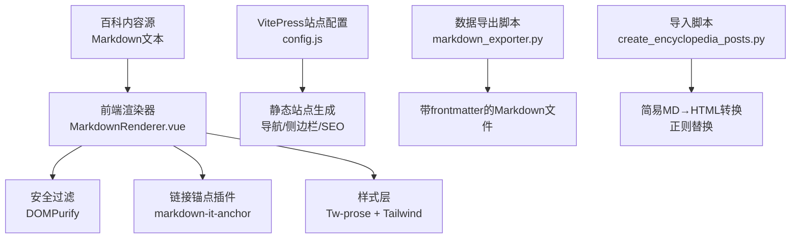
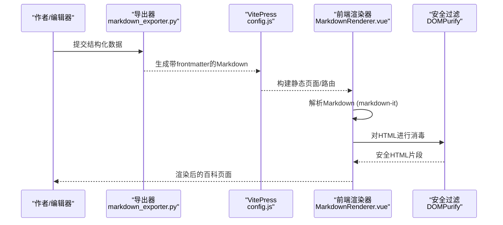
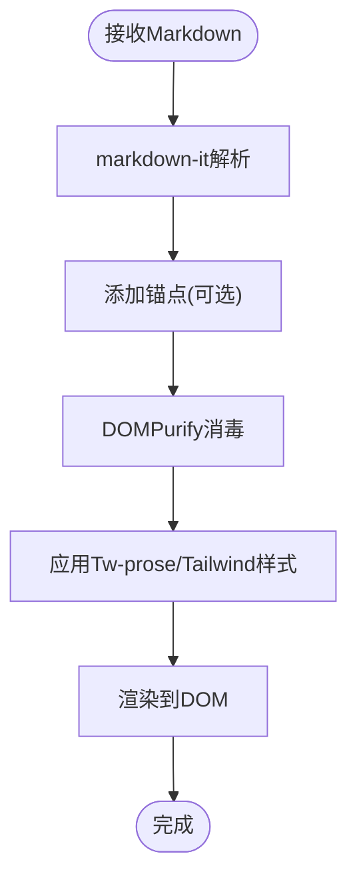
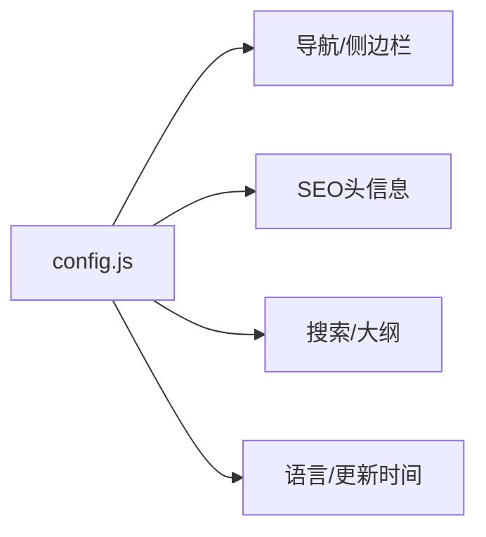
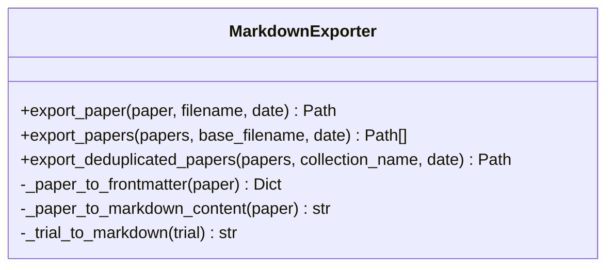
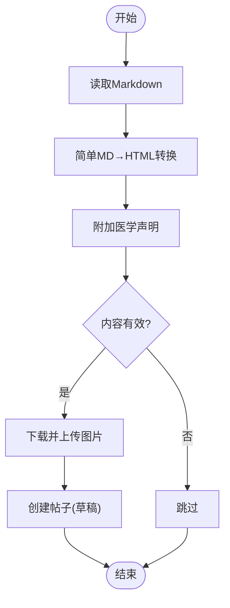
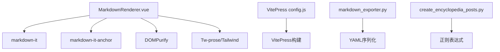

# Markdown渲染引擎

<cite>
**本文引用的文件**
- [MarkdownRenderer.vue](file://web/app/src/components/encyclopedia/MarkdownRenderer.vue)
- [config.js](file://web/vitepress/.vitepress/config.js)
- [create_encyclopedia_posts.py](file://scripts/create_encyclopedia_posts.py)
- [markdown_exporter.py](file://src/exporters/markdown_exporter.py)
</cite>

## 目录
1. [简介](#简介)
2. [项目结构](#项目结构)
3. [核心组件](#核心组件)
4. [架构总览](#架构总览)
5. [详细组件分析](#详细组件分析)
6. [依赖关系分析](#依赖关系分析)
7. [性能考虑](#性能考虑)
8. [故障排查指南](#故障排查指南)
9. [结论](#结论)
10. [附录](#附录)

## 简介
本技术文档面向Subskin百科知识库的Markdown渲染引擎，聚焦于“Markdown到HTML”的转换流程、安全过滤与样式定制机制。文档同时说明当前仓库中已实现的扩展能力（如锚点链接、自定义块样式）、图片处理与SEO友好输出，并给出可落地的插件扩展接口建议、主题切换与国际化支持策略，以及性能优化方案。

## 项目结构
本项目在前后端均涉及Markdown相关内容：
- 前端百科内容渲染：基于Vue组件使用markdown-it进行解析，并通过DOMPurify进行安全消毒，结合Tailwind/Tw-prose样式实现主题化展示。
- VitePress站点配置：用于构建静态百科站点，提供导航、侧边栏、搜索、语言与SEO相关设置。
- 脚本与导出：提供将结构化数据导出为带YAML frontmatter的Markdown文件，便于VitePress或外部工具消费；另有脚本将Markdown转换为HTML并入库。

图表来源
- [MarkdownRenderer.vue:1-28](file://web/app/src/components/encyclopedia/MarkdownRenderer.vue#L1-L28)
- [config.js:1-124](file://web/vitepress/.vitepress/config.js#L1-L124)
- [markdown_exporter.py:19-131](file://src/exporters/markdown_exporter.py#L19-L131)
- [create_encyclopedia_posts.py:132-152](file://scripts/create_encyclopedia_posts.py#L132-L152)

章节来源
- [MarkdownRenderer.vue:1-28](file://web/app/src/components/encyclopedia/MarkdownRenderer.vue#L1-L28)
- [config.js:1-124](file://web/vitepress/.vitepress/config.js#L1-L124)
- [markdown_exporter.py:19-131](file://src/exporters/markdown_exporter.py#L19-L131)
- [create_encyclopedia_posts.py:132-152](file://scripts/create_encyclopedia_posts.py#L132-L152)

## 核心组件
- 前端渲染器组件：负责Markdown解析、插件挂载、安全消毒与样式注入。
- VitePress配置：定义站点元信息、导航、侧边栏、搜索、语言与SEO相关选项。
- Markdown导出器：将结构化数据（论文/试验）导出为带YAML frontmatter的Markdown，便于VitePress或其他文档工具消费。
- 导入脚本：将Markdown转为HTML并写入数据库，供社区/百科内容管理使用。

章节来源
- [MarkdownRenderer.vue:1-28](file://web/app/src/components/encyclopedia/MarkdownRenderer.vue#L1-L28)
- [config.js:1-124](file://web/vitepress/.vitepress/config.js#L1-L124)
- [markdown_exporter.py:19-131](file://src/exporters/markdown_exporter.py#L19-L131)
- [create_encyclopedia_posts.py:132-152](file://scripts/create_encyclopedia_posts.py#L132-L152)

## 架构总览
下图展示了百科内容的端到端流转：从Markdown源到前端渲染，再到静态站点构建与SEO输出。

图表来源
- [markdown_exporter.py:19-131](file://src/exporters/markdown_exporter.py#L19-L131)
- [config.js:1-124](file://web/vitepress/.vitepress/config.js#L1-L124)
- [MarkdownRenderer.vue:1-28](file://web/app/src/components/encyclopedia/MarkdownRenderer.vue#L1-L28)

## 详细组件分析

### 前端Markdown渲染器（MarkdownRenderer.vue）
- 解析器与插件
  - 使用markdown-it作为核心解析器，启用html、linkify、typographer、breaks等选项以增强兼容性。
  - 通过markdown-it-anchor为标题生成可跳转的锚点链接，提升可读性与导航体验。
- 安全过滤
  - 使用DOMPurify对渲染结果进行消毒，防止XSS攻击，同时保留必要的HTML结构（如自定义块）。
- 样式与主题
  - 通过Tw-prose与Tailwind类名控制排版、颜色与暗色模式适配。
  - 针对自定义块（info/warning/danger/tip）提供差异化样式，满足百科知识卡片需求。
- 输入输出
  - 输入：字符串形式的Markdown内容。
  - 输出：安全的HTML片段，直接注入到视图模板中。

图表来源
- [MarkdownRenderer.vue:11-28](file://web/app/src/components/encyclopedia/MarkdownRenderer.vue#L11-L28)

章节来源
- [MarkdownRenderer.vue:1-84](file://web/app/src/components/encyclopedia/MarkdownRenderer.vue#L1-L84)

### VitePress站点配置（config.js）
- 站点元信息与SEO
  - 设置站点标题、描述、图标与主题色，利于搜索引擎抓取与浏览器标签页展示。
- 导航与侧边栏
  - 定义顶层导航与多级侧边栏，组织百科知识目录，提升用户浏览效率。
- 搜索与大纲
  - 启用本地搜索，配置大纲层级，帮助读者快速定位内容。
- 语言与更新信息
  - 设置语言为中文，配置更新时间显示格式，提升本地化体验。

图表来源
- [config.js:1-124](file://web/vitepress/.vitepress/config.js#L1-L124)

章节来源
- [config.js:1-124](file://web/vitepress/.vitepress/config.js#L1-L124)

### Markdown导出器（markdown_exporter.py）
- 功能概述
  - 将论文与临床试验数据导出为带YAML frontmatter的Markdown文件，便于VitePress或其他文档系统消费。
  - 自动组织按日期分目录的输出结构，并为合集生成索引README。
- 数据结构
  - frontmatter包含标题、日期、来源、作者、标识符、摘要、关键词、引用次数等字段。
  - 正文部分采用清晰的标题与段落结构，并在末尾附加免责声明。
- 输出规范
  - 文件名由标题与标识符组合生成，保证唯一性与可读性。
  - 合集导出时生成索引文件，便于批量浏览与检索。

图表来源
- [markdown_exporter.py:19-131](file://src/exporters/markdown_exporter.py#L19-L131)
- [markdown_exporter.py:170-283](file://src/exporters/markdown_exporter.py#L170-L283)

章节来源
- [markdown_exporter.py:19-131](file://src/exporters/markdown_exporter.py#L19-L131)
- [markdown_exporter.py:170-283](file://src/exporters/markdown_exporter.py#L170-L283)

### 导入脚本（create_encyclopedia_posts.py）
- 功能概述
  - 读取Markdown文件，提取标题与正文，执行简单的Markdown到HTML转换（支持标题、粗体、段落等基础语法）。
  - 下载封面图片并上传至服务器，创建社区帖子草稿，便于后续审核发布。
- 转换逻辑
  - 使用正则表达式将特定Markdown语法映射为HTML标签。
  - 将空段落与行内换行规范化为段落与换行标签。
- 业务集成
  - 与数据库交互，确保分类与标签存在，创建私密帖子（草稿状态），并附加医学声明。

图表来源
- [create_encyclopedia_posts.py:132-152](file://scripts/create_encyclopedia_posts.py#L132-L152)
- [create_encyclopedia_posts.py:221-285](file://scripts/create_encyclopedia_posts.py#L221-L285)

章节来源
- [create_encyclopedia_posts.py:132-152](file://scripts/create_encyclopedia_posts.py#L132-L152)
- [create_encyclopedia_posts.py:221-285](file://scripts/create_encyclopedia_posts.py#L221-L285)

## 依赖关系分析
- 前端渲染器依赖
  - markdown-it：Markdown解析核心。
  - markdown-it-anchor：为标题生成锚点。
  - DOMPurify：HTML安全消毒。
  - Tw-prose与Tailwind：样式与主题。
- 站点构建依赖
  - VitePress：静态站点生成与配置。
- 数据导出与导入
  - YAML序列化：用于frontmatter。
  - 正则表达式：用于简单MD→HTML转换。

图表来源
- [MarkdownRenderer.vue:1-28](file://web/app/src/components/encyclopedia/MarkdownRenderer.vue#L1-L28)
- [config.js:1-124](file://web/vitepress/.vitepress/config.js#L1-L124)
- [markdown_exporter.py:19-131](file://src/exporters/markdown_exporter.py#L19-L131)
- [create_encyclopedia_posts.py:132-152](file://scripts/create_encyclopedia_posts.py#L132-L152)

章节来源
- [MarkdownRenderer.vue:1-28](file://web/app/src/components/encyclopedia/MarkdownRenderer.vue#L1-L28)
- [config.js:1-124](file://web/vitepress/.vitepress/config.js#L1-L124)
- [markdown_exporter.py:19-131](file://src/exporters/markdown_exporter.py#L19-L131)
- [create_encyclopedia_posts.py:132-152](file://scripts/create_encyclopedia_posts.py#L132-L152)

## 性能考虑
- 解析与渲染
  - 在前端使用markdown-it进行增量解析，避免重复计算；对长文内容可采用分页或懒加载。
  - 合理使用markdown-it插件，避免过多正则匹配导致性能下降。
- 安全过滤
  - DOMPurify在大数据量下可能成为瓶颈，建议在服务端预清洗或缓存消毒结果。
- 资源加载
  - 图片与媒体资源应启用CDN与懒加载，减少首屏负载。
- 构建优化
  - VitePress按需构建与缓存，减少不必要的重新编译。

[本节为通用性能建议，不直接分析具体文件]

## 故障排查指南
- 渲染异常
  - 检查markdown-it配置是否正确启用必要选项（如html、linkify、breaks）。
  - 确认markdown-it-anchor是否成功挂载，标题是否生成锚点。
- 安全问题
  - 若出现XSS风险，确认DOMPurify已正确调用并对渲染结果进行消毒。
- 样式问题
  - 检查Tw-prose与Tailwind类名是否正确引入，暗色模式样式是否生效。
- 导出与导入
  - 导出失败时检查frontmatter字段是否为空或类型错误。
  - 导入脚本失败时检查网络请求与数据库连接是否正常。

章节来源
- [MarkdownRenderer.vue:11-28](file://web/app/src/components/encyclopedia/MarkdownRenderer.vue#L11-L28)
- [markdown_exporter.py:19-131](file://src/exporters/markdown_exporter.py#L19-L131)
- [create_encyclopedia_posts.py:132-152](file://scripts/create_encyclopedia_posts.py#L132-L152)

## 结论
本仓库实现了基于markdown-it的前端Markdown渲染器，配合DOMPurify保障安全，并通过Tw-prose与Tailwind实现主题化样式。VitePress配置提供了完整的站点结构与SEO支持。数据导出器与导入脚本完善了从结构化数据到Markdown再到HTML的全链路能力。未来可在数学公式、代码高亮与图表展示方面进一步扩展，以满足更丰富的百科内容需求。

[本节为总结性内容，不直接分析具体文件]

## 附录

### 支持的Markdown语法与扩展
- 基础语法
  - 标题、粗体、段落、列表、表格、链接、图片等。
- 扩展能力
  - 锚点链接：通过markdown-it-anchor为标题生成可跳转锚点。
  - 自定义块：通过HTML与CSS实现info/warning/danger/tip等样式块。
- 数学公式与代码高亮
  - 当前未内置mathjax/katex或highlight.js；可通过插件扩展或在VitePress主题中集成。
- 图表展示
  - 可通过Mermaid插件或第三方图表库在Markdown中嵌入图表。

章节来源
- [MarkdownRenderer.vue:11-28](file://web/app/src/components/encyclopedia/MarkdownRenderer.vue#L11-L28)
- [MarkdownRenderer.vue:64-82](file://web/app/src/components/encyclopedia/MarkdownRenderer.vue#L64-L82)

### 图片处理与链接优化
- 图片处理
  - 导入脚本支持下载并上传封面图片，生成可访问的URL。
  - 前端样式对图片进行圆角与阴影处理，提升视觉体验。
- 链接优化
  - 启用linkify自动识别URL并转换为链接。
  - 通过锚点提升内部导航效率。

章节来源
- [create_encyclopedia_posts.py:155-165](file://scripts/create_encyclopedia_posts.py#L155-L165)
- [MarkdownRenderer.vue:11-22](file://web/app/src/components/encyclopedia/MarkdownRenderer.vue#L11-L22)

### SEO友好输出
- 站点元信息
  - 通过VitePress配置设置标题、描述、图标与主题色。
- 结构化内容
  - 使用清晰的标题层级与段落结构，提升搜索引擎抓取质量。
- 更新信息
  - 配置更新时间显示，增强内容时效性。

章节来源
- [config.js:1-124](file://web/vitepress/.vitepress/config.js#L1-L124)

### 渲染器配置选项与插件扩展接口
- 配置项
  - html、linkify、typographer、breaks等选项可根据需求调整。
- 插件接口
  - 通过md.use()注册插件，如anchor、math、code-highlight等。
- 安全策略
  - 始终对渲染结果进行DOMPurify消毒，必要时在服务端预处理。

章节来源
- [MarkdownRenderer.vue:11-28](file://web/app/src/components/encyclopedia/MarkdownRenderer.vue#L11-L28)

### 主题切换与国际化支持
- 主题切换
  - 通过Tailwind暗色模式与Tw-prose实现明暗主题切换。
- 国际化
  - VitePress配置lang为zh-CN，支持中文界面与更新时间本地化。

章节来源
- [MarkdownRenderer.vue:31-48](file://web/app/src/components/encyclopedia/MarkdownRenderer.vue#L31-L48)
- [config.js:112-122](file://web/vitepress/.vitepress/config.js#L112-L122)

### 性能优化策略
- 前端
  - 使用markdown-it缓存解析结果，减少重复计算。
  - 对长文内容进行分页或懒加载。
- 后端
  - 对DOMPurify消毒结果进行缓存，避免重复处理。
- 构建
  - 利用VitePress缓存与按需构建，提升构建速度。

[本节为通用优化建议，不直接分析具体文件]