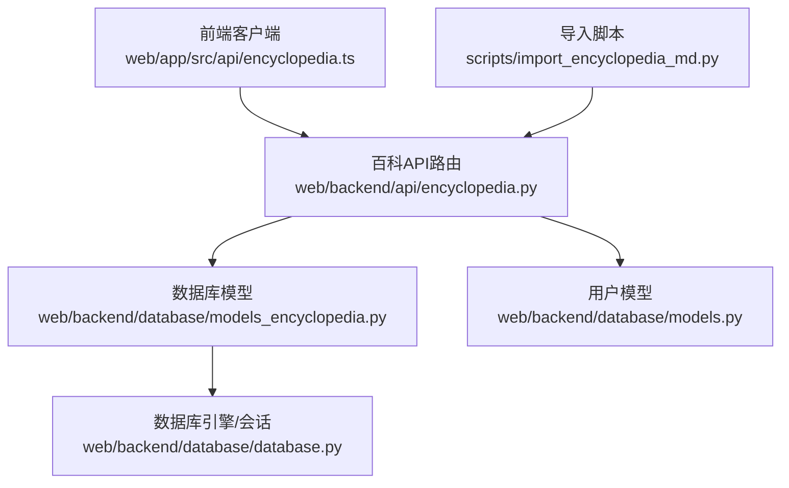
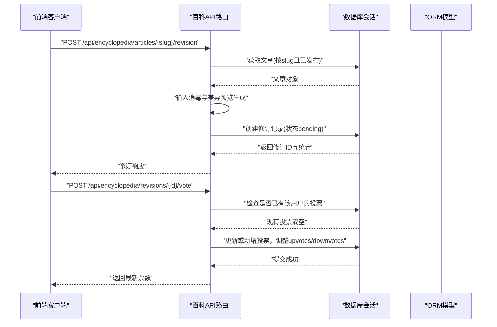
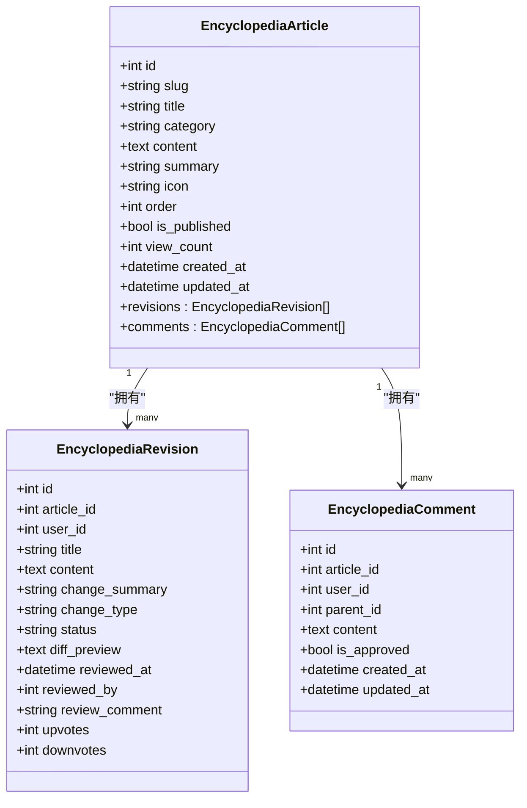
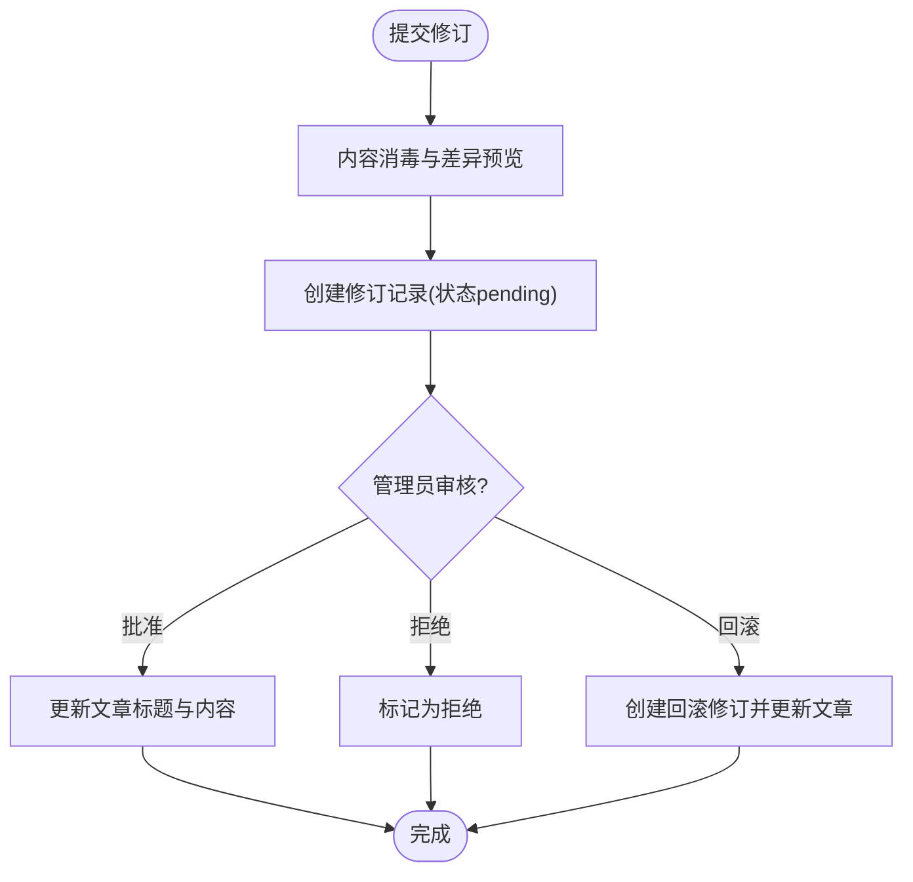
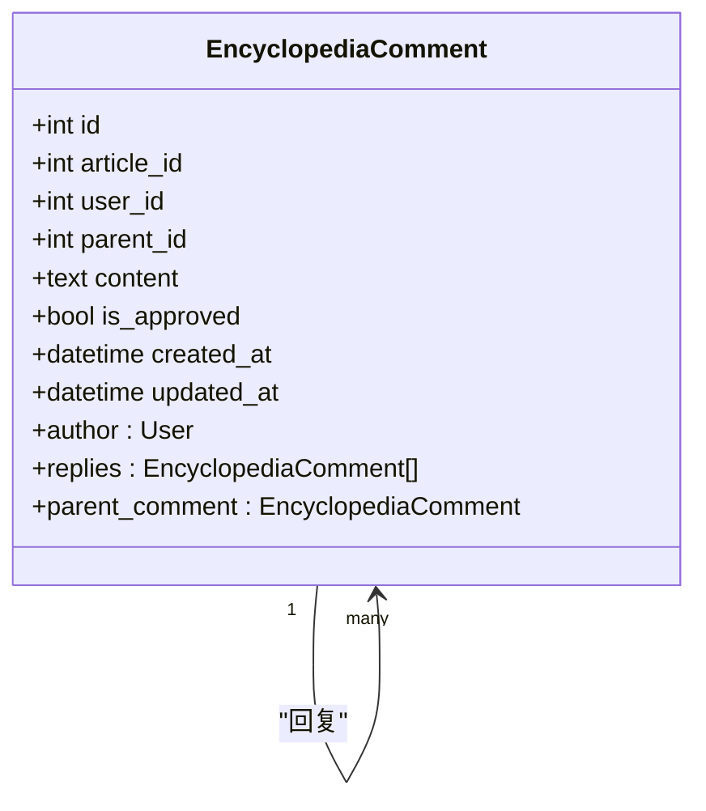
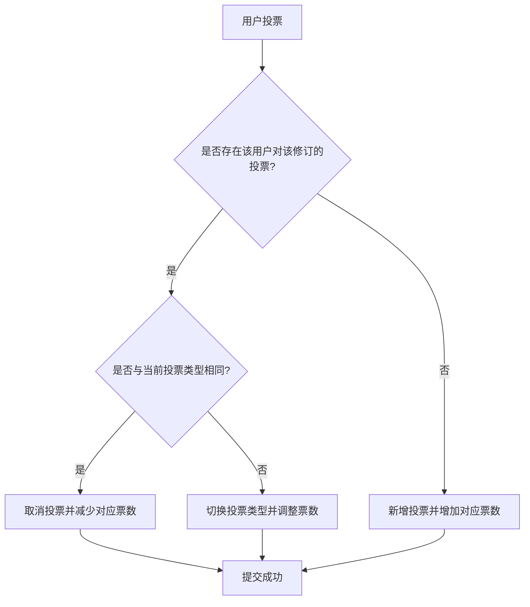
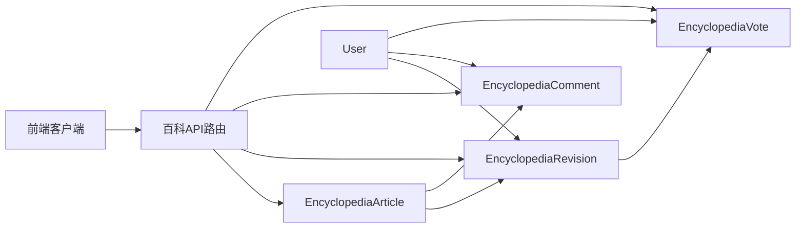

# 内容模型设计

<cite>
**本文引用的文件**
- [web/backend/database/models_encyclopedia.py](file://web/backend/database/models_encyclopedia.py)
- [web/backend/api/encyclopedia.py](file://web/backend/api/encyclopedia.py)
- [web/backend/database/models.py](file://web/backend/database/models.py)
- [web/backend/database/database.py](file://web/backend/database/database.py)
- [web/app/src/api/encyclopedia.ts](file://web/app/src/api/encyclopedia.ts)
- [scripts/import_encyclopedia_md.py](file://scripts/import_encyclopedia_md.py)
</cite>

## 目录
1. [简介](#简介)
2. [项目结构](#项目结构)
3. [核心组件](#核心组件)
4. [架构总览](#架构总览)
5. [详细组件分析](#详细组件分析)
6. [依赖关系分析](#依赖关系分析)
7. [性能考虑](#性能考虑)
8. [故障排查指南](#故障排查指南)
9. [结论](#结论)
10. [附录](#附录)

## 简介
本技术文档围绕 Subskin 百科知识库的内容模型展开，重点说明以下核心数据模型的设计理念与字段定义：EncyclopediaArticle（百科文章）、EncyclopediaRevision（修订版本）、EncyclopediaComment（评论/讨论）、EncyclopediaVote（投票/评估）。文档解释文章与修订的一对多关系、评论的树形结构、投票机制的实现，并给出数据库表结构设计、索引优化策略、外键约束与业务规则验证。同时提供 SQL 查询示例与 ORM 操作模式，阐述数据完整性保证与性能优化方案。

## 项目结构
百科内容相关代码主要分布在后端 API、数据库模型与前端客户端中：
- 数据库模型：定义百科文章、修订、评论、投票的表结构与关系映射
- API 路由：实现文章的查询、修订提交与审核、评论树构建、投票等接口
- 前端客户端：封装对百科 API 的调用，定义前后端交互的数据结构
- 导入脚本：将 VitePress Markdown 内容转换为百科文章数据

**图表来源**
- [web/backend/api/encyclopedia.py:1-586](file://web/backend/api/encyclopedia.py#L1-L586)
- [web/backend/database/models_encyclopedia.py:1-134](file://web/backend/database/models_encyclopedia.py#L1-L134)
- [web/backend/database/database.py:1-46](file://web/backend/database/database.py#L1-L46)
- [web/backend/database/models.py:88-154](file://web/backend/database/models.py#L88-L154)
- [web/app/src/api/encyclopedia.ts:1-132](file://web/app/src/api/encyclopedia.ts#L1-L132)
- [scripts/import_encyclopedia_md.py:1-162](file://scripts/import_encyclopedia_md.py#L1-L162)

**章节来源**
- [web/backend/database/models_encyclopedia.py:1-134](file://web/backend/database/models_encyclopedia.py#L1-L134)
- [web/backend/api/encyclopedia.py:1-586](file://web/backend/api/encyclopedia.py#L1-L586)
- [web/backend/database/models.py:88-154](file://web/backend/database/models.py#L88-L154)
- [web/backend/database/database.py:1-46](file://web/backend/database/database.py#L1-L46)
- [web/app/src/api/encyclopedia.ts:1-132](file://web/app/src/api/encyclopedia.ts#L1-L132)
- [scripts/import_encyclopedia_md.py:1-162](file://scripts/import_encyclopedia_md.py#L1-L162)

## 核心组件
- EncyclopediaArticle（百科文章）
  - 职责：承载百科正文、元信息（标题、分类、摘要、图标、排序、是否发布、浏览量等），作为修订与评论的根实体
  - 关键字段：id、slug（唯一URL路径）、title、category、content、summary、icon、order、is_published、view_count、created_at、updated_at
  - 关系：一对多关联 EncyclopediaRevision 与 EncyclopediaComment；删除级联清理
- EncyclopediaRevision（修订版本）
  - 职责：记录每次修订建议/采纳/拒绝/回滚的版本化内容，支持差异预览与审核流程
  - 关键字段：id、article_id、user_id、title、content、change_summary、change_type、status、diff_preview、reviewed_at、reviewed_by、review_comment、upvotes、downvotes
  - 关系：属于某篇文章；作者为 User；可被管理员审核或回滚；支持投票统计
- EncyclopediaComment（评论/讨论）
  - 职责：支持文章下的评论与回复，形成树形结构；默认需要审核后才展示
  - 关键字段：id、article_id、user_id、parent_id（自引用父评论）、content、is_approved、created_at、updated_at
  - 关系：自引用 parent/replies；作者为 User；按文章与父评论组织
- EncyclopediaVote（投票/评估）
  - 职责：用户对修订进行“赞成/反对”投票，限制同一用户对同一修订仅能有一票
  - 关键字段：id、revision_id、user_id、vote_type（up/down）、comment、created_at
  - 关系：指向修订与用户；通过唯一约束防止重复投票

**章节来源**
- [web/backend/database/models_encyclopedia.py:18-134](file://web/backend/database/models_encyclopedia.py#L18-L134)
- [web/backend/database/models.py:88-154](file://web/backend/database/models.py#L88-L154)

## 架构总览
百科内容模块采用分层架构：
- 表现层：前端 TypeScript 客户端定义数据结构并调用后端 API
- 应用层：FastAPI 路由处理请求，执行校验、权限控制、业务逻辑
- 领域层：SQLAlchemy ORM 模型定义表结构与关系，维护数据一致性
- 基础设施层：数据库连接配置与会话管理，SQLite 使用 NullPool 避免并发锁问题

**图表来源**
- [web/backend/api/encyclopedia.py:227-271](file://web/backend/api/encyclopedia.py#L227-L271)
- [web/backend/api/encyclopedia.py:409-469](file://web/backend/api/encyclopedia.py#L409-L469)
- [web/backend/database/models_encyclopedia.py:44-89](file://web/backend/database/models_encyclopedia.py#L44-L89)
- [web/backend/database/database.py:38-46](file://web/backend/database/database.py#L38-L46)

## 详细组件分析

### 百科文章（EncyclopediaArticle）
- 设计理念：以 slug 作为稳定 URL 标识，便于 SEO 与分享；分类与排序支持导航树构建；发布开关控制可见性；浏览计数用于热度分析
- 字段要点：
  - slug：唯一且索引，确保快速定位
  - is_published：布尔标志，配合索引加速列表过滤
  - view_count：递增计数，读取时原子更新
- 关系：
  - revisions/comments：一对多，级联删除，保证数据一致性
- 索引优化：
  - 分类索引、发布状态索引提升列表查询性能
- 业务规则：
  - 详情接口在读取时增加浏览次数
  - 列表接口仅返回已发布文章并按分类与排序输出

**图表来源**
- [web/backend/database/models_encyclopedia.py:18-42](file://web/backend/database/models_encyclopedia.py#L18-L42)
- [web/backend/database/models_encyclopedia.py:44-89](file://web/backend/database/models_encyclopedia.py#L44-L89)
- [web/backend/database/models_encyclopedia.py:91-114](file://web/backend/database/models_encyclopedia.py#L91-L114)

**章节来源**
- [web/backend/database/models_encyclopedia.py:18-42](file://web/backend/database/models_encyclopedia.py#L18-L42)
- [web/backend/api/encyclopedia.py:187-216](file://web/backend/api/encyclopedia.py#L187-L216)
- [web/backend/api/encyclopedia.py:560-586](file://web/backend/api/encyclopedia.py#L560-L586)

### 修订版本（EncyclopediaRevision）
- 设计理念：版本化编辑历史，支持建议、采纳、拒绝与回滚；差异预览辅助审核；审核流由管理员完成
- 字段要点：
  - change_type/status：区分建议/采纳/拒绝/回滚与待审/已审状态
  - reviewed_at/reviewed_by/review_comment：审计追踪
  - upvotes/downvotes：投票统计
- 关系：
  - 属于文章；作者为用户；可被管理员审核或回滚
- 业务规则：
  - 提交修订需登录，内容经存储侧轻量消毒
  - 审核通过会同步更新文章标题与内容
  - 回滚操作创建新的修订记录并立即生效

**图表来源**
- [web/backend/api/encyclopedia.py:227-271](file://web/backend/api/encyclopedia.py#L227-L271)
- [web/backend/api/encyclopedia.py:311-361](file://web/backend/api/encyclopedia.py#L311-L361)
- [web/backend/api/encyclopedia.py:364-404](file://web/backend/api/encyclopedia.py#L364-L404)

**章节来源**
- [web/backend/database/models_encyclopedia.py:44-89](file://web/backend/database/models_encyclopedia.py#L44-L89)
- [web/backend/api/encyclopedia.py:227-271](file://web/backend/api/encyclopedia.py#L227-L271)
- [web/backend/api/encyclopedia.py:311-361](file://web/backend/api/encyclopedia.py#L311-L361)
- [web/backend/api/encyclopedia.py:364-404](file://web/backend/api/encyclopedia.py#L364-L404)

### 评论（EncyclopediaComment）
- 设计理念：树形评论结构，支持顶级评论与回复；默认未审核不显示，保障内容质量
- 字段要点：
  - parent_id：自引用，表示父评论，形成层级
  - is_approved：审核标志，仅已审核评论参与树构建
- 关系：
  - 自引用 parent/replies；作者为用户；按文章分组
- 业务规则：
  - 创建评论需登录，提交后进入审核队列
  - 获取评论时仅返回已审核的顶级评论及其子回复，按时间排序

**图表来源**
- [web/backend/database/models_encyclopedia.py:91-114](file://web/backend/database/models_encyclopedia.py#L91-L114)

**章节来源**
- [web/backend/database/models_encyclopedia.py:91-114](file://web/backend/database/models_encyclopedia.py#L91-L114)
- [web/backend/api/encyclopedia.py:474-517](file://web/backend/api/encyclopedia.py#L474-L517)
- [web/backend/api/encyclopedia.py:520-555](file://web/backend/api/encyclopedia.py#L520-L555)

### 投票（EncyclopediaVote）
- 设计理念：用户对修订进行“赞成/反对”评估，限制每用户每修订仅一票；支持切换与取消投票
- 字段要点：
  - vote_type：up/down
  - comment：可选评价
- 关系：
  - 指向修订与用户；通过唯一约束防止重复投票
- 业务规则：
  - 若已存在相同类型投票则取消；若切换类型则调整对应票数
  - 新投票直接增加对应票数

**图表来源**
- [web/backend/api/encyclopedia.py:409-469](file://web/backend/api/encyclopedia.py#L409-L469)
- [web/backend/database/models_encyclopedia.py:116-134](file://web/backend/database/models_encyclopedia.py#L116-L134)

**章节来源**
- [web/backend/database/models_encyclopedia.py:116-134](file://web/backend/database/models_encyclopedia.py#L116-L134)
- [web/backend/api/encyclopedia.py:409-469](file://web/backend/api/encyclopedia.py#L409-L469)

## 依赖关系分析
- 模型依赖：
  - EncyclopediaArticle 依赖 User（通过外键间接关联）
  - EncyclopediaRevision 依赖 Article 与 User
  - EncyclopediaComment 依赖 Article 与 User，并自引用
  - EncyclopediaVote 依赖 Revision 与 User
- API 依赖：
  - 路由依赖数据库会话与用户认证服务
  - 路由依赖 Pydantic 模型进行请求/响应校验
- 前端依赖：
  - 客户端定义与后端一致的接口数据结构，调用百科 API

**图表来源**
- [web/backend/database/models_encyclopedia.py:18-134](file://web/backend/database/models_encyclopedia.py#L18-L134)
- [web/backend/database/models.py:88-154](file://web/backend/database/models.py#L88-L154)
- [web/backend/api/encyclopedia.py:1-586](file://web/backend/api/encyclopedia.py#L1-L586)
- [web/app/src/api/encyclopedia.ts:1-132](file://web/app/src/api/encyclopedia.ts#L1-L132)

**章节来源**
- [web/backend/database/models_encyclopedia.py:18-134](file://web/backend/database/models_encyclopedia.py#L18-L134)
- [web/backend/database/models.py:88-154](file://web/backend/database/models.py#L88-L154)
- [web/backend/api/encyclopedia.py:1-586](file://web/backend/api/encyclopedia.py#L1-L586)
- [web/app/src/api/encyclopedia.ts:1-132](file://web/app/src/api/encyclopedia.ts#L1-L132)

## 性能考虑
- 索引策略：
  - 文章：分类索引、发布状态索引、slug 唯一索引
  - 修订：文章ID、状态、用户ID、文章+状态复合索引
  - 评论：文章ID、父评论ID、用户ID索引
  - 投票：修订ID索引，唯一约束（修订+用户）
- 连接池与锁：
  - SQLite 使用 NullPool 避免连接池耗尽导致的阻塞
  - 写锁超时设置为 15s，降低 database is locked 错误概率
- 查询优化：
  - 列表接口按分类与排序聚合，减少前端处理开销
  - 评论树构建仅加载已审核评论，降低数据量
- 安全与消毒：
  - 存储侧剔除危险标签与事件处理器，减轻 XSS 风险
  - 前端渲染主防线使用 DOMPurify（不在本文代码范围内）

**章节来源**
- [web/backend/database/models_encyclopedia.py:22-25](file://web/backend/database/models_encyclopedia.py#L22-L25)
- [web/backend/database/models_encyclopedia.py:48-53](file://web/backend/database/models_encyclopedia.py#L48-L53)
- [web/backend/database/models_encyclopedia.py:95-99](file://web/backend/database/models_encyclopedia.py#L95-L99)
- [web/backend/database/models_encyclopedia.py:120-123](file://web/backend/database/models_encyclopedia.py#L120-L123)
- [web/backend/database/database.py:19-32](file://web/backend/database/database.py#L19-L32)
- [web/backend/api/encyclopedia.py:125-147](file://web/backend/api/encyclopedia.py#L125-L147)

## 故障排查指南
- 常见问题与定位：
  - 404 文章不存在：检查 slug 与发布状态过滤条件
  - 403 权限不足：审核与回滚接口需要管理员权限
  - 400 修订已被处理：仅 pending 状态的修订可审核
  - 评论未显示：确认 is_approved 为 True 且 parent_id 正确
  - 投票无效：检查唯一约束冲突与用户上下文
- 调试建议：
  - 查看 API 日志与数据库事务提交点
  - 使用 dry-run 模式验证导入脚本输出
  - 检查 SQLite 锁等待与超时设置

**章节来源**
- [web/backend/api/encyclopedia.py:150-157](file://web/backend/api/encyclopedia.py#L150-L157)
- [web/backend/api/encyclopedia.py:311-361](file://web/backend/api/encyclopedia.py#L311-L361)
- [web/backend/api/encyclopedia.py:474-517](file://web/backend/api/encyclopedia.py#L474-L517)
- [web/backend/api/encyclopedia.py:409-469](file://web/backend/api/encyclopedia.py#L409-L469)
- [scripts/import_encyclopedia_md.py:83-133](file://scripts/import_encyclopedia_md.py#L83-L133)

## 结论
Subskin 百科知识库的内容模型通过清晰的数据结构与严格的业务规则，实现了文章版本化、评论树形讨论与修订投票评估。索引设计与连接池优化保障了高并发场景下的稳定性，存储侧消毒与前端渲染防护共同提升了安全性。建议在后续迭代中继续完善审核工作流、扩展评论权限控制与引入缓存层以提升读性能。

## 附录

### 数据库表结构与索引
- encyclopedia_articles
  - 主键：id
  - 唯一索引：slug
  - 普通索引：category、is_published
- encyclopedia_revisions
  - 主键：id
  - 外键：article_id、user_id、reviewed_by
  - 普通索引：article_id、status、user_id、article_id+status
- encyclopedia_comments
  - 主键：id
  - 外键：article_id、user_id、parent_id（自引用）
  - 普通索引：article_id、parent_id、user_id
- encyclopedia_votes
  - 主键：id
  - 外键：revision_id、user_id
  - 唯一约束：revision_id+user_id
  - 普通索引：revision_id

**章节来源**
- [web/backend/database/models_encyclopedia.py:22-25](file://web/backend/database/models_encyclopedia.py#L22-L25)
- [web/backend/database/models_encyclopedia.py:48-53](file://web/backend/database/models_encyclopedia.py#L48-L53)
- [web/backend/database/models_encyclopedia.py:95-99](file://web/backend/database/models_encyclopedia.py#L95-L99)
- [web/backend/database/models_encyclopedia.py:120-123](file://web/backend/database/models_encyclopedia.py#L120-L123)

### SQL 查询示例
- 列出所有已发布文章并按分类与排序输出
  - 参考：[web/backend/api/encyclopedia.py:187-216](file://web/backend/api/encyclopedia.py#L187-L216)
- 获取文章详情并增加浏览次数
  - 参考：[web/backend/api/encyclopedia.py:560-586](file://web/backend/api/encyclopedia.py#L560-L586)
- 提交修订并生成差异预览
  - 参考：[web/backend/api/encyclopedia.py:227-271](file://web/backend/api/encyclopedia.py#L227-L271)
- 审核修订（批准/拒绝）
  - 参考：[web/backend/api/encyclopedia.py:311-361](file://web/backend/api/encyclopedia.py#L311-L361)
- 回滚到指定修订版本
  - 参考：[web/backend/api/encyclopedia.py:364-404](file://web/backend/api/encyclopedia.py#L364-L404)
- 对修订进行投票（新增/切换/取消）
  - 参考：[web/backend/api/encyclopedia.py:409-469](file://web/backend/api/encyclopedia.py#L409-L469)
- 获取文章评论树（仅已审核）
  - 参考：[web/backend/api/encyclopedia.py:474-517](file://web/backend/api/encyclopedia.py#L474-L517)

### ORM 操作模式
- 创建文章与修订
  - 参考：[web/backend/api/encyclopedia.py:227-271](file://web/backend/api/encyclopedia.py#L227-L271)
- 更新文章（审核通过）
  - 参考：[web/backend/api/encyclopedia.py:311-361](file://web/backend/api/encyclopedia.py#L311-L361)
- 构建评论树
  - 参考：[web/backend/api/encyclopedia.py:474-517](file://web/backend/api/encyclopedia.py#L474-L517)
- 投票逻辑（新增/切换/取消）
  - 参考：[web/backend/api/encyclopedia.py:409-469](file://web/backend/api/encyclopedia.py#L409-L469)

### 数据完整性与业务规则
- 外键约束：
  - 修订、评论、投票均通过外键关联文章与用户，确保引用完整性
- 唯一约束：
  - 文章 slug 唯一；投票（修订+用户）唯一，防止重复投票
- 业务规则：
  - 仅已发布文章可被访问
  - 评论默认未审核，需管理员通过后展示
  - 修订需管理员审核或回滚才能影响文章内容
  - 内容入库前进行存储侧消毒，降低安全风险

**章节来源**
- [web/backend/database/models_encyclopedia.py:22-25](file://web/backend/database/models_encyclopedia.py#L22-L25)
- [web/backend/database/models_encyclopedia.py:120-123](file://web/backend/database/models_encyclopedia.py#L120-L123)
- [web/backend/api/encyclopedia.py:150-157](file://web/backend/api/encyclopedia.py#L150-L157)
- [web/backend/api/encyclopedia.py:474-517](file://web/backend/api/encyclopedia.py#L474-L517)
- [web/backend/api/encyclopedia.py:125-147](file://web/backend/api/encyclopedia.py#L125-L147)