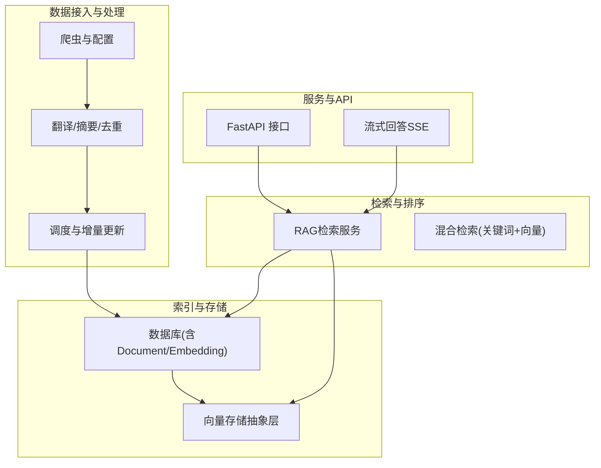
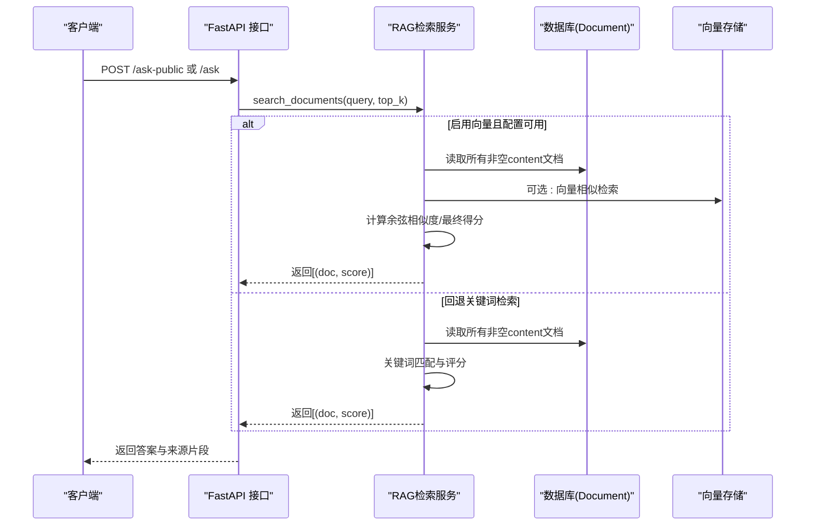
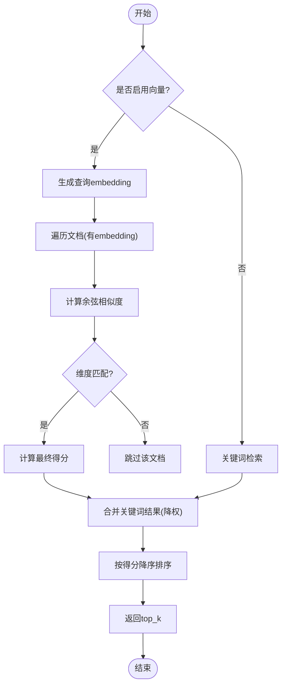
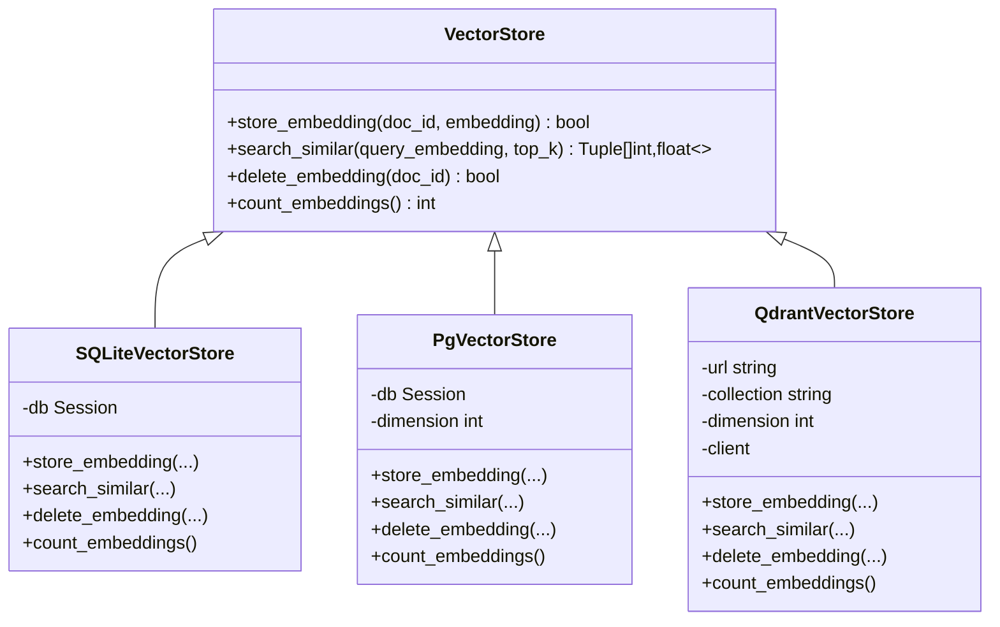
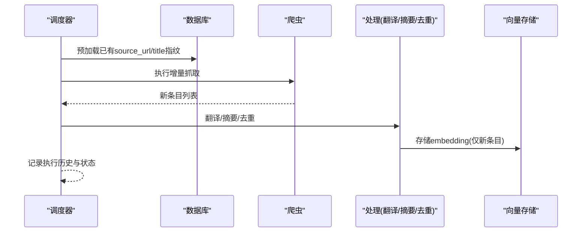
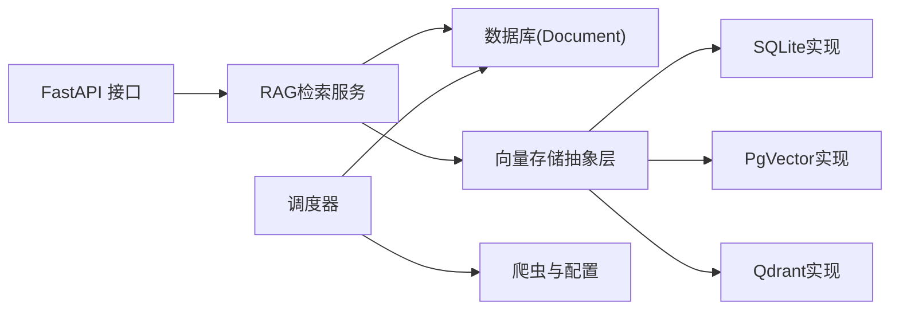

# 搜索索引系统

<cite>
**本文引用的文件**
- [rag.py](file://web/backend/services/rag.py)
- [vector_store.py](file://web/backend/services/vector_store.py)
- [rag API](file://web/backend/api/rag.py)
- [models_encyclopedia.py](file://web/backend/database/models_encyclopedia.py)
- [content_generation_admin.py](file://web/backend/api/content_generation_admin.py)
- [update_scheduler.py](file://src/scheduler/update_scheduler.py)
- [translator.py](file://src/processors/translator.py)
- [crawler_config.yaml](file://configs/crawler_config.yaml)
- [medical_content_crawler.py](file://src/crawlers/medical_content_crawler.py)
- [recommendation.py](file://web/backend/services/recommendation.py)
- [community.py](file://web/backend/services/community.py)
- [analytics.py](file://web/backend/services/analytics.py)
</cite>

## 目录
1. [简介](#简介)
2. [项目结构](#项目结构)
3. [核心组件](#核心组件)
4. [架构总览](#架构总览)
5. [详细组件分析](#详细组件分析)
6. [依赖关系分析](#依赖关系分析)
7. [性能与优化](#性能与优化)
8. [故障排查指南](#故障排查指南)
9. [结论](#结论)
10. [附录：API与查询规范](#附录api与查询规范)

## 简介
本技术文档面向 Subskin 百科知识库的搜索索引系统，覆盖全文检索、向量检索与语义搜索的实现、索引构建流程、分词策略、权重计算与相关性排序、增量更新机制、缓存策略、以及搜索 API 接口与高级搜索能力。文档同时说明中文分词、同义词扩展与搜索结果个性化推荐的实现思路与落地方式。

## 项目结构
搜索索引系统由“数据接入与处理”、“索引与存储”、“检索与排序”、“服务与API”四大层次构成：
- 数据接入与处理：爬虫采集、翻译与摘要、去重、增量追踪
- 索引与存储：SQLite/pgvector/Qdrant 向量存储；文档表（含 embedding）
- 检索与排序：关键词检索 + 向量相似度检索 + 混合排序
- 服务与API：FastAPI 暴露问答与流式回答接口，内部调用检索服务

图表来源
- [rag.py:433-522](file://web/backend/services/rag.py#L433-L522)
- [vector_store.py:25-109](file://web/backend/services/vector_store.py#L25-L109)
- [rag API:246-330](file://web/backend/api/rag.py#L246-L330)
- [update_scheduler.py:950-981](file://src/scheduler/update_scheduler.py#L950-L981)

章节来源
- [rag.py:433-522](file://web/backend/services/rag.py#L433-L522)
- [vector_store.py:25-109](file://web/backend/services/vector_store.py#L25-L109)
- [rag API:246-330](file://web/backend/api/rag.py#L246-L330)
- [update_scheduler.py:950-981](file://src/scheduler/update_scheduler.py#L950-L981)

## 核心组件
- 混合检索服务：在开启向量化时优先进行向量相似度检索，未命中或维度不匹配时回退到关键词检索，并合并结果按最终得分排序。
- 向量存储抽象层：统一 SQLite/pgvector/Qdrant 后端，默认 SQLite 以 JSON 文本列存储 embedding，支持后续升级至 pgvector 或 Qdrant。
- 增量更新与去重：调度器在执行导入前预加载已存在的 source_url 与 title 指纹，避免重复调用 embedding 生成，降低 API 成本。
- 中文分词与关键词提取：基于正则提取中文字符与英文字母数字序列作为关键词，用于关键词检索与基础召回。
- 权重与排序：结合权威度权重 authority_weight、发布时间 recency 与相似度 base_similarity 计算最终得分。
- 推荐与个性化：社区内容使用互动权重（点赞、评论、阅读等）加权排序，可作为搜索结果个性化的参考信号。

章节来源
- [rag.py:354-430](file://web/backend/services/rag.py#L354-L430)
- [rag.py:433-522](file://web/backend/services/rag.py#L433-L522)
- [vector_store.py:25-109](file://web/backend/services/vector_store.py#L25-L109)
- [update_scheduler.py:950-981](file://src/scheduler/update_scheduler.py#L950-L981)
- [recommendation.py:42-75](file://web/backend/services/recommendation.py#L42-L75)

## 架构总览
搜索系统采用“关键词 + 向量”的混合检索架构，通过统一的服务层屏蔽底层存储差异，并在必要时降级为纯关键词检索以保证可用性。

图表来源
- [rag API:246-330](file://web/backend/api/rag.py#L246-L330)
- [rag.py:456-522](file://web/backend/services/rag.py#L456-L522)
- [vector_store.py:71-109](file://web/backend/services/vector_store.py#L71-L109)

## 详细组件分析

### 混合检索与排序算法
- 关键词检索：将查询拆分为中文与英文/数字片段，统计每个文档标题+内容中的关键词命中比例，得到基础分数，再乘以权威度与时间衰减因子得到最终得分。
- 向量检索：对查询生成 embedding，遍历文档 embedding 计算余弦相似度；若维度不匹配则跳过该文档以避免错误高相关；对无 embedding 的文档通过关键词检索兜底。
- 最终排序：合并向量与关键词结果，去重后按最终得分降序取 top_k。

图表来源
- [rag.py:433-522](file://web/backend/services/rag.py#L433-L522)
- [rag.py:387-430](file://web/backend/services/rag.py#L387-L430)

章节来源
- [rag.py:433-522](file://web/backend/services/rag.py#L433-L522)
- [rag.py:387-430](file://web/backend/services/rag.py#L387-L430)

### 向量存储抽象层
- 抽象接口：提供 store_embedding、search_similar、delete_embedding、count_embeddings 的统一方法。
- SQLite 实现：以 JSON 文本列存储 embedding，内存中计算余弦相似度，适合小规模数据。
- PgVector 实现：预留 pgvector 原生向量类型与 HNSW/IVFFlat 索引方案，当前回退到 SQLite。
- Qdrant 实现：独立向量数据库，自动创建集合与向量参数，适合大规模与高并发场景。

图表来源
- [vector_store.py:25-109](file://web/backend/services/vector_store.py#L25-L109)
- [vector_store.py:112-154](file://web/backend/services/vector_store.py#L112-L154)
- [vector_store.py:157-242](file://web/backend/services/vector_store.py#L157-L242)

章节来源
- [vector_store.py:25-109](file://web/backend/services/vector_store.py#L25-L109)
- [vector_store.py:112-154](file://web/backend/services/vector_store.py#L112-L154)
- [vector_store.py:157-242](file://web/backend/services/vector_store.py#L157-L242)

### 索引构建与增量更新
- 增量去重：导入前预加载数据库中已有的 source_url 与 title 集合，命中即跳过 embedding 调用，避免重复费用。
- 调度执行：定时任务记录执行历史与状态，跟踪新增条目数量与持续时间，便于监控与告警。
- 数据源配置：通过配置文件定义各来源的搜索词、字段、限制与过滤条件，支撑多源采集与权威度权重设置。

图表来源
- [update_scheduler.py:950-981](file://src/scheduler/update_scheduler.py#L950-L981)
- [crawler_config.yaml:44-115](file://configs/crawler_config.yaml#L44-L115)
- [medical_content_crawler.py:63-101](file://src/crawlers/medical_content_crawler.py#L63-L101)

章节来源
- [update_scheduler.py:950-981](file://src/scheduler/update_scheduler.py#L950-L981)
- [crawler_config.yaml:44-115](file://configs/crawler_config.yaml#L44-L115)
- [medical_content_crawler.py:63-101](file://src/crawlers/medical_content_crawler.py#L63-L101)

### 中文分词与同义词扩展
- 分词策略：使用正则表达式提取中文字符与英文/数字片段作为关键词，适用于轻量级关键词检索。
- 同义词扩展：可通过维护领域关键词集（如白癜风相关术语）在检索前对查询进行扩展，提升召回率。
- 建议：在复杂场景引入专业分词器（如 jieba 自定义词典）与同义词库，结合 BM25 或向量模型增强语义匹配。

章节来源
- [rag.py:433-453](file://web/backend/services/rag.py#L433-L453)
- [rag.py:93-195](file://web/backend/services/rag.py#L93-L195)

### 搜索结果个性化推荐
- 互动权重：社区内容使用点赞、评论、阅读等互动指标加权排序，可用于搜索结果的相关性调优。
- 应用方式：将用户行为信号融入排序公式，例如对近期热门或高互动内容进行加权，提高个性化体验。

章节来源
- [recommendation.py:42-75](file://web/backend/services/recommendation.py#L42-L75)
- [community.py:277-302](file://web/backend/services/community.py#L277-L302)

### 百科内容与来源整合
- 百科文章：支持修订、审核、投票与回滚，确保内容质量与可追溯性。
- 来源整合：在内容生成与管理流程中，可同时检索原始数据与百科文章，形成更全面的知识来源。

章节来源
- [models_encyclopedia.py:91-123](file://web/backend/database/models_encyclopedia.py#L91-L123)
- [content_generation_admin.py:396-424](file://web/backend/api/content_generation_admin.py#L396-L424)

## 依赖关系分析
- RAG 服务依赖数据库模型 Document 与 LLM 配置，获取 embedding 与相似度计算。
- 向量存储抽象层依赖具体后端（SQLite/pgvector/Qdrant），通过环境变量选择实现。
- API 层依赖 RAG 服务与认证、限速中间件，保证访问安全与稳定性。
- 调度器依赖增量追踪与爬虫配置，保障数据新鲜度与成本控制。

图表来源
- [rag API:246-330](file://web/backend/api/rag.py#L246-L330)
- [vector_store.py:245-266](file://web/backend/services/vector_store.py#L245-L266)
- [update_scheduler.py:950-981](file://src/scheduler/update_scheduler.py#L950-L981)

章节来源
- [rag API:246-330](file://web/backend/api/rag.py#L246-L330)
- [vector_store.py:245-266](file://web/backend/services/vector_store.py#L245-L266)
- [update_scheduler.py:950-981](file://src/scheduler/update_scheduler.py#L950-L981)

## 性能与优化
- 混合检索降级：当向量检索不可用或失败时，自动回退到关键词检索，保证可用性。
- 维度匹配保护：余弦相似度计算中对维度不匹配的向量直接返回 0 并跳过，避免错误排名。
- 增量去重：导入前预加载指纹，减少重复 embedding 调用，显著降低成本。
- 缓存策略：翻译与摘要模块使用缓存与速率限制，避免重复 API 调用与限流。
- 存储后端选择：小数据量使用 SQLite，大数据量建议升级至 pgvector 或 Qdrant，利用原生向量索引提升检索性能。

章节来源
- [rag.py:456-522](file://web/backend/services/rag.py#L456-L522)
- [rag.py:387-401](file://web/backend/services/rag.py#L387-L401)
- [update_scheduler.py:950-981](file://src/scheduler/update_scheduler.py#L950-L981)
- [translator.py:193-250](file://src/processors/translator.py#L193-L250)
- [vector_store.py:51-109](file://web/backend/services/vector_store.py#L51-L109)

## 故障排查指南
- 向量检索失败：检查 LLM 配置与 embedding 模型可用性；查看日志中维度不匹配警告；确认文档 embedding 是否为有效 JSON 数组。
- 关键词检索为空：确认查询包含有效关键词；检查文档 content 字段是否为空；验证分词逻辑是否正确提取中文与英文片段。
- 增量更新成本高：确认调度器是否预加载指纹；检查是否存在大量重复 source_url 或 title；评估是否需调整去重策略。
- 缓存与限流：确认缓存键生成与 TTL 设置；检查速率限制是否触发；观察重试与退避策略是否生效。

章节来源
- [rag.py:456-522](file://web/backend/services/rag.py#L456-L522)
- [rag.py:387-401](file://web/backend/services/rag.py#L387-L401)
- [update_scheduler.py:950-981](file://src/scheduler/update_scheduler.py#L950-L981)
- [translator.py:193-250](file://src/processors/translator.py#L193-L250)

## 结论
Subskin 百科知识库搜索索引系统通过“关键词 + 向量”的混合检索架构，在保证可用性的同时提升了语义匹配能力。向量存储抽象层为未来升级预留了空间，增量更新与缓存策略有效控制了成本与延迟。建议在数据规模增长时迁移至 pgvector 或 Qdrant，并结合专业分词与同义词库进一步优化检索效果。

## 附录：API与查询规范
- 接口端点
  - POST /ask：已登录用户提问，支持模式选择与会话管理
  - POST /ask-public：访客免费提问，每日限额与话题校验
  - POST /ask-stream：流式回答，SSE 推送思考阶段与动作卡片
  - POST /ask-public-stream：访客流式回答，带剩余配额信息
- 请求参数
  - question：问题文本，长度限制依用户身份而定
  - conversation_id：会话标识，用于上下文延续
  - mode：问答模式（如智能问答/陪伴模式）
  - attachment_ids：附件标识，支持图片与文档解析
- 响应格式
  - QuestionResponse：包含答案、来源片段、剩余配额与访客标记
  - SSE事件：thinking、action_card、error 等阶段消息
- 查询语法
  - 关键词检索：支持中英文片段匹配，无需特殊语法
  - 高级检索：可扩展布尔运算（AND/OR/NOT）与字段限定（title/content）
  - 同义词扩展：可在查询前注入领域同义词，提升召回
- 高级功能
  - 个性化推荐：结合用户互动权重对结果进行加权排序
  - 来源优先级：依据权威度权重与发布时间调整最终得分
  - 降级策略：向量检索失败时自动回退关键词检索

章节来源
- [rag API:246-330](file://web/backend/api/rag.py#L246-L330)
- [rag API:534-630](file://web/backend/api/rag.py#L534-L630)
- [rag.py:433-522](file://web/backend/services/rag.py#L433-L522)
- [recommendation.py:42-75](file://web/backend/services/recommendation.py#L42-L75)