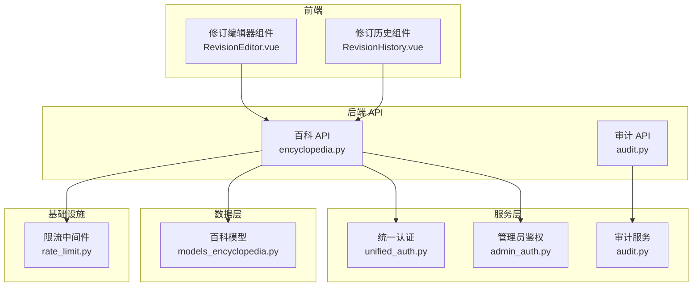
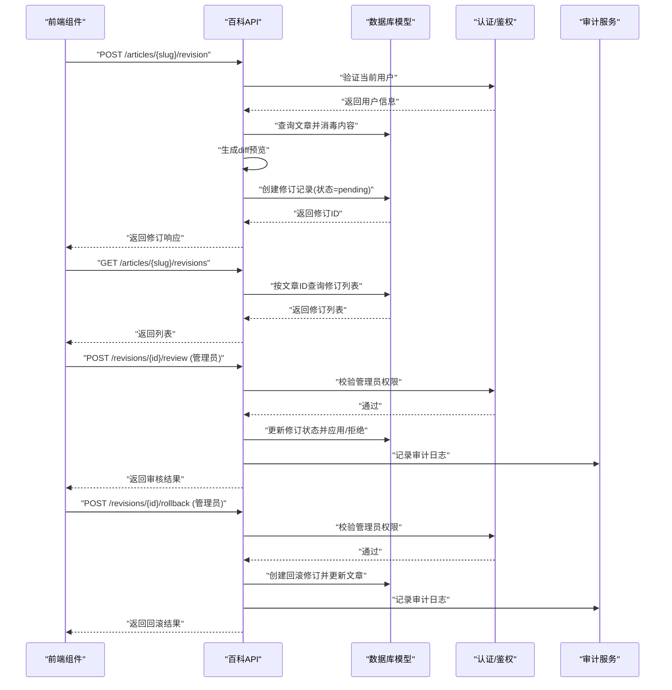
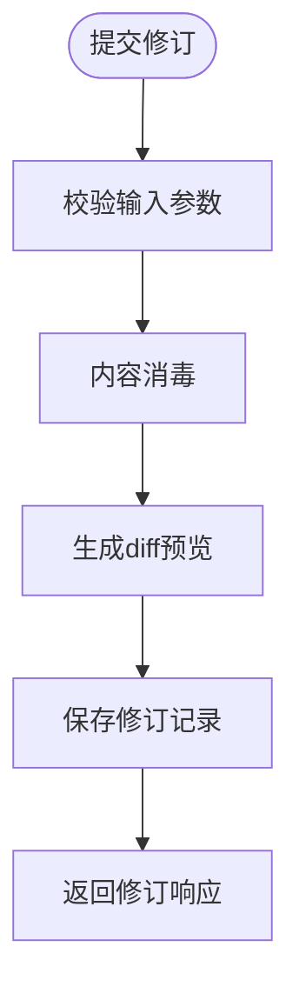
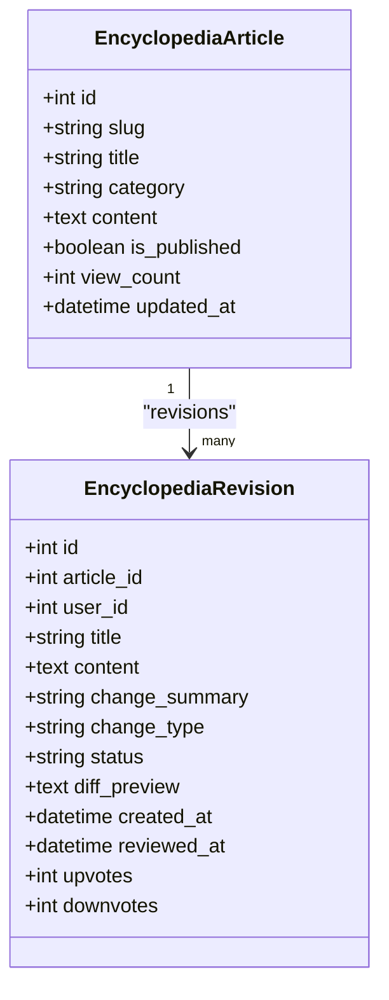
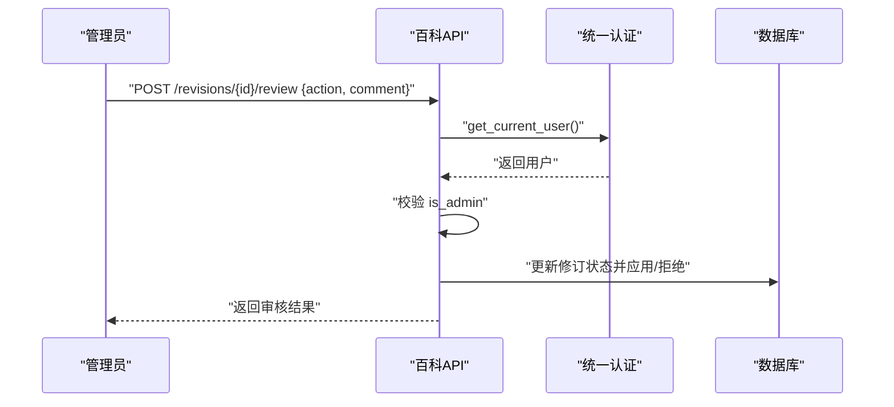
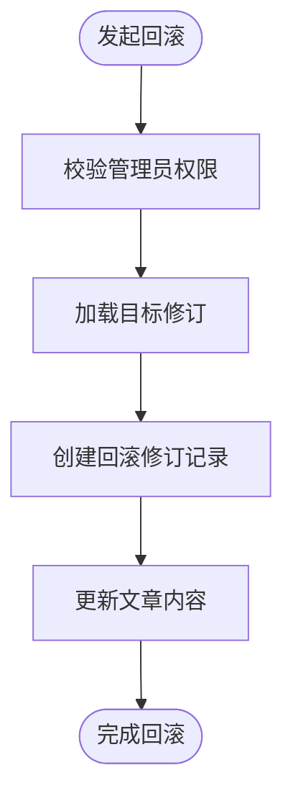
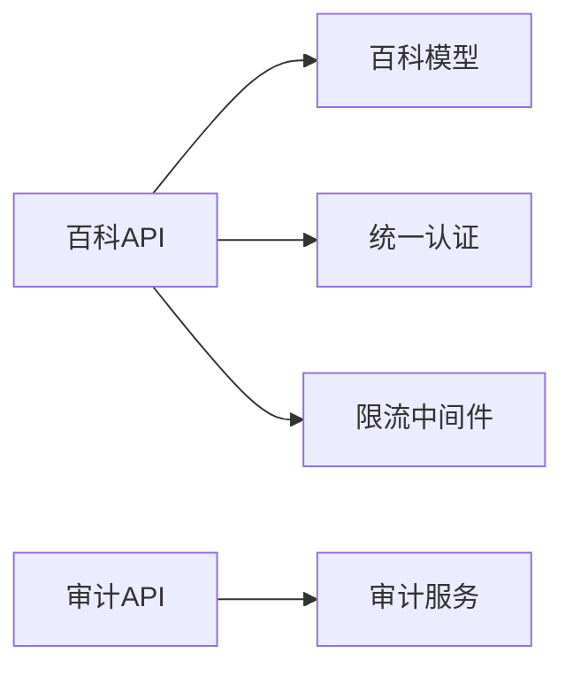

# 版本控制系统

<cite>
**本文引用的文件**   
- [web/backend/api/encyclopedia.py](file://web/backend/api/encyclopedia.py)
- [web/backend/database/models_encyclopedia.py](file://web/backend/database/models_encyclopedia.py)
- [web/app/src/components/encyclopedia/RevisionHistory.vue](file://web/app/src/components/encyclopedia/RevisionHistory.vue)
- [web/app/src/components/encyclopedia/RevisionEditor.vue](file://web/app/src/components/encyclopedia/RevisionEditor.vue)
- [web/backend/services/unified_auth.py](file://web/backend/services/unified_auth.py)
- [web/backend/services/admin_auth.py](file://web/backend/services/admin_auth.py)
- [web/backend/api/audit.py](file://web/backend/api/audit.py)
- [web/backend/services/audit.py](file://web/backend/services/audit.py)
- [web/backend/app/middleware/rate_limit.py](file://web/backend/app/middleware/rate_limit.py)
</cite>

## 目录
1. [简介](#简介)
2. [项目结构](#项目结构)
3. [核心组件](#核心组件)
4. [架构总览](#架构总览)
5. [详细组件分析](#详细组件分析)
6. [依赖关系分析](#依赖关系分析)
7. [性能考量](#性能考量)
8. [故障排查指南](#故障排查指南)
9. [结论](#结论)
10. [附录：API 接口规范与扩展建议](#附录api-接口规范与扩展建议)

## 简介
本技术文档面向 Subskin 百科知识库的版本控制系统，围绕“修订提交流程、版本差异计算、合并策略与冲突解决、审核工作流、权限控制、变更追踪、diff 算法实现、版本历史查询、回滚操作与快照管理”等主题进行系统化说明。同时提供版本控制 API 接口规范、错误处理策略、性能优化方案，以及面向更多协作场景的扩展建议。

## 项目结构
版本控制相关能力主要分布在以下位置：
- 后端 API 路由：百科修订提交、列表、审核、投票、评论、文章详情等
- 数据库模型：百科文章、修订记录、评论、投票等实体定义
- 前端组件：修订历史展示、修订编辑器
- 认证与授权：统一认证、管理员鉴权
- 审计日志：目标维度的审计追踪
- 限流中间件：读写接口限速保护

**图表来源** 
- [web/backend/api/encyclopedia.py](file://web/backend/api/encyclopedia.py)
- [web/backend/database/models_encyclopedia.py](file://web/backend/database/models_encyclopedia.py)
- [web/app/src/components/encyclopedia/RevisionHistory.vue](file://web/app/src/components/encyclopedia/RevisionHistory.vue)
- [web/app/src/components/encyclopedia/RevisionEditor.vue](file://web/app/src/components/encyclopedia/RevisionEditor.vue)
- [web/backend/services/unified_auth.py](file://web/backend/services/unified_auth.py)
- [web/backend/services/admin_auth.py](file://web/backend/services/admin_auth.py)
- [web/backend/api/audit.py](file://web/backend/api/audit.py)
- [web/backend/services/audit.py](file://web/backend/services/audit.py)
- [web/backend/app/middleware/rate_limit.py](file://web/backend/app/middleware/rate_limit.py)

**章节来源**
- [web/backend/api/encyclopedia.py:1-586](file://web/backend/api/encyclopedia.py#L1-L586)
- [web/backend/database/models_encyclopedia.py:1-134](file://web/backend/database/models_encyclopedia.py#L1-L134)
- [web/app/src/components/encyclopedia/RevisionHistory.vue:1-170](file://web/app/src/components/encyclopedia/RevisionHistory.vue#L1-L170)
- [web/app/src/components/encyclopedia/RevisionEditor.vue:1-112](file://web/app/src/components/encyclopedia/RevisionEditor.vue#L1-L112)
- [web/backend/services/unified_auth.py:1-67](file://web/backend/services/unified_auth.py#L1-L67)
- [web/backend/services/admin_auth.py:34-55](file://web/backend/services/admin_auth.py#L34-L55)
- [web/backend/api/audit.py:101-123](file://web/backend/api/audit.py#L101-L123)
- [web/backend/services/audit.py:1-136](file://web/backend/services/audit.py#L1-L136)
- [web/backend/app/middleware/rate_limit.py:1-74](file://web/backend/app/middleware/rate_limit.py#L1-L74)

## 核心组件
- 百科文章与修订模型：文章主表与修订记录表，支持状态机（待审核/已采纳/已拒绝）与变更类型（建议/已采纳/已拒绝/回滚），并包含差异预览字段。
- 修订提交与列表：用户提交修订建议，系统生成 diff 预览；按文章维度列出修订历史，支持按状态过滤。
- 审核与回滚：管理员对修订进行审核（通过/拒绝），或通过回滚将文章内容恢复到指定修订版本。
- 投票评估：用户对修订进行点赞/踩，支持切换或取消投票，影响修订的可见性与优先级。
- 审计追踪：基于目标的审计日志，支持按目标类型与 ID 查询，非管理员仅能看到自身行为，防止越权枚举。
- 认证与权限：统一 Bearer 认证，管理员权限校验，账号停用/封禁拦截。
- 限流保护：读/写/聊天接口分别按 IP 或用户维度进行令牌桶限速。

**章节来源**
- [web/backend/database/models_encyclopedia.py:18-134](file://web/backend/database/models_encyclopedia.py#L18-L134)
- [web/backend/api/encyclopedia.py:227-470](file://web/backend/api/encyclopedia.py#L227-L470)
- [web/backend/api/audit.py:101-123](file://web/backend/api/audit.py#L101-L123)
- [web/backend/services/audit.py:68-92](file://web/backend/services/audit.py#L68-L92)
- [web/backend/services/unified_auth.py:18-53](file://web/backend/services/unified_auth.py#L18-L53)
- [web/backend/app/middleware/rate_limit.py:10-74](file://web/backend/app/middleware/rate_limit.py#L10-L74)

## 架构总览
版本控制的核心流程包括：用户提交修订 → 生成差异预览 → 进入待审核队列 → 管理员审核/回滚 → 更新文章内容 → 审计记录与统计。

**图表来源** 
- [web/backend/api/encyclopedia.py:227-470](file://web/backend/api/encyclopedia.py#L227-L470)
- [web/backend/services/unified_auth.py:18-53](file://web/backend/services/unified_auth.py#L18-L53)
- [web/backend/services/audit.py:95-136](file://web/backend/services/audit.py#L95-L136)

## 详细组件分析

### 修订提交与差异预览
- 提交入口：POST /articles/{slug}/revision，要求登录用户，内容需满足最小长度限制，标题与内容经过存储侧轻量消毒。
- 差异预览：基于行级对比生成简化 diff 摘要，限制最大行数，避免过大负载。
- 数据存储：创建 EncyclopediaRevision 记录，初始状态为 pending，变更类型为 suggest。

**图表来源** 
- [web/backend/api/encyclopedia.py:227-272](file://web/backend/api/encyclopedia.py#L227-L272)
- [web/backend/api/encyclopedia.py:160-183](file://web/backend/api/encyclopedia.py#L160-L183)

**章节来源**
- [web/backend/api/encyclopedia.py:227-272](file://web/backend/api/encyclopedia.py#L227-L272)
- [web/backend/api/encyclopedia.py:160-183](file://web/backend/api/encyclopedia.py#L160-L183)
- [web/app/src/components/encyclopedia/RevisionEditor.vue:28-51](file://web/app/src/components/encyclopedia/RevisionEditor.vue#L28-L51)

### 版本历史查询与过滤
- 列表接口：GET /articles/{slug}/revisions，支持按 status 过滤（pending/approved/rejected）。
- 排序：按创建时间倒序，便于查看最新修订。
- 前端展示：RevisionHistory.vue 提供筛选标签、投票按钮与 diff 预览折叠面板。

**图表来源** 
- [web/backend/database/models_encyclopedia.py:18-89](file://web/backend/database/models_encyclopedia.py#L18-L89)

**章节来源**
- [web/backend/api/encyclopedia.py:274-308](file://web/backend/api/encyclopedia.py#L274-L308)
- [web/app/src/components/encyclopedia/RevisionHistory.vue:30-61](file://web/app/src/components/encyclopedia/RevisionHistory.vue#L30-L61)

### 审核工作流与权限控制
- 审核接口：POST /revisions/{id}/review，需要管理员权限。
- 动作：approve 将修订内容应用到文章并标记 approved；reject 标记 rejected。
- 权限：使用统一认证获取当前用户，再校验 is_admin；未通过则返回 403。

**图表来源** 
- [web/backend/api/encyclopedia.py:311-361](file://web/backend/api/encyclopedia.py#L311-L361)
- [web/backend/services/unified_auth.py:18-53](file://web/backend/services/unified_auth.py#L18-L53)

**章节来源**
- [web/backend/api/encyclopedia.py:311-361](file://web/backend/api/encyclopedia.py#L311-L361)
- [web/backend/services/unified_auth.py:18-53](file://web/backend/services/unified_auth.py#L18-L53)

### 回滚操作与快照管理
- 回滚接口：POST /revisions/{id}/rollback，需要管理员权限。
- 行为：以指定修订版本为基准，创建一条 change_type=rollback 的修订记录，并将文章内容恢复为该版本。
- 快照语义：每次回滚都会生成新的修订记录，形成可追溯的“快照链”。

**图表来源** 
- [web/backend/api/encyclopedia.py:364-404](file://web/backend/api/encyclopedia.py#L364-L404)

**章节来源**
- [web/backend/api/encyclopedia.py:364-404](file://web/backend/api/encyclopedia.py#L364-L404)

### 投票评估机制
- 投票接口：POST /revisions/{id}/vote，支持 up/down，允许切换或取消投票。
- 计数：upvotes/downvotes 实时维护，避免重复投票导致计数异常。
- 用途：辅助审核员判断修订质量与优先级。

**章节来源**
- [web/backend/api/encyclopedia.py:409-469](file://web/backend/api/encyclopedia.py#L409-L469)
- [web/app/src/components/encyclopedia/RevisionHistory.vue:42-57](file://web/app/src/components/encyclopedia/RevisionHistory.vue#L42-L57)

### 审计追踪与权限隔离
- 目标审计：GET /target/{target_type}/{target_id}，支持分页与按 actor 过滤。
- 权限隔离：非管理员只能看到自身对目标的操作，防止 IDOR 风险。
- 审计服务：AuditLogService 提供统一的日志写入、撤销与查询能力。

**章节来源**
- [web/backend/api/audit.py:101-123](file://web/backend/api/audit.py#L101-L123)
- [web/backend/services/audit.py:68-92](file://web/backend/services/audit.py#L68-L92)

## 依赖关系分析
- API 路由依赖认证与数据库模型，审核与回滚依赖管理员权限。
- 审计服务独立于百科模块，但被审计 API 调用。
- 限流中间件作为通用防护，作用于读/写接口。

**图表来源** 
- [web/backend/api/encyclopedia.py:1-25](file://web/backend/api/encyclopedia.py#L1-L25)
- [web/backend/database/models_encyclopedia.py:1-16](file://web/backend/database/models_encyclopedia.py#L1-L16)
- [web/backend/services/unified_auth.py:1-16](file://web/backend/services/unified_auth.py#L1-L16)
- [web/backend/api/audit.py:101-123](file://web/backend/api/audit.py#L101-L123)
- [web/backend/services/audit.py:1-16](file://web/backend/services/audit.py#L1-L16)
- [web/backend/app/middleware/rate_limit.py:1-10](file://web/backend/app/middleware/rate_limit.py#L1-L10)

**章节来源**
- [web/backend/api/encyclopedia.py:1-25](file://web/backend/api/encyclopedia.py#L1-L25)
- [web/backend/database/models_encyclopedia.py:1-16](file://web/backend/database/models_encyclopedia.py#L1-L16)
- [web/backend/services/unified_auth.py:1-16](file://web/backend/services/unified_auth.py#L1-L16)
- [web/backend/api/audit.py:101-123](file://web/backend/api/audit.py#L101-L123)
- [web/backend/services/audit.py:1-16](file://web/backend/services/audit.py#L1-L16)
- [web/backend/app/middleware/rate_limit.py:1-10](file://web/backend/app/middleware/rate_limit.py#L1-L10)

## 性能考量
- 差异预览限制行数，避免大文本 diff 造成前端渲染压力。
- 列表查询按文章维度过滤并按时间排序，减少不必要的数据传输。
- 投票接口采用唯一约束避免重复记录，降低计数复杂度。
- 限流中间件按 IP/用户维度进行令牌桶限速，防止滥用。
- 审计日志分页查询，限制单次返回数量。

[本节为通用指导，不直接分析具体文件]

## 故障排查指南
- 认证失败：检查 Bearer Token 是否有效，用户是否被封禁或停用。
- 权限不足：审核与回滚需要管理员权限，确认 is_admin 标志。
- 提交失败：检查内容长度与消毒逻辑，确保符合最小长度与格式。
- 列表为空：确认文章存在且已发布，修订状态过滤条件是否正确。
- 审计查询受限：非管理员仅能查看自身行为，如需全量请提升权限。

**章节来源**
- [web/backend/services/unified_auth.py:18-53](file://web/backend/services/unified_auth.py#L18-L53)
- [web/backend/services/admin_auth.py:34-55](file://web/backend/services/admin_auth.py#L34-L55)
- [web/backend/api/encyclopedia.py:227-272](file://web/backend/api/encyclopedia.py#L227-L272)
- [web/backend/api/audit.py:101-123](file://web/backend/api/audit.py#L101-L123)

## 结论
Subskin 百科版本控制系统通过清晰的模型设计、严格的权限控制与完善的审计追踪，实现了从修订提交到审核落地的完整闭环。差异预览与投票机制提升了协作效率，回滚与快照管理保障了版本安全。结合限流与错误处理策略，系统在可用性与安全性方面具备良好基础。未来可扩展更细粒度的权限、分支合并与冲突解决能力，以满足复杂协作场景。

[本节为总结性内容，不直接分析具体文件]

## 附录：API 接口规范与扩展建议

### 版本控制 API 接口规范
- 提交修订
  - 方法：POST
  - 路径：/api/encyclopedia/articles/{slug}/revision
  - 请求体：{title, content, change_summary}
  - 响应：RevisionResponse（含 id、article_id、user_id、status、diff_preview 等）
- 修订历史
  - 方法：GET
  - 路径：/api/encyclopedia/articles/{slug}/revisions
  - 查询参数：status（可选）
  - 响应：List[RevisionResponse]
- 审核修订
  - 方法：POST
  - 路径：/api/encyclopedia/revisions/{revision_id}/review
  - 请求体：{action: approve|reject, comment?}
  - 响应：{status, action, revision_id}
- 回滚修订
  - 方法：POST
  - 路径：/api/encyclopedia/revisions/{revision_id}/rollback
  - 响应：{status, action, revision_id}
- 投票评估
  - 方法：POST
  - 路径：/api/encyclopedia/revisions/{revision_id}/vote
  - 请求体：{vote_type: up|down, comment?}
  - 响应：{status, upvotes, downvotes}

**章节来源**
- [web/backend/api/encyclopedia.py:227-470](file://web/backend/api/encyclopedia.py#L227-L470)

### 错误处理策略
- 认证失败：返回 401，提示需要有效凭据。
- 权限不足：返回 403，提示需要管理员权限。
- 资源不存在：返回 404，提示对象不存在。
- 业务异常：如修订已被处理、内容过短等，返回 4xx 并附带明确消息。

**章节来源**
- [web/backend/services/unified_auth.py:18-53](file://web/backend/services/unified_auth.py#L18-L53)
- [web/backend/api/encyclopedia.py:311-361](file://web/backend/api/encyclopedia.py#L311-L361)

### 性能优化方案
- 差异预览限制行数，避免大文本渲染。
- 列表查询增加索引（article_id、status、user_id），提升检索性能。
- 投票接口使用唯一约束，避免重复记录。
- 限流中间件按 IP/用户维度限速，防止滥用。
- 审计日志分页查询，限制单次返回数量。

**章节来源**
- [web/backend/database/models_encyclopedia.py:44-89](file://web/backend/database/models_encyclopedia.py#L44-L89)
- [web/backend/app/middleware/rate_limit.py:10-74](file://web/backend/app/middleware/rate_limit.py#L10-L74)

### 扩展建议
- 分支与合并：引入分支概念，支持多分支并行编辑与合并策略（如三方合并）。
- 冲突检测：在合并时检测内容冲突，提供自动/手动冲突解决流程。
- 细粒度权限：按角色与资源维度细化权限，支持团队级协作。
- 增量同步：基于 diff 的增量同步机制，减少数据传输量。
- 快照归档：定期归档快照，支持长期回溯与合规审计。

[本节为概念性扩展建议，不直接分析具体文件]