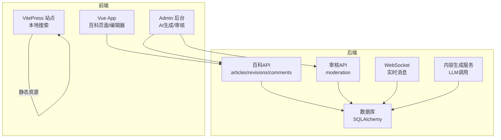
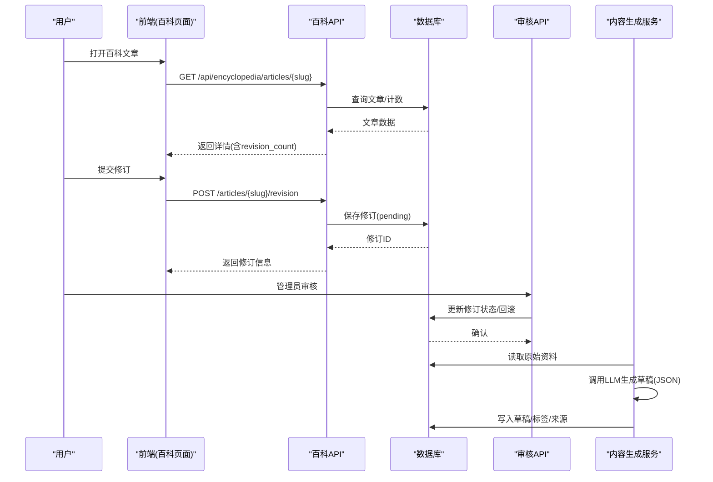
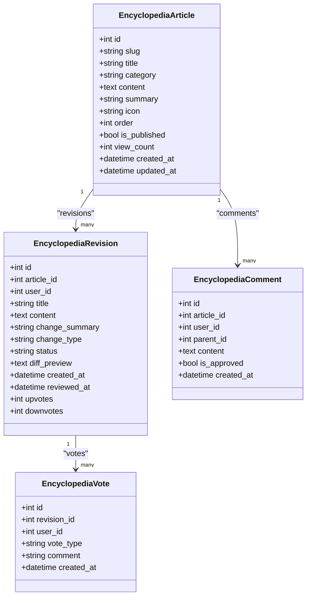
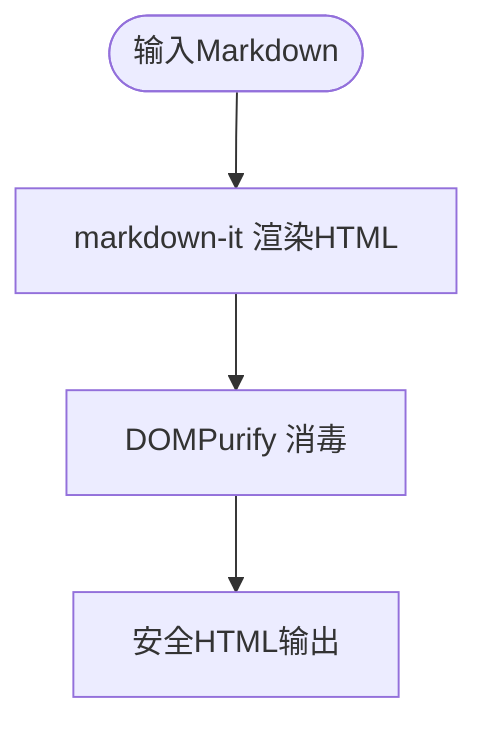
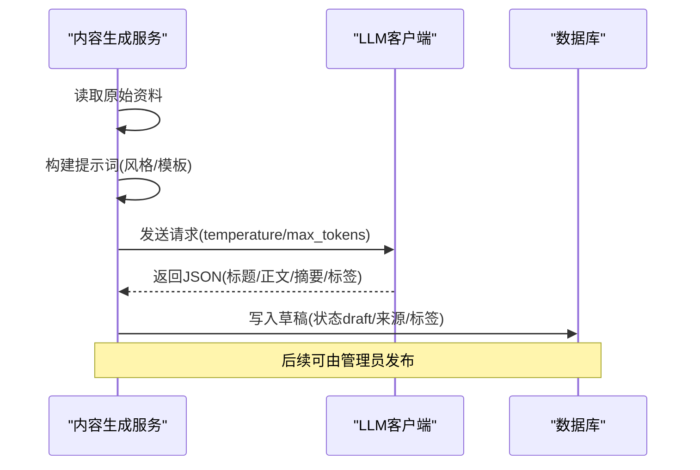
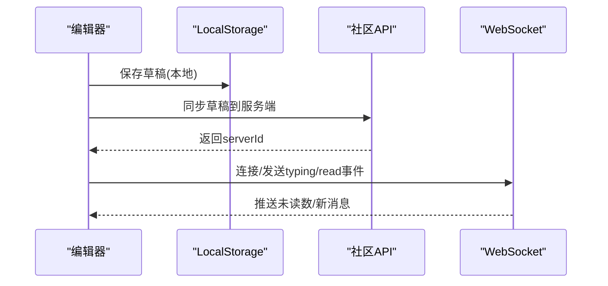
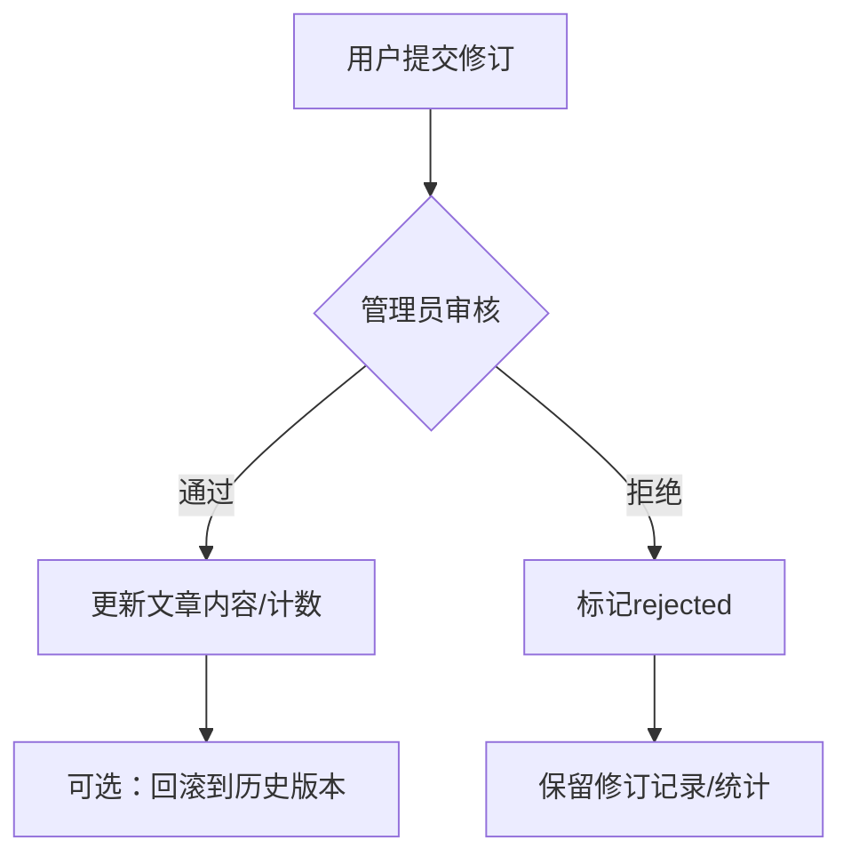
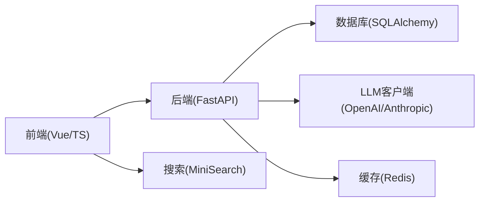

# 百科知识库

<cite>
**本文引用的文件**
- [README.md](file://README.md)
- [MEDICAL_ENCYCLOPEDIA_DESIGN.md](file://docs/MEDICAL_ENCYCLOPEDIA_DESIGN.md)
- [web_config.yaml](file://configs/web_config.yaml)
- [ai.txt](file://requirements/ai.txt)
- [encyclopedia.py](file://web/backend/api/encyclopedia.py)
- [models_encyclopedia.py](file://web/backend/database/models_encyclopedia.py)
- [MarkdownRenderer.vue](file://web/app/src/components/encyclopedia/MarkdownRenderer.vue)
- [EncyclopediaNewPage.vue](file://web/app/src/views/EncyclopediaNewPage.vue)
- [content_generation.py](file://web/backend/services/content_generation.py)
- [ContentGen.vue](file://web/admin/src/views/ContentGen.vue)
- [chat.py](file://web/backend/ws/chat.py)
- [useDrafts.ts](file://web/app/src/composables/useDrafts.ts)
- [moderation.py](file://web/backend/api/moderation.py)
- [im_admin.py](file://web/backend/api/im_admin.py)
- [ModerationPanel.vue](file://web/app/src/components/moderation/ModerationPanel.vue)
- [vitepress___minisearch.js](file://web/vitepress/docs/.vitepress/cache/deps_temp_c8996bd0/vitepress___minisearch.js)
</cite>

## 目录
1. [简介](#简介)
2. [项目结构](#项目结构)
3. [核心组件](#核心组件)
4. [架构总览](#架构总览)
5. [详细组件分析](#详细组件分析)
6. [依赖关系分析](#依赖关系分析)
7. [性能考量](#性能考量)
8. [故障排查指南](#故障排查指南)
9. [结论](#结论)
10. [附录：API与数据模型速查](#附录api与数据模型速查)

## 简介
本技术文档面向 Subskin 百科知识库系统，围绕结构化内容管理、版本控制（修订历史）、Markdown 渲染引擎、搜索索引构建、AI 内容生成服务、多语言支持、分类标签体系、内容质量评估、编辑器富文本能力、协作编辑机制、内容审核流程与发布工作流展开。文档同时给出内容模型设计、API 接口规范与前端组件实现要点，帮助开发者快速理解并扩展系统。

## 项目结构
- 后端 API 与数据库：FastAPI + SQLAlchemy，百科文章、修订、评论、投票等模型位于数据库层；路由与业务逻辑在 api 与 services 层。
- 前端应用：Vue 3 + TypeScript，包含百科阅读页、修订历史、评论、Markdown 渲染、草稿同步等。
- 管理后台：Vue 3 Admin，提供 AI 内容生成、内容审核、图片标注等工具。
- VitePress 文档站点：内置本地搜索（MiniSearch），用于静态百科内容的检索与展示。
- 配置与依赖：YAML 配置 LLM/RAG/内容管理策略；requirements 定义 AI/ML 依赖。

图表来源
- [encyclopedia.py:1-586](file://web/backend/api/encyclopedia.py#L1-L586)
- [models_encyclopedia.py:1-134](file://web/backend/database/models_encyclopedia.py#L1-L134)
- [content_generation.py:1-425](file://web/backend/services/content_generation.py#L1-L425)
- [chat.py:1-49](file://web/backend/ws/chat.py#L1-L49)
- [moderation.py:1-181](file://web/backend/api/moderation.py#L1-L181)

章节来源
- [README.md:11-144](file://README.md#L11-L144)
- [web_config.yaml:136-183](file://configs/web_config.yaml#L136-L183)

## 核心组件
- 结构化内容管理：百科文章按分类组织，支持 slug、图标、排序、发布状态、浏览量统计。
- 版本控制机制：用户提交修订建议，管理员审核通过或拒绝，支持回滚到指定版本，记录差异预览。
- Markdown 渲染引擎：前端使用 markdown-it 渲染，结合 DOMPurify 进行 XSS 防护，支持锚点链接。
- 搜索索引构建：VitePress 使用 MiniSearch 提供本地全文检索，支持字段权重、前缀与模糊匹配。
- AI 内容生成服务：基于 LLM 从采集的原始资料自动生成科普、心理、新闻、日记类内容，输出 JSON 并落库为草稿。
- 多语言支持：配置中预留多 LLM 提供商与 RAG 参数，便于接入不同语言模型与翻译管线。
- 分类标签体系：文章与社区帖子均支持标签，AI 生成时自动抽取/补充标签池。
- 内容质量评估：修订投票（上/下）与评论审核、内容安全风控（风险等级、自动处置）。
- 编辑器与协作：富文本/长文编辑器，草稿本地+服务端同步，WebSocket 实时消息（聊天/读状态）。
- 审核与发布：内容审核面板支持通过/拒绝/升级，管理员可对违规内容进行处罚与封禁。

章节来源
- [models_encyclopedia.py:18-134](file://web/backend/database/models_encyclopedia.py#L18-L134)
- [encyclopedia.py:187-586](file://web/backend/api/encyclopedia.py#L187-L586)
- [MarkdownRenderer.vue:1-29](file://web/app/src/components/encyclopedia/MarkdownRenderer.vue#L1-L29)
- [vitepress___minisearch.js:985-1417](file://web/vitepress/docs/.vitepress/cache/deps_temp_c8996bd0/vitepress___minisearch.js#L985-L1417)
- [content_generation.py:227-425](file://web/backend/services/content_generation.py#L227-L425)
- [web_config.yaml:80-134](file://configs/web_config.yaml#L80-L134)
- [ai.txt:1-37](file://requirements/ai.txt#L1-L37)
- [useDrafts.ts:258-325](file://web/app/src/composables/useDrafts.ts#L258-L325)
- [chat.py:14-49](file://web/backend/ws/chat.py#L14-L49)
- [moderation.py:123-181](file://web/backend/api/moderation.py#L123-L181)

## 架构总览
百科知识库采用前后端分离架构：
- 前端：Vue 3 应用负责百科浏览、修订提交、评论、Markdown 渲染与草稿同步；Admin 后台负责 AI 生成与审核。
- 后端：FastAPI 提供 RESTful API，处理百科 CRUD、修订审核、评论、投票、内容安全审核；数据库使用 SQLAlchemy ORM。
- 搜索：VitePress 站点内嵌 MiniSearch 提供本地全文检索。
- AI：内容生成服务通过 LLM 将采集的原始资料转化为结构化草稿，支持多种风格与标签。
- 实时：WebSocket 提供聊天与读状态推送。

图表来源
- [encyclopedia.py:187-586](file://web/backend/api/encyclopedia.py#L187-L586)
- [models_encyclopedia.py:18-134](file://web/backend/database/models_encyclopedia.py#L18-L134)
- [moderation.py:123-181](file://web/backend/api/moderation.py#L123-L181)
- [content_generation.py:227-425](file://web/backend/services/content_generation.py#L227-L425)

## 详细组件分析

### 结构化内容管理与版本控制
- 文章模型：包含 slug、标题、分类、Markdown 内容、摘要、图标、排序、发布状态、浏览量、时间戳。
- 修订模型：记录每次修订的作者、内容、变更说明、变更类型、审核状态、差异预览、审核信息与投票统计。
- 评论模型：支持树形回复，默认需审核。
- 投票模型：对修订进行点赞/点踩，防止重复投票。

图表来源
- [models_encyclopedia.py:18-134](file://web/backend/database/models_encyclopedia.py#L18-L134)

章节来源
- [models_encyclopedia.py:18-134](file://web/backend/database/models_encyclopedia.py#L18-L134)
- [encyclopedia.py:187-586](file://web/backend/api/encyclopedia.py#L187-L586)

### Markdown 渲染引擎与安全
- 使用 markdown-it 渲染 Markdown，启用 HTML、linkify、typographer、换行。
- 通过 DOMPurify 对渲染后的 HTML 进行消毒，防止 XSS。
- 启用锚点插件以生成可跳转的标题链接。

图表来源
- [MarkdownRenderer.vue:1-29](file://web/app/src/components/encyclopedia/MarkdownRenderer.vue#L1-L29)

章节来源
- [MarkdownRenderer.vue:1-29](file://web/app/src/components/encyclopedia/MarkdownRenderer.vue#L1-L29)

### 搜索索引构建（VitePress 本地搜索）
- 使用 MiniSearch 提供前端本地全文检索，支持字段权重、前缀搜索、模糊匹配、AND/OR 组合。
- 适合静态百科内容的快速检索体验。

章节来源
- [vitepress___minisearch.js:985-1417](file://web/vitepress/docs/.vitepress/cache/deps_temp_c8996bd0/vitepress___minisearch.js#L985-L1417)

### AI 内容生成服务
- 读取原始采集数据（PubMed、CrossRef、基金会新闻等），提取来源信息。
- 根据内容类型（科普、心理辅导、新闻、日记）构建提示词，调用 LLM 生成 JSON 结果（标题、正文、摘要、标签）。
- 将生成的草稿写入数据库，附带来源引用、标签、城市、心情、调度发布时间等元信息。
- 支持将草稿发布为社区帖子。

图表来源
- [content_generation.py:145-269](file://web/backend/services/content_generation.py#L145-L269)
- [content_generation.py:272-425](file://web/backend/services/content_generation.py#L272-L425)

章节来源
- [content_generation.py:1-425](file://web/backend/services/content_generation.py#L1-L425)
- [ContentGen.vue:599-636](file://web/admin/src/views/ContentGen.vue#L599-L636)
- [web_config.yaml:80-134](file://configs/web_config.yaml#L80-L134)
- [ai.txt:1-37](file://requirements/ai.txt#L1-L37)

### 编辑器富文本功能与协作编辑
- 前端提供长文/图文/视频编辑器，支持标签选择、附件上传、草稿保存。
- 草稿本地存储与服务端同步，避免丢失；支持删除草稿并清理服务端记录。
- WebSocket 提供实时消息与读状态推送，增强协作体验。

图表来源
- [useDrafts.ts:258-325](file://web/app/src/composables/useDrafts.ts#L258-L325)
- [chat.py:14-49](file://web/backend/ws/chat.py#L14-L49)

章节来源
- [useDrafts.ts:258-325](file://web/app/src/composables/useDrafts.ts#L258-L325)
- [chat.py:14-49](file://web/backend/ws/chat.py#L14-L49)

### 内容审核流程与发布工作流
- 百科修订：用户提交修订（pending），管理员审核通过则更新文章内容，拒绝则标记；支持回滚到指定版本。
- 社区内容：AI 生成草稿，管理员审核后发布；内容安全风控自动标记风险等级并执行自动处置（屏蔽/标记/放行）。
- IM 消息：管理员审核 IM 消息，批准恢复内容，拒绝则记录违规并可能处罚。

图表来源
- [encyclopedia.py:227-405](file://web/backend/api/encyclopedia.py#L227-L405)
- [moderation.py:123-181](file://web/backend/api/moderation.py#L123-L181)
- [im_admin.py:77-119](file://web/backend/api/im_admin.py#L77-L119)

章节来源
- [encyclopedia.py:227-405](file://web/backend/api/encyclopedia.py#L227-L405)
- [moderation.py:123-181](file://web/backend/api/moderation.py#L123-L181)
- [im_admin.py:77-119](file://web/backend/api/im_admin.py#L77-L119)

### 多语言支持与分类标签体系
- 多语言：配置支持 OpenAI/Anthropic/本地模型，RAG 与提示模板可切换；便于接入翻译与多语言内容生成。
- 分类标签：文章与帖子支持分类与标签，AI 生成时从标签池抽取并合并，提升内容可发现性。

章节来源
- [web_config.yaml:80-134](file://configs/web_config.yaml#L80-L134)
- [content_generation.py:23-70](file://web/backend/services/content_generation.py#L23-L70)

### 内容质量评估
- 修订投票：用户对修订进行上/下投票，支持取消或切换，统计票数。
- 评论审核：评论默认需要审核，管理员批量处理。
- 内容安全：AI 风控识别风险类别与置信度，自动处置并记录审计日志。

章节来源
- [encyclopedia.py:409-469](file://web/backend/api/encyclopedia.py#L409-L469)
- [moderation.py:123-181](file://web/backend/api/moderation.py#L123-L181)
- [ModerationPanel.vue:209-228](file://web/app/src/components/moderation/ModerationPanel.vue#L209-L228)

## 依赖关系分析
- 后端依赖：FastAPI、SQLAlchemy、Pydantic、OpenAI/Anthropic SDK、Redis（缓存/会话）、向量数据库（可选）。
- 前端依赖：Vue 3、TypeScript、Vite、Tailwind CSS、markdown-it、DOMPurify、MiniSearch（VitePress）。
- 配置依赖：YAML 配置 LLM、RAG、内容管理策略；环境变量注入 API Key。

图表来源
- [web_config.yaml:80-134](file://configs/web_config.yaml#L80-L134)
- [ai.txt:1-37](file://requirements/ai.txt#L1-L37)
- [vitepress___minisearch.js:985-1417](file://web/vitepress/docs/.vitepress/cache/deps_temp_c8996bd0/vitepress___minisearch.js#L985-L1417)

章节来源
- [web_config.yaml:80-134](file://configs/web_config.yaml#L80-L134)
- [ai.txt:1-37](file://requirements/ai.txt#L1-L37)

## 性能考量
- 渲染性能：Markdown 渲染在前端完成，配合 DOMPurify 消毒，注意大文档分片与懒加载。
- 搜索性能：MiniSearch 适合中小规模静态内容；大规模场景可考虑服务端全文检索（如 Elasticsearch）。
- AI 调用：LLM 调用存在延迟与成本，建议缓存热点问答、限制 max_tokens、设置超时与重试。
- 并发与锁：修订投票与审核操作需注意事务与并发冲突，确保幂等与一致性。
- 存储优化：文章与修订内容较大，可考虑压缩存储或对象存储；评论树查询优化索引。

[本节为通用指导，不直接分析具体文件]

## 故障排查指南
- 百科文章 404：检查 slug 是否存在且已发布；确认贪婪路由注册顺序（子资源先于贪婪路由）。
- 修订提交失败：校验内容长度与变更说明；检查存储侧消毒是否误删必要内容。
- 审核权限错误：确认当前用户是否为管理员；检查权限中间件配置。
- AI 生成失败：检查 LLM 配置（provider/api_key/base_url/model）；查看日志中的 JSON 解析异常。
- 搜索无结果：确认 MiniSearch 索引是否构建成功；检查字段权重与分词器配置。
- 草稿同步失败：检查网络与认证；确认服务端草稿接口可用。

章节来源
- [encyclopedia.py:219-223](file://web/backend/api/encyclopedia.py#L219-L223)
- [encyclopedia.py:227-271](file://web/backend/api/encyclopedia.py#L227-L271)
- [moderation.py:144-181](file://web/backend/api/moderation.py#L144-L181)
- [content_generation.py:227-269](file://web/backend/services/content_generation.py#L227-L269)
- [vitepress___minisearch.js:985-1417](file://web/vitepress/docs/.vitepress/cache/deps_temp_c8996bd0/vitepress___minisearch.js#L985-L1417)
- [useDrafts.ts:258-325](file://web/app/src/composables/useDrafts.ts#L258-L325)

## 结论
Subskin 百科知识库系统以结构化内容管理为核心，结合版本控制、Markdown 渲染、本地搜索、AI 内容生成与完善的内容审核流程，构建了高质量、可协作、可扩展的知识平台。通过清晰的模型设计与 API 规范，以及前端富文本编辑器与协作机制，系统能够满足医疗知识传播与患者教育的需求。未来可在搜索性能、多语言扩展、内容质量评估自动化等方面持续优化。

[本节为总结，不直接分析具体文件]

## 附录：API与数据模型速查

### 百科 API 概览
- 获取分类文章列表：GET /api/encyclopedia/articles
- 获取文章详情：GET /api/encyclopedia/articles/{slug:path}
- 提交修订：POST /api/encyclopedia/articles/{slug:path}/revision
- 获取修订历史：GET /api/encyclopedia/articles/{slug:path}/revisions
- 审核修订：POST /api/encyclopedia/revisions/{revision_id}/review
- 回滚修订：POST /api/encyclopedia/revisions/{revision_id}/rollback
- 修订投票：POST /api/encyclopedia/revisions/{revision_id}/vote
- 获取评论：GET /api/encyclopedia/articles/{slug:path}/comments
- 发表评论：POST /api/encyclopedia/articles/{slug:path}/comments

章节来源
- [encyclopedia.py:187-586](file://web/backend/api/encyclopedia.py#L187-L586)

### 数据模型要点
- EncyclopediaArticle：文章主表，包含 slug、标题、分类、内容、摘要、图标、排序、发布状态、浏览量、时间戳。
- EncyclopediaRevision：修订记录，包含作者、内容、变更说明、变更类型、审核状态、差异预览、审核信息与投票统计。
- EncyclopediaComment：评论，支持树形回复，默认需审核。
- EncyclopediaVote：修订投票，唯一约束（revision_id, user_id）。

章节来源
- [models_encyclopedia.py:18-134](file://web/backend/database/models_encyclopedia.py#L18-L134)