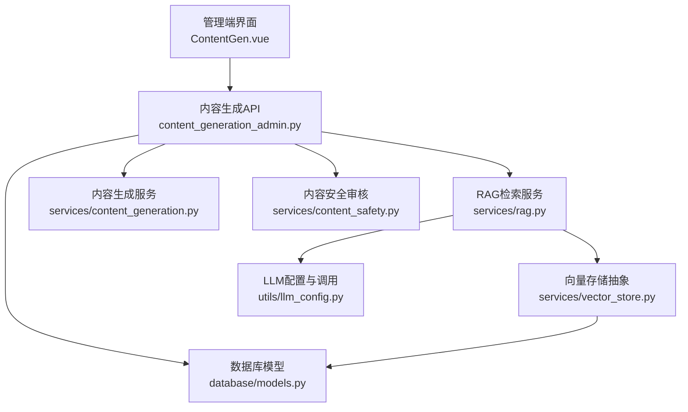
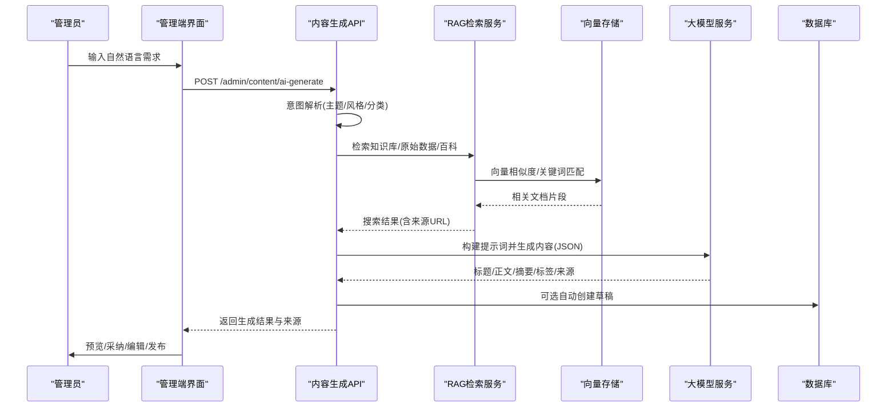
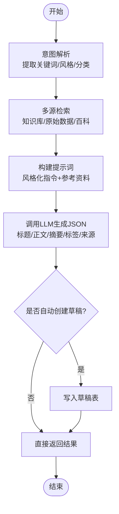
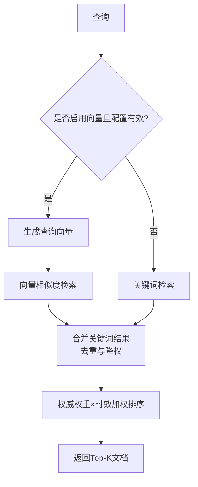
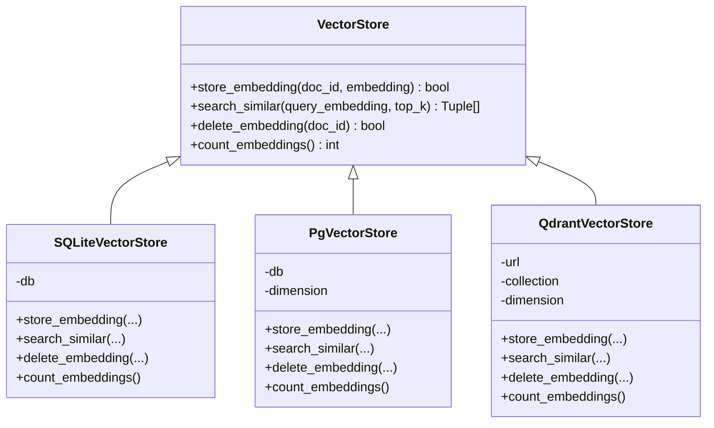
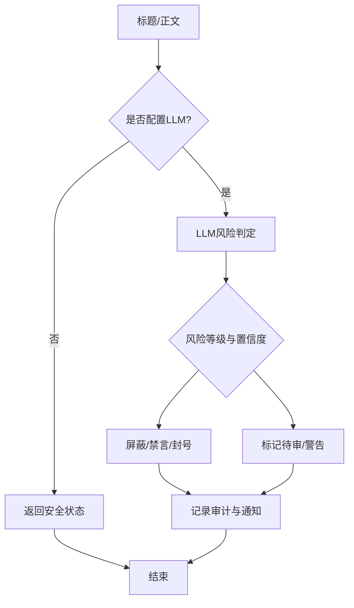
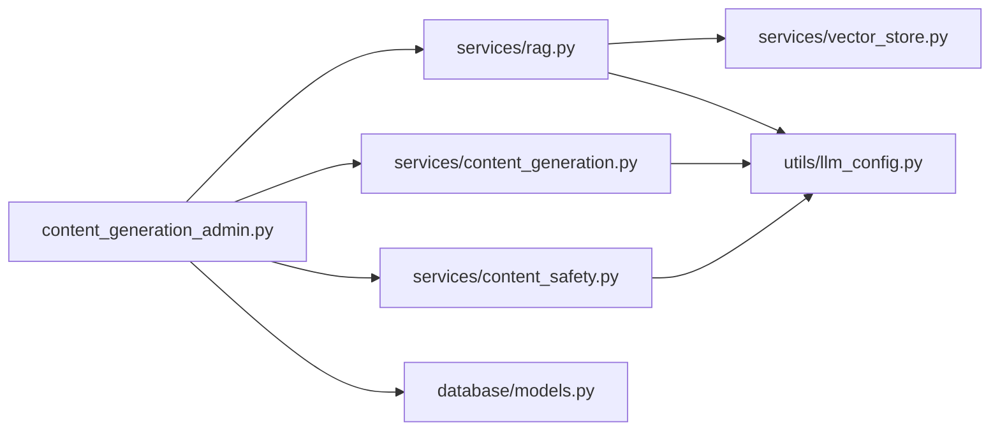

# AI辅助写作

<cite>
**本文引用的文件**
- [web/backend/api/content_generation_admin.py](file://web/backend/api/content_generation_admin.py)
- [web/backend/services/rag.py](file://web/backend/services/rag.py)
- [web/backend/services/vector_store.py](file://web/backend/services/vector_store.py)
- [web/backend/services/content_safety.py](file://web/backend/services/content_safety.py)
- [web/backend/services/content_generation.py](file://web/backend/services/content_generation.py)
- [web/admin/src/views/ContentGen.vue](file://web/admin/src/views/ContentGen.vue)
- [web/backend/database/models.py](file://web/backend/database/models.py)
- [data/llm_config_backup.json](file://data/llm_config_backup.json)
- [web/backend/utils/llm_config.py](file://web/backend/utils/llm_config.py)
- [src/scheduler/update_scheduler.py](file://src/scheduler/update_scheduler.py)
</cite>

## 目录
1. [简介](#简介)
2. [项目结构](#项目结构)
3. [核心组件](#核心组件)
4. [架构总览](#架构总览)
5. [详细组件分析](#详细组件分析)
6. [依赖关系分析](#依赖关系分析)
7. [性能与优化](#性能与优化)
8. [故障排查指南](#故障排查指南)
9. [结论](#结论)
10. [附录](#附录)

## 简介
本技术文档面向Subskin百科知识库的AI辅助写作功能，系统性说明AI内容生成算法、智能建议系统、语法与质量检查、RAG检索增强生成在内容创作中的应用、上下文理解与知识融合机制、提示词工程、事实性检查、AI服务集成配置、模型选择策略与性能优化方案，并覆盖内容版权保护、原创性检测与引用格式自动化等实现细节。文档以代码级分析为主，辅以架构图、时序图与流程图，帮助读者快速理解端到端流程与关键扩展点。

## 项目结构
AI辅助写作的后端由FastAPI API层、RAG检索服务、向量存储抽象、内容安全审核、内容生成服务以及数据库模型组成；前端提供管理员“内容生成”页面，支持自然语言需求输入、预览、采纳为草稿、批量发布等操作。

**图表来源**
- [web/admin/src/views/ContentGen.vue:1-120](file://web/admin/src/views/ContentGen.vue#L1-L120)
- [web/backend/api/content_generation_admin.py:343-549](file://web/backend/api/content_generation_admin.py#L343-L549)
- [web/backend/services/rag.py:456-522](file://web/backend/services/rag.py#L456-L522)
- [web/backend/services/vector_store.py:245-266](file://web/backend/services/vector_store.py#L245-L266)
- [web/backend/services/content_generation.py:272-375](file://web/backend/services/content_generation.py#L272-L375)
- [web/backend/services/content_safety.py:54-100](file://web/backend/services/content_safety.py#L54-L100)
- [web/backend/database/models.py:255-271](file://web/backend/database/models.py#L255-L271)
- [web/backend/utils/llm_config.py](file://web/backend/utils/llm_config.py)

**章节来源**
- [web/backend/api/content_generation_admin.py:1-549](file://web/backend/api/content_generation_admin.py#L1-L549)
- [web/backend/services/rag.py:1-800](file://web/backend/services/rag.py#L1-L800)
- [web/backend/services/vector_store.py:1-266](file://web/backend/services/vector_store.py#L1-L266)
- [web/backend/services/content_safety.py:1-368](file://web/backend/services/content_safety.py#L1-L368)
- [web/backend/services/content_generation.py:1-425](file://web/backend/services/content_generation.py#L1-L425)
- [web/admin/src/views/ContentGen.vue:1-800](file://web/admin/src/views/ContentGen.vue#L1-L800)
- [web/backend/database/models.py:255-271](file://web/backend/database/models.py#L255-L271)

## 核心组件
- 内容生成API：接收管理员自然语言需求，解析意图、检索知识库/原始数据/百科，构建提示词并调用LLM生成标题、正文、摘要、标签与来源引用，支持自动创建草稿。
- RAG检索服务：提供混合检索（向量+关键词），按权威权重与时效加权排序，返回相关文档片段用于生成与引用。
- 向量存储抽象：统一SQLite/pgvector/Qdrant后端，当前默认SQLite内存相似度计算，可扩展至pgvector或Qdrant。
- 内容安全审核：基于LLM进行风险等级判定与自动处置（屏蔽/标记/禁言/封号），记录审计日志与通知。
- 内容生成服务：定时/批量生成社区帖子草稿，按类型（科普/心理/新闻/日记）组织提示词与标签池，输出结构化JSON并入库。
- 管理端界面：提供AI对话式生成、结果预览、搜索来源展示、草稿编辑与批量发布。

**章节来源**
- [web/backend/api/content_generation_admin.py:321-549](file://web/backend/api/content_generation_admin.py#L321-L549)
- [web/backend/services/rag.py:456-522](file://web/backend/services/rag.py#L456-L522)
- [web/backend/services/vector_store.py:245-266](file://web/backend/services/vector_store.py#L245-L266)
- [web/backend/services/content_safety.py:54-100](file://web/backend/services/content_safety.py#L54-L100)
- [web/backend/services/content_generation.py:272-375](file://web/backend/services/content_generation.py#L272-L375)
- [web/admin/src/views/ContentGen.vue:1-120](file://web/admin/src/views/ContentGen.vue#L1-L120)

## 架构总览
AI辅助写作采用“意图理解—检索增强—提示词工程—生成—安全审核—草稿管理—发布”的流水线。RAG负责将多源知识（知识库、原始采集数据、百科文章）融合到生成上下文中，并通过权威权重与时效加权提升相关性。内容安全审核贯穿生成前后，确保合规。

**图表来源**
- [web/backend/api/content_generation_admin.py:343-549](file://web/backend/api/content_generation_admin.py#L343-L549)
- [web/backend/services/rag.py:456-522](file://web/backend/services/rag.py#L456-L522)
- [web/backend/services/vector_store.py:245-266](file://web/backend/services/vector_store.py#L245-L266)
- [web/admin/src/views/ContentGen.vue:609-636](file://web/admin/src/views/ContentGen.vue#L609-L636)

## 详细组件分析

### 内容生成API（AI对话式生成）
- 意图解析：通过LLM从自然语言需求中提取关键词、风格、目标分类与特殊要求，用于后续检索与提示词构造。
- 多源检索：优先使用RAG检索知识库文档，同时扫描原始采集数据与百科文章，合并为搜索来源列表。
- 提示词工程：根据风格（科普/心理辅导/新闻/日记）注入不同指令，强制要求不虚构、严格基于资料、返回JSON结构。
- 生成与草稿：调用LLM生成内容后，若开启自动创建草稿，则写入AdminGeneratedPost并返回draft_id。
- 错误处理：对LLM返回非JSON的情况抛出异常，避免脏数据入库。

**图表来源**
- [web/backend/api/content_generation_admin.py:343-549](file://web/backend/api/content_generation_admin.py#L343-L549)

**章节来源**
- [web/backend/api/content_generation_admin.py:321-549](file://web/backend/api/content_generation_admin.py#L321-L549)

### RAG检索增强生成
- 混合检索：当启用向量且配置有效时，先进行向量相似度检索，再补充关键词检索，合并去重并按最终得分排序。
- 权威与时效加权：对每篇文档应用authority_weight与pub_date时效因子，提升高质量与较新内容的排名。
- 降级策略：embedding失败或维度不匹配时回退到关键词搜索，保证可用性。
- 提示词模板：内置“智能问答”模式系统提示，强调仅基于参考资料回答、拒绝诊断、隐私保护与网站导航引导。

**图表来源**
- [web/backend/services/rag.py:456-522](file://web/backend/services/rag.py#L456-L522)
- [web/backend/services/rag.py:404-430](file://web/backend/services/rag.py#L404-L430)

**章节来源**
- [web/backend/services/rag.py:354-522](file://web/backend/services/rag.py#L354-L522)
- [web/backend/services/rag.py:525-636](file://web/backend/services/rag.py#L525-L636)

### 向量存储抽象
- 后端选择：通过环境变量VECTOR_STORE_BACKEND选择sqlite/pgvector/qdrant，默认SQLite适合小规模数据。
- SQLite实现：将embedding以JSON存入Text列，内存中计算余弦相似度，支持增删查与计数。
- pgvector与Qdrant：预留接口与TODO，便于未来升级至原生向量索引或独立向量数据库。

**图表来源**
- [web/backend/services/vector_store.py:25-48](file://web/backend/services/vector_store.py#L25-L48)
- [web/backend/services/vector_store.py:51-109](file://web/backend/services/vector_store.py#L51-L109)
- [web/backend/services/vector_store.py:112-154](file://web/backend/services/vector_store.py#L112-L154)
- [web/backend/services/vector_store.py:157-243](file://web/backend/services/vector_store.py#L157-L243)

**章节来源**
- [web/backend/services/vector_store.py:1-266](file://web/backend/services/vector_store.py#L1-L266)

### 内容安全审核
- 风险判定：通过LLM对标题与正文进行风险类别与等级评估，返回置信度与原因。
- 自动处置：根据风险等级与置信度决定屏蔽/标记/警告/禁言/封号，并记录审计日志与用户通知。
- 降级策略：未配置LLM时跳过检测并返回安全状态，避免阻断主流程。

**图表来源**
- [web/backend/services/content_safety.py:54-100](file://web/backend/services/content_safety.py#L54-L100)
- [web/backend/services/content_safety.py:103-146](file://web/backend/services/content_safety.py#L103-L146)

**章节来源**
- [web/backend/services/content_safety.py:1-368](file://web/backend/services/content_safety.py#L1-L368)

### 内容生成服务（批量/定时）
- 数据读取：从原始采集数据目录读取最新JSON，按来源类型分组（PubMed/CrossRef/基金会）。
- 提示词模板：针对科普/心理/新闻/日记四类风格分别构建提示词，强制JSON输出与来源标注。
- 草稿入库：生成成功后写入AdminGeneratedPost，附带标签、图片占位、心情、城市、调度时间等元信息。
- 发布流程：将草稿发布为社区帖子，更新状态并记录发布时间。

**章节来源**
- [web/backend/services/content_generation.py:92-225](file://web/backend/services/content_generation.py#L92-L225)
- [web/backend/services/content_generation.py:272-425](file://web/backend/services/content_generation.py#L272-L425)

### 管理端界面（内容生成）
- 自然语言输入：支持Ctrl+Enter发送，实时显示思考/生成状态与错误提示。
- 结果预览：展示标题、摘要、正文、搜索来源（知识库/原始数据/百科），支持采纳并自动创建草稿。
- 草稿管理：分页列表、筛选（分类/状态）、批量发布/删除、编辑弹窗（标题/正文/分类/标签/图片等）。
- 发布预览：确认前展示完整信息与社区同步说明。

**章节来源**
- [web/admin/src/views/ContentGen.vue:1-800](file://web/admin/src/views/ContentGen.vue#L1-L800)

## 依赖关系分析
- API层依赖RAG检索、内容生成服务、内容安全审核与数据库模型。
- RAG检索依赖向量存储抽象与LLM配置，支持多种后端与降级策略。
- 内容生成服务依赖原始数据采集目录与LLM配置，输出结构化草稿。
- 管理端界面依赖API接口，提供交互与状态管理。

**图表来源**
- [web/backend/api/content_generation_admin.py:343-549](file://web/backend/api/content_generation_admin.py#L343-L549)
- [web/backend/services/rag.py:456-522](file://web/backend/services/rag.py#L456-L522)
- [web/backend/services/vector_store.py:245-266](file://web/backend/services/vector_store.py#L245-L266)
- [web/backend/services/content_generation.py:272-375](file://web/backend/services/content_generation.py#L272-L375)
- [web/backend/services/content_safety.py:54-100](file://web/backend/services/content_safety.py#L54-L100)
- [web/backend/database/models.py:255-271](file://web/backend/database/models.py#L255-L271)

**章节来源**
- [web/backend/api/content_generation_admin.py:1-549](file://web/backend/api/content_generation_admin.py#L1-L549)
- [web/backend/services/rag.py:1-800](file://web/backend/services/rag.py#L1-L800)
- [web/backend/services/vector_store.py:1-266](file://web/backend/services/vector_store.py#L1-L266)
- [web/backend/services/content_generation.py:1-425](file://web/backend/services/content_generation.py#L1-L425)
- [web/backend/services/content_safety.py:1-368](file://web/backend/services/content_safety.py#L1-L368)
- [web/backend/database/models.py:255-271](file://web/backend/database/models.py#L255-L271)

## 性能与优化
- 向量检索优化：
  - 维度一致性校验：cosine_similarity对维度不匹配的向量返回0并跳过，避免错误排名。
  - 混合检索：向量命中优先，关键词结果降权合并，保证新增内容即时可检索。
  - 权威与时效加权：authority_weight与pub_date提升高质量与较新内容可见性。
- 批量向量化与去重：
  - 增量去重：预加载数据库中已有source_url与title指纹，避免重复embedding调用，降低API费用。
  - 批量限速：嵌入任务内设置间隔，防止过载。
- 模型选择策略：
  - 通过LLM配置模块动态选择provider/chat_model/vision_model/embedding_model，支持多提供商与预设配置。
  - 备份配置便于回滚与对比测试。
- 安全与合规：
  - 内容安全审核前置/后置均可，低置信度标记待审，高置信度自动处置，减少人工成本。
  - 隐私保护：智能问答模式明确禁止泄露用户个人信息，仅允许授权范围内的个人记录引用。

**章节来源**
- [web/backend/services/rag.py:387-430](file://web/backend/services/rag.py#L387-L430)
- [src/scheduler/update_scheduler.py:950-981](file://src/scheduler/update_scheduler.py#L950-L981)
- [data/llm_config_backup.json:1-33](file://data/llm_config_backup.json#L1-L33)
- [web/backend/services/content_safety.py:54-100](file://web/backend/services/content_safety.py#L54-L100)

## 故障排查指南
- LLM配置缺失：
  - 现象：内容安全检测跳过，RAG检索回退到关键词搜索。
  - 处理：检查get_llm_config返回值与provider是否为none，配置API Key与base_url。
- 向量维度不匹配：
  - 现象：cosine_similarity返回0并记录警告，相关文档被跳过。
  - 处理：确保embedding模型维度一致，必要时重新向量化。
- 生成JSON解析失败：
  - 现象：LLM返回非JSON导致HTTP 500。
  - 处理：调整提示词约束，增加重试与容错逻辑。
- 批量向量化失败：
  - 现象：数据库连接失败或字段缺失。
  - 处理：检查数据库迁移与字段完整性，查看日志定位具体错误。

**章节来源**
- [web/backend/services/content_safety.py:54-86](file://web/backend/services/content_safety.py#L54-L86)
- [web/backend/services/rag.py:387-401](file://web/backend/services/rag.py#L387-L401)
- [web/backend/api/content_generation_admin.py:496-499](file://web/backend/api/content_generation_admin.py#L496-L499)
- [src/scheduler/update_scheduler.py:950-981](file://src/scheduler/update_scheduler.py#L950-L981)

## 结论
Subskin百科知识库的AI辅助写作功能通过RAG检索增强生成、多源知识融合、提示词工程与安全审核，实现了从自然语言需求到高质量草稿的端到端自动化。系统在向量检索、权威加权、时效优化与降级策略上具备良好鲁棒性，并提供灵活的后端扩展能力。未来可进一步引入pgvector或Qdrant以提升大规模检索性能，完善事实性检查与原创性检测机制，强化版权保护与引用格式自动化。

## 附录
- 模型与配置：
  - 通过LLM配置模块统一管理provider、chat_model、vision_model、embedding_model与base_url，支持多模块与预设配置。
  - 备份配置文件便于版本管理与回滚。
- 数据模型：
  - Document表包含title、content、source、source_url、category、source_tier、authority_weight、pub_date、embedding等字段，支撑RAG检索与引用。
  - AdminGeneratedPost表用于存储AI生成的草稿，支持状态流转与发布。

**章节来源**
- [data/llm_config_backup.json:1-33](file://data/llm_config_backup.json#L1-L33)
- [web/backend/database/models.py:255-271](file://web/backend/database/models.py#L255-L271)