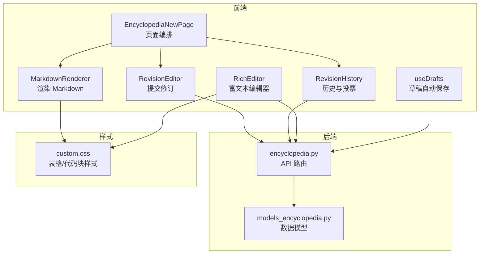
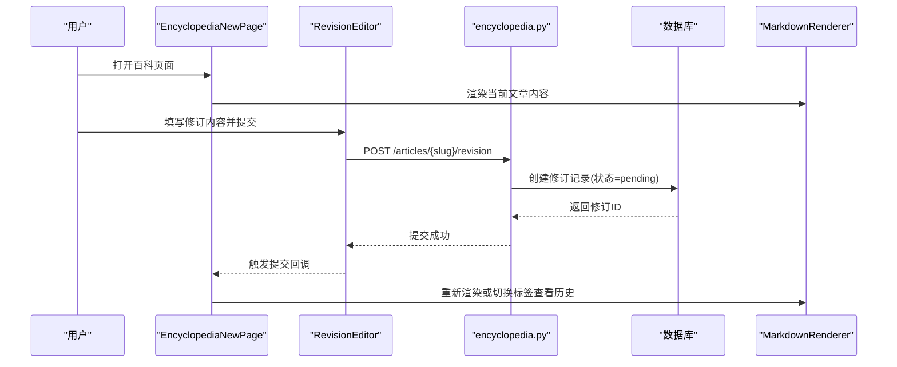
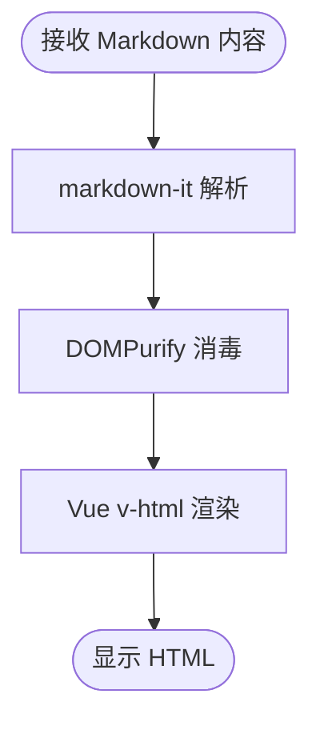
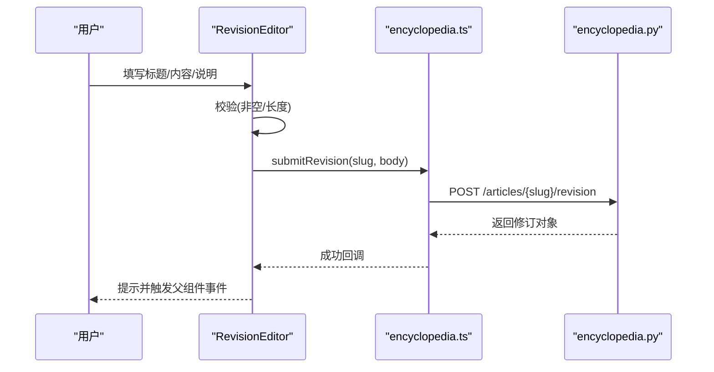
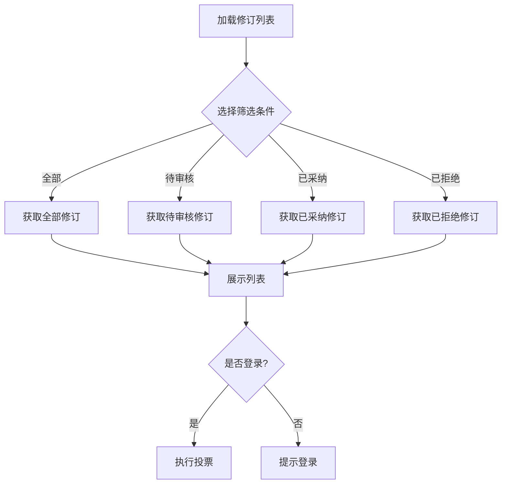
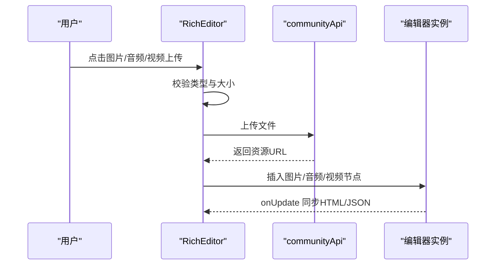
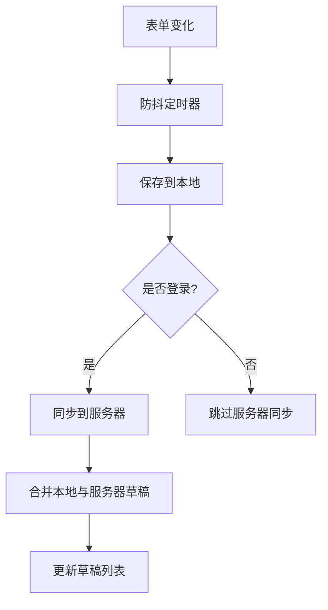
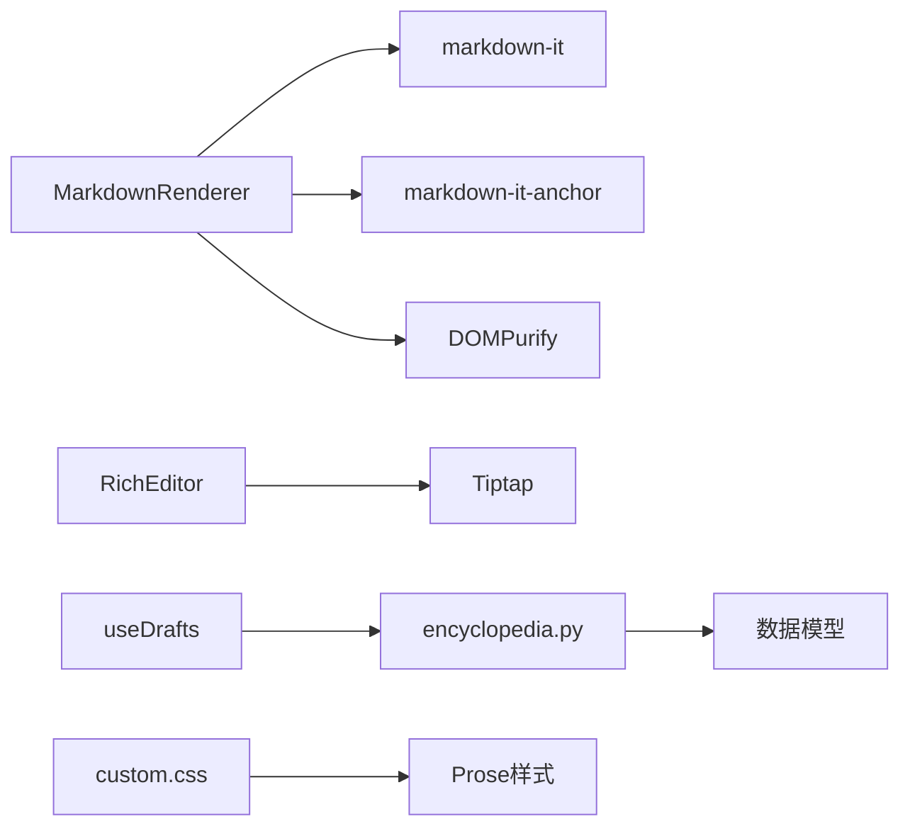

# Markdown编辑器

<cite>
**本文引用的文件**
- [web/app/src/components/encyclopedia/MarkdownRenderer.vue](file://web/app/src/components/encyclopedia/MarkdownRenderer.vue)
- [web/app/src/components/encyclopedia/RevisionEditor.vue](file://web/app/src/components/encyclopedia/RevisionEditor.vue)
- [web/app/src/components/encyclopedia/RevisionHistory.vue](file://web/app/src/components/encyclopedia/RevisionHistory.vue)
- [web/app/src/views/EncyclopediaNewPage.vue](file://web/app/src/views/EncyclopediaNewPage.vue)
- [web/backend/api/encyclopedia.py](file://web/backend/api/encyclopedia.py)
- [web/backend/database/models_encyclopedia.py](file://web/backend/database/models_encyclopedia.py)
- [web/app/src/api/encyclopedia.ts](file://web/app/src/api/encyclopedia.ts)
- [web/app/src/components/community/RichEditor.vue](file://web/app/src/components/community/RichEditor.vue)
- [web/app/src/composables/useDrafts.ts](file://web/app/src/composables/useDrafts.ts)
- [web/vitepress/docs/.vitepress/theme/custom.css](file://web/vitepress/docs/.vitepress/theme/custom.css)
</cite>

## 目录
1. [简介](#简介)
2. [项目结构](#项目结构)
3. [核心组件](#核心组件)
4. [架构总览](#架构总览)
5. [详细组件分析](#详细组件分析)
6. [依赖关系分析](#依赖关系分析)
7. [性能考虑](#性能考虑)
8. [故障排查指南](#故障排查指南)
9. [结论](#结论)
10. [附录](#附录)

## 简介
本技术文档围绕 Subskin 百科知识库的 Markdown 编辑与渲染能力，系统梳理了前端 Markdown 渲染、修订提交与审核流程、富文本编辑器（社区场景）以及草稿自动保存等关键实现。重点覆盖：
- 语法高亮与代码块支持：通过 VitePress 主题样式与 Tailwind Prose 提供基础代码块样式；富文本编辑器内置代码节点样式。
- 实时预览：基于 Vue 计算属性在渲染层即时生成 HTML，并通过安全消毒保障输出安全。
- 表格编辑：通过 Markdown 表格语法与 Prose 样式呈现；富文本编辑器侧重结构化内容编辑。
- 数学公式渲染：当前仓库未集成 MathJax/KaTeX，如需扩展可在渲染层引入对应插件。
- 状态管理、事件处理与用户交互：以 Vue 组合式 API 与自定义 Hook 管理表单、草稿与发布流程。
- 扩展语法与插件机制：通过 markdown-it 插件生态扩展锚点等能力；富文本编辑器基于 Tiptap 扩展节点。
- 配置选项、主题定制与响应式适配：Tailwind + Prose 主题变量与暗色模式适配。
- 输入验证、长度限制、自动保存与版本控制：前端校验与后端修订记录、审核、回滚机制。

## 项目结构
本项目中 Markdown 相关能力主要分布在以下位置：
- 百科内容渲染：MarkdownRenderer 负责将 Markdown 转为安全 HTML，并注入锚点等增强能力。
- 百科修订：RevisionEditor 用于提交修订建议，RevisionHistory 展示历史与投票，EncyclopediaNewPage 整合视图。
- 社区富文本：RichEditor 基于 Tiptap，提供图文音视频插入、链接、列表、引用等能力。
- 草稿与自动保存：useDrafts 提供本地与服务器端草稿同步、过期清理与合并策略。
- 后端接口与数据模型：encyclopedia.py 提供修订提交、查询、审核、回滚等接口；models_encyclopedia.py 定义文章与修订模型。
- 主题与样式：VitePress 主题 custom.css 提供表格、代码块等样式；Prose 类名统一排版。

图表来源
- [web/app/src/components/encyclopedia/MarkdownRenderer.vue:1-29](file://web/app/src/components/encyclopedia/MarkdownRenderer.vue#L1-L29)
- [web/app/src/components/encyclopedia/RevisionEditor.vue:1-52](file://web/app/src/components/encyclopedia/RevisionEditor.vue#L1-L52)
- [web/app/src/components/encyclopedia/RevisionHistory.vue:1-62](file://web/app/src/components/encyclopedia/RevisionHistory.vue#L1-L62)
- [web/app/src/views/EncyclopediaNewPage.vue:224-261](file://web/app/src/views/EncyclopediaNewPage.vue#L224-L261)
- [web/app/src/components/community/RichEditor.vue:231-358](file://web/app/src/components/community/RichEditor.vue#L231-L358)
- [web/app/src/composables/useDrafts.ts:172-290](file://web/app/src/composables/useDrafts.ts#L172-L290)
- [web/backend/api/encyclopedia.py:237-405](file://web/backend/api/encyclopedia.py#L237-L405)
- [web/backend/database/models_encyclopedia.py:44-88](file://web/backend/database/models_encyclopedia.py#L44-L88)
- [web/vitepress/docs/.vitepress/theme/custom.css:607-646](file://web/vitepress/docs/.vitepress/theme/custom.css#L607-L646)

章节来源
- [web/app/src/components/encyclopedia/MarkdownRenderer.vue:1-29](file://web/app/src/components/encyclopedia/MarkdownRenderer.vue#L1-L29)
- [web/app/src/components/encyclopedia/RevisionEditor.vue:1-52](file://web/app/src/components/encyclopedia/RevisionEditor.vue#L1-L52)
- [web/app/src/components/encyclopedia/RevisionHistory.vue:1-62](file://web/app/src/components/encyclopedia/RevisionHistory.vue#L1-L62)
- [web/app/src/views/EncyclopediaNewPage.vue:224-261](file://web/app/src/views/EncyclopediaNewPage.vue#L224-L261)
- [web/backend/api/encyclopedia.py:237-405](file://web/backend/api/encyclopedia.py#L237-L405)
- [web/backend/database/models_encyclopedia.py:44-88](file://web/backend/database/models_encyclopedia.py#L44-L88)
- [web/vitepress/docs/.vitepress/theme/custom.css:607-646](file://web/vitepress/docs/.vitepress/theme/custom.css#L607-L646)

## 核心组件
- Markdown 渲染器（百科内容）
  - 使用 markdown-it 解析 Markdown，启用 html、linkify、typographer、breaks。
  - 通过 markdown-it-anchor 为标题生成可点击锚点。
  - 渲染后使用 DOMPurify 进行 XSS 消毒，确保输出安全。
  - 通过 Tailwind Prose 类名统一排版，包含标题、段落、链接、代码、表格等样式。
- 修订编辑器（百科内容）
  - 表单字段包括标题、Markdown 内容与修订说明。
  - 提交前进行基础校验（如内容长度），调用后端提交修订建议。
  - 提交成功后触发父组件回调，关闭编辑器或刷新列表。
- 修订历史（百科内容）
  - 拉取某文章的修订列表，支持按状态筛选。
  - 支持对修订进行点赞/踩投票，更新计数。
  - 展示变更摘要与差异预览。
- 富文本编辑器（社区场景）
  - 基于 Tiptap StarterKit，扩展图片、链接、占位符、下划线等。
  - 自定义音频、视频节点，支持上传后插入。
  - 工具栏提供加粗、斜体、标题、列表、引用、分割线、链接、媒体插入等操作。
  - 通过 onUpdate 同步 HTML 与 JSON 内容到父组件。
- 草稿自动保存
  - 本地 localStorage 存储草稿，支持过期清理。
  - 登录状态下同步至服务器私有草稿，合并去重，避免重复。
  - 提供保存、删除、清空等能力，并在发布时清理草稿。

章节来源
- [web/app/src/components/encyclopedia/MarkdownRenderer.vue:1-29](file://web/app/src/components/encyclopedia/MarkdownRenderer.vue#L1-L29)
- [web/app/src/components/encyclopedia/RevisionEditor.vue:1-52](file://web/app/src/components/encyclopedia/RevisionEditor.vue#L1-L52)
- [web/app/src/components/encyclopedia/RevisionHistory.vue:1-62](file://web/app/src/components/encyclopedia/RevisionHistory.vue#L1-L62)
- [web/app/src/components/community/RichEditor.vue:231-358](file://web/app/src/components/community/RichEditor.vue#L231-L358)
- [web/app/src/composables/useDrafts.ts:172-290](file://web/app/src/composables/useDrafts.ts#L172-L290)

## 架构总览
百科内容的 Markdown 编辑与渲染采用“轻量 Markdown + 安全渲染 + 修订审核”的架构：
- 编辑侧：用户在 RevisionEditor 中输入 Markdown，提交后进入待审队列。
- 渲染侧：MarkdownRenderer 将 Markdown 转换为 HTML，并进行安全消毒，配合 Prose 样式展示。
- 审核侧：后端维护修订记录，管理员可审核采纳或拒绝，支持回滚操作。
- 社区侧：RichEditor 提供更丰富的富文本编辑能力，适合多媒体与结构化内容。

图表来源
- [web/app/src/views/EncyclopediaNewPage.vue:224-261](file://web/app/src/views/EncyclopediaNewPage.vue#L224-L261)
- [web/app/src/components/encyclopedia/RevisionEditor.vue:28-51](file://web/app/src/components/encyclopedia/RevisionEditor.vue#L28-L51)
- [web/backend/api/encyclopedia.py:237-271](file://web/backend/api/encyclopedia.py#L237-L271)
- [web/backend/database/models_encyclopedia.py:44-88](file://web/backend/database/models_encyclopedia.py#L44-L88)
- [web/app/src/components/encyclopedia/MarkdownRenderer.vue:11-28](file://web/app/src/components/encyclopedia/MarkdownRenderer.vue#L11-L28)

## 详细组件分析

### 百科 Markdown 渲染器（MarkdownRenderer）
- 功能要点
  - 使用 markdown-it 解析 Markdown，启用 linkify、typographer、breaks 提升可读性。
  - 通过 markdown-it-anchor 为标题生成可点击锚点，便于跳转。
  - 渲染结果经 DOMPurify 消毒，防止 XSS 攻击。
  - 使用 Tailwind Prose 类名统一排版，涵盖标题、段落、链接、代码、表格等。
- 复杂度与性能
  - 渲染为 O(n) 字符串处理，DOMPurify 消毒开销与内容规模线性相关。
  - 建议在长文场景下结合虚拟滚动或分页加载以提升性能。
- 错误处理
  - 若传入内容为空或非字符串，应做防御性处理（当前实现依赖 props 类型约束）。
- 扩展点
  - 可通过 markdown-it 插件链扩展语法（如表格增强、任务列表、脚注等）。
  - 数学公式渲染可引入 KaTeX/MathJax 插件，并在消毒白名单中放行必要标签。

图表来源
- [web/app/src/components/encyclopedia/MarkdownRenderer.vue:11-28](file://web/app/src/components/encyclopedia/MarkdownRenderer.vue#L11-L28)

章节来源
- [web/app/src/components/encyclopedia/MarkdownRenderer.vue:1-29](file://web/app/src/components/encyclopedia/MarkdownRenderer.vue#L1-L29)
- [web/vitepress/docs/.vitepress/theme/custom.css:607-646](file://web/vitepress/docs/.vitepress/theme/custom.css#L607-L646)

### 百科修订编辑器（RevisionEditor）
- 功能要点
  - 表单字段：标题、Markdown 内容、修订说明。
  - 提交前校验：必填项检查、内容长度限制（最小长度）。
  - 提交后回调：通知父组件刷新或关闭编辑器。
- 状态管理
  - 使用 Vue ref 管理表单数据与提交状态。
  - 通过 useToast 提示用户反馈。
- 事件处理
  - 提交按钮触发 handleSubmit，封装请求参数并调用 API。
- 用户体验
  - 字符计数显示，帮助作者把握内容体量。
  - 禁用提交按钮防止重复提交。

图表来源
- [web/app/src/components/encyclopedia/RevisionEditor.vue:28-51](file://web/app/src/components/encyclopedia/RevisionEditor.vue#L28-L51)
- [web/app/src/api/encyclopedia.ts:76-84](file://web/app/src/api/encyclopedia.ts#L76-L84)
- [web/backend/api/encyclopedia.py:237-271](file://web/backend/api/encyclopedia.py#L237-L271)

章节来源
- [web/app/src/components/encyclopedia/RevisionEditor.vue:1-112](file://web/app/src/components/encyclopedia/RevisionEditor.vue#L1-L112)
- [web/app/src/api/encyclopedia.ts:76-84](file://web/app/src/api/encyclopedia.ts#L76-L84)
- [web/backend/api/encyclopedia.py:237-271](file://web/backend/api/encyclopedia.py#L237-L271)

### 百科修订历史（RevisionHistory）
- 功能要点
  - 拉取文章修订列表，支持按状态筛选（全部/待审核/已采纳/已拒绝）。
  - 支持对修订进行点赞/踩投票，实时更新计数。
  - 展示变更摘要与差异预览，便于审阅。
- 状态管理
  - 使用 ref 管理 revisions、loading、filter 等状态。
  - 登录态校验后再允许投票。
- 事件处理
  - 筛选按钮触发 loadRevisions。
  - 投票按钮调用 voteRevision API。

图表来源
- [web/app/src/components/encyclopedia/RevisionHistory.vue:30-57](file://web/app/src/components/encyclopedia/RevisionHistory.vue#L30-L57)
- [web/app/src/api/encyclopedia.ts:86-117](file://web/app/src/api/encyclopedia.ts#L86-L117)

章节来源
- [web/app/src/components/encyclopedia/RevisionHistory.vue:1-170](file://web/app/src/components/encyclopedia/RevisionHistory.vue#L1-L170)
- [web/app/src/api/encyclopedia.ts:86-117](file://web/app/src/api/encyclopedia.ts#L86-L117)

### 百科页面编排（EncyclopediaNewPage）
- 功能要点
  - 通过 Tab 切换内容、修订历史与评论。
  - 登录后显示“提交修订”按钮，打开 RevisionEditor。
  - 使用 MarkdownRenderer 渲染当前文章内容。
- 事件处理
  - 提交修订成功后隐藏编辑器并刷新内容或切换到相应标签。

章节来源
- [web/app/src/views/EncyclopediaNewPage.vue:224-261](file://web/app/src/views/EncyclopediaNewPage.vue#L224-L261)

### 社区富文本编辑器（RichEditor）
- 功能要点
  - 基于 Tiptap StarterKit，扩展图片、链接、占位符、下划线等。
  - 自定义音频、视频节点，支持上传后插入。
  - 工具栏提供常用格式化与媒体插入操作。
  - 通过 onUpdate 同步 HTML 与 JSON 内容到父组件。
- 事件处理
  - 图片/音频/视频上传：校验类型与大小，调用社区 API 上传，成功后插入节点。
  - 链接设置：弹出输入框设置 href。
- 错误处理
  - 上传失败时通过 toast 提示错误信息。
- 性能考虑
  - 大文件上传需关注网络与存储成本，建议服务端压缩与 CDN 加速。

图表来源
- [web/app/src/components/community/RichEditor.vue:395-498](file://web/app/src/components/community/RichEditor.vue#L395-L498)
- [web/app/src/components/community/RichEditor.vue:231-358](file://web/app/src/components/community/RichEditor.vue#L231-L358)

章节来源
- [web/app/src/components/community/RichEditor.vue:1-703](file://web/app/src/components/community/RichEditor.vue#L1-L703)

### 草稿自动保存（useDrafts）
- 功能要点
  - 本地草稿：localStorage 存储，带时间戳与过期清理。
  - 服务器草稿：登录状态下同步至服务器私有草稿，支持更新与删除。
  - 合并策略：本地与服务器草稿合并去重，避免重复条目。
- 事件处理
  - 防抖保存：监听表单变化，延迟保存以避免频繁写入。
  - 发布后清理：发布成功后移除本地草稿与服务端草稿。
- 错误处理
  - 网络异常时静默失败，不影响本地草稿。

图表来源
- [web/app/src/composables/useDrafts.ts:172-290](file://web/app/src/composables/useDrafts.ts#L172-L290)

章节来源
- [web/app/src/composables/useDrafts.ts:1-326](file://web/app/src/composables/useDrafts.ts#L1-L326)

## 依赖关系分析
- 前端依赖
  - MarkdownRenderer：markdown-it、markdown-it-anchor、dompurify。
  - RichEditor：@tiptap/vue-3、@tiptap/starter-kit、扩展模块。
  - useDrafts：localStorage、社区 API。
- 后端依赖
  - encyclopedia.py：SQLAlchemy Session、认证依赖、数据模型。
  - models_encyclopedia.py：文章、修订、评论、投票等模型关系。
- 样式依赖
  - VitePress 主题 custom.css：表格、代码块样式。
  - Tailwind Prose：统一排版风格。

图表来源
- [web/app/src/components/encyclopedia/MarkdownRenderer.vue:1-29](file://web/app/src/components/encyclopedia/MarkdownRenderer.vue#L1-L29)
- [web/app/src/components/community/RichEditor.vue:231-358](file://web/app/src/components/community/RichEditor.vue#L231-L358)
- [web/app/src/composables/useDrafts.ts:172-290](file://web/app/src/composables/useDrafts.ts#L172-L290)
- [web/backend/api/encyclopedia.py:237-405](file://web/backend/api/encyclopedia.py#L237-L405)
- [web/backend/database/models_encyclopedia.py:44-88](file://web/backend/database/models_encyclopedia.py#L44-L88)
- [web/vitepress/docs/.vitepress/theme/custom.css:607-646](file://web/vitepress/docs/.vitepress/theme/custom.css#L607-L646)

章节来源
- [web/app/src/components/encyclopedia/MarkdownRenderer.vue:1-29](file://web/app/src/components/encyclopedia/MarkdownRenderer.vue#L1-L29)
- [web/app/src/components/community/RichEditor.vue:231-358](file://web/app/src/components/community/RichEditor.vue#L231-L358)
- [web/app/src/composables/useDrafts.ts:172-290](file://web/app/src/composables/useDrafts.ts#L172-L290)
- [web/backend/api/encyclopedia.py:237-405](file://web/backend/api/encyclopedia.py#L237-L405)
- [web/backend/database/models_encyclopedia.py:44-88](file://web/backend/database/models_encyclopedia.py#L44-L88)
- [web/vitepress/docs/.vitepress/theme/custom.css:607-646](file://web/vitepress/docs/.vitepress/theme/custom.css#L607-L646)

## 性能考虑
- 渲染性能
  - Markdown 解析与消毒为线性复杂度，长文建议分页或懒加载。
  - 避免在高频事件中直接触发渲染，可使用防抖或节流。
- 上传性能
  - 图片/音频/视频上传需限制大小，服务端建议压缩与 CDN 加速。
  - 大文件上传可考虑分片与断点续传。
- 草稿性能
  - 本地草稿合并去重，避免重复条目导致 UI 卡顿。
  - 服务器草稿同步失败时降级为本地保存，保证数据不丢失。

## 故障排查指南
- 渲染异常
  - 检查 Markdown 内容是否为空或非字符串，必要时增加默认值。
  - 若出现 XSS 警告，确认 DOMPurify 配置与白名单。
- 提交失败
  - 检查修订说明是否为空、内容长度是否满足要求。
  - 查看后端返回的错误详情，定位参数或权限问题。
- 草稿丢失
  - 检查 localStorage 是否被清理或浏览器隐私模式限制。
  - 确认服务器草稿同步是否成功，必要时重试或降级。
- 上传失败
  - 校验文件类型与大小限制，查看后端返回的错误信息。
  - 检查网络状态与 CORS 配置。

章节来源
- [web/app/src/components/encyclopedia/RevisionEditor.vue:28-51](file://web/app/src/components/encyclopedia/RevisionEditor.vue#L28-L51)
- [web/app/src/components/community/RichEditor.vue:395-498](file://web/app/src/components/community/RichEditor.vue#L395-L498)
- [web/app/src/composables/useDrafts.ts:206-290](file://web/app/src/composables/useDrafts.ts#L206-L290)

## 结论
Subskin 百科知识库的 Markdown 编辑与渲染方案以“轻量 Markdown + 安全渲染 + 修订审核”为核心，兼顾安全性与可扩展性。社区场景下的富文本编辑器提供了更丰富的编辑能力，满足多媒体与结构化内容需求。通过草稿自动保存与版本控制机制，提升了用户体验与内容质量。未来可在渲染层引入数学公式插件、在编辑器中增强表格编辑能力，并进一步优化长文渲染与上传性能。

## 附录
- 配置选项
  - MarkdownRenderer：可调整 markdown-it 选项与插件链，扩展语法与行为。
  - RichEditor：可配置 Tiptap 扩展与工具栏按钮，按需启用功能。
  - useDrafts：可调整草稿过期时间与同步策略。
- 主题定制
  - 通过 Tailwind Prose 与 custom.css 调整表格、代码块、暗色模式等样式。
- 响应式适配
  - 使用 Tailwind 响应式类名适配不同屏幕尺寸，确保编辑器与预览在不同设备上良好显示。