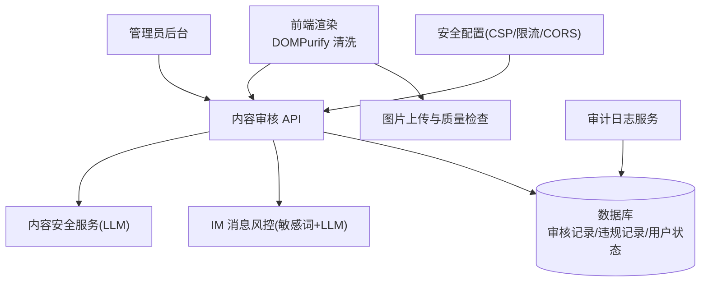
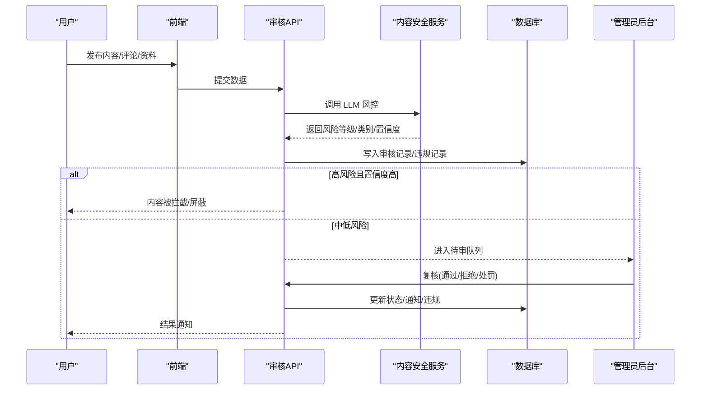
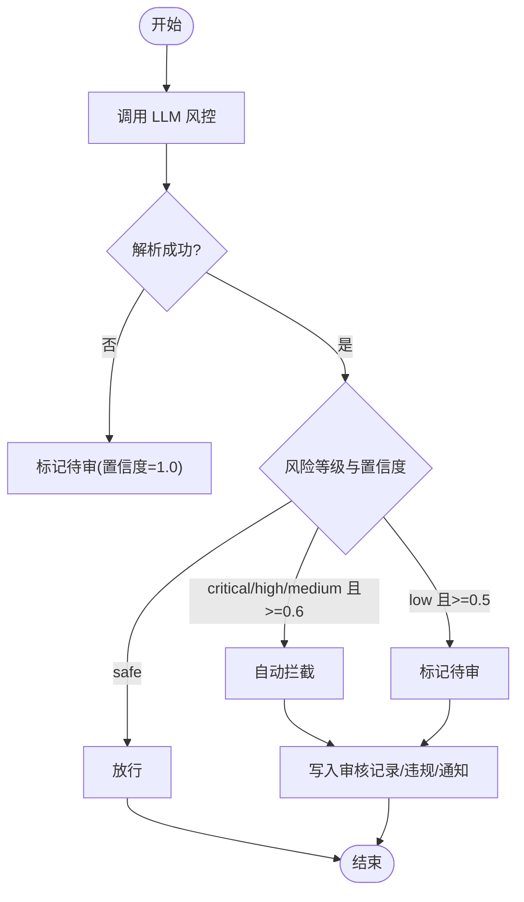
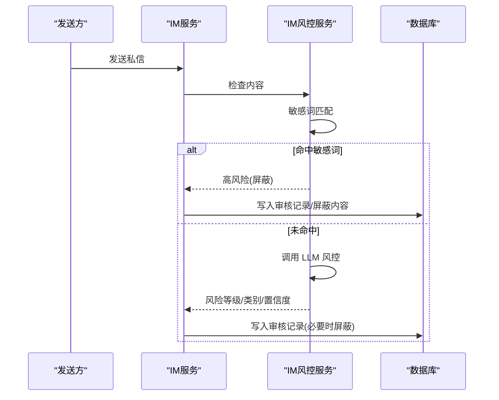
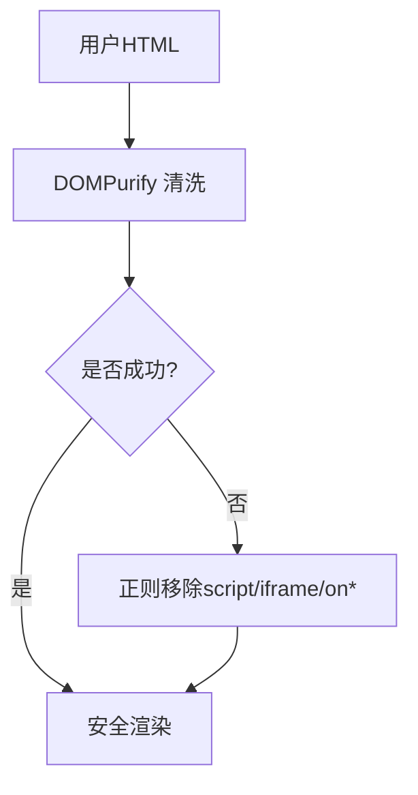
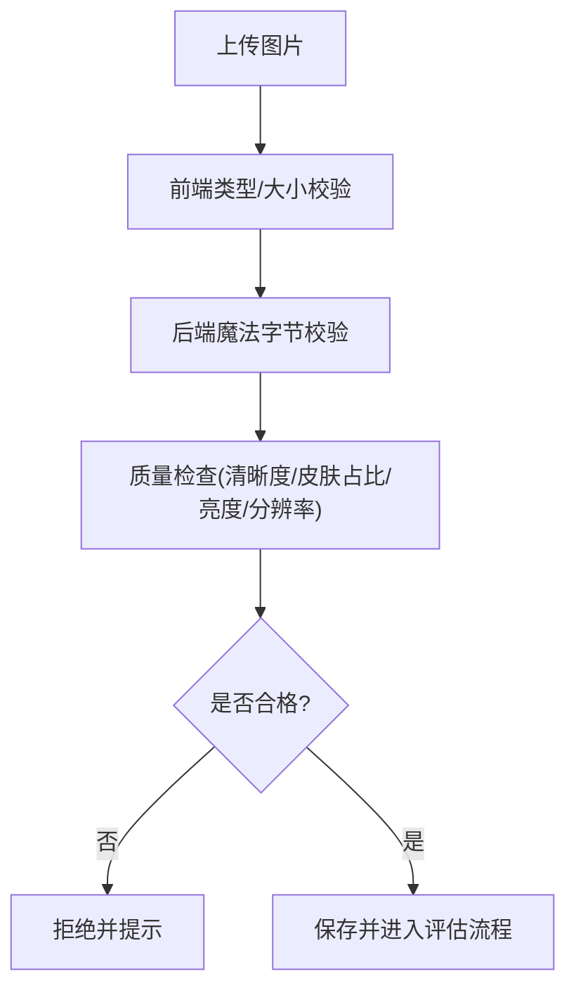
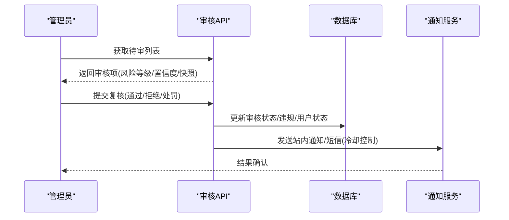
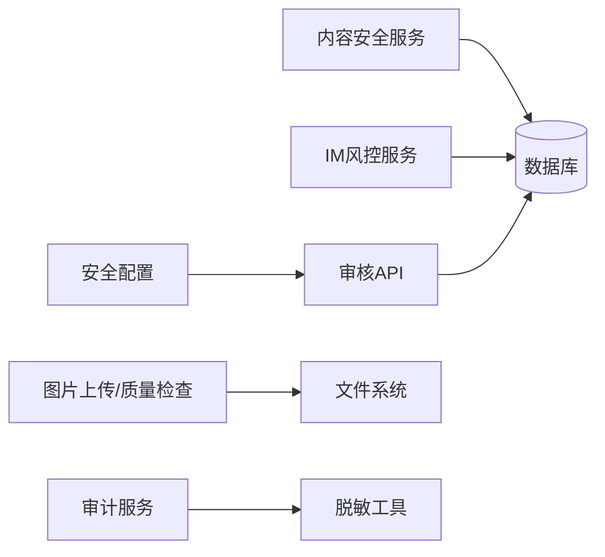

# 内容安全处理

<cite>
**本文引用的文件**
- [web/backend/services/content_safety.py](file://web/backend/services/content_safety.py)
- [web/backend/services/im_moderation.py](file://web/backend/services/im_moderation.py)
- [web/backend/api/moderation.py](file://web/backend/api/moderation.py)
- [web/backend/api/im_admin.py](file://web/backend/api/im_admin.py)
- [web/app/src/utils/file-url.ts](file://web/app/src/utils/file-url.ts)
- [configs/web_config.yaml](file://configs/web_config.yaml)
- [web/backend/services/vasi.py](file://web/backend/services/vasi.py)
- [web/backend/api/vasi.py](file://web/backend/api/vasi.py)
- [tests/backend/services/test_vasi.py](file://tests/backend/services/test_vasi.py)
- [web/backend/utils/redact.py](file://web/backend/utils/redact.py)
- [web/backend/services/audit.py](file://web/backend/services/audit.py)
- [web/backend/api/audit.py](file://web/backend/api/audit.py)
- [web/admin/src/views/Moderation.vue](file://web/admin/src/views/Moderation.vue)
- [web/app/src/components/moderation/ModerationPanel.vue](file://web/app/src/components/moderation/ModerationPanel.vue)
</cite>

## 目录
1. [简介](#简介)
2. [项目结构](#项目结构)
3. [核心组件](#核心组件)
4. [架构总览](#架构总览)
5. [详细组件分析](#详细组件分析)
6. [依赖关系分析](#依赖关系分析)
7. [性能考量](#性能考量)
8. [故障排查指南](#故障排查指南)
9. [结论](#结论)
10. [附录](#附录)

## 简介
本技术文档面向 Subskin 百科知识库的内容安全处理系统，系统性说明 XSS 防护、输入验证、内容消毒、敏感词过滤、恶意代码检测、图片安全检查与安全标记清理等能力；并阐述内容审核工作流（AI 辅助 + 人工复核）、安全配置与白名单管理、自定义规则扩展方法，以及常见威胁的防护策略、漏洞扫描与安全审计工具的使用建议。

## 项目结构
内容安全相关能力横跨前端渲染、后端服务、API 接口、配置与审计日志：
- 前端渲染层：对用户生成的富文本进行 DOMPurify 清洗，避免 v-html 执行恶意脚本。
- 后端风控服务：基于 LLM 的内容安全检测、IM 消息风控、自动处置与处罚联动。
- 审核 API：提供待审队列、复核动作、历史查询与通知统计。
- 图片上传校验：魔法字节校验、类型与大小限制、质量检查。
- 安全配置：CSP、速率限制、CORS、安全响应头。
- 审计与脱敏：操作审计、IP 脱敏、不可篡改的审计轨迹。

**图示来源**
- [web/app/src/utils/file-url.ts:109-139](file://web/app/src/utils/file-url.ts#L109-L139)
- [web/backend/services/content_safety.py:54-86](file://web/backend/services/content_safety.py#L54-L86)
- [web/backend/services/im_moderation.py:36-88](file://web/backend/services/im_moderation.py#L36-L88)
- [web/backend/api/moderation.py:144-180](file://web/backend/api/moderation.py#L144-L180)
- [configs/web_config.yaml:253-284](file://configs/web_config.yaml#L253-L284)

**章节来源**
- [web/app/src/utils/file-url.ts:109-139](file://web/app/src/utils/file-url.ts#L109-L139)
- [configs/web_config.yaml:253-284](file://configs/web_config.yaml#L253-L284)

## 核心组件
- 内容安全检测服务：对帖子、评论、个人资料字段调用 LLM 判定风险等级与类别，生成自动处置策略（通过/拦截/标记），并写入审核记录与用户违规信息。
- IM 消息风控：先进行敏感词快速匹配，再走 LLM 二次判断；高风险直接屏蔽并记录违规。
- 审核 API：提供待审列表、复核动作（通过/拒绝/升级）、历史查询与未读通知计数。
- 图片安全：上传前类型/大小校验，后端魔法字节校验，质量检查（清晰度、皮肤占比、亮度、分辨率）。
- 安全配置：启用 CSP、HSTS、XSS 保护、Content-Type 嗅探防护、Frame 选项限制，以及 CORS 白名单与速率限制。
- 审计与脱敏：审计日志记录关键操作，IP 地址存储时脱敏，支持按目标查询审计轨迹。

**章节来源**
- [web/backend/services/content_safety.py:54-86](file://web/backend/services/content_safety.py#L54-L86)
- [web/backend/services/im_moderation.py:36-88](file://web/backend/services/im_moderation.py#L36-L88)
- [web/backend/api/moderation.py:144-180](file://web/backend/api/moderation.py#L144-L180)
- [web/backend/services/vasi.py:559-590](file://web/backend/services/vasi.py#L559-L590)
- [web/backend/api/vasi.py:511-541](file://web/backend/api/vasi.py#L511-L541)
- [configs/web_config.yaml:253-284](file://configs/web_config.yaml#L253-L284)
- [web/backend/utils/redact.py:46-53](file://web/backend/utils/redact.py#L46-L53)
- [web/backend/services/audit.py:15-39](file://web/backend/services/audit.py#L15-L39)

## 架构总览
内容从产生到展示的安全路径如下：
- 前端渲染：使用 DOMPurify 严格白名单标签与属性，禁用 data-* 属性，防止存储型 XSS。
- 后端入库前：内容安全服务对标题/正文/评论/资料字段进行 LLM 风险评估，必要时自动拦截或标记待审。
- IM 通道：敏感词命中即高优先级拦截，否则由 LLM 判定。
- 图片上传：前端限制类型与大小，后端进行魔法字节校验与质量评估，拒绝伪装格式与低质图片。
- 审核闭环：AI 给出风险等级与置信度，管理员在后台进行最终决策（通过/拒绝/处罚），并触发通知与违规累计。

**图示来源**
- [web/backend/services/content_safety.py:103-145](file://web/backend/services/content_safety.py#L103-L145)
- [web/backend/api/moderation.py:144-180](file://web/backend/api/moderation.py#L144-L180)
- [web/admin/src/views/Moderation.vue:592-622](file://web/admin/src/views/Moderation.vue#L592-L622)

## 详细组件分析

### 内容安全服务（LLM 风控）
- 功能要点：
  - 对帖子、评论、个人资料字段进行 LLM 风险评估，输出风险等级、类别、原因与置信度。
  - 根据风险等级与置信度决定自动处置：严重/高危/中危在高置信度下直接拦截；低危标记待审。
  - 写入 ContentModeration 记录，并在需要时更新 Post/Comment 状态、用户违规与通知。
- 异常处理：
  - LLM 不可用或解析失败时，降级为“标记待审”，确保不遗漏可疑内容。
- 自动化处罚：
  - 依据风险等级累计违规次数，达到阈值触发禁言或封号，并同步用户状态。

**图示来源**
- [web/backend/services/content_safety.py:54-86](file://web/backend/services/content_safety.py#L54-L86)
- [web/backend/services/content_safety.py:89-100](file://web/backend/services/content_safety.py#L89-L100)
- [web/backend/services/content_safety.py:103-145](file://web/backend/services/content_safety.py#L103-L145)

**章节来源**
- [web/backend/services/content_safety.py:54-86](file://web/backend/services/content_safety.py#L54-L86)
- [web/backend/services/content_safety.py:89-100](file://web/backend/services/content_safety.py#L89-L100)
- [web/backend/services/content_safety.py:103-145](file://web/backend/services/content_safety.py#L103-L145)

### IM 消息风控（敏感词 + LLM）
- 快速拦截：命中预设敏感词立即判定为高风险，并屏蔽消息内容。
- LLM 复核：未命中敏感词则交由 LLM 进行上下文理解，考虑医疗社区语境，避免误判正常病情交流。
- 违规记录：高风险消息写入 ImMessageModeration，并累计用户违规计数。

**图示来源**
- [web/backend/services/im_moderation.py:36-88](file://web/backend/services/im_moderation.py#L36-L88)
- [web/backend/services/im_moderation.py:91-148](file://web/backend/services/im_moderation.py#L91-L148)

**章节来源**
- [web/backend/services/im_moderation.py:36-88](file://web/backend/services/im_moderation.py#L36-L88)
- [web/backend/services/im_moderation.py:91-148](file://web/backend/services/im_moderation.py#L91-L148)

### 前端 XSS 防护与内容消毒
- 渲染前清洗：使用 DOMPurify 仅允许安全的富文本标签与属性，禁止 data-* 属性，避免事件处理器执行。
- 降级策略：若 DOMPurify 加载失败，回退为正则移除 script、iframe 与 on* 事件处理器，确保不渲染原始 HTML。
- 适用场景：v-html 渲染的用户生成内容必须经过清洗，防止存储型 XSS。

**图示来源**
- [web/app/src/utils/file-url.ts:109-139](file://web/app/src/utils/file-url.ts#L109-L139)

**章节来源**
- [web/app/src/utils/file-url.ts:109-139](file://web/app/src/utils/file-url.ts#L109-L139)

### 图片安全检查与质量评估
- 前端限制：仅接受 image/*，限制最大尺寸（如 10MB），拖拽与选择均做类型与大小校验。
- 后端校验：
  - 魔法字节校验：拒绝 Content-Type 伪造与多态文件，仅允许真实 JPG/PNG/WebP。
  - 质量检查：清晰度、皮肤占比、亮度、分辨率等指标，提供改进建议。
- 测试覆盖：针对过大、不支持格式、无效身体部位等边界用例进行断言。

**图示来源**
- [web/backend/services/vasi.py:559-590](file://web/backend/services/vasi.py#L559-L590)
- [web/backend/api/vasi.py:511-541](file://web/backend/api/vasi.py#L511-L541)
- [tests/backend/services/test_vasi.py:45-82](file://tests/backend/services/test_vasi.py#L45-L82)

**章节来源**
- [web/backend/services/vasi.py:559-590](file://web/backend/services/vasi.py#L559-L590)
- [web/backend/api/vasi.py:511-541](file://web/backend/api/vasi.py#L511-L541)
- [tests/backend/services/test_vasi.py:45-82](file://tests/backend/services/test_vasi.py#L45-L82)

### 审核工作流与人工复核
- AI 辅助：内容安全服务输出风险等级、类别、原因与置信度，并生成自动处置建议。
- 人工复核：管理员在后台查看待审队列，执行通过/拒绝/处罚，并填写备注。
- 结果反馈：通过则恢复可见；拒绝则屏蔽内容并记录违规；处罚可触发禁言或封号，并发送站内通知与短信（带冷却防刷）。

**图示来源**
- [web/backend/api/moderation.py:144-180](file://web/backend/api/moderation.py#L144-L180)
- [web/admin/src/views/Moderation.vue:592-622](file://web/admin/src/views/Moderation.vue#L592-L622)
- [web/app/src/components/moderation/ModerationPanel.vue:23-47](file://web/app/src/components/moderation/ModerationPanel.vue#L23-L47)

**章节来源**
- [web/backend/api/moderation.py:144-180](file://web/backend/api/moderation.py#L144-L180)
- [web/admin/src/views/Moderation.vue:592-622](file://web/admin/src/views/Moderation.vue#L592-L622)
- [web/app/src/components/moderation/ModerationPanel.vue:23-47](file://web/app/src/components/moderation/ModerationPanel.vue#L23-L47)

### 安全配置与白名单管理
- 速率限制：每分钟/每小时请求上限，防止滥用。
- CORS：限定允许的源，生产环境建议使用站点域名，开发环境保留本地调试地址。
- CSP：默认仅允许同源资源，脚本/样式允许内联（可按需收紧），图片允许自有域与 https 外链。
- 安全响应头：启用 HSTS、XSS 保护、Content-Type 嗅探防护、Frame 选项 DENY。

**章节来源**
- [configs/web_config.yaml:253-284](file://configs/web_config.yaml#L253-L284)

### 审计与数据脱敏
- 审计日志：记录关键操作（创建/撤销/查询），支持按目标查询审计轨迹，非管理员仅能查看自身行为，防止 IDOR。
- 数据脱敏：IP 地址存储时脱敏（保留前两段），手机号、邮箱、姓名等敏感字段按规范脱敏。

**章节来源**
- [web/backend/services/audit.py:15-39](file://web/backend/services/audit.py#L15-L39)
- [web/backend/api/audit.py:101-124](file://web/backend/api/audit.py#L101-L124)
- [web/backend/utils/redact.py:46-53](file://web/backend/utils/redact.py#L46-L53)

## 依赖关系分析
- 内容安全服务依赖 LLM 配置与 OpenAI 客户端，结合数据库模型写入审核与违规记录。
- IM 风控依赖敏感词表与 LLM 配置，写入 IM 审核记录与用户违规。
- 审核 API 依赖认证与权限控制，读取/更新审核记录与用户状态。
- 图片上传依赖质量检查服务与文件系统，魔法字节校验前置以阻断恶意文件。
- 审计服务依赖脱敏工具，确保 IP 等敏感信息不泄露。

**图示来源**
- [web/backend/services/content_safety.py:103-145](file://web/backend/services/content_safety.py#L103-L145)
- [web/backend/services/im_moderation.py:91-148](file://web/backend/services/im_moderation.py#L91-L148)
- [web/backend/api/moderation.py:144-180](file://web/backend/api/moderation.py#L144-L180)
- [web/backend/services/vasi.py:559-590](file://web/backend/services/vasi.py#L559-L590)
- [web/backend/utils/redact.py:46-53](file://web/backend/utils/redact.py#L46-L53)

**章节来源**
- [web/backend/services/content_safety.py:103-145](file://web/backend/services/content_safety.py#L103-L145)
- [web/backend/services/im_moderation.py:91-148](file://web/backend/services/im_moderation.py#L91-L148)
- [web/backend/api/moderation.py:144-180](file://web/backend/api/moderation.py#L144-L180)
- [web/backend/services/vasi.py:559-590](file://web/backend/services/vasi.py#L559-L590)
- [web/backend/utils/redact.py:46-53](file://web/backend/utils/redact.py#L46-L53)

## 性能考量
- LLM 调用延迟：内容安全与 IM 风控均涉及外部 LLM 调用，应设置超时与重试策略，并对高频接口实施缓存或异步化。
- 图片质量检查：CPU 密集，建议限制并发与文件大小，采用队列化处理。
- 审核队列：分页查询与索引优化，避免全表扫描；对高风险优先处理。
- 审计日志：批量写入与定期归档，避免影响主业务链路。

[本节为通用指导，无需特定文件引用]

## 故障排查指南
- LLM 不可用：
  - 现象：内容安全检测失败，返回“检测异常”并标记待审。
  - 排查：检查 LLM 配置、网络连通性与配额；确认解析 JSON 逻辑健壮性。
- 图片上传失败：
  - 现象：魔法字节校验失败或质量不达标。
  - 排查：确认文件签名、类型与大小；检查质量检查阈值与建议。
- 审核队列堆积：
  - 现象：待审数量增长，管理员处理不及时。
  - 排查：优化分页与索引；提升管理员处理能力；调整自动拦截阈值以减少误报。
- 审计日志缺失：
  - 现象：关键操作无审计记录。
  - 排查：确认审计服务调用点与权限；检查 IP 脱敏与存储逻辑。

**章节来源**
- [web/backend/services/content_safety.py:84-86](file://web/backend/services/content_safety.py#L84-L86)
- [web/backend/services/vasi.py:559-590](file://web/backend/services/vasi.py#L559-L590)
- [web/backend/api/vasi.py:511-541](file://web/backend/api/vasi.py#L511-L541)
- [web/backend/services/audit.py:15-39](file://web/backend/services/audit.py#L15-L39)

## 结论
Subskin 百科知识库的内容安全处理体系以前端 XSS 防护与内容消毒为基础，结合后端的 LLM 风控、敏感词过滤、图片安全检查与质量评估，构建了“AI 辅助 + 人工复核”的双层审核闭环。配合严格的安全配置、审计与脱敏机制，有效应对常见安全威胁。未来可进一步引入更细粒度的白名单管理、自定义规则引擎与持续的安全扫描与审计工具，以提升整体安全性与可维护性。

[本节为总结性内容，无需特定文件引用]

## 附录
- 自定义规则开发建议：
  - 在 IM 风控中扩展敏感词表，并结合 LLM 上下文减少误判。
  - 在前端 DOMPurify 白名单中按需增减标签与属性，保持最小权限原则。
  - 在内容安全服务中细化风险类别与阈值，结合业务场景调整自动处置策略。
- 漏洞扫描与安全审计工具：
  - 建议使用静态应用安全测试（SAST）与依赖漏洞扫描（SCA）工具，纳入 CI 流水线。
  - 定期进行渗透测试与合规审计，关注日志中的敏感信息与权限控制问题。

[本节为通用指导，无需特定文件引用]