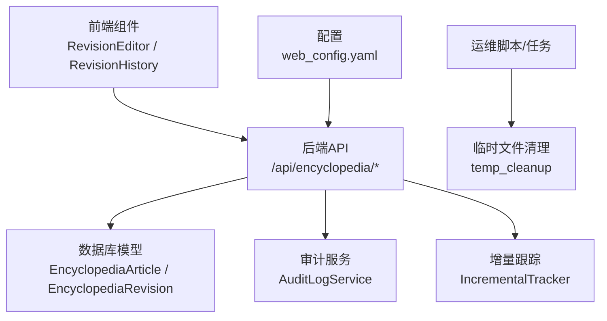
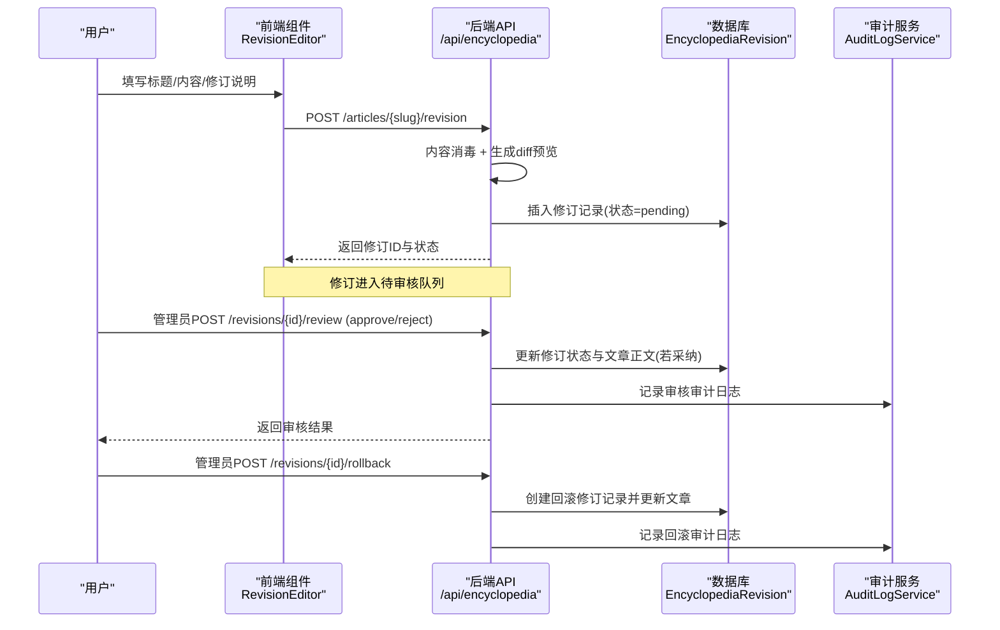
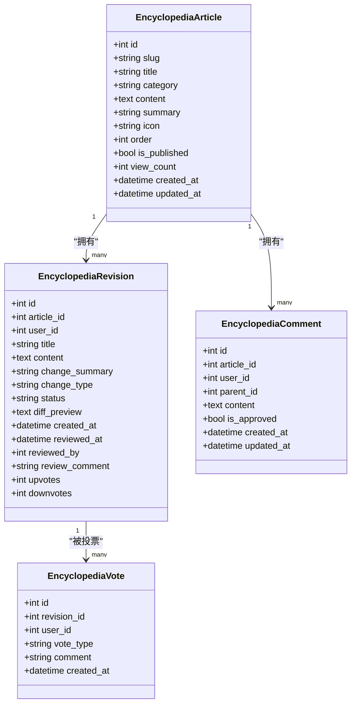
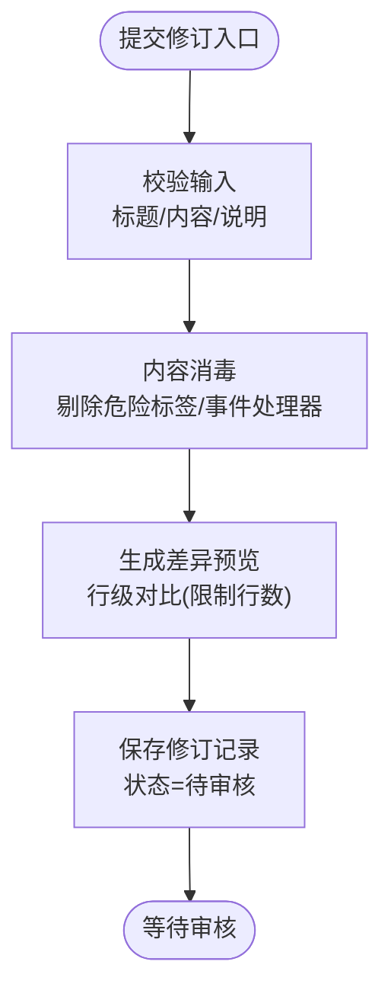
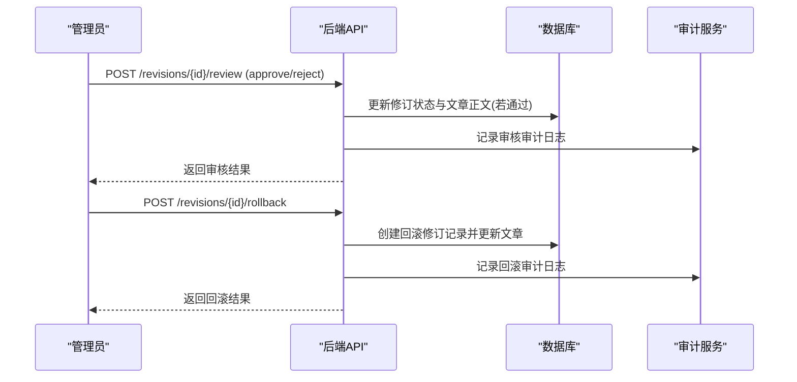
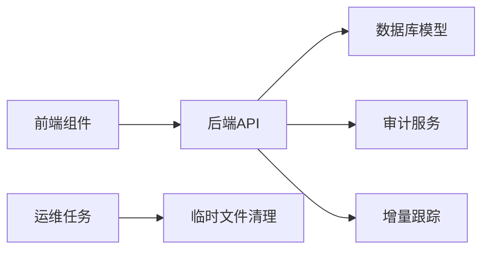

# 版本控制系统

<cite>
**本文引用的文件**
- [web/backend/database/models_encyclopedia.py](file://web/backend/database/models_encyclopedia.py)
- [web/backend/api/encyclopedia.py](file://web/backend/api/encyclopedia.py)
- [web/app/src/components/encyclopedia/RevisionHistory.vue](file://web/app/src/components/encyclopedia/RevisionHistory.vue)
- [web/app/src/components/encyclopedia/RevisionEditor.vue](file://web/app/src/components/encyclopedia/RevisionEditor.vue)
- [web/backend/services/audit.py](file://web/backend/services/audit.py)
- [web/backend/api/audit.py](file://web/backend/api/audit.py)
- [src/utils/incremental_tracker.py](file://src/utils/incremental_tracker.py)
- [web/backend/services/temp_cleanup.py](file://web/backend/services/temp_cleanup.py)
- [configs/web_config.yaml](file://configs/web_config.yaml)
- [tests/test_incremental_tracker.py](file://tests/test_incremental_tracker.py)
</cite>

## 目录
1. [简介](#简介)
2. [项目结构](#项目结构)
3. [核心组件](#核心组件)
4. [架构总览](#架构总览)
5. [详细组件分析](#详细组件分析)
6. [依赖关系分析](#依赖关系分析)
7. [性能与存储优化](#性能与存储优化)
8. [故障排查指南](#故障排查指南)
9. [结论](#结论)
10. [附录](#附录)

## 简介
本技术文档面向 Subskin 百科知识库的版本控制系统，聚焦内容版本管理机制、变更追踪与差异比较、修订提交流程、版本分支与合并冲突策略、版本历史展示与回滚操作的用户界面设计，以及版本权限控制、审计日志与合规性检查的实现方案。同时给出大数据量版本存储优化、增量备份与版本清理策略的技术细节，帮助读者从前端到后端完整理解版本控制的实现与运维要点。

## 项目结构
版本控制相关代码主要分布在以下位置：
- 数据库模型：百科文章、修订记录、评论与投票等实体定义
- 后端 API：提交修订、列出修订历史、审核、回滚、投票等接口
- 前端组件：修订编辑器、修订历史列表、投票与状态展示
- 审计服务：统一审计日志记录、查询与撤销能力
- 增量更新跟踪：用于日常自动化执行中的增量变更记录
- 临时文件清理：定期清理上传临时文件，释放存储空间
- 配置项：百科分类、自动生成与发布频率等

图表来源
- [web/backend/api/encyclopedia.py:227-308](file://web/backend/api/encyclopedia.py#L227-L308)
- [web/backend/database/models_encyclopedia.py:18-89](file://web/backend/database/models_encyclopedia.py#L18-L89)
- [web/backend/services/audit.py:15-92](file://web/backend/services/audit.py#L15-L92)
- [src/utils/incremental_tracker.py:53-137](file://src/utils/incremental_tracker.py#L53-L137)
- [web/backend/services/temp_cleanup.py:15-65](file://web/backend/services/temp_cleanup.py#L15-L65)
- [configs/web_config.yaml:136-183](file://configs/web_config.yaml#L136-L183)

章节来源
- [web/backend/database/models_encyclopedia.py:18-89](file://web/backend/database/models_encyclopedia.py#L18-L89)
- [web/backend/api/encyclopedia.py:227-308](file://web/backend/api/encyclopedia.py#L227-L308)
- [web/app/src/components/encyclopedia/RevisionHistory.vue:30-61](file://web/app/src/components/encyclopedia/RevisionHistory.vue#L30-L61)
- [web/app/src/components/encyclopedia/RevisionEditor.vue:28-51](file://web/app/src/components/encyclopedia/RevisionEditor.vue#L28-L51)
- [web/backend/services/audit.py:15-92](file://web/backend/services/audit.py#L15-L92)
- [src/utils/incremental_tracker.py:53-137](file://src/utils/incremental_tracker.py#L53-L137)
- [web/backend/services/temp_cleanup.py:15-65](file://web/backend/services/temp_cleanup.py#L15-L65)
- [configs/web_config.yaml:136-183](file://configs/web_config.yaml#L136-L183)

## 核心组件
- 百科文章与修订模型：定义文章主表与修订记录表，包含标题、内容、变更说明、变更类型、审核状态、差异预览、审核信息与投票统计等字段，并建立索引以优化查询性能。
- 修订 API：提供提交修订建议、列出修订历史、管理员审核（通过/拒绝）、回滚到指定版本、对修订进行投票评估等接口。
- 前端修订组件：提供修订编辑器（填写标题、内容与修订说明）和修订历史视图（筛选状态、查看差异、投票）。
- 审计服务：提供统一的审计日志创建、查询、按目标追溯与撤销能力，支持 IP 脱敏与不可篡改的审计记录。
- 增量更新跟踪：记录每日新增或更新的资源（论文、临床试验等），便于生成日报与通知。
- 临时文件清理：定时扫描并删除过期临时上传文件，避免磁盘占用过大。
- 配置管理：百科分类、自动生成功能开关与频率、社区内容质量阈值等。

章节来源
- [web/backend/database/models_encyclopedia.py:18-89](file://web/backend/database/models_encyclopedia.py#L18-L89)
- [web/backend/api/encyclopedia.py:227-469](file://web/backend/api/encyclopedia.py#L227-L469)
- [web/app/src/components/encyclopedia/RevisionEditor.vue:28-51](file://web/app/src/components/encyclopedia/RevisionEditor.vue#L28-L51)
- [web/app/src/components/encyclopedia/RevisionHistory.vue:30-61](file://web/app/src/components/encyclopedia/RevisionHistory.vue#L30-L61)
- [web/backend/services/audit.py:15-92](file://web/backend/services/audit.py#L15-L92)
- [src/utils/incremental_tracker.py:53-137](file://src/utils/incremental_tracker.py#L53-L137)
- [web/backend/services/temp_cleanup.py:15-65](file://web/backend/services/temp_cleanup.py#L15-L65)
- [configs/web_config.yaml:136-183](file://configs/web_config.yaml#L136-L183)

## 架构总览
版本控制流程涵盖用户在前端编辑并提交修订建议，后端进行内容消毒与差异摘要生成，持久化修订记录并进入待审核队列；管理员审核后采纳则更新文章内容，拒绝则标记为拒绝；支持回滚到历史版本并记录回滚操作；所有关键操作均写入审计日志，支持按目标追溯与撤销。

图表来源
- [web/backend/api/encyclopedia.py:227-308](file://web/backend/api/encyclopedia.py#L227-L308)
- [web/backend/api/encyclopedia.py:311-404](file://web/backend/api/encyclopedia.py#L311-L404)
- [web/backend/services/audit.py:15-92](file://web/backend/services/audit.py#L15-L92)

## 详细组件分析

### 数据模型与版本实体
- 百科文章：包含 slug、标题、分类、内容、摘要、图标、排序、是否发布、浏览量、时间戳等字段，并提供分类与发布状态的索引。
- 修订记录：关联文章与用户，记录标题、内容、变更说明、变更类型（建议/已采纳/已拒绝/回滚）、审核状态（待审核/已采纳/已拒绝）、差异预览、审核时间与审核人、投票统计等，并建立多列索引以提升查询效率。
- 评论与投票：评论支持父子回复结构与审核标志；投票支持用户对修订的上/下投票，且同一用户在同一修订上仅保留一条投票记录。

图表来源
- [web/backend/database/models_encyclopedia.py:18-89](file://web/backend/database/models_encyclopedia.py#L18-L89)
- [web/backend/database/models_encyclopedia.py:91-134](file://web/backend/database/models_encyclopedia.py#L91-L134)

章节来源
- [web/backend/database/models_encyclopedia.py:18-89](file://web/backend/database/models_encyclopedia.py#L18-L89)
- [web/backend/database/models_encyclopedia.py:91-134](file://web/backend/database/models_encyclopedia.py#L91-L134)

### 修订提交流程与差异比较
- 提交修订：前端组件收集标题、内容与修订说明，调用后端接口提交；后端进行轻量内容消毒，剔除危险标签与事件处理器，生成简化版差异预览（行级对比，限制行数），并插入修订记录，初始状态为“待审核”。
- 差异预览：采用行级对比算法，输出“-”与“+”行变化片段，超过阈值时截断并提示更多变更。
- 历史列表：前端支持按状态筛选（全部/待审核/已采纳/已拒绝），显示每条修订的状态标签、变更类型、时间、变更说明与差异预览，并支持投票。

图表来源
- [web/backend/api/encyclopedia.py:139-182](file://web/backend/api/encyclopedia.py#L139-L182)
- [web/backend/api/encyclopedia.py:227-271](file://web/backend/api/encyclopedia.py#L227-L271)
- [web/app/src/components/encyclopedia/RevisionHistory.vue:30-61](file://web/app/src/components/encyclopedia/RevisionHistory.vue#L30-L61)

章节来源
- [web/backend/api/encyclopedia.py:139-182](file://web/backend/api/encyclopedia.py#L139-L182)
- [web/backend/api/encyclopedia.py:227-271](file://web/backend/api/encyclopedia.py#L227-L271)
- [web/app/src/components/encyclopedia/RevisionHistory.vue:30-61](file://web/app/src/components/encyclopedia/RevisionHistory.vue#L30-L61)

### 审核、回滚与投票
- 审核：管理员可对修订进行通过或拒绝；通过时将修订内容同步至文章正文并更新时间戳，拒绝则标记为拒绝；记录审核人与审核意见。
- 回滚：管理员可回滚到指定修订版本，系统会创建一条类型为“回滚”的修订记录，并将文章标题与内容恢复为目标修订的内容。
- 投票：用户可对修订进行上/下投票，支持切换或取消投票；后端维护票数统计，防止重复投票。

图表来源
- [web/backend/api/encyclopedia.py:311-404](file://web/backend/api/encyclopedia.py#L311-L404)
- [web/backend/services/audit.py:15-92](file://web/backend/services/audit.py#L15-L92)

章节来源
- [web/backend/api/encyclopedia.py:311-404](file://web/backend/api/encyclopedia.py#L311-L404)
- [web/backend/services/audit.py:15-92](file://web/backend/services/audit.py#L15-L92)

### 版本历史展示与差异视图
- 前端修订历史组件：提供筛选标签（全部/待审核/已采纳/已拒绝），渲染每条修订的编号、状态标签、变更类型、时间、变更说明与差异预览；未登录状态下禁用投票按钮。
- 差异预览：使用折叠面板展示行级差异片段，便于快速审阅变更范围。

章节来源
- [web/app/src/components/encyclopedia/RevisionHistory.vue:30-61](file://web/app/src/components/encyclopedia/RevisionHistory.vue#L30-L61)
- [web/app/src/components/encyclopedia/RevisionHistory.vue:91-169](file://web/app/src/components/encyclopedia/RevisionHistory.vue#L91-L169)

### 版本权限控制与审计日志
- 权限控制：审核与回滚接口要求管理员权限；普通用户只能提交修订建议与投票。
- 审计日志：审计服务提供创建、查询、按目标追溯与撤销能力；IP 地址在入库前进行脱敏；非管理员查询目标审计轨迹时仅返回其自身操作，防止 IDOR 风险。
- 合规性：条款页面明确审计日志不可修改、不可删除，确保授权行为可追溯。

章节来源
- [web/backend/api/encyclopedia.py:311-404](file://web/backend/api/encyclopedia.py#L311-L404)
- [web/backend/services/audit.py:15-92](file://web/backend/services/audit.py#L15-L92)
- [web/backend/api/audit.py:55-123](file://web/backend/api/audit.py#L55-L123)

### 版本分支管理与合并冲突解决策略
当前实现采用线性版本流：每次修订作为独立记录，审核通过后直接覆盖文章正文；不存在显式分支与合并操作。对于冲突场景，建议策略：
- 基于修订链的冲突检测：在审核通过前计算与当前文章内容的差异，若存在并发修改，提示作者重新拉取最新内容后再提交。
- 合并策略：优先采用“最后提交者胜”或“人工介入合并”，由管理员在审核阶段选择采纳某条修订并记录合并原因。
- 分支模拟：可通过“草稿修订”与“发布修订”两种状态区分工作分支，发布即合并。

[本节为概念性说明，不直接分析具体文件]

### 增量备份与版本清理策略
- 增量更新跟踪：使用 SQLite 记录每日新增或更新的资源（论文、临床试验等），支持按日汇总、未处理记录查询与旧记录清理。
- 临时文件清理：后台循环扫描临时上传目录，删除超过阈值的文件并清理空目录，避免磁盘空间膨胀。
- 配置驱动：百科自动生成功能与周报分发可在配置中启用与调度。

章节来源
- [src/utils/incremental_tracker.py:53-137](file://src/utils/incremental_tracker.py#L53-L137)
- [src/utils/incremental_tracker.py:219-285](file://src/utils/incremental_tracker.py#L219-L285)
- [web/backend/services/temp_cleanup.py:15-65](file://web/backend/services/temp_cleanup.py#L15-L65)
- [configs/web_config.yaml:136-183](file://configs/web_config.yaml#L136-L183)
- [tests/test_incremental_tracker.py:18-48](file://tests/test_incremental_tracker.py#L18-L48)

## 依赖关系分析
版本控制模块依赖关系如下：
- 前端组件依赖后端 API 获取与提交修订数据
- 后端 API 依赖数据库模型进行持久化
- 审核与回滚操作触发审计服务记录
- 增量跟踪与临时清理作为辅助运维能力，与版本控制解耦但共同支撑系统稳定性

图表来源
- [web/backend/api/encyclopedia.py:227-469](file://web/backend/api/encyclopedia.py#L227-L469)
- [web/backend/database/models_encyclopedia.py:18-89](file://web/backend/database/models_encyclopedia.py#L18-L89)
- [web/backend/services/audit.py:15-92](file://web/backend/services/audit.py#L15-L92)
- [src/utils/incremental_tracker.py:53-137](file://src/utils/incremental_tracker.py#L53-L137)
- [web/backend/services/temp_cleanup.py:15-65](file://web/backend/services/temp_cleanup.py#L15-L65)

章节来源
- [web/backend/api/encyclopedia.py:227-469](file://web/backend/api/encyclopedia.py#L227-L469)
- [web/backend/database/models_encyclopedia.py:18-89](file://web/backend/database/models_encyclopedia.py#L18-L89)
- [web/backend/services/audit.py:15-92](file://web/backend/services/audit.py#L15-L92)
- [src/utils/incremental_tracker.py:53-137](file://src/utils/incremental_tracker.py#L53-L137)
- [web/backend/services/temp_cleanup.py:15-65](file://web/backend/services/temp_cleanup.py#L15-L65)

## 性能与存储优化
- 数据库索引：为修订记录建立 article_id、status、user_id 及复合索引，提升按文章与状态查询的效率。
- 差异预览限制：行级对比限制最大行数，避免大文档导致的前端渲染与网络传输压力。
- 内容消毒：后端轻量消毒减少恶意载荷入库风险，降低后续处理成本。
- 增量跟踪：SQLite 本地库记录每日更新，支持按日汇总与清理，降低主库压力。
- 临时文件清理：定时清理过期上传文件，保持磁盘健康。
- 配置化调度：百科自动生成与周报分发可按周调度，避免频繁全量处理。

章节来源
- [web/backend/database/models_encyclopedia.py:44-53](file://web/backend/database/models_encyclopedia.py#L44-L53)
- [web/backend/api/encyclopedia.py:160-182](file://web/backend/api/encyclopedia.py#L160-L182)
- [src/utils/incremental_tracker.py:72-98](file://src/utils/incremental_tracker.py#L72-L98)
- [web/backend/services/temp_cleanup.py:15-65](file://web/backend/services/temp_cleanup.py#L15-L65)
- [configs/web_config.yaml:136-183](file://configs/web_config.yaml#L136-L183)

## 故障排查指南
- 修订提交失败：检查前端表单校验（内容长度、修订说明必填），确认后端内容消毒与差异生成逻辑正常。
- 审核接口 403：确认当前用户具备管理员权限；检查权限中间件与认证依赖是否正确注入。
- 回滚无效：确认目标修订存在且未被处理；检查回滚后文章正文是否更新。
- 审计日志缺失：确认审计服务正确调用并写入；检查 IP 脱敏与 JSON 序列化异常。
- 增量跟踪异常：检查 SQLite 连接与线程锁；确认日期过滤与未处理记录查询逻辑。
- 临时文件堆积：检查清理循环是否启动；确认超时阈值与目录路径配置。

章节来源
- [web/backend/api/encyclopedia.py:227-271](file://web/backend/api/encyclopedia.py#L227-L271)
- [web/backend/api/encyclopedia.py:311-404](file://web/backend/api/encyclopedia.py#L311-L404)
- [web/backend/services/audit.py:15-92](file://web/backend/services/audit.py#L15-L92)
- [src/utils/incremental_tracker.py:53-137](file://src/utils/incremental_tracker.py#L53-L137)
- [web/backend/services/temp_cleanup.py:15-65](file://web/backend/services/temp_cleanup.py#L15-L65)

## 结论
Subskin 百科知识库的版本控制系统以“修订建议—审核—采纳/拒绝—回滚”为核心流程，结合差异预览、投票评估与审计日志，形成完整的版本治理闭环。通过数据库索引、内容消毒、增量跟踪与临时文件清理等手段，系统在功能完备性与性能稳定性之间取得平衡。未来可引入分支与合并机制、冲突检测与人工合并策略，进一步提升协作效率与数据一致性。

## 附录
- 配置项参考：百科分类、自动生成功能开关与频率、社区内容质量阈值等，详见配置文件。
- 测试用例：增量更新跟踪的初始化、记录与汇总逻辑可通过测试验证。

章节来源
- [configs/web_config.yaml:136-183](file://configs/web_config.yaml#L136-L183)
- [tests/test_incremental_tracker.py:18-48](file://tests/test_incremental_tracker.py#L18-L48)