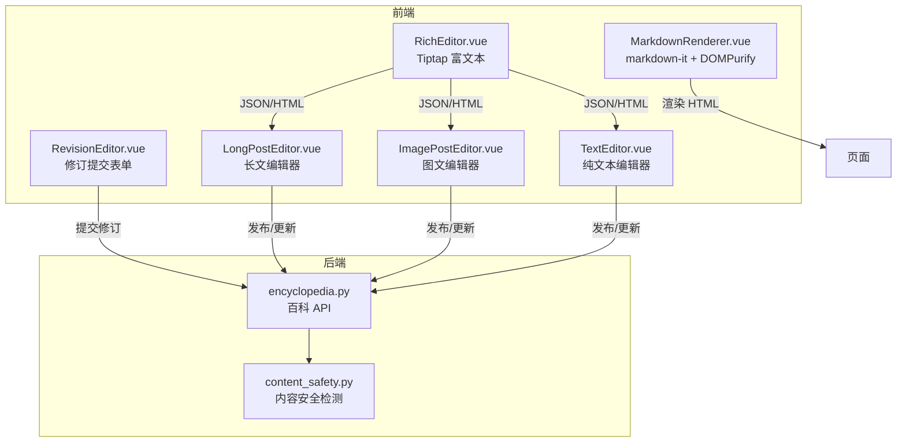
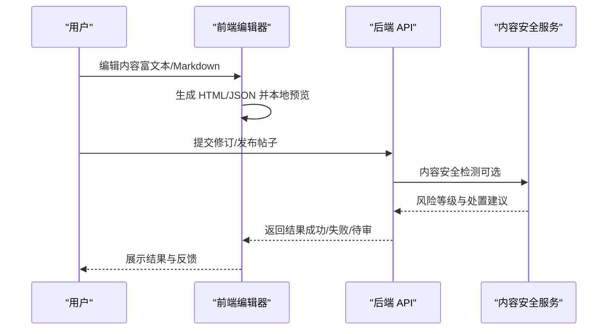
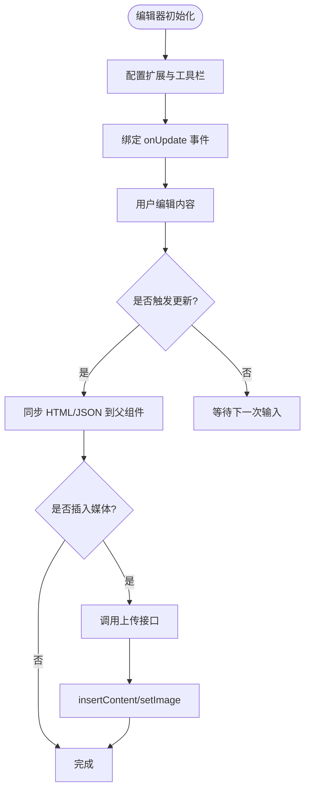
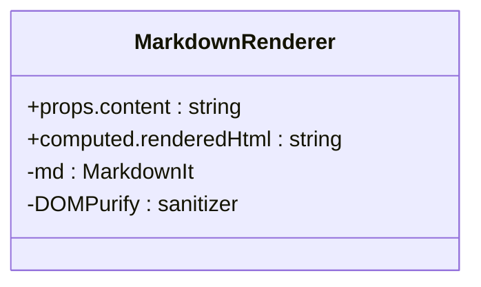
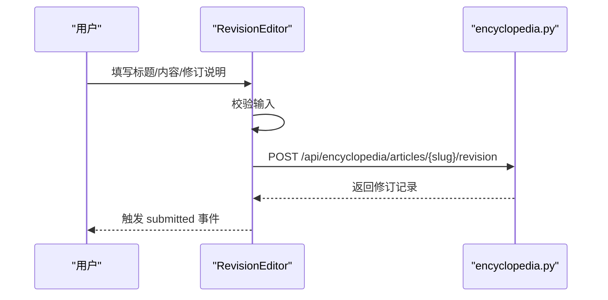
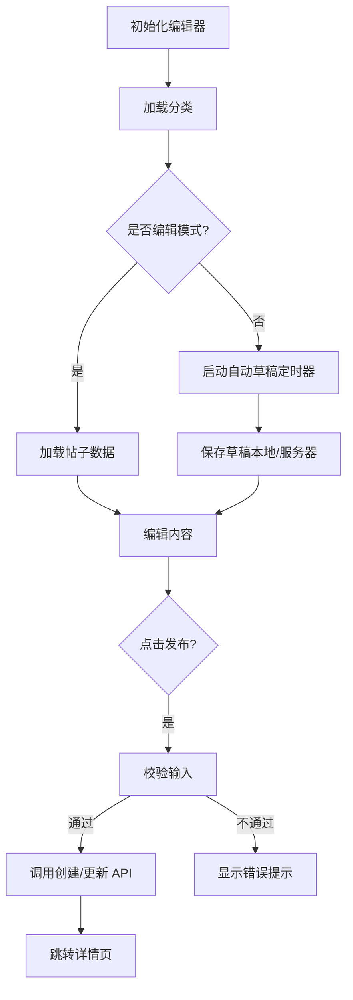
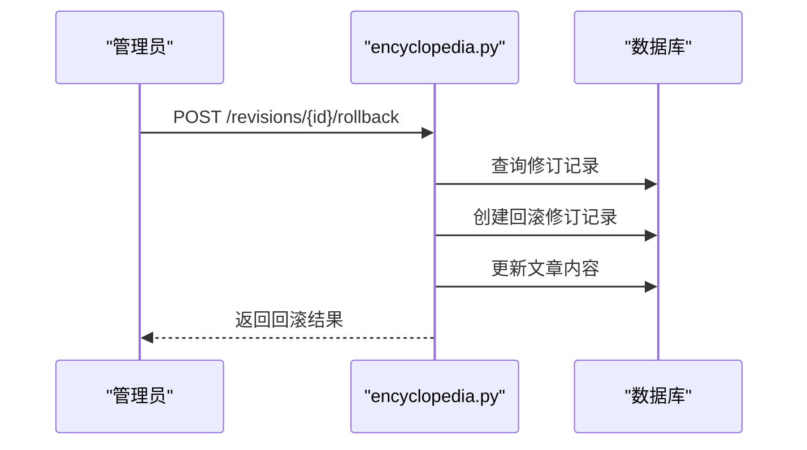
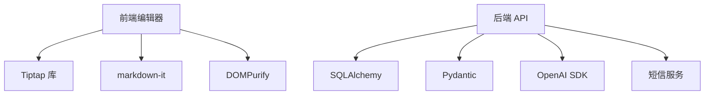

# 编辑器系统

<cite>
**本文引用的文件**   
- [RichEditor.vue](file://web/app/src/components/community/RichEditor.vue)
- [MarkdownRenderer.vue](file://web/app/src/components/encyclopedia/MarkdownRenderer.vue)
- [RevisionEditor.vue](file://web/app/src/components/encyclopedia/RevisionEditor.vue)
- [LongPostEditor.vue](file://web/app/src/components/community/Editor/LongPostEditor.vue)
- [ImagePostEditor.vue](file://web/app/src/components/community/Editor/ImagePostEditor.vue)
- [TextEditor.vue](file://web/app/src/components/community/Editor/TextEditor.vue)
- [encyclopedia.py](file://web/backend/api/encyclopedia.py)
- [content_safety.py](file://web/backend/services/content_safety.py)
</cite>

## 目录
1. [简介](#简介)
2. [项目结构](#项目结构)
3. [核心组件](#核心组件)
4. [架构总览](#架构总览)
5. [详细组件分析](#详细组件分析)
6. [依赖关系分析](#依赖关系分析)
7. [性能考量](#性能考量)
8. [故障排查指南](#故障排查指南)
9. [结论](#结论)
10. [附录](#附录)

## 简介
本技术文档面向 Subskin 百科知识库编辑器系统，聚焦 Markdown 编辑器实现、富文本能力、实时预览与协作编辑机制；深入说明内容安全过滤、XSS 防护、输入验证与内容消毒策略；并覆盖 AI 辅助写作、智能建议、语法检查与格式化工具的集成点。同时提供编辑器配置选项、扩展开发指南与自定义工具栏实现方法，以及版本对比、差异显示和回滚功能的用户界面设计说明。

## 项目结构
本项目采用前后端分离架构：
- 前端（Vue + TypeScript）：基于 Tiptap 构建富文本编辑器，结合 markdown-it 渲染百科内容，使用 DOMPurify 进行 XSS 防护。
- 后端（FastAPI + SQLAlchemy）：提供百科文章、修订提交、审核、投票、评论等 API，内置内容安全检测服务与轻量级存储侧消毒。

**图表来源** 
- [RichEditor.vue:1-703](file://web/app/src/components/community/RichEditor.vue#L1-L703)
- [MarkdownRenderer.vue:1-84](file://web/app/src/components/encyclopedia/MarkdownRenderer.vue#L1-L84)
- [RevisionEditor.vue:1-112](file://web/app/src/components/encyclopedia/RevisionEditor.vue#L1-L112)
- [LongPostEditor.vue:1-462](file://web/app/src/components/community/Editor/LongPostEditor.vue#L1-L462)
- [ImagePostEditor.vue:1-359](file://web/app/src/components/community/Editor/ImagePostEditor.vue#L1-L359)
- [TextEditor.vue:1-248](file://web/app/src/components/community/Editor/TextEditor.vue#L1-L248)
- [encyclopedia.py:1-586](file://web/backend/api/encyclopedia.py#L1-L586)
- [content_safety.py:1-368](file://web/backend/services/content_safety.py#L1-L368)

**章节来源**
- [RichEditor.vue:1-703](file://web/app/src/components/community/RichEditor.vue#L1-L703)
- [MarkdownRenderer.vue:1-84](file://web/app/src/components/encyclopedia/MarkdownRenderer.vue#L1-L84)
- [encyclopedia.py:1-586](file://web/backend/api/encyclopedia.py#L1-L586)

## 核心组件
- 富文本编辑器（RichEditor）：基于 Tiptap StarterKit，支持加粗、斜体、下划线、删除线、标题、列表、引用、分割线、链接、图片、音频、视频等。通过自定义 Node 扩展音视频节点，上传后插入编辑器。
- 百科内容渲染器（MarkdownRenderer）：使用 markdown-it 渲染 Markdown，启用 HTML 以兼容自定义块，并通过 DOMPurify 对输出 HTML 进行消毒，防止 XSS。
- 修订编辑器（RevisionEditor）：用于提交百科修订建议，包含标题、内容（Markdown）、修订说明，并进行基础校验后调用后端 API。
- 社区编辑器（LongPostEditor、ImagePostEditor、TextEditor）：分别处理长文、图文、纯文本发帖，包含自动草稿、分类选择、标签、心情、地理位置、隐私设置等。

**章节来源**
- [RichEditor.vue:1-703](file://web/app/src/components/community/RichEditor.vue#L1-L703)
- [MarkdownRenderer.vue:1-84](file://web/app/src/components/encyclopedia/MarkdownRenderer.vue#L1-L84)
- [RevisionEditor.vue:1-112](file://web/app/src/components/encyclopedia/RevisionEditor.vue#L1-L112)
- [LongPostEditor.vue:1-462](file://web/app/src/components/community/Editor/LongPostEditor.vue#L1-L462)
- [ImagePostEditor.vue:1-359](file://web/app/src/components/community/Editor/ImagePostEditor.vue#L1-L359)
- [TextEditor.vue:1-248](file://web/app/src/components/community/Editor/TextEditor.vue#L1-L248)

## 架构总览
编辑器系统的前后端交互流程如下：
- 用户在 RichEditor 中编辑内容，编辑器实时生成 HTML 与 JSON 数据，供父组件保存或发布。
- 百科内容在 MarkdownRenderer 中渲染为 HTML，并通过 DOMPurify 消毒。
- 修订提交由 RevisionEditor 发起，后端 encyclopedia.py 接收请求，执行轻量消毒与 diff 预览，写入修订记录。
- 内容安全检测由 content_safety.py 提供，基于 LLM 判定风险等级并执行自动处置。

**图表来源** 
- [RichEditor.vue:1-703](file://web/app/src/components/community/RichEditor.vue#L1-L703)
- [MarkdownRenderer.vue:1-84](file://web/app/src/components/encyclopedia/MarkdownRenderer.vue#L1-L84)
- [RevisionEditor.vue:1-112](file://web/app/src/components/encyclopedia/RevisionEditor.vue#L1-L112)
- [encyclopedia.py:1-586](file://web/backend/api/encyclopedia.py#L1-L586)
- [content_safety.py:1-368](file://web/backend/services/content_safety.py#L1-L368)

## 详细组件分析

### 富文本编辑器（RichEditor）
- 功能要点：
  - 基于 Tiptap StarterKit，扩展 Underline、Image、Link、Placeholder，并自定义 Audio、Video 节点。
  - 工具栏按钮通过 editor.chain().focus() 调用命令，支持加粗、斜体、下划线、删除线、标题 H1-H3、列表、引用、分割线、链接、媒体插入。
  - 媒体上传：图片、音频、视频分别限制类型与大小，上传成功后通过 insertContent 或 setImage 插入编辑器。
  - 双向绑定：onUpdate 事件同步 modelValue（HTML）与 contentJson（JSON），便于持久化与二次处理。
- 扩展开发指南：
  - 新增工具栏按钮：在模板中添加按钮，调用 editor.chain().focus().toggleXXX().run()。
  - 自定义节点：参考 Audio/Video 的 Node.create 定义，实现 addAttributes、parseHTML、renderHTML。
  - 配置项：StarterKit、Underline、Image、Link、Placeholder 可通过 configure 调整行为。
- 实时预览：
  - 编辑器内直接渲染，无需额外预览组件；如需外部预览，可复用 getHTML()/getJSON() 输出。

**图表来源** 
- [RichEditor.vue:1-703](file://web/app/src/components/community/RichEditor.vue#L1-L703)

**章节来源**
- [RichEditor.vue:1-703](file://web/app/src/components/community/RichEditor.vue#L1-L703)

### 百科内容渲染器（MarkdownRenderer）
- 功能要点：
  - 使用 markdown-it 渲染 Markdown，启用 html、linkify、typographer、breaks。
  - 通过 DOMPurify.sanitize 对渲染后的 HTML 进行消毒，防止 XSS。
  - 支持自定义块样式（如 .custom-block.info/warning/danger/tip）。
- 安全策略：
  - 渲染前允许 HTML（兼容自定义块），渲染后立即消毒，确保输出安全。
- 扩展开发指南：
  - 新增样式：在 style 中追加 CSS 规则，适配 dark 模式。
  - 自定义插件：可在 md.use(...) 处添加 markdown-it 插件。

**图表来源** 
- [MarkdownRenderer.vue:1-84](file://web/app/src/components/encyclopedia/MarkdownRenderer.vue#L1-L84)

**章节来源**
- [MarkdownRenderer.vue:1-84](file://web/app/src/components/encyclopedia/MarkdownRenderer.vue#L1-L84)

### 修订编辑器（RevisionEditor）
- 功能要点：
  - 表单字段：标题、内容（Markdown）、修订说明。
  - 校验：必填修订说明、内容长度至少 10 字符。
  - 提交：调用 submitRevision API，成功后触发 submitted 事件。
- 用户界面设计：
  - 简洁表单布局，带字符计数与提示。
  - 提交按钮禁用状态与加载态。

**图表来源** 
- [RevisionEditor.vue:1-112](file://web/app/src/components/encyclopedia/RevisionEditor.vue#L1-L112)
- [encyclopedia.py:227-271](file://web/backend/api/encyclopedia.py#L227-L271)

**章节来源**
- [RevisionEditor.vue:1-112](file://web/app/src/components/encyclopedia/RevisionEditor.vue#L1-L112)
- [encyclopedia.py:227-271](file://web/backend/api/encyclopedia.py#L227-L271)

### 社区编辑器（LongPostEditor、ImagePostEditor、TextEditor）
- 共同特性：
  - 自动草稿：监听字段变化，延迟保存至 localStorage 或服务器。
  - 分类与标签：动态加载分类，支持多选标签。
  - 地理位置：可选显示城市与坐标。
  - 隐私设置：仅自己可见开关。
- 差异化：
  - LongPostEditor：支持结构化治疗经验分享（方法、周期、效果评分、费用区间、副作用、VASI 评估关联）。
  - ImagePostEditor：多图上传与封面选择。
  - TextEditor：纯文本输入，字数限制与心情选择。

**图表来源** 
- [LongPostEditor.vue:1-462](file://web/app/src/components/community/Editor/LongPostEditor.vue#L1-L462)
- [ImagePostEditor.vue:1-359](file://web/app/src/components/community/Editor/ImagePostEditor.vue#L1-L359)
- [TextEditor.vue:1-248](file://web/app/src/components/community/Editor/TextEditor.vue#L1-L248)

**章节来源**
- [LongPostEditor.vue:1-462](file://web/app/src/components/community/Editor/LongPostEditor.vue#L1-L462)
- [ImagePostEditor.vue:1-359](file://web/app/src/components/community/Editor/ImagePostEditor.vue#L1-L359)
- [TextEditor.vue:1-248](file://web/app/src/components/community/Editor/TextEditor.vue#L1-L248)

### 版本对比、差异显示与回滚
- 差异预览：后端 _build_diff_preview 函数生成行级变更摘要，限制最大行数，避免过长输出。
- 回滚功能：管理员可对指定修订执行回滚，创建新的修订记录并更新文章内容。
- 用户界面：RevisionHistory 与 RevisionEditor 配合，展示历史与提交修订；回滚操作由管理端触发。

**图表来源** 
- [encyclopedia.py:364-404](file://web/backend/api/encyclopedia.py#L364-L404)

**章节来源**
- [encyclopedia.py:160-183](file://web/backend/api/encyclopedia.py#L160-L183)
- [encyclopedia.py:364-404](file://web/backend/api/encyclopedia.py#L364-L404)

## 依赖关系分析
- 前端依赖：
  - Tiptap（@tiptap/vue-3、@tiptap/core、@tiptap/starter-kit、extension-*）
  - markdown-it、markdown-it-anchor、dompurify
  - Vue 3 Composition API、路由、状态管理
- 后端依赖：
  - FastAPI、SQLAlchemy、Pydantic
  - OpenAI SDK（内容安全检测）
  - 短信服务（违规通知）

**图表来源** 
- [RichEditor.vue:1-703](file://web/app/src/components/community/RichEditor.vue#L1-L703)
- [MarkdownRenderer.vue:1-84](file://web/app/src/components/encyclopedia/MarkdownRenderer.vue#L1-L84)
- [encyclopedia.py:1-586](file://web/backend/api/encyclopedia.py#L1-L586)
- [content_safety.py:1-368](file://web/backend/services/content_safety.py#L1-L368)

**章节来源**
- [RichEditor.vue:1-703](file://web/app/src/components/community/RichEditor.vue#L1-L703)
- [MarkdownRenderer.vue:1-84](file://web/app/src/components/encyclopedia/MarkdownRenderer.vue#L1-L84)
- [encyclopedia.py:1-586](file://web/backend/api/encyclopedia.py#L1-L586)
- [content_safety.py:1-368](file://web/backend/services/content_safety.py#L1-L368)

## 性能考量
- 编辑器性能：
  - 使用 editor.getHTML()/getJSON() 仅在需要时序列化，避免频繁计算。
  - 媒体上传异步处理，避免阻塞主线程。
- 渲染性能：
  - markdown-it 渲染后一次性消毒，减少重复处理。
- 后端性能：
  - 内容安全检测可配置跳过（未配置 LLM 时），避免不必要的开销。
  - 差异预览限制行数，控制响应体积。

[本节为通用指导，不直接分析具体文件]

## 故障排查指南
- 富文本编辑器问题：
  - 检查扩展是否正确注册，工具栏按钮是否调用正确的命令。
  - 媒体上传失败：确认文件大小与类型限制，检查 API 响应。
- 渲染问题：
  - DOMPurify 可能移除某些 HTML 标签，检查 sanitize 配置。
- 修订提交失败：
  - 校验输入是否符合要求（长度、必填项）。
  - 后端日志查看 _sanitize_user_content 与 _build_diff_preview 执行情况。
- 内容安全检测异常：
  - 检查 LLM 配置与网络连通性，确认返回 JSON 格式正确。

**章节来源**
- [RichEditor.vue:1-703](file://web/app/src/components/community/RichEditor.vue#L1-L703)
- [MarkdownRenderer.vue:1-84](file://web/app/src/components/encyclopedia/MarkdownRenderer.vue#L1-L84)
- [RevisionEditor.vue:1-112](file://web/app/src/components/encyclopedia/RevisionEditor.vue#L1-L112)
- [encyclopedia.py:139-147](file://web/backend/api/encyclopedia.py#L139-L147)
- [content_safety.py:54-86](file://web/backend/services/content_safety.py#L54-L86)

## 结论
Subskin 编辑器系统通过 Tiptap 与 markdown-it 实现了灵活的富文本与 Markdown 编辑能力，结合 DOMPurify 与后端轻量消毒构建了多层 XSS 防护。修订系统与版本回滚提供了完善的协作与审计机制。内容安全检测服务基于 LLM 实现智能风控，保障社区内容质量。未来可扩展 AI 辅助写作、语法检查与格式化工具，进一步提升用户体验。

[本节为总结，不直接分析具体文件]

## 附录
- 编辑器配置选项：
  - Tiptap 扩展：StarterKit、Underline、Image、Link、Placeholder、自定义 Audio/Video。
  - markdown-it 选项：html、linkify、typographer、breaks。
  - DOMPurify：默认配置，可根据需求调整白名单。
- 扩展开发指南：
  - 自定义工具栏按钮：参考 RichEditor 中的按钮实现。
  - 自定义节点：参考 Audio/Video 的 Node.create 定义。
  - 插件集成：在 markdown-it 初始化后使用 md.use(...) 添加插件。
- 协作编辑机制：
  - 当前实现为单用户编辑，协作可通过后端版本控制与冲突解决扩展。
- AI 辅助写作：
  - 可集成 LLM 提供智能建议、语法检查与格式化，参考 content_safety.py 的 LLM 调用方式。

[本节为补充信息，不直接分析具体文件]