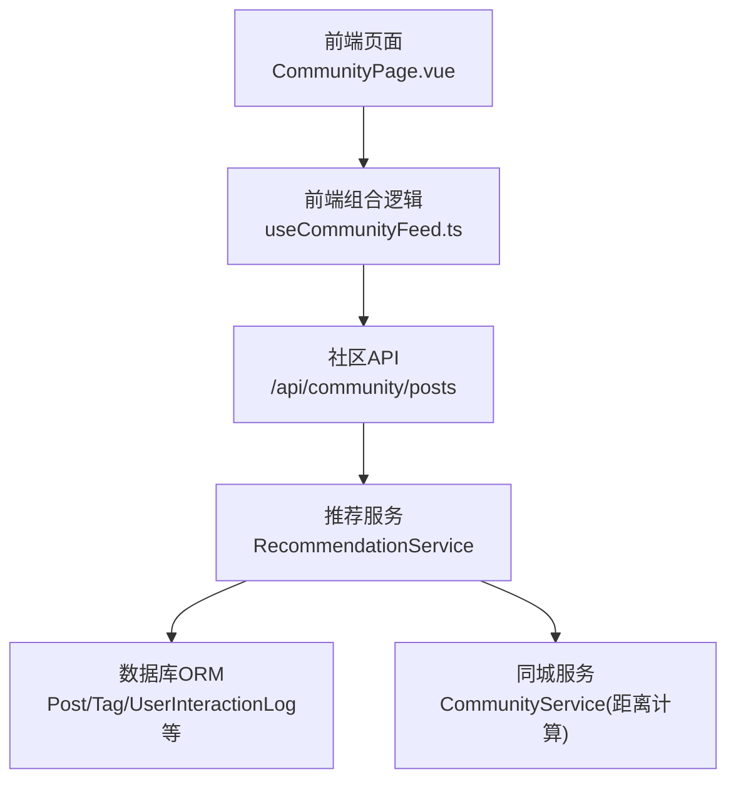
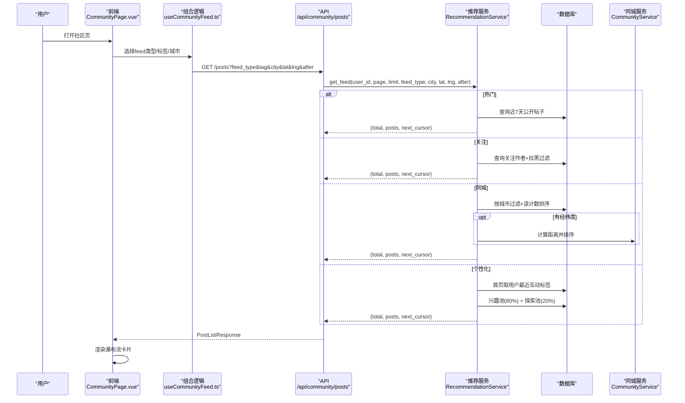
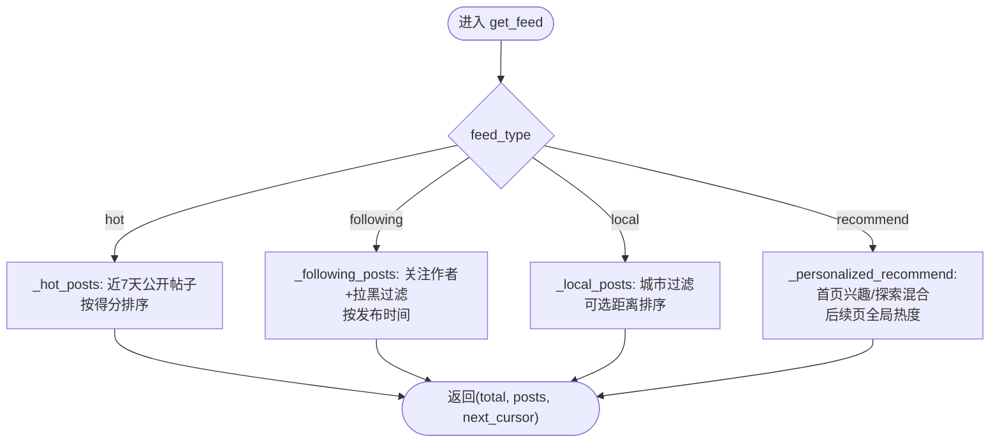
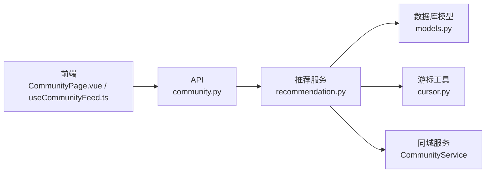

# 信息流算法

<cite>
**本文引用的文件**
- [web/backend/services/recommendation.py](file://web/backend/services/recommendation.py)
- [web/backend/api/community.py](file://web/backend/api/community.py)
- [web/app/src/composables/useCommunityFeed.ts](file://web/app/src/composables/useCommunityFeed.ts)
- [web/app/src/views/CommunityPage.vue](file://web/app/src/views/CommunityPage.vue)
- [web/backend/utils/cursor.py](file://web/backend/utils/cursor.py)
- [web/backend/database/models.py](file://web/backend/database/models.py)
- [web/backend/services/analytics.py](file://web/backend/services/analytics.py)
</cite>

## 目录
1. [简介](#简介)
2. [项目结构](#项目结构)
3. [核心组件](#核心组件)
4. [架构总览](#架构总览)
5. [详细组件分析](#详细组件分析)
6. [依赖关系分析](#依赖关系分析)
7. [性能考量](#性能考量)
8. [故障排查指南](#故障排查指南)
9. [结论](#结论)
10. [附录](#附录)

## 简介
本技术文档围绕“瀑布流信息流”的推荐算法实现，系统阐述个性化推荐、热门内容排序与同城内容推送三大策略；说明用户行为分析、兴趣标签提取与推荐权重计算；覆盖不同信息流类型（推荐、热门、关注、本地）的算法策略；并给出冷启动处理、内容多样性保证、推荐效果评估、配置参数、A/B测试框架建议与性能监控指标。同时提供大数据量下的推荐性能优化方案与实时推荐更新机制设计。

## 项目结构
信息流相关代码主要分布在后端服务层、API 层、前端组合式逻辑与视图层：
- 后端服务层：RecommendationService 封装了四种 feed 类型的查询与排序逻辑，包含互动权重、热度评分、同城距离排序等。
- API 层：community.py 暴露 /posts 列表接口，按 feed_type 路由到推荐服务或通用社区服务，并支持 cursor 分页。
- 前端：useCommunityFeed.ts 负责请求参数组装与合并数据；CommunityPage.vue 负责 UI 渲染与交互。
- 工具与模型：cursor.py 提供游标分页编码解码；models.py 定义用户、帖子、标签、互动日志等 ORM 模型。
- 分析：analytics.py 提供整体流量与功能使用统计，可用于推荐效果评估。

**图表来源**
- [web/backend/api/community.py:296-353](file://web/backend/api/community.py#L296-L353)
- [web/backend/services/recommendation.py:77-94](file://web/backend/services/recommendation.py#L77-L94)
- [web/backend/services/recommendation.py:231-310](file://web/backend/services/recommendation.py#L231-L310)
- [web/app/src/composables/useCommunityFeed.ts:38-86](file://web/app/src/composables/useCommunityFeed.ts#L38-L86)
- [web/app/src/views/CommunityPage.vue:84-120](file://web/app/src/views/CommunityPage.vue#L84-L120)

**章节来源**
- [web/backend/services/recommendation.py:1-347](file://web/backend/services/recommendation.py#L1-L347)
- [web/backend/api/community.py:296-353](file://web/backend/api/community.py#L296-L353)
- [web/app/src/composables/useCommunityFeed.ts:1-92](file://web/app/src/composables/useCommunityFeed.ts#L1-L92)
- [web/app/src/views/CommunityPage.vue:16-50](file://web/app/src/views/CommunityPage.vue#L16-L50)

## 核心组件
- 推荐服务 RecommendationService：统一入口 get_feed 根据 feed_type 分发到 _hot_posts、_personalized_recommend、_following_posts、_local_posts；提供 post_score_expr 作为统一排序表达式；通过 UserInteractionLog 记录用户行为并更新 read_count。
- 社区 API community.py：/posts 接口解析 feed_type、tag、city、lat/lng、after 等参数，调用推荐服务或通用服务，返回 PostListResponse，含 total、items、next_cursor。
- 前端 useCommunityFeed.ts：将前端 feedType 映射为后端 feed_type，拼装 city、lat/lng、tag/searchQuery，并发加载公共帖子与我的日记，合并去重并按时间排序。
- 游标分页 cursor.py：基于 created_at + id 的 base64 游标，避免 offset 在动态内容场景下的跳页/重复问题。

关键要点：
- 互动权重：click=1.0, read_end=1.5, like=2.0, bookmark=3.0, comment=2.5, share=4.0, skip=-0.5。
- 热度评分：like*2 + comment*2.5 + read*0.1。
- 同城：支持城市过滤与可选经纬度距离排序；首屏有内存缓存（TTL 5分钟）。
- 个性化：仅首页（无 after）进行兴趣/探索混合（80% 兴趣 + 20% 探索），后续页回退到全局热度排序。

**章节来源**
- [web/backend/services/recommendation.py:42-75](file://web/backend/services/recommendation.py#L42-L75)
- [web/backend/services/recommendation.py:96-182](file://web/backend/services/recommendation.py#L96-L182)
- [web/backend/services/recommendation.py:184-310](file://web/backend/services/recommendation.py#L184-L310)
- [web/backend/services/recommendation.py:312-347](file://web/backend/services/recommendation.py#L312-L347)
- [web/backend/api/community.py:296-353](file://web/backend/api/community.py#L296-L353)
- [web/app/src/composables/useCommunityFeed.ts:38-86](file://web/app/src/composables/useCommunityFeed.ts#L38-L86)
- [web/backend/utils/cursor.py:1-41](file://web/backend/utils/cursor.py#L1-L41)

## 架构总览
信息流请求从前端发起，经 API 路由到推荐服务，再访问数据库获取帖子，必要时调用同城服务计算距离，最终返回带游标的分页结果。

**图表来源**
- [web/backend/api/community.py:296-353](file://web/backend/api/community.py#L296-L353)
- [web/backend/services/recommendation.py:77-94](file://web/backend/services/recommendation.py#L77-L94)
- [web/backend/services/recommendation.py:96-182](file://web/backend/services/recommendation.py#L96-L182)
- [web/backend/services/recommendation.py:231-310](file://web/backend/services/recommendation.py#L231-L310)
- [web/app/src/composables/useCommunityFeed.ts:38-86](file://web/app/src/composables/useCommunityFeed.ts#L38-L86)
- [web/app/src/views/CommunityPage.vue:84-120](file://web/app/src/views/CommunityPage.vue#L84-L120)

## 详细组件分析

### 推荐服务 RecommendationService
- 统一排序公式：post_score_expr 使用子查询统计点赞与评论数，结合 read_count 计算综合得分。
- 热门帖子：限制近7天公开帖子，按得分降序+创建时间降序，支持 cursor 分页。
- 个性化推荐：仅在首页（无 after）启用兴趣/探索混合；兴趣来自用户最近互动标签聚合，探索为未命中兴趣标签的新帖；后续页回退到全局热度排序。
- 关注列表：读取 UserFollow 的作者集合，过滤被拉黑的用户，按发布时间倒序；若无关注则降级为热门。
- 同城列表：按城市大小写不敏感匹配，优先按 read_count 倒序；若提供经纬度，则先按读计数预取多倍数据，再调用 CommunityService 计算距离排序；首屏有内存缓存（TTL 5分钟）。
- 用户偏好标签：从 UserInteractionLog 最近200条互动中聚合标签频次，取 Top N 作为用户兴趣标签。
- 行为记录：log_interaction 写入互动日志，并在 click 时递增 read_count。

**图表来源**
- [web/backend/services/recommendation.py:77-94](file://web/backend/services/recommendation.py#L77-L94)
- [web/backend/services/recommendation.py:96-182](file://web/backend/services/recommendation.py#L96-L182)
- [web/backend/services/recommendation.py:184-310](file://web/backend/services/recommendation.py#L184-L310)

**章节来源**
- [web/backend/services/recommendation.py:42-75](file://web/backend/services/recommendation.py#L42-L75)
- [web/backend/services/recommendation.py:96-182](file://web/backend/services/recommendation.py#L96-L182)
- [web/backend/services/recommendation.py:184-310](file://web/backend/services/recommendation.py#L184-L310)
- [web/backend/services/recommendation.py:312-347](file://web/backend/services/recommendation.py#L312-L347)

### 社区 API 层
- /posts 接口：解析 feed_type、tag、city、lat/lng、after、limit、offset；当 feed_type 为 recommend/hot/following/local 时走推荐服务；否则走通用社区服务。
- 批量转换：使用 CommunityService.posts_to_models 批量转换为响应模型，避免 N+1 查询。
- 权限与过滤：匿名用户过滤 blocked 内容；非管理员隐藏 blocked 内容除非是本人发布。

**章节来源**
- [web/backend/api/community.py:296-353](file://web/backend/api/community.py#L296-L353)

### 前端组合逻辑与视图
- useCommunityFeed.ts：将前端 feedType 映射为后端 feed_type；拼装 city、lat/lng、tag/searchQuery；并发加载公共帖子与我的日记，合并去重并按时间排序；维护 publicLoaded 与 total 用于分页展示。
- CommunityPage.vue：管理 activeFeedType、activeTag、searchQuery、geo.city；首次加载可合并“我的日记”；使用 nextCursor 实现稳定分页；错误状态明确提示并提供重试。

**章节来源**
- [web/app/src/composables/useCommunityFeed.ts:38-86](file://web/app/src/composables/useCommunityFeed.ts#L38-L86)
- [web/app/src/views/CommunityPage.vue:84-120](file://web/app/src/views/CommunityPage.vue#L84-L120)
- [web/app/src/views/CommunityPage.vue:16-50](file://web/app/src/views/CommunityPage.vue#L16-L50)

### 游标分页
- 格式：base64(timestamp_ms:post_id)，客户端原样回传 after；服务端解码后用于过滤“小于游标时间戳或同时间戳但ID更小”的记录，确保插入/删除场景下不跳页/重复。

**章节来源**
- [web/backend/utils/cursor.py:1-41](file://web/backend/utils/cursor.py#L1-L41)

### 数据模型
- 用户、帖子、标签、互动日志等 ORM 模型定义于 models.py，支撑推荐服务的查询与统计。

**章节来源**
- [web/backend/database/models.py:1-200](file://web/backend/database/models.py#L1-L200)

## 依赖关系分析
- 推荐服务依赖数据库模型（Post、Tag、PostTag、UserFollow、UserBlock、UserInteractionLog）与游标工具。
- API 层依赖推荐服务与社区服务，负责参数校验、权限控制与响应组装。
- 前端依赖 API 与地理定位能力，负责参数拼装与UI渲染。

**图表来源**
- [web/backend/api/community.py:296-353](file://web/backend/api/community.py#L296-L353)
- [web/backend/services/recommendation.py:77-94](file://web/backend/services/recommendation.py#L77-L94)
- [web/backend/utils/cursor.py:1-41](file://web/backend/utils/cursor.py#L1-L41)
- [web/backend/database/models.py:1-200](file://web/backend/database/models.py#L1-L200)

**章节来源**
- [web/backend/api/community.py:296-353](file://web/backend/api/community.py#L296-L353)
- [web/backend/services/recommendation.py:77-94](file://web/backend/services/recommendation.py#L77-L94)
- [web/backend/utils/cursor.py:1-41](file://web/backend/utils/cursor.py#L1-L41)
- [web/backend/database/models.py:1-200](file://web/backend/database/models.py#L1-L200)

## 性能考量
- 游标分页：避免 offset 在动态内容下的跳页/重复问题，提升滚动加载稳定性。
- 同城缓存：首屏同城结果按 city/page_size/lat/lng 生成键，缓存5分钟，减少重复查询与距离计算开销。
- 批量转换：API 层使用 posts_to_models 批量转换，降低 N+1 查询。
- 预取倍数：同城在有经纬度时预取多倍数据以支持距离排序后的截断。
- 前端渲染上限：CommunityPage 设置 MAX_RENDERED_POSTS 限制DOM节点数量，防止卡顿。
- 并发加载：useCommunityFeed 并发请求公共帖子与我的日记，缩短首屏等待。

[本节为通用性能建议，无需特定文件引用]

## 故障排查指南
- 同城定位失败：检查 IP 定位服务调用是否超时或返回空；内网IP无法定位会返回空城市与坐标。
- 推荐结果为空：确认 feed_type 是否正确；关注页若无关注会降级为热门；同城需传入 city；个性化首页依赖用户互动标签。
- 游标异常：检查 after 参数是否为有效 base64 字符串；无效游标会被忽略并从头开始。
- 权限与过滤：匿名用户看不到 blocked 内容；非管理员看不到他人发布的 blocked 内容。
- 行为记录：确保 /posts/{id}/interact 正确上报 action_type；click 会递增 read_count 影响排序。

**章节来源**
- [web/backend/api/community.py:64-146](file://web/backend/api/community.py#L64-L146)
- [web/backend/services/recommendation.py:96-182](file://web/backend/services/recommendation.py#L96-L182)
- [web/backend/utils/cursor.py:16-35](file://web/backend/utils/cursor.py#L16-L35)
- [web/backend/api/community.py:296-353](file://web/backend/api/community.py#L296-L353)

## 结论
该信息流系统以 RecommendationService 为核心，实现了推荐、热门、关注、同城四类信息流策略，并通过互动权重与热度评分驱动排序。前端采用游标分页与并发加载提升体验，同城首屏缓存与批量转换优化性能。结合 analytics 指标可进行推荐效果评估与持续优化。建议在后续迭代中引入更精细的兴趣建模、多样性打散、A/B 实验与实时反馈闭环，进一步提升推荐质量与用户体验。

[本节为总结性内容，无需特定文件引用]

## 附录

### 算法策略与配置参数
- 互动权重：click=1.0, read_end=1.5, like=2.0, bookmark=3.0, comment=2.5, share=4.0, skip=-0.5。
- 热度评分：like*2 + comment*2.5 + read*0.1。
- 个性化混合比例：兴趣80% + 探索20%（仅首页）。
- 同城缓存TTL：5分钟。
- 同城预取倍数：有经纬度时3倍。
- 热门时间窗：近7天。
- 关注页降级：无关注或无有效作者时降级为热门。

**章节来源**
- [web/backend/services/recommendation.py:42-75](file://web/backend/services/recommendation.py#L42-L75)
- [web/backend/services/recommendation.py:96-182](file://web/backend/services/recommendation.py#L96-L182)
- [web/backend/services/recommendation.py:231-310](file://web/backend/services/recommendation.py#L231-L310)

### 冷启动处理
- 新用户无互动标签：个性化路径直接回退到全局热度排序，保证内容供给。
- 无关注用户：关注页降级为热门，避免空列表。
- 同城无位置：仅按城市过滤，不进行距离排序。

**章节来源**
- [web/backend/services/recommendation.py:127-182](file://web/backend/services/recommendation.py#L127-L182)
- [web/backend/services/recommendation.py:184-229](file://web/backend/services/recommendation.py#L184-L229)
- [web/backend/services/recommendation.py:231-310](file://web/backend/services/recommendation.py#L231-L310)

### 内容多样性保证
- 个性化首页采用兴趣/探索混合，确保一定比例的探索内容曝光。
- 同城与热门按热度排序，天然偏向高互动内容；可通过调整权重或引入多样性打散策略进一步优化。

**章节来源**
- [web/backend/services/recommendation.py:127-182](file://web/backend/services/recommendation.py#L127-L182)

### 推荐效果评估
- 使用 analytics 服务统计UV/PV、功能使用、注册趋势、漏斗转化等指标，辅助评估推荐策略对活跃与留存的影响。
- 可结合 A/B 测试对比不同权重、混合比例、同城策略的效果差异。

**章节来源**
- [web/backend/services/analytics.py:244-337](file://web/backend/services/analytics.py#L244-L337)
- [web/backend/services/analytics.py:468-532](file://web/backend/services/analytics.py#L468-L532)
- [web/backend/services/analytics.py:536-642](file://web/backend/services/analytics.py#L536-L642)

### A/B 测试框架建议
- 在 API 层增加 experiment 参数，按用户分桶返回不同策略结果（如不同权重、混合比例）。
- 记录实验参与与指标，便于后续分析与回滚。
- 结合 analytics 与业务埋点，评估点击率、停留时长、分享率等核心指标。

[本节为概念性建议，无需特定文件引用]

### 实时推荐更新机制
- 行为记录：用户互动（click/like/comment/share）通过 log_interaction 写入并更新 read_count，影响后续排序。
- 实时性建议：在高并发场景下可引入消息队列异步更新 read_count 与互动计数，减少主链路阻塞。
- 缓存失效：同城缓存 TTL 到期自动失效；可在内容变更时主动清理相关缓存键。

**章节来源**
- [web/backend/services/recommendation.py:337-347](file://web/backend/services/recommendation.py#L337-L347)
- [web/backend/services/recommendation.py:231-310](file://web/backend/services/recommendation.py#L231-L310)