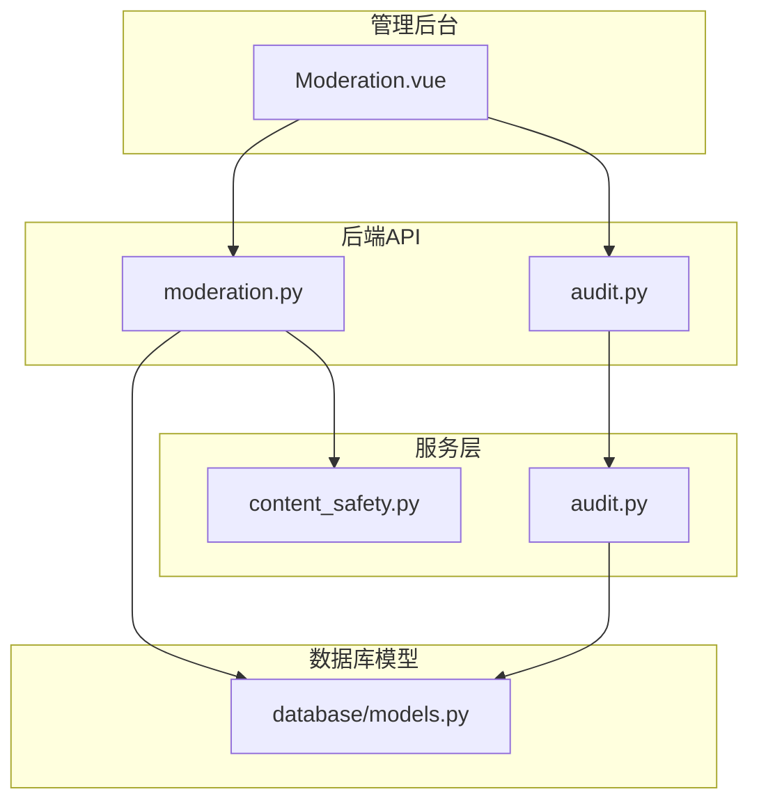
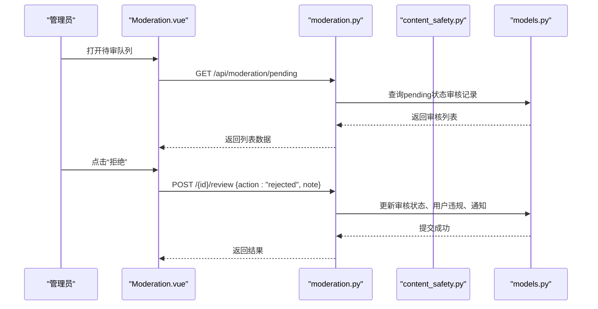
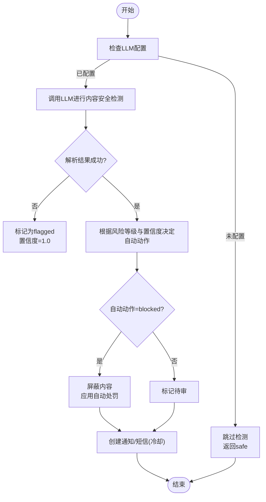
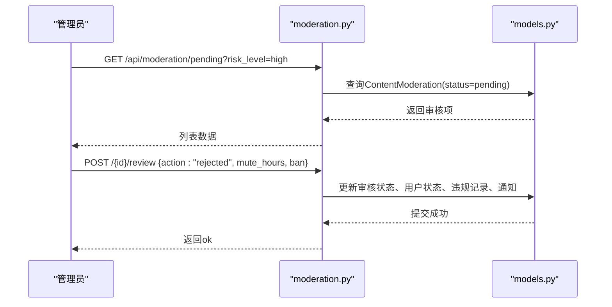
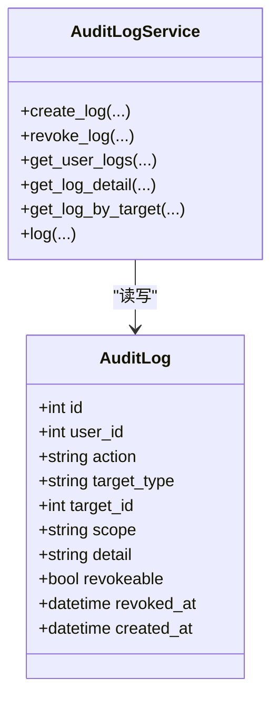
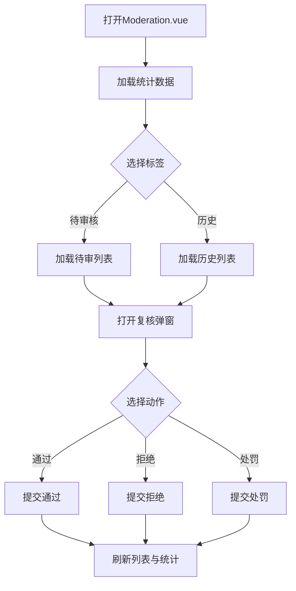
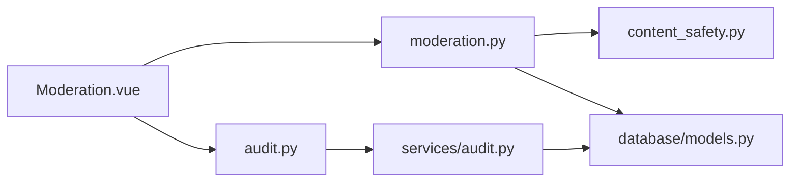

# 内容审核系统

<cite>
**本文引用的文件**
- [web/backend/api/moderation.py](file://web/backend/api/moderation.py)
- [web/backend/services/content_safety.py](file://web/backend/services/content_safety.py)
- [web/backend/models/audit.py](file://web/backend/models/audit.py)
- [web/backend/api/audit.py](file://web/backend/api/audit.py)
- [web/backend/services/audit.py](file://web/backend/services/audit.py)
- [web/backend/database/models.py](file://web/backend/database/models.py)
- [web/admin/src/views/Moderation.vue](file://web/admin/src/views/Moderation.vue)
</cite>

## 目录
1. [简介](#简介)
2. [项目结构](#项目结构)
3. [核心组件](#核心组件)
4. [架构总览](#架构总览)
5. [详细组件分析](#详细组件分析)
6. [依赖关系分析](#依赖关系分析)
7. [性能考虑](#性能考虑)
8. [故障排查指南](#故障排查指南)
9. [结论](#结论)
10. [附录](#附录)

## 简介
本技术文档面向内容审核系统的完整实现，覆盖自动审核、人工审核与内容标记机制。系统通过AI内容分析对文本进行风险识别与分级，结合规则引擎执行自动处置（如屏蔽、禁言、封号），并提供管理后台供审核员复核与操作。同时提供审计日志能力，用于追踪关键操作与数据变更，满足合规与可追溯需求。

## 项目结构
内容审核相关代码主要分布在以下位置：
- API层：FastAPI路由暴露审核队列、历史、用户处罚等接口
- 服务层：内容安全检测、自动处置策略、通知与短信提醒
- 数据模型：ORM模型定义帖子、评论、用户违规、审核记录、审计日志等
- 管理后台：Vue前端页面展示待审队列、统计与复核操作

图表来源
- [web/admin/src/views/Moderation.vue:1-700](file://web/admin/src/views/Moderation.vue#L1-L700)
- [web/backend/api/moderation.py:1-418](file://web/backend/api/moderation.py#L1-L418)
- [web/backend/api/audit.py:1-124](file://web/backend/api/audit.py#L1-L124)
- [web/backend/services/content_safety.py:1-368](file://web/backend/services/content_safety.py#L1-L368)
- [web/backend/services/audit.py:1-136](file://web/backend/services/audit.py#L1-L136)
- [web/backend/database/models.py:623-910](file://web/backend/database/models.py#L623-L910)

章节来源
- [web/backend/api/moderation.py:1-418](file://web/backend/api/moderation.py#L1-L418)
- [web/backend/services/content_safety.py:1-368](file://web/backend/services/content_safety.py#L1-L368)
- [web/backend/api/audit.py:1-124](file://web/backend/api/audit.py#L1-L124)
- [web/backend/services/audit.py:1-136](file://web/backend/services/audit.py#L1-L136)
- [web/backend/database/models.py:623-910](file://web/backend/database/models.py#L623-L910)
- [web/admin/src/views/Moderation.vue:1-700](file://web/admin/src/views/Moderation.vue#L1-L700)

## 核心组件
- 内容安全检测服务：基于LLM的文本风控判定，输出风险等级、分类、置信度与建议动作
- 自动处置策略：根据风险等级与置信度决定屏蔽或标记，并触发用户处罚流程
- 审核API：提供待审队列查询、复核提交、用户处罚、通知管理等接口
- 审计日志：记录关键操作（发布、撤销、导出等）及目标对象变更轨迹
- 管理后台：可视化展示待审队列、历史与统计，支持快速复核与详情查看

章节来源
- [web/backend/services/content_safety.py:28-100](file://web/backend/services/content_safety.py#L28-L100)
- [web/backend/api/moderation.py:108-229](file://web/backend/api/moderation.py#L108-L229)
- [web/backend/api/audit.py:33-124](file://web/backend/api/audit.py#L33-L124)
- [web/backend/services/audit.py:11-136](file://web/backend/services/audit.py#L11-L136)
- [web/admin/src/views/Moderation.vue:1-700](file://web/admin/src/views/Moderation.vue#L1-L700)

## 架构总览
系统采用前后端分离架构：
- 前端管理后台负责展示与交互
- 后端API提供审核与审计能力
- 服务层封装业务逻辑（AI检测、自动处置、通知）
- 数据库持久化存储审核记录、用户违规、审计日志等

图表来源
- [web/admin/src/views/Moderation.vue:520-622](file://web/admin/src/views/Moderation.vue#L520-L622)
- [web/backend/api/moderation.py:108-229](file://web/backend/api/moderation.py#L108-L229)
- [web/backend/services/content_safety.py:103-146](file://web/backend/services/content_safety.py#L103-L146)
- [web/backend/database/models.py:848-910](file://web/backend/database/models.py#L848-L910)

## 详细组件分析

### 内容安全检测服务
- 功能：调用LLM对标题与正文进行风险判定，返回风险等级、分类、置信度与原因
- 自动动作决策：依据风险等级与置信度阈值决定屏蔽或标记
- 自动处置：对高/严重风险内容直接屏蔽，并触发用户处罚流程（警告、禁言、封号）
- 通知与短信：生成站内通知，必要时发送短信提醒（带冷却防刷）

图表来源
- [web/backend/services/content_safety.py:54-100](file://web/backend/services/content_safety.py#L54-L100)
- [web/backend/services/content_safety.py:103-146](file://web/backend/services/content_safety.py#L103-L146)
- [web/backend/services/content_safety.py:229-316](file://web/backend/services/content_safety.py#L229-L316)
- [web/backend/services/content_safety.py:341-368](file://web/backend/services/content_safety.py#L341-L368)

章节来源
- [web/backend/services/content_safety.py:28-100](file://web/backend/services/content_safety.py#L28-L100)
- [web/backend/services/content_safety.py:103-146](file://web/backend/services/content_safety.py#L103-L146)
- [web/backend/services/content_safety.py:229-316](file://web/backend/services/content_safety.py#L229-L316)
- [web/backend/services/content_safety.py:341-368](file://web/backend/services/content_safety.py#L341-L368)

### 审核API与人工审核工作流
- 待审队列：按风险等级过滤，分页返回pending状态的审核记录
- 复核提交：支持通过、拒绝、升级；拒绝时可附加禁言时长或封号
- 用户处罚：维护用户违规计数与状态同步，生成通知与审计日志
- 历史记录：按状态筛选已处理审核记录，便于复盘与统计

图表来源
- [web/backend/api/moderation.py:108-229](file://web/backend/api/moderation.py#L108-L229)
- [web/backend/database/models.py:848-910](file://web/backend/database/models.py#L848-L910)

章节来源
- [web/backend/api/moderation.py:108-229](file://web/backend/api/moderation.py#L108-L229)
- [web/backend/api/moderation.py:232-324](file://web/backend/api/moderation.py#L232-L324)
- [web/backend/api/moderation.py:374-418](file://web/backend/api/moderation.py#L374-L418)

### 审计日志与可追溯性
- 日志创建：记录操作类型、目标类型、范围、详情、是否可撤销
- 日志查询：按用户、目标对象维度查询审计轨迹
- 撤销机制：支持对可撤销日志进行撤销，防止误操作扩散
- 隐私保护：IP地址脱敏存储，避免敏感信息泄露

图表来源
- [web/backend/services/audit.py:11-136](file://web/backend/services/audit.py#L11-L136)
- [web/backend/database/models.py:623-670](file://web/backend/database/models.py#L623-L670)

章节来源
- [web/backend/api/audit.py:33-124](file://web/backend/api/audit.py#L33-L124)
- [web/backend/services/audit.py:11-136](file://web/backend/services/audit.py#L11-L136)
- [web/backend/models/audit.py:6-58](file://web/backend/models/audit.py#L6-L58)

### 管理后台界面
- 统计卡片：待审核数量、今日已处理、高风险数量
- 标签页：待审核队列与复核历史
- 复核弹窗：展示内容快照、AI分析结果、操作按钮
- 快速操作：通过/拒绝/处罚，支持备注填写

图表来源
- [web/admin/src/views/Moderation.vue:1-700](file://web/admin/src/views/Moderation.vue#L1-L700)

章节来源
- [web/admin/src/views/Moderation.vue:1-700](file://web/admin/src/views/Moderation.vue#L1-L700)

## 依赖关系分析
- moderation.py依赖content_safety.py进行AI检测与自动处置
- moderation.py与audit.py分别对接数据库模型，维护审核记录与审计日志
- Moderation.vue通过HTTP请求调用后端API，渲染审核队列与历史
- content_safety.py依赖LLM配置与服务，输出风险判定结果

图表来源
- [web/backend/api/moderation.py:1-418](file://web/backend/api/moderation.py#L1-L418)
- [web/backend/services/content_safety.py:1-368](file://web/backend/services/content_safety.py#L1-L368)
- [web/backend/api/audit.py:1-124](file://web/backend/api/audit.py#L1-L124)
- [web/backend/services/audit.py:1-136](file://web/backend/services/audit.py#L1-L136)
- [web/backend/database/models.py:623-910](file://web/backend/database/models.py#L623-L910)
- [web/admin/src/views/Moderation.vue:1-700](file://web/admin/src/views/Moderation.vue#L1-L700)

章节来源
- [web/backend/api/moderation.py:1-418](file://web/backend/api/moderation.py#L1-L418)
- [web/backend/services/content_safety.py:1-368](file://web/backend/services/content_safety.py#L1-L368)
- [web/backend/api/audit.py:1-124](file://web/backend/api/audit.py#L1-L124)
- [web/backend/services/audit.py:1-136](file://web/backend/services/audit.py#L1-L136)
- [web/backend/database/models.py:623-910](file://web/backend/database/models.py#L623-L910)
- [web/admin/src/views/Moderation.vue:1-700](file://web/admin/src/views/Moderation.vue#L1-L700)

## 性能考虑
- LLM调用优化：限制输入长度、降低温度、控制最大token数，减少延迟与成本
- 自动处置阈值：合理设置置信度阈值，平衡误判率与拦截效率
- 通知冷却：短信发送采用冷却机制，避免批量违规时频繁打扰
- 分页与索引：审核列表与历史使用分页查询，建议对常用字段建立索引提升查询性能
- 异步处理：可将AI检测与通知发送改为异步任务，提高主流程响应速度

[本节为通用指导，不直接分析具体文件]

## 故障排查指南
- LLM配置缺失：当未配置LLM时，检测将被跳过并返回安全结果；需检查配置与服务可用性
- 审核记录不存在：复核接口返回404时需确认ID有效性
- 权限不足：非管理员访问审核接口将返回403，需确保当前用户具备管理员权限
- 通知失败：短信发送异常会被捕获并记录日志，不影响主流程
- 审计日志不可撤销：尝试撤销不可撤销或已撤销的日志将抛出错误

章节来源
- [web/backend/services/content_safety.py:54-87](file://web/backend/services/content_safety.py#L54-L87)
- [web/backend/api/moderation.py:144-157](file://web/backend/api/moderation.py#L144-L157)
- [web/backend/api/moderation.py:116-118](file://web/backend/api/moderation.py#L116-L118)
- [web/backend/services/content_safety.py:341-368](file://web/backend/services/content_safety.py#L341-L368)
- [web/backend/services/audit.py:41-53](file://web/backend/services/audit.py#L41-L53)

## 结论
内容审核系统通过AI内容分析与规则引擎实现了自动化风控，结合人工审核与管理后台形成闭环。系统支持内容分级、用户处罚、通知与短信提醒，并提供完整的审计日志以保障可追溯性。未来可进一步优化AI检测准确率、引入图片识别与机器学习模型，提升整体审核效率与覆盖面。

[本节为总结性内容，不直接分析具体文件]

## 附录

### 审核API接口设计
- 待审队列
  - 方法：GET
  - 路径：/api/moderation/pending
  - 参数：risk_level、limit、offset
  - 说明：仅管理员可访问，返回pending状态审核记录
- 复核提交
  - 方法：POST
  - 路径：/api/moderation/{moderation_id}/review
  - 参数：action、note、mute_hours、ban
  - 说明：支持通过、拒绝、升级；拒绝时可附加禁言或封号
- 用户处罚
  - 方法：POST
  - 路径：/api/moderation/user/{user_id}/action
  - 参数：action、hours、reason
  - 说明：支持禁言、解封、封号、解封等操作
- 通知管理
  - 方法：GET/POST
  - 路径：/api/moderation/notifications、/api/moderation/notifications/{notification_id}/read
  - 说明：获取通知列表与标记已读
- 历史记录
  - 方法：GET
  - 路径：/api/moderation/history
  - 参数：page、page_size、status
  - 说明：按状态筛选已处理审核记录

章节来源
- [web/backend/api/moderation.py:108-229](file://web/backend/api/moderation.py#L108-L229)
- [web/backend/api/moderation.py:232-324](file://web/backend/api/moderation.py#L232-L324)
- [web/backend/api/moderation.py:328-418](file://web/backend/api/moderation.py#L328-L418)

### 数据模型概览
- 用户违规与状态：UserViolation、UserViolationLog、User.user_status等字段
- 审核记录：ContentModeration，包含风险等级、分类、自动动作、AI理由与置信度
- 审计日志：AuditLog，记录操作类型、目标对象、范围、详情与撤销时间

章节来源
- [web/backend/database/models.py:848-910](file://web/backend/database/models.py#L848-L910)
- [web/backend/database/models.py:623-670](file://web/backend/database/models.py#L623-L670)