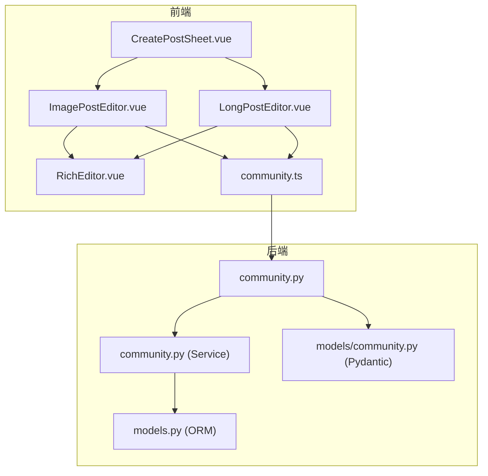
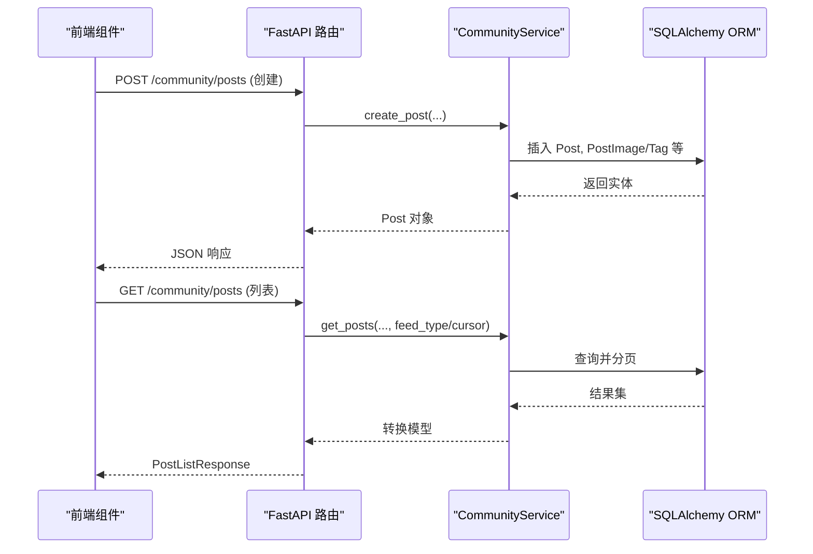
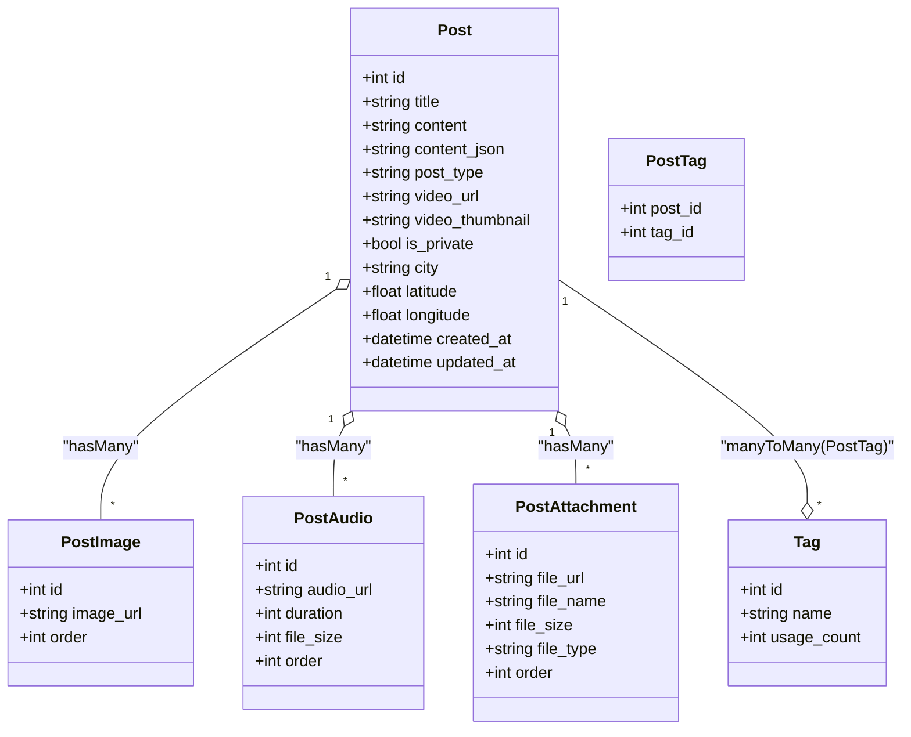
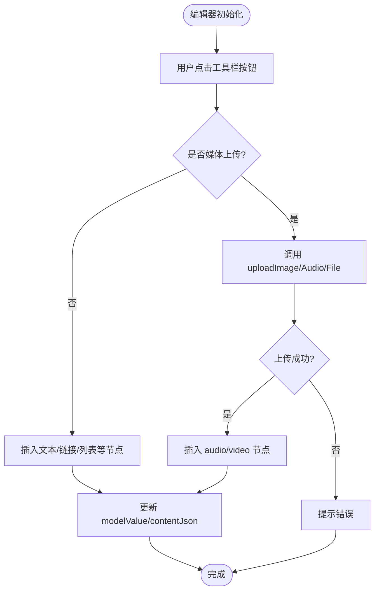
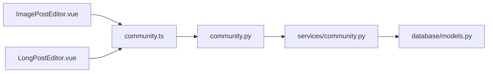

# 帖子管理系统

<cite>
**本文引用的文件**   
- [web/backend/api/community.py](file://web/backend/api/community.py)
- [web/backend/services/community.py](file://web/backend/services/community.py)
- [web/backend/models/community.py](file://web/backend/models/community.py)
- [web/backend/database/models.py](file://web/backend/database/models.py)
- [web/app/src/api/community.ts](file://web/app/src/api/community.ts)
- [web/app/src/components/community/CreatePostSheet.vue](file://web/app/src/components/community/CreatePostSheet.vue)
- [web/app/src/components/community/Editor/ImagePostEditor.vue](file://web/app/src/components/community/Editor/ImagePostEditor.vue)
- [web/app/src/components/community/Editor/LongPostEditor.vue](file://web/app/src/components/community/Editor/LongPostEditor.vue)
- [web/app/src/components/community/RichEditor.vue](file://web/app/src/components/community/RichEditor.vue)
</cite>

## 目录
1. [简介](#简介)
2. [项目结构](#项目结构)
3. [核心组件](#核心组件)
4. [架构总览](#架构总览)
5. [详细组件分析](#详细组件分析)
6. [依赖关系分析](#依赖关系分析)
7. [性能考虑](#性能考虑)
8. [故障排查指南](#故障排查指南)
9. [结论](#结论)
10. [附录：API 参考与数据模型](#附录api-参考与数据模型)

## 简介
本技术文档围绕“帖子管理系统”的完整生命周期展开，覆盖创建、编辑、删除、查询等 CRUD 操作；详细说明支持的帖子类型（图文、视频、音频、治疗分享）、内容结构设计及富文本编辑器集成；阐述分类体系、标签系统、私密帖子机制与日记功能；解释状态管理（草稿、发布、审核中、已屏蔽）、版本控制与历史记录；并提供前后端 API 设计、前端组件实现和数据模型定义。同时涵盖搜索、排序、分页与性能优化策略。

## 项目结构
后端采用 FastAPI + SQLAlchemy ORM，服务层封装业务逻辑，API 路由负责请求校验与响应组装；前端基于 Vue 3 + TypeScript，使用 Tiptap 富文本编辑器，提供多类型发帖入口与草稿同步能力。

图表来源
- [web/app/src/components/community/CreatePostSheet.vue:1-231](file://web/app/src/components/community/CreatePostSheet.vue#L1-L231)
- [web/app/src/components/community/Editor/ImagePostEditor.vue:1-359](file://web/app/src/components/community/Editor/ImagePostEditor.vue#L1-L359)
- [web/app/src/components/community/Editor/LongPostEditor.vue:1-462](file://web/app/src/components/community/Editor/LongPostEditor.vue#L1-L462)
- [web/app/src/components/community/RichEditor.vue:1-703](file://web/app/src/components/community/RichEditor.vue#L1-L703)
- [web/app/src/api/community.ts:1-284](file://web/app/src/api/community.ts#L1-L284)
- [web/backend/api/community.py:1-800](file://web/backend/api/community.py#L1-L800)
- [web/backend/services/community.py:1-800](file://web/backend/services/community.py#L1-L800)
- [web/backend/database/models.py:300-600](file://web/backend/database/models.py#L300-L600)
- [web/backend/models/community.py:1-427](file://web/backend/models/community.py#L1-L427)

章节来源
- [web/backend/api/community.py:1-800](file://web/backend/api/community.py#L1-L800)
- [web/backend/services/community.py:1-800](file://web/backend/services/community.py#L1-L800)
- [web/backend/database/models.py:300-600](file://web/backend/database/models.py#L300-L600)
- [web/backend/models/community.py:1-427](file://web/backend/models/community.py#L1-L427)
- [web/app/src/api/community.ts:1-284](file://web/app/src/api/community.ts#L1-L284)
- [web/app/src/components/community/CreatePostSheet.vue:1-231](file://web/app/src/components/community/CreatePostSheet.vue#L1-L231)
- [web/app/src/components/community/Editor/ImagePostEditor.vue:1-359](file://web/app/src/components/community/Editor/ImagePostEditor.vue#L1-L359)
- [web/app/src/components/community/Editor/LongPostEditor.vue:1-462](file://web/app/src/components/community/Editor/LongPostEditor.vue#L1-L462)
- [web/app/src/components/community/RichEditor.vue:1-703](file://web/app/src/components/community/RichEditor.vue#L1-L703)

## 核心组件
- 后端 API 路由：统一处理帖子 CRUD、评论、点赞、收藏、标签、上传、日历、同城定位等。
- 服务层：封装业务规则（权限校验、内容预览生成、标签关联、版本历史、推荐流、游标分页）。
- 数据模型：ORM 定义帖子、图片、音频、附件、标签、收藏夹、书签、版本、交互日志等。
- 前端 API 客户端：封装所有社区相关接口调用。
- 前端组件：发帖入口、图文编辑器、长文编辑器、富文本编辑器（Tiptap），支持本地/服务端草稿同步。

章节来源
- [web/backend/api/community.py:1-800](file://web/backend/api/community.py#L1-L800)
- [web/backend/services/community.py:1-800](file://web/backend/services/community.py#L1-L800)
- [web/backend/database/models.py:300-600](file://web/backend/database/models.py#L300-L600)
- [web/app/src/api/community.ts:1-284](file://web/app/src/api/community.ts#L1-L284)
- [web/app/src/components/community/CreatePostSheet.vue:1-231](file://web/app/src/components/community/CreatePostSheet.vue#L1-L231)
- [web/app/src/components/community/Editor/ImagePostEditor.vue:1-359](file://web/app/src/components/community/Editor/ImagePostEditor.vue#L1-L359)
- [web/app/src/components/community/Editor/LongPostEditor.vue:1-462](file://web/app/src/components/community/Editor/LongPostEditor.vue#L1-L462)
- [web/app/src/components/community/RichEditor.vue:1-703](file://web/app/src/components/community/RichEditor.vue#L1-L703)

## 架构总览
系统采用前后端分离架构，前端通过 RESTful API 与后端交互，后端以 Service 层组织业务逻辑，数据库通过 ORM 映射。

图表来源
- [web/backend/api/community.py:219-353](file://web/backend/api/community.py#L219-L353)
- [web/backend/services/community.py:136-292](file://web/backend/services/community.py#L136-L292)
- [web/backend/database/models.py:312-377](file://web/backend/database/models.py#L312-L377)

## 详细组件分析

### 帖子类型与内容结构
- 帖子类型：image、video、text、long、treatment（结构化治疗分享）
- 内容字段：title、content（HTML）、content_json（Tiptap JSON）、post_type、video_url、video_thumbnail
- 多媒体：images（多图）、audios（音频）、attachments（文件附件）
- 结构化治疗分享：method、duration、effect_rating、cost_range、side_effects、vasi_assessment_ids（最多2条）

图表来源
- [web/backend/database/models.py:312-484](file://web/backend/database/models.py#L312-L484)

章节来源
- [web/backend/models/community.py:88-170](file://web/backend/models/community.py#L88-L170)
- [web/backend/database/models.py:312-484](file://web/backend/database/models.py#L312-L484)

### 富文本编辑器集成（Tiptap）
- 自定义节点：audio、video，支持在编辑器内直接插入媒体
- 工具栏：加粗、斜体、下划线、删除线、标题、列表、引用、分割线、链接、图片、音频、视频
- 上传流程：前端选择文件 -> 调用 communityApi.upload* -> 成功后插入对应节点
- 输出：HTML（content）与 JSON（content_json）双格式保存

图表来源
- [web/app/src/components/community/RichEditor.vue:231-498](file://web/app/src/components/community/RichEditor.vue#L231-L498)
- [web/app/src/api/community.ts:132-157](file://web/app/src/api/community.ts#L132-L157)

章节来源
- [web/app/src/components/community/RichEditor.vue:1-703](file://web/app/src/components/community/RichEditor.vue#L1-L703)
- [web/app/src/api/community.ts:1-284](file://web/app/src/api/community.ts#L1-L284)

### 帖子分类体系与标签系统
- 分类：CommunityCategory（名称、描述、图标、排序）
- 标签：Tag（名称、使用次数），PostTag 多对多关联
- 热门标签：按 usage_count 降序获取
- 更新标签：限制最多 5 个，自动去重与计数

章节来源
- [web/backend/database/models.py:300-311](file://web/backend/database/models.py#L300-L311)
- [web/backend/database/models.py:430-451](file://web/backend/database/models.py#L430-L451)
- [web/backend/api/community.py:175-198](file://web/backend/api/community.py#L175-L198)
- [web/backend/services/community.py:208-224](file://web/backend/services/community.py#L208-L224)

### 私密帖子与日记功能
- 私密标记：is_private 控制可见性，仅作者或公开可见
- 草稿过期：draft_expires_at 用于私密草稿过期清理
- 日记日期与类型：diary_date、diary_type（medication/phototherapy/mood/diet/general）
- 我的日记：按用户私有且未屏蔽的帖子分页，支持游标分页
- 日历视图：按月聚合条目，返回日期到条目数组映射

章节来源
- [web/backend/database/models.py:312-346](file://web/backend/database/models.py#L312-L346)
- [web/backend/api/community.py:356-443](file://web/backend/api/community.py#L356-L443)
- [web/backend/services/community.py:226-292](file://web/backend/services/community.py#L226-L292)

### 帖子状态管理与审核
- 状态字段：moderation_status（normal/flagged/blocked/approved）
- 夸大声明检测：check_claims 检测敏感词，命中则标记 flagged
- 异步内容审核：后台线程触发 moderate_post
- 访问控制：can_access_post 确保私密与屏蔽帖不可见

章节来源
- [web/backend/database/models.py:340-340](file://web/backend/database/models.py#L340-L340)
- [web/backend/api/community.py:148-169](file://web/backend/api/community.py#L148-L169)
- [web/backend/api/community.py:267-293](file://web/backend/api/community.py#L267-L293)
- [web/backend/services/community.py:48-64](file://web/backend/services/community.py#L48-L64)

### 版本控制与历史记录
- 版本表：PostVersion（记录标题、内容、JSON、编辑摘要、时间）
- 更新时自动保存旧版本：update_post 在内容变更时写入版本
- 版本查询：get_post_versions 支持分页

章节来源
- [web/backend/database/models.py:528-544](file://web/backend/database/models.py#L528-L544)
- [web/backend/services/community.py:395-408](file://web/backend/services/community.py#L395-L408)
- [web/backend/services/community.py:774-794](file://web/backend/services/community.py#L774-L794)

### 点赞、评论、收藏与书签
- 点赞：toggle_like 原子化操作，唯一约束防并发重复
- 评论：add_comment 权限校验，异步内容审核
- 收藏：Collection 与 CollectionItem 多对多，支持公开分享 slug
- 书签：Bookmark 用户快速收藏，唯一约束防重复

章节来源
- [web/backend/database/models.py:393-412](file://web/backend/database/models.py#L393-L412)
- [web/backend/database/models.py:414-428](file://web/backend/database/models.py#L414-L428)
- [web/backend/database/models.py:486-526](file://web/backend/database/models.py#L486-L526)
- [web/backend/database/models.py:546-559](file://web/backend/database/models.py#L546-L559)
- [web/backend/services/community.py:424-454](file://web/backend/services/community.py#L424-L454)
- [web/backend/services/community.py:467-492](file://web/backend/services/community.py#L467-L492)
- [web/backend/services/community.py:587-750](file://web/backend/services/community.py#L587-L750)

### 搜索、排序与分页
- 过滤：category_id、tag、post_type、feed_type（recommend/hot/following/local）
- 排序：默认 created_at 降序，hot/recommend 使用评分表达式
- 分页：offset/limit 与 cursor-based after 游标分页
- 批量转换：posts_to_models 避免 N+1 查询

章节来源
- [web/backend/services/community.py:226-292](file://web/backend/services/community.py#L226-L292)
- [web/backend/api/community.py:296-353](file://web/backend/api/community.py#L296-L353)

### 前端组件实现要点
- CreatePostSheet：底部弹窗选择发帖类型（图文/视频/文字/长文），跳转对应编辑器
- ImagePostEditor：多图上传、心情标签、分类选择、标签选择、城市定位、草稿同步
- LongPostEditor：普通分享与治疗经验分享切换，结构化表单，VASI 评估关联，夸大声明检测
- RichEditor：Tiptap 富文本，自定义 audio/video 节点，媒体上传与插入

章节来源
- [web/app/src/components/community/CreatePostSheet.vue:1-231](file://web/app/src/components/community/CreatePostSheet.vue#L1-L231)
- [web/app/src/components/community/Editor/ImagePostEditor.vue:1-359](file://web/app/src/components/community/Editor/ImagePostEditor.vue#L1-L359)
- [web/app/src/components/community/Editor/LongPostEditor.vue:1-462](file://web/app/src/components/community/Editor/LongPostEditor.vue#L1-L462)
- [web/app/src/components/community/RichEditor.vue:1-703](file://web/app/src/components/community/RichEditor.vue#L1-L703)

## 依赖关系分析
- API 路由依赖 Service 层进行业务处理，Service 依赖 ORM 模型进行数据持久化
- 前端 API 客户端封装所有社区接口，组件通过调用 API 完成交互
- 富文本编辑器依赖 communityApi 进行媒体上传

图表来源
- [web/app/src/components/community/Editor/ImagePostEditor.vue:1-359](file://web/app/src/components/community/Editor/ImagePostEditor.vue#L1-L359)
- [web/app/src/components/community/Editor/LongPostEditor.vue:1-462](file://web/app/src/components/community/Editor/LongPostEditor.vue#L1-L462)
- [web/app/src/api/community.ts:1-284](file://web/app/src/api/community.ts#L1-L284)
- [web/backend/api/community.py:1-800](file://web/backend/api/community.py#L1-L800)
- [web/backend/services/community.py:1-800](file://web/backend/services/community.py#L1-L800)
- [web/backend/database/models.py:300-600](file://web/backend/database/models.py#L300-L600)

章节来源
- [web/backend/api/community.py:1-800](file://web/backend/api/community.py#L1-L800)
- [web/backend/services/community.py:1-800](file://web/backend/services/community.py#L1-L800)
- [web/backend/database/models.py:300-600](file://web/backend/database/models.py#L300-L600)
- [web/app/src/api/community.ts:1-284](file://web/app/src/api/community.ts#L1-L284)

## 性能考虑
- 游标分页：after 参数结合 created_at/id 组合条件，避免深分页开销
- 批量转换：posts_to_models 一次性加载关联数据，减少 N+1 查询
- 热点排序：recommend/hot 使用评分表达式，提升推荐质量
- 上传限制：图片 10MB、音频/文件 50MB，magic byte 校验防止恶意文件
- 缓存：IP 地理定位结果短期缓存，降低外部 API 调用频率

章节来源
- [web/backend/services/community.py:226-292](file://web/backend/services/community.py#L226-L292)
- [web/backend/services/community.py:529-583](file://web/backend/services/community.py#L529-L583)
- [web/backend/api/community.py:114-145](file://web/backend/api/community.py#L114-L145)

## 故障排查指南
- 发布失败：检查用户状态（封禁/禁言）、内容安全检测、分类是否存在
- 无法查看私密帖子：确认登录状态与 is_private 权限
- 上传失败：检查文件大小、MIME 类型、magic byte 校验
- 评论/点赞异常：检查唯一约束冲突与并发竞争
- 草稿丢失：确认 localStorage 键值与服务端同步状态

章节来源
- [web/backend/api/community.py:219-293](file://web/backend/api/community.py#L219-L293)
- [web/backend/services/community.py:424-454](file://web/backend/services/community.py#L424-L454)
- [web/backend/services/community.py:529-583](file://web/backend/services/community.py#L529-L583)

## 结论
本系统提供了完整的帖子生命周期管理能力，支持多种内容类型与富文本编辑，具备完善的分类、标签、私密与日记功能，并通过版本控制与审核机制保障内容质量与可追溯性。前后端协作清晰，性能优化到位，适合社区类应用扩展。

## 附录：API 参考与数据模型

### 主要 API 端点
- 帖子
  - POST /community/posts：创建帖子
  - GET /community/posts：列表（支持 category_id、tag、post_type、feed_type、city、is_private、limit、offset、after）
  - GET /community/posts/{id}：详情
  - PUT /community/posts/{id}：更新
  - DELETE /community/posts/{id}：删除
- 评论
  - POST /community/posts/{id}/comments：添加评论
  - GET /community/posts/{id}/comments：评论列表
- 点赞
  - POST /community/posts/{id}/like：切换点赞
- 收藏与书签
  - POST /community/posts/{id}/bookmark：切换书签
  - GET /community/bookmarks：书签列表
- 标签
  - GET /community/tags：标签列表（支持 q、limit）
  - GET /community/tags/hot：热门标签
  - PUT /community/posts/{id}/tags：更新标签
- 上传
  - POST /community/upload：图片上传
  - POST /community/upload/audio：音频上传
  - POST /community/upload/file：文件上传
- 日记
  - GET /community/my-diaries：我的日记
  - GET /community/diary-calendar：日历视图
- 其他
  - GET /community/user-location：IP 地理定位
  - POST /community/check-claims：夸大声明检测
  - POST /community/posts/{id}/interact：交互日志

章节来源
- [web/backend/api/community.py:175-800](file://web/backend/api/community.py#L175-L800)
- [web/app/src/api/community.ts:56-284](file://web/app/src/api/community.ts#L56-L284)

### 数据模型概览
- Post：帖子主表，包含标题、内容、类型、多媒体、位置、状态等
- PostImage/PostAudio/PostAttachment：多媒体与附件
- Tag/PostTag：标签及其关联
- PostVersion：版本历史
- Bookmark/Collections/CollectionItem：书签与收藏夹
- UserInteractionLog：交互行为日志

章节来源
- [web/backend/database/models.py:312-579](file://web/backend/database/models.py#L312-L579)
- [web/backend/models/community.py:1-427](file://web/backend/models/community.py#L1-L427)