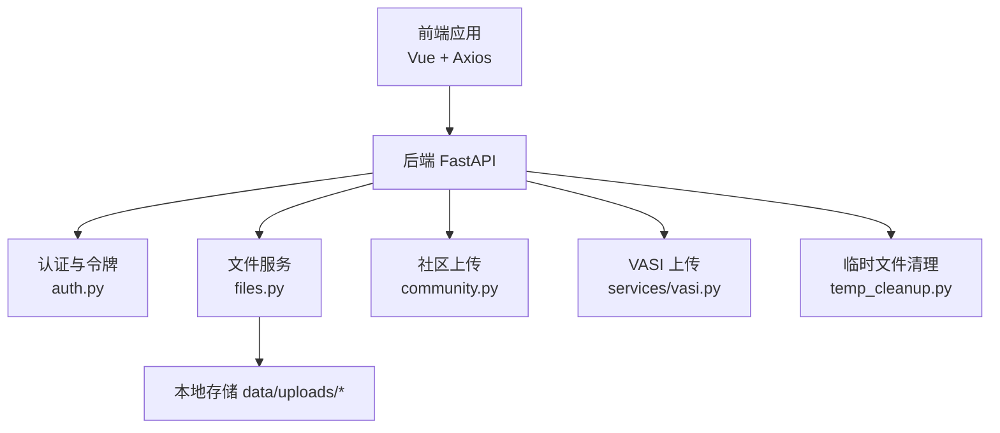
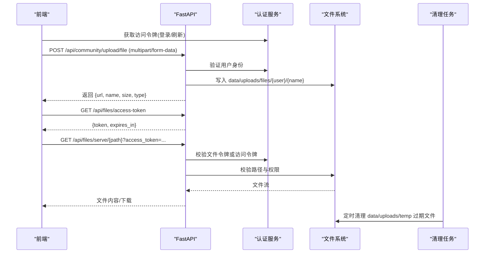
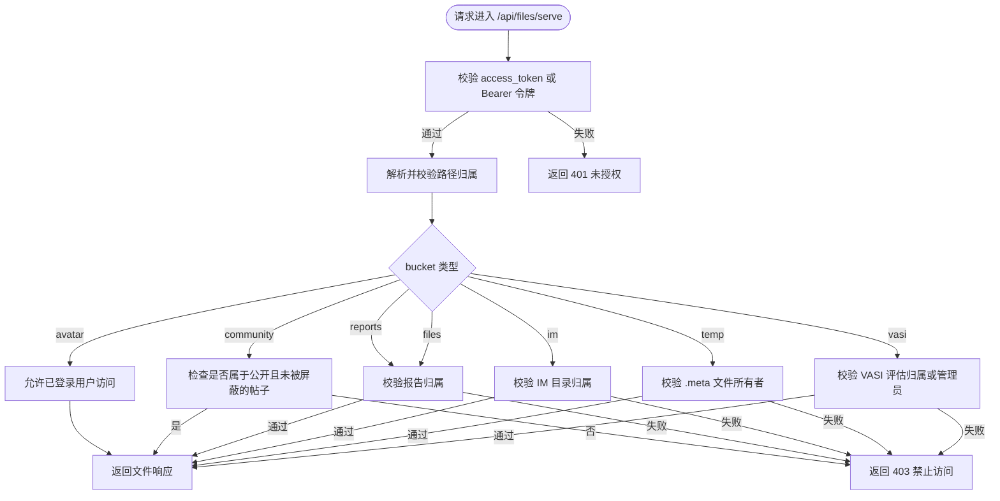
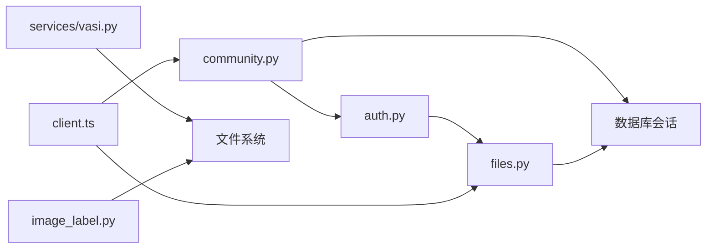

# 文件上传处理

<cite>
**本文引用的文件**
- [web/backend/api/files.py](file://web/backend/api/files.py)
- [web/backend/services/auth.py](file://web/backend/services/auth.py)
- [web/backend/api/community.py](file://web/backend/api/community.py)
- [web/backend/services/temp_cleanup.py](file://web/backend/services/temp_cleanup.py)
- [web/app/src/api/client.ts](file://web/app/src/api/client.ts)
- [web/app/src/components/community/FileAttachment.vue](file://web/app/src/components/community/FileAttachment.vue)
- [web/app/src/components/community/RichEditor.vue](file://web/app/src/components/community/RichEditor.vue)
- [web/app/src/components/community/Editor/ImagePostEditor.vue](file://web/app/src/components/community/Editor/ImagePostEditor.vue)
- [web/app/src/composables/useVasiAssessment.ts](file://web/app/src/composables/useVasiAssessment.ts)
- [web/backend/services/vasi.py](file://web/backend/services/vasi.py)
- [web/backend/api/image_label.py](file://web/backend/api/image_label.py)
</cite>

## 目录
1. [简介](#简介)
2. [项目结构](#项目结构)
3. [核心组件](#核心组件)
4. [架构总览](#架构总览)
5. [详细组件分析](#详细组件分析)
6. [依赖关系分析](#依赖关系分析)
7. [性能与容量规划](#性能与容量规划)
8. [故障排查指南](#故障排查指南)
9. [结论](#结论)
10. [附录：API 参考](#附录api-参考)

## 简介
本技术文档围绕仓库中的“文件上传处理系统”进行系统化梳理，覆盖图片、音频、视频和文档的上传流程；说明类型校验、大小限制、格式转换与质量压缩策略；阐述本地存储路径组织、访问令牌鉴权、权限控制与预览能力；并给出前端组件实现要点、错误重试机制与大文件优化建议。当前代码库已具备完善的上传入口、安全鉴权、临时文件清理与多场景上传（社区、IM、VASI、医疗报告等）能力，但尚未实现断点续传与进度上报，本文在“性能与容量规划”中提供可落地的扩展方案。

## 项目结构
- 后端 API
  - 通用文件服务与鉴权：web/backend/api/files.py
  - 社区文件上传：web/backend/api/community.py
  - 临时文件清理：web/backend/services/temp_cleanup.py
  - 认证与短时效文件令牌：web/backend/services/auth.py
  - VASI 图像上传与校验：web/backend/services/vasi.py
  - 批量标注图上传：web/backend/api/image_label.py
- 前端
  - Axios 客户端与自动刷新 token：web/app/src/api/client.ts
  - 附件展示与受保护链接：web/app/src/components/community/FileAttachment.vue
  - 富文本编辑器内音视频上传：web/app/src/components/community/RichEditor.vue
  - 社区图片上传：web/app/src/components/community/Editor/ImagePostEditor.vue
  - VASI 评估上传与质量检查：web/app/src/composables/useVasiAssessment.ts

图表来源
- [web/backend/api/files.py:293-331](file://web/backend/api/files.py#L293-L331)
- [web/backend/services/auth.py:59-93](file://web/backend/services/auth.py#L59-L93)
- [web/backend/api/community.py:732-757](file://web/backend/api/community.py#L732-L757)
- [web/backend/services/temp_cleanup.py:15-52](file://web/backend/services/temp_cleanup.py#L15-L52)

章节来源
- [web/backend/api/files.py:293-331](file://web/backend/api/files.py#L293-L331)
- [web/backend/services/auth.py:59-93](file://web/backend/services/auth.py#L59-L93)
- [web/backend/api/community.py:732-757](file://web/backend/api/community.py#L732-L757)
- [web/backend/services/temp_cleanup.py:15-52](file://web/backend/services/temp_cleanup.py#L15-L52)

## 核心组件
- 统一文件访问与鉴权
  - 通过 /api/files/access-token 获取短时效文件专用令牌，用于文件读取，降低泄露风险。
  - /api/files/serve/{path} 提供受控的文件读取，支持按 bucket 与文件名解析所有权，拒绝越权访问。
- 社区文件上传
  - /api/community/upload/file 接收任意文件，写入 data/uploads/files/{user}/...，返回文件 URL、名称、大小与类型。
- 临时文件管理
  - 临时目录 data/uploads/temp 内的文件按修改时间定期清理，避免磁盘膨胀。
- 前端上传与预览
  - Axios 客户端自动附加 Bearer Token，并在 401 时尝试刷新；对 FormData 请求自动移除 Content-Type 头以正确上传。
  - FileAttachment 将文件 URL 转换为受保护链接，确保仅授权用户可访问。
  - RichEditor 支持音频与视频上传，带大小限制与失败提示。
  - ImagePostEditor 支持多图上传，单图上限 5MB。
  - VASI 评估上传前进行前端质量检查与大小限制。

章节来源
- [web/backend/api/files.py:37-48](file://web/backend/api/files.py#L37-L48)
- [web/backend/api/files.py:293-331](file://web/backend/api/files.py#L293-L331)
- [web/backend/api/community.py:732-757](file://web/backend/api/community.py#L732-L757)
- [web/backend/services/temp_cleanup.py:15-52](file://web/backend/services/temp_cleanup.py#L15-L52)
- [web/app/src/api/client.ts:1-22](file://web/app/src/api/client.ts#L1-L22)
- [web/app/src/components/community/FileAttachment.vue:57-80](file://web/app/src/components/community/FileAttachment.vue#L57-L80)
- [web/app/src/components/community/RichEditor.vue:439-480](file://web/app/src/components/community/RichEditor.vue#L439-L480)
- [web/app/src/components/community/Editor/ImagePostEditor.vue:90-105](file://web/app/src/components/community/Editor/ImagePostEditor.vue#L90-L105)
- [web/app/src/composables/useVasiAssessment.ts:167-181](file://web/app/src/composables/useVasiAssessment.ts#L167-L181)

## 架构总览
下图展示了从前端到后端的完整上传链路，包括鉴权、存储、预览与清理。

图表来源
- [web/backend/api/community.py:732-757](file://web/backend/api/community.py#L732-L757)
- [web/backend/api/files.py:37-48](file://web/backend/api/files.py#L37-L48)
- [web/backend/api/files.py:293-331](file://web/backend/api/files.py#L293-L331)
- [web/backend/services/temp_cleanup.py:55-66](file://web/backend/services/temp_cleanup.py#L55-L66)

## 详细组件分析

### 文件访问与权限控制（files.py）
- 文件访问令牌
  - 通过 /api/files/access-token 颁发短时效文件专用令牌，仅允许读取文件，不授予其他 API 权限。
- 路径解析与安全
  - _resolve_requested_file 强制相对路径位于 uploads 根目录下，防止路径穿越。
  - _assert_path_ownership 根据 bucket（avatar、community、reports、files、im、temp、vasi）执行细粒度权限校验，未匹配则拒绝。
- 文件服务
  - /api/files/serve/{path} 支持 PDF 强制下载、图片/媒体 inline 显示，以及分页 PDF 页面预览。
  - /api/files/view/{file_id} 提供自包含 HTML 预览器，适配微信内置浏览器等环境。

图表来源
- [web/backend/api/files.py:55-69](file://web/backend/api/files.py#L55-L69)
- [web/backend/api/files.py:72-94](file://web/backend/api/files.py#L72-L94)
- [web/backend/api/files.py:138-227](file://web/backend/api/files.py#L138-L227)
- [web/backend/api/files.py:293-331](file://web/backend/api/files.py#L293-L331)

章节来源
- [web/backend/api/files.py:37-48](file://web/backend/api/files.py#L37-L48)
- [web/backend/api/files.py:55-69](file://web/backend/api/files.py#L55-L69)
- [web/backend/api/files.py:72-94](file://web/backend/api/files.py#L72-L94)
- [web/backend/api/files.py:138-227](file://web/backend/api/files.py#L138-L227)
- [web/backend/api/files.py:293-331](file://web/backend/api/files.py#L293-L331)

### 社区文件上传（community.py）
- 接口：POST /api/community/upload/file
- 行为：读取 multipart 文件，调用服务层写入 data/uploads/files/{user}/...，返回文件 URL、名称、大小与类型。
- 错误处理：捕获参数错误与服务异常，返回 400/500。

章节来源
- [web/backend/api/community.py:732-757](file://web/backend/api/community.py#L732-L757)

### 临时文件清理（temp_cleanup.py）
- 清理策略：扫描 data/uploads/temp，删除超过最大存活时间的文件，并清理空目录。
- 周期任务：提供异步循环，默认每小时执行一次。

章节来源
- [web/backend/services/temp_cleanup.py:15-52](file://web/backend/services/temp_cleanup.py#L15-L52)
- [web/backend/services/temp_cleanup.py:55-66](file://web/backend/services/temp_cleanup.py#L55-L66)

### 认证与文件令牌（auth.py）
- 文件令牌：create_file_access_token 生成 type="file"、scope="files" 的短时效令牌，仅用于文件读取。
- 令牌校验：verify_file_access_token 校验令牌并返回用户对象，结合数据库状态判断有效性。
- 访问令牌：get_user_from_access_token 校验常规访问令牌，支持可选用户获取。

章节来源
- [web/backend/services/auth.py:59-93](file://web/backend/services/auth.py#L59-L93)
- [web/backend/services/auth.py:179-195](file://web/backend/services/auth.py#L179-L195)

### VASI 图像上传与校验（services/vasi.py）
- 图像校验：使用 magic byte 检测真实格式，拒绝伪装或非法文件。
- 存储：写入 data/uploads/vasi，命名包含时间戳与随机串，便于去重与追踪。
- 业务约束：校验身体部位是否在允许范围内。

章节来源
- [web/backend/services/vasi.py:559-590](file://web/backend/services/vasi.py#L559-L590)

### 批量标注图上传（image_label.py）
- 类型检测：优先基于文件名推断 MIME，回退至 magic byte 检测，仅允许 JPG/PNG/WebP。
- 去重：计算 SHA256 哈希，跳过重复文件。
- 存储：写入 data/uploads，命名含时间与随机串。

章节来源
- [web/backend/api/image_label.py:934-965](file://web/backend/api/image_label.py#L934-L965)
- [web/backend/api/image_label.py:1601-1631](file://web/backend/api/image_label.py#L1601-L1631)

### 前端上传与预览
- Axios 客户端
  - 自动附加 Authorization 头，对 FormData 请求移除 Content-Type 以避免上传失败。
  - 401 时尝试刷新 token，并发请求去重刷新，失败则登出并重载。
- 附件展示
  - FileAttachment 将文件 URL 转换为受保护链接，确保仅授权用户可访问。
- 富文本编辑器
  - 音频上传：限制 20MB，上传成功后插入音频节点。
  - 视频上传：限制 50MB，上传成功后插入视频节点。
- 社区图片上传
  - 单图限制 5MB，上传成功后加入预览列表。
- VASI 评估上传
  - 前端质量检查与大小限制（10MB），拖拽与选择均触发校验。

章节来源
- [web/app/src/api/client.ts:1-22](file://web/app/src/api/client.ts#L1-L22)
- [web/app/src/api/client.ts:44-81](file://web/app/src/api/client.ts#L44-L81)
- [web/app/src/components/community/FileAttachment.vue:57-80](file://web/app/src/components/community/FileAttachment.vue#L57-L80)
- [web/app/src/components/community/RichEditor.vue:439-480](file://web/app/src/components/community/RichEditor.vue#L439-L480)
- [web/app/src/components/community/Editor/ImagePostEditor.vue:90-105](file://web/app/src/components/community/Editor/ImagePostEditor.vue#L90-L105)
- [web/app/src/composables/useVasiAssessment.ts:167-181](file://web/app/src/composables/useVasiAssessment.ts#L167-L181)

## 依赖关系分析
- 模块耦合
  - files.py 依赖 auth.py 进行令牌校验与用户解析，依赖数据库模型进行归属判定。
  - community.py 依赖 auth.py 与数据库会话，调用服务层完成文件持久化。
  - temp_cleanup.py 独立运行，周期性扫描临时目录。
  - 前端 client.ts 与后端 API 通过 JWT 与文件令牌协作，保障上传与访问安全。
- 外部依赖
  - FastAPI、SQLAlchemy、JWT、mimetypes、pathlib 等标准库与框架组件。
- 潜在循环依赖
  - 各模块职责清晰，未见循环导入；files.py 与 image_label.py 存在路径解析逻辑复用，建议抽象为工具函数以降低重复。

图表来源
- [web/backend/api/files.py:293-331](file://web/backend/api/files.py#L293-L331)
- [web/backend/api/community.py:732-757](file://web/backend/api/community.py#L732-L757)
- [web/backend/services/auth.py:59-93](file://web/backend/services/auth.py#L59-L93)
- [web/backend/services/vasi.py:559-590](file://web/backend/services/vasi.py#L559-L590)
- [web/backend/api/image_label.py:934-965](file://web/backend/api/image_label.py#L934-L965)
- [web/app/src/api/client.ts:1-22](file://web/app/src/api/client.ts#L1-L22)

章节来源
- [web/backend/api/files.py:293-331](file://web/backend/api/files.py#L293-L331)
- [web/backend/api/community.py:732-757](file://web/backend/api/community.py#L732-L757)
- [web/backend/services/auth.py:59-93](file://web/backend/services/auth.py#L59-L93)
- [web/backend/services/vasi.py:559-590](file://web/backend/services/vasi.py#L559-L590)
- [web/backend/api/image_label.py:934-965](file://web/backend/api/image_label.py#L934-L965)
- [web/app/src/api/client.ts:1-22](file://web/app/src/api/client.ts#L1-L22)

## 性能与容量规划
- 大文件处理
  - 当前实现为一次性读取文件内容后写入磁盘，适合中小文件。对于超大文件（如视频 >50MB），建议引入分块上传与合并，减少内存占用与超时风险。
- 并发上传优化
  - 前端可对多文件上传进行并发控制（例如最多 3 个并发），避免阻塞 UI 与带宽拥塞。
  - 后端可通过限流中间件与队列（如 Celery）处理耗时任务（如转码、缩略图生成）。
- 存储空间管理
  - 启用 temp_cleanup 定时任务，定期清理临时文件，防止磁盘膨胀。
  - 对历史归档数据制定冷热分层策略，冷数据迁移至对象存储。
- CDN 集成
  - 当前文件通过后端鉴权后直接返回，适合私有资源。若需公网加速，可在鉴权通过后重定向至 CDN 或采用预签名 URL 方式分发。
- 断点续传与进度显示
  - 当前未实现。建议在前端使用分片上传（每片 1-5MB），记录已上传片段索引；后端维护分片元数据，完成后合并。进度通过事件或轮询上报。
- 格式转换与质量压缩
  - 图片：建议在上传后统一转为 WebP/JPEG 并生成缩略图，降低带宽与存储成本。
  - 音视频：服务端转码为 H.264/AAC 等通用格式，并生成不同清晰度版本。
  - 文档：PDF 可预渲染为页面 PNG 以便在线浏览（已有部分实现）。

[本节为通用指导，不直接分析具体文件]

## 故障排查指南
- 401 未授权
  - 检查前端是否正确携带 Bearer 令牌或文件令牌；确认令牌是否过期。
  - 检查用户状态是否为活跃且未被封禁。
- 403 禁止访问
  - 检查文件 bucket 与归属逻辑，确认当前用户是否拥有该文件或所属公开帖子。
  - 检查路径是否被解析为 uploads 根目录之外。
- 404 文件不存在
  - 检查文件是否成功写入磁盘；检查 PDF 页面是否存在。
- 上传失败
  - 检查前端 FormData 是否正确构造；确认文件大小限制是否符合要求。
  - 查看后端日志定位异常堆栈。
- 临时文件未清理
  - 确认清理任务是否启动；检查临时目录权限与磁盘空间。

章节来源
- [web/backend/api/files.py:72-94](file://web/backend/api/files.py#L72-L94)
- [web/backend/api/files.py:138-227](file://web/backend/api/files.py#L138-L227)
- [web/backend/api/files.py:293-331](file://web/backend/api/files.py#L293-L331)
- [web/backend/services/temp_cleanup.py:15-52](file://web/backend/services/temp_cleanup.py#L15-L52)

## 结论
本系统的文件上传处理已具备完善的安全鉴权、细粒度权限控制与多场景上传能力，前端组件覆盖了图片、音频、视频的上传与预览。当前缺失断点续传与进度上报，建议按“性能与容量规划”逐步落地。通过引入分片上传、CDN 预签名与统一的格式转换流水线，可进一步提升用户体验与系统可扩展性。

[本节为总结，不直接分析具体文件]

## 附录：API 参考
- 文件访问令牌
  - GET /api/files/access-token
  - 返回：{token, expires_in}
- 文件服务
  - GET /api/files/serve/{path}?access_token=...
  - 支持 PDF 下载、图片 inline、分页页面预览
- 社区文件上传
  - POST /api/community/upload/file
  - 返回：{file_url, file_name, file_size, file_type}
- 临时文件清理
  - GET /api/files/cleanup-temp
  - 返回：{deleted_count}

章节来源
- [web/backend/api/files.py:37-48](file://web/backend/api/files.py#L37-L48)
- [web/backend/api/files.py:293-331](file://web/backend/api/files.py#L293-L331)
- [web/backend/api/community.py:732-757](file://web/backend/api/community.py#L732-L757)
- [web/backend/api/files.py:334-338](file://web/backend/api/files.py#L334-L338)