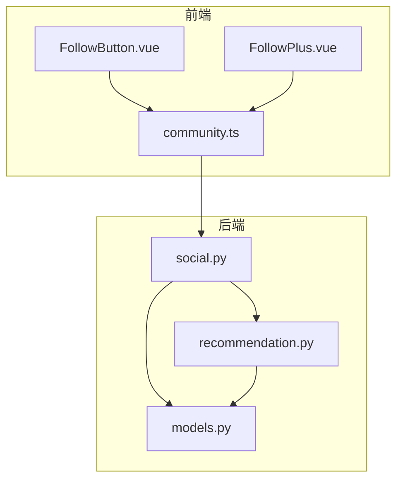
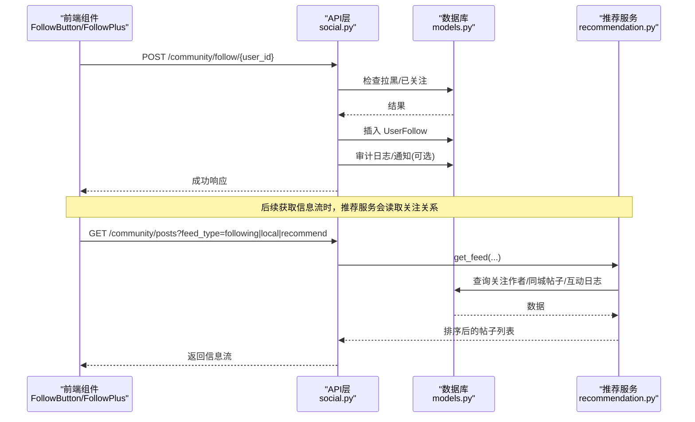
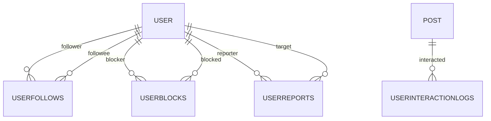
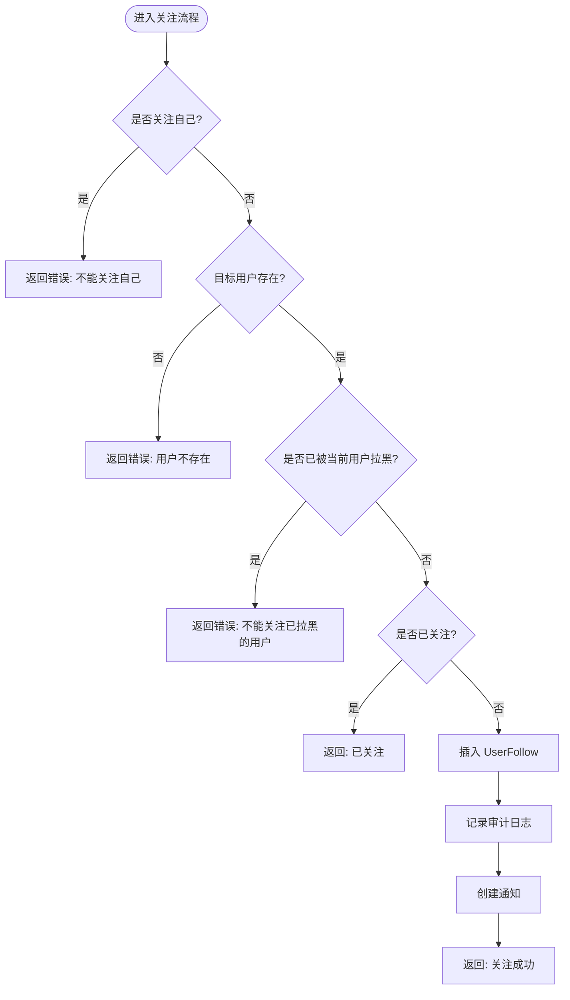
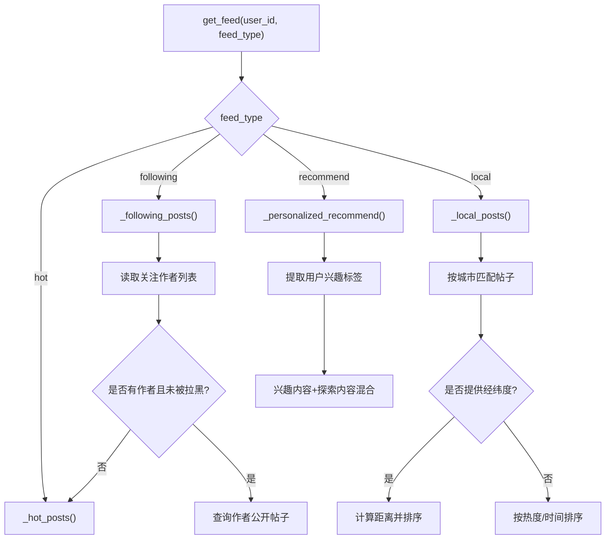
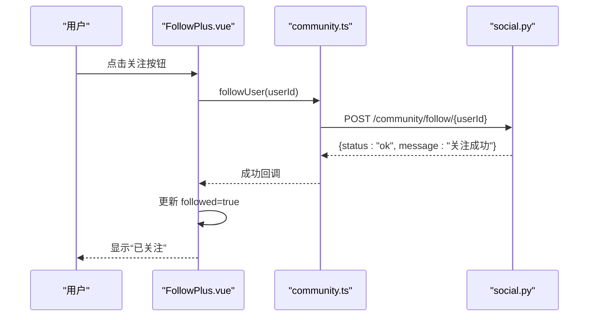
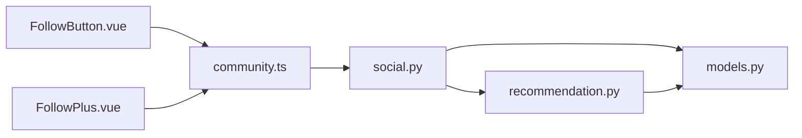

# 社交关系网络

<cite>
**本文引用的文件**
- [web/backend/database/models.py](file://web/backend/database/models.py)
- [web/backend/api/social.py](file://web/backend/api/social.py)
- [web/backend/services/recommendation.py](file://web/backend/services/recommendation.py)
- [web/app/src/api/community.ts](file://web/app/src/api/community.ts)
- [web/app/src/components/community/FollowButton.vue](file://web/app/src/components/community/FollowButton.vue)
- [web/app/src/components/community/FollowPlus.vue](file://web/app/src/components/community/FollowPlus.vue)
- [hermes_plan/2026-04-25-001-feat-community-tabs-follow-local-plan.md](file://hermes_plan/2026-04-25-001-feat-community-tabs-follow-local-plan.md)
</cite>

## 目录
1. [简介](#简介)
2. [项目结构](#项目结构)
3. [核心组件](#核心组件)
4. [架构总览](#架构总览)
5. [详细组件分析](#详细组件分析)
6. [依赖关系分析](#依赖关系分析)
7. [性能与扩展性](#性能与扩展性)
8. [故障排查指南](#故障排查指南)
9. [结论](#结论)
10. [附录：API 参考](#附录api-参考)

## 简介
本技术文档聚焦于“社交关系网络”的完整实现，覆盖用户关注/取关、粉丝列表、关注列表、拉黑/举报、推荐算法中的关注权重与个性化信息流、同城用户发现、权限控制与隐私设置、前端交互组件以及大规模关系数据的存储与查询优化策略。目标是帮助开发者快速理解并扩展该模块。

## 项目结构
围绕社交关系的核心代码分布在后端 API、数据模型、推荐服务与前端组件中：
- 数据模型：定义用户、关注、拉黑、举报等实体及关系
- API 层：提供关注/取关、粉丝/关注列表、拉黑/取消拉黑、举报、公开资料等接口
- 推荐服务：基于关注关系、互动行为、同城位置生成个性化/同城/热门信息流
- 前端：关注按钮、关注状态切换、社区页与个人资料页集成

图表来源
- [web/app/src/components/community/FollowButton.vue:1-56](file://web/app/src/components/community/FollowButton.vue#L1-L56)
- [web/app/src/components/community/FollowPlus.vue:1-47](file://web/app/src/components/community/FollowPlus.vue#L1-L47)
- [web/app/src/api/community.ts:235-283](file://web/app/src/api/community.ts#L235-L283)
- [web/backend/api/social.py:1-334](file://web/backend/api/social.py#L1-L334)
- [web/backend/database/models.py:786-846](file://web/backend/database/models.py#L786-L846)
- [web/backend/services/recommendation.py:74-94](file://web/backend/services/recommendation.py#L74-L94)

章节来源
- [web/backend/database/models.py:786-846](file://web/backend/database/models.py#L786-L846)
- [web/backend/api/social.py:1-334](file://web/backend/api/social.py#L1-L334)
- [web/backend/services/recommendation.py:74-94](file://web/backend/services/recommendation.py#L74-L94)
- [web/app/src/api/community.ts:235-283](file://web/app/src/api/community.ts#L235-L283)

## 核心组件
- 数据模型
  - UserFollow：记录 follower -> followee 的关注关系（唯一约束防止重复）
  - UserBlock：记录 blocker -> blocked 的拉黑关系（唯一约束）
  - UserReport：记录举报（含可选 post_id）
  - Post：包含城市、经纬度字段，用于同城推荐
  - UserInteractionLog：记录点击、阅读结束、点赞、收藏、评论、分享、跳过等行为，作为推荐权重输入
- API 层
  - 关注/取关：POST/DELETE /community/follow/{user_id}
  - 列表：GET /community/follow/following、GET /community/follow/followers
  - 拉黑/取消拉黑/黑名单：POST/DELETE /community/block/{user_id}、GET /community/block/list
  - 举报：POST /community/report
  - 公开资料：GET /community/profile/{user_id}、GET /community/profile/{user_id}/posts
- 推荐服务
  - get_feed：根据 feed_type 路由到 hot/following/local/personalized
  - _following_posts：基于关注作者过滤内容，排除被拉黑用户
  - _local_posts：按城市匹配，支持经纬度距离排序与内存缓存
  - _personalized_recommend：兴趣标签 + 探索内容混合
  - post_score_expr：统一评分公式（点赞、评论、阅读计数加权）
- 前端组件
  - FollowButton/FollowPlus：关注状态切换、登录态校验、加载态处理
  - community.ts：封装关注相关 API 调用

章节来源
- [web/backend/database/models.py:786-846](file://web/backend/database/models.py#L786-L846)
- [web/backend/api/social.py:29-155](file://web/backend/api/social.py#L29-L155)
- [web/backend/services/recommendation.py:74-94](file://web/backend/services/recommendation.py#L74-L94)
- [web/app/src/components/community/FollowButton.vue:1-56](file://web/app/src/components/community/FollowButton.vue#L1-L56)
- [web/app/src/components/community/FollowPlus.vue:1-47](file://web/app/src/components/community/FollowPlus.vue#L1-L47)
- [web/app/src/api/community.ts:235-283](file://web/app/src/api/community.ts#L235-L283)

## 架构总览
下图展示了从前端到后端的关注流程与推荐数据流：

图表来源
- [web/backend/api/social.py:29-105](file://web/backend/api/social.py#L29-L105)
- [web/backend/database/models.py:786-846](file://web/backend/database/models.py#L786-L846)
- [web/backend/services/recommendation.py:74-94](file://web/backend/services/recommendation.py#L74-L94)
- [web/backend/services/recommendation.py:184-229](file://web/backend/services/recommendation.py#L184-L229)
- [web/backend/services/recommendation.py:231-310](file://web/backend/services/recommendation.py#L231-L310)

## 详细组件分析

### 数据模型与关系设计
- UserFollow
  - 字段：id、followee_id、follower_id、created_at
  - 唯一约束：(followee_id, follower_id) 防止重复关注
  - 关系：指向 User 的双向引用（followers_rel/following_rel）
- UserBlock
  - 字段：id、blocker_id、blocked_id、created_at
  - 唯一约束：(blocker_id, blocked_id)
- UserReport
  - 字段：id、reporter_id、target_user_id、post_id、reason、created_at
- Post
  - 字段：city、latitude、longitude 用于同城推荐；is_private 控制可见性
- UserInteractionLog
  - 字段：user_id、post_id、action_type、created_at
  - 作用：为推荐算法提供行为权重（点击、阅读结束、点赞、收藏、评论、分享、跳过）

图表来源
- [web/backend/database/models.py:786-846](file://web/backend/database/models.py#L786-L846)
- [web/backend/database/models.py:312-347](file://web/backend/database/models.py#L312-L347)
- [web/backend/database/models.py:562-579](file://web/backend/database/models.py#L562-L579)

章节来源
- [web/backend/database/models.py:786-846](file://web/backend/database/models.py#L786-L846)
- [web/backend/database/models.py:312-347](file://web/backend/database/models.py#L312-L347)
- [web/backend/database/models.py:562-579](file://web/backend/database/models.py#L562-L579)

### 关注/取关/粉丝/关注列表 API
- 关注用户
  - 校验：不能关注自己、目标用户存在、未被当前用户拉黑
  - 幂等：若已关注则直接返回“已关注”
  - 副作用：写入审计日志、创建站内通知
- 取消关注
  - 校验：必须存在关注关系
- 我关注的用户列表
  - 按 created_at 倒序返回关注者基本信息
- 我的粉丝列表
  - 按 created_at 倒序返回粉丝基本信息
- 拉黑/取消拉黑/黑名单
  - 拉黑自动解除双向关注
- 举报
  - 记录举报原因，可关联帖子
- 公开资料
  - 返回关注数、粉丝数、是否已关注等

图表来源
- [web/backend/api/social.py:29-85](file://web/backend/api/social.py#L29-L85)

章节来源
- [web/backend/api/social.py:29-155](file://web/backend/api/social.py#L29-L155)
- [web/backend/api/social.py:158-242](file://web/backend/api/social.py#L158-L242)
- [web/backend/api/social.py:245-334](file://web/backend/api/social.py#L245-L334)

### 推荐算法与信息流
- 统一评分公式
  - 点赞、评论、阅读计数加权计算，用于热门/推荐排序
- 关注信息流
  - 读取当前用户的关注作者集合，过滤私密帖子与被拉黑用户
  - 若无关注或全部被拉黑，回退到热门信息流
- 同城信息流
  - 按城市匹配帖子，支持经纬度距离排序
  - 使用内存缓存（TTL 5分钟）减少重复查询
- 个性化推荐
  - 基于用户最近互动行为提取兴趣标签，混合“兴趣内容”和“探索内容”
- 行为记录
  - 记录点击、阅读结束、点赞、收藏、评论、分享、跳过等行为，驱动推荐

图表来源
- [web/backend/services/recommendation.py:74-94](file://web/backend/services/recommendation.py#L74-L94)
- [web/backend/services/recommendation.py:96-125](file://web/backend/services/recommendation.py#L96-L125)
- [web/backend/services/recommendation.py:127-182](file://web/backend/services/recommendation.py#L127-L182)
- [web/backend/services/recommendation.py:184-229](file://web/backend/services/recommendation.py#L184-L229)
- [web/backend/services/recommendation.py:231-310](file://web/backend/services/recommendation.py#L231-L310)

章节来源
- [web/backend/services/recommendation.py:42-72](file://web/backend/services/recommendation.py#L42-L72)
- [web/backend/services/recommendation.py:74-94](file://web/backend/services/recommendation.py#L74-L94)
- [web/backend/services/recommendation.py:184-229](file://web/backend/services/recommendation.py#L184-L229)
- [web/backend/services/recommendation.py:231-310](file://web/backend/services/recommendation.py#L231-L310)

### 权限控制与隐私设置
- 关注权限
  - 不能关注自己
  - 不能关注已被当前用户拉黑的用户
- 内容可见性
  - 仅展示非私密帖子（is_private=False）
  - 未登录或非本人/管理员时，过滤被屏蔽的帖子
- 隐私模式
  - 用户隐私模式影响可发现性与手机号匹配（在用户模型中体现）
- 举报与风控
  - 举报记录关联用户与可选帖子，便于审核

章节来源
- [web/backend/api/social.py:29-85](file://web/backend/api/social.py#L29-L85)
- [web/backend/api/social.py:307-334](file://web/backend/api/social.py#L307-L334)
- [web/backend/database/models.py:109-117](file://web/backend/database/models.py#L109-L117)
- [web/backend/database/models.py:312-347](file://web/backend/database/models.py#L312-L347)

### 前端交互组件
- FollowButton/FollowPlus
  - 登录态校验：未登录时阻止操作或弹出登录模态
  - 本地状态：initialFollowed 同步后端状态
  - 交互：点击触发关注/取关，更新 UI 并抛出事件
- community.ts
  - 封装关注相关 API：followUser、unfollowUser、getFollowing、getFollowers、blockUser、unblockUser、getBlockList、reportUser、getPublicProfile、getUserPosts

图表来源
- [web/app/src/components/community/FollowPlus.vue:1-47](file://web/app/src/components/community/FollowPlus.vue#L1-L47)
- [web/app/src/api/community.ts:235-283](file://web/app/src/api/community.ts#L235-L283)
- [web/backend/api/social.py:29-85](file://web/backend/api/social.py#L29-L85)

章节来源
- [web/app/src/components/community/FollowButton.vue:1-56](file://web/app/src/components/community/FollowButton.vue#L1-L56)
- [web/app/src/components/community/FollowPlus.vue:1-47](file://web/app/src/components/community/FollowPlus.vue#L1-L47)
- [web/app/src/api/community.ts:235-283](file://web/app/src/api/community.ts#L235-L283)

### 同城用户发现
- 前端
  - 通过地理位置获取城市名（可缓存），仅在切换到同城标签时请求
  - 将城市名传递给后端 API
- 后端
  - 按城市匹配帖子，支持经纬度距离排序
  - 使用内存缓存（TTL 5分钟）提升性能

章节来源
- [hermes_plan/2026-04-25-001-feat-community-tabs-follow-local-plan.md:318-397](file://hermes_plan/2026-04-25-001-feat-community-tabs-follow-local-plan.md#L318-L397)
- [web/backend/services/recommendation.py:231-310](file://web/backend/services/recommendation.py#L231-L310)

## 依赖关系分析
- 前端依赖
  - FollowButton/FollowPlus 依赖 community.ts 提供的 API
  - community.ts 依赖后端 social.py 暴露的 REST 接口
- 后端依赖
  - social.py 依赖 models.py 的数据模型与 ORM 关系
  - recommendation.py 依赖 models.py 的行为日志与帖子模型
  - 推荐服务在 following/local/recommend 模式下分别依赖关注关系、城市/坐标、互动行为

图表来源
- [web/app/src/components/community/FollowButton.vue:1-56](file://web/app/src/components/community/FollowButton.vue#L1-L56)
- [web/app/src/components/community/FollowPlus.vue:1-47](file://web/app/src/components/community/FollowPlus.vue#L1-L47)
- [web/app/src/api/community.ts:235-283](file://web/app/src/api/community.ts#L235-L283)
- [web/backend/api/social.py:1-334](file://web/backend/api/social.py#L1-L334)
- [web/backend/database/models.py:786-846](file://web/backend/database/models.py#L786-L846)
- [web/backend/services/recommendation.py:74-94](file://web/backend/services/recommendation.py#L74-L94)

章节来源
- [web/backend/api/social.py:1-334](file://web/backend/api/social.py#L1-L334)
- [web/backend/services/recommendation.py:74-94](file://web/backend/services/recommendation.py#L74-L94)
- [web/backend/database/models.py:786-846](file://web/backend/database/models.py#L786-L846)

## 性能与扩展性
- 查询优化
  - 使用索引：用户 ID、帖子城市、互动日志时间戳等字段具备索引
  - 游标分页：避免深度偏移带来的性能问题
  - 内存缓存：同城信息流首屏缓存（TTL 5分钟），降低重复查询
- 并发安全
  - 唯一约束防止重复关注/拉黑
  - 点赞等互斥场景采用唯一约束避免重复计数
- 可扩展性
  - 推荐算法模块化：可按需扩展兴趣标签、探索比例、同城距离阈值
  - 行为日志可扩展更多动作类型以丰富推荐信号
- 建议
  - 对高频读路径引入 Redis 缓存（如关注列表、粉丝列表）
  - 对同城距离计算可考虑空间索引（如 PostGIS）以提升大规模地理查询性能
  - 对推荐评分进行离线预计算与增量更新，降低实时计算压力

[本节为通用指导，不直接分析具体文件]

## 故障排查指南
- 关注失败
  - 检查是否已拉黑目标用户
  - 检查目标用户是否存在
  - 检查是否尝试关注自己
- 取关失败
  - 确认是否存在关注关系
- 拉黑无效
  - 确认是否已存在拉黑记录
  - 注意拉黑会自动解除双向关注
- 推荐异常
  - 检查行为日志是否正确记录
  - 检查帖子是否为私密或被屏蔽
  - 检查同城参数是否正确传递
- 前端状态不同步
  - 确保 initialFollowed 与后端状态一致
  - 检查登录态与权限

章节来源
- [web/backend/api/social.py:29-105](file://web/backend/api/social.py#L29-L105)
- [web/backend/api/social.py:158-242](file://web/backend/api/social.py#L158-L242)
- [web/backend/services/recommendation.py:184-229](file://web/backend/services/recommendation.py#L184-L229)
- [web/backend/services/recommendation.py:231-310](file://web/backend/services/recommendation.py#L231-L310)

## 结论
本模块实现了完整的社交关系网络基础能力：关注/取关、粉丝/关注列表、拉黑/举报、公开资料、推荐算法中的关注权重与个性化信息流、同城用户发现。通过合理的数据模型设计、API 分层、推荐服务与前端组件协作，提供了良好的用户体验与可扩展性。未来可进一步引入缓存、空间索引与离线预计算以提升大规模场景下的性能。

[本节为总结，不直接分析具体文件]

## 附录：API 参考
- 关注/取关
  - POST /community/follow/{user_id}
  - DELETE /community/follow/{user_id}
- 列表
  - GET /community/follow/following
  - GET /community/follow/followers
- 拉黑/取消拉黑/黑名单
  - POST /community/block/{user_id}
  - DELETE /community/block/{user_id}
  - GET /community/block/list
- 举报
  - POST /community/report
- 公开资料
  - GET /community/profile/{user_id}
  - GET /community/profile/{user_id}/posts

章节来源
- [web/backend/api/social.py:29-334](file://web/backend/api/social.py#L29-L334)
- [web/app/src/api/community.ts:235-283](file://web/app/src/api/community.ts#L235-L283)