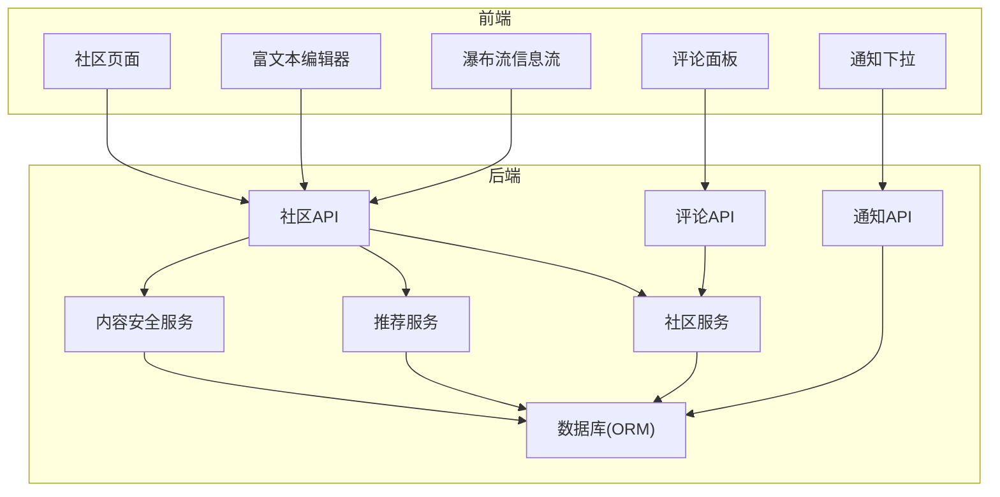
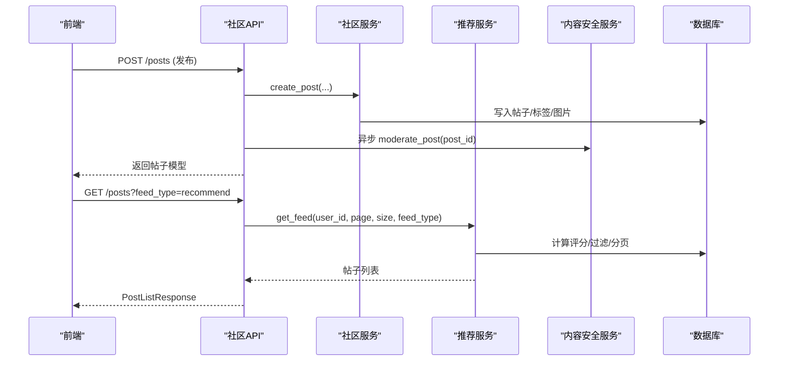
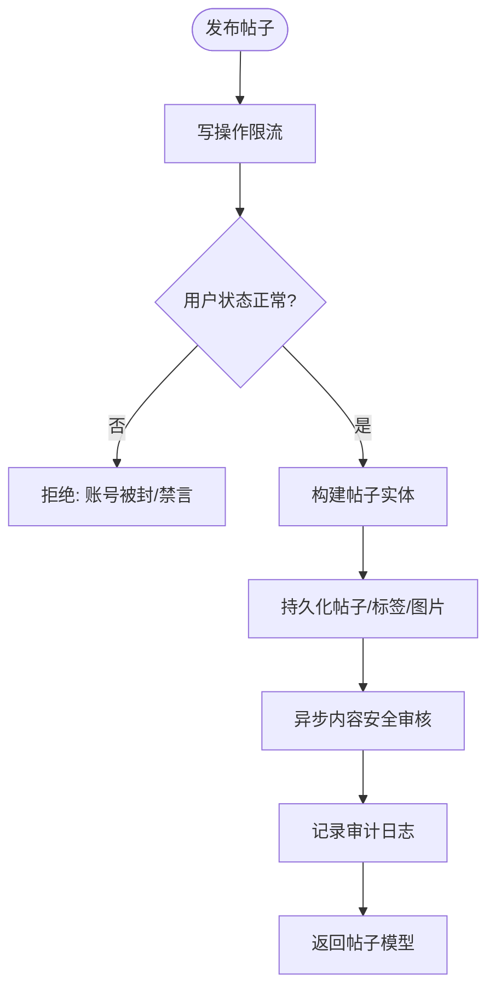
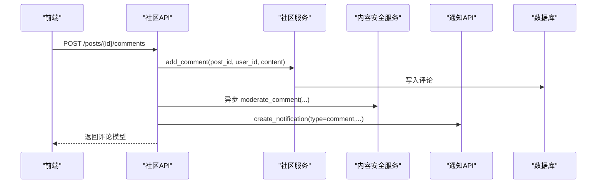
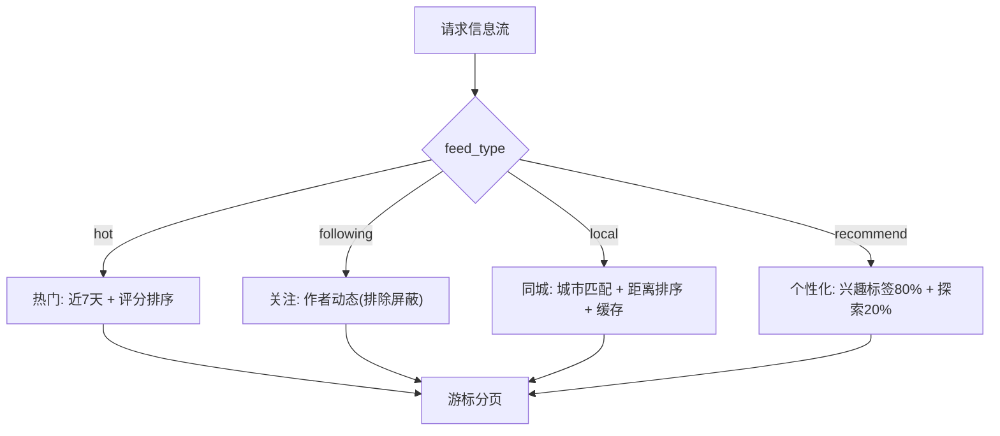
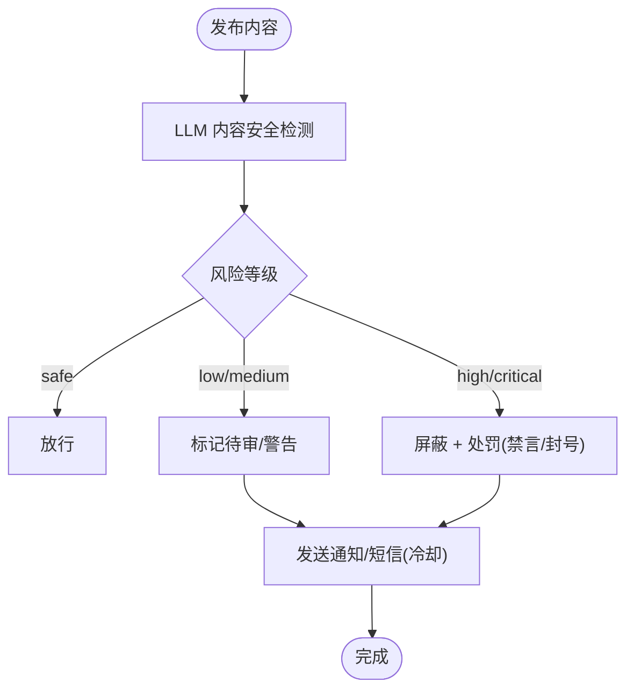
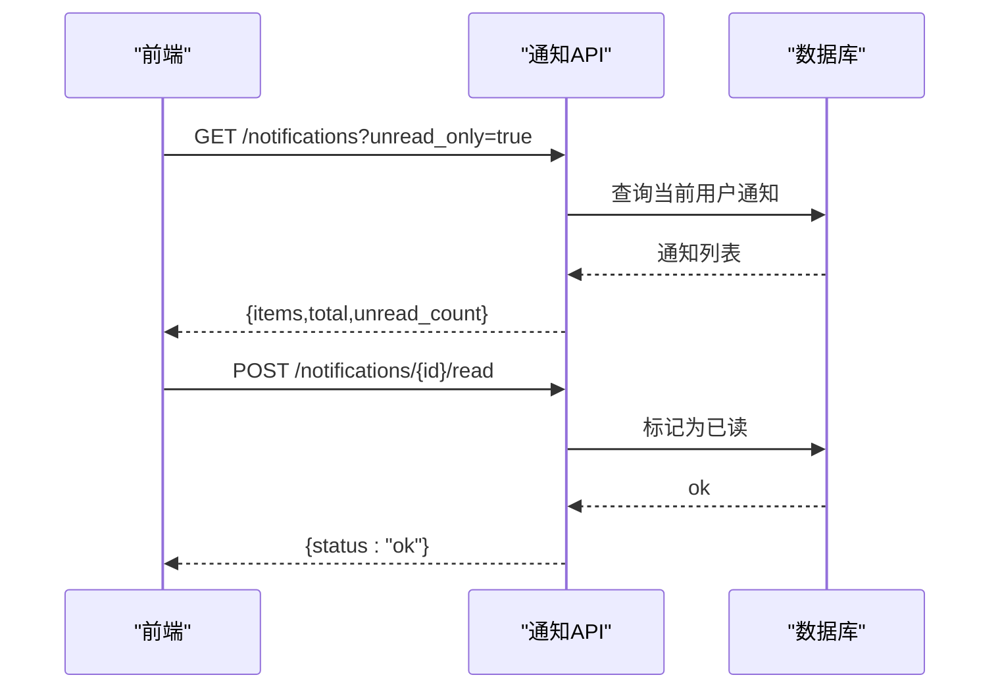
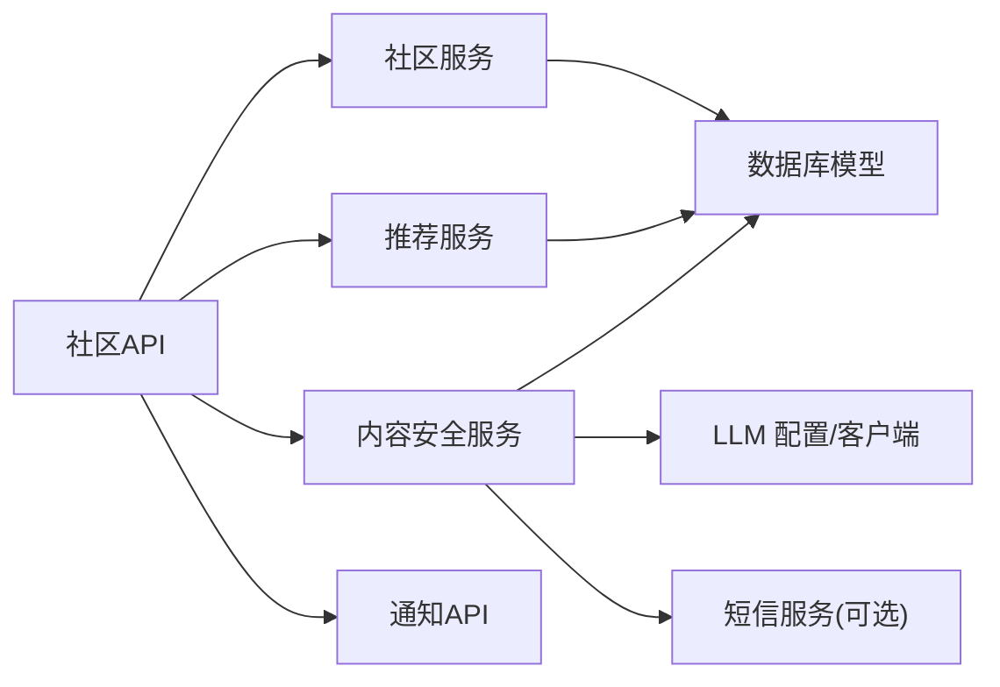

# 社区平台

<cite>
**本文引用的文件**
- [README.md](file://README.md)
- [web/backend/README.md](file://web/backend/README.md)
- [community.py](file://web/backend/api/community.py)
- [comment.py](file://web/backend/api/comment.py)
- [community_service.py](file://web/backend/services/community.py)
- [recommendation_service.py](file://web/backend/services/recommendation.py)
- [content_safety_service.py](file://web/backend/services/content_safety.py)
- [notifications_api.py](file://web/backend/api/notifications.py)
- [models_community.py](file://web/backend/models/community.py)
- [models_comment.py](file://web/backend/models/comment.py)
- [database_models.py](file://web/backend/database/models.py)
</cite>

## 目录
1. [简介](#简介)
2. [项目结构](#项目结构)
3. [核心组件](#核心组件)
4. [架构总览](#架构总览)
5. [详细组件分析](#详细组件分析)
6. [依赖关系分析](#依赖关系分析)
7. [性能考量](#性能考量)
8. [故障排查指南](#故障排查指南)
9. [结论](#结论)
10. [附录：API 与前端组件参考](#附录api-与前端组件参考)

## 简介
SubSkin 社区平台面向白癜风患者与关注者，提供知识分享、经验交流、内容审核与通知等能力。社区模块涵盖帖子管理、评论互动、关注关系网络、内容安全与反垃圾机制、标签分类、搜索与推荐信息流、富文本编辑集成、文件上传处理、消息通知等完整社交功能。后端基于 FastAPI，前端采用 Vue 3 + TypeScript + Tailwind CSS，数据库使用 SQLAlchemy + SQLite/PostgreSQL。

## 项目结构
- 后端 API：按领域划分路由（社区、评论、通知、文件等），服务层封装业务逻辑（社区、推荐、内容安全、认证等），数据模型定义 ORM 与 Pydantic 请求/响应模型。
- 前端应用：社区编辑器、帖子卡片、瀑布流信息流、标签选择器、收藏/书签、通知下拉等组件；通过 api 客户端调用后端接口。
- 部署与配置：Nginx、Docker、环境变量与启动脚本。

图表来源
- [community.py:219-353](file://web/backend/api/community.py#L219-L353)
- [recommendation_service.py:77-182](file://web/backend/services/recommendation.py#L77-L182)
- [content_safety_service.py:103-146](file://web/backend/services/content_safety.py#L103-L146)
- [notifications_api.py:114-142](file://web/backend/api/notifications.py#L114-L142)

章节来源
- [README.md:29-65](file://README.md#L29-L65)
- [web/backend/README.md:1-44](file://web/backend/README.md#L1-L44)

## 核心组件
- 帖子管理系统：创建、更新、删除、分页列表、私密日记、版本历史、收藏与书签、结构化治疗分享。
- 评论互动机制：评论提交、列表获取、权限控制、异步内容审核、通知触发。
- 关注关系网络：关注/取关、屏蔽、关注动态流、同城信息流、个性化推荐。
- 内容审核系统：LLM 驱动的内容安全检测、自动处置（标记/屏蔽）、违规记录与处罚（警告/禁言/封号）、短信通知。
- 消息通知：点赞、评论、关注、收藏、系统通知的统一入口与查询。
- 标签分类与搜索：标签聚合、热门标签、按标签筛选、关键词模糊搜索。
- 文件上传处理：图片/音频/附件上传，大小限制、扩展名白名单、Magic Byte 校验、去重命名。
- 信息流算法：热门、关注、同城、个性化推荐，评分公式与游标分页。
- 权限与安全：用户状态（正常/禁言/封禁）、读写限频、访问控制、审计日志。

章节来源
- [community_service.py:136-422](file://web/backend/services/community.py#L136-L422)
- [community_service.py:424-583](file://web/backend/services/community.py#L424-L583)
- [recommendation_service.py:42-182](file://web/backend/services/recommendation.py#L42-L182)
- [content_safety_service.py:54-146](file://web/backend/services/content_safety.py#L54-L146)
- [notifications_api.py:84-142](file://web/backend/api/notifications.py#L84-L142)
- [community.py:172-198](file://web/backend/api/community.py#L172-L198)
- [community.py:683-757](file://web/backend/api/community.py#L683-L757)

## 架构总览
社区模块采用“API 路由 -> 服务层 -> 数据模型”的分层架构。API 负责鉴权、参数校验、限流与审计；服务层实现业务规则（权限、计数、排序、审核、通知）；数据层通过 SQLAlchemy ORM 持久化。推荐与内容安全作为横向服务被多路由复用。

图表来源
- [community.py:219-293](file://web/backend/api/community.py#L219-L293)
- [recommendation_service.py:77-182](file://web/backend/services/recommendation.py#L77-L182)
- [content_safety_service.py:103-146](file://web/backend/services/content_safety.py#L103-L146)

## 详细组件分析

### 帖子管理系统
- 能力要点
  - 创建/更新/删除：支持标题、HTML/JSON 内容、类型推断（长文/图文/视频）、分类、标签、私密/公开、日记日期与心情、城市、结构化治疗分享。
  - 列表与详情：支持分类/标签/类型/私密过滤、游标分页、批量模型转换避免 N+1。
  - 版本历史：更新时自动保存旧版本以便回溯。
  - 收藏与书签：用户级收藏集与全局书签。
  - 权限控制：私有帖仅作者可见；被屏蔽内容对非作者不可见。
- 关键流程
  - 发布：限流 -> 状态检查 -> 构建帖子 -> 写入标签/图片 -> 异步内容审核 -> 审计日志。
  - 列表：根据 feed_type 走推荐或通用查询；非匿名用户过滤 blocked 内容。
  - 更新：变更内容/标签/图片并保存版本。
  - 删除：级联清理标签关联与子表。

图表来源
- [community.py:219-293](file://web/backend/api/community.py#L219-L293)
- [community_service.py:136-224](file://web/backend/services/community.py#L136-L224)
- [content_safety_service.py:103-146](file://web/backend/services/content_safety.py#L103-L146)

章节来源
- [community.py:219-540](file://web/backend/api/community.py#L219-L540)
- [community_service.py:136-422](file://web/backend/services/community.py#L136-L422)
- [models_community.py:88-176](file://web/backend/models/community.py#L88-L176)

### 评论互动机制
- 能力要点
  - 评论提交：登录态校验、用户状态校验、异步内容安全审核、通知作者。
  - 评论列表：按时间排序分页，支持总数与条目。
  - 权限控制：仅可评论可访问的帖子。
- 关键流程
  - 新增评论：限流 -> 权限检查 -> 写入评论 -> 异步审核 -> 审计日志 -> 通知作者。
  - 列表获取：按帖子维度分页加载。

图表来源
- [community.py:587-643](file://web/backend/api/community.py#L587-L643)
- [community_service.py:467-492](file://web/backend/services/community.py#L467-L492)
- [content_safety_service.py:190-226](file://web/backend/services/content_safety.py#L190-L226)
- [notifications_api.py:84-109](file://web/backend/api/notifications.py#L84-L109)

章节来源
- [community.py:587-660](file://web/backend/api/community.py#L587-L660)
- [community_service.py:467-492](file://web/backend/services/community.py#L467-L492)
- [models_comment.py:9-27](file://web/backend/models/comment.py#L9-L27)

### 关注关系网络与信息流
- 能力要点
  - 关注/屏蔽：影响“关注动态”与推荐过滤。
  - 信息流类型：热门（近一周加权）、关注（作者动态）、同城（城市匹配+距离排序）、个性化（兴趣标签+探索）。
  - 评分公式：like*2 + comment*2.5 + read_count*0.1。
  - 游标分页：基于 created_at 与 id 的稳定分页。
- 关键流程
  - 个性化推荐：首屏按用户交互标签拆分“兴趣/探索”，后续页统一评分排序。
  - 同城信息流：内存缓存（TTL 5 分钟）加速首屏，支持经纬度距离排序。

图表来源
- [recommendation_service.py:77-182](file://web/backend/services/recommendation.py#L77-L182)
- [recommendation_service.py:184-310](file://web/backend/services/recommendation.py#L184-L310)
- [community.py:296-353](file://web/backend/api/community.py#L296-L353)

章节来源
- [recommendation_service.py:42-347](file://web/backend/services/recommendation.py#L42-L347)
- [community.py:296-353](file://web/backend/api/community.py#L296-L353)

### 内容审核系统与反垃圾机制
- 能力要点
  - LLM 内容安全检测：风险等级（safe/low/medium/high/critical）与类别判定。
  - 自动处置：根据阈值自动标记或屏蔽，记录审核单。
  - 违规累积与处罚：警告、禁言（含时长）、封号，同步用户状态。
  - 通知与短信：违规通知、禁言/封号短信提醒（带冷却防刷）。
- 关键流程
  - 帖子/评论发布后异步审核；若命中高风险则屏蔽并处罚；中低风险标记待审或警告。

图表来源
- [content_safety_service.py:54-146](file://web/backend/services/content_safety.py#L54-L146)
- [content_safety_service.py:229-315](file://web/backend/services/content_safety.py#L229-L315)
- [content_safety_service.py:341-368](file://web/backend/services/content_safety.py#L341-L368)

章节来源
- [content_safety_service.py:54-368](file://web/backend/services/content_safety.py#L54-L368)

### 消息通知
- 能力要点
  - 统一通知创建：点赞、评论、关注、收藏、系统、审核等类型。
  - 通知列表与未读数：分页、仅未读、未读计数。
  - 已读标记：单条与全部已读。
- 关键流程
  - 事件触发（如点赞/评论）-> 创建通知 -> 前端拉取列表/未读数。

图表来源
- [notifications_api.py:114-186](file://web/backend/api/notifications.py#L114-L186)

章节来源
- [notifications_api.py:84-186](file://web/backend/api/notifications.py#L84-L186)

### 标签分类系统与搜索
- 能力要点
  - 标签管理：创建/更新/删除（通过帖子标签关联），热门标签统计。
  - 标签筛选：按标签名称精确匹配到帖子集合。
  - 搜索：标签名模糊搜索、按分类/类型/标签组合过滤。
- 关键流程
  - 发布/更新帖子时维护标签计数与关联；列表接口支持 tag 过滤。

章节来源
- [community.py:172-198](file://web/backend/api/community.py#L172-L198)
- [community.py:670-680](file://web/backend/api/community.py#L670-L680)
- [community_service.py:226-292](file://web/backend/services/community.py#L226-L292)

### 文件上传处理
- 能力要点
  - 图片上传：大小上限、扩展名白名单、Magic Byte 校验、去重命名、存储路径。
  - 音频/文件上传：大小上限、扩展名白名单、元数据返回。
  - 安全策略：防止超大文件与伪装格式攻击。
- 关键流程
  - 接收文件 -> 校验大小/扩展名/Magic -> 生成唯一文件名 -> 落盘 -> 返回 URL。

```mermaid
flowchart TD
U["上传文件"] --> SizeCheck{"大小是否超限?"}
SizeCheck --> |是| ErrSize["拒绝: 文件过大"]
SizeCheck --> |否| ExtCheck{"扩展名允许?"}
ExtCheck --> |否| ErrExt["拒绝: 不支持格式"]
ExtCheck --> |是| MagicCheck{"图片Magic校验?"}
MagicCheck --> |否| ErrMagic["拒绝: 内容与格式不符"]
MagicCheck --> |是| Save["写入磁盘并返回URL"]
```

图表来源
- [community.py:683-757](file://web/backend/api/community.py#L683-L757)
- [community_service.py:501-583](file://web/backend/services/community.py#L501-L583)

章节来源
- [community.py:683-757](file://web/backend/api/community.py#L683-L757)
- [community_service.py:501-583](file://web/backend/services/community.py#L501-L583)

### 富文本编辑器集成
- 能力要点
  - 支持 HTML 与 Tiptap JSON 内容存储，便于前后端渲染与版本对比。
  - 内容预览字段用于列表摘要展示。
- 关键流程
  - 前端编辑器产出 HTML/JSON -> 提交至帖子接口 -> 后端解析并存储预览。

章节来源
- [models_community.py:88-127](file://web/backend/models/community.py#L88-L127)
- [community_service.py:136-224](file://web/backend/services/community.py#L136-L224)

### 用户权限控制与社区治理工具
- 能力要点
  - 用户状态：normal/muted/banned，影响发帖、评论、点赞等操作。
  - 读写限频：写操作限流，保护系统稳定性。
  - 审计日志：关键操作留痕（发布、删除、点赞等）。
  - 管理员能力：评论审核、内容审核后台（由其他模块提供）。
- 关键流程
  - 每次写操作前检查用户状态与限频；敏感操作记录审计日志。

章节来源
- [community.py:219-293](file://web/backend/api/community.py#L219-L293)
- [community.py:543-584](file://web/backend/api/community.py#L543-L584)
- [community_service.py:48-64](file://web/backend/services/community.py#L48-L64)
- [database_models.py:88-154](file://web/backend/database/models.py#L88-L154)

## 依赖关系分析
- 模块耦合
  - 社区 API 依赖社区服务、推荐服务、内容安全服务、通知 API。
  - 社区服务依赖数据库模型（帖子、评论、标签、收藏、书签、版本等）。
  - 推荐服务依赖用户交互日志、关注/屏蔽关系。
  - 内容安全服务依赖 LLM 配置与数据库模型（审核记录、违规记录、通知）。
- 外部依赖
  - LLM 提供商（OpenAI/DashScope 等）用于内容安全检测。
  - 短信服务商用于违规通知（可选）。
  - 第三方 IP 定位服务用于同城信息流快速定位。

图表来源
- [community.py:219-353](file://web/backend/api/community.py#L219-L353)
- [recommendation_service.py:77-182](file://web/backend/services/recommendation.py#L77-L182)
- [content_safety_service.py:54-146](file://web/backend/services/content_safety.py#L54-L146)
- [notifications_api.py:114-142](file://web/backend/api/notifications.py#L114-L142)

章节来源
- [community.py:219-353](file://web/backend/api/community.py#L219-L353)
- [recommendation_service.py:77-182](file://web/backend/services/recommendation.py#L77-L182)
- [content_safety_service.py:54-146](file://web/backend/services/content_safety.py#L54-L146)
- [notifications_api.py:114-142](file://web/backend/api/notifications.py#L114-L142)

## 性能考量
- 游标分页：基于 created_at 与 id 的组合条件，避免深度偏移带来的性能问题。
- 批量模型转换：在列表接口中对帖子进行批量转换，减少 N+1 查询。
- 同城信息流缓存：内存缓存首屏结果（TTL 5 分钟），降低重复计算。
- 评分表达式：使用 SQL 子查询计算互动权重，避免多次往返。
- 文件上传限制：大小与格式双重校验，防止 DoS 与恶意文件。
- 异步审核：内容安全检测在后台线程执行，不阻塞主流程。

[本节为通用性能建议，无需特定文件引用]

## 故障排查指南
- 常见问题
  - 无法发布/评论：检查用户状态（muted/banned）与写操作限频。
  - 帖子不可见：确认是否为私密或已被屏蔽；非匿名用户看不到 blocked 内容。
  - 上传失败：检查文件大小、扩展名、Magic Byte 校验结果。
  - 信息流为空：确认 feed_type 与城市/标签参数是否正确；检查是否有足够帖子。
  - 通知缺失：确认是否给自己发通知（会跳过）；检查通知列表与未读数。
- 调试建议
  - 查看审计日志与审核记录，定位违规与处置原因。
  - 检查 LLM 配置与短信服务可用性。
  - 使用 Swagger 文档在线测试接口，验证入参与返回值。

章节来源
- [community.py:219-293](file://web/backend/api/community.py#L219-L293)
- [community.py:683-757](file://web/backend/api/community.py#L683-L757)
- [content_safety_service.py:54-146](file://web/backend/services/content_safety.py#L54-L146)
- [notifications_api.py:114-186](file://web/backend/api/notifications.py#L114-L186)

## 结论
SubSkin 社区平台以清晰的分层架构实现了完整的社交功能：帖子管理、评论互动、关注网络、内容安全、通知体系、标签分类、文件上传与推荐信息流。系统在安全性（上传校验、内容审核、权限控制）、性能（游标分页、批量转换、缓存）与可维护性（模块化服务、审计日志）方面具备良好实践。未来可进一步扩展搜索能力（全文检索）、增强推荐模型（行为特征工程）与完善治理工具（自动化策略与可视化看板）。

[本节为总结性内容，无需特定文件引用]

## 附录：API 与前端组件参考
- 核心 API（示例）
  - 帖子
    - POST /api/posts：创建帖子（需登录）
    - GET /api/posts：列表（支持分类/标签/类型/私密/游标）
    - GET /api/posts/{id}：详情
    - PUT /api/posts/{id}：更新
    - DELETE /api/posts/{id}：删除
    - POST /api/posts/{id}/like：点赞/取消
    - POST /api/posts/{id}/comments：评论
    - GET /api/posts/{id}/comments：评论列表
  - 标签
    - GET /api/tags：标签列表（支持 q 模糊搜索）
    - GET /api/tags/hot：热门标签
  - 文件上传
    - POST /api/upload：图片上传
    - POST /api/upload/audio：音频上传
    - POST /api/upload/file：文件上传
  - 通知
    - GET /api/notifications：通知列表
    - GET /api/notifications/unread-count：未读数
    - POST /api/notifications/{id}/read：标记已读
    - POST /api/notifications/read-all：全部已读
- 前端组件（示例）
  - 社区编辑器：RichEditor.vue、ImagePostEditor.vue、LongPostEditor.vue、VideoPostEditor.vue
  - 帖子卡片：PostCard.vue、TextPostCard.vue、ImagePostCard.vue、LongPostCard.vue
  - 信息流：FeedWaterfall.vue
  - 标签：TagEditor.vue、TagSelector.vue
  - 收藏/书签：Collection 相关组件
  - 通知：NotificationDropdown.vue
  - 评论：CommentSection.vue（百科场景）

章节来源
- [community.py:219-757](file://web/backend/api/community.py#L219-L757)
- [notifications_api.py:114-186](file://web/backend/api/notifications.py#L114-L186)
- [models_community.py:88-176](file://web/backend/models/community.py#L88-L176)