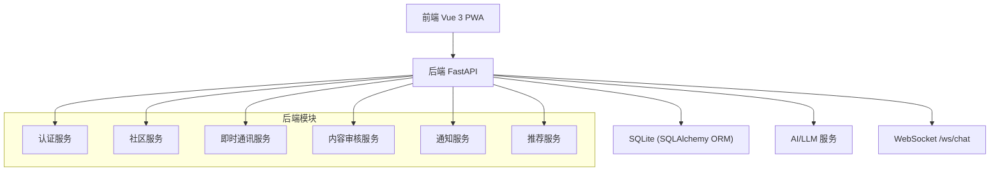
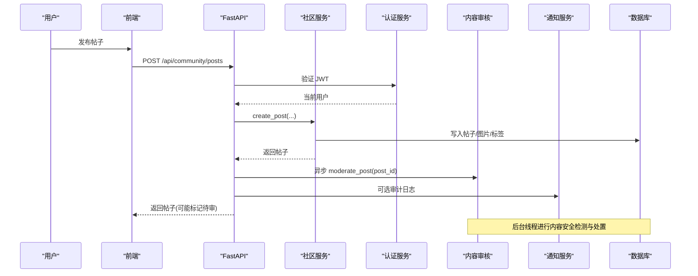
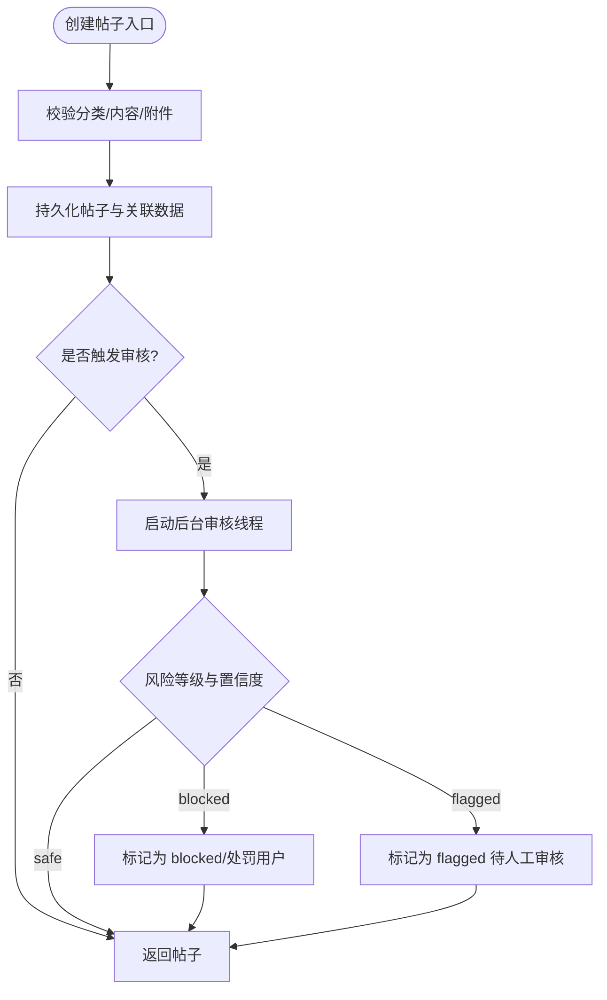
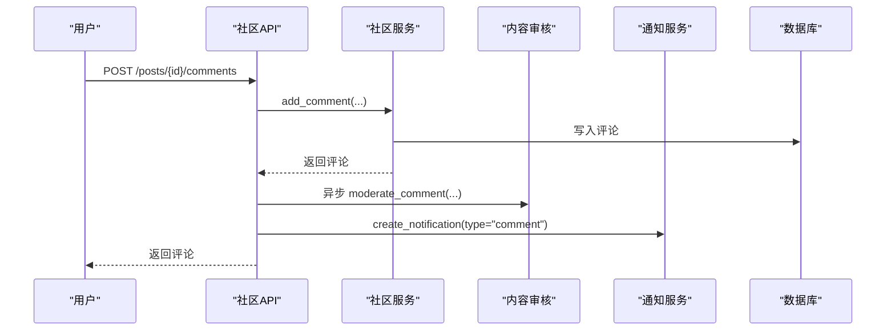
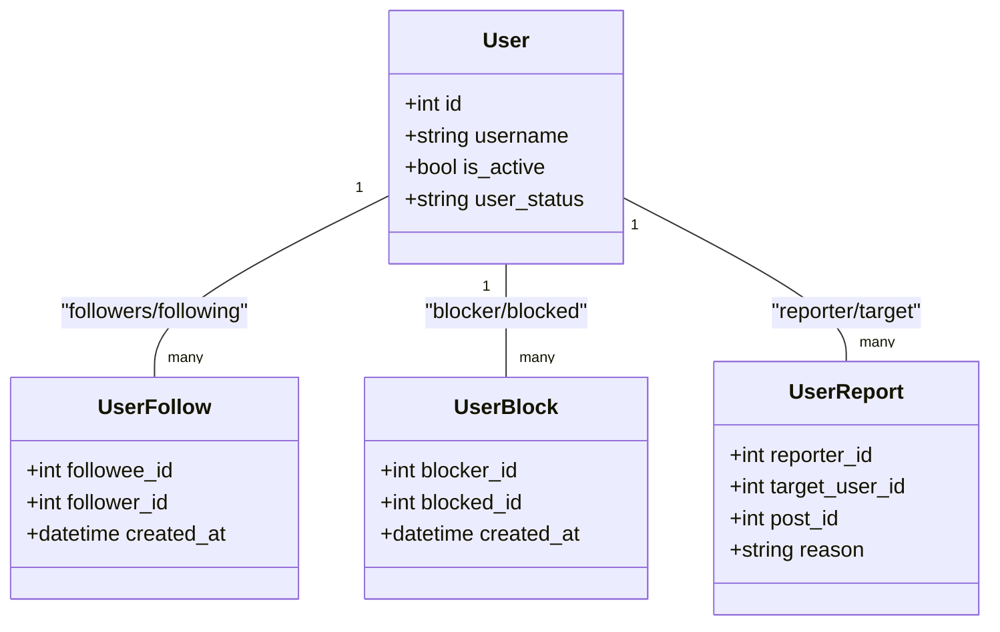
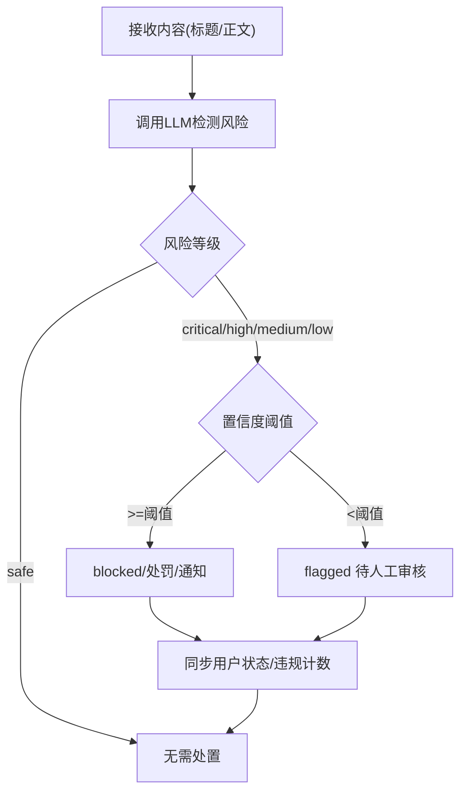
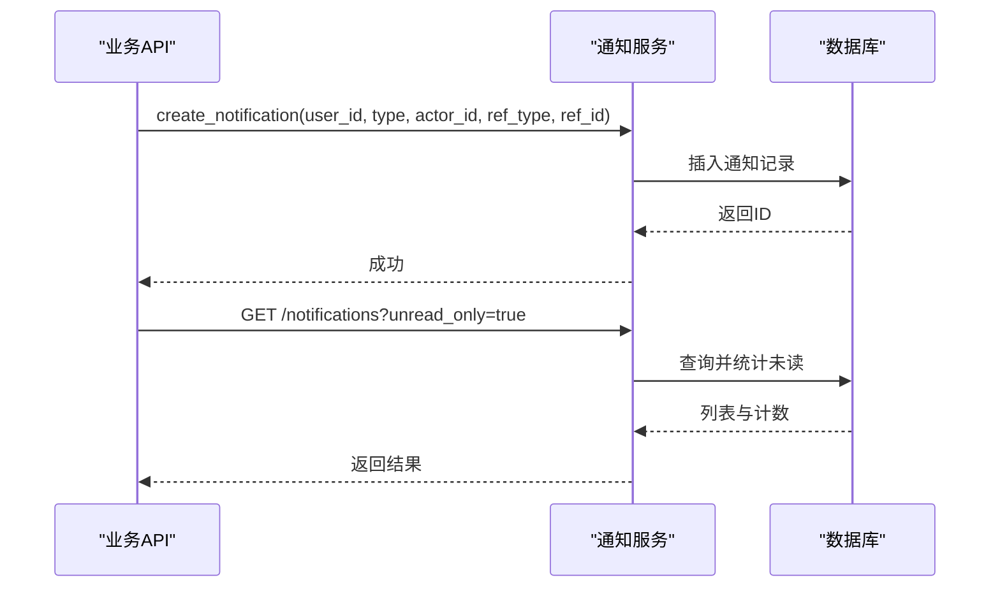
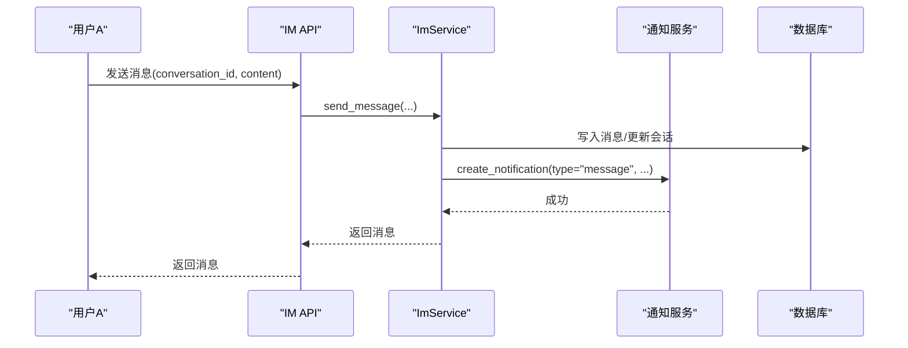
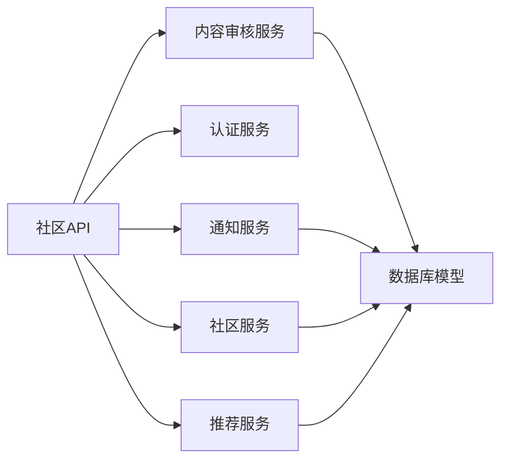

# 社区平台概览

<cite>
**本文引用的文件**
- [README.md](file://README.md)
- [PROJECT_FRAMEWORK.md](file://PROJECT_FRAMEWORK.md)
- [web/backend/app/main.py](file://web/backend/app/main.py)
- [web/backend/database/models.py](file://web/backend/database/models.py)
- [web/backend/services/community.py](file://web/backend/services/community.py)
- [web/backend/api/community.py](file://web/backend/api/community.py)
- [web/backend/services/auth.py](file://web/backend/services/auth.py)
- [web/backend/services/content_safety.py](file://web/backend/services/content_safety.py)
- [web/backend/api/notifications.py](file://web/backend/api/notifications.py)
- [web/backend/api/social.py](file://web/backend/api/social.py)
- [web/backend/services/im_service.py](file://web/backend/services/im_service.py)
- [web/app/src/api/community.ts](file://web/app/src/api/community.ts)
- [web/backend/services/recommendation.py](file://web/backend/services/recommendation.py)
</cite>

## 目录
1. [简介](#简介)
2. [项目结构](#项目结构)
3. [核心组件](#核心组件)
4. [架构总览](#架构总览)
5. [详细组件分析](#详细组件分析)
6. [依赖关系分析](#依赖关系分析)
7. [性能考量](#性能考量)
8. [故障排查指南](#故障排查指南)
9. [结论](#结论)
10. [附录](#附录)

## 简介
SubSkin 是一个面向白癜风患者和关注者的综合知识平台，包含“小白助手、小白追踪、小白社区、小白百科”等模块。本文聚焦“小白社区”的架构与实现：帖子管理、评论互动、关注关系网络、内容审核系统、消息通知系统，以及前后端分离架构、数据库模型设计、API 接口设计模式、权限控制、内容安全过滤、反垃圾机制和社区治理工具的整体设计思路。

## 项目结构
- 前端（Vue 3 + TypeScript + Vite + Tailwind CSS）：位于 web/app，按领域组织组件与视图，提供社区发帖、信息流、收藏、标签、私信等能力。
- 后端（FastAPI + Uvicorn + SQLAlchemy + SQLite）：位于 web/backend，提供 REST API 与 WebSocket 聊天，承载认证、社区、IM、审核、通知、推荐等能力。
- 数据 Pipeline（Python）：位于 src，负责采集、翻译、摘要、导出与通知推送，支撑知识库与百科内容。

图表来源
- [web/backend/app/main.py:264-319](file://web/backend/app/main.py#L264-L319)
- [PROJECT_FRAMEWORK.md:12-44](file://PROJECT_FRAMEWORK.md#L12-L44)

章节来源
- [README.md:29-65](file://README.md#L29-L65)
- [PROJECT_FRAMEWORK.md:46-82](file://PROJECT_FRAMEWORK.md#L46-L82)

## 核心组件
- 帖子管理系统：支持图文/长文/视频/治疗经验分享等多类型帖子，分类、标签、收藏、版本历史、阅读统计、同城/推荐/热门信息流。
- 评论互动机制：评论创建、分页加载、权限校验、异步内容审核、作者通知。
- 关注关系网络：关注/取关、拉黑/取消拉黑、举报、公开主页、粉丝/关注列表。
- 内容审核系统：基于 LLM 的风险检测、自动处置（屏蔽/标记）、违规计数与处罚（警告/禁言/封号）、短信通知。
- 消息通知系统：点赞、评论、关注、私信、审核结果等统一通知；未读计数、批量已读。
- 即时通讯：私聊会话、消息收发、撤回、好友请求、群组（扩展）。
- 推荐与信息流：个性化推荐、关注时间线、同城信息流、热门排序，基于交互权重与评分公式。

章节来源
- [web/backend/services/community.py:136-422](file://web/backend/services/community.py#L136-L422)
- [web/backend/api/community.py:219-353](file://web/backend/api/community.py#L219-L353)
- [web/backend/api/social.py:29-155](file://web/backend/api/social.py#L29-L155)
- [web/backend/services/content_safety.py:103-226](file://web/backend/services/content_safety.py#L103-L226)
- [web/backend/api/notifications.py:84-186](file://web/backend/api/notifications.py#L84-L186)
- [web/backend/services/im_service.py:32-286](file://web/backend/services/im_service.py#L32-L286)
- [web/backend/services/recommendation.py:42-94](file://web/backend/services/recommendation.py#L42-L94)

## 架构总览
- 前后端分离：前端通过 REST 与 WebSocket 与后端交互；后端使用 FastAPI 路由聚合各业务模块。
- 数据层：SQLAlchemy ORM 定义用户、帖子、评论、关注、审核、通知等实体；迁移脚本保障 schema 演进。
- 认证与安全：JWT 访问令牌与刷新令牌；文件专用短时效 token；IP 地理定位缓存；速率限制中间件。
- 内容安全：异步 LLM 风控，自动判定风险等级并执行处置策略；违规累计触发处罚。
- 通知体系：统一通知创建与查询，跨模块复用。
- 推荐引擎：基于交互行为权重的评分表达式，支持多种 feed 类型。

图表来源
- [web/backend/api/community.py:219-293](file://web/backend/api/community.py#L219-L293)
- [web/backend/services/content_safety.py:103-145](file://web/backend/services/content_safety.py#L103-L145)
- [web/backend/services/auth.py:179-220](file://web/backend/services/auth.py#L179-L220)

章节来源
- [web/backend/app/main.py:264-319](file://web/backend/app/main.py#L264-L319)
- [web/backend/services/auth.py:179-220](file://web/backend/services/auth.py#L179-L220)

## 详细组件分析

### 帖子管理系统
- 功能要点
  - 创建/更新/删除帖子，支持多类型（image/video/text/long/treatment），结构化治疗分享快照。
  - 分类、标签、附件、音频、图片、版本历史、书签、收藏夹。
  - 隐私控制（私密草稿过期）、匿名发布（已移除）、城市字段用于同城信息流。
  - 信息流：默认时间序；支持 hot/recommend/following/local 四种 feed。
- 关键流程
  - 创建：校验分类、生成预览、保存主表与关联表、异步内容审核、审计日志。
  - 列表：根据 feed_type 选择推荐服务或基础查询；游标分页；批量转换避免 N+1。
  - 权限：私有帖仅本人可见；被屏蔽内容对非管理员隐藏。
- 复杂度与优化
  - 评分表达式：like*2 + comment*2.5 + read*0.1，子查询聚合，适合 SQL 层排序。
  - 上传校验：大小限制、白名单后缀、magic byte 校验，防 DoS 与恶意文件。

图表来源
- [web/backend/services/community.py:136-224](file://web/backend/services/community.py#L136-L224)
- [web/backend/services/content_safety.py:89-145](file://web/backend/services/content_safety.py#L89-L145)

章节来源
- [web/backend/services/community.py:136-422](file://web/backend/services/community.py#L136-L422)
- [web/backend/api/community.py:219-353](file://web/backend/api/community.py#L219-L353)
- [web/backend/services/recommendation.py:42-94](file://web/backend/services/recommendation.py#L42-L94)

### 评论互动机制
- 功能要点
  - 评论创建需具备访问权限；支持分页加载；异步内容审核；作者通知。
  - 评论模型与帖子关联，支持作者信息与时间戳。
- 关键流程
  - 提交评论：鉴权→权限检查→写入→异步审核→通知作者。
  - 读取评论：按时间顺序分页，过滤不可见内容。
- 复杂度与优化
  - 审核在后台线程执行，不阻塞主流程；通知通过统一服务创建。

图表来源
- [web/backend/api/community.py:587-643](file://web/backend/api/community.py#L587-L643)
- [web/backend/services/content_safety.py:190-226](file://web/backend/services/content_safety.py#L190-L226)
- [web/backend/api/notifications.py:84-109](file://web/backend/api/notifications.py#L84-L109)

章节来源
- [web/backend/services/community.py:467-499](file://web/backend/services/community.py#L467-L499)
- [web/backend/api/community.py:587-660](file://web/backend/api/community.py#L587-L660)

### 关注关系网络
- 功能要点
  - 关注/取关、拉黑/取消拉黑、举报、公开主页、粉丝/关注列表。
  - 拉黑自动取关（双向），防止骚扰。
- 关键流程
  - 关注：检查目标存在、未被拉黑、重复关注处理；记录审计与通知。
  - 拉黑：自动解除双方关注；记录拉黑关系。
  - 公开主页：统计帖子数、关注/粉丝数、是否已被当前用户关注。
- 复杂度与优化
  - 社交关系查询使用索引优化；列表分页与排序。

图表来源
- [web/backend/database/models.py:786-800](file://web/backend/database/models.py#L786-L800)
- [web/backend/api/social.py:29-155](file://web/backend/api/social.py#L29-L155)

章节来源
- [web/backend/api/social.py:29-334](file://web/backend/api/social.py#L29-L334)
- [web/backend/database/models.py:786-800](file://web/backend/database/models.py#L786-L800)

### 内容审核系统
- 功能要点
  - 基于 LLM 的内容安全检测，输出风险等级与类别；自动处置策略（blocked/flagged）。
  - 违规累计触发警告、禁言、封号；短信通知；审计日志。
- 关键流程
  - 帖子/评论/个人资料字段审核；根据风险等级与置信度决定动作；同步用户状态与处罚。
- 复杂度与优化
  - 后台线程执行审核，避免阻塞；冷却机制抑制短信风暴；异常降级为 flagged。

图表来源
- [web/backend/services/content_safety.py:54-100](file://web/backend/services/content_safety.py#L54-L100)
- [web/backend/services/content_safety.py:229-327](file://web/backend/services/content_safety.py#L229-L327)

章节来源
- [web/backend/services/content_safety.py:54-368](file://web/backend/services/content_safety.py#L54-L368)

### 消息通知系统
- 功能要点
  - 统一通知创建与查询；支持类型映射、未读计数、批量已读。
  - 跨模块复用：点赞、评论、关注、私信、审核结果等。
- 关键流程
  - 创建通知：去重（不给自己发）、填充标题与引用信息；持久化。
  - 查询通知：支持未读筛选、分页；计算未读总数。
- 复杂度与优化
  - 通知标题映射表简化前端展示；批量操作减少多次写库。

图表来源
- [web/backend/api/notifications.py:84-186](file://web/backend/api/notifications.py#L84-L186)

章节来源
- [web/backend/api/notifications.py:84-186](file://web/backend/api/notifications.py#L84-L186)

### 即时通讯（IM）
- 功能要点
  - 私聊会话创建与管理、消息收发、撤回（2分钟内）、好友请求、群组（扩展）。
  - 会话成员权限校验、禁言控制、未读计数、最后消息时间。
- 关键流程
  - 发送消息：校验成员与禁言→写入消息→更新会话最后消息→通知其他成员。
  - 获取消息：按会话分页，支持 before_id 游标。
- 复杂度与优化
  - 会话成员子查询优化；未读计数基于 last_read_at 与时间范围。

图表来源
- [web/backend/services/im_service.py:215-286](file://web/backend/services/im_service.py#L215-L286)
- [web/backend/api/notifications.py:84-109](file://web/backend/api/notifications.py#L84-L109)

章节来源
- [web/backend/services/im_service.py:32-419](file://web/backend/services/im_service.py#L32-L419)

### 推荐与信息流
- 功能要点
  - 个性化推荐、关注时间线、同城信息流、热门排序。
  - 评分公式：like*2 + comment*2.5 + read*0.1；支持 after 游标分页。
- 关键流程
  - 列表接口根据 feed_type 路由到不同算法；非登录态过滤 blocked 内容。
- 复杂度与优化
  - 子查询聚合评分；批量转换避免 N+1；城市匹配与经纬度辅助同城。

章节来源
- [web/backend/services/recommendation.py:42-94](file://web/backend/services/recommendation.py#L42-L94)
- [web/backend/api/community.py:296-353](file://web/backend/api/community.py#L296-L353)

## 依赖关系分析
- 模块耦合
  - 社区 API 依赖社区服务、认证服务、内容审核服务、通知服务、推荐服务。
  - 内容审核服务依赖 LLM 配置与数据库模型（审核记录、违规、通知）。
  - 通知服务被多个模块复用（社区、IM、审核）。
  - 认证服务提供 JWT 校验与文件专用 token。
- 外部依赖
  - LLM 提供商（OpenAI/Anthropic/DashScope）用于内容审核与 RAG。
  - 第三方 IP 定位服务用于同城信息流。
- 潜在循环依赖
  - 通过服务层解耦，API 层仅协调调用，降低循环风险。

图表来源
- [web/backend/api/community.py:1-52](file://web/backend/api/community.py#L1-L52)
- [web/backend/services/content_safety.py:1-24](file://web/backend/services/content_safety.py#L1-L24)
- [web/backend/api/notifications.py:1-18](file://web/backend/api/notifications.py#L1-L18)

章节来源
- [web/backend/api/community.py:1-52](file://web/backend/api/community.py#L1-L52)
- [web/backend/services/content_safety.py:1-24](file://web/backend/services/content_safety.py#L1-L24)
- [web/backend/api/notifications.py:1-18](file://web/backend/api/notifications.py#L1-L18)

## 性能考量
- 数据库层面
  - 使用索引优化高频查询（用户、帖子、评论、关注、事件等）。
  - 游标分页（after）替代 offset/limit 提升大表性能。
  - 批量转换避免 N+1 查询。
- 应用层面
  - 异步审核与通知，避免阻塞主流程。
  - 速率限制中间件保护写接口。
  - IP 定位结果缓存，降低外部服务压力。
- 前端层面
  - 懒加载与分页；PWA 离线缓存静态资源。
  - 组件级状态管理（Pinia）减少重复请求。

[本节为通用指导，不直接分析具体文件]

## 故障排查指南
- 认证失败
  - 检查 JWT 令牌有效性、用户状态（banned/muted）、刷新令牌清理任务。
  - 参考：认证服务与生命周期清理。
- 内容审核异常
  - 检查 LLM 配置与可用性；异常时降级为 flagged；查看审核记录与日志。
- 通知未送达
  - 检查通知创建逻辑与去重规则；确认用户 ID 与引用信息正确。
- 上传失败
  - 检查文件大小、格式白名单、magic byte 校验；查看错误日志。
- 推荐信息流不准确
  - 检查交互行为记录（点击/阅读/点赞/收藏/评论/分享/跳过）；确认评分公式与排序逻辑。

章节来源
- [web/backend/services/auth.py:285-309](file://web/backend/services/auth.py#L285-L309)
- [web/backend/services/content_safety.py:54-87](file://web/backend/services/content_safety.py#L54-L87)
- [web/backend/api/notifications.py:84-109](file://web/backend/api/notifications.py#L84-L109)
- [web/backend/services/community.py:529-583](file://web/backend/services/community.py#L529-L583)
- [web/backend/services/recommendation.py:42-94](file://web/backend/services/recommendation.py#L42-L94)

## 结论
SubSkin 社区平台采用清晰的前后端分离架构，以 FastAPI 为核心，结合 SQLAlchemy ORM 与模块化服务设计，实现了帖子管理、评论互动、关注关系、内容审核、通知与 IM 等核心能力。通过异步审核、统一通知、推荐算法与严格的权限控制，平台在保证用户体验的同时，兼顾了内容安全与社区治理。未来可进一步扩展推荐策略、增强反垃圾机制、完善数据分析与监控指标。

[本节为总结性内容，不直接分析具体文件]

## 附录
- 用户权限控制
  - JWT 访问令牌与刷新令牌；文件专用短时效 token；用户状态（normal/muted/banned）与权限校验。
- 内容安全过滤
  - LLM 风控检测、自动处置策略、违规累计与处罚、短信通知。
- 反垃圾机制
  - 速率限制、上传大小与格式校验、IP 定位缓存、异常降级。
- 社区治理工具
  - 审核后台、举报机制、拉黑/取消拉黑、公开主页、审计日志。

章节来源
- [web/backend/services/auth.py:43-94](file://web/backend/services/auth.py#L43-L94)
- [web/backend/services/content_safety.py:89-327](file://web/backend/services/content_safety.py#L89-L327)
- [web/backend/api/community.py:148-169](file://web/backend/api/community.py#L148-L169)
- [web/backend/api/social.py:158-267](file://web/backend/api/social.py#L158-L267)