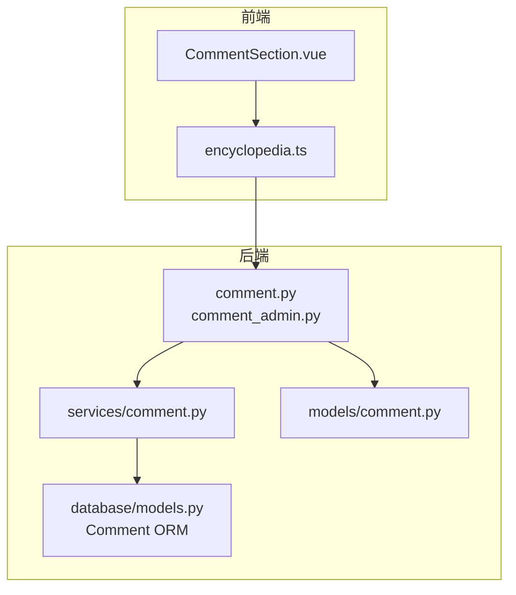
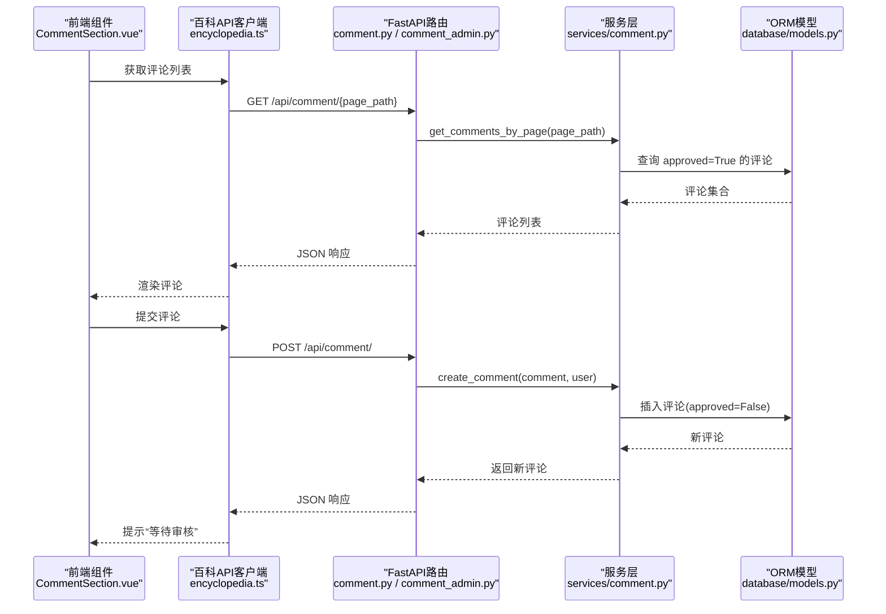
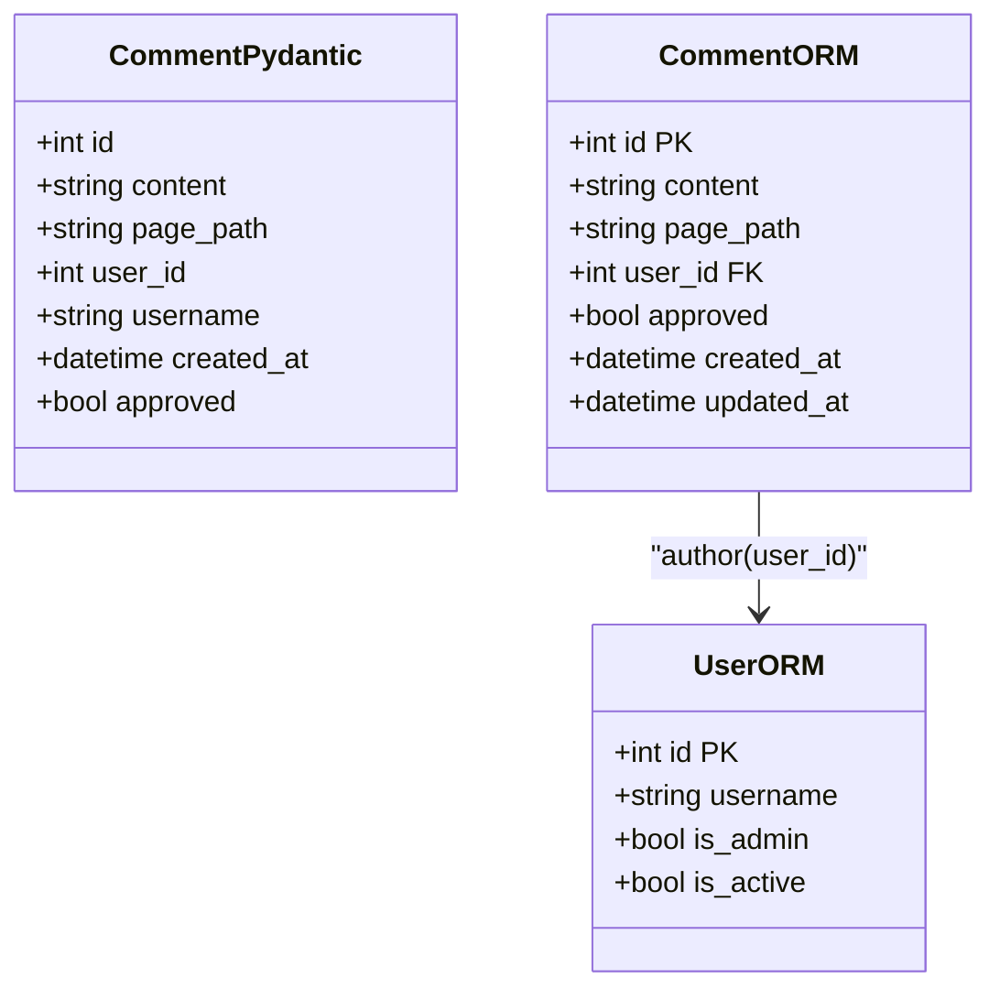
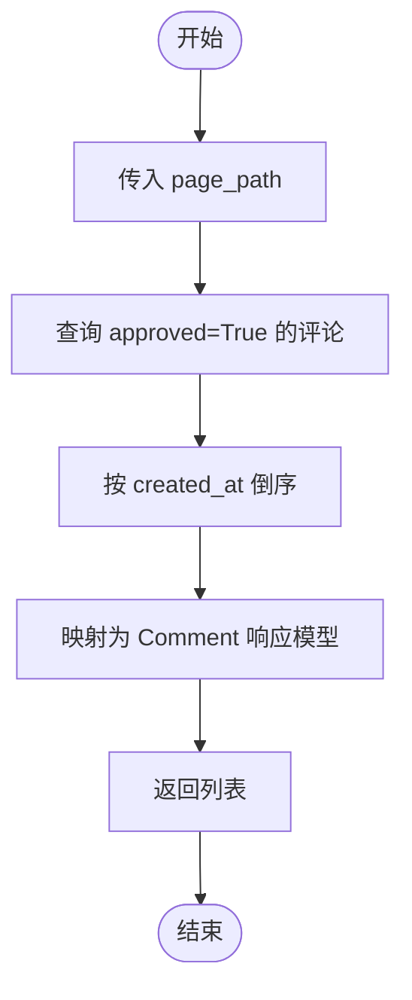
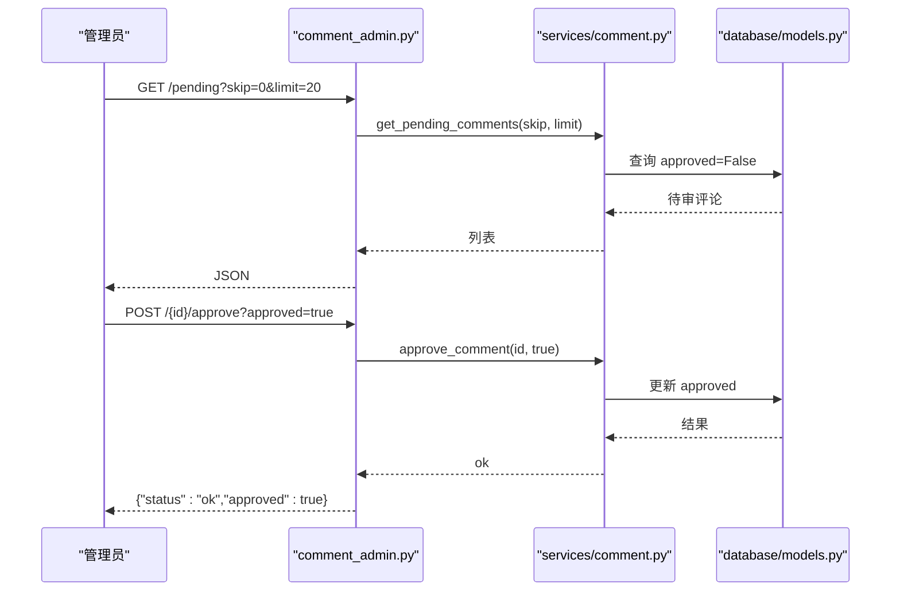
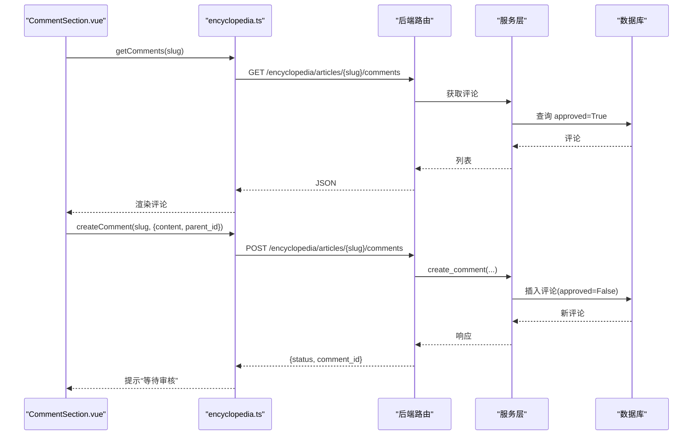
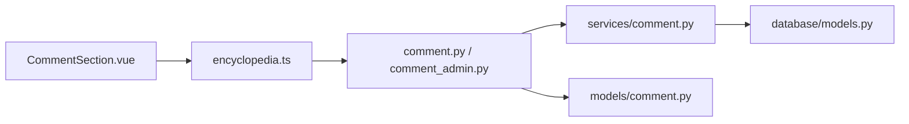

# 评论互动系统

<cite>
**本文引用的文件**
- [web/backend/api/comment.py](file://web/backend/api/comment.py)
- [web/backend/api/comment_admin.py](file://web/backend/api/comment_admin.py)
- [web/backend/services/comment.py](file://web/backend/services/comment.py)
- [web/backend/models/comment.py](file://web/backend/models/comment.py)
- [web/backend/database/models.py](file://web/backend/database/models.py)
- [web/app/src/components/encyclopedia/CommentSection.vue](file://web/app/src/components/encyclopedia/CommentSection.vue)
- [web/app/src/api/encyclopedia.ts](file://web/app/src/api/encyclopedia.ts)
- [tests/backend/api/test_comment.py](file://tests/backend/api/test_comment.py)
- [tests/backend/services/test_comment.py](file://tests/backend/services/test_comment.py)
</cite>

## 目录
1. [简介](#简介)
2. [项目结构](#项目结构)
3. [核心组件](#核心组件)
4. [架构总览](#架构总览)
5. [详细组件分析](#详细组件分析)
6. [依赖关系分析](#依赖关系分析)
7. [性能考虑](#性能考虑)
8. [故障排查指南](#故障排查指南)
9. [结论](#结论)
10. [附录](#附录)

## 简介
本技术文档围绕“评论互动系统”的完整实现展开，涵盖评论创建、列表获取、管理员审核、前端展示与交互等关键流程。当前代码库实现了基于页面路径的评论能力，支持已批准评论的按时间倒序展示，以及管理员对未审核评论的查看与审批。文档同时给出数据结构设计、权限控制、错误处理、测试覆盖与扩展建议（如嵌套回复、点赞、搜索排序分页、实时通知等）的系统化说明。

## 项目结构
评论功能在后端采用 FastAPI 路由 + 服务层 + ORM 模型的分层组织；前端通过 Vue 组件调用百科模块的 API 客户端进行评论加载与提交。

图表来源
- [web/app/src/components/encyclopedia/CommentSection.vue:1-154](file://web/app/src/components/encyclopedia/CommentSection.vue#L1-L154)
- [web/app/src/api/encyclopedia.ts:121-132](file://web/app/src/api/encyclopedia.ts#L121-L132)
- [web/backend/api/comment.py:1-33](file://web/backend/api/comment.py#L1-L33)
- [web/backend/api/comment_admin.py:1-63](file://web/backend/api/comment_admin.py#L1-L63)
- [web/backend/services/comment.py:1-83](file://web/backend/services/comment.py#L1-L83)
- [web/backend/models/comment.py:1-27](file://web/backend/models/comment.py#L1-L27)
- [web/backend/database/models.py:239-253](file://web/backend/database/models.py#L239-L253)

章节来源
- [web/backend/api/comment.py:1-33](file://web/backend/api/comment.py#L1-L33)
- [web/backend/api/comment_admin.py:1-63](file://web/backend/api/comment_admin.py#L1-L63)
- [web/backend/services/comment.py:1-83](file://web/backend/services/comment.py#L1-L83)
- [web/backend/models/comment.py:1-27](file://web/backend/models/comment.py#L1-L27)
- [web/backend/database/models.py:239-253](file://web/backend/database/models.py#L239-L253)
- [web/app/src/components/encyclopedia/CommentSection.vue:1-154](file://web/app/src/components/encyclopedia/CommentSection.vue#L1-L154)
- [web/app/src/api/encyclopedia.ts:121-132](file://web/app/src/api/encyclopedia.ts#L121-L132)

## 核心组件
- 数据模型
  - Pydantic 模型：CommentBase、CommentCreate、Comment，用于请求体校验与响应序列化。
  - ORM 模型：数据库表 comments，包含 content、page_path、user_id、approved、created_at、updated_at 等字段，并关联用户。
- API 路由
  - 普通接口：GET /{page_path} 获取某页面已批准评论；POST / 创建评论（需登录）。
  - 管理接口：GET /pending 获取待审评论（仅管理员）；POST /{comment_id}/approve 批准/拒绝评论（仅管理员）。
- 服务层
  - get_comments_by_page：按 page_path 过滤且仅返回 approved=True 的评论，按创建时间倒序。
  - create_comment：创建新评论，默认 approved=False（需要审核）。
  - get_pending_comments：分页获取未审核评论。
  - approve_comment：更新评论审核状态。
- 前端组件
  - CommentSection.vue：加载评论、提交评论、回复入口、空态与加载态展示。
  - encyclopedia.ts：封装评论相关 API 调用（获取与创建）。

章节来源
- [web/backend/models/comment.py:1-27](file://web/backend/models/comment.py#L1-L27)
- [web/backend/database/models.py:239-253](file://web/backend/database/models.py#L239-L253)
- [web/backend/api/comment.py:1-33](file://web/backend/api/comment.py#L1-L33)
- [web/backend/api/comment_admin.py:1-63](file://web/backend/api/comment_admin.py#L1-L63)
- [web/backend/services/comment.py:1-83](file://web/backend/services/comment.py#L1-L83)
- [web/app/src/components/encyclopedia/CommentSection.vue:1-154](file://web/app/src/components/encyclopedia/CommentSection.vue#L1-L154)
- [web/app/src/api/encyclopedia.ts:121-132](file://web/app/src/api/encyclopedia.ts#L121-L132)

## 架构总览
评论系统的请求链路如下：前端组件调用百科 API 客户端，后端路由接收请求后交由服务层处理，服务层通过 ORM 访问数据库完成读写操作。管理员接口受权限保护，仅允许管理员执行审核操作。

图表来源
- [web/app/src/components/encyclopedia/CommentSection.vue:19-55](file://web/app/src/components/encyclopedia/CommentSection.vue#L19-L55)
- [web/app/src/api/encyclopedia.ts:121-132](file://web/app/src/api/encyclopedia.ts#L121-L132)
- [web/backend/api/comment.py:19-32](file://web/backend/api/comment.py#L19-L32)
- [web/backend/services/comment.py:14-60](file://web/backend/services/comment.py#L14-L60)
- [web/backend/database/models.py:239-253](file://web/backend/database/models.py#L239-L253)

## 详细组件分析

### 数据模型与关系
- Pydantic 模型
  - CommentBase：定义 content、page_path。
  - CommentCreate：继承基础字段，用于创建评论的请求体。
  - Comment：包含 id、user_id、username、created_at、approved 等字段，用于响应序列化。
- ORM 模型
  - comments 表：content、page_path、user_id、approved、created_at、updated_at，并与 users 表建立外键关系。
  - 用户模型 users：包含 is_admin、is_active 等权限相关字段，供鉴权与权限判断使用。

图表来源
- [web/backend/models/comment.py:9-26](file://web/backend/models/comment.py#L9-L26)
- [web/backend/database/models.py:88-138](file://web/backend/database/models.py#L88-L138)
- [web/backend/database/models.py:239-253](file://web/backend/database/models.py#L239-L253)

章节来源
- [web/backend/models/comment.py:1-27](file://web/backend/models/comment.py#L1-L27)
- [web/backend/database/models.py:88-138](file://web/backend/database/models.py#L88-L138)
- [web/backend/database/models.py:239-253](file://web/backend/database/models.py#L239-L253)

### 评论列表与创建流程
- 列表获取
  - 路由：GET /{page_path}
  - 服务：get_comments_by_page 按 page_path 过滤且仅返回 approved=True 的评论，按 created_at 降序排列。
- 创建评论
  - 路由：POST /
  - 服务：create_comment 创建新评论，默认 approved=False（需要审核），并返回包含用户名等信息的响应。

图表来源
- [web/backend/services/comment.py:14-37](file://web/backend/services/comment.py#L14-L37)
- [web/backend/api/comment.py:19-22](file://web/backend/api/comment.py#L19-L22)

章节来源
- [web/backend/services/comment.py:14-37](file://web/backend/services/comment.py#L14-L37)
- [web/backend/api/comment.py:19-22](file://web/backend/api/comment.py#L19-L22)

### 管理员审核流程
- 待审列表
  - 路由：GET /pending（需管理员）
  - 服务：get_pending_comments 返回 approved=False 的评论，支持 skip/limit 分页。
- 批准/拒绝
  - 路由：POST /{comment_id}/approve（需管理员）
  - 服务：approve_comment 更新评论的 approved 状态。

图表来源
- [web/backend/api/comment_admin.py:18-62](file://web/backend/api/comment_admin.py#L18-L62)
- [web/backend/services/comment.py:63-82](file://web/backend/services/comment.py#L63-L82)
- [web/backend/database/models.py:239-253](file://web/backend/database/models.py#L239-L253)

章节来源
- [web/backend/api/comment_admin.py:18-62](file://web/backend/api/comment_admin.py#L18-L62)
- [web/backend/services/comment.py:63-82](file://web/backend/services/comment.py#L63-L82)

### 前端交互组件
- 加载评论
  - 组件 CommentSection.vue 在挂载时调用 getComments(slug)，失败时显示错误提示。
- 提交评论
  - 登录后才能提交；提交成功后提示“等待审核”，并刷新列表。
- 回复入口
  - 提供 startReply/cancelReply 切换回复模式，并将 parent_id 传递给后端（当前前端调用百科 API，实际后端路由尚未实现 parent_id 参数）。

图表来源
- [web/app/src/components/encyclopedia/CommentSection.vue:19-55](file://web/app/src/components/encyclopedia/CommentSection.vue#L19-L55)
- [web/app/src/api/encyclopedia.ts:121-132](file://web/app/src/api/encyclopedia.ts#L121-L132)
- [web/backend/services/comment.py:40-60](file://web/backend/services/comment.py#L40-L60)

章节来源
- [web/app/src/components/encyclopedia/CommentSection.vue:1-154](file://web/app/src/components/encyclopedia/CommentSection.vue#L1-L154)
- [web/app/src/api/encyclopedia.ts:121-132](file://web/app/src/api/encyclopedia.ts#L121-L132)
- [web/backend/services/comment.py:40-60](file://web/backend/services/comment.py#L40-L60)

### 权限控制与匿名评论
- 权限控制
  - 创建评论：需要登录（auth 依赖），未认证返回 401。
  - 管理员接口：list_pending 与 approve 均检查 current_user.is_admin，非管理员返回 403。
- 匿名评论
  - 当前 ORM 中 user_id 为非空，因此不支持完全匿名评论；若需匿名，可引入可选 user_id 或匿名用户标识。

章节来源
- [web/backend/api/comment.py:25-32](file://web/backend/api/comment.py#L25-L32)
- [web/backend/api/comment_admin.py:18-62](file://web/backend/api/comment_admin.py#L18-L62)
- [web/backend/database/models.py:239-253](file://web/backend/database/models.py#L239-L253)

### 评论内容审核机制与质量评估
- 审核机制
  - 新评论默认 approved=False，需管理员审核后才能在列表中可见。
  - 列表接口仅返回 approved=True 的评论。
- 敏感词过滤与行为限制
  - 当前代码未实现内容审核与敏感词过滤；可在服务层 create_comment 前增加内容校验与风险评分。
  - 可结合用户违规计数（users.violation_count、warning_count）实施限流或封禁策略。

章节来源
- [web/backend/services/comment.py:40-60](file://web/backend/services/comment.py#L40-L60)
- [web/backend/services/comment.py:14-37](file://web/backend/services/comment.py#L14-L37)
- [web/backend/database/models.py:88-138](file://web/backend/database/models.py#L88-L138)

### 嵌套评论支持与树形展示
- 当前实现
  - 前端 CommentSection.vue 预留了 replies 渲染逻辑与 parent_id 传递；但后端路由与服务层尚未实现 parent_id 与嵌套查询。
- 建议方案
  - 在 ORM 中为 Comment 添加 parent_id 自引用外键，构建评论树。
  - 在服务层实现递归或层级聚合，返回树形结构给前端。

章节来源
- [web/app/src/components/encyclopedia/CommentSection.vue:126-149](file://web/app/src/components/encyclopedia/CommentSection.vue#L126-L149)
- [web/app/src/api/encyclopedia.ts:126-132](file://web/app/src/api/encyclopedia.ts#L126-L132)
- [web/backend/database/models.py:239-253](file://web/backend/database/models.py#L239-L253)

### 点赞、删除、搜索、排序、分页与实时通知
- 点赞/删除
  - 当前未实现评论点赞与删除接口；可在服务层与路由层新增相应方法，并结合用户权限与防刷策略。
- 搜索/排序/分页
  - 列表接口未提供搜索与分页；可按内容模糊匹配、时间范围、热度等维度扩展查询条件，并加入 skip/limit 分页。
- 实时通知
  - 当前未实现 WebSocket 推送；可引入事件通道（如 Redis Pub/Sub）在审核通过后向订阅者推送新评论通知。

[本节为通用扩展建议，不直接分析具体文件]

## 依赖关系分析
- 路由依赖
  - comment.py 依赖 services/comment.py 与 models/comment.py，并通过 auth 依赖进行鉴权。
  - comment_admin.py 依赖 services/comment.py 与 auth 依赖进行管理员权限校验。
- 服务依赖
  - services/comment.py 依赖 database/models.py 中的 ORM 模型进行数据访问。
- 前端依赖
  - CommentSection.vue 依赖 encyclopedia.ts 提供的 API 客户端函数。

图表来源
- [web/app/src/components/encyclopedia/CommentSection.vue:1-154](file://web/app/src/components/encyclopedia/CommentSection.vue#L1-L154)
- [web/app/src/api/encyclopedia.ts:121-132](file://web/app/src/api/encyclopedia.ts#L121-L132)
- [web/backend/api/comment.py:1-33](file://web/backend/api/comment.py#L1-L33)
- [web/backend/api/comment_admin.py:1-63](file://web/backend/api/comment_admin.py#L1-L63)
- [web/backend/services/comment.py:1-83](file://web/backend/services/comment.py#L1-L83)
- [web/backend/models/comment.py:1-27](file://web/backend/models/comment.py#L1-L27)
- [web/backend/database/models.py:239-253](file://web/backend/database/models.py#L239-L253)

章节来源
- [web/backend/api/comment.py:1-33](file://web/backend/api/comment.py#L1-L33)
- [web/backend/api/comment_admin.py:1-63](file://web/backend/api/comment_admin.py#L1-L63)
- [web/backend/services/comment.py:1-83](file://web/backend/services/comment.py#L1-L83)
- [web/backend/models/comment.py:1-27](file://web/backend/models/comment.py#L1-L27)
- [web/backend/database/models.py:239-253](file://web/backend/database/models.py#L239-L253)
- [web/app/src/components/encyclopedia/CommentSection.vue:1-154](file://web/app/src/components/encyclopedia/CommentSection.vue#L1-L154)
- [web/app/src/api/encyclopedia.ts:121-132](file://web/app/src/api/encyclopedia.ts#L121-L132)

## 性能考虑
- 查询优化
  - 列表查询已按 created_at 倒序，建议在 page_path 上建立索引以加速过滤。
  - 管理员待审列表已支持 skip/limit，确保在大体量下分页稳定。
- 缓存策略
  - 可对热门页面的评论列表进行短期缓存（如 Redis），减少重复查询。
- 并发与一致性
  - 创建评论时使用事务提交，避免部分写入；未来可增加乐观锁防止重复提交。
- 前端体验
  - 列表加载时显示占位与错误提示；提交后即时反馈“等待审核”，提升用户体验。

[本节为通用性能建议，不直接分析具体文件]

## 故障排查指南
- 常见错误
  - 未登录创建评论：返回 401。
  - 缺少必填字段：返回 422。
  - 非管理员访问管理接口：返回 403。
  - 评论不存在：返回 404。
- 定位方法
  - 检查路由参数与请求体是否符合模型定义。
  - 确认数据库连接与 ORM 模型是否正确初始化。
  - 查看测试用例以复现问题场景。

章节来源
- [tests/backend/api/test_comment.py:84-145](file://tests/backend/api/test_comment.py#L84-L145)
- [web/backend/api/comment_admin.py:47-62](file://web/backend/api/comment_admin.py#L47-L62)

## 结论
当前评论系统实现了基础的评论创建、列表获取与管理审核流程，具备清晰的权限控制与良好的分层结构。后续可扩展嵌套回复、点赞、搜索排序分页、内容审核与实时通知等功能，以提升社区互动体验与内容质量。

[本节为总结性内容，不直接分析具体文件]

## 附录
- API 接口规范（摘要）
  - 获取评论列表：GET /api/comment/{page_path}
    - 响应：评论数组（仅 approved=True）
  - 创建评论：POST /api/comment/
    - 请求体：{ content, page_path }
    - 响应：新评论（approved=False）
  - 获取待审评论：GET /api/comment/pending?skip=0&limit=20
    - 权限：管理员
  - 批准/拒绝评论：POST /api/comment/{comment_id}/approve?approved=true|false
    - 权限：管理员
- 前端调用示例（路径）
  - 获取评论：encyclopedia.ts -> getComments(slug)
  - 创建评论：encyclopedia.ts -> createComment(slug, body)
- 测试覆盖要点
  - 列表仅返回已批准评论
  - 创建评论默认待审
  - 管理员权限校验
  - 分页与排序验证

章节来源
- [web/backend/api/comment.py:19-32](file://web/backend/api/comment.py#L19-L32)
- [web/backend/api/comment_admin.py:18-62](file://web/backend/api/comment_admin.py#L18-L62)
- [web/app/src/api/encyclopedia.ts:121-132](file://web/app/src/api/encyclopedia.ts#L121-L132)
- [tests/backend/api/test_comment.py:10-145](file://tests/backend/api/test_comment.py#L10-L145)
- [tests/backend/services/test_comment.py:19-226](file://tests/backend/services/test_comment.py#L19-L226)