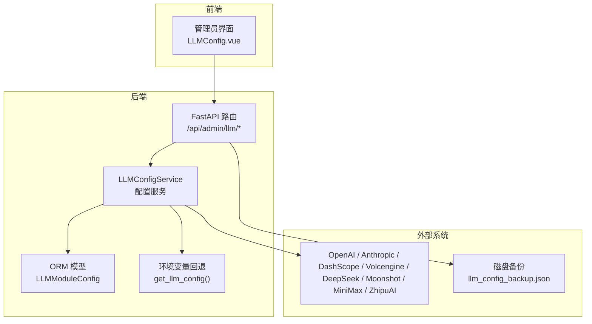
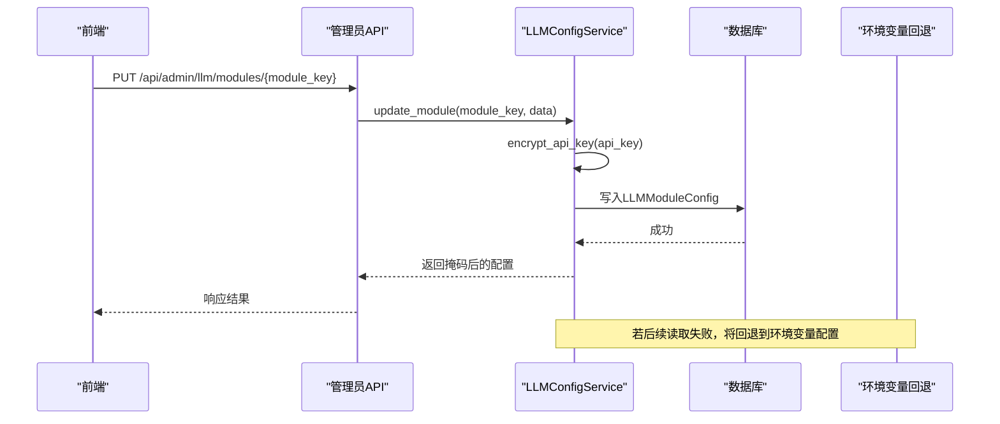
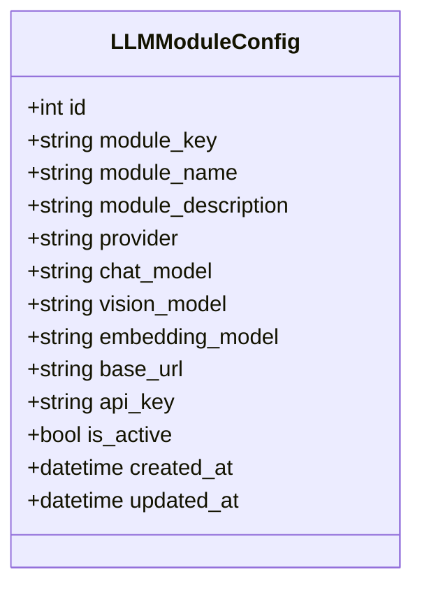
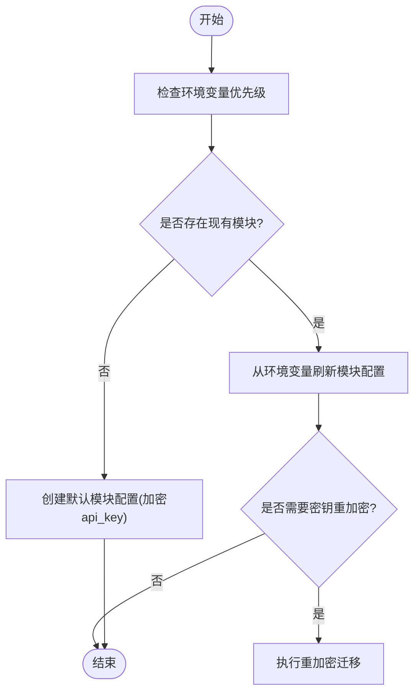
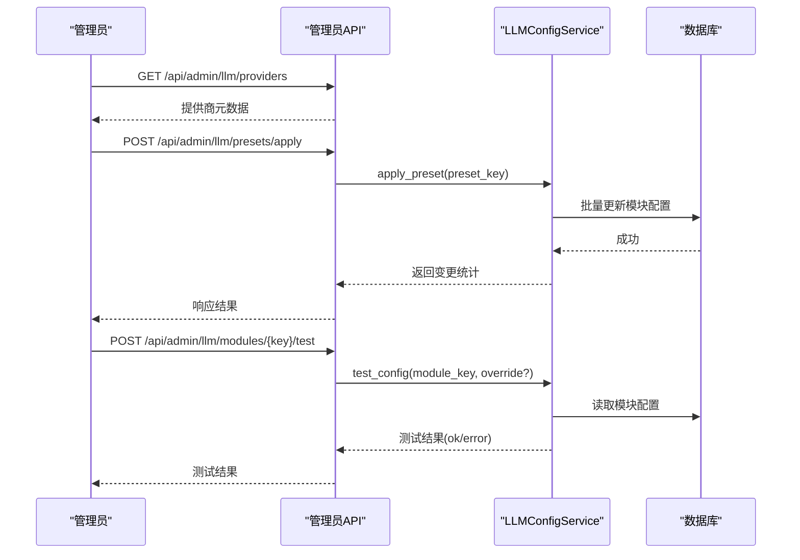
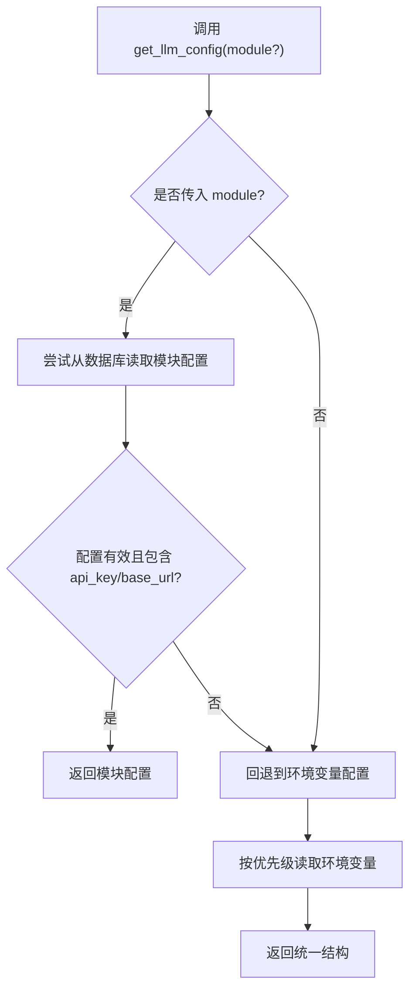
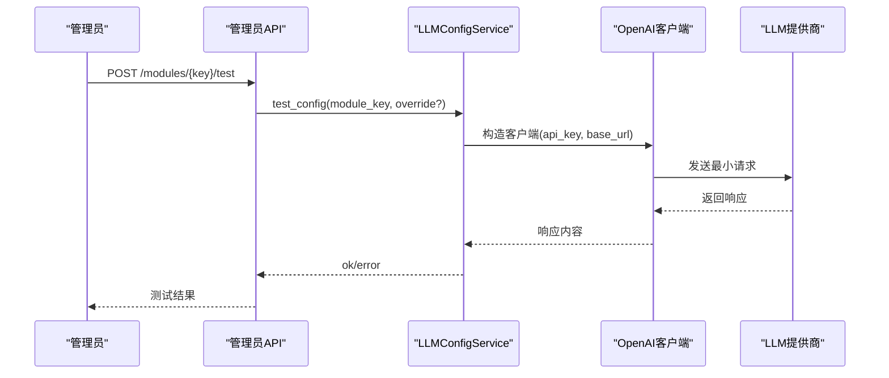
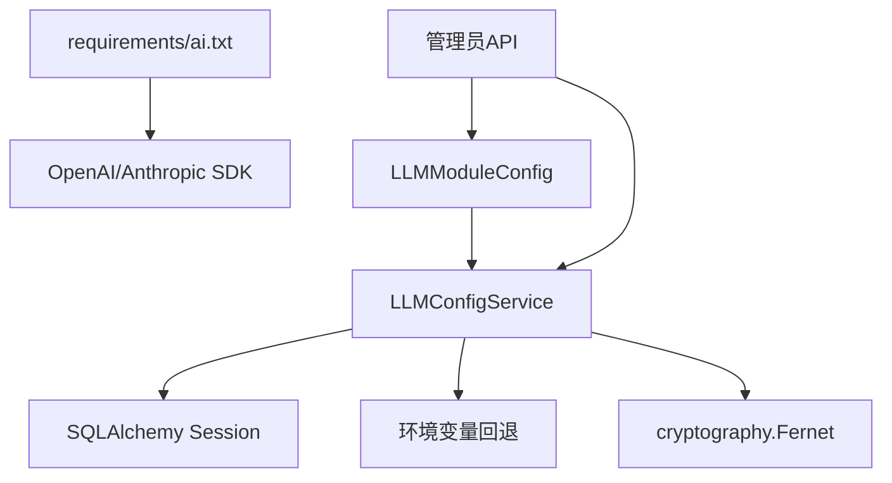

# LLM配置管理

<cite>
**本文引用的文件**   
- [llm_config_service.py](file://web/backend/services/llm_config_service.py)
- [llm_config_admin.py](file://web/backend/api/llm_config_admin.py)
- [llm_config.py](file://web/backend/utils/llm_config.py)
- [models.py](file://web/backend/database/models.py)
- [web_config.yaml](file://configs/web_config.yaml)
- [ai.txt](file://requirements/ai.txt)
- [im_moderation.py](file://web/backend/services/im_moderation.py)
- [llm_config_backup.json](file://data/llm_config_backup.json)
</cite>

## 目录
1. [简介](#简介)
2. [项目结构](#项目结构)
3. [核心组件](#核心组件)
4. [架构总览](#架构总览)
5. [详细组件分析](#详细组件分析)
6. [依赖关系分析](#依赖关系分析)
7. [性能与配额控制](#性能与配额控制)
8. [故障排查指南](#故障排查指南)
9. [结论](#结论)
10. [附录](#附录)

## 简介
本技术文档围绕 Subskin 的大语言模型（LLM）配置管理能力，系统性阐述多提供商集成、API Key 安全存储、模型参数调优、请求配额与成本优化策略。重点覆盖 OpenAI、Anthropic、DashScope（百炼）、火山引擎、DeepSeek、Moonshot、MiniMax、智谱 AI 等主流服务；并提供模块级配置、预设模板、备份恢复、A/B 测试思路与监控建议，帮助团队在生产环境中稳定、安全、低成本地运行多种 LLM 能力。

## 项目结构
Subskin 的 LLM 配置管理由“数据库模型 + 服务层 + 管理员 API + 环境变量回退”四层构成：
- 数据库模型：定义模块配置表，持久化 provider、模型名、base_url、加密后的 api_key 等。
- 服务层：提供增删改查、默认初始化、从环境变量刷新、密钥重加密迁移、配置测试等能力。
- 管理员 API：暴露 REST 接口，支持模块配置查看/更新、提供商列表、预设应用、备份/恢复、配置测试等。
- 环境变量回退：当模块未配置或不可用时，按优先级读取环境变量并回退到默认值。

图表来源
- [llm_config_admin.py:115-220](file://web/backend/api/llm_config_admin.py#L115-L220)
- [llm_config_service.py:215-341](file://web/backend/services/llm_config_service.py#L215-L341)
- [llm_config.py:111-136](file://web/backend/utils/llm_config.py#L111-L136)
- [models.py:1008-1026](file://web/backend/database/models.py#L1008-L1026)

章节来源
- [llm_config_admin.py:115-220](file://web/backend/api/llm_config_admin.py#L115-L220)
- [llm_config_service.py:215-341](file://web/backend/services/llm_config_service.py#L215-L341)
- [llm_config.py:111-136](file://web/backend/utils/llm_config.py#L111-L136)
- [models.py:1008-1026](file://web/backend/database/models.py#L1008-L1026)

## 核心组件
- 数据库模型 LLMModuleConfig：存储模块键、名称、描述、provider、chat/vision/embedding 模型、base_url、加密后的 api_key、是否激活及时间戳。
- 服务层 LLMConfigService：实现模块配置的 CRUD、默认初始化、环境变量刷新、密钥重加密迁移、配置连通性测试。
- 管理员 API：提供模块列表/详情/更新、提供商枚举、预设应用/预览/单模块应用、备份/恢复、配置测试等接口。
- 环境变量回退 get_llm_config：按 provider 优先级（DashScope > Volcengine > DeepSeek/Moonshot/MiniMax/ZhipuAI > OpenAI）读取环境变量，返回统一配置结构。

章节来源
- [models.py:1008-1026](file://web/backend/database/models.py#L1008-L1026)
- [llm_config_service.py:215-341](file://web/backend/services/llm_config_service.py#L215-L341)
- [llm_config_admin.py:115-220](file://web/backend/api/llm_config_admin.py#L115-L220)
- [llm_config.py:111-136](file://web/backend/utils/llm_config.py#L111-L136)

## 架构总览
下图展示一次“管理员更新模块配置”的调用链：前端通过 FastAPI 路由进入服务层，服务层对敏感字段进行加密后写入数据库，并在响应中掩码返回。

图表来源
- [llm_config_admin.py:140-158](file://web/backend/api/llm_config_admin.py#L140-L158)
- [llm_config_service.py:227-247](file://web/backend/services/llm_config_service.py#L227-L247)
- [llm_config.py:111-136](file://web/backend/utils/llm_config.py#L111-L136)

## 详细组件分析

### 数据库模型：LLMModuleConfig
- 字段说明：module_key（唯一标识）、provider（供应商）、chat_model/vision_model/embedding_model（模型名）、base_url（端点）、api_key（Fernet 加密）、is_active（是否启用）、created_at/updated_at（时间戳）。
- 设计要点：
  - 模块级隔离：每个业务模块可独立选择 provider 和模型，便于 A/B 测试与灰度切换。
  - 安全存储：api_key 使用 Fernet 对称加密，避免明文落库。
  - 灵活扩展：新增 provider 只需在 RECOMMENDED_PROVIDERS 中补充元数据。

图表来源
- [models.py:1008-1026](file://web/backend/database/models.py#L1008-L1026)

章节来源
- [models.py:1008-1026](file://web/backend/database/models.py#L1008-L1026)

### 服务层：LLMConfigService
- 功能概览：
  - 初始化默认模块：根据环境变量优先级自动创建默认配置。
  - 刷新环境变量：将当前环境变量同步至所有模块配置。
  - 密钥重加密：启动时扫描存量数据，修复旧默认密钥或明文存储，处理双重加密问题。
  - 配置测试：构造 OpenAI 客户端发起最小请求验证连通性与鉴权。
- 关键流程：
  - 更新模块：仅允许白名单字段，api_key 必须加密。
  - 获取配置：优先返回模块配置，缺失则回退环境变量。
  - 备份/恢复：备份文件存密文，接口响应一律掩码。

图表来源
- [llm_config_service.py:272-341](file://web/backend/services/llm_config_service.py#L272-L341)
- [llm_config_service.py:342-393](file://web/backend/services/llm_config_service.py#L342-L393)
- [llm_config_service.py:395-469](file://web/backend/services/llm_config_service.py#L395-L469)

章节来源
- [llm_config_service.py:215-341](file://web/backend/services/llm_config_service.py#L215-L341)
- [llm_config_service.py:342-393](file://web/backend/services/llm_config_service.py#L342-L393)
- [llm_config_service.py:395-469](file://web/backend/services/llm_config_service.py#L395-L469)

### 管理员 API：/api/admin/llm/*
- 主要接口：
  - 模块列表/详情/更新：受管理员权限保护，返回掩码后的 api_key。
  - 提供商枚举：返回内置支持的 provider 元数据（名称、模型列表、base_url）。
  - 预设应用/预览/单模块应用：快速批量切换 provider 与模型组合。
  - 备份/恢复：备份文件包含密文字段，接口响应一律掩码。
  - 配置测试：支持覆盖 provider/chat_model/base_url 进行临时测试。
- 安全策略：
  - 所有接口需管理员认证。
  - 接口不返回明文 api_key，统一掩码。
  - 备份文件仅存密文，恢复时兼容旧明文但过滤掩码值。

图表来源
- [llm_config_admin.py:185-220](file://web/backend/api/llm_config_admin.py#L185-L220)
- [llm_config_admin.py:426-458](file://web/backend/api/llm_config_admin.py#L426-L458)
- [llm_config_admin.py:161-183](file://web/backend/api/llm_config_admin.py#L161-L183)
- [llm_config_service.py:471-516](file://web/backend/services/llm_config_service.py#L471-L516)

章节来源
- [llm_config_admin.py:115-220](file://web/backend/api/llm_config_admin.py#L115-L220)
- [llm_config_admin.py:426-458](file://web/backend/api/llm_config_admin.py#L426-L458)
- [llm_config_admin.py:161-183](file://web/backend/api/llm_config_admin.py#L161-L183)

### 环境变量回退：get_llm_config
- 优先级顺序：DashScope > Volcengine > DeepSeek > Moonshot > MiniMax > ZhipuAI > OpenAI > none。
- 返回值结构：包含 api_key、base_url、chat_model、vision_model、embedding_model、embedding_dimensions、provider。
- 使用场景：当模块未配置或未激活时，自动回退到环境变量配置，保证服务可用性。

图表来源
- [llm_config.py:111-136](file://web/backend/utils/llm_config.py#L111-L136)
- [llm_config.py:8-108](file://web/backend/utils/llm_config.py#L8-L108)

章节来源
- [llm_config.py:111-136](file://web/backend/utils/llm_config.py#L111-L136)
- [llm_config.py:8-108](file://web/backend/utils/llm_config.py#L8-L108)

### 提供商支持与推荐配置
- 内置 RECOMMENDED_PROVIDERS：涵盖 DashScope、Volcengine、DeepSeek、Moonshot、MiniMax、ZhipuAI、OpenAI、Anthropic 等，提供各 provider 的 chat/vision/embedding 模型列表与 base_url。
- 预设模板：actual/recommended/economy/performance，支持一键批量切换 provider 与模型组合，满足不同场景的成本与性能需求。

章节来源
- [llm_config_service.py:21-129](file://web/backend/services/llm_config_service.py#L21-L129)
- [llm_config_admin.py:338-396](file://web/backend/api/llm_config_admin.py#L338-L396)

### 配置测试与连通性校验
- 测试逻辑：构造 OpenAI 客户端，发送最小消息请求，验证鉴权与连通性。
- 适用场景：管理员在修改配置后可立即验证生效情况；也可用于预设应用的单模块测试。

图表来源
- [llm_config_service.py:471-516](file://web/backend/services/llm_config_service.py#L471-L516)
- [llm_config_admin.py:161-183](file://web/backend/api/llm_config_admin.py#L161-L183)

章节来源
- [llm_config_service.py:471-516](file://web/backend/services/llm_config_service.py#L471-L516)

### 备份与恢复
- 备份：导出所有模块配置，api_key 以密文字段存储，接口响应返回掩码。
- 恢复：优先从密文字段解密，兼容旧明文备份，跳过掩码值避免污染配置。
- 用途：环境迁移、灾难恢复、配置审计。

章节来源
- [llm_config_admin.py:231-291](file://web/backend/api/llm_config_admin.py#L231-L291)
- [llm_config_admin.py:299-335](file://web/backend/api/llm_config_admin.py#L299-L335)
- [llm_config_backup.json:1-149](file://data/llm_config_backup.json#L1-L149)

## 依赖关系分析
- 运行时依赖：openai、anthropic 等 SDK 由 requirements/ai.txt 管理。
- 配置来源：数据库模型 + 环境变量回退，确保高可用。
- 安全依赖：cryptography.Fernet 用于对称加密，密钥来自环境变量 LLM_ENCRYPTION_KEY。

图表来源
- [ai.txt:1-37](file://requirements/ai.txt#L1-L37)
- [llm_config_service.py:13-19](file://web/backend/services/llm_config_service.py#L13-L19)
- [llm_config_service.py:215-247](file://web/backend/services/llm_config_service.py#L215-L247)

章节来源
- [ai.txt:1-37](file://requirements/ai.txt#L1-L37)
- [llm_config_service.py:13-19](file://web/backend/services/llm_config_service.py#L13-L19)

## 性能与配额控制
- 速率限制：项目内提供线程安全的令牌桶限流器（RateLimiter），可按需为 LLM 调用添加限流，防止突发流量导致配额超限。
- 超时与重试：配置测试与调用应设置合理超时（如 15s），并结合指数退避重试策略提升鲁棒性。
- 缓存策略：对昂贵调用（如嵌入向量生成）可使用 Redis/DiskCache 缓存结果，降低重复请求成本。
- 成本优化：
  - 使用经济型预设（economy）与非关键任务降级。
  - 按模块选择性价比更高的 provider（如 DeepSeek 用于文本任务，DashScope 用于视觉任务）。
  - 合理设置 max_tokens、temperature，减少无效输出。

章节来源
- [rate_limiter.py:1-46](file://src/utils/rate_limiter.py#L1-L46)
- [llm_config_service.py:499-505](file://web/backend/services/llm_config_service.py#L499-L505)
- [ai.txt:35-37](file://requirements/ai.txt#L35-L37)

## 故障排查指南
- 常见问题定位：
  - API Key 未配置：测试接口返回错误提示，检查模块配置或环境变量。
  - 鉴权失败（401）：确认 base_url 与 api_key 匹配，检查是否双重加密导致解析异常。
  - 连接超时：检查网络可达性与 provider 端点是否正确。
  - 环境变量优先级：确认模块是否已激活，否则将回退到环境变量。
- 日志与告警：
  - 服务层记录加密失败、刷新失败、重加密迁移等关键事件。
  - 管理员 API 在权限不足或参数非法时返回明确状态码与错误信息。
- 恢复步骤：
  - 使用备份恢复接口还原配置。
  - 执行密钥重加密迁移修复历史数据。
  - 通过预设预览对比差异，谨慎应用。

章节来源
- [llm_config_service.py:183-213](file://web/backend/services/llm_config_service.py#L183-L213)
- [llm_config_service.py:395-469](file://web/backend/services/llm_config_service.py#L395-L469)
- [llm_config_admin.py:115-158](file://web/backend/api/llm_config_admin.py#L115-L158)

## 结论
Subskin 的 LLM 配置管理以模块化为核心，结合数据库持久化、环境变量回退、管理员 API 与预设模板，实现了多提供商的统一接入与安全管控。通过 Fernet 加密、掩码输出、备份恢复与密钥迁移机制，保障了敏感配置的安全性。配合限流、缓存、超时与成本优化策略，可在生产环境中稳定、高效、低成本地运行多种 LLM 能力。建议团队基于模块维度开展 A/B 测试与灰度发布，持续监控性能与成本，动态调整 provider 与模型组合。

## 附录
- 环境变量参考：
  - OPENAI_API_KEY、OPENAI_BASE_URL、LLM_MODEL、OPENAI_VISION_MODEL、EMBEDDING_MODEL
  - DASHSCOPE_API_KEY、DASHSCOPE_BASE_URL、DASHSCOPE_CHAT_MODEL、DASHSCOPE_VISION_MODEL、DASHSCOPE_EMBEDDING_MODEL、DASHSCOPE_EMBEDDING_DIMENSIONS
  - VOLCENGINE_API_KEY、VOLCENGINE_BASE_URL、VOLCENGINE_CHAT_ENDPOINT、VOLCENGINE_VISION_MODEL、VOLCENGINE_EMBEDDING_ENDPOINT
  - DEEPSEEK_API_KEY、MOONSHOT_API_KEY、MINIMAX_API_KEY、ZHIPU_API_KEY
  - LLM_ENCRYPTION_KEY（或 LLM_CONFIG_ENCRYPTION_KEY）
- 配置文件参考：
  - configs/web_config.yaml 中的 llm 段落，提供 OpenAI/Anthropic/local 示例与 RAG/Prompt 模板。

章节来源
- [llm_config.py:8-108](file://web/backend/utils/llm_config.py#L8-L108)
- [web_config.yaml:80-134](file://configs/web_config.yaml#L80-L134)