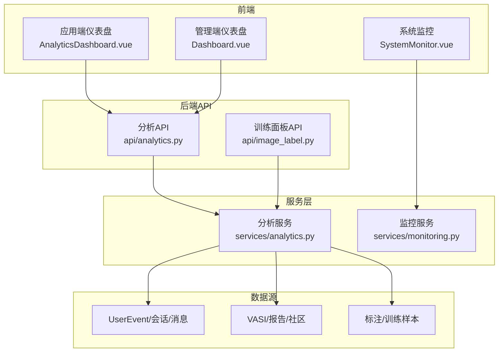
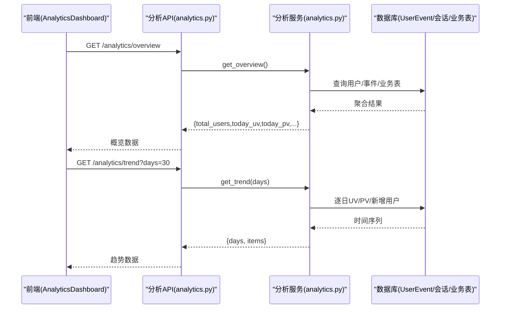
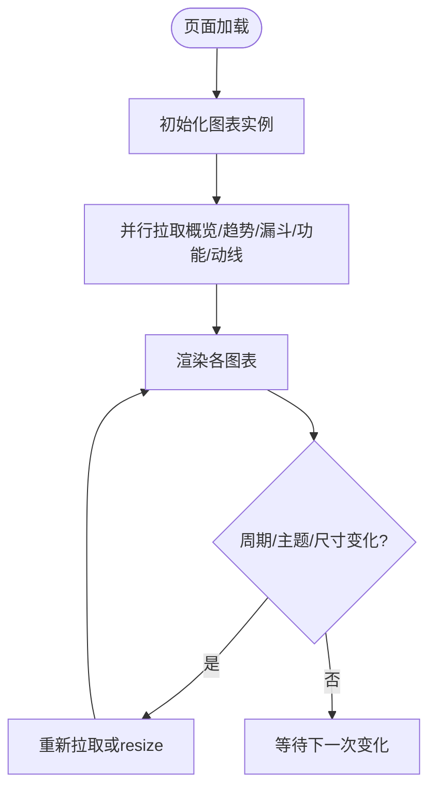
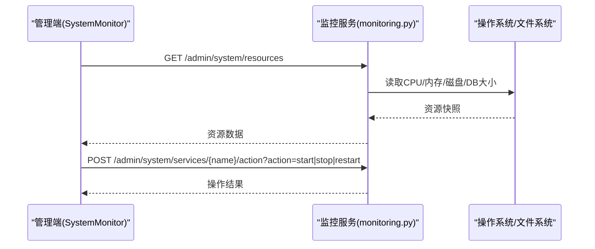
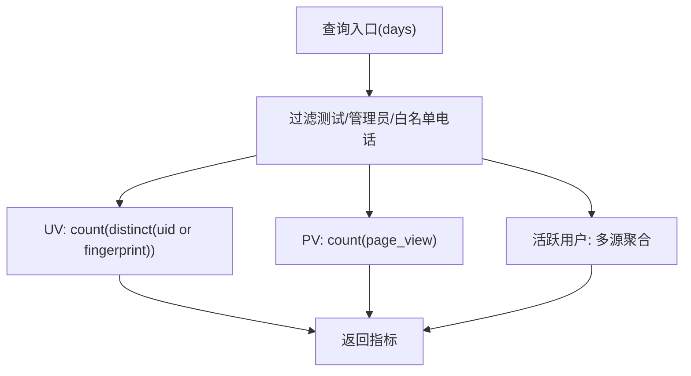
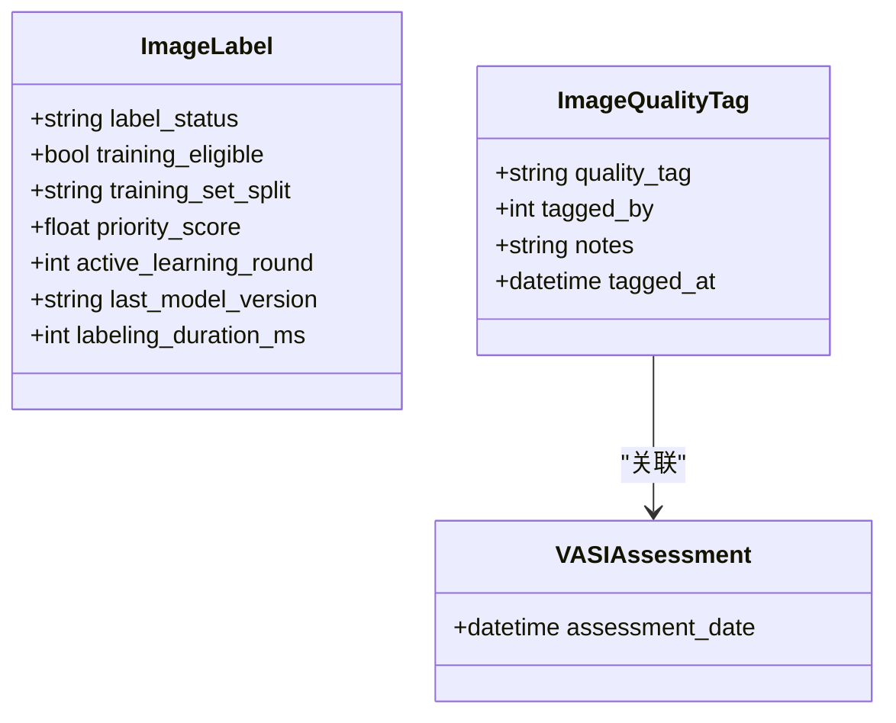
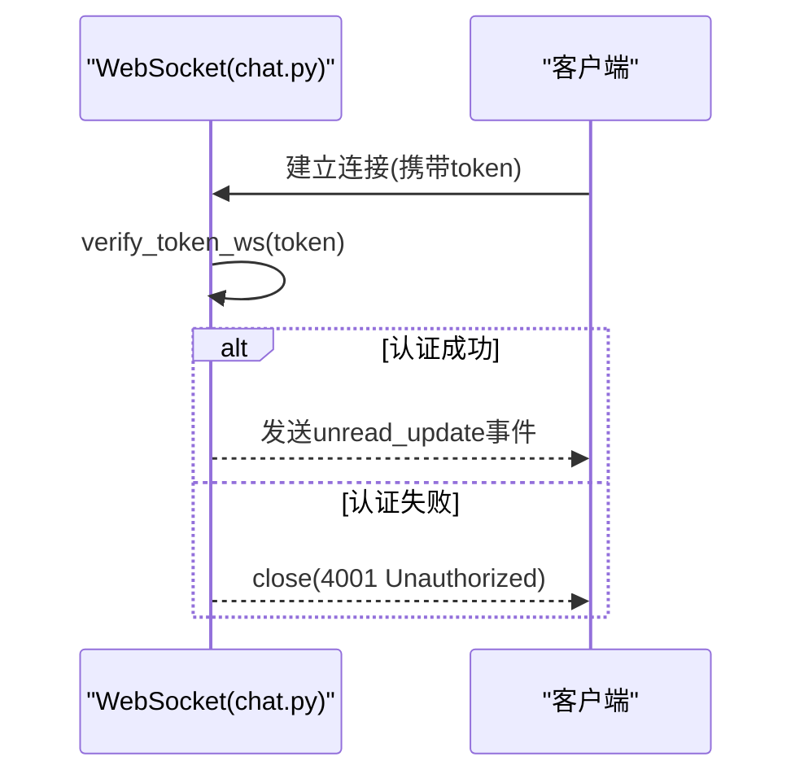
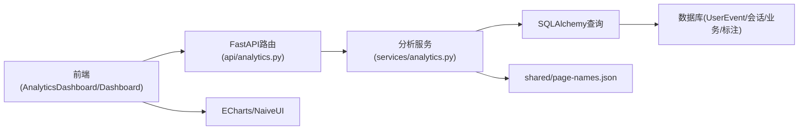

# 仪表盘与分析

<cite>
**本文引用的文件**
- [web/app/src/components/analytics/AnalyticsDashboard.vue](file://web/app/src/components/analytics/AnalyticsDashboard.vue)
- [web/admin/src/views/Dashboard.vue](file://web/admin/src/views/Dashboard.vue)
- [web/backend/api/analytics.py](file://web/backend/api/analytics.py)
- [web/backend/services/analytics.py](file://web/backend/services/analytics.py)
- [web/app/src/api/analytics.ts](file://web/app/src/api/analytics.ts)
- [web/admin/src/views/SystemMonitor.vue](file://web/admin/src/views/SystemMonitor.vue)
- [web/backend/ws/chat.py](file://web/backend/ws/chat.py)
- [hermes_plan/analytics-dashboard.md](file://hermes_plan/analytics-dashboard.md)
- [web/backend/models/image_label.py](file://web/backend/models/image_label.py)
- [web/backend/api/image_label.py](file://web/backend/api/image_label.py)
- [web/backend/models/vasi.py](file://web/backend/models/vasi.py)
- [web/backend/database/models.py](file://web/backend/database/models.py)
- [web/backend/services/monitoring.py](file://web/backend/services/monitoring.py)
- [src/settings/settings.py](file://src/settings/settings.py)
- [docs/design/photo-upload-and-ai-kb-architecture.md](file://docs/design/photo-upload-and-ai-kb-architecture.md)
</cite>

## 目录
1. [简介](#简介)
2. [项目结构](#项目结构)
3. [核心组件](#核心组件)
4. [架构总览](#架构总览)
5. [详细组件分析](#详细组件分析)
6. [依赖关系分析](#依赖关系分析)
7. [性能考量](#性能考量)
8. [故障排查指南](#故障排查指南)
9. [结论](#结论)
10. [附录](#附录)

## 简介
本技术文档围绕 Subskin 管理仪表盘与分析能力，系统阐述数据可视化图表、关键指标展示、业务分析报告与训练效果评估。重点覆盖：
- 用户活跃度统计（UV/PV、活跃用户、注册趋势）
- 内容质量分析（图片质量标签、标注样本、主动学习队列）
- 系统性能指标（Prometheus 指标、健康检查、资源监控）
- AI 模型训练进度跟踪（训练样本统计、模型版本、导出与同步）
同时提供自定义仪表板配置、实时数据更新、报表导出与数据分析工具的使用说明，并总结图表组件库、数据聚合查询与性能优化的最佳实践。

## 项目结构
Subskin 的仪表盘与分析由“前端展示层 + 后端 API + 服务聚合层 + 数据源”构成：
- 前端展示层
  - 应用端仪表盘：ECharts 驱动的运营看板（UV/PV、转化漏斗、功能使用、用户动线等）
  - 管理端仪表盘：Naive UI 卡片+表格+趋势图，聚焦 DAU、帖子数、VASI 评估次数等
  - 系统监控页：CPU/内存/磁盘/数据库大小、服务状态、日志查看、手动触发向量化
- 后端 API
  - 分析接口：概览、趋势、页面访问排行、转化漏斗、功能使用、注册趋势、用户动线
  - 训练面板接口：训练样本统计、模型版本、待同步标注数量
- 服务聚合层
  - AnalyticsService：统一从 UserEvent、对话消息、VASI、报告、社区等表聚合指标
  - 监控服务：Prometheus /metrics、健康检查
- 数据源
  - 事件与行为：UserEvent（page_view/click/login_success 等）
  - 业务实体：VASIAssessment、MedicalReport、Post、PostComment、PostLike、Conversation、Message
  - 标注与训练：ImageLabel、ImageQualityTag、VasiTrainingSample、VasiModelVersion

**图示来源**
- [web/app/src/components/analytics/AnalyticsDashboard.vue:1-374](file://web/app/src/components/analytics/AnalyticsDashboard.vue#L1-L374)
- [web/admin/src/views/Dashboard.vue:1-426](file://web/admin/src/views/Dashboard.vue#L1-L426)
- [web/backend/api/analytics.py:1-88](file://web/backend/api/analytics.py#L1-L88)
- [web/backend/services/analytics.py:1-667](file://web/backend/services/analytics.py#L1-L667)
- [web/backend/api/image_label.py:1907-1944](file://web/backend/api/image_label.py#L1907-L1944)
- [web/backend/services/monitoring.py:190-259](file://web/backend/services/monitoring.py#L190-L259)

**章节来源**
- [web/app/src/components/analytics/AnalyticsDashboard.vue:1-374](file://web/app/src/components/analytics/AnalyticsDashboard.vue#L1-L374)
- [web/admin/src/views/Dashboard.vue:1-426](file://web/admin/src/views/Dashboard.vue#L1-L426)
- [web/backend/api/analytics.py:1-88](file://web/backend/api/analytics.py#L1-L88)
- [web/backend/services/analytics.py:1-667](file://web/backend/services/analytics.py#L1-L667)

## 核心组件
- 应用端仪表盘（AnalyticsDashboard.vue）
  - 北极星指标：累计注册用户数（去重），附带当日新增
  - 概览卡片：今日 UV、PV、活跃用户
  - 趋势图：7天/30天 UV/PV 折线
  - 转化漏斗：访问→注册→登录→使用功能
  - 功能使用：按功能维度 UV 柱状图
  - 用户动线：Top 路径与桑基图节点/边
  - 实时更新：定时刷新（每小时）、主题切换自适应、窗口尺寸自适应
- 管理端仪表盘（Dashboard.vue）
  - 关键指标：DAU、总用户数、总帖子数、VASI 评估次数
  - 趋势图：UV/PV/新增用户多轴折线
  - 页面访问排行与功能使用统计表
- 分析服务（AnalyticsService）
  - 过滤测试/管理员账号，保留匿名访客计入 UV/动线
  - 聚合指标：概览、趋势、注册趋势、用户动线、漏斗、功能使用、页面访问排行
  - 指标口径：UV 基于 uid/fingerprint 去重；PV 基于 page_view 事件计数
- 系统监控（SystemMonitor.vue + monitoring.py）
  - 资源监控：CPU/内存/磁盘/SQLite DB 大小
  - 服务状态：启动/停止/重启
  - 日志查看：journalctl/file 日志
  - Prometheus /metrics 与健康检查 /api/health

**章节来源**
- [web/app/src/components/analytics/AnalyticsDashboard.vue:1-374](file://web/app/src/components/analytics/AnalyticsDashboard.vue#L1-L374)
- [web/admin/src/views/Dashboard.vue:1-426](file://web/admin/src/views/Dashboard.vue#L1-L426)
- [web/backend/services/analytics.py:76-667](file://web/backend/services/analytics.py#L76-L667)
- [web/backend/services/monitoring.py:190-259](file://web/backend/services/monitoring.py#L190-L259)

## 架构总览
端到端数据流：前端通过 API 拉取指标，后端路由到分析服务，服务层聚合多表数据后返回结构化结果，前端用 ECharts/Naive UI 渲染。

**图示来源**
- [web/app/src/components/analytics/AnalyticsDashboard.vue:343-370](file://web/app/src/components/analytics/AnalyticsDashboard.vue#L343-L370)
- [web/backend/api/analytics.py:14-31](file://web/backend/api/analytics.py#L14-L31)
- [web/backend/services/analytics.py:244-337](file://web/backend/services/analytics.py#L244-L337)

## 详细组件分析

### 应用端仪表盘（AnalyticsDashboard.vue）
- 指标与图表
  - 北极星指标：累计注册用户数（去重），叠加当日新注册柱状
  - 概览卡片：今日 UV、PV、活跃用户
  - 趋势图：双轴折线（UV/PV），支持 7d/30d
  - 转化漏斗：访问→注册→登录→使用功能，显示转化率
  - 功能使用：按功能 UV 排序柱状图
  - 用户动线：Top 路径列表与桑基图（nodes/links/top_paths）
- 交互与更新
  - 周期切换：watch 监听 7d/30d 参数变化，重新拉取对应数据
  - 实时性：onMounted 初始化图表并设置定时器每小时刷新
  - 主题与响应式：监听 document.documentElement class 变化与 window resize，调用 chart.resize()
- 数据契约
  - 类型定义：OverviewData、TrendData、FunnelStep、FeatureUsageData、UserJourneyData
  - API 客户端：analyticsApi 封装 overview/trend/registrationTrend/userJourneys/funnel/featureUsage

**图示来源**
- [web/app/src/components/analytics/AnalyticsDashboard.vue:145-370](file://web/app/src/components/analytics/AnalyticsDashboard.vue#L145-L370)
- [web/app/src/api/analytics.ts:58-77](file://web/app/src/api/analytics.ts#L58-L77)

**章节来源**
- [web/app/src/components/analytics/AnalyticsDashboard.vue:1-374](file://web/app/src/components/analytics/AnalyticsDashboard.vue#L1-L374)
- [web/app/src/api/analytics.ts:1-78](file://web/app/src/api/analytics.ts#L1-L78)

### 管理端仪表盘（Dashboard.vue）
- 指标与图表
  - 顶部统计：今日 DAU、总用户数、总帖子数、VASI 评估次数
  - 趋势图：UV/PV/新增用户三轴折线，支持 7/14/30 天
  - 页面访问排行与功能使用统计表
- 交互与更新
  - 移动端适配：isMobile 控制布局与字体/间距
  - 图表生命周期：ResizeObserver 监听容器尺寸变化，避免图表变形
  - 错误提示：请求失败时通过 message.error 反馈

**章节来源**
- [web/admin/src/views/Dashboard.vue:1-426](file://web/admin/src/views/Dashboard.vue#L1-L426)

### 系统监控（SystemMonitor.vue + monitoring.py）
- 资源与服务
  - CPU/内存/磁盘/SQLite DB 大小卡片，带进度条与颜色阈值
  - 服务状态表：运行中/已停止/异常/未知，支持启动/停止/重启
  - 日志查看：选择服务名或文件，分页读取最近 N 行
  - 知识库向量化：手动触发增量 embedding 任务，返回成功/失败统计
- 监控端点
  - Prometheus /metrics：可选启用，暴露运行时指标
  - 健康检查 /api/health：数据库连通性、磁盘空间等

**图示来源**
- [web/admin/src/views/SystemMonitor.vue:457-539](file://web/admin/src/views/SystemMonitor.vue#L457-L539)
- [web/backend/services/monitoring.py:190-259](file://web/backend/services/monitoring.py#L190-L259)

**章节来源**
- [web/admin/src/views/SystemMonitor.vue:1-634](file://web/admin/src/views/SystemMonitor.vue#L1-L634)
- [web/backend/services/monitoring.py:190-259](file://web/backend/services/monitoring.py#L190-L259)

### 分析服务与数据聚合（AnalyticsService）
- 指标口径
  - 排除策略：排除测试账号、管理员账号及白名单电话，但保留匿名访客计入 UV/动线
  - UV 计算：基于 uid 或 client_fingerprint 去重
  - PV 计算：基于 event_type = page_view 的事件计数
  - 活跃用户：综合 AI 问答、VASI、体检报告、发帖、评论、点赞等多源活动
- 主要方法
  - get_overview：总用户、今日 UV/PV、今日新增、今日活跃
  - get_trend：近 N 日 UV/PV/新增
  - get_registration_trend：累计注册用户趋势（北极星）
  - get_user_journeys：会话级路径归一化、去重、构建桑基图
  - get_funnel：访问→注册→登录→使用功能
  - get_feature_usage：AI问答、追踪评估、上传报告、发帖、评论、点赞、浏览百科
  - get_page_views：页面访问排行（UV/PV）

**图示来源**
- [web/backend/services/analytics.py:76-241](file://web/backend/services/analytics.py#L76-L241)
- [web/backend/services/analytics.py:244-667](file://web/backend/services/analytics.py#L244-L667)

**章节来源**
- [web/backend/services/analytics.py:1-667](file://web/backend/services/analytics.py#L1-L667)

### 训练效果评估与主动学习
- 训练面板
  - 样本统计：总数、训练集/验证集/测试集划分估算、待同步标注数量
  - 模型版本：最近 10 个版本及其指标
- 数据模型
  - ImageLabel：标注状态、是否适合训练、训练集划分标记、主动学习优先级、标注耗时
  - ImageQualityTag：对评估图片的质量打标（excellent/good/poor/reject）
  - VASIAssessment：关联质量标签与评估信息
- 工作流
  - 标注完成后进入主动学习队列，按优先级评分排序
  - 管理员审核后可同步为训练样本，支持导出训练数据集

**图示来源**
- [web/backend/models/image_label.py:137-151](file://web/backend/models/image_label.py#L137-L151)
- [web/backend/models/vasi.py:95-128](file://web/backend/models/vasi.py#L95-L128)

**章节来源**
- [web/backend/api/image_label.py:1907-1944](file://web/backend/api/image_label.py#L1907-L1944)
- [web/backend/models/image_label.py:137-151](file://web/backend/models/image_label.py#L137-L151)
- [web/backend/models/vasi.py:95-128](file://web/backend/models/vasi.py#L95-L128)

### 实时数据更新（WebSocket）
- 聊天未读数推送：ConnectionManager 维护用户连接，广播 unread_update
- 认证：基于 token 校验，未授权关闭连接

**图示来源**
- [web/backend/ws/chat.py:14-49](file://web/backend/ws/chat.py#L14-L49)

**章节来源**
- [web/backend/ws/chat.py:1-49](file://web/backend/ws/chat.py#L1-L49)

## 依赖关系分析
- 前端依赖
  - ECharts：趋势图、漏斗图、桑基图、北极星指标图
  - Naive UI：管理端卡片、统计、表格、按钮等
  - TypeScript 类型：analytics.ts 定义前后端数据结构契约
- 后端依赖
  - FastAPI：路由与依赖注入
  - SQLAlchemy：ORM 查询与聚合
  - Prometheus：可选指标暴露
  - 共享配置：page-names.json 作为页面名称唯一事实来源
- 数据依赖
  - UserEvent：UV/PV/点击/登录等行为
  - Conversation/Message：AI 问答活跃度
  - VASIAssessment/MedicalReport/Post/PostComment/PostLike：业务活跃度
  - ImageLabel/ImageQualityTag/VasiTrainingSample/VasiModelVersion：训练与质量

**图示来源**
- [web/backend/api/analytics.py:1-88](file://web/backend/api/analytics.py#L1-L88)
- [web/backend/services/analytics.py:26-37](file://web/backend/services/analytics.py#L26-L37)

**章节来源**
- [web/backend/api/analytics.py:1-88](file://web/backend/api/analytics.py#L1-L88)
- [web/backend/services/analytics.py:1-667](file://web/backend/services/analytics.py#L1-L667)

## 性能考量
- 查询优化
  - 使用索引字段进行日期范围过滤（created_at、event_type、page_path）
  - 分组聚合前尽量缩小数据范围（days 参数限制）
  - 去重计算采用 distinct(coalesce(uid, fingerprint)) 减少重复计数
- 缓存与异步
  - 热门分析结果可引入 Redis 缓存（设计文档建议）
  - 长时间任务（如向量化）异步执行，返回任务 ID
- 限流与超时
  - 外部 API 调用增加重试与退避（参考爬虫实现）
  - 分析任务设置超时保护，避免阻塞
- 监控与告警
  - Prometheus /metrics 暴露运行时指标
  - 健康检查 /api/health 检测数据库与磁盘
  - 告警规则：上传失败率、AI 分析失败率、存储可用性、数据库连接池耗尽、P99 延迟

**章节来源**
- [docs/design/photo-upload-and-ai-kb-architecture.md:348-412](file://docs/design/photo-upload-and-ai-kb-architecture.md#L348-L412)
- [web/backend/services/monitoring.py:190-259](file://web/backend/services/monitoring.py#L190-L259)
- [src/settings/settings.py:194-241](file://src/settings/settings.py#L194-L241)

## 故障排查指南
- 仪表盘无数据
  - 检查后端路由是否注册（main.py）
  - 确认 admin 权限校验（phone-based allowlist）
  - 核对 EXCLUDED_PHONES 环境变量是否误排除真实用户
- 指标异常
  - 确认 UserEvent 事件写入正常（page_view/click/login_success）
  - 检查会话/消息表是否存在数据（AI 问答活跃度）
  - 核对页面名称映射（page-names.json）是否正确
- 性能问题
  - 使用 EXPLAIN ANALYZE 分析慢查询
  - 增加复合索引（user_id, created_at DESC）
  - 开启 Prometheus 监控，定位热点接口
- 训练数据不同步
  - 检查 ImageLabel 的 training_eligible 与 label_status
  - 确认已同步的 admin_label_id 集合，避免重复计数
  - 使用训练面板导出功能验证数据完整性

**章节来源**
- [hermes_plan/analytics-dashboard.md:61-89](file://hermes_plan/analytics-dashboard.md#L61-L89)
- [web/backend/services/analytics.py:40-120](file://web/backend/services/analytics.py#L40-L120)
- [web/backend/api/image_label.py:1907-1944](file://web/backend/api/image_label.py#L1907-L1944)

## 结论
Subskin 的仪表盘与分析体系以“前端可视化 + 后端聚合服务 + 多源数据”为核心，提供了完整的运营与训练监控能力。通过严格的指标口径、灵活的周期切换与实时刷新机制，满足日常运营与深度分析需求。结合系统监控与告警，保障服务稳定性与可观测性。后续可进一步引入预聚合表与缓存策略，提升大规模数据下的查询性能。

## 附录
- 自定义仪表板配置
  - 周期切换：7d/30d/14d 等参数通过 URL 查询参数传递
  - 主题适配：监听 document.documentElement class 变化，动态调整图表样式
  - 移动端适配：根据 isMobile 调整布局与字体
- 报表导出
  - 训练数据导出：支持 split_ratio、include_ai/include_user、only_admin_labeled 等参数
  - 导出结果包含 train/val/test 数量与导出链接
- 数据分析工具
  - 用户动线分析：会话级路径归一化与去重，生成桑基图节点/边
  - 功能使用分析：按功能维度统计 UV/PV，识别高价值功能
- 最佳实践
  - 数据聚合：优先使用 SQL 聚合，减少后端内存计算
  - 性能优化：分页、索引、缓存、只读副本
  - 安全合规：脱敏日志、GDPR 数据导出/删除、医疗免责声明

**章节来源**
- [web/backend/api/image_label.py:1907-1944](file://web/backend/api/image_label.py#L1907-L1944)
- [web/app/src/components/analytics/AnalyticsDashboard.vue:298-370](file://web/app/src/components/analytics/AnalyticsDashboard.vue#L298-L370)
- [docs/design/photo-upload-and-ai-kb-architecture.md:348-412](file://docs/design/photo-upload-and-ai-kb-architecture.md#L348-L412)