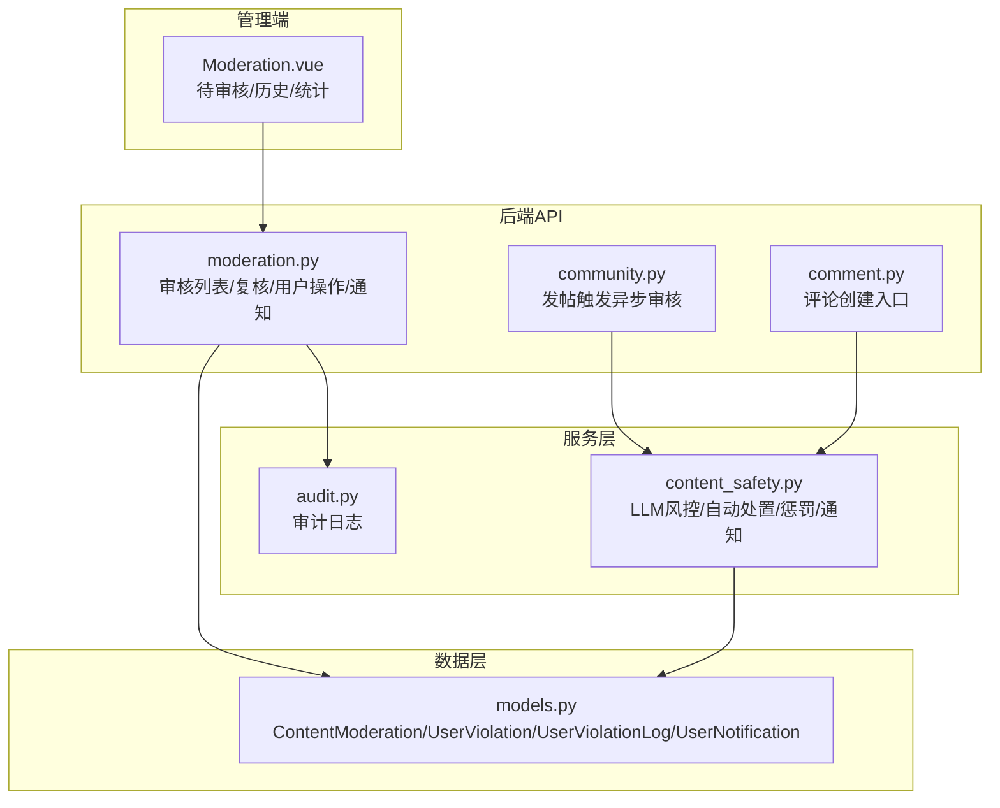
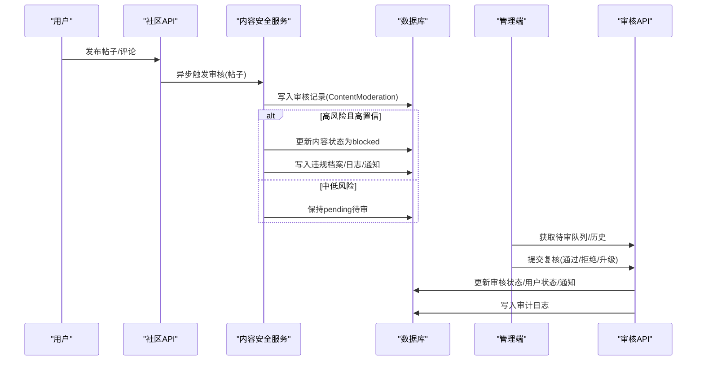
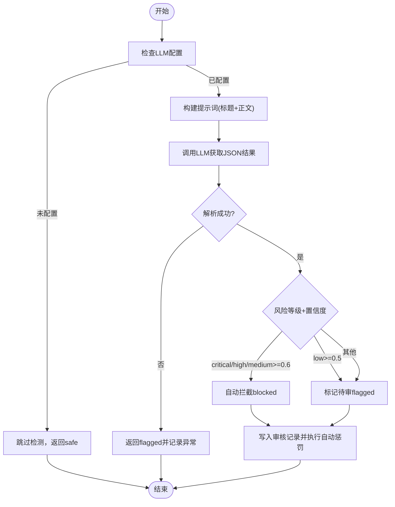
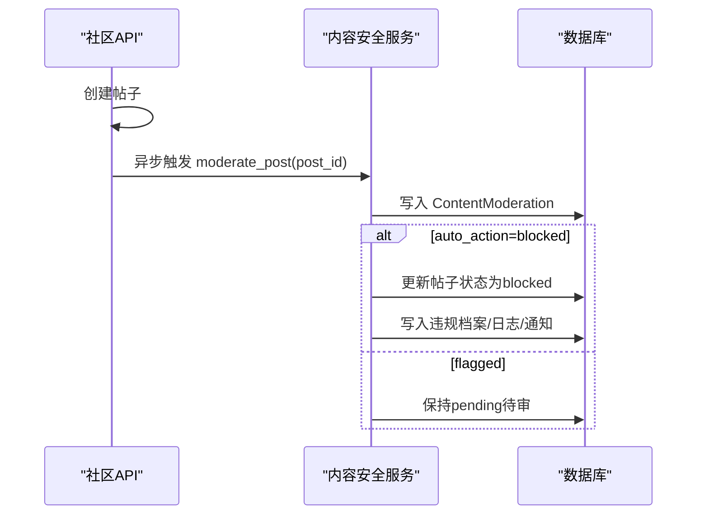
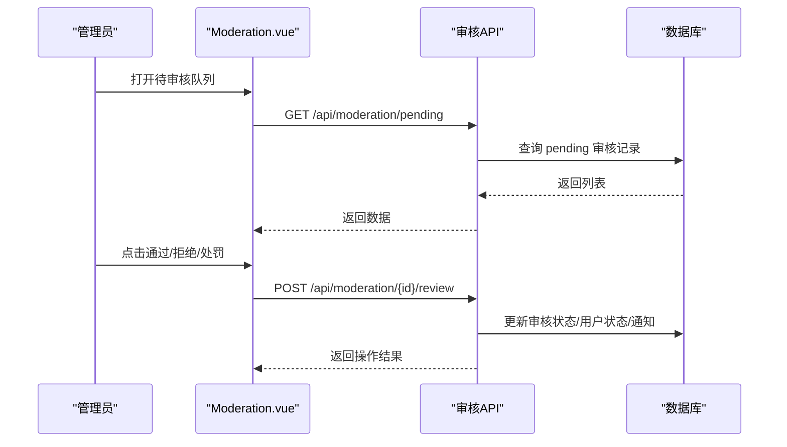
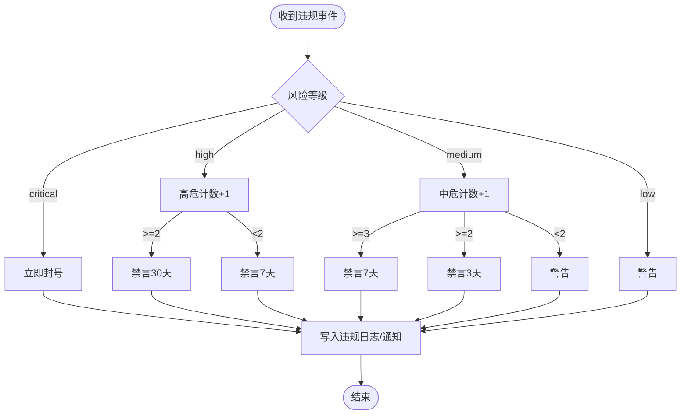
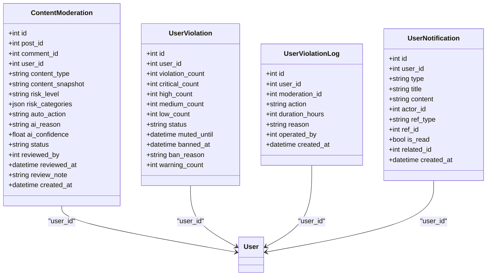
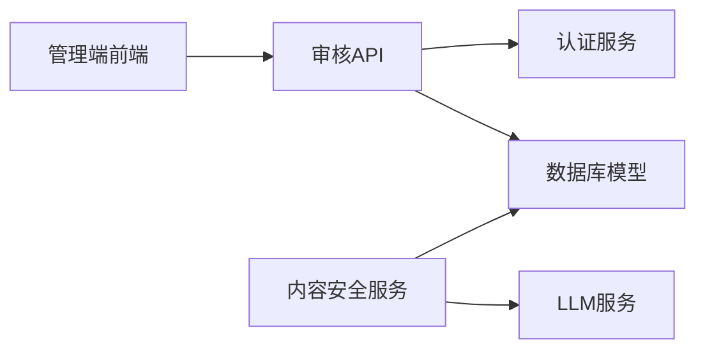

# 内容审核

<cite>
**本文引用的文件**
- [web/backend/api/moderation.py](file://web/backend/api/moderation.py)
- [web/backend/services/content_safety.py](file://web/backend/services/content_safety.py)
- [web/backend/database/models.py](file://web/backend/database/models.py)
- [web/admin/src/views/Moderation.vue](file://web/admin/src/views/Moderation.vue)
- [web/backend/api/community.py](file://web/backend/api/community.py)
- [web/backend/api/comment.py](file://web/backend/api/comment.py)
- [web/backend/services/audit.py](file://web/backend/services/audit.py)
</cite>

## 目录
1. [简介](#简介)
2. [项目结构](#项目结构)
3. [核心组件](#核心组件)
4. [架构总览](#架构总览)
5. [详细组件分析](#详细组件分析)
6. [依赖关系分析](#依赖关系分析)
7. [性能考虑](#性能考虑)
8. [故障排查指南](#故障排查指南)
9. [结论](#结论)
10. [附录](#附录)

## 简介
本技术文档面向 Subskin 内容审核系统，覆盖帖子与评论的自动审核、人工审核界面、违规处理流程、AI 内容检测、敏感词与文本分析、图片识别（在相关模块中体现）、审核工作流配置、审核员权限管理、审核记录追踪与批量操作等。文档以代码为依据，提供架构图、数据流图、时序图和流程图，帮助读者快速理解并正确使用该系统。

## 项目结构
内容审核系统由后端 API、安全检测服务、数据库模型与管理端前端组成：
- 后端 API：负责审核队列、复核操作、用户处罚、通知与历史查询。
- 安全检测服务：基于 LLM 的内容安全检测、自动处置策略、违规惩罚与通知。
- 数据库模型：存储审核记录、违规档案、违规日志、站内通知等。
- 管理端前端：提供待审核队列、复核历史、统计面板与复核弹窗。

图表来源
- [web/admin/src/views/Moderation.vue:1-700](file://web/admin/src/views/Moderation.vue#L1-L700)
- [web/backend/api/moderation.py:1-418](file://web/backend/api/moderation.py#L1-L418)
- [web/backend/api/community.py:285-293](file://web/backend/api/community.py#L285-L293)
- [web/backend/api/comment.py:1-33](file://web/backend/api/comment.py#L1-L33)
- [web/backend/services/content_safety.py:1-368](file://web/backend/services/content_safety.py#L1-L368)
- [web/backend/services/audit.py:1-136](file://web/backend/services/audit.py#L1-L136)
- [web/backend/database/models.py:848-935](file://web/backend/database/models.py#L848-L935)

章节来源
- [web/backend/api/moderation.py:1-418](file://web/backend/api/moderation.py#L1-L418)
- [web/backend/services/content_safety.py:1-368](file://web/backend/services/content_safety.py#L1-L368)
- [web/backend/database/models.py:848-935](file://web/backend/database/models.py#L848-L935)
- [web/admin/src/views/Moderation.vue:1-700](file://web/admin/src/views/Moderation.vue#L1-L700)

## 核心组件
- 内容安全检测服务：调用 LLM 进行文本风险判定，输出风险等级、类别、置信度与理由；根据阈值决定自动处置（拦截/标记）。
- 审核 API：提供待审队列、复核（通过/拒绝/升级）、用户处罚（禁言/封号）、通知与历史记录查询。
- 数据库模型：统一存储审核记录、违规档案、违规日志与站内通知，支持索引与关联查询。
- 管理端界面：展示待审队列、历史、统计卡片，支持快速复核与详情弹窗。
- 审计日志：记录关键操作，支持撤销与按目标追溯。

章节来源
- [web/backend/services/content_safety.py:54-100](file://web/backend/services/content_safety.py#L54-L100)
- [web/backend/api/moderation.py:108-229](file://web/backend/api/moderation.py#L108-L229)
- [web/backend/database/models.py:848-935](file://web/backend/database/models.py#L848-L935)
- [web/admin/src/views/Moderation.vue:1-700](file://web/admin/src/views/Moderation.vue#L1-L700)
- [web/backend/services/audit.py:11-136](file://web/backend/services/audit.py#L11-L136)

## 架构总览
内容从发布到审核的全链路如下：
- 帖子发布：社区接口创建帖子后，后台线程异步触发内容安全检测。
- 评论发布：评论接口创建评论，默认未批准，进入审核队列。
- AI 检测：服务层调用 LLM 对标题/正文或评论内容进行分析，生成风险等级与类别。
- 自动处置：根据风险等级与置信度，决定是否直接拦截或标记待审。
- 人工复核：管理员在管理端查看待审队列，执行通过/拒绝/升级，并可附加备注。
- 违规处理：拒绝时可触发禁言或封号，写入违规档案与日志，并发送站内通知。
- 审计记录：关键操作写入审计日志，支持按目标与用户维度追溯。

图表来源
- [web/backend/api/community.py:285-293](file://web/backend/api/community.py#L285-L293)
- [web/backend/services/content_safety.py:103-145](file://web/backend/services/content_safety.py#L103-L145)
- [web/backend/api/moderation.py:144-229](file://web/backend/api/moderation.py#L144-L229)
- [web/backend/database/models.py:848-935](file://web/backend/database/models.py#L848-L935)

## 详细组件分析

### 内容安全检测服务（AI 文本分析）
- 功能要点
  - 使用 LLM 对标题与正文（或评论内容）进行风险分类与置信度评估。
  - 定义风险类别集合（涉政、暴恐、色情、赌博、诈骗、毒品、枪支、自残教唆、辱骂歧视、人身攻击、引流广告、违反公序良俗）。
  - 根据风险等级与置信度确定自动动作（blocked/flagged）。
  - 若自动拦截，则更新内容状态并执行自动惩罚（警告、禁言、封号），同时写入违规日志与站内通知。
- 复杂度与优化
  - 文本长度限制（标题截断至200字符，正文截断至2000字符）以降低请求成本。
  - 异常时回退为“flagged”，确保不遗漏潜在风险。
  - 可结合缓存或批处理降低重复检测开销（当前实现为逐条检测）。

图表来源
- [web/backend/services/content_safety.py:54-100](file://web/backend/services/content_safety.py#L54-L100)
- [web/backend/services/content_safety.py:103-145](file://web/backend/services/content_safety.py#L103-L145)

章节来源
- [web/backend/services/content_safety.py:54-100](file://web/backend/services/content_safety.py#L54-L100)
- [web/backend/services/content_safety.py:103-145](file://web/backend/services/content_safety.py#L103-L145)

### 帖子与评论的自动审核机制
- 帖子发布
  - 社区接口创建帖子后，启动后台线程异步调用内容安全检测。
  - 若检测到风险，写入审核记录并根据自动策略更新帖子状态或执行惩罚。
- 评论发布
  - 评论接口创建评论，默认未批准，进入审核队列。
  - 评论也可接入内容安全检测（服务层提供评论审核函数），若高风险则屏蔽内容并惩罚。

图表来源
- [web/backend/api/community.py:285-293](file://web/backend/api/community.py#L285-L293)
- [web/backend/services/content_safety.py:103-145](file://web/backend/services/content_safety.py#L103-L145)

章节来源
- [web/backend/api/community.py:285-293](file://web/backend/api/community.py#L285-L293)
- [web/backend/services/content_safety.py:103-145](file://web/backend/services/content_safety.py#L103-L145)
- [web/backend/api/comment.py:25-33](file://web/backend/api/comment.py#L25-L33)
- [web/backend/services/content_safety.py:190-226](file://web/backend/services/content_safety.py#L190-L226)

### 人工审核界面与工作流
- 管理端页面
  - 统计卡片：待审核数量、今日已处理、高风险数量。
  - 标签页：待审核队列、复核历史，支持分页与筛选。
  - 复核弹窗：展示内容快照、AI 分析结果（风险等级、置信度、类别、自动建议、AI 理由），支持通过/拒绝/处罚与备注。
- 审核工作流
  - 管理员拉取待审队列，查看详情，选择复核动作。
  - 通过后更新帖子状态为 approved，并发送站内通知。
  - 拒绝时可设置禁言时长或封号，写入违规日志与通知。
  - 历史记录可分页查询，便于审计与复盘。

图表来源
- [web/admin/src/views/Moderation.vue:1-700](file://web/admin/src/views/Moderation.vue#L1-L700)
- [web/backend/api/moderation.py:108-229](file://web/backend/api/moderation.py#L108-L229)

章节来源
- [web/admin/src/views/Moderation.vue:1-700](file://web/admin/src/views/Moderation.vue#L1-L700)
- [web/backend/api/moderation.py:108-229](file://web/backend/api/moderation.py#L108-L229)

### 违规内容处理流程
- 自动惩罚
  - 严重违规（critical）：立即封号。
  - 高危违规（high）：累计2次禁言30天，否则禁言7天。
  - 中危违规（medium）：累计3次禁言7天，累计2次禁言3天，否则警告。
  - 低危违规（low）：警告。
- 手动处罚
  - 拒绝时可设置禁言时长或封号，写入违规日志与通知。
- 通知与短信
  - 站内通知类型包括：post_approved、post_rejected、mute、ban、moderation_warning。
  - 短信发送具备冷却时间，防止批量违规时的消息风暴。

图表来源
- [web/backend/services/content_safety.py:229-316](file://web/backend/services/content_safety.py#L229-L316)
- [web/backend/api/moderation.py:174-229](file://web/backend/api/moderation.py#L174-L229)

章节来源
- [web/backend/services/content_safety.py:229-316](file://web/backend/services/content_safety.py#L229-L316)
- [web/backend/api/moderation.py:174-229](file://web/backend/api/moderation.py#L174-L229)

### 审核记录与审计追踪
- 审核记录
  - 字段包括：内容类型、快照、风险等级、类别、自动动作、AI 理由与置信度、状态、审核人与时间、备注。
- 违规档案与日志
  - 违规档案维护各等级计数与状态（normal/muted/banned），以及禁言/封禁时间与原因。
  - 违规日志记录每次操作（warn/mute/ban/unmute/unban），包含操作人、时长、原因与时间。
- 审计日志
  - 支持创建、撤销、按用户与目标查询，IP 地址脱敏，保障隐私与合规。

图表来源
- [web/backend/database/models.py:848-935](file://web/backend/database/models.py#L848-L935)

章节来源
- [web/backend/database/models.py:848-935](file://web/backend/database/models.py#L848-L935)
- [web/backend/services/audit.py:11-136](file://web/backend/services/audit.py#L11-L136)

### 图片识别与文本分析（相关能力）
- 文本分析
  - 内容安全服务对标题与正文进行 LLM 文本分析，输出风险等级、类别、置信度与理由。
- 图片识别
  - 在医疗报告与皮肤评估模块中，存在图像转文本（OCR）与视觉特征分析能力，可用于辅助内容安全（如上传报告中的敏感信息识别）。
  - 注意：当前内容审核主流程聚焦文本风险；图片识别可作为扩展能力集成到审核策略中。

章节来源
- [web/backend/services/content_safety.py:54-100](file://web/backend/services/content_safety.py#L54-L100)
- [web/backend/api/medical_report.py:560-594](file://web/backend/api/medical_report.py#L560-L594)

## 依赖关系分析
- 模块耦合
  - 审核 API 依赖数据库模型与认证服务，用于权限校验与数据读写。
  - 内容安全服务依赖 LLM 配置与服务，以及数据库模型，用于检测与持久化。
  - 管理端前端依赖审核 API，用于拉取队列与提交复核。
- 外部依赖
  - LLM 提供商（OpenAI 兼容接口），需配置 api_key、base_url、chat_model。
  - 短信服务（可选），用于违规通知。
- 循环依赖
  - 未发现明显循环依赖；审核流程为单向调用链。

图表来源
- [web/backend/api/moderation.py:1-418](file://web/backend/api/moderation.py#L1-L418)
- [web/backend/services/content_safety.py:1-368](file://web/backend/services/content_safety.py#L1-L368)
- [web/admin/src/views/Moderation.vue:1-700](file://web/admin/src/views/Moderation.vue#L1-L700)

章节来源
- [web/backend/api/moderation.py:1-418](file://web/backend/api/moderation.py#L1-L418)
- [web/backend/services/content_safety.py:1-368](file://web/backend/services/content_safety.py#L1-L368)
- [web/admin/src/views/Moderation.vue:1-700](file://web/admin/src/views/Moderation.vue#L1-L700)

## 性能考虑
- 异步审核：帖子发布后采用后台线程异步触发审核，避免阻塞主流程。
- 文本截断：标题与正文长度限制，减少 LLM 请求成本。
- 短信冷却：违规通知短信具备冷却时间，防止消息风暴。
- 分页与限流：待审队列与历史分页，限制最大返回条目数，提升响应速度。
- 建议优化
  - 引入任务队列（如 Celery/RQ）替代线程，提高可靠性与可观测性。
  - 对高频内容建立缓存与指纹去重，减少重复检测。
  - 对 LLM 调用增加重试与超时控制，提升稳定性。

[本节为通用指导，无需特定文件来源]

## 故障排查指南
- LLM 配置缺失或未启用
  - 现象：内容安全检测被跳过，返回 safe。
  - 处理：检查 LLM 配置（provider、api_key、base_url、chat_model）。
- LLM 调用异常
  - 现象：检测失败，回退为 flagged 并记录异常。
  - 处理：检查网络、鉴权与模型可用性；查看日志定位错误。
- 审核记录不存在
  - 现象：复核接口返回 404。
  - 处理：确认 moderation_id 是否存在；检查权限与数据一致性。
- 权限不足
  - 现象：需要管理员权限的操作返回 403。
  - 处理：确认当前用户是否为管理员；检查认证中间件。
- 短信发送失败
  - 现象：违规通知未送达。
  - 处理：检查短信服务配置与用户手机号；查看冷却逻辑是否抑制发送。

章节来源
- [web/backend/services/content_safety.py:54-87](file://web/backend/services/content_safety.py#L54-L87)
- [web/backend/api/moderation.py:144-157](file://web/backend/api/moderation.py#L144-L157)
- [web/backend/api/moderation.py:151-152](file://web/backend/api/moderation.py#L151-L152)
- [web/backend/services/content_safety.py:341-368](file://web/backend/services/content_safety.py#L341-L368)

## 结论
Subskin 内容审核系统通过 LLM 驱动的文本风险检测、自动处置策略、完善的人工审核界面与严格的违规处理流程，构建了端到端的内容安全闭环。系统具备良好的可扩展性，可在现有基础上集成图片识别与更精细的规则定制。建议在生产环境引入任务队列与监控告警，进一步提升可靠性与可观测性。

[本节为总结，无需特定文件来源]

## 附录
- 审核规则定制
  - 调整风险等级阈值与置信度门槛，修改自动动作策略。
  - 扩展风险类别与提示词模板，适配业务场景。
- 审核报告生成
  - 基于审核记录与违规日志，导出统计报表（待审量、通过率、高风险占比、处罚分布）。
  - 结合审计日志，生成操作轨迹报告，支持合规审计。
- 批量审核操作
  - 在管理端支持批量通过/拒绝（可通过前端扩展实现），后端需提供批量接口与幂等性保证。
  - 建议引入事务与回滚机制，确保数据一致性。

[本节为通用指导，无需特定文件来源]