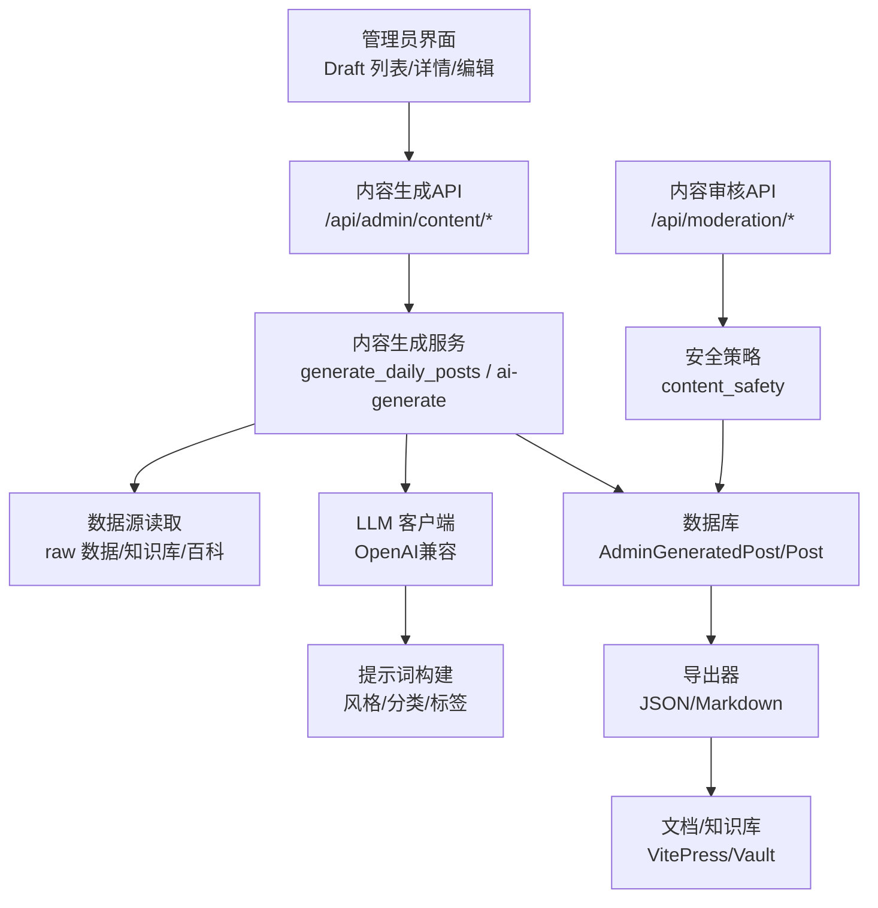
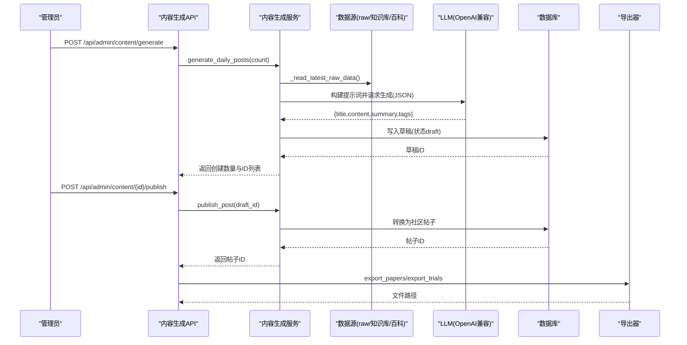
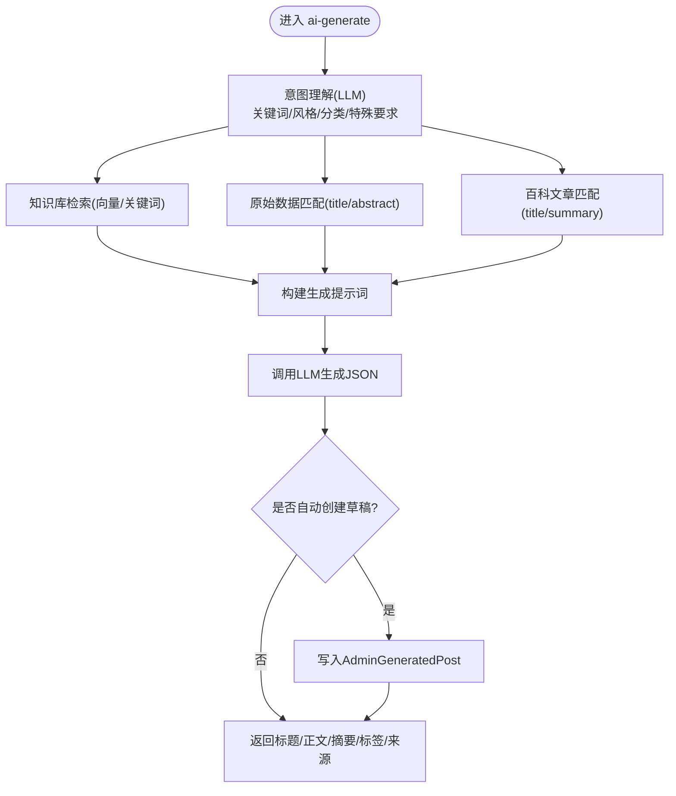
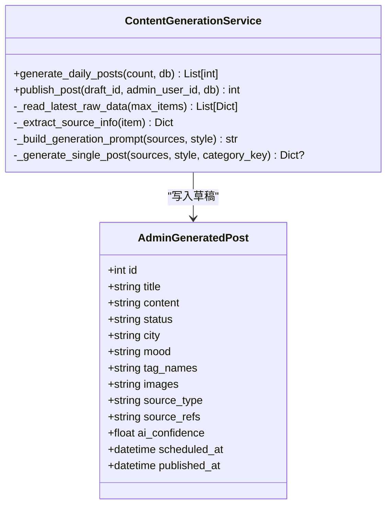
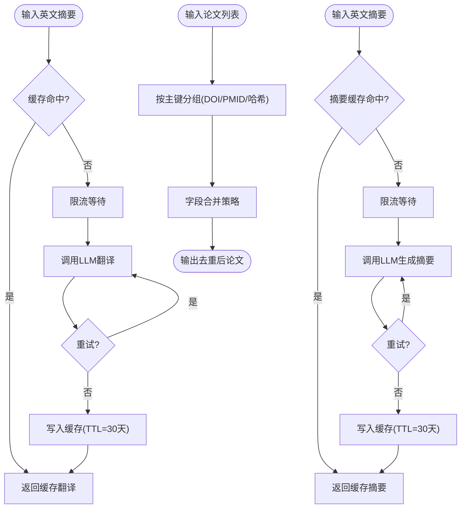
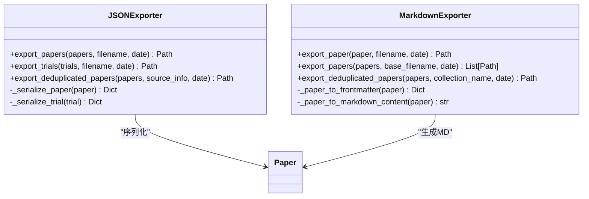
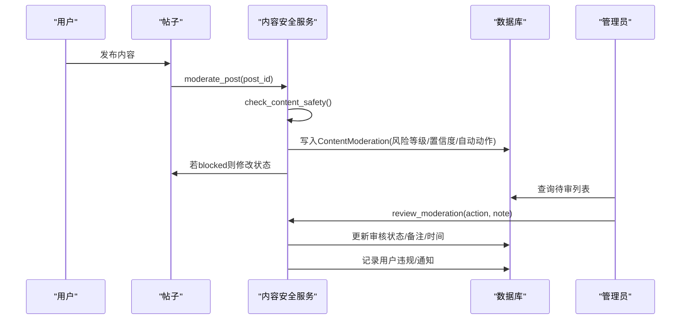
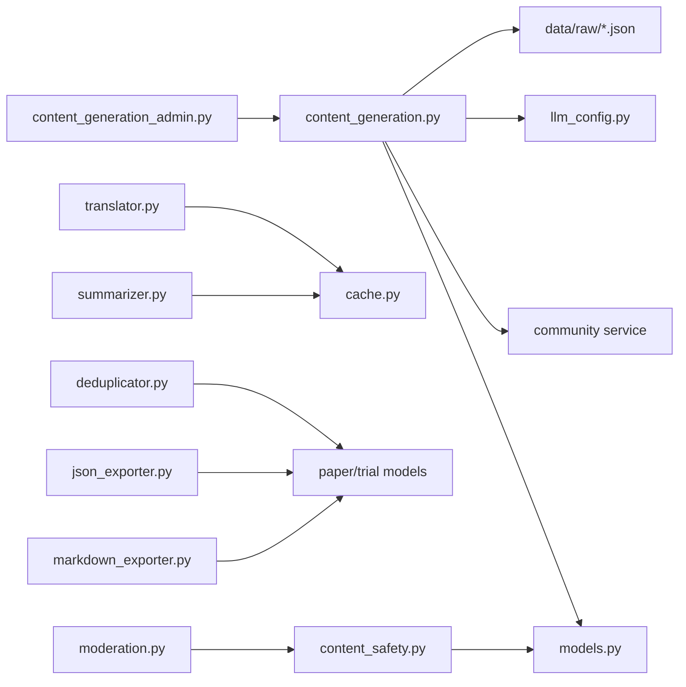

# 内容生成

<cite>
**本文引用的文件**   
- [web/backend/api/content_generation_admin.py](file://web/backend/api/content_generation_admin.py)
- [web/backend/services/content_generation.py](file://web/backend/services/content_generation.py)
- [src/processors/deduplicator.py](file://src/processors/deduplicator.py)
- [src/processors/summarizer.py](file://src/processors/summarizer.py)
- [src/processors/translator.py](file://src/processors/translator.py)
- [src/exporters/json_exporter.py](file://src/exporters/json_exporter.py)
- [src/exporters/markdown_exporter.py](file://src/exporters/markdown_exporter.py)
- [configs/web_config.yaml](file://configs/web_config.yaml)
- [web/backend/api/moderation.py](file://web/backend/api/moderation.py)
- [web/backend/database/models.py](file://web/backend/database/models.py)
- [web/backend/services/content_safety.py](file://web/backend/services/content_safety.py)
- [web/admin/src/views/Moderation.vue](file://web/admin/src/views/Moderation.vue)
- [scripts/import_knowledge.py](file://scripts/import_knowledge.py)
</cite>

## 目录
1. [简介](#简介)
2. [项目结构](#项目结构)
3. [核心组件](#核心组件)
4. [架构总览](#架构总览)
5. [详细组件分析](#详细组件分析)
6. [依赖关系分析](#依赖关系分析)
7. [性能考量](#性能考量)
8. [故障排查指南](#故障排查指南)
9. [结论](#结论)
10. [附录](#附录)

## 简介
本技术文档围绕 Subskin 的“内容生成”能力进行系统化说明，覆盖 AI 驱动的内容创作、模板管理、批量生成与质量审核流程。重点阐述百科文章自动生成、医学知识整理、内容格式转换与多语言支持；并给出内容生成策略配置、提示词工程、去重与质量评估机制的实现要点。同时提供内容生成的 API 接口、自定义模板开发与内容工作流配置的实操指南，帮助开发者快速集成与扩展。

## 项目结构
内容生成相关代码主要分布在以下模块：
- 后端 API 与管理端点：用于触发生成、草稿管理与发布
- 服务层：聚合数据源、构建提示词、调用 LLM、落库草稿
- 处理器：翻译、摘要、去重等数据处理流水线
- 导出器：JSON/Markdown 输出，便于知识库与文档站点消费
- 配置与调度：百科自动更新、周报生成、社区内容策略
- 审核与安全：AI 风控、人工复核、违规记录与处罚

**图表来源**
- [web/backend/api/content_generation_admin.py:1-120](file://web/backend/api/content_generation_admin.py#L1-L120)
- [web/backend/services/content_generation.py:1-120](file://web/backend/services/content_generation.py#L1-L120)
- [src/exporters/json_exporter.py:1-60](file://src/exporters/json_exporter.py#L1-L60)
- [src/exporters/markdown_exporter.py:1-80](file://src/exporters/markdown_exporter.py#L1-L80)
- [configs/web_config.yaml:136-184](file://configs/web_config.yaml#L136-L184)

**章节来源**
- [web/backend/api/content_generation_admin.py:1-120](file://web/backend/api/content_generation_admin.py#L1-L120)
- [web/backend/services/content_generation.py:1-120](file://web/backend/services/content_generation.py#L1-L120)
- [configs/web_config.yaml:136-184](file://configs/web_config.yaml#L136-L184)

## 核心组件
- 内容生成 API（管理员）
  - 草稿管理：列表、详情、更新、删除
  - 批量操作：批量发布、批量删除
  - AI 对话式生成：自然语言需求 → 意图理解 → 检索增强 → 生成内容 → 可选自动建草稿
- 内容生成服务
  - 每日批量生成：读取 raw 数据，按风格/分类配比生成草稿，随机化标签/心情/城市
  - 单篇生成：基于来源资料构建提示词，调用 LLM 返回 JSON 结构化结果
  - 发布：将草稿转为社区帖子，关联分类、标签、图片占位
- 数据处理流水线
  - 翻译：英文摘要 → 中文翻译（缓存+限流+重试）
  - 摘要：面向患者的中文总结（系统提示词约束与免责声明）
  - 去重：DOI/PMID 优先，标题+作者+年份哈希兜底，字段级合并策略
- 导出器
  - JSON 导出：按日期组织，序列化时间戳与枚举值
  - Markdown 导出：YAML frontmatter + 免责声明，适合 VitePress 文档站
- 配置与调度
  - 百科自动更新、周报定时任务、社区内容策略（评论长度、垃圾过滤）
- 审核与安全
  - AI 风控判定风险等级与置信度，自动处置（阻断/标记），人工复核与处罚

**章节来源**
- [web/backend/api/content_generation_admin.py:128-319](file://web/backend/api/content_generation_admin.py#L128-L319)
- [web/backend/services/content_generation.py:272-379](file://web/backend/services/content_generation.py#L272-L379)
- [src/processors/translator.py:195-251](file://src/processors/translator.py#L195-L251)
- [src/processors/summarizer.py:204-247](file://src/processors/summarizer.py#L204-L247)
- [src/processors/deduplicator.py:57-91](file://src/processors/deduplicator.py#L57-L91)
- [src/exporters/json_exporter.py:41-85](file://src/exporters/json_exporter.py#L41-L85)
- [src/exporters/markdown_exporter.py:170-225](file://src/exporters/markdown_exporter.py#L170-L225)
- [configs/web_config.yaml:136-184](file://configs/web_config.yaml#L136-L184)
- [web/backend/services/content_safety.py:89-178](file://web/backend/services/content_safety.py#L89-L178)

## 架构总览
内容生成采用“API 路由 → 服务层 → 数据源/LLM → 数据库 → 导出器”的分层架构，配合审核与安全策略形成闭环。

**图表来源**
- [web/backend/api/content_generation_admin.py:238-275](file://web/backend/api/content_generation_admin.py#L238-L275)
- [web/backend/services/content_generation.py:272-379](file://web/backend/services/content_generation.py#L272-L379)
- [src/exporters/json_exporter.py:41-85](file://src/exporters/json_exporter.py#L41-L85)
- [src/exporters/markdown_exporter.py:170-225](file://src/exporters/markdown_exporter.py#L170-L225)

## 详细组件分析

### 内容生成 API（管理员）
- 功能要点
  - 草稿 CRUD：分页、排序、筛选（状态/分类）
  - 批量发布/删除：容错处理，返回成功与失败明细
  - AI 对话式生成：解析自然语言需求，检索知识库/原始数据/百科，构建提示词，生成 JSON 结果，可自动创建草稿
- 关键实现
  - 意图理解：先让 LLM 提取关键词、风格、目标分类、特别要求
  - 检索增强：向量检索 + 关键词匹配 + 百科全文匹配
  - 生成提示词：按风格注入系统指令与参考资料，限制输出为 JSON
  - 草稿自动创建：根据分类映射选择心情/城市/标签池，填充 source_refs

**图表来源**
- [web/backend/api/content_generation_admin.py:343-549](file://web/backend/api/content_generation_admin.py#L343-L549)

**章节来源**
- [web/backend/api/content_generation_admin.py:128-319](file://web/backend/api/content_generation_admin.py#L128-L319)
- [web/backend/api/content_generation_admin.py:343-549](file://web/backend/api/content_generation_admin.py#L343-L549)

### 内容生成服务
- 每日批量生成
  - 读取最近 raw 数据，按类型分组（pubmed/crossref/foundation/unknown）
  - 按风格配比（科普/心理/新闻/日记）随机选取来源，调用 LLM 生成 JSON
  - 合并生成标签与默认标签池，随机心情/城市，写入草稿并设置计划发布时间
- 单篇生成
  - 从 raw 数据提取来源信息（标题/摘要/链接/日期）
  - 构建风格化提示词，调用 LLM 获取结构化结果
- 发布
  - 校验草稿状态，调用社区服务创建帖子，回填 published_post_id 与时间戳

**图表来源**
- [web/backend/services/content_generation.py:272-379](file://web/backend/services/content_generation.py#L272-L379)
- [web/backend/services/content_generation.py:381-425](file://web/backend/services/content_generation.py#L381-L425)

**章节来源**
- [web/backend/services/content_generation.py:92-143](file://web/backend/services/content_generation.py#L92-L143)
- [web/backend/services/content_generation.py:227-270](file://web/backend/services/content_generation.py#L227-L270)
- [web/backend/services/content_generation.py:272-379](file://web/backend/services/content_generation.py#L272-L379)
- [web/backend/services/content_generation.py:381-425](file://web/backend/services/content_generation.py#L381-L425)

### 数据处理流水线（翻译/摘要/去重）
- 翻译（Translator）
  - 支持 OpenAI 与火山引擎兼容 API，自动选择模型与 base_url
  - 缓存键基于 SHA-256，TTL 30 天；限流 10 req/min；指数退避重试
  - 系统提示词强调术语准确性、通俗表达、不添加医疗建议
- 摘要（Summarizer）
  - 面向患者的中文总结，系统提示词包含免责声明与结构化输出
  - 缓存+限流+重试，温度较低保证稳定性
- 去重（Deduplicator）
  - 主键优先级：DOI > PMID > 标题+首作者+年份哈希
  - 字段合并策略：标题/摘要取更长，作者/MeSH/关键词取并集，引用次数取最大，URL 合并
  - 支持模糊匹配预留接口

**图表来源**
- [src/processors/translator.py:195-251](file://src/processors/translator.py#L195-L251)
- [src/processors/summarizer.py:204-247](file://src/processors/summarizer.py#L204-L247)
- [src/processors/deduplicator.py:57-91](file://src/processors/deduplicator.py#L57-L91)

**章节来源**
- [src/processors/translator.py:100-133](file://src/processors/translator.py#L100-L133)
- [src/processors/summarizer.py:90-126](file://src/processors/summarizer.py#L90-L126)
- [src/processors/deduplicator.py:135-173](file://src/processors/deduplicator.py#L135-L173)

### 导出器（JSON/Markdown）
- JSON 导出
  - 按日期目录组织，序列化 datetime 与枚举值
  - 支持论文/临床试验/去重合集导出，附带元数据
- Markdown 导出
  - YAML frontmatter 包含标题、日期、来源、标识符、MeSH/关键词、语言、处理状态
  - 内容分段：英文摘要、中文摘要、患者易懂总结、关键词、免责声明
  - 支持单篇/批量/去重合集导出，合集自动生成索引 README

**图表来源**
- [src/exporters/json_exporter.py:41-120](file://src/exporters/json_exporter.py#L41-L120)
- [src/exporters/markdown_exporter.py:30-131](file://src/exporters/markdown_exporter.py#L30-L131)

**章节来源**
- [src/exporters/json_exporter.py:41-120](file://src/exporters/json_exporter.py#L41-L120)
- [src/exporters/markdown_exporter.py:170-284](file://src/exporters/markdown_exporter.py#L170-L284)

### 模板系统与内容策略配置
- 百科自动更新
  - base_path、categories、auto_generate、update_frequency、max_articles_per_category
- 周报生成
  - schedule、output_path、template、邮件与社交平台分发开关
- 社区内容策略
  - 论坛/评论开关、审核级别、评论长度限制、垃圾过滤

**章节来源**
- [configs/web_config.yaml:136-184](file://configs/web_config.yaml#L136-L184)

### 质量审核与风控
- AI 风控
  - 根据风险等级与置信度决定自动动作（blocked/flagged）
  - 记录内容快照、风险类别、AI 原因与置信度
- 人工复核
  - 通过审核/拒绝/升级，支持禁言/封号等处罚
  - 用户通知与违规日志
- 前端审核工作台
  - 待审/历史分页、统计面板、快速审核、备注提交

**图表来源**
- [web/backend/services/content_safety.py:103-178](file://web/backend/services/content_safety.py#L103-L178)
- [web/backend/api/moderation.py:144-178](file://web/backend/api/moderation.py#L144-L178)
- [web/backend/database/models.py:848-873](file://web/backend/database/models.py#L848-L873)
- [web/admin/src/views/Moderation.vue:592-622](file://web/admin/src/views/Moderation.vue#L592-L622)

**章节来源**
- [web/backend/services/content_safety.py:89-178](file://web/backend/services/content_safety.py#L89-L178)
- [web/backend/api/moderation.py:123-178](file://web/backend/api/moderation.py#L123-L178)
- [web/backend/database/models.py:848-873](file://web/backend/database/models.py#L848-L873)
- [web/admin/src/views/Moderation.vue:592-622](file://web/admin/src/views/Moderation.vue#L592-L622)

### 百科文章自动生成与医学知识整理
- 数据来源
  - PubMed/CrossRef/基金会新闻等 raw 数据，结构化提取标题/摘要/作者/链接/日期
  - 百科文章表（is_published/slug/title/summary）
- 生成流程
  - 意图理解 → 检索增强 → 构建提示词 → LLM 生成 JSON → 可选自动建草稿
  - 标签池与分类映射，心情/城市随机化，source_refs 保留来源
- 导入脚本
  - 根据关键词与 MeSH 术语推断分类（治疗/诊断/饮食等）

**章节来源**
- [web/backend/api/content_generation_admin.py:392-449](file://web/backend/api/content_generation_admin.py#L392-L449)
- [scripts/import_knowledge.py:77-115](file://scripts/import_knowledge.py#L77-L115)

## 依赖关系分析
- API 层依赖服务层与数据库模型
- 服务层依赖数据源读取、LLM 配置、社区服务
- 处理器模块相互独立，均依赖缓存与限流工具
- 导出器依赖数据模型与文件系统
- 审核模块依赖数据库模型与用户/帖子实体

**图表来源**
- [web/backend/api/content_generation_admin.py:1-60](file://web/backend/api/content_generation_admin.py#L1-L60)
- [web/backend/services/content_generation.py:1-40](file://web/backend/services/content_generation.py#L1-L40)
- [src/processors/translator.py:1-40](file://src/processors/translator.py#L1-L40)
- [src/processors/summarizer.py:1-40](file://src/processors/summarizer.py#L1-L40)
- [src/processors/deduplicator.py:1-40](file://src/processors/deduplicator.py#L1-L40)
- [src/exporters/json_exporter.py:1-40](file://src/exporters/json_exporter.py#L1-L40)
- [src/exporters/markdown_exporter.py:1-40](file://src/exporters/markdown_exporter.py#L1-L40)
- [web/backend/api/moderation.py:1-40](file://web/backend/api/moderation.py#L1-L40)
- [web/backend/services/content_safety.py:1-40](file://web/backend/services/content_safety.py#L1-L40)

**章节来源**
- [web/backend/api/content_generation_admin.py:1-60](file://web/backend/api/content_generation_admin.py#L1-L60)
- [web/backend/services/content_generation.py:1-40](file://web/backend/services/content_generation.py#L1-L40)
- [src/processors/translator.py:1-40](file://src/processors/translator.py#L1-L40)
- [src/processors/summarizer.py:1-40](file://src/processors/summarizer.py#L1-L40)
- [src/processors/deduplicator.py:1-40](file://src/processors/deduplicator.py#L1-L40)
- [src/exporters/json_exporter.py:1-40](file://src/exporters/json_exporter.py#L1-L40)
- [src/exporters/markdown_exporter.py:1-40](file://src/exporters/markdown_exporter.py#L1-L40)
- [web/backend/api/moderation.py:1-40](file://web/backend/api/moderation.py#L1-L40)
- [web/backend/services/content_safety.py:1-40](file://web/backend/services/content_safety.py#L1-L40)

## 性能考量
- 缓存策略
  - 翻译与摘要均使用 SHA-256 键，TTL 30 天，显著降低重复请求
- 限流控制
  - 默认 10 req/min，避免触发 API 速率限制
- 重试机制
  - 指数退避重试，应对临时网络/服务端错误
- 批量生成
  - 每日批量生成时限制读取 raw 数据条目数，避免单次过大负载
- 导出优化
  - 按日期分目录，减少单文件体积，提升 IO 效率

[本节为通用指导，无需特定文件来源]

## 故障排查指南
- LLM 调用失败
  - 检查 API Key 与 base_url 配置，确认模型可用
  - 查看日志中的超时/连接错误，调整 timeout 或重试次数
- JSON 解析异常
  - 确保 LLM 返回符合预期 JSON 结构，必要时增加正则提取与回退逻辑
- 草稿发布失败
  - 校验草稿状态是否为 draft，检查社区服务依赖是否正常
- 审核误判
  - 调整风险阈值与置信度策略，复核人工审核记录与备注
- 导出文件缺失
  - 确认导出目录权限与路径配置，检查序列化字段是否包含 None

**章节来源**
- [web/backend/api/content_generation_admin.py:544-549](file://web/backend/api/content_generation_admin.py#L544-L549)
- [web/backend/services/content_generation.py:372-379](file://web/backend/services/content_generation.py#L372-L379)
- [web/backend/services/content_safety.py:141-178](file://web/backend/services/content_safety.py#L141-L178)

## 结论
Subskin 的内容生成功能以 API 与服务层为核心，结合检索增强与 LLM 提示词工程，实现了从数据采集到内容产出、审核与导出的完整闭环。通过缓存、限流与重试保障稳定性，借助去重与质量评估提升内容品质。开发者可基于现有接口与模板快速扩展新的内容类型与发布渠道。

[本节为总结性内容，无需特定文件来源]

## 附录
- API 接口速览
  - GET /api/admin/content/drafts：草稿列表（分页/排序/筛选）
  - GET /api/admin/content/drafts/{id}：草稿详情
  - PUT /api/admin/content/drafts/{id}：更新草稿
  - DELETE /api/admin/content/drafts/{id}：删除草稿
  - POST /api/admin/content/generate：批量生成草稿
  - POST /api/admin/content/drafts/{id}/publish：发布草稿
  - POST /api/admin/content/drafts/batch-publish：批量发布
  - DELETE /api/admin/content/drafts/batch：批量删除
  - POST /api/admin/content/ai-generate：AI 对话式生成（可自动建草稿）
- 自定义模板开发
  - 在 web/templates 下新增 HTML/Markdown 模板，配置 weekly_digest.template
  - 参考现有样式与数据结构，确保变量替换正确
- 内容工作流配置
  - 在 configs/web_config.yaml 中调整百科分类、更新频率、社区审核级别等
  - 结合 scheduler 配置定时任务，自动化内容生产与分发

**章节来源**
- [web/backend/api/content_generation_admin.py:128-319](file://web/backend/api/content_generation_admin.py#L128-L319)
- [configs/web_config.yaml:136-184](file://configs/web_config.yaml#L136-L184)