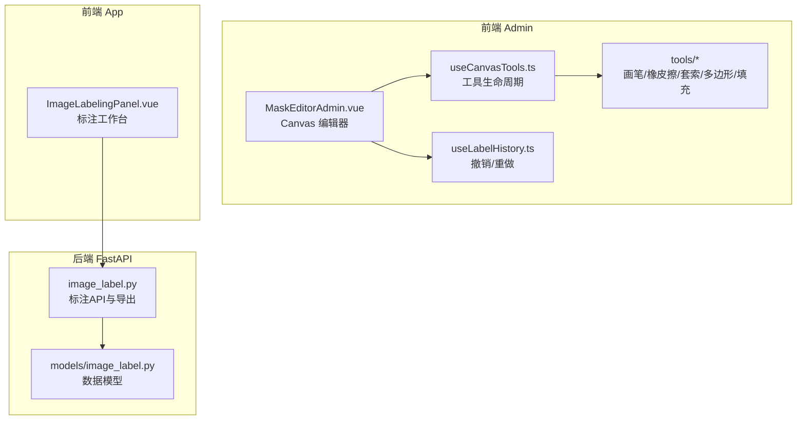
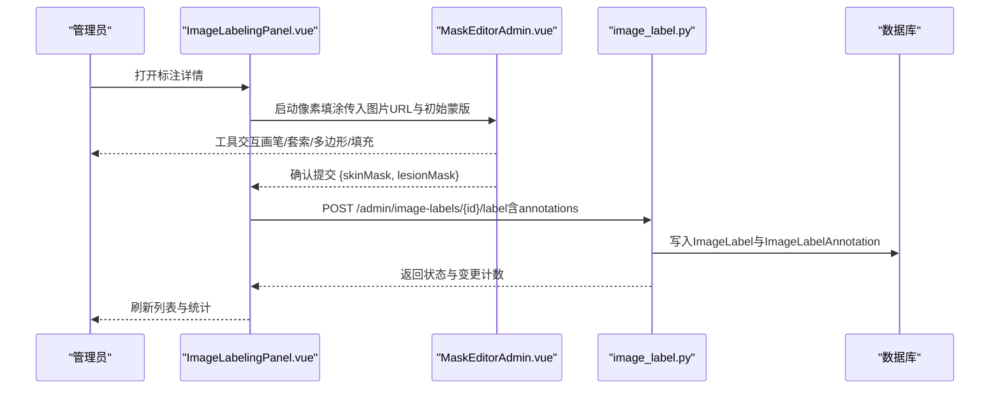
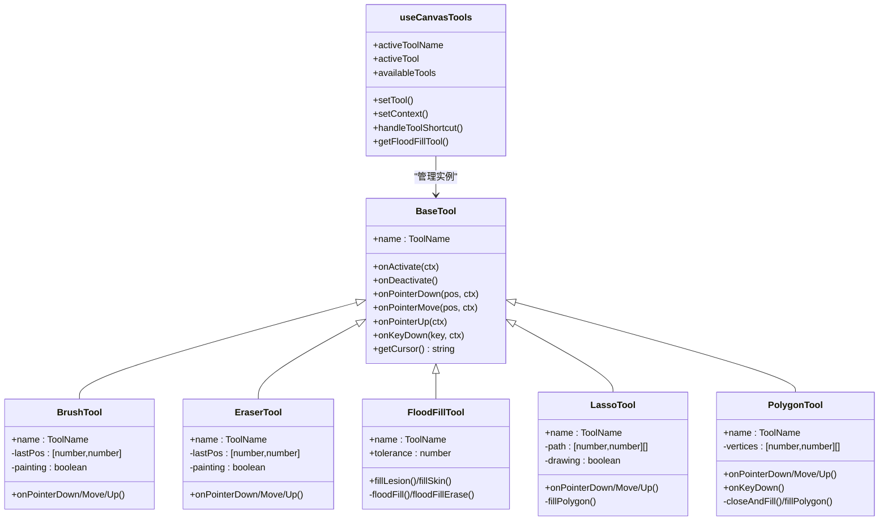
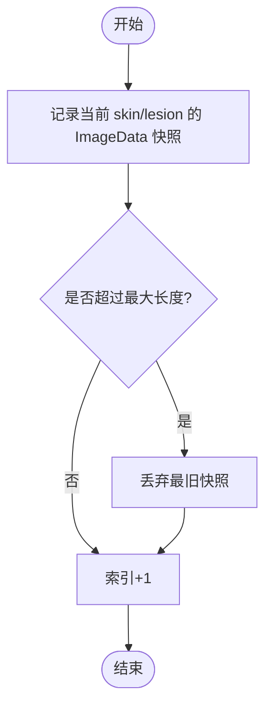
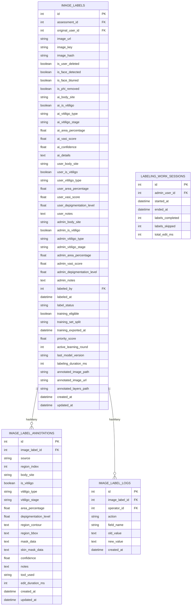
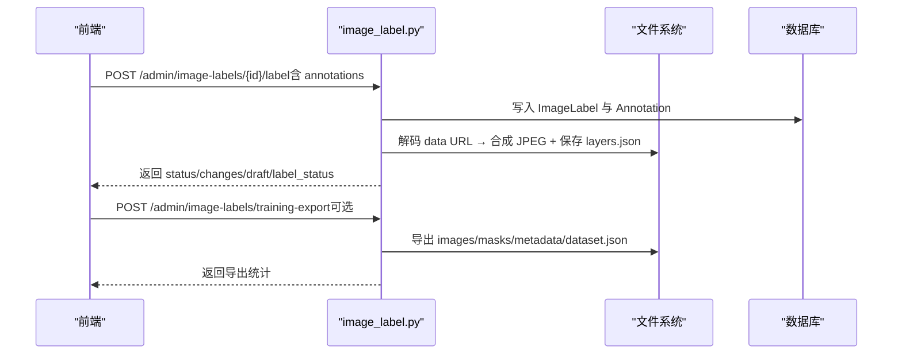
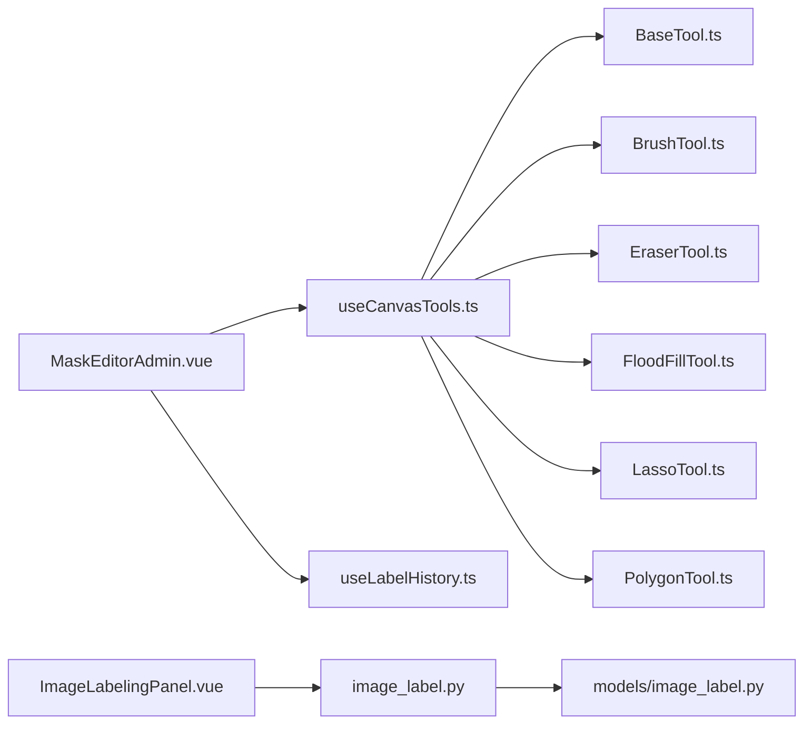

# 图像标注

<cite>
**本文引用的文件**   
- [BaseTool.ts](file://web/admin/src/components/labeling/tools/BaseTool.ts)
- [BrushTool.ts](file://web/admin/src/components/labeling/tools/BrushTool.ts)
- [EraserTool.ts](file://web/admin/src/components/labeling/tools/EraserTool.ts)
- [FloodFillTool.ts](file://web/admin/src/components/labeling/tools/FloodFillTool.ts)
- [LassoTool.ts](file://web/admin/src/components/labeling/tools/LassoTool.ts)
- [PolygonTool.ts](file://web/admin/src/components/labeling/tools/PolygonTool.ts)
- [useCanvasTools.ts](file://web/admin/src/composables/useCanvasTools.ts)
- [useLabelHistory.ts](file://web/admin/src/composables/useLabelHistory.ts)
- [MaskEditorAdmin.vue](file://web/admin/src/components/labeling/MaskEditorAdmin.vue)
- [ImageLabelingPanel.vue](file://web/app/src/components/image-label/ImageLabelingPanel.vue)
- [image_label.py](file://web/backend/api/image_label.py)
- [image_label.py（模型）](file://web/backend/models/image_label.py)
- [labeling.ts（前端API客户端）](file://web/admin/src/api/labeling.ts)
</cite>

## 目录
1. [简介](#简介)
2. [项目结构](#项目结构)
3. [核心组件](#核心组件)
4. [架构总览](#架构总览)
5. [详细组件分析](#详细组件分析)
6. [依赖关系分析](#依赖关系分析)
7. [性能考量](#性能考量)
8. [故障排查指南](#故障排查指南)
9. [结论](#结论)
10. [附录](#附录)

## 简介
本技术文档面向 Subskin 图像标注系统，聚焦于 Canvas 图像编辑工具、标注工具集（画笔、套索、多边形、填充等）、标注历史管理、标注数据结构、质量检查、批量标注处理与结果导出。同时涵盖图像预处理、标注模板管理、协作工作流与质量控制流程，并提供标注工具的 API 接口、自定义工具开发与数据集管理的实践指南。

## 项目结构
Subskin 的图像标注能力由“前端标注编辑器 + 后端标注服务”组成：
- 前端（admin 应用）提供基于 Canvas 的像素级标注工具与交互界面，支持撤销/重做、缩放平移、图层叠加与统计。
- 前端（app 应用）提供管理员审核与标注工作台，集成 AI 预标注、表单填写与提交。
- 后端（FastAPI）提供图片打标列表、详情、提交、训练数据导出、合成图生成等接口，并维护三级标注数据（AI/用户/管理员）。

**图表来源** 
- [MaskEditorAdmin.vue](file://web/admin/src/components/labeling/MaskEditorAdmin.vue)
- [useCanvasTools.ts](file://web/admin/src/composables/useCanvasTools.ts)
- [BaseTool.ts](file://web/admin/src/components/labeling/tools/BaseTool.ts)
- [useLabelHistory.ts](file://web/admin/src/composables/useLabelHistory.ts)
- [ImageLabelingPanel.vue](file://web/app/src/components/image-label/ImageLabelingPanel.vue)
- [image_label.py](file://web/backend/api/image_label.py)
- [image_label.py（模型）](file://web/backend/models/image_label.py)

**章节来源**
- [MaskEditorAdmin.vue](file://web/admin/src/components/labeling/MaskEditorAdmin.vue)
- [useCanvasTools.ts](file://web/admin/src/composables/useCanvasTools.ts)
- [ImageLabelingPanel.vue](file://web/app/src/components/image-label/ImageLabelingPanel.vue)
- [image_label.py](file://web/backend/api/image_label.py)
- [image_label.py（模型）](file://web/backend/models/image_label.py)

## 核心组件
- Canvas 编辑器 MaskEditorAdmin：负责三画布（皮肤层、白斑层、叠加层）渲染、坐标转换、缩放平移、键盘快捷键、区域面积统计与确认提交。
- 工具系统 useCanvasTools：管理工具实例、激活/停用、上下文注入、快捷键切换与光标更新。
- 工具实现 BaseTool 与各具体工具：统一接口定义，分别实现自由绘制、橡皮擦、智能填充、套索选择、多边形选择等。
- 标注历史 useLabelHistory：环形缓冲区保存 skin/lesion 的 ImageData 快照，支持撤销/重做。
- 标注工作台 ImageLabelingPanel：列表筛选、详情查看、AI 预标注、表单填写、批量操作与提交。
- 后端 image_label.py：标注 CRUD、合成图生成、训练数据导出、同步评估数据、审计日志。
- 数据模型 models/image_label.py：ImageLabel、ImageLabelAnnotation、ImageLabelLog、LabelingWorkSession 等表结构与字段。

**章节来源**
- [MaskEditorAdmin.vue](file://web/admin/src/components/labeling/MaskEditorAdmin.vue)
- [useCanvasTools.ts](file://web/admin/src/composables/useCanvasTools.ts)
- [BaseTool.ts](file://web/admin/src/components/labeling/tools/BaseTool.ts)
- [useLabelHistory.ts](file://web/admin/src/composables/useLabelHistory.ts)
- [ImageLabelingPanel.vue](file://web/app/src/components/image-label/ImageLabelingPanel.vue)
- [image_label.py](file://web/backend/api/image_label.py)
- [image_label.py（模型）](file://web/backend/models/image_label.py)

## 架构总览
标注系统采用“前端工具化 + 后端结构化存储”的分层架构：
- 前端通过统一的 ToolContext 暴露画布、尺寸、坐标转换、覆盖绘制、快照与面积更新能力；各工具仅关注自身交互逻辑。
- 后端以 Pydantic Schema 校验请求体，SQLAlchemy ORM 持久化，Pillow 合成标注产物，支持导出训练集。

**图表来源** 
- [ImageLabelingPanel.vue](file://web/app/src/components/image-label/ImageLabelingPanel.vue)
- [MaskEditorAdmin.vue](file://web/admin/src/components/labeling/MaskEditorAdmin.vue)
- [image_label.py](file://web/backend/api/image_label.py)

## 详细组件分析

### Canvas 编辑器与工具系统
- MaskEditorAdmin 构建 ToolContext，封装 clientToImage、drawOverlay、snapshot、updateAreas 等能力，并将指针事件委托给 activeTool。
- useCanvasTools 维护 toolInstances 映射，提供 setTool、setContext、handleToolShortcut、getFloodFillTool 等方法。
- BaseTool 定义工具接口（name、onActivate/onDeactivate、onPointerDown/Move/Up、onKeyDown、getCursor），ALL_TOOLS 声明可用工具与快捷键。

**图表来源** 
- [BaseTool.ts](file://web/admin/src/components/labeling/tools/BaseTool.ts)
- [BrushTool.ts](file://web/admin/src/components/labeling/tools/BrushTool.ts)
- [EraserTool.ts](file://web/admin/src/components/labeling/tools/EraserTool.ts)
- [FloodFillTool.ts](file://web/admin/src/components/labeling/tools/FloodFillTool.ts)
- [LassoTool.ts](file://web/admin/src/components/labeling/tools/LassoTool.ts)
- [PolygonTool.ts](file://web/admin/src/components/labeling/tools/PolygonTool.ts)
- [useCanvasTools.ts](file://web/admin/src/composables/useCanvasTools.ts)

**章节来源**
- [MaskEditorAdmin.vue](file://web/admin/src/components/labeling/MaskEditorAdmin.vue)
- [useCanvasTools.ts](file://web/admin/src/composables/useCanvasTools.ts)
- [BaseTool.ts](file://web/admin/src/components/labeling/tools/BaseTool.ts)

### 标注历史管理（撤销/重做）
- useLabelHistory 使用环形缓冲区保存 skin/lesion 的 ImageData 快照，限制最大长度，支持 undo/redo/reset。
- MaskEditorAdmin 在每次有效绘制后调用 snapshot，并在撤销/重做时恢复图层并重新绘制叠加层与更新面积统计。

**图表来源** 
- [useLabelHistory.ts](file://web/admin/src/composables/useLabelHistory.ts)

**章节来源**
- [useLabelHistory.ts](file://web/admin/src/composables/useLabelHistory.ts)
- [MaskEditorAdmin.vue](file://web/admin/src/components/labeling/MaskEditorAdmin.vue)

### 标注数据结构与存储
- ImageLabel：主表，包含 AI/用户/管理员三级标注字段、隐私标记、训练标记、主动学习字段、标注产物路径等。
- ImageLabelAnnotation：细粒度标注记录，支持多处白斑独立标注，包含 mask_data/skin_mask_data、轮廓/边界框、置信度、工具追踪等。
- ImageLabelLog：不可变操作日志，记录字段变更与操作人。
- LabelingWorkSession：工作会话统计，用于效率与生产力度量。

**图表来源** 
- [image_label.py（模型）](file://web/backend/models/image_label.py)

**章节来源**
- [image_label.py（模型）](file://web/backend/models/image_label.py)

### 标注质量检查与协作工作流
- 质量检查：
  - 前端实时统计皮肤区域、白斑区域与联合区域占比，辅助判断标注合理性。
  - 后端支持训练就绪标记与优先级分数，结合主动学习队列提升标注质量。
- 协作工作流：
  - AI 自动识别 → 用户校准 → 管理员审核标注，形成三级标注链路。
  - 支持草稿模式（draft_mode）保存进度，不改变最终状态，便于多人协作与迭代。

**章节来源**
- [MaskEditorAdmin.vue](file://web/admin/src/components/labeling/MaskEditorAdmin.vue)
- [image_label.py](file://web/backend/api/image_label.py)
- [image_label.py（模型）](file://web/backend/models/image_label.py)

### 批量标注处理与结果导出
- 批量操作：支持批量跳过/拒绝，快速推进队列。
- 训练数据导出：按比例划分 train/val/test，可选择包含 AI/用户数据，仅导出管理员已标注样本，输出结构化数据集。
- 合成图生成：将原始图像与管理员蒙版叠加生成 JPEG 预览，并保存 layers manifest JSON 指向 skin/lesion mask PNG。

**图表来源** 
- [image_label.py](file://web/backend/api/image_label.py)

**章节来源**
- [image_label.py](file://web/backend/api/image_label.py)

### 图像预处理与标注模板管理
- 图像预处理：
  - 前端加载原图到隐藏 canvas，读取像素用于智能填充容差计算。
  - 后端根据 image_url 解析本地路径或远程下载，确保可被 Pillow 读取。
- 标注模板管理：
  - 前端 ALL_TOOLS 集中声明工具元数据（名称、图标、快捷键、可用性），便于扩展。
  - 后端 Choices（身体部位、分型、阶段）作为下拉选项，保证标注一致性。

**章节来源**
- [FloodFillTool.ts](file://web/admin/src/components/labeling/tools/FloodFillTool.ts)
- [image_label.py](file://web/backend/api/image_label.py)
- [image_label.py（模型）](file://web/backend/models/image_label.py)

### 标注工具的 API 接口与自定义开发
- 前端 API 客户端（admin）：
  - fetchLabelList/fetchLabelStats/fetchLabelDetail/fetchLabelAnnotations/submitLabel/fetchQueue/fetchTrainingDashboard/syncTrainingSamples/startWorkSession/endWorkSession
- 自定义工具开发：
  - 实现 BaseTool 接口，注册到 toolInstances，并在 ALL_TOOLS 中声明元数据。
  - 利用 ToolContext 提供的 skinCanvas/lesionCanvas/overlayCanvas/naturalSize/brushSize/transform/clientToImage/drawOverlay/snapshot/updateAreas 完成绘制与状态管理。

**章节来源**
- [labeling.ts（前端API客户端）](file://web/admin/src/api/labeling.ts)
- [BaseTool.ts](file://web/admin/src/components/labeling/tools/BaseTool.ts)
- [useCanvasTools.ts](file://web/admin/src/composables/useCanvasTools.ts)

### 标注数据集管理
- 数据集结构：images（原图）、masks（二值掩码）、metadata（每样本 JSON）、dataset.json（索引）。
- 导出策略：过滤最小面积阈值、统计各部位分布、累计标注像素数，便于后续训练与评估。

**章节来源**
- [image_label.py](file://web/backend/api/image_label.py)
- [vasi_data_flywheel.py](file://scripts/vasi_data_flywheel.py)

## 依赖关系分析
- 前端依赖：Vue 3、Canvas API、TypeScript、Vite 构建。
- 后端依赖：FastAPI、SQLAlchemy、Pydantic、Pillow、httpx。
- 模块耦合：
  - MaskEditorAdmin 强依赖 useCanvasTools 与 tools/*，弱依赖 useLabelHistory。
  - ImageLabelingPanel 依赖 image_label.py 的标注 API。
  - image_label.py 依赖 models/image_label.py 与文件系统。

**图表来源** 
- [MaskEditorAdmin.vue](file://web/admin/src/components/labeling/MaskEditorAdmin.vue)
- [useCanvasTools.ts](file://web/admin/src/composables/useCanvasTools.ts)
- [BaseTool.ts](file://web/admin/src/components/labeling/tools/BaseTool.ts)
- [BrushTool.ts](file://web/admin/src/components/labeling/tools/BrushTool.ts)
- [EraserTool.ts](file://web/admin/src/components/labeling/tools/EraserTool.ts)
- [FloodFillTool.ts](file://web/admin/src/components/labeling/tools/FloodFillTool.ts)
- [LassoTool.ts](file://web/admin/src/components/labeling/tools/LassoTool.ts)
- [PolygonTool.ts](file://web/admin/src/components/labeling/tools/PolygonTool.ts)
- [useLabelHistory.ts](file://web/admin/src/composables/useLabelHistory.ts)
- [ImageLabelingPanel.vue](file://web/app/src/components/image-label/ImageLabelingPanel.vue)
- [image_label.py](file://web/backend/api/image_label.py)
- [image_label.py（模型）](file://web/backend/models/image_label.py)

**章节来源**
- [MaskEditorAdmin.vue](file://web/admin/src/components/labeling/MaskEditorAdmin.vue)
- [useCanvasTools.ts](file://web/admin/src/composables/useCanvasTools.ts)
- [image_label.py](file://web/backend/api/image_label.py)
- [image_label.py（模型）](file://web/backend/models/image_label.py)

## 性能考量
- 前端性能：
  - 使用 willReadFrequently 优化频繁读写的 Canvas 上下文。
  - 智能填充设置 MAX_ITERATIONS 防止超大图像导致卡顿。
  - 历史记录限制最大长度，避免内存膨胀。
- 后端性能：
  - 合成图生成按需进行，失败非阻塞，保障主流程稳定。
  - 训练导出分批处理，减少单次 I/O 压力。
- 建议：
  - 对超大图像进行分辨率降级或分块处理。
  - 缓存常用工具上下文与裁剪区域，减少重复计算。

[本节为通用指导，无需特定文件引用]

## 故障排查指南
- 常见问题：
  - 图片加载失败：检查 imageUrl 与跨域策略，重试加载机制。
  - 智能填充无效果：调整 tolerance，确认原图像素缓存成功。
  - 撤销/重做无效：确认 snapshot 调用时机与历史索引正确。
  - 合成图生成失败：检查 Pillow 安装与原图路径解析。
- 定位方法：
  - 查看控制台日志（如 FloodFill 迭代次数、mask_data 长度）。
  - 检查后端日志与数据库记录（ImageLabelAnnotation 是否存在）。

**章节来源**
- [FloodFillTool.ts](file://web/admin/src/components/labeling/tools/FloodFillTool.ts)
- [useLabelHistory.ts](file://web/admin/src/composables/useLabelHistory.ts)
- [image_label.py](file://web/backend/api/image_label.py)

## 结论
Subskin 图像标注系统通过模块化 Canvas 工具与结构化后端存储，实现了高效、可扩展的像素级标注能力。其三层标注链路、质量检查与导出机制为 VASI 模型训练提供了高质量数据基础。未来可进一步引入主动学习与自动化质检，提升标注效率与一致性。

[本节为总结性内容，无需特定文件引用]

## 附录
- 快捷键参考：数字键 1-6 快速切换工具，Shift+点击填充皮肤，Esc 取消绘制。
- 工具扩展清单：新增工具需实现 BaseTool 接口，注册到 toolInstances 与 ALL_TOOLS。
- 数据集导出参数：split_ratio、include_ai、include_user、only_admin_labeled。

[本节为补充信息，无需特定文件引用]