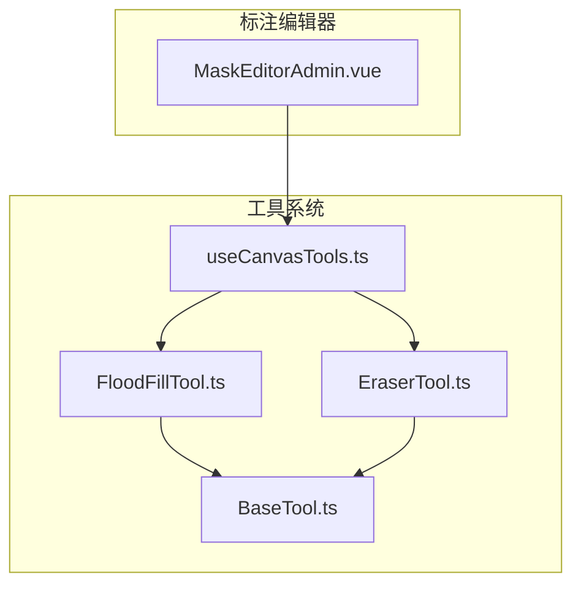
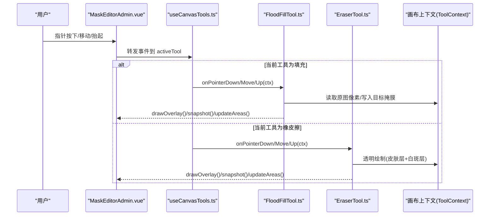
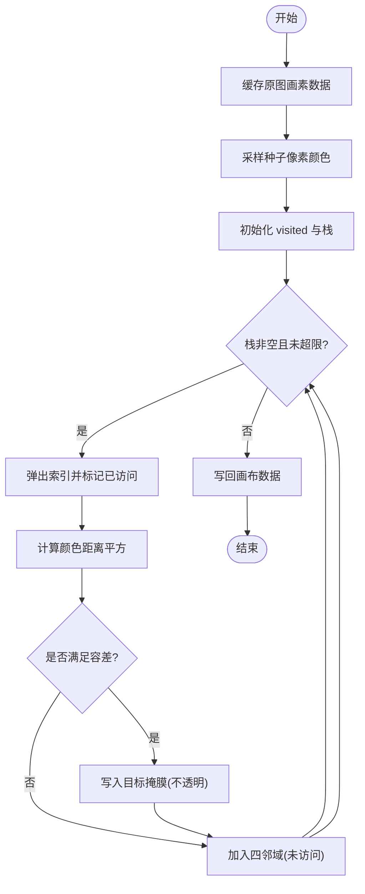
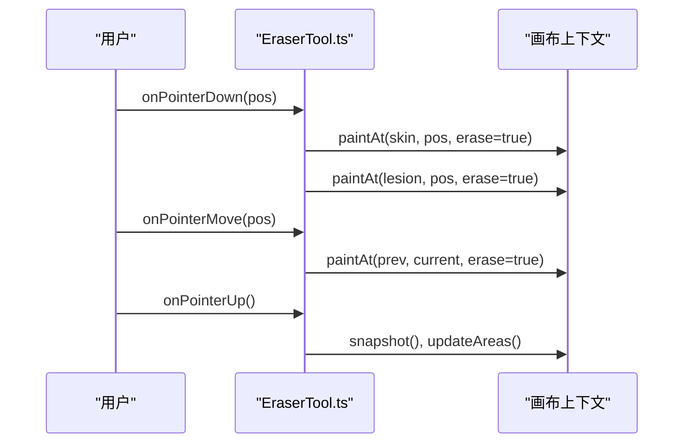
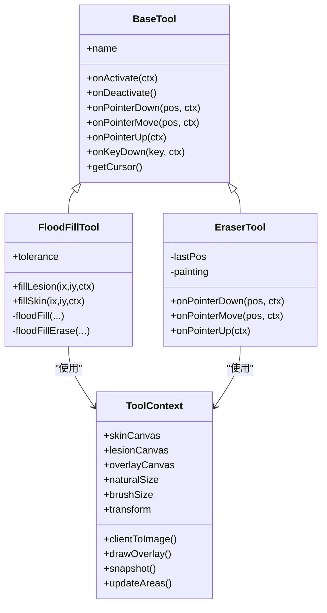

# 填充与擦除工具

<cite>
**本文引用的文件**
- [FloodFillTool.ts](file://web/admin/src/components/labeling/tools/FloodFillTool.ts)
- [EraserTool.ts](file://web/admin/src/components/labeling/tools/EraserTool.ts)
- [BaseTool.ts](file://web/admin/src/components/labeling/tools/BaseTool.ts)
- [useCanvasTools.ts](file://web/admin/src/composables/useCanvasTools.ts)
- [MaskEditorAdmin.vue](file://web/admin/src/components/labeling/MaskEditorAdmin.vue)
</cite>

## 目录
1. [简介](#简介)
2. [项目结构](#项目结构)
3. [核心组件](#核心组件)
4. [架构总览](#架构总览)
5. [详细组件分析](#详细组件分析)
6. [依赖关系分析](#依赖关系分析)
7. [性能考量](#性能考量)
8. [故障排查指南](#故障排查指南)
9. [结论](#结论)
10. [附录](#附录)

## 简介
本技术文档聚焦 Subskin 图像标注系统中的“填充与擦除”能力，围绕以下两个核心工具展开：
- 智能填充工具（FloodFillTool）：基于种子点检测、颜色阈值匹配、连通区域识别的泛洪算法，提供容差控制与迭代上限保护。
- 橡皮擦工具（EraserTool）：在皮肤层与白斑层同时执行像素清除，支持画笔大小与透明度控制，具备平滑绘制体验。

文档将深入解析算法实现、参数配置、性能优化与错误处理策略，帮助开发者理解并扩展该子系统。

## 项目结构
与填充与擦除相关的代码主要位于前端管理端（admin）的标注编辑器中，采用“工具接口 + 具体工具实现 + 画布上下文 + 编辑器宿主”的分层组织方式：
- 工具接口与定义：BaseTool.ts
- 工具实例：FloodFillTool.ts、EraserTool.ts
- 工具生命周期与切换：useCanvasTools.ts
- 编辑器宿主与交互：MaskEditorAdmin.vue

图表来源
- [MaskEditorAdmin.vue:1-120](file://web/admin/src/components/labeling/MaskEditorAdmin.vue#L1-L120)
- [useCanvasTools.ts:1-127](file://web/admin/src/composables/useCanvasTools.ts#L1-L127)
- [BaseTool.ts:1-72](file://web/admin/src/components/labeling/tools/BaseTool.ts#L1-L72)
- [FloodFillTool.ts:1-265](file://web/admin/src/components/labeling/tools/FloodFillTool.ts#L1-L265)
- [EraserTool.ts:1-92](file://web/admin/src/components/labeling/tools/EraserTool.ts#L1-L92)

章节来源
- [MaskEditorAdmin.vue:1-200](file://web/admin/src/components/labeling/MaskEditorAdmin.vue#L1-L200)
- [useCanvasTools.ts:1-127](file://web/admin/src/composables/useCanvasTools.ts#L1-L127)
- [BaseTool.ts:1-72](file://web/admin/src/components/labeling/tools/BaseTool.ts#L1-L72)

## 核心组件
- FloodFillTool：实现点击式智能填充，支持容差调节、最大迭代次数保护、对侧图层同步擦除。
- EraserTool：实现橡皮擦功能，同时对皮肤层和白斑层进行透明化绘制，支持画笔大小与圆角平滑。
- BaseTool：定义工具统一接口与上下文对象，包含双掩膜画布、叠加画布、坐标转换、历史快照等能力。
- useCanvasTools：维护工具实例、激活/停用生命周期、快捷键切换、获取特定工具实例。
- MaskEditorAdmin.vue：编辑器宿主，负责事件分发、画布合成、区域统计、工具参数绑定（如容差滑块）。

章节来源
- [FloodFillTool.ts:22-182](file://web/admin/src/components/labeling/tools/FloodFillTool.ts#L22-L182)
- [EraserTool.ts:42-92](file://web/admin/src/components/labeling/tools/EraserTool.ts#L42-L92)
- [BaseTool.ts:9-72](file://web/admin/src/components/labeling/tools/BaseTool.ts#L9-L72)
- [useCanvasTools.ts:16-127](file://web/admin/src/composables/useCanvasTools.ts#L16-L127)
- [MaskEditorAdmin.vue:20-180](file://web/admin/src/components/labeling/MaskEditorAdmin.vue#L20-L180)

## 架构总览
填充与擦除工具通过统一的 ToolContext 访问底层画布资源，由编辑器宿主统一调度事件，工具内部完成像素级操作与状态更新。

图表来源
- [MaskEditorAdmin.vue:181-220](file://web/admin/src/components/labeling/MaskEditorAdmin.vue#L181-L220)
- [useCanvasTools.ts:87-105](file://web/admin/src/composables/useCanvasTools.ts#L87-L105)
- [FloodFillTool.ts:67-182](file://web/admin/src/components/labeling/tools/FloodFillTool.ts#L67-L182)
- [EraserTool.ts:55-82](file://web/admin/src/components/labeling/tools/EraserTool.ts#L55-L82)

## 详细组件分析

### 智能填充工具（FloodFillTool）
- 种子点检测：从原始图像的隐藏画布采样种子像素颜色，避免受已绘制掩膜影响。
- 颜色阈值匹配：计算当前像素与种子像素的 RGB 距离平方，并与容差平方比较，决定是否纳入连通区域。
- 连通区域识别：使用显式栈实现的 4-连通泛洪遍历，记录 visited 数组防止重复入栈。
- 边界优化与防护：设置最大迭代次数上限，避免超大图像或极端容差导致长时间运行；到达上限时输出警告日志。
- 对侧图层同步擦除：填充白斑后，自动在皮肤层对应区域执行透明化，保持两掩膜互斥。
- 参数配置：
  - 容差 tolerance：默认值与范围由工具与 UI 共同约束，支持键盘按键快速调整。
  - 最大迭代 MAX_ITERATIONS：内置安全阀，防止栈溢出或无限循环。
- 交互流程：
  - 单击：填充白斑层，并在皮肤层擦除同区域。
  - Shift+单击：填充皮肤层，并在白斑层擦除同区域。
  - 键盘：方括号键调整容差。

图表来源
- [FloodFillTool.ts:117-182](file://web/admin/src/components/labeling/tools/FloodFillTool.ts#L117-L182)

章节来源
- [FloodFillTool.ts:22-265](file://web/admin/src/components/labeling/tools/FloodFillTool.ts#L22-L265)
- [MaskEditorAdmin.vue:26-38](file://web/admin/src/components/labeling/MaskEditorAdmin.vue#L26-L38)
- [MaskEditorAdmin.vue:181-204](file://web/admin/src/components/labeling/MaskEditorAdmin.vue#L181-L204)

### 橡皮擦工具（EraserTool）
- 像素清除算法：通过 Canvas 2D 的 destination-out 混合模式，将指定区域像素透明度置零，实现擦除效果。
- 边缘平滑处理：使用 lineCap/lineJoin 为 round，绘制线段与圆形覆盖，确保拖拽路径连续平滑。
- 透明度控制：通过全局合成模式切换 source-over/destination-out，配合画笔尺寸控制擦除强度与范围。
- 同步擦除：同时在皮肤层与白斑层执行擦除，保证两掩膜一致性。
- 交互流程：
  - 按下：记录起始点，立即在两点位置绘制擦除。
  - 移动：在上一次点与当前点之间绘制线段，并追加圆形覆盖。
  - 抬起：提交历史快照并更新区域统计。

图表来源
- [EraserTool.ts:16-40](file://web/admin/src/components/labeling/tools/EraserTool.ts#L16-L40)
- [EraserTool.ts:55-82](file://web/admin/src/components/labeling/tools/EraserTool.ts#L55-L82)

章节来源
- [EraserTool.ts:1-92](file://web/admin/src/components/labeling/tools/EraserTool.ts#L1-L92)
- [MaskEditorAdmin.vue:534-553](file://web/admin/src/components/labeling/MaskEditorAdmin.vue#L534-L553)

### 工具接口与上下文（BaseTool 与 ToolContext）
- 工具接口：统一声明 onActivate/onDeactivate、onPointerDown/Move/Up、onKeyDown、getCursor 等方法，便于宿主统一管理。
- 上下文对象：封装 skinCanvas、lesionCanvas、overlayCanvas、naturalSize、brushSize、transform、clientToImage、drawOverlay、snapshot、updateAreas 等能力，供工具直接调用。
- 工具注册与切换：useCanvasTools 维护工具实例映射，提供 setTool/setContext 与快捷键处理。

章节来源
- [BaseTool.ts:9-72](file://web/admin/src/components/labeling/tools/BaseTool.ts#L9-L72)
- [useCanvasTools.ts:16-127](file://web/admin/src/composables/useCanvasTools.ts#L16-L127)

### 编辑器宿主（MaskEditorAdmin.vue）
- 事件分发：将指针事件转换为自然坐标后转发给当前活动工具。
- 叠加渲染：将皮肤层与白斑层按透明度合成至 overlayCanvas。
- 区域统计：分别统计皮肤、白斑及并集区域的像素占比。
- 参数绑定：将填充容差滑块与 FloodFillTool.tolerance 双向绑定；画笔大小与图层透明度可实时调整。
- 历史与撤销重做：通过 snapshot/undo/redo 维护编辑历史。

章节来源
- [MaskEditorAdmin.vue:110-180](file://web/admin/src/components/labeling/MaskEditorAdmin.vue#L110-L180)
- [MaskEditorAdmin.vue:295-313](file://web/admin/src/components/labeling/MaskEditorAdmin.vue#L295-L313)
- [MaskEditorAdmin.vue:534-553](file://web/admin/src/components/labeling/MaskEditorAdmin.vue#L534-L553)

## 依赖关系分析
- FloodFillTool 依赖 ToolContext 提供的画布与坐标转换能力，并通过隐藏的临时画布读取原图画素。
- EraserTool 依赖 Canvas 2D API 的混合模式与路径绘制能力。
- 两者均通过 useCanvasTools 被宿主激活与调度。
- 编辑器宿主负责 UI 参数与工具状态的绑定，以及画布合成与统计。

图表来源
- [BaseTool.ts:9-72](file://web/admin/src/components/labeling/tools/BaseTool.ts#L9-L72)
- [FloodFillTool.ts:22-265](file://web/admin/src/components/labeling/tools/FloodFillTool.ts#L22-L265)
- [EraserTool.ts:42-92](file://web/admin/src/components/labeling/tools/EraserTool.ts#L42-L92)

章节来源
- [useCanvasTools.ts:16-127](file://web/admin/src/composables/useCanvasTools.ts#L16-L127)
- [MaskEditorAdmin.vue:1-120](file://web/admin/src/components/labeling/MaskEditorAdmin.vue#L1-L120)

## 性能考量
- 泛洪算法复杂度：时间复杂度近似 O(N)，N 为连通区域像素数；空间复杂度取决于 visited 数组与栈深度。
- 迭代上限保护：MAX_ITERATIONS 限制单次填充的最大处理量，避免浏览器主线程阻塞。
- 内存占用：visited 使用 Uint8Array，降低内存开销；ImageData 频繁读写可能带来 GC 压力，建议在大图上谨慎使用高容差。
- 绘制性能：橡皮擦使用路径绘制与圆形填充，注意画笔大小与频率对帧率的影响；可通过减少不必要的 putImageData 与合并绘制批次提升性能。
- 缩放与坐标转换：宿主提供 clientToImage 将屏幕坐标映射到自然图像坐标，确保在不同缩放级别下精度一致。

[本节为通用性能讨论，无需特定文件引用]

## 故障排查指南
- 填充未生效
  - 检查原图画素缓存是否成功：确认临时画布创建与 drawImage 成功，imageData 非空。
  - 检查容差设置：容差过小可能导致无法匹配相邻像素。
  - 检查坐标转换：确认点击坐标落在有效范围内。
- 填充卡顿或超时
  - 观察是否达到 MAX_ITERATIONS：若触发上限，说明区域过大或容差过高，需调小容差或分块处理。
  - 监控浏览器控制台日志：查看迭代计数与警告信息。
- 橡皮擦无效
  - 检查 globalCompositeOperation 是否正确设置为 destination-out。
  - 确认画笔大小与绘制路径是否覆盖目标区域。
- 区域统计异常
  - 检查 alpha 通道阈值判断逻辑，确保统计口径一致。
  - 确认叠加渲染顺序与透明度设置正确。

章节来源
- [FloodFillTool.ts:176-182](file://web/admin/src/components/labeling/tools/FloodFillTool.ts#L176-L182)
- [MaskEditorAdmin.vue:125-155](file://web/admin/src/components/labeling/MaskEditorAdmin.vue#L125-L155)

## 结论
Subskin 的填充与擦除工具以清晰的工具接口与上下文抽象为基础，实现了高效、可控的像素级编辑能力。智能填充通过容差与迭代上限保障稳定性，橡皮擦通过混合模式与路径平滑提供良好交互体验。结合编辑器的参数绑定与历史机制，整体方案兼顾性能与可用性，适合大规模医学图像标注场景。

[本节为总结性内容，无需特定文件引用]

## 附录

### 参数配置与自定义选项
- 填充容差（tolerance）
  - 默认值：24
  - 可调范围：2–64（UI 滑块），键盘按键每次 ±4
  - 作用：控制颜色匹配阈值，越大越宽松
- 最大迭代次数（MAX_ITERATIONS）
  - 默认值：5,000,000
  - 作用：防止超大图像或极端容差导致的长时间运行
- 橡皮擦画笔大小（brushSize）
  - 可调范围：8–80（UI 滑块）
  - 作用：控制擦除半径
- 图层透明度（layerOpacity）
  - 可调范围：0.2–0.95（UI 滑块）
  - 作用：控制叠加显示时的可见度，便于精细标注

章节来源
- [FloodFillTool.ts:24-25](file://web/admin/src/components/labeling/tools/FloodFillTool.ts#L24-L25)
- [FloodFillTool.ts:19-20](file://web/admin/src/components/labeling/tools/FloodFillTool.ts#L19-L20)
- [MaskEditorAdmin.vue:23-24](file://web/admin/src/components/labeling/MaskEditorAdmin.vue#L23-L24)
- [MaskEditorAdmin.vue:534-553](file://web/admin/src/components/labeling/MaskEditorAdmin.vue#L534-L553)