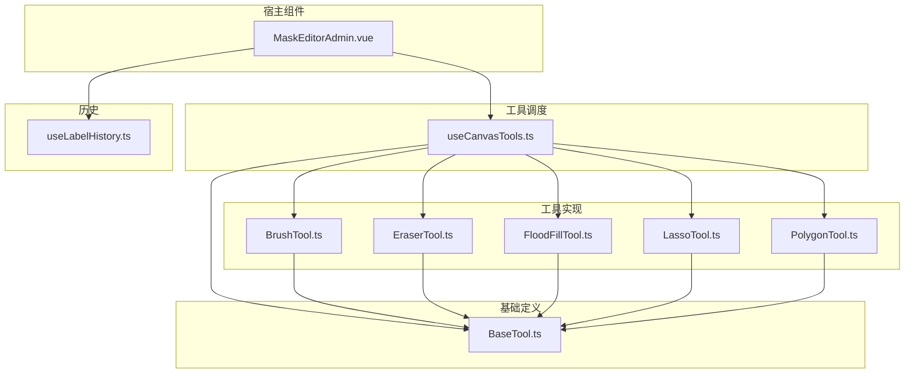
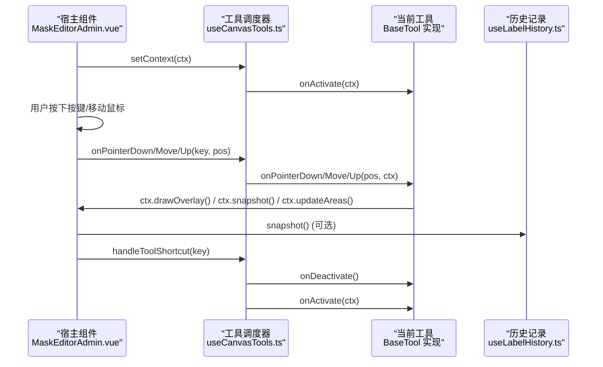
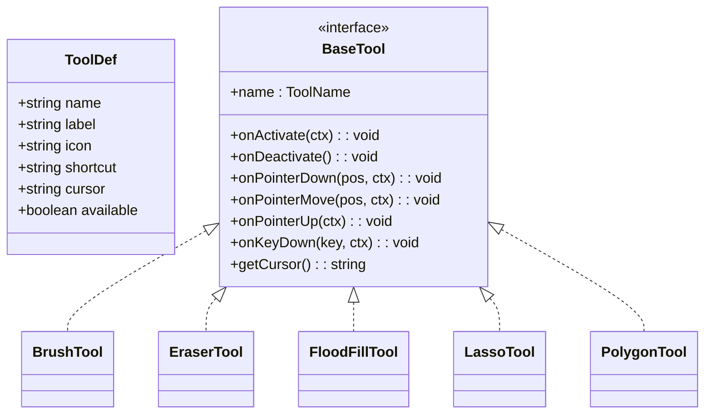
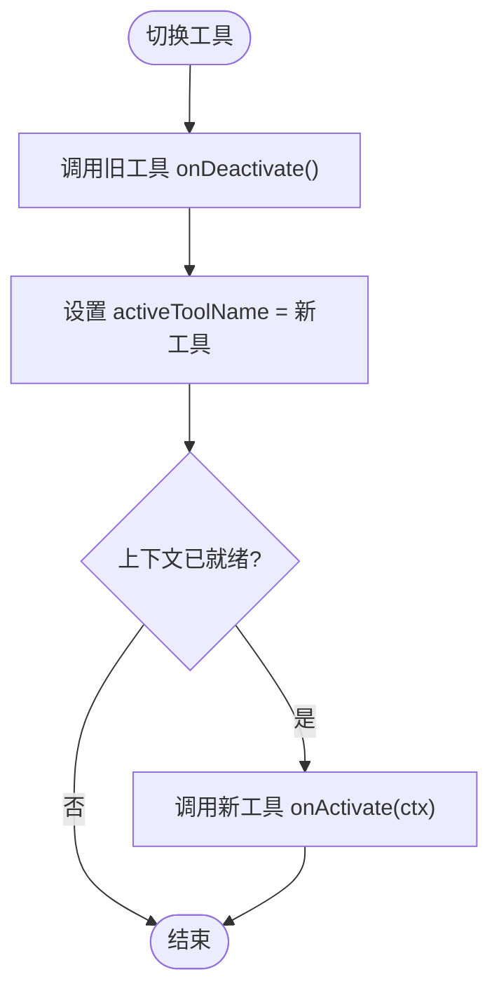
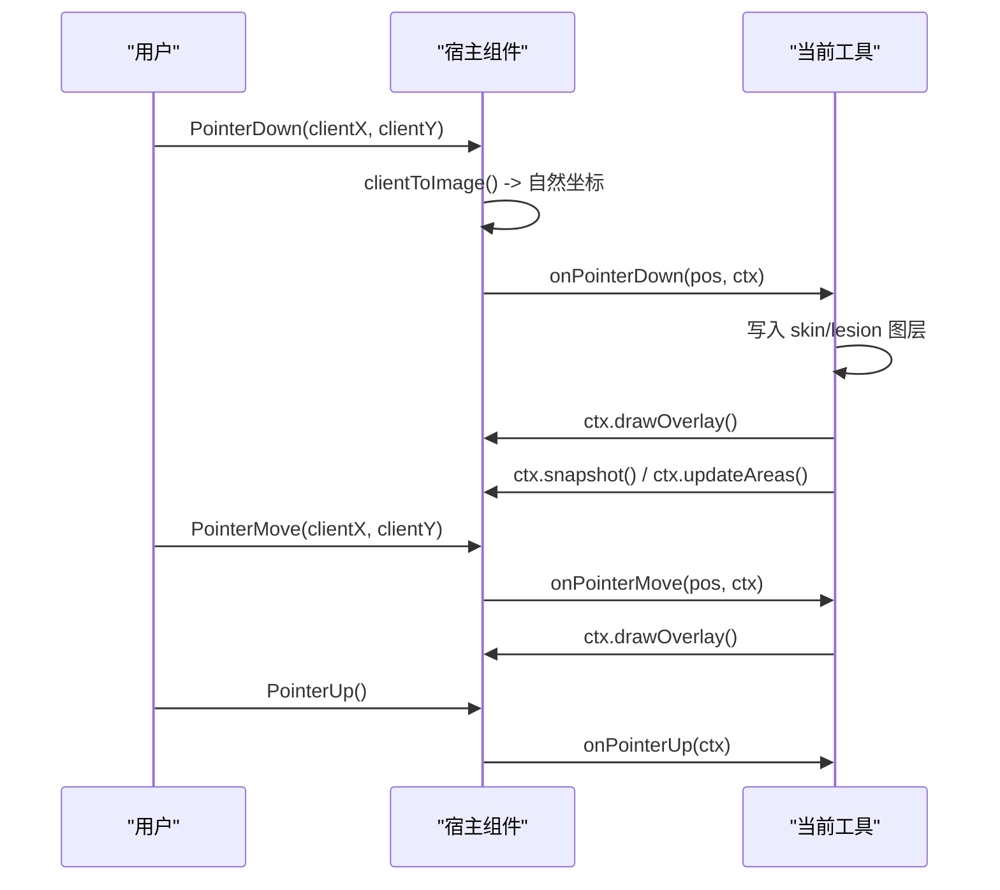
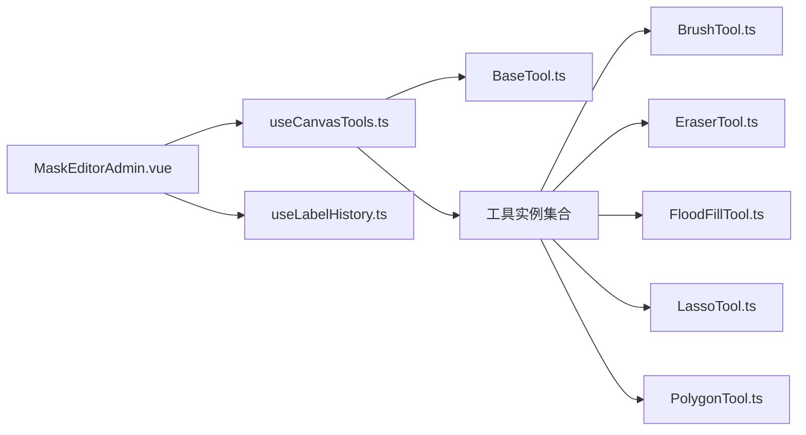

# 工具基类框架

<cite>
**本文引用的文件**
- [BaseTool.ts](file://web/admin/src/components/labeling/tools/BaseTool.ts)
- [BrushTool.ts](file://web/admin/src/components/labeling/tools/BrushTool.ts)
- [EraserTool.ts](file://web/admin/src/components/labeling/tools/EraserTool.ts)
- [FloodFillTool.ts](file://web/admin/src/components/labeling/tools/FloodFillTool.ts)
- [LassoTool.ts](file://web/admin/src/components/labeling/tools/LassoTool.ts)
- [PolygonTool.ts](file://web/admin/src/components/labeling/tools/PolygonTool.ts)
- [useCanvasTools.ts](file://web/admin/src/composables/useCanvasTools.ts)
- [MaskEditorAdmin.vue](file://web/admin/src/components/labeling/MaskEditorAdmin.vue)
- [useLabelHistory.ts](file://web/admin/src/composables/useLabelHistory.ts)
</cite>

## 目录
1. [简介](#简介)
2. [项目结构](#项目结构)
3. [核心组件](#核心组件)
4. [架构总览](#架构总览)
5. [详细组件分析](#详细组件分析)
6. [依赖关系分析](#依赖关系分析)
7. [性能考量](#性能考量)
8. [故障排查指南](#故障排查指南)
9. [结论](#结论)
10. [附录：扩展与实现指南](#附录：扩展与实现指南)

## 简介
本技术文档围绕 Subskin 图像标注系统的“工具基类框架”展开，系统性说明 BaseTool 接口设计、ToolContext 上下文对象、ToolDef 工具定义与 ALL_TOOLS 注册机制；详解工具生命周期管理（onActivate/onDeactivate）、指针事件处理（onPointerDown/onPointerMove/onPointerUp）、键盘快捷键处理与光标状态管理；并提供工具扩展开发指南、自定义工具实现模式以及工具间协作机制。文末给出基于 BaseTool 创建新工具的完整步骤与示例路径，帮助开发者快速扩展标注能力。

## 项目结构
该框架位于前端 admin 子应用中，采用“工具即类 + 组合式函数调度”的组织方式：
- 工具接口与定义集中在 BaseTool.ts
- 具体工具以独立类实现，位于 tools 目录
- 工具实例管理与切换逻辑在 useCanvasTools.ts
- 宿主组件 MaskEditorAdmin.vue 负责画布、坐标转换、渲染与事件分发
- 历史记录由 useLabelHistory.ts 提供撤销/重做支持

图表来源
- [MaskEditorAdmin.vue:1-120](file://web/admin/src/components/labeling/MaskEditorAdmin.vue#L1-L120)
- [useCanvasTools.ts:1-127](file://web/admin/src/composables/useCanvasTools.ts#L1-L127)
- [BaseTool.ts:1-72](file://web/admin/src/components/labeling/tools/BaseTool.ts#L1-L72)

章节来源
- [MaskEditorAdmin.vue:1-120](file://web/admin/src/components/labeling/MaskEditorAdmin.vue#L1-L120)
- [useCanvasTools.ts:1-127](file://web/admin/src/composables/useCanvasTools.ts#L1-L127)
- [BaseTool.ts:1-72](file://web/admin/src/components/labeling/tools/BaseTool.ts#L1-L72)

## 核心组件
- BaseTool 接口：定义工具的统一契约，包括名称、生命周期回调、指针事件、键盘事件、光标获取等。
- ToolContext：宿主为工具提供的运行时上下文，包含皮肤/病灶图层画布、叠加层画布、自然尺寸、画笔大小、变换矩阵、坐标转换、绘制覆盖、快照与面积更新等能力。
- ToolDef 与 ALL_TOOLS：描述工具元数据（名称、标签、图标、快捷键、光标、可用性），集中注册所有可用工具。
- 工具实现类：BrushTool、EraserTool、FloodFillTool、LassoTool、PolygonTool 分别实现不同标注行为。
- 工具调度器 useCanvasTools：维护当前激活工具、工具切换、快捷键映射、事件转发与上下文注入。
- 宿主 MaskEditorAdmin.vue：构建 ToolContext、处理指针/键盘事件、渲染叠加层、计算区域占比、调用历史记录。
- 历史记录 useLabelHistory：基于 ImageData 的环形缓冲区，提供快照、撤销、重做。

章节来源
- [BaseTool.ts:9-72](file://web/admin/src/components/labeling/tools/BaseTool.ts#L9-L72)
- [useCanvasTools.ts:16-127](file://web/admin/src/composables/useCanvasTools.ts#L16-L127)
- [MaskEditorAdmin.vue:90-179](file://web/admin/src/components/labeling/MaskEditorAdmin.vue#L90-L179)
- [useLabelHistory.ts:17-87](file://web/admin/src/composables/useLabelHistory.ts#L17-L87)

## 架构总览
整体采用“宿主-调度-工具”三层解耦：
- 宿主负责 UI、画布与事件捕获，不关心具体工具细节
- 调度器持有工具实例集合，负责生命周期切换与事件路由
- 工具仅关注自身交互逻辑，通过 ToolContext 访问画布与宿主能力

图表来源
- [MaskEditorAdmin.vue:181-220](file://web/admin/src/components/labeling/MaskEditorAdmin.vue#L181-L220)
- [useCanvasTools.ts:32-51](file://web/admin/src/composables/useCanvasTools.ts#L32-L51)
- [useLabelHistory.ts:24-45](file://web/admin/src/composables/useLabelHistory.ts#L24-L45)

## 详细组件分析

### BaseTool 接口与上下文
- BaseTool 定义了工具的最小可插拔契约：
  - 名称：唯一标识，用于注册与选择
  - 生命周期：onActivate 接收上下文初始化状态；onDeactivate 清理状态
  - 指针事件：onPointerDown/Move/Up 接收自然坐标系下的位置
  - 键盘事件：onKeyDown 接收单键字符串，便于工具内绑定快捷键
  - 光标：getCursor 返回 CSS cursor 值
- ToolContext 提供宿主能力抽象：
  - skinCanvas/lesionCanvas：两个离屏图层，分别表示皮肤与白斑区域
  - overlayCanvas：叠加层，用于临时绘制路径或预览
  - naturalSize：原始图片像素尺寸
  - brushSize：当前画笔半径（自然像素）
  - transform：平移缩放信息，供坐标换算使用
  - clientToImage：将客户端坐标转换为自然坐标
  - drawOverlay：合成皮肤与病灶图层到叠加层
  - snapshot/updateAreas：记录历史与更新面积统计

章节来源
- [BaseTool.ts:9-72](file://web/admin/src/components/labeling/tools/BaseTool.ts#L9-L72)

### 工具定义与注册机制
- ToolDef 描述工具元数据：名称、显示名、图标、快捷键、光标、是否可用
- ALL_TOOLS 集中声明所有工具及其可用性，作为 UI 渲染与快捷键匹配的数据源
- 工具实例在 useCanvasTools 中集中创建并缓存，避免重复实例化

图表来源
- [BaseTool.ts:34-72](file://web/admin/src/components/labeling/tools/BaseTool.ts#L34-L72)
- [BrushTool.ts:45-122](file://web/admin/src/components/labeling/tools/BrushTool.ts#L45-L122)
- [EraserTool.ts:42-92](file://web/admin/src/components/labeling/tools/EraserTool.ts#L42-L92)
- [FloodFillTool.ts:22-265](file://web/admin/src/components/labeling/tools/FloodFillTool.ts#L22-L265)
- [LassoTool.ts:17-180](file://web/admin/src/components/labeling/tools/LassoTool.ts#L17-L180)
- [PolygonTool.ts:21-196](file://web/admin/src/components/labeling/tools/PolygonTool.ts#L21-L196)

章节来源
- [BaseTool.ts:34-72](file://web/admin/src/components/labeling/tools/BaseTool.ts#L34-L72)
- [useCanvasTools.ts:16-24](file://web/admin/src/composables/useCanvasTools.ts#L16-L24)

### 工具生命周期管理
- 激活：当宿主完成画布初始化后，调用 setContext 触发 activeTool.onActivate(ctx)，工具可在此缓存必要资源（如 FloodFillTool 缓存原图像素）
- 切换：setTool 先调用旧工具 onDeactivate 清理状态，再设置新工具并调用其 onActivate
- 去激活：确保释放临时状态（如路径、绘制标记），避免内存泄漏或状态污染

图表来源
- [useCanvasTools.ts:32-51](file://web/admin/src/composables/useCanvasTools.ts#L32-L51)

章节来源
- [useCanvasTools.ts:32-51](file://web/admin/src/composables/useCanvasTools.ts#L32-L51)

### 指针事件处理流程
- 宿主捕获 pointerdown/move/up，进行空间变换与边界检查，得到自然坐标
- 根据当前工具类型与修饰键（如 Shift）决定具体行为（例如填充皮肤或病灶）
- 将事件委托给 activeTool 的对应方法，工具内部操作 skinCanvas/lesionCanvas
- 工具完成后调用 ctx.drawOverlay() 刷新叠加层，必要时调用 ctx.snapshot() 与 ctx.updateAreas()

图表来源
- [MaskEditorAdmin.vue:181-220](file://web/admin/src/components/labeling/MaskEditorAdmin.vue#L181-L220)
- [BrushTool.ts:66-112](file://web/admin/src/components/labeling/tools/BrushTool.ts#L66-L112)
- [EraserTool.ts:55-82](file://web/admin/src/components/labeling/tools/EraserTool.ts#L55-L82)
- [FloodFillTool.ts:67-115](file://web/admin/src/components/labeling/tools/FloodFillTool.ts#L67-L115)
- [LassoTool.ts:33-70](file://web/admin/src/components/labeling/tools/LassoTool.ts#L33-L70)
- [PolygonTool.ts:34-97](file://web/admin/src/components/labeling/tools/PolygonTool.ts#L34-L97)

章节来源
- [MaskEditorAdmin.vue:181-220](file://web/admin/src/components/labeling/MaskEditorAdmin.vue#L181-L220)

### 键盘快捷键与工具内按键
- 全局快捷键：useCanvasTools.handleToolShortcut 支持字母键与数字键快速切换工具
- 工具内按键：activeTool.onKeyDown 接收单键，工具自行处理（如 LassoTool 的 Escape 取消绘制；FloodFillTool 的括号键调整容差）
- 宿主过滤输入框焦点，避免误拦截

章节来源
- [useCanvasTools.ts:53-79](file://web/admin/src/composables/useCanvasTools.ts#L53-L79)
- [LassoTool.ts:168-174](file://web/admin/src/components/labeling/tools/LassoTool.ts#L168-L174)
- [FloodFillTool.ts:250-259](file://web/admin/src/components/labeling/tools/FloodFillTool.ts#L250-L259)
- [MaskEditorAdmin.vue:358-379](file://web/admin/src/components/labeling/MaskEditorAdmin.vue#L358-L379)

### 光标状态管理
- getCursor：每个工具返回合适的 CSS cursor 值（通常为 crosshair）
- 宿主根据状态（空格拖拽、平移中、编辑态）动态覆盖光标样式
- 工具切换时，宿主可通过 activeTool.getCursor() 同步更新

章节来源
- [BrushTool.ts:118-120](file://web/admin/src/components/labeling/tools/BrushTool.ts#L118-L120)
- [EraserTool.ts:88-90](file://web/admin/src/components/labeling/tools/EraserTool.ts#L88-L90)
- [FloodFillTool.ts:261-263](file://web/admin/src/components/labeling/tools/FloodFillTool.ts#L261-L263)
- [LassoTool.ts:176-178](file://web/admin/src/components/labeling/tools/LassoTool.ts#L176-L178)
- [PolygonTool.ts:192-194](file://web/admin/src/components/labeling/tools/PolygonTool.ts#L192-L194)
- [MaskEditorAdmin.vue:468-473](file://web/admin/src/components/labeling/MaskEditorAdmin.vue#L468-L473)

### 各工具实现要点
- 画笔（BrushTool）
  - 支持皮肤/病灶两种画笔，互斥涂抹（在同一位置涂皮肤会擦除病灶，反之亦然）
  - 使用线段+圆形填充保证连续性与圆头笔触
  - 移动时持续绘制并刷新叠加层
- 橡皮擦（EraserTool）
  - 同时擦除皮肤与病灶图层，保持一致性
  - 与画笔相同的绘制管线，但使用透明通道擦除
- 智能填充（FloodFillTool）
  - 基于四连通域填充，颜色距离阈值可控
  - 默认填充病灶，Shift+点击填充皮肤
  - 对大图像限制最大迭代次数，防止卡顿
- 套索（LassoTool）
  - 自由手绘闭合选区，松开自动闭合并填充病灶，同时擦除皮肤层
  - 绘制过程中在叠加层显示虚线预览
- 多边形（PolygonTool）
  - 点击放置顶点，双击或 Enter 闭合填充，Backspace 删除顶点，Escape 取消
  - 绘制边与顶点，闭合后执行扫描线填充

章节来源
- [BrushTool.ts:19-122](file://web/admin/src/components/labeling/tools/BrushTool.ts#L19-L122)
- [EraserTool.ts:16-92](file://web/admin/src/components/labeling/tools/EraserTool.ts#L16-L92)
- [FloodFillTool.ts:117-240](file://web/admin/src/components/labeling/tools/FloodFillTool.ts#L117-L240)
- [LassoTool.ts:72-166](file://web/admin/src/components/labeling/tools/LassoTool.ts#L72-L166)
- [PolygonTool.ts:99-190](file://web/admin/src/components/labeling/tools/PolygonTool.ts#L99-L190)

## 依赖关系分析
- 宿主依赖调度器：MaskEditorAdmin 通过 useCanvasTools 管理工具切换与事件转发
- 调度器依赖工具定义与实现：ALL_TOOLS 提供元数据，toolInstances 持有具体实例
- 工具依赖基础接口：所有工具均实现 BaseTool 接口，并通过 ToolContext 与宿主交互
- 历史记录独立：工具通过 ctx.snapshot() 间接使用 useLabelHistory，降低耦合

图表来源
- [MaskEditorAdmin.vue:1-120](file://web/admin/src/components/labeling/MaskEditorAdmin.vue#L1-L120)
- [useCanvasTools.ts:16-24](file://web/admin/src/composables/useCanvasTools.ts#L16-L24)
- [BaseTool.ts:34-72](file://web/admin/src/components/labeling/tools/BaseTool.ts#L34-L72)

章节来源
- [useCanvasTools.ts:16-24](file://web/admin/src/composables/useCanvasTools.ts#L16-L24)
- [MaskEditorAdmin.vue:1-120](file://web/admin/src/components/labeling/MaskEditorAdmin.vue#L1-L120)

## 性能考量
- 像素级操作优化
  - 使用 willReadFrequently 选项提升频繁读取性能
  - 填充算法限制最大迭代次数，避免大图卡顿
- 渲染效率
  - 仅在必要时调用 ctx.drawOverlay()，减少重绘
  - 叠加层使用半透明混合，避免全量像素重算
- 历史快照
  - 使用 ImageData 快照，注意内存占用；环形缓冲限制最大条目数
- 坐标转换
  - 将复杂变换封装在宿主，工具只处理自然坐标，简化计算

[本节为通用指导，无需特定文件引用]

## 故障排查指南
- 工具未响应指针事件
  - 检查宿主是否正确构建 ToolContext 并调用 setContext
  - 确认 activeTool 已正确切换且 onActivate 已执行
- 叠加层未刷新
  - 工具完成后需调用 ctx.drawOverlay()
  - 检查宿主 drawOverlay 实现是否正常
- 快捷键无效
  - 确认 handleToolShortcut 未被输入框拦截
  - 检查 ALL_TOOLS 中的 shortcut 配置与可用性
- 填充异常或卡顿
  - 调整 FloodFillTool 的 tolerance 参数
  - 检查 MAX_ITERATIONS 限制与图像尺寸
- 撤销/重做失效
  - 确保工具在关键操作后调用 ctx.snapshot()
  - 检查 useLabelHistory 的索引与缓冲区状态

章节来源
- [MaskEditorAdmin.vue:110-179](file://web/admin/src/components/labeling/MaskEditorAdmin.vue#L110-L179)
- [useCanvasTools.ts:32-51](file://web/admin/src/composables/useCanvasTools.ts#L32-L51)
- [useLabelHistory.ts:24-87](file://web/admin/src/composables/useLabelHistory.ts#L24-L87)
- [FloodFillTool.ts:19-21](file://web/admin/src/components/labeling/tools/FloodFillTool.ts#L19-L21)

## 结论
该工具基类框架通过清晰的接口与上下文抽象，实现了高内聚、低耦合的标注工具体系。宿主专注画布与事件，调度器负责生命周期与路由，工具专注于交互逻辑。结合快捷键、光标与历史记录，提供了完整的标注体验。扩展新工具只需实现 BaseTool 并在 ALL_TOOLS 与 toolInstances 中注册即可无缝集成。

[本节为总结性内容，无需特定文件引用]

## 附录：扩展与实现指南

### 如何基于 BaseTool 创建新工具
- 步骤概览
  1. 新建工具类并实现 BaseTool 接口
  2. 在工具类中实现 onActivate/onDeactivate、onPointerDown/Move/Up、onKeyDown、getCursor
  3. 在 useCanvasTools 的 toolInstances 中注册实例
  4. 在 BaseTool.ts 的 ALL_TOOLS 中添加 ToolDef 元数据（名称、标签、图标、快捷键、光标、可用性）
  5. 在宿主中如需特殊交互，可在 MaskEditorAdmin.vue 的事件处理中增加分支逻辑
- 参考实现路径
  - 接口与上下文：[BaseTool.ts:9-72](file://web/admin/src/components/labeling/tools/BaseTool.ts#L9-L72)
  - 工具注册与切换：[useCanvasTools.ts:16-51](file://web/admin/src/composables/useCanvasTools.ts#L16-L51)
  - 宿主事件分发：[MaskEditorAdmin.vue:181-220](file://web/admin/src/components/labeling/MaskEditorAdmin.vue#L181-L220)
  - 快捷键映射：[useCanvasTools.ts:53-79](file://web/admin/src/composables/useCanvasTools.ts#L53-L79)
  - 历史记录调用：[useLabelHistory.ts:24-45](file://web/admin/src/composables/useLabelHistory.ts#L24-L45)

### 自定义工具实现模式
- 纯绘制型工具（如新增一种画笔）
  - 在 onPointerDown/Move 中写入目标图层，调用 ctx.drawOverlay()
  - 在 onPointerUp 中调用 ctx.snapshot() 与 ctx.updateAreas()
- 选择/填充型工具（如新增多边形变体）
  - 在 onPointerDown 收集点集，onPointerMove 更新预览
  - 在 onPointerUp 或 onKeyDown 中闭合路径并执行填充，同时擦除对立图层
- 参数调节型工具（如新增容差控制）
  - 在 onKeyDown 中调整内部参数（如容差、半径）
  - 在 UI 中暴露控件以实时修改参数（参考 FloodFillTool 的容差滑块）

### 工具间协作机制
- 通过 ToolContext 共享画布与宿主能力，工具之间不直接耦合
- 宿主可根据修饰键（如 Shift）决定调用哪个工具的具体方法（例如 FloodFillTool.fillSkin）
- 历史记录统一由宿主桥接，工具仅需调用 ctx.snapshot()

### 完整示例路径（无代码片段）
- 新建工具类：参考 [BrushTool.ts:45-122](file://web/admin/src/components/labeling/tools/BrushTool.ts#L45-L122)
- 注册工具实例：参考 [useCanvasTools.ts:16-24](file://web/admin/src/composables/useCanvasTools.ts#L16-L24)
- 添加工具元数据：参考 [BaseTool.ts:44-52](file://web/admin/src/components/labeling/tools/BaseTool.ts#L44-L52)
- 宿主事件接入：参考 [MaskEditorAdmin.vue:181-220](file://web/admin/src/components/labeling/MaskEditorAdmin.vue#L181-L220)
- 快捷键接入：参考 [useCanvasTools.ts:53-79](file://web/admin/src/composables/useCanvasTools.ts#L53-L79)
- 历史快照：参考 [useLabelHistory.ts:24-45](file://web/admin/src/composables/useLabelHistory.ts#L24-L45)

[本节为扩展指南，无需额外图表来源]